# 生物医学信号与系统 2

## 1 离散时间信号与系统

### 1.1 常见的典型序列

**单位采样序列**
$$
\delta (n)=\begin{cases}
1,\,\, n=0\\
0,\,\, o.w.\\
\end{cases}
$$

**单位阶跃序列**
$$
u(n)=\begin{cases}
1,\,\, n\geq 0\\
0,\,\, n<0\\
\end{cases}
$$
注意$u(0)=1$

$u(n)=\sum\limits_{k=0}^\infty \delta(n-k)$，$\delta (n)=u(n)-u(n-1)$

**矩形序列**
$$
R_N(n)=\begin{cases}
1,\,\, 0\leq n\leq N-1\\
0,\,\, o.w.\\
\end{cases}
$$
N为矩形序列的长度，$R_N(n)=u(n)-u(n-N)$

**实指数序列**
$$
x(n)=a^nu(n)
$$
|a|<1，|x(n)|递减，x(n)收敛

**正弦序列**
$$
x(n)=\sin(\omega n)
$$
$\omega$是序列的**数字域频率**，单位rad

若正弦序列由模拟信号$x_a(t)=\sin(\Omega t)$采样得到，则$x_a(nT)=\sin(\Omega nT)=x(n)=\sin(\omega n)$

得到$\omega =\Omega T$，其中Ω是模拟角频率，T是采样周期

**复指数序列**
$$
x(n)=e^{(\sigma+j\omega_0)n}
$$
我估计用不到

### 1.2 离散时间信号常见的特征、描述参数

**信号能量**
$$
E_x=\sum\limits_{i=0}^{n-1}|x(i)|^2
$$

**信号功率**
$$
P_X=\frac{1}{N}\sum\limits_{i=0}^{n-1}|x(i)|^2
$$

**周期信号**

存在最小正整数，使得$x(n)=x(n+N)$在$n\in\N$上成立

**奇信号和偶信号**

奇：$x(n)=-x(-n)$；偶：$x(n)=x(-n)$

任意的信号$x(n)$，其**奇分量**$x_o=\frac{1}{2}[x(n)-x(-n)]$，**偶分量**$x_e=\frac{1}{2}[x(n)+x(-n)]$

**共轭对称和共轭反对称**

反对称：$x(n)=-x^*(-n)$；对称：$x(n)=x^*(-n)$

任意的信号$x(n)$，其**反对称分量**$x_o=\frac{1}{2}[x(n)-x^*(-n)]$，**对称分量**$x_e=\frac{1}{2}[x(n)+x^*(-n)]$

### 1.3  离散时间信号基本运算

**位移**
$$
y(n)=x(n-n_0)
$$

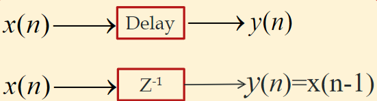

**翻转**
$$
y(n)=x(-n)
$$

**加法**
$$
y(n)=x_1(n)+x_2(n)
$$

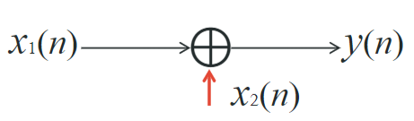

**乘法**
$$
y(n)=x_1(n)\cdot x_2(n)
$$

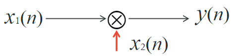

**缩放**
$$
y(n)=c\cdot x(n)
$$

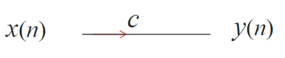

**抽样**

分为**抽取（下采样）**和**插值（上采样）**

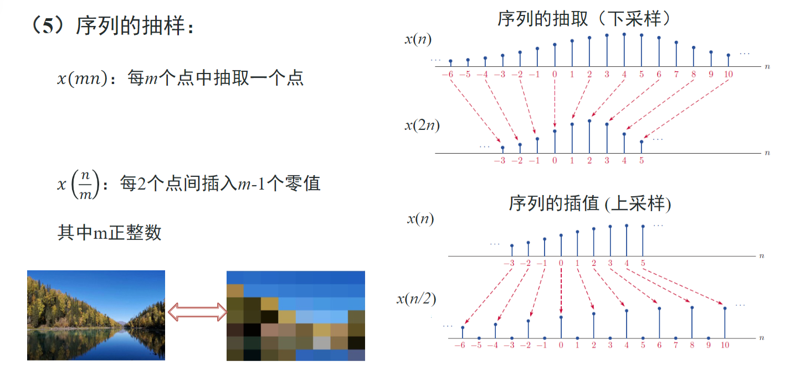

插值一般**插0**或**均值**

### 1.4 离散系统

将输入转换为输出的一种运算，$y(n)=T[x(n)]$，其中$T[]$是离散系统

例：已知输入输出关系$y(n)=0.25y(n-1)+0.5[x(n)+x(n-1)]$，画出系统的离散时间结构图

解：

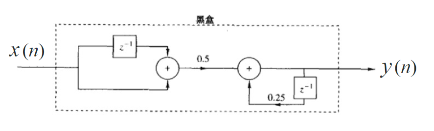

### 1.5 离散时间系统分类

**静态系统（无记忆）与动态系统（记忆）**

输出只取决于**此刻**的输入，为无记忆系统

**时变系统与时不变系统**

同SaS1

例：判断$y(n)=x(-n)$是否时变

解：令$x_1(n)=x(n-N)$，则$y_1(n)=x_1(-n)=x_1(-n-N)$，$x(n-N)$的输出则是$y(n-N)=x(N-n)$

​		故时变

**线性系统与非线性系统**

同时满足**叠加性**和**齐次性**

$y(n)=ax(n)+b$是增量线性系统

**因果系统与非因果系统**

输出与之后的输入无关，为因果

形如$y(n)=f[x(n),x(n-m),y(n-k)],k>0,m>0$为**因果**系统

**稳定系统与非稳定系统**

对于有界输入，输出有界，则稳定

### 1.6 离散时间LTI系统分析

$x(n)$可以表示为所有时刻$x(k)$值的累加和，即$x(n)=\sum\limits_{k=-\infty}^{+\infty}x(k)\delta(n-k)$

又已知$\delta(t)\rightarrow h(t)$，系统是LTI系统，得到$\delta(n-k)\rightarrow h(n-k),\sum x(k)\delta (n-k)\rightarrow \sum x(k)h(n-k)=x(n)*h(n)$

故$y(n)=x(n)*h(n)$，该式称为离散卷积

**离散卷积的过程**

观察公式$\sum x(k)h(n-k)$，得到以下四步

1. 将$h(k)$反转，得到$h(-k)$
2. 将$h(-k)$向右位移n，得到$h(n-k)$
3. 将$x(k)$和$h(n-k)$对应值相乘
4. 将所有k处的乘积相加，得到$y(n)$

若序列$x(n)$和$h(n)$分别长N、M，**卷积和/线性卷积**的序列长度为**N+M-1**

例：一个LTI系统，$h(n)=\{1,2,2,-1\}$，输入$x(n)=\{1,2,3,1\}$，求输出结果

解：首先反转$h(n)$（或$x(n)$，都行）得到$h(-n)=\{-1,2,2,1\}$

​		然后从无穷远处向右移动$h(-n)$，第一个结果是$x(1)=1$与$h(4)=1$相交

​		然后再移动直到分离，最终序列为$y(n)=\{1,4,9,10,6,-1,-1\}$，个数符合4+4-1=7个

**注：**序列表示法用箭头表示0时刻的位置

卷积和表明，n时刻系统的输出，与之前的输入也有关

即某一时刻的输出是**之前很多次输入乘以**各自的**衰减系数**之后的**叠加**

**卷积遵守的数学定律**

交换律：$x(n)*h(n)=h(n)*x(n)$

结合律：$x(n)*[h_1(n)*h_2(n)]=[x(n)*h_1(n)]*h_2(n)$

分配律：$x(n)*[h_1(n)+h_2(n)]=x(n)*h_1(n)+x(n)*h_2(n)$

可以用框图证明

**卷积用途**

1. 是数据变化更加**平滑**
2. **提取**图像或者数据的**特征**

### 1.7 LTI系统的因果性和稳定性

**因果性**

对于LTI系统，因果性与**$h(n)=0,n<0$**互为**充要条件**

利用卷积的展开形式证明：
$$
y(n)=\sum h(k)x(n-k)=\sum\limits_{k=0}^\infty h(k)x(n-k)+\sum\limits_{k=-\infty}^{-1}h(k)x(n-k)
$$
后一项为0

例：已知$h(t)=a^nu(n)$，求阶跃响应

解：$y(n)=\sum\limits_{k=-\infty}^{\infty}a^ku(k)u(n-k)=\sum\limits_{k=0}^na^k=\frac{a^{n+1}-1}{a-1}$

等比数列求和公式：$S_n=a_1\frac{1-q^n}{1-q}$

**稳定性**

LTI系统，稳定与$\sum\limits_{n=-\infty}^{+\infty}|h(n)|<\infty$互为**充要条件**

利用有界性的定义证明

### 1.8 有限/无限冲击响应

**有限（Finite Impulse Response,FIR）**

即$h(n)=0$，当$n<0,n\geq M$时，此时$y(n)=\sum\limits_{k=0}^{M-1}h(k)x(n-k)$

**无限（IIR）**

即$h(n)$的非零区间无限大，此时$y(n)=\sum\limits_{k=-\infty}^{\infty}h(k)x(n-k)$

### 1.9 差分方程描述的离散时间系统

N阶线性常系数差分方程，形如
$$
\sum\limits_{i=0}^Na_iy(n-i)=\sum\limits_{j=0}^Mb_jx(n-j)
$$
线性：$y(n-i),x(n-j)$只有一次幂，无交叉项

常系数

N阶：输出的阶次确定

方框图见**1.3的位移运算**

## 2 信号采样与重建

与信号与系统1所讲一致，这里再操作一遍

**整个流程**

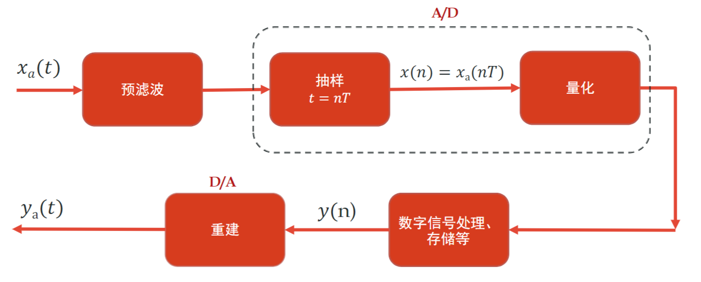

### 2.1 预滤波

不是必须的

当采样频率无法提升时，使用预滤波将原始信号$\omega >\frac{\omega_s}{2}$部分的信号过滤，防止混叠
$$
x(t)=x_a(t)*h_1(t)
$$

$$
X(j\Omega)=X_a(j\Omega)\cdot H_1(j\Omega)
$$

其中$H_1(\Omega)=\begin{cases}1 \,\,\,, |\Omega|\leq \Omega_s/2\\ 0\,\,\,, o.w.\end{cases}$

### 2.2 抽样

这里讨论理想抽样模型，使用冲击串（非理想是阶跃串）

$\hat{x}_a(t)=x_a(t)\cdot p_\delta(t)$，其中$p_\delta(t)=\sum\limits_{k=-\infty}^{+\infty}\delta(t-kT)$

为了方便积分变化，将采样函数级数展开，$p_\delta(t)=\sum a_ke^{j\frac{2\pi}{T}kt},a_k=\frac{1}{T}\int_T{p_\delta(t)e^{-j\frac{2\pi}{T}kt}dt}=\frac{1}{T}$

已知$\mathcal{F}\{e^{j\Omega_s kt}\}=2\pi \delta(\Omega-k\Omega_s),\Omega_s=\frac{2\pi}{T},\delta(t-T)*x(t)=x(t-T)$

故有
$$
\hat{X}_a(j\Omega)=\frac{1}{2\pi}X_a(j\Omega)*P_\delta(j\Omega)
$$

$$
P_\delta(j\Omega)=\frac{2\pi}{T}\sum\delta(\Omega-k\Omega_s)
$$

得到
$$
\hat{X}_a(j\Omega)=\frac{1}{T}\sum{X_a(j\Omega-jk\Omega_s)}
$$
抽样得到的频谱是$X_a(j\Omega)$以$\Omega_s$为周期的延拓，幅度变为1/T

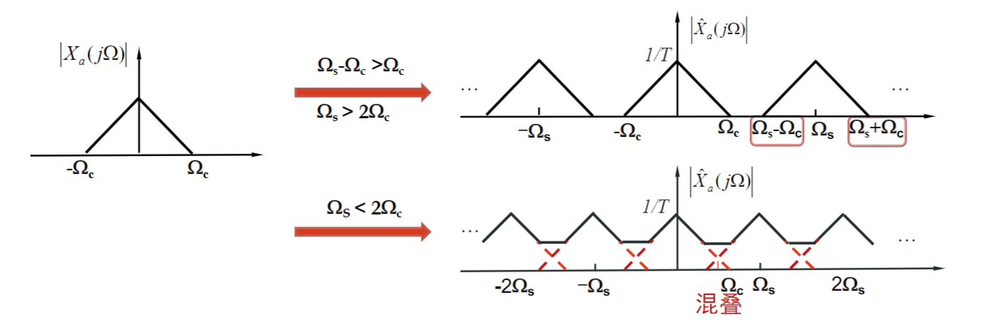

其中$\Omega_c$是原始信号的奈奎斯特频率，当$\Omega_s-\Omega_c>\Omega_c\Rightarrow\Omega_s>2\Omega_c$时，才不会产生混叠，此时唯一重建信号

实际上可以不可以等于，但一般没问题

定义**信号**的折叠频率为$\Omega_s/2$，也就是预滤波的上限频率

### 2.3 重建

首先需要取出一个周期的频谱，很显然用幅值为T的低通滤波器$H_r(j\Omega)=\begin{cases}T\,\,\,,|\Omega|\leq\Omega_s/2\\0\, \,\,\,,o.w.\end{cases}$

这个滤波器对应的时域函数为$h_r(t)=\frac{T}{\pi t}\sin(\frac{\pi t}{T})=\mathsf{sinc}(\frac{t}{T})$，其中$\mathsf{sinc}(x)=\frac{\sin(\pi x)}{\pi x}$

这在实际上是做不到的，我们无法得到一个无限长的信号

所以这是理想重建，有
$$
\begin{align}
    x_r(t)=\hat{x}_a(t)*h_r(t) &=\left(x_a(t)\cdot p_\delta(t)\right)*h_r(t) \\
&=\left(\sum x_a(kT)\delta(t-kT)\right)*h_r(t)\\
&=\sum x_a(kT)h_r(t-kT)
\end{align}
$$
故重建信号就是由采样点为中心的sinc函数的加权和，这是由采样点**内插**得到的结果

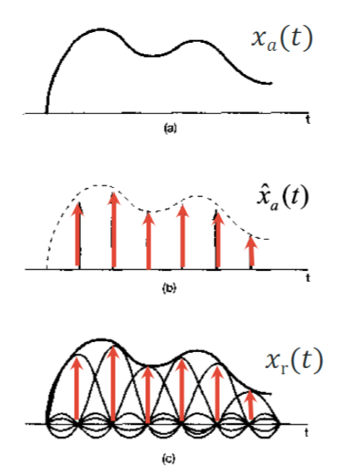

上图就是采样和重建的过程在图像上的显示

c的过程相当于对一个离散信号的频谱（有限），在最高频率之外加0值，不改变频谱图像，但是原图像对于新的图像来说就是一个加窗，也就是用低通滤波器重建

### 2.4 关于奈奎斯特率的几个结论

对于信号$x(t), y(t)$，其奈奎斯特频率分别是$f_x,f_y$，那么下面几个信号的奈奎斯特率分别是

1. $x(at)\Leftrightarrow \frac{1}{|a|}X(\frac{\omega}{a})$，为$2|a|f_x$
2. $x(t)+y(t)$，为$2\max\{f_x,f_y\}$
3. $x(t)* y(t) \Leftrightarrow X(\omega)Y(\omega)$，为$2\min\{f_x,f_y\}$
4. $x(t)\cdot y(t)\Leftrightarrow \frac{1}{2\pi} X(\omega)*Y(\omega)$，为$2(f_x+f_y)$

## 3 Z变换

### 3.1 从Laplace到Z

对连续信号$x_a(t)$采样得到$x(n)=x_a(nT_s)$，对$x(n)$做Laplace变换
$$
\begin{align}
\mathcal{L}[x(n)]&=\int_{-\infty}^{+\infty} x(n)e^{-st}dt\\
&=\sum\limits_{n}x_a(nT_s)\int_{-\infty}^{+\infty}\delta(t-nT_s)e^{-st}dt\\
&=\sum\limits_{n=-\infty}^{+\infty}x_a(nT_s)e^{-snT_s}\\
&\triangleq X(e^{sT_s})\\
\end{align}
$$
令$z=e^{sT_s}$，得到
$$
X(z)=\sum\limits_{n=-\infty}^{+\infty}x(n)\cdot z^{-n}
$$
这就是Z变换的公式

类似的，有单边Z变换

**s到z的映射**

$s=\sigma + j\Omega\Rightarrow z=e^{\sigma T_s}\cdot e^{j\Omega T_s}\triangleq re^{j\omega}$

当$\sigma<0$时，$r<1$，对应于单位圆内；$\sigma>0$则映射到单位圆外

$\omega=\Omega T_s=2\pi F/F_S$，$\Omega$每变化$2\pi F_s$都对应一个$\omega$，有周期性

$\sigma$映射为圆半径，$\Omega$映射为角度

特别的，当$r=1$时，$X(z)=\sum x(n)z^{-n}$退化为$X(\omega)=\sum x(n)e^{-j\omega n}$，为离散时间傅里叶变换（DTFT）

### 3.2 收敛域ROC

只有$X(z)$收敛，这个变换才有意义，因此必须满足

1. X(z)绝对可和，$\sum|x(n)z^{-n}|<\infty$
2. 所有满足上式的$|z|$，组成了z变换的ROC
3. $X(z)=\frac{P(z)}{Q(z)}$，0点极点

必须指明收敛域

有限长度的信号ROC是**整个z平面**，但是z=0和z=∞需要另外考虑

### 3.3 典型序列的z变换

牢记：$\sum\limits_{i=1}^na_i=a_1\frac{1-q^n}{1-q}$

**单位抽样序列**
$$
\Delta(z)=\sum \delta(n)z^{-n}=1\,\,\,\,\,\,\, ROC:0\leq|z|\leq\infty
$$

**单位阶跃序列**
$$
U(z)=\sum u(n)z^{-n}=\sum\limits_{n=0}^{+\infty}z^{-n}=\frac{1}{1-z^{-1}}\,\,\,\,\,\,\, ROC:|z|>1
$$

**实指数右边序列**

$x(n)=a^nu(n)$
$$
X(z)=\sum\limits_{n=0}^{+\infty}a^nz^{-n}=\sum\limits_{n=0}^{+\infty}\left(\frac{a}{z}\right)^n=\frac{1}{1-a/z}\,\,\,\,\,\,\,\, ROC:|z|>a
$$
一般右边序列的ROC一定在最大极点的圆周外（考虑s平面上最大极点的右边）

实指数左边序列和双边序列同理，不赘述

### 3.4 Z反变换

将$X(z)$表示为分式，最终化为分式之和，逆变换

例：$X(z)=\frac{1}{(1-1/4z)(1-1/2z)},ROC:|z|>1/2$，求$x(n)$

解：$X(z)=\frac{2}{1-1/2z}-\frac{1}{1-1/4z}$，得到$x(n)=2\left(\frac{1}{2}\right)^nu(n)-\left(\frac{1}{4}\right)^nu(n)$

### 3.5 Z变换性质和定理

**线性**
$$
Z[a_1x_1(n)+a_2x_2(n)]=a_1X_1(z)+a_2X_2(z),ROC:ROC_1\cap ROC_2
$$

**时移**
$$
Z[x(n-n_0)]=z^{-n_0}X(z),ROC:ROC_x
$$

**Z域尺度变换**
$$
Z[a^nx(n)]=X\left(\frac{z}{a}\right),ROC:|a|ROC_x
$$

**时间反转**
$$
Z[x(-n)]=X(z^{-1}),ROC:\frac{1}{r_2}<|z|<\frac{1}{r_1}
$$

**Z域微分**
$$
Z[nx(n)]=-z\frac{dX(z)}{dz},ROC:ROC_x
$$

**时域卷积**
$$
Z[x_1(n)*x_2(n)]=X_1(z)\cdot X_2(z),ROC:ROC_1\cap ROC_2
$$

**序列相关**

定义相关操作：$r_{x_1,x_2}(l)=\sum\limits_{n=-\infty}^{+\infty}x_1(n)x_2(n-l)=x_1(l)*x_2(-l)$
$$
Z[r_{x_1,x_2}(l)]=R_{x_1,x_2}(z)=X_1(z)\cdot X_2(z^{-1})
$$

**初值定理**

对因果序列$x(n)$，有
$$
\lim\limits_{z\rightarrow \infty}X(z)=x(0)
$$

## 4 系统的差分方程

### 4.1 LTI系统的系统函数

一个系统$y(n) = x(n)* h(n)$，两边Z变换，得到
$$
Y(z)=X(z)\cdot H(z)
$$
其中$H(z)$就是系统函数，$H(z)=\sum\limits_{n=-\infty}^\infty h(n)z^{-n}$，$h(n)$是单位冲激响应

**系统稳定性**

充要条件是$\sum\limits_{n=-\infty}^\infty|h(n)|<\infty$，也就是$|z|=1$时$H(z)$收敛

因此当ROC包含$|z|=1$时系统稳定

其实就是系统在的傅里叶变换存在，即在s平面上包含虚轴

**系统因果性**

这里默认$H(z)=\frac{Q(z)}{P(z)}$，那么充要条件就是ROC在最大极点之外

参考s平面上在最大极点的右边为ROC

那么一个因果系统的充要条件就是$ROC =  R_h <|z|\leq\infty,|R_h|<1$

也就是所有的极点都在单位圆内

### 4.2 单边Z变换

定义单边z变换为
$$
X^+(z) = Z[x(n)u(n)]=\sum\limits_{n=0}^\infty x(n)z^{-n}
$$
其特点是

1. 对因果信号来说无所谓单不单边
2. ROC总在最大极点之外

**位移性**

假设$k>0$，那么有
$$
Z^+[x(n-k)] = z^{-k}[X^+(z)+\sum\limits_{n=1}^kx(-n)z^n]\\
Z^+[x(n+k)] = z^{k}[X^+(z)-\sum\limits_{n=0}^{k-1}x(n)z^{-n}]
$$

### 4.3 常系数线性差分方程

形如
$$
\sum\limits_{i=0}^N a_iy(n-i) = \sum\limits_{j=0}^Mb_jx(n-j)
$$
若$y(n)$的初始状态为0，且$x(n)$是因果序列，那么两边z变换，得到
$$
\sum\limits_{i=0}^N a_iz^{-i}Y(z) = \sum\limits_{j=0}^Mb_jz^{-j}X(z)
$$
得到的系统函数一般是$H(z) = \frac{Q(z)}{P(z)}$

如果存在初始状态，那么就用单边Z变换

### 4.4 系统框图

**直接I型系统结构**
$$
Y(z) = \frac{b_0+b_1z^{-1}+b_2z^{-2}+\ldots + b_Mz^{-M}}{1+a_1z^{-1}+a_2z^{-2}\ldots + a_Nz^{-N}}\cdot X(z)
$$
那么结构为

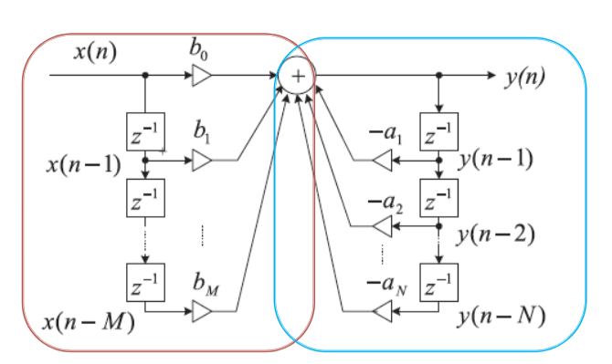

注意到这很直接，$x(n-j)$的系数都在左边，$y(n-i)$的系数**的负数**都在右边

**直接II型系统结构**

和SaS I中的直接型框图类似，方程同上，结果如下

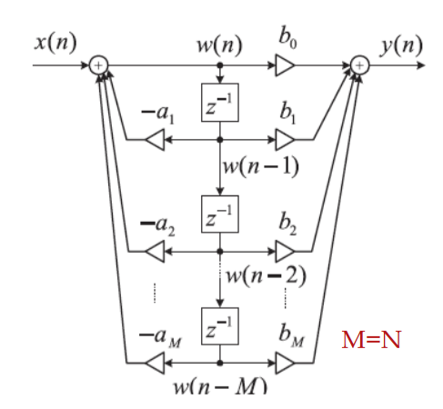

也就是分母是输入的负反馈，分子是输出

当然还有串联型和并联型框图，不赘述

## 5 数字信号的频域分析

### 5.1 连续周期信号的傅里叶级数

信号$x(t)=x(t+T)$，基波频率$\Omega_0 = \frac{2\pi}{T}$，谐波频率$\Omega_k = \frac{2\pi k}{T},k\in\Z$

可以将信号分解为傅里叶级数，也可以由傅里叶级数合成原始信号
$$
x(t) = \sum\limits_{k=-\infty}^\infty C_k e^{j\frac{2\pi}{T}kt }\\
C_k = \frac{1}{T}\int_T x(t) e^{-j\frac{2\pi}{T}kt}dt
$$
存在帕萨瓦关系，平均功率$P_x$和功率谱密度$|C_k|^2$的关系为
$$
P_x = \frac{1}{T}\int_T|x(t)|^2dt = \sum\limits_{k=-\infty}^\infty |C_k|^2
$$

### 5.2 连续非周期时间信号的傅里叶变换

将周期拉为无限长，得到傅里叶变换
$$
x(t) = \frac{1}{2\pi}\int_\infty X(j\omega)e^{j\omega t}d\omega\\
X(j\omega) = \int_\infty x(t)e^{-j\omega t}dt
$$
能量谱密度为$S_{xx}(\omega) = |X(\omega)|^2$

帕萨瓦关系为
$$
E_x = \int|x(t)|^2dt = \frac{1}{2\pi}\int|X(j\omega)|^2d\omega
$$

### 5.3 离散周期时间信号的傅里叶级数（DTFS）

离散信号$x(n)$满足$x(n) = x(n+N)$，基波频率$\Omega_s = \frac{2\pi}{N}$，谐波频率$\Omega_k = \frac{2\pi k}{N},k\in\Z$

同样可以分解为傅里叶级数
$$
x(n) = \sum\limits_{k=0}^{N-1}C_k e^{j\frac{2\pi}{N}kn}\\
C_k = \frac{1}{N} \sum\limits_{n=0}^{N-1}x(n) e^{-j\frac{2\pi}{N}kn}
$$
功率谱密度为$|C_k|^2$

帕萨瓦关系为
$$
P_x = \sum\limits_{k=0}^{N-1}|C_k|^2 = \frac{1}{N}\sum\limits_{n=0}^{N-1}|x(n)|^2
$$
$C_k$往往是一个复数，其相位谱的含义就是这个频率的分量的时延

### 5.4 离散非周期时间信号的傅里叶变换（DTFT）

将周期拉为无限长，得到傅里叶变换
$$
x(n) = \frac{1}{2\pi}\int _{-\pi}^{\pi} X(\omega)e^{j\omega n }d\omega\\
X(\omega) = \sum\limits_{n=-\infty}^\infty x(n)e^{-j\omega n}
$$
观察下面的式子（DTFT），不难发现$X(\omega) = X(\omega + 2\pi)$，故实际操作中只看一个周期$[-\pi,\pi]$的频谱

在时域上$x(n)$非周期，得到的$X(\omega)$是**连续函数**，有对应的相位谱和幅度谱，**相位谱的值域为$[-\pi,\pi]$**

能量谱密度为$S_{xx}(\omega) = |X(\omega)|^2$

帕萨瓦关系为
$$
E_x = \sum\limits_{n=-\infty}^\infty|x(n)|^2 = \frac{1}{2\pi}\int_{-\pi}^{\pi}|X(\omega)|^2d\omega
$$
实际上，DTFT就是在$r=1$时的$Z$变换，上文已经证明

**常用的DTFT变换对**

**指数序列**

$x(n) = a^nu(n),|a|<1$，带公式得到
$$
X(\omega) = \frac{1}{1-ae^{-j\omega}}
$$
这个信号的幅度谱为$|X(\omega)| =\left| \frac{1}{1-a\cos\omega+ja\sin{\omega}} \right|=\frac{1}{\sqrt{(1-a\cos\omega)^2+(a\sin{\omega})^2}}=\frac{1}{\sqrt{1+a^2-2a\cos\omega}}$

相位谱为$\angle X(\omega) = -\tan^{-1}{\frac{a\sin{\omega}}{1-a\cos{\omega}}}$

**窗序列**

定义窗序列为
$$
x(n) = 
\begin{cases}
1\,\,\,\, -L\leq n\leq L\\
0\,\,\,\, o.w.
\end{cases}
$$
那么$X(\omega)$就是
$$
X(\omega) = \frac{\sin\left[(L+1/2)\omega\right]}{\sin{(\frac{1}{2} \omega)}}
$$
**如果频域上是窗函数呢？**
$$
x(n) = \frac{1}{2\pi}\int_{-\pi}^\pi X(\omega)e^{j\omega n}d\omega=
\begin{cases}
\frac{\sin(n\omega_c)}{\pi n}\,\,\,\,\, n\neq0\\
\frac{\omega_c}{\pi}\,\,\,\,\, n=0
\end{cases}
$$
其中$\omega_c$是奈奎斯特频率

注意需要将$n=0$的情况分开，因为$n=0$指数项消失了

**吉布斯现象**

就是窗函数边缘是振荡的，因为做不到时域无限长的信号，相当于将无限长的信号在时遇上乘一个窗函数

那么频域就是一个理想的窗函数卷积一个辛格函数，就造成了边缘的振荡

吉布斯现象就是在$X(\omega)$的不连续点处，$X_N(\omega)$逼近$X(\omega)$的振荡行为

**DTFT的性质**

1. 线性，$ax_1(n)+bx_2(n) \leftrightarrow aX_1(\omega)+bX_2(\omega)$
2. 时移特性，$x(n-k)\leftrightarrow X(\omega)e^{-jk\omega}$
3. 频移特性，$x(n)e^{j\omega_0n} \leftrightarrow X(\omega - \omega_0)$
4. 翻转特性，$x(-n)\leftrightarrow X(-\omega)$
5. 时域微分，$\frac{d}{dn}x(n) \leftrightarrow j\omega X(\omega)$
6. 频域微分，$nx(n) \leftrightarrow j\frac{d}{d\omega}X(\omega)$
7. 卷积定理，$x_1(n)*x_2(n) \leftrightarrow X_1(\omega)\cdot X_2(\omega)$
8. 窗口定理/调制定理，$x_1(n)\cdot x_2(n) \leftrightarrow \frac{1}{2\pi}X_1(\omega)*X_2(\omega)$
9. 共轭对称，若$x(n)$为实信号，那么$X(\omega) = X^*(-\omega)$，这个定理说明，在实信号的DTFT中，只需要变换一半的频谱

**一些例子**

对下面的信号做DTFT

这是一个窗函数乘以相位因子，如果$x(n)$是窗函数，那么这个信号就是$y(n) = e^{j\pi n}x(n)$，其DTFT就是$X(\omega-\pi)$，就可以从低通滤波器变成高通

对下面的信号做iDTFT

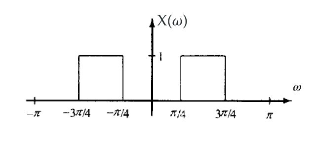

这是一个大窗减去小窗，是长度为$3\pi/2$的频域窗减去一个长度为$\pi/2$的频域窗，得到的时域信号也就是二者相减
$$
x(n) = 
\begin{cases}
\frac{1}{\pi n }(\sin(\frac{3\pi}{4}n)-\sin(\frac{\pi}{4}n))\,\,\, n\neq 0\\
\frac{1}{2}\,\,\, n=0
\end{cases}
$$

例：已知$X(\omega)$，求$x(2n+1)$的DTFT

解：常规做法是$N=2n+1 \rightarrow x(N)$，但是$x(2n+1)$是一个奇数序列，那么在
$$
X_1(\omega) = \sum_{N} x(N)e^{-j\omega \frac{N}{2}}e^{j\frac{\omega}{2}}
$$
这里，$N$是一个奇数序列，换言之这个不是常规的DTFT，故不能这么做

观察到
$$
\hat{x} = \frac{1}{2}(x+(-1)^{n+1}x)=\frac{1}{2}(x-e^{jn\pi}x)
$$
利用DTFT的性质进行变换

但是观察到$x(2n+1)$是对序列$\hat{x}(n)$的平移加缩放，因此还需要进行变换

此时有$X_1(\omega) = \sum\limits_{N}x(N)e^{-j\omega\frac{N}{2}}e^{j\omega/2}$，这里是奇数序列，可以用$\hat{x}(n)$代替，得到
$$
X_1(\omega) = e^{j\frac{\omega}{2}}\hat{X}(\frac{\omega}{2})
$$

## 6 数字LTI系统的频域分析

### 6.1 LTI系统的特性

输出信号$y(n)$可以表达为输入信号$x(n)$和单位冲激响应$h(n)$的卷积
$$
y(n) = h(n)*x(n)
$$
当$x(n) = A e^{j\omega_0 n}$时，特别的$y(n)=H(\omega)Ae^{j\omega n}$，证明如下
$$
\begin{align}
y(n) &= h(n)*x(n)=\sum_{k=-\infty}^\infty h(k)\cdot x(n-k)\\
&=\sum_{k} h(k)e^{-j\omega_0 k}\cdot e^{j\omega n}\\
&=H(\omega_0)x(n)
\end{align}
$$
称$e^{j\omega_0 n}$为系统的特征函数，$H(\omega_0)$为系统的特征值

**$H(\omega)$的特性**
$$
H(\omega) = \sum_k h(k)\cos(\omega k)+jh(k)\sin{\omega k}
$$
对于实系统，$h(n)$为实数，那么有$H(\omega) = H_R(\omega)+jH_I(\omega)$，其中
$$
|H(\omega)| = \sqrt{H_R^2+H_I^2}\\
\angle H = \tan^{-1}\frac{H_I}{H_R}
$$
不难看出$|H|$是偶函数，$\angle H$是奇函数，$H(\omega)$有共轭对称性

**滑动平均Filter**

一个3点滑动Filter可以表示为
$$
y(n) = \frac{1}{3}[x(n-1)+x(n)+x(n+1)]
$$
那么$H(\omega)=\frac{1}{3}(1+2\cos(\omega)),|H|=|H(\omega)|$（这里是绝对值），$\angle H = \angle(1+2\cos(\omega))$（注意正负）

图像如下

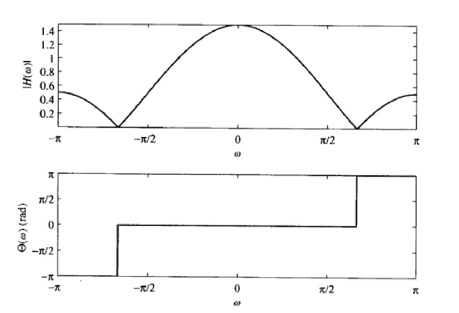

### 6.2 有理分式系统的响应

当一个系统函数可以表达为
$$
H(\omega)=b_0e^{j\omega k}\frac{\Pi (e^{j\omega}-z_i)}{\Pi(e^{j\omega}-p_i)}
$$
时，可以使用0极点图对$|H|,\angle H$进行估计，从而大致判断通频带

注意DTFT是$r=1$的特殊的Z变换，故实验点应该在**单位圆**上，如下图

进行估计时只需要将角度$\omega$从0°转到$\pi$就行，根据共轭对称性得到另一边

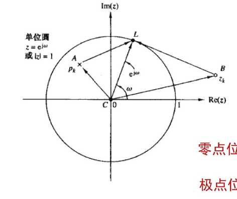

### 6.3 作为频率选择滤波器的LTI系统

$$
y=h*x\\
|Y| = |H||X|\\
\angle Y=\angle H+\angle X
$$

**$|Y|$与通频带有关**

一个滤波器的通频带可以通过0极点图进行估计，大致而言存在以下关系

1. 极点越靠近低频点的单位圆，通频带越低
2. 将低通滤波器的0极点关于虚轴对称，可以得到高通滤波器

**$\angle Y$与滤波器相位有关**

信号经过滤波器时相位也会有影响，当然不希望相位被打乱

为了得到有序信号，即$y(n)=Ax(n-k)$，滤波器应当是$|H|e^{-j\omega k}$，相位是$-\omega k$，是线性相位（存在截距也行）

称相位的负倒数$\tau({\omega})=-\frac{d\Theta}{\omega}=k$时**群时延**，是常数

群时延是常数的滤波器才是可以使用的

例：$h(n)=\begin{cases}1,0\leq n\leq N\\0,\, \,\,\,o.w.\end{cases}$是线性相位吗

解：$H(\omega) = \frac{1-e^{-j\omega(N+1)}}{1-e^{-j\omega}}$，$\angle H = \angle (1-e^{-j\omega(N+1)})-\angle(1-e^{-j\omega})$
$$
\angle 1-e^{-j\omega} = \tan^{-1}\frac{\sin\omega}{1-\cos\omega}
$$
使用$2\sin^2\omega/2 = 1-\cos\omega$，化简得到上式右边等于$\tan^{-1}(\tan(\frac{\pi}{2}-\frac{\omega}{2}))=\frac{\pi-\omega}{2}$，同理处理前者，最终得到
$$
\angle H = -\frac{N}{2}\omega
$$
是线性相位

**常见的具有线性响应的滤波器**

只有$h(n)$满足下面的情况时，FIR滤波器才具有线性相位

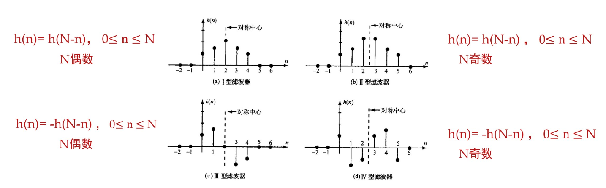

下面求每个滤波器的群时延

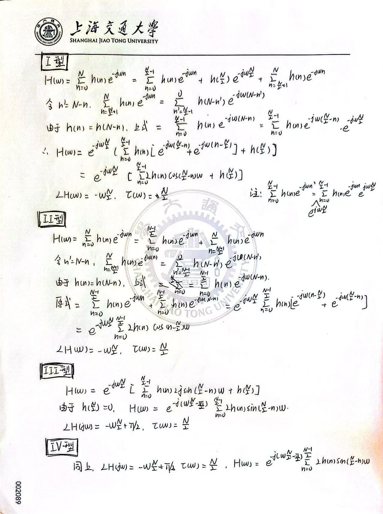

结论，每个滤波器的群时延都是$\tau(\omega)=\frac{N}{2}$

### 6.4 LTI系统的可逆性

系统可逆的充要条件：输出$y$与输入$x$一一对应

那么有
$$
x(n) = h_1(n)*h(n)*x(n)
$$
其中$h_1(n)$是逆系统，那么
$$
h_1*h=\delta\\
H_1H=1\Rightarrow H_1=H^{-1}
$$
求逆系统是要注意收敛域的选取和多值性，如

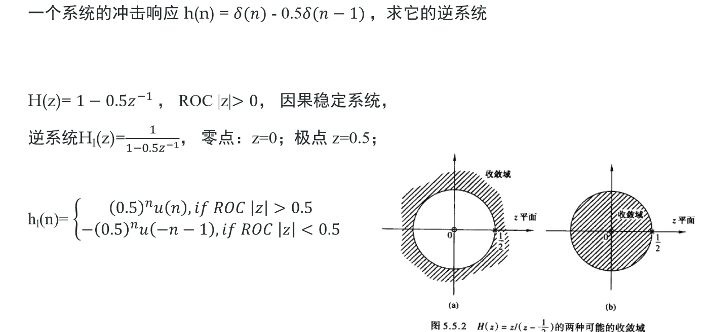

### 6.5 全通系统

对任意频率的信号，全通，即
$$
|H| = 1
$$
为了保证常数群时延，$H = e^{-jk\omega}, H(z)=z^{-k}$

全通系统可以作为**相位补偿**使用

### 6.6 低通高通转换

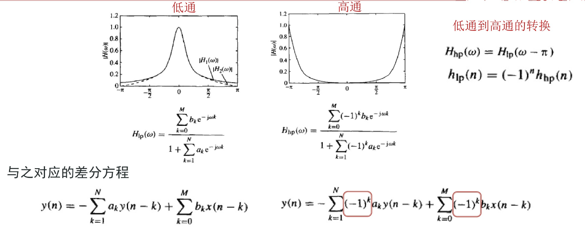

也就是用$\pi-\omega$代换$\omega$

## 7 DFT

### 7.1 DFT的概念

在离散信号经过DTFT后，得到的频谱是连续的，但是数字信号需要离散的表达，由此引出了离散傅里叶变换DFT

DFT表现为对$X(\omega)$进行抽样，表达为
$$
X(k)=X(\omega)|_{\omega=\frac{2\pi}{N}k}\,\,\,, k=0,1,\ldots, N-1
$$
其中$N$是有限长时域信号的长度，因此
$$
X(k)=\sum_{n=0}^{N-1}x(n)e^{-j\frac{2\pi}{N}kn}
$$
令$W_N=e^{-j\frac{2\pi}{N}}$对上式展开，可以发现
$$
X(0)=x(0)+x(1)+\ldots+x(N-1)\\
X(1)=x(0)+x(1)W_N+x(2)W_N^2+\ldots+x(N-1)W_N^{N-1}\\
\ldots\\
X(N-1) = x(0)+x(1)W_N^{N-1}+\ldots+x(N-1)W_N^{(N-1)(N-1)}
$$
因此，可以使用矩阵简化计算，得到

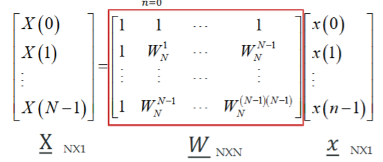

为了得到逆变换，可以假设$x=AX$，带入DFT，得到
$$
X=Wx=WAX
$$
故$WA=I\Rightarrow A=W^{-1}$，得到逆变换为
$$
x(n)=\frac{1}{N}\sum_{k=0}^{N-1}X(k)W_N^{-nk}
$$
矩阵如下

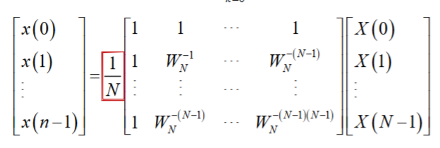

注意，DFT变换对应该有同样的长度

### 7.2 几个变换的区别

**DTFT，DFT，DFS**

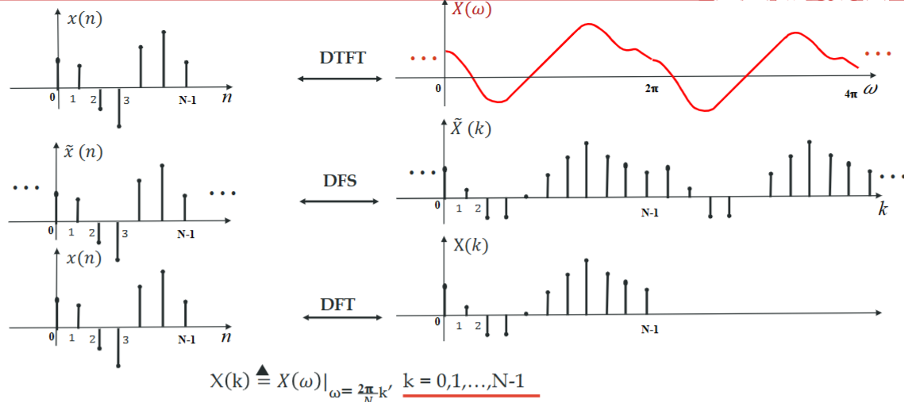

其中$\tilde{x}$是周期信号，对周期信号的DFT称为DFS

DFT和DFS没有本质区别，前者是后者的主值区间，后者是前者的周期延拓

**DTFT，DFT，Z**

容易得到
$$
X(k)=X(z)|_{z=e^{j\frac{2\pi}{N}k}}=X(\omega)|_{\omega=\frac{2\pi}{N}k}
$$

### 7.3 补零，用于信号分析

当想要的$X(k)$序列更加密集时，需要增大$N$的值，此时需要对$x(n)$进行添0处理，即
$$
x^{'}(n)=\
\begin{cases}
x(n)\,\,\,, n<N_0\\
0\,\,\,\,\,\,\,\,\,\,\,\, ,N_0\leq n< N
\end{cases}
$$
即扩展了时域信号，相对的频域信号就会进行压缩，即两个采样点之间的距离会变小，采样更密集

注意：

1. 补零对DTFT无影响，很显然0对累和无效果
2. 对DFT来说，只是增加了采样点，整个信号的包络依然是DTFT的图像
3. 对于周期信号，只有信号的长度是周期的整数倍，DFT的频谱才不会丢失峰值信息

### 7.4 DFT的性质

**圆周位移**

序列的圆周位移的DFT，等价于其周期延拓的线性位移后主周期内的DFT

简单理解就是转过头了就取模

**线性**

易证

**序列共轭**
$$
x^*(n) \leftrightarrow X^*(N-k)
$$
其中$N$是序列长度

**序列圆周位移、相移**
$$
x(n-l) \leftrightarrow X(k)e^{-j\frac{2\pi}{N}kl}\\
x(n)e^{j\frac{2\pi}{N}ln} \leftrightarrow X(k-l)
$$

插播一条DFS的性质：

**周期卷积**

两个周期都为$N$的周期序列，其卷积结果也是周期为$N$的序列
$$
\tilde{y} = \tilde{x}_1 \otimes \tilde{x}_2
$$
**周期卷积定理**
$$
\tilde{Y}(k) = \tilde{X}_1(k) \cdot \tilde{X_2}(k)
$$

对于非周期序列来说，可以用圆周位移来构造圆周卷积

**圆周卷积**
$$
y = x_1 \bigcirc x_2
$$
其中$\bigcirc$中应该有一个$N$，但是这里打不出来，$N$是$x_1,x_2$序列长度；后面统一用$\circledast$代替

圆周卷积与DFT存在对应关系
$$
x_1 \circledast x_2 \leftrightarrow X_1(k)\cdot X_2(k)
$$
**这个东西有什么用？**

圆周卷积本身没有任何物理意义，但是由于其能被对应成DFT直乘，那么就存在一定用处

由于离散序列的卷积对应于DTFT的直乘，而$X(\omega)$是连续函数，这在计算机中是无法做到的

因此，若能有方法使得
$$
x_1(n) * x_2(n) = x_1(n) \circledast x_2(n)
$$
那么就有
$$
X_1(\omega) \cdot X_2(\omega) = X_1(k) \cdot X_2(k)
$$
这样计算机就能做了

**帕斯瓦尔定理**
$$
\sum_{n=0}^{N-1} x(n)y^*(n) = \frac{1}{N}\sum_{k=0}^{N-1}X(k)Y^*(k)
$$

### 7.5 基于DFT的LTI系统：如何让线性卷积等于圆周卷积

**线性卷积**

两个序列$x(n),h(n)$，分别长$L, M$，得到的输出$y(n)$
$$
y(n) = x(n) * h(n) =\sum_{k=1}^{L-1}x(k)h(n-k)
$$
$y(n)$的长度为$N_1=L+M-1$

**圆周卷积**

$y(n)$的长度为$N_2=\max\{L,M\}$(短的一方用0补齐)

因此，想要使用圆周卷积表示线性卷积，那么需要用$N_2\geq N_1=L+M-1$的DFT

例：$h(n)=\{1(0),2,3\},x(n)=\{1(0),2,2,1\}$，使用DFT和iDFT，求$y(n)$

解：线性卷积的长度为6，因此需要使用6点的DFT，得到结果是$y(n)=\{1(0),4,9,11,8,3\}$

​		如果用4点DFT呢？得到的结果是$y(n)=\{9,7,9,11\}$，产生这个结果的原因是$8,3$经过圆周到了$1,4$的位置

​		$1+8=9, 4+3=7$

**利用圆周卷积计算线性卷积**

步骤如下

1. $x(n)$添加$M-1$个0，$h(n)$添加$L-1$个0，二者的长度都是$L+M-1$
2. 利用$L+M-1$点的DFT计算$Y(k)$，逆变换为$y(n)$

优点：在引入FFT后很快

缺点：必须等到所有的信号，延迟巨大

**解决大延迟**

将信号分为小片段进行处理，步骤如下

1. 将$h(n)$补到$L+M-1$，将输入$x(n)$划分为长度为$L$的小段，这个$L$相比于整个序列很小
2. 对输入的$x_i(n)$补$M-1$个0，计算$X_i(k)\cdot H(k)$
3. 得到$y_i(n)$，注意$y_i(n)$之间存在重叠部分，将重叠部分相加，得到$y(n)$

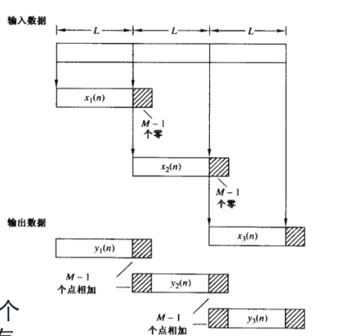

## 8 FFT

### 8.1 为什么有FFT

首先是DFT带来的问题

**频谱泄露**

当截取小片段时，相当于使用了一个长度为$L$的窗，其DTFT是一个主瓣宽度为$\frac{4\pi}{L}$的$\mathsf{sinc}$函数

这样会引入杂波，如下图

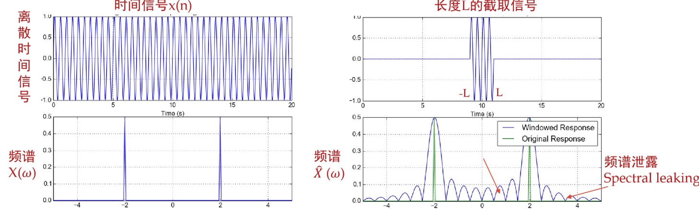

当主瓣很宽时，两个相邻的冲激峰就会重叠，定义当sinc的0点恰好在另一个峰的频率时，两个峰不可辨认

即要求
$$
\frac{2\pi}{L} \leq \min\{\omega_i-\omega_j\}
$$
故小序列不是能无限小的

例：$x(n)=\cos\omega_0 n+\cos\omega_1 n+\cos\omega_2n$，其中$\omega_0=0.2\pi,\omega_1=0.22\pi,\omega_2=0.6\pi$，求序列最短能是多少

解：带入上面的公式，得到$L_{\min}=100$

**DFT对频谱分辨率的影响**

根据定义，$\omega_k = \frac{2\pi k}{N}$，那么$\Delta \omega=\frac{2\pi}{N}$就是$X(k)$在频域的分辨率

为了将DTFT的两个峰$|\omega_1-\omega_2|$在DFT中分开，需要有
$$
\Delta \omega \leq \min\{\omega_1-\omega_2\}
$$

**计算量**

由于$X(k)$的计算都是复数计算，根据公式$N$个序列的DFT计算量为$O(N^2)$

这是NP问题的时间复杂度，非常不好

由此，引出了FFT

### 8.2 FFT的改善思路

首先需要明确，FFT不是一种新的计算，没有物理意义；它只是DFT的一个快速算法

**关键思路**

关键在$W_N^k = e^{-j\frac{2\pi}{N}k}$

1. 对称性：
   $$
   W_N^{k+\frac{N}{2}} = -W_N^{k}
   $$
   
2. 周期性：
   $$
   W_N^{k+N} = W_N^{k}
   $$

预处理：$x(n)$的长度$N$通过补0，到最近的$2^M$

将$x(n)$分为奇偶序列，$x_1(r)=x(2r),x_2(r)=x(2r+1),r=0,1,\ldots,\frac{N}{2}-1$

那么

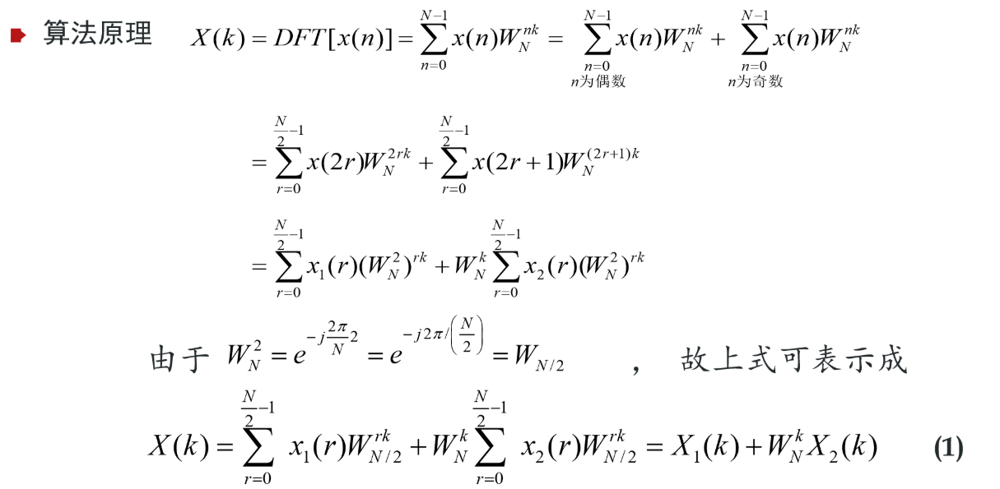

其中$X_1,X_2$分别是$x_1,x_2$的前$N/2$个点的DFT，根据周期性，$W_{N/2}^{k+N/2}=W_{N/2}^k$

那么
$$
X_1(k+N/2) = X_1(k)\\
X_2(k+N/2) = X_2(k)
$$
两部分的$X_i(k)$是相等的

那么得到
$$
X(k) = X_1(k) + W_N^k X_2(k)\\
X(k+N/2) = X_1(k) - W_N^k X_2(k)
$$
这样就将计算DFT的时间复杂度降为了$O(N^2/2)$，因为只算了一半的序列

输出的线路图如下

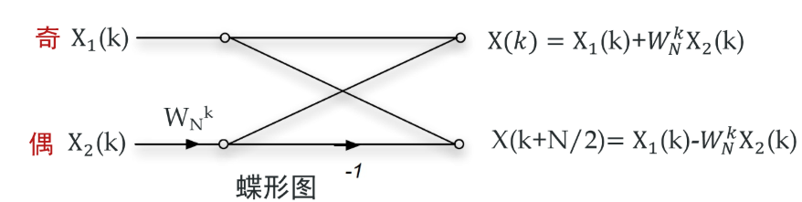

将$X_1(k),X_2(k)$视为新的$X(k)$，上面的算法完全适用，因此一开始需要将$N$scale到$2^M$，就是为了一级级减半

最终可分出$M$级蝶形图，一个蝴蝶图的运算时间是$O(1)$，就只有2次加法和1次乘法

每级一共N/2个蝶形图，需要的运算时间是$O(N/2)$，一共$\log_2N$级，总共花了$\frac{N\log_2N}{2}$的时间，相比于DFT提升了$\frac{2N}{\log_2N}$倍

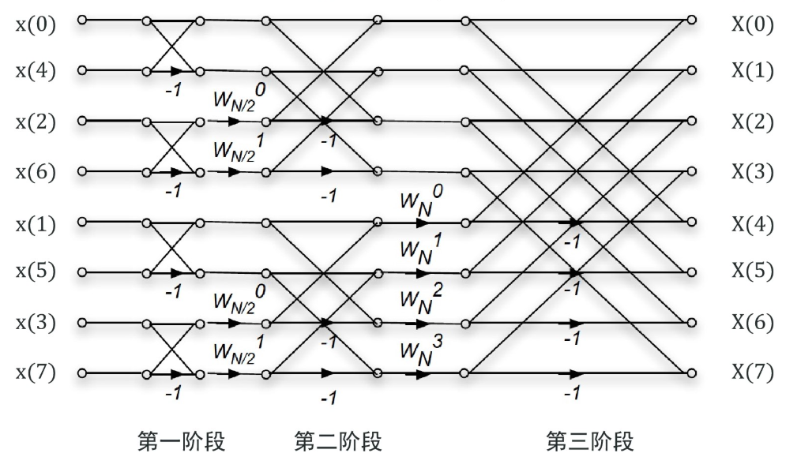

如何计算输入序列的排列

| 原始排列 | 二进制 | 翻转二进制 | 输入序列 |
| :------: | :----: | :--------: | :------: |
|    0     |  000   |    000     |    0     |
|    1     |  001   |    100     |    4     |
|    2     |  010   |    010     |    2     |
|    3     |  011   |    110     |    6     |
|    4     |  100   |    001     |    1     |
|    5     |  101   |    101     |    5     |
|    6     |  110   |    011     |    3     |
|    7     |  111   |    111     |    7     |

## 9 FIR滤波器的设计

数字滤波器就是一个系统，可以用迄今为止所有对系统的描述方式对其进行描述

### 9.1 数字滤波器的分类

根据是否有限，分为FIR和IIR两种，二者的框图如下

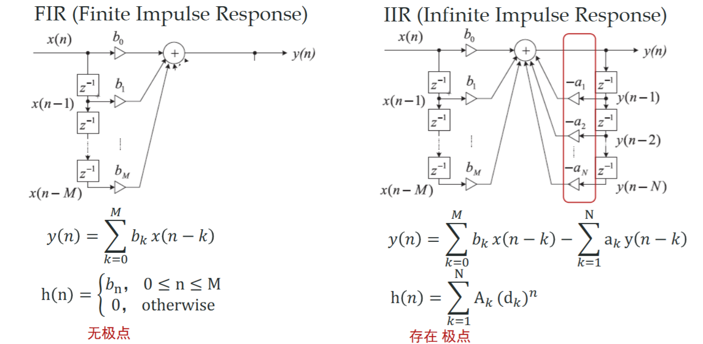

显然FIR滤波器是一定稳定的，IIR滤波器存在极点而是条件稳定

### 9.2 FIR滤波器的基本结构

输入输出关系为
$$
y(n) = \sum_{i=0}^K b_i x(n-i) = \sum_{i=0}^K h(i) x(n-i) = h(n) * x(n)
$$
其中
$$
h(n) = \begin{cases}
b_n\,\,,\,\, 0\leq n \leq K\\
0\,\,\, ,\,\,\, o.w.
\end{cases}
$$
几个性质

* 由于是有限的，可以使用FFT/DFT
* 系统函数是稳定的
* 有严格的线性相位

例：

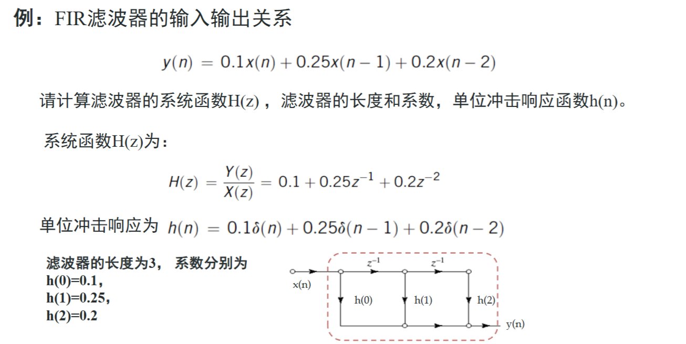

这是一个滑动窗口，用于信号的去噪平滑

**非理想数字滤波器的性能参数**

由于物理系统的限制，不可能做到理想的滤波器，一个典型的物理上能实现的滤波器如下

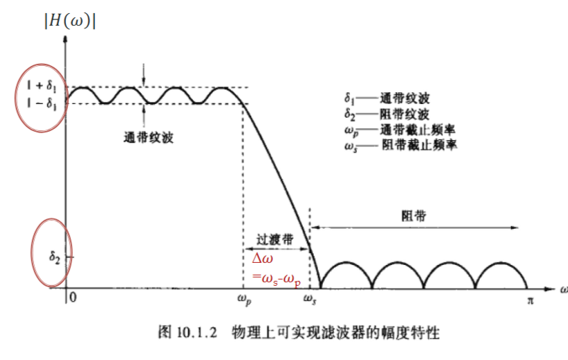

通常采用分贝表示各个波纹大小（$20\lg $）

* $\delta_1$是通带波纹
* $\delta_2$是阻带波纹
* $\omega_p$是通带截止频率
* $\omega_s$是阻带截止频率

**这些是怎么产生的？**

很显然不可能有无限长的时域$\mathsf{sinc}$函数，必须加窗，相当于在频域内的窗函数卷积一个$\mathsf{sinc}$

卷积的结果是sinc在窗内的面积和，即

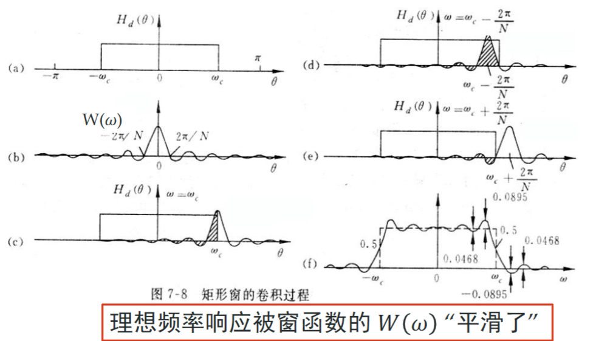

那么$\delta_1,\delta_2$产生自sinc的旁瓣，$\omega_p,\omega_s$产生自规定的通频带分别减/加与滤波器窗长度$N$反相关的量

值得一提的是，在我们希望的截止频率$\omega_c$处，$H_d(\omega_c)=0.5$恒成立

### 9.3 窗函数法设计FIR滤波器

如上所述，对时域的sinc函数加窗产生一个非理想的频域窗函数，步骤如下

1. 对于$h(n)=\mathsf{sinc}(n)$，使用$w(n)=\begin{cases} 1,|n|\leq M\\0,o.w. \end{cases}$截断，产生物理上可实现的有限长信号$h_d(n)=h(n)w(n)$

2. 对$h_d(n)$做DFT/FFT，得到的就是$H_d(\omega) = \frac{1}{2\pi}(H(\omega)*W(\omega))$

3. 在频域中验证$H_d(\omega)$的上述参数是否满足要求，如果满足了就继续操作$h_d(n)$

4. 因为物理系统一定是因果的，故需要对$h_d(n)$进行平移，得到$h_d^{'}(n) = h_d(n-M)$

最终得到的是时域上的信号，这是要产生的信号所以必须是时域的

由于最终结果都是一个频域的窗，故时域的模板是已知的，都是
$$
h(n) = \begin{cases}\
\frac{\omega_c}{\pi} \,\,,\,\, n=0\\
\frac{\sin{\omega_c n}}{n\pi}\,\,,\,\, |n|\leq M ,n\neq 0
\end{cases}
$$
其中$\omega_c$是希望的截止频率

同上述关系，窗函数$W(\omega)$的主瓣宽度正相关于滤波器的过渡带宽$\Delta \omega$，$\delta_1,\delta_2$产生自sinc的旁瓣

例：窗函数法设计3阶低通滤波器，截止频率$f_c=800$Hz，抽样频率$f_s=8000$Hz

解：首先需要有数字频率和模拟频率的关系，数字为$\omega$
$$
\omega = \Omega T_s
$$
这个可以用$x(nT_s) = x(t)$理解，$\omega = \frac{2\pi}{n},\Omega=\frac{2\pi}{t}=\frac{2\pi}{nT_s}$

那么模拟截止频率为$f_c$，数字截止角频率$\omega_c = 2\pi f_c /f_s = 0.2\pi$

带入通式，得到$h(0)=0.2,h(1)=0.1871,h(-1)=0.1871$，还需要进行平移，最终得到
$$
h(0) = 0.1871, h(1)=0.2,h(2)=0.1871
$$
对其做$Z$变换，得到
$$
H(z) = \sum h(n)z^{-n}=0.1871 + 0.2z^{-1}+0.1871z^{-2}
$$
但是，实际进行画图发现，这个滤波器的截止频率大致在2600Hz，原因在于窗太小，如上所述

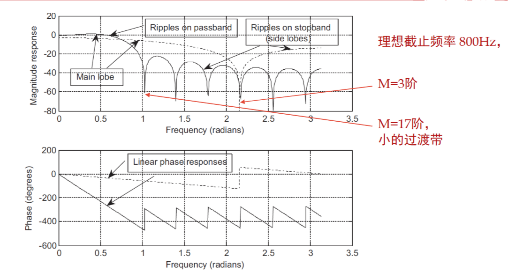

滤波器的实际截止频率$\omega_s$是与时域窗函数截断的长度$M$反相关的

**理想滤波器的原型**

* 低通
  $$
  h(n) = \begin{cases}\
  \frac{\omega_c}{\pi} \,\,,\,\, n=0\\
  \frac{\sin{\omega_c n}}{n\pi}\,\,,\,\, |n|\leq M ,n\neq 0
  \end{cases}
  $$

* 高通，理解为1-低通
  $$
  h(n) = \begin{cases}\
  \frac{\pi-\omega_c}{\pi} \,\,,\,\, n=0\\
  -\frac{\sin{\omega_c n}}{n\pi}\,\,,\,\, |n|\leq M ,n\neq 0
  \end{cases}
  $$

* 带通，理解为两个低通相减
  $$
  h(n) = \begin{cases}\
  \frac{\omega_H - \omega_L}{\pi} \,\,,\,\, n=0\\
  \frac{\sin{\omega_H n}}{n\pi}-\frac{\sin{\omega_L n}}{n\pi}\,\,,\,\, |n|\leq M ,n\neq 0
  \end{cases}
  $$

* 带阻，理解为1-带通
  $$
  h(n) = \begin{cases}\
  \delta(n)-\frac{\omega_H - \omega_L}{\pi} \,\,,\,\, n=0\\
  -\frac{\sin{\omega_H n}}{n\pi}+\frac{\sin{\omega_L n}}{n\pi}\,\,,\,\, |n|\leq M ,n\neq 0
  \end{cases}
  $$

**注意，这些都还需要右移$M$，变成因果系统**

**一般性窗**

除了矩形窗之外，还有别的窗可以选择

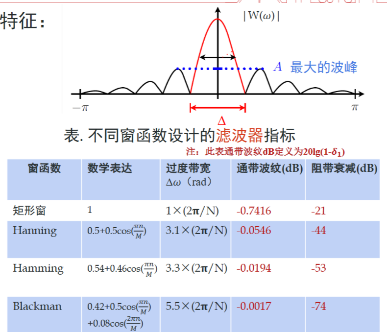

根据要求选择合适的窗，注意，**还需要点乘辛格函数**

一般而言，窗函数的图像有以下性质，规定长度$N=2M+1$

* $N\cdot \Delta = Const$，因此，窗越宽，滤波器越理想
* $|A|$取决于窗的类型，与$N$无关
* $A$与$\Delta$通常反相关，需要trade-off（这里指的是改变了窗函数的类型，时域越平滑的窗函数高频成分越少，A小Δ大）
* 矩形窗的主瓣和造成的过渡带宽更小（其实是一个东西），但是有更大的旁瓣

**FIR滤波器的特点**

* 优点：线性相位；创造的方法简单
* 缺点：不容易控制边缘频率，显然不能做到精准的$\omega_c$；即使精准了，$h(n)$往往很长

**设计步骤**

1. 根据阻带衰减要求和过渡带宽，选择窗函数的类型
2. 根据过渡带宽确定理想滤波器的截止频率，根据窗函数的特性确定窗的长度$N$
3. 平移滤波器，得到因果的系统
4. 根据$h(n)$再求$H(\omega)$，看是否满足要求

例：抽样频率8000Hz，通带要求0-800Hz，阻带1000-4000Hz，通带波纹-0.02dB，阻带衰减-50dB

解：根据上面的表格，hamming和blackman都能满足，选择hamming

​		过渡带宽$\Delta \omega = 2\pi \times (1000-800)\div 8000 = 0.05\pi = 3.3\times2\pi\div N$，得到窗长$N\geq 132$，取$N=133$

​		为什么？下面会讲

​		截止频率就是通带频率和阻带频率的中间值，即$\omega_c = \frac{\omega_s+\omega_p}{2}=2\pi\times 900\div 8000$，用这个算理想滤波器的时域表达式，然后二者相乘得到滤波器表达式

​		将$M = \frac{N-1}{2}$带入滤波器的表达式，平移，得到结果

**不同类型的FIR滤波器的适用情况**

存在以下四种线性相位的FIR滤波器

| 情况i |       h(n)       |  N   |  适用情况  |
| :---: | :--------------: | :--: | :--------: |
|   1   | h(n) = h(N-1-n)  | 奇数 |    全能    |
|   2   | h(n) = h(N-1-n)  | 偶数 | 低通，带通 |
|   3   | h(n) = -h(N-1-n) | 奇数 |    带通    |
|   4   | h(n) = -h(N-1-n) | 偶数 | 高通，带通 |

### 9.4 频率抽样法设计FIR滤波器

基本想法是根据理想滤波器的$N$个点确定实际FIR滤波器的DFT，然后做iDFT得到满足这些点的$h(n)$

即，给定理想的$H_d(\omega)$，进行采样，使得$|H(k)| = |H_d(\omega)|_{\omega= \frac{2\pi}{N}k}$，其中$k=0,1,\ldots,N-1$

然后得到$h(n) = \mathsf{iDFT}\{H(k)\}$

为了得到线性相位的滤波器，辐角必须是
$$
\varphi(\omega) = -\left(\omega\frac{N-1}{2}-\beta\right)
$$
其中当$h(n)$奇对称时$\beta=\frac{\pi}{2}$，偶对称时$\beta=0$

对于$H(k)$，将$\omega$换成$\frac{2\pi}{N}k$，带入iDFT的公式

对于$h(N-1-n)=h(n), N=2M+1$的滤波器
$$
h(n) = \frac{1}{N}\left[H(0)+2\sum_{k=1}^{M}|H(k)|\cos\left(\frac{2\pi k(n-M)}{N}\right)\right]
$$
其中$M = \frac{N-1}{2}, n=0,1,\ldots,N-1$，用到了$H^*(k)=H(N-k)$

对于$h(N-1-n) = h(n),N=2M$的滤波器，则
$$
h(n) = \frac{1}{N}\left[H(0)+2\sum_{k=1}^{M-1}|H(k)|\cos\left(\frac{2\pi k}{N}\left(n-\frac{N-1}{2}\right)\right)\right]
$$
其余见下图

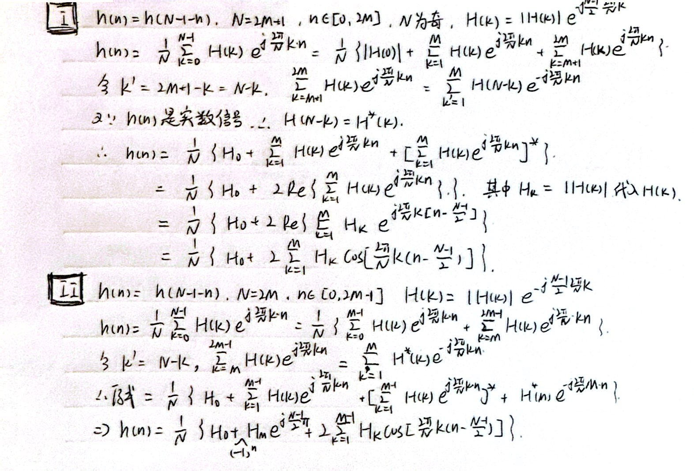

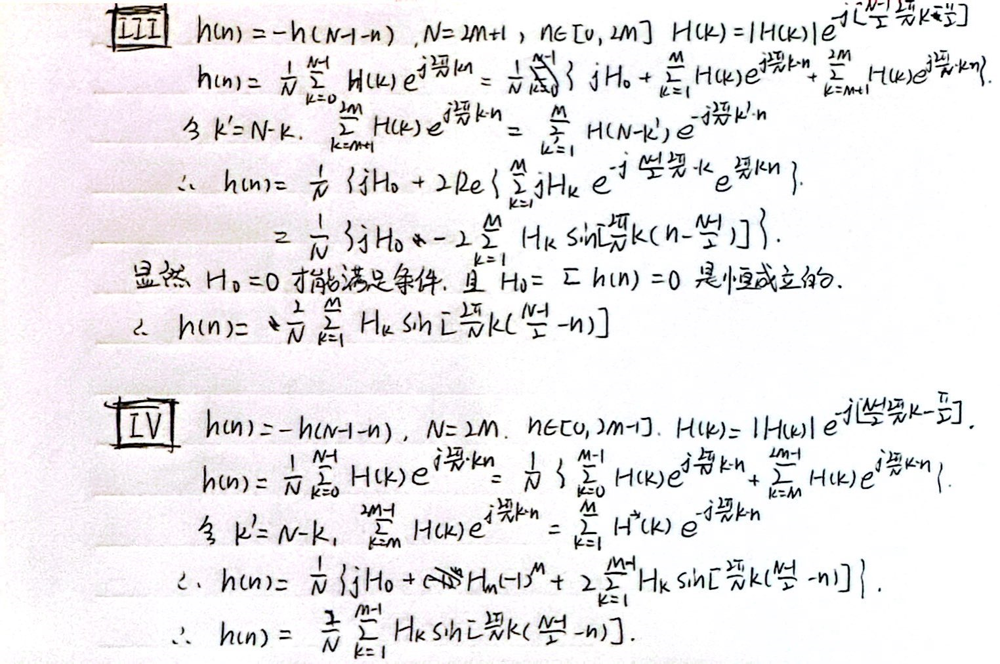

关于II型的说明：图片不好更改，但是根据DFT的定义，代入$N=2M$可以得到$H(M)$
$$
H(M) = \sum_{n=0}^{2M-1}h(n)e^{-j\frac{2\pi}{N}Mn} = \sum_{n=0}^{2M-1}h(n)(-1)^{n}
$$
根据$h(n)=h(2M-1-n)$，因为$n$和$2M-1-n$奇偶性显然不同，故$h(n)(-1)^n+h(2M-1-n)(-1)^{2M-1-n}=0$

所以$H(M)=0$，因此图上II的$H_M$可以舍去

不过一般设计都是I型

整个设计流程就是

1. 根据$H_d(\omega)$确定FIR滤波器的类型（高/低通等），长度$N$和幅度$|H(k)|$
2. 根据实际情况确定线性相位的$\beta$
3. 在$[0,2\pi]$上采样$N$个$H_d(\omega)$，注意中间的是高频，得到$|H(k)|$
4. 根据$|H(k)|e^{j\varphi(k)}$进行iDFT，得到$h(n)$，不用平移，因为这个相位就是平移后的

例：已知$H_d(\omega)$是$\omega_c=\frac{3\pi}{4}$的理想低通FIR滤波器，使用抽样法设计$h(n)$，抽样间隔为$\frac{\pi}{2}$

解：$\Delta \omega=\frac{2\pi}{N} = \frac{\pi}{2}\Rightarrow N =4$，那么由于是低通，必须选择情况2，不能用情况4，$\varphi = -\frac{3}{2}\omega$

​		$|H(k)|$则为$H(0)=H(1)=H(3)=1,H(2)=0$，那么这个序列就确定了，iDFT得到$h(n)$
$$
h(n) = \frac{1}{4}[1+2\cos\frac{\pi}{2}(n-1.5)]
$$

**改进**

上面的方法存在问题，在通带的`1`直接跳到阻带的`0`，引入了非常大的高频分量，导致阻带衰减不够低

由于阻带衰减与窗的长度无关，增加采样点不能解决问题

只能减小这个高频分量，也就是在`1`和`0`之间加`0.5`，平滑这个跳变

在数学上相当于对这个跳变进行插值，也就是在2.3节提到的内插辛格函数

一般情况下，不增加过度点的阻带衰减大致为-21dB，增加一个过渡点是-65dB，两个则是-75dB

**相对于窗函数法的优势**

* 当$H_d(\omega)$没有数学表达式时
* 增加过渡点，阻带衰减能很小
* 截止频率更准确

**缺点**

* 抽样频率间隔固定
* 截止频率自由的前提增加抽样点，导致计算成本大

## 10 IIR滤波器的设计

### 10.1 基本设计思路

1. 首先需要给定IIR数字滤波器的技术指标，如$\omega_p,\omega_{st},A_p,A_{st}$分别是通带截止频率，阻带截止频率，通带衰减和阻带衰减
2. 根据数字指标，转换为模拟指标
3. 根据模拟指标得到模拟低通滤波器的技术指标，也就是归一化
4. 查表，通过模拟低通的原型计算模拟滤波器的表达式
5. 将模拟滤波器转换为数字滤波器

可以看到AD/DA各一次；有两种方法

### 10.2 冲激响应不变法

**基本想法**

对得到的模拟滤波器进行抽样，得到数字滤波器，即

1. 已知$H_a(s)$，逆变换得到$h_a(t)$
2. 对其采样，得到$h(n)=h_a(nT_s)$
3. 做Z变换得到数字滤波器$H(z)$

如果
$$
H_a(s) = \sum\frac{A_k}{s-s_k}
$$
那么最终得到的
$$
H(z)=\sum\frac{A_k}{1-e^{s_k T_s}z^{-1}}
$$
证明略，好证的

本方法对第1-4步延续了传统的想法，即

1. $\Omega=\frac{\omega }{T_s}$，$A_p,A_{st}$不改变
2. 设计低通模拟滤波器系统函数$H_a(s)$
3. 用上面的方法将$H_a(s)$转换为$H(z)$

**方法的局限**

由于使用了抽样，这必然会导致一个抽样定理的问题，即
$$
z=e^{sT}\Rightarrow z=e^{\sigma T}e^{j\Omega T}\Rightarrow r=e^{\sigma T},\omega=\Omega T
$$
由于$\omega\in[-\pi,\pi]$，这会导致映射非双射，表现在系统函数上就是，在$\Omega=\pm\frac{\pi}{T}$之外的频谱会造成混叠

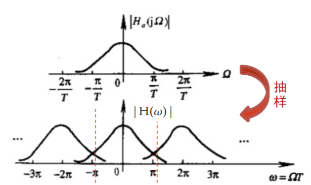

用抽样定理的视角来看，$\omega$的周期为$2\pi$，那么对$\Omega$的抽样频率就是$\frac{2\pi}{T}$，即折叠频率就是$\frac{\pi}{T}$

这带来的问题就是：高通/带阻滤波器无法设计。因为实际中无法限制模拟滤波器的频谱

**特点**

* 频率变换是线性的，即$\omega=\Omega T$
* 时域的逼近程度好，毕竟是对其进行采样的
* 周期延拓问题

### 10.3 双线性变换法

为了构造单一的频率映射而出现，直接给出映射公式
$$
s=\frac{2}{T_s}\frac{z-1}{z+1}
$$
那么在频率响应上，即$z=e^{j\omega}$上，这个映射就是
$$
\Omega = \frac{2}{T}\tan{\frac{\omega}{2}}
$$

**基本想法**

1. 根据数字滤波器的技术指标要求，通过$\Omega = \frac{2}{T}\tan{\frac{\omega}{2}}$得到模拟指标
2. 根据模拟指标和模拟滤波器原型设计模拟滤波器，得到$H_a(s)$
3. 用$s=\frac{2}{T_s}\frac{z-1}{z+1}$带入$H_a(s)$，得到$H(z)$

**通过原型设计模拟滤波器**

一个例子如下

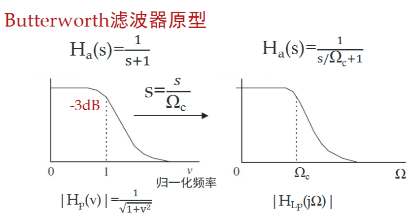

转换为其他类型的滤波器的方法如下

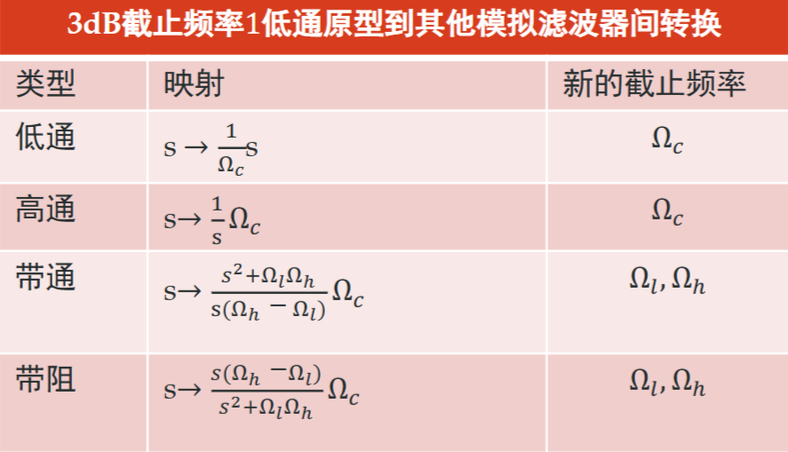

对这张表的修正：低/高通的$\Omega_c$变为$\Omega_p$，带通/阻的$\Omega_c$变为1，$\Omega_l/\Omega_h$指的是通带截止频率

**原型滤波器的设计**

存在两种，巴特沃兹和切比雪夫

* 巴特沃兹，通带平坦但是过渡带宽大；需要指的滤波器的阶数

已知n阶低通巴特沃兹的表达式为
$$
|H_p(\nu)|=\frac{1}{\sqrt{1+\varepsilon^2\nu^{2n}}}
$$
其中$\nu$是归一化模拟角频率，当$\nu=\nu_p=1$时为通带截止频率，即
$$
A_p = 20\lg{\frac{1}{\sqrt{1+\varepsilon^2}}} \Rightarrow \varepsilon^2=10^{-\frac{A_p}{10}}-1
$$
当$\nu=\nu_s$时为归一化阻带截止频率，即
$$
A_{st} = 20\lg{\frac{1}{\sqrt{1+\varepsilon^2\nu_s^{2n}}}}
$$
$\nu_s$有
$$
\nu_s = \frac{\Omega_{st}}{\Omega_p}
$$
利用$A_p,A_{st},\nu_s$的值，求得n为
$$
n \geq \left(\lg{\frac{10^{-0.1A_{st}}-1}{\varepsilon^2}}\right)/(2\lg \nu_s)
$$
特别的，当$A_p=-3$dB时，$\varepsilon=1$

不同阶的滤波器原型会在考试中给出

* 切比雪夫，通带波纹大，但是过度带宽小，这个就不赘述了估计不会考，直接给结果

$$
\varepsilon^2 = 10^{-0.1A_{p}}-1
$$

$$
n\geq \cosh^{-1}\left( \frac{10^{-0.1A_{st}}-1}{\varepsilon^2} \right)^2/\cosh^{-1}\nu_s
$$

例：设计一个低通IIR滤波器，满足截止频率为$f_p=$1.5kHz，通带衰减-$A_p$3dB，阻带频率$f_{st}=$3kHz，阻带衰减$A_{st}=$-10dB；抽样频率8000Hz

解：首先求截止频率的模拟角频率
$$
\Omega_p=\frac{2}{T_s}\tan(2\pi f_p/f_s/2)=1.07\times10^{4}
$$

$$
\Omega_{st}=\frac{2}{T_s}\tan(2\pi f_{st}/f_s/2)=3.86\times10^{4}
$$

那么归一化的阻带截止频率就是
$$
\nu_s = \frac{\Omega_{st}}{\Omega_p} = 3.613
$$
带入上文公式，得到$\varepsilon=1,n\geq0.855$，取$n=1$，即原型为
$$
H_a(s) = \frac{1}{s+1}
$$
由于是求的低通，故用$S = \frac{s}{\Omega_p}$带入，得到
$$
H_{LP}=\frac{1}{s/\Omega_p+1}
$$
再经过变换得到$H(z)$

### 10.4 IIR与FIR的对比

* IIR
  * 准确的边缘频率
  * 利用模拟滤波器设计，有大量轮子用
  * 存在反馈，阶数更少
  * 缺点：相位非线性；存在右边极点，系统条件稳定
* FIR
  * 严格的线性相位
  * 系统一定是稳定的
  * 可以用FFT快速计算
  * 缺点：截止频率难控制

## 11 其他说明

### 11.1 关于DSP的说明

整门课可以说就是为了第9节，第10节服务的，所以学懂了9/10两章，这门课就没问题

### 11.2 关于滤波器截止频率的选定

首先需要明确的是，带通/阻滤波器并没有所谓的截止频率

这里我们特指不显含的$\omega_c$，而不是给定的通频带参数如$f_p,f_{st}$等

当不指定$\omega_c/f_c$，而只给出了通频带的截止频率时，认为不显含；如果直接给出了，就直接用显式的就行

下面只讨论低通，毕竟高通就是1-低通

**FIR滤波器**

* 窗函数法中会使用到一个$\omega_c$，这是时域sinc函数经过DFT后在频域上的截止频率

  经过9.2节的说明可以发现，这个$\omega_c=\frac{\omega_p+\omega_{st}}{2}$，此时的$|H(\omega)|$也一定恒等于0.5，也就是-3dB

* 频率抽样法并不会直接涉及$\omega_c$，但是理想滤波器的$\omega_c$显然是同上的含义，当然这种方法一般会给定

* 一定有线性相位，或者说一定要求线性相位

**IIR滤波器**

* 冲激响应不变法一般会给出模拟滤波器$H_a(s)$，故不存在这个问题

* 双线性变换法给定的参数一般是$A_p,A_{st}$，前者对应于$f_p$，也就是使用$\Omega_p$作为-3dB的横坐标（实际是$A_p$dB）

  根据对FIR滤波器的讨论可以知道，这是将$|H(\omega)|=0.5$的$\omega=\omega_p$，也就是指定$\omega_c=\omega_p$

  那么在原型更改时，就需要使$\Omega_c = \Omega_p$

  值得一提，这种方法一般会涉及模-数-模转换，第一次是模拟指标正常转数字指标，第二次是双线性

* 当然，如Lab 3所示，也会存在不需要$A_p$的设计方法，这种没法手搓，也就不存在截止频率的选取问题

* 一般是没有线性相位的，因为滤波器的原型就不具有线性相位

* 双线性法设计滤波器的基本流程

  给定模拟频率要求$f_p,f_{st}$分别为通带截止频率和阻带截止频率，抽样频率为$f_s$，通带截止衰减为$A_p$，阻带衰减为$A_{st}$

  1. 用模拟要求求的数字要求
     $$
     \omega_p = 2\pi f_p/f_s,\,\, \omega_{st} = 2\pi f_{st}/f_s
     $$

  2. 用数字要求和双线性法求的滤波器的模拟要求
     $$
     \Omega_p = 2f_s\tan\frac{\omega_p}{2},\,\,\Omega_{st} = 2f_s\tan\frac{\omega_{st}}{2}
     $$

  3. 求出原型滤波器的归一化阻带截止频率$\nu_s$
     $$
     \nu_s = \frac{\Omega_{st}}{\Omega_p}
     $$

  4. 根据$A_p$和$A_{st}$求的原型的阶数n
     $$
     |H_p(\nu)|=\frac{1}{\sqrt{1+\varepsilon^2\nu^{2n}}}
     $$

     $$
     \varepsilon^2=10^{-\frac{A_p}{10}}-1
     $$

     $$
     n \geq \left(\lg{\frac{10^{-0.1A_{st}}-1}{\varepsilon^2}}\right)/(2\lg \nu_s)
     $$

  5. 根据n求出原型滤波器，再用滤波器之间的相互转换求出需要的模拟域滤波器$H(s)$

  6. 反变换为数字域
     $$
     H(z) = H(s)|_{s=2f_s\frac{z-1}{z+1}}
     $$

观察这二者的$\Omega_c$选取的差别，会对

>IIR有准确的边缘频率

这句话有新的认识