# 生物医学传感器

## 1 传感器基础

### 1.1 传感器的基本性能指标

**基本特性**：响应被测量，按照一定规律转换成可用信号的装置；由敏感元件，转换元件和电子线路组成

按照被测量分为：物理/化学/生物传感器

设输出量为Y，出入量为X，$Y=f(X)$，其中$f(\cdot)$为传感器

**生物相容性**：生物医用材料与人体相互作用产生各种复杂反应的性质

* 宿主反应：材料对生物体的作用
* 材料反应：生物体对材料的作用
* 组织/血液/免疫相容性

根据传感器信号在**时间**上的特征，分为静态和动态特性

静态：$Y=a_0+a_1X+a_2X^2+\ldots+a_nX^n$

线性系统动态特性：$\sum\limits_{i=0}^n a_i\frac{d^iY}{dt^i}=\sum\limits_{j=0}^mb_j\frac{d^jX}{dt}$

### 1.2 静态特性

将实验测得的方程$Y=a_0+a_1X+a_2X^2+\ldots+a_nX^n$称为传感器的**标准曲线**

理想的传感器是**过原点的线性特征**：$Y=aX$

**衡量静态特性的指标**

线性度、灵敏度、迟滞性、重复性、零点漂移、温漂、测量范围

静态标准条件：无加速度、冲击、振动，环境温度$20\pm5$℃，相对湿度$\leq$85%，大气压$101.3\pm8\mathsf{kPa}$

静态特性的校准：在静态标准条件下，用**高一级精度**的仪器对传感器进行**往复循环测试**，得到**静态标准曲线**

#### 1.2.1 **线性度**

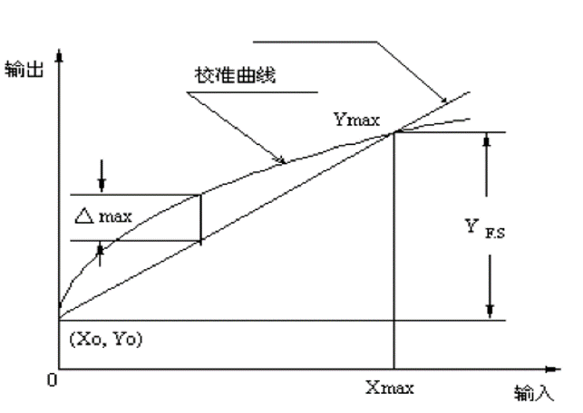

图中直线为传感器线性拟合的结果，$\Delta \max$为二者之差的最大值，$Y_{FS}$为传感器的最大输出值

定义：  $\varepsilon=\pm \frac{\Delta_{\max}}{Y_{FS}}\times 100\%$为传感器的线性度，线性度即**非线性误差**，值越大，越不线性

#### 1.2.2 **灵敏度**

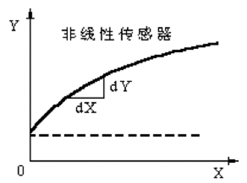

定义：  $K=\frac{\Delta Y}{\Delta X}$为传感器的灵敏度，注意灵敏度量纲

同一传感器可以定义很多灵敏度，但要注意区分量纲

一般而言，灵敏度越高，**精度越高、稳定性越差、量程越小**

#### 1.2.3 **迟滞**

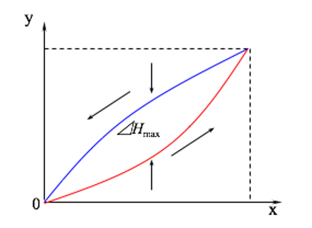

例子：磁滞回线，正向和反向的特性不一致

定义：  $\delta_H=\pm\frac{\Delta H_{\max}}{Y_{FS}}\times 100\%$，其中$\Delta H_{\max}$是正向反向相差最大值

#### 1.2.4 **重复性**

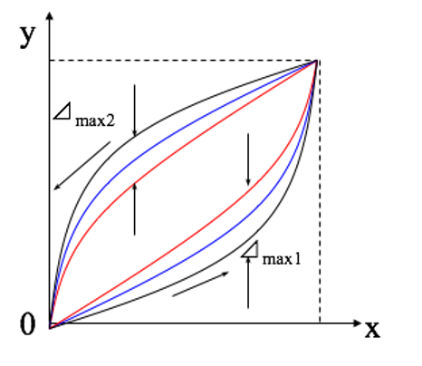

定义：  $\xi_R=\frac{cS_{\max}}{Y_{FS}}\times 100\%$

#### 1.2.5 **零点漂移**

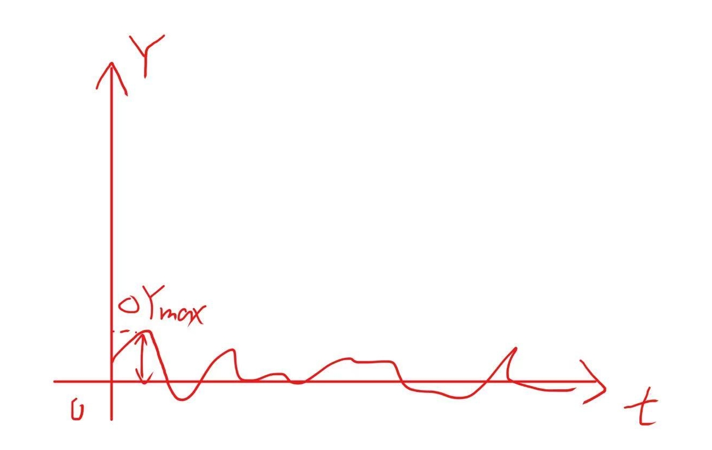

定义：  $零漂=\frac{\Delta Y_{\max}}{Y_{FS}}\times 100\%$

虽然是零点随时间的变化，但这也是静态特性

#### 1.2.6 **温漂**

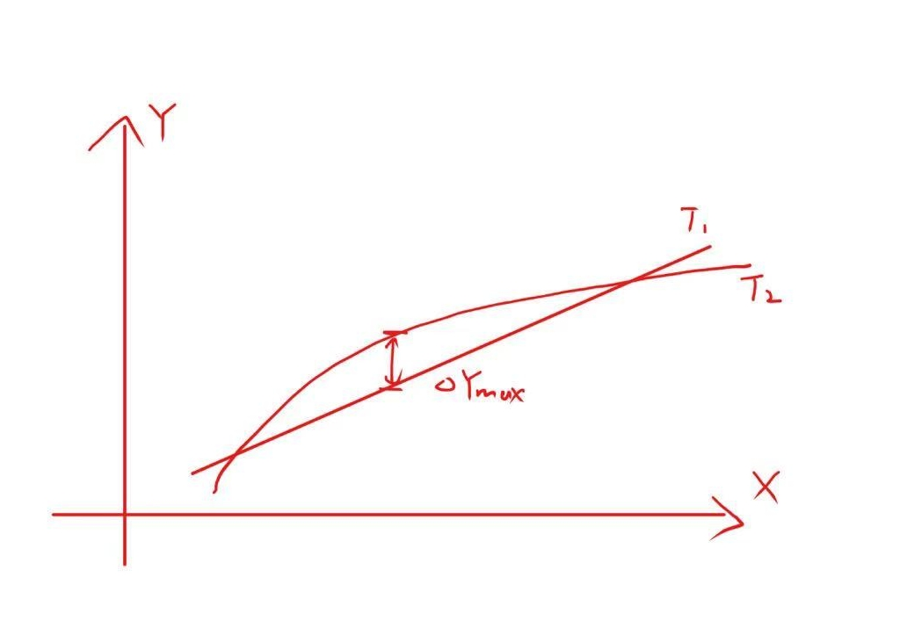

定义：  $温漂=\frac{\Delta Y_{\max}}{Y_{FS}\Delta T}\times 100\%$

其中$\Delta T=T_2-T_1$

#### 1.2.7 **典型的传感器标准曲线**

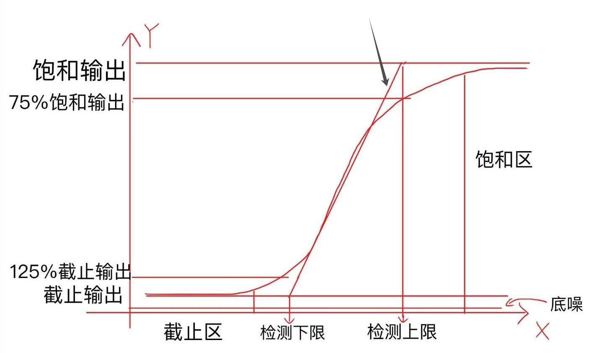

一个典型的传感器静态标准曲线如图所示，**曲线呈s型**，分为**截止区、工作区和饱和区**

在拟合曲线时，只能用**125%截止输出和75%饱和输出**的数据，得到的拟合直线**与饱和输出及截止输出**的交点的横坐标为传感器的**检测上限和检测下限**

若有点**低于底噪**，舍弃这些数据

**测量范围=(检测下限，检测上限)**，**量程=检测上限-检测下限**

#### 1.2.8 几个检测限指标

**LoD**: Limit of Detection

根据拉依达准则，定义为空白信号加三倍标准差对应的检测量，即
$$
Y(LoD) = mean_{\mathsf{Blank}} + 3SD
$$
对应于99.4%置信区间

**LoB**: Limit of Blank

定义为
$$
Y(LoB) = mean_{\mathsf{Blank}} + 1.645SD
$$
对应于95%置信区间

### 1.3 动态特性

指传感器对于动态信号的响应特性，用微分方程描述
$$
\sum b_i\frac{d^iY}{dt^i} = \sum a_j \frac{d^j X}{dt^j}
$$
可以用复频域的传递函数表达，不再赘述

几阶传感器，就是$Y$的最高阶

### 1.4 误差分析

设$X$是测量值，$X_0$是真实值

真实/绝对误差：$\Delta = X-X_0$

相对误差：

实际相对误差：$\delta = \frac{X-X_0}{X_0}\times 100\%$

满度相对误差（引用误差）：$\gamma = \frac{X-X_0}{X_{\max}} \times 100\%$，$X_{\max}$是量程

精度等级：引用误差去掉符号和百分号

**误差分类**

1. 系统误差，相当于$\mu$，可以补偿矫正或差动检测
2. 随机误差，相当于$\sigma$，多次取平均
3. 粗大误差，当偏离了$3\sigma$就认为是（拉依达准则），可以丢掉；来源于操作不当

## 2 物理量传感器

### 2.1 电阻式传感器

#### 2.1.1 应用

一个典型的应用是测量血压

正常的血压范围：90/60 mmHg ~ 140/90 mmHg

当外界施加的压力与血压相等时，产生共振，发出的信号幅度最大

一个典型的血压仪框图如图

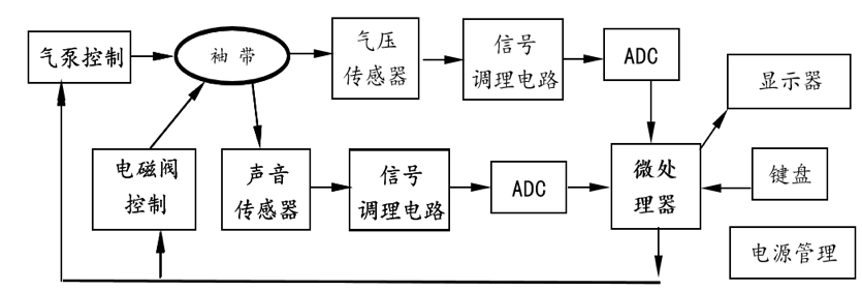

其中气压传感器如下

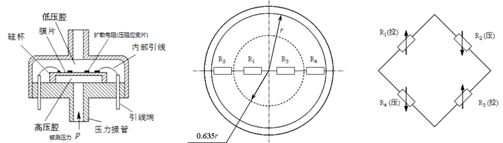

**如何设计**

先查标准，血压仪的测量范围要在4000 -- -400 mmHg，保护用

#### 2.1.2 电阻应变式传感器

##### 2.1.2.1 电阻应变效应

电阻的计算公式为$R=\rho\frac{l}{s}$，很显然对于$\rho,l$，R的响应是线性的，而s是非线性的

对上式取对数并求导得到
$$
\frac{dR}{R}=\frac{d\rho}{\rho}+\frac{dl}{l}-\frac{ds}{s}
$$
其中$\frac{dl}{l}=\varepsilon$为正应变，由于正应变与切应变满足$\tau=-\mu\varepsilon$，即$\frac{dr}{r}=-\mu\frac{dl}{l}$

对$s=\pi r^2$取对数求导得到$\frac{ds}{s}=2\frac{dr}{r}=-2\mu\frac{dl}{l}$

$\frac{d\rho}{\rho}=\pi_l\sigma=\pi_lE\varepsilon$，其中$\pi_l$为材料沿某晶向的压阻系数，金属约为0，半导体不为0；$\sigma$是应力，$E$是杨氏模量

将上面格式带入原式，得到
$$
\frac{dR}{R}=(\pi_lE+1+2\mu)\frac{\sigma}{E}=(\pi_lE+1+2\mu)\varepsilon
$$
称为电阻应变效应

将电阻丝的灵敏度定义为**单位应变**引起的**电阻相对变化**，计算灵敏度

金属：测量范围广，线性度高

半导体：灵敏度高，温漂大

##### 2.1.2.2 电阻应变片

通常长这样

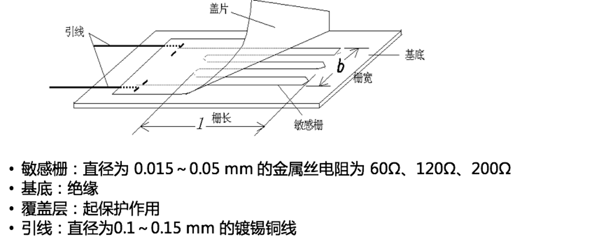

中间绕很多层可以增加正应变，增大电阻变化

##### 优缺点

优点

1. 测量范围广
2. **结构简单**
3. **便宜，多样**

缺点

1. **易产生温漂和零漂：电阻发热**
2. 对于大应变有较大的非线性，但是可以补偿
3. 输出易受环境影响
4. **高功耗**

电阻式传感器在**自动测试**和**控制技术**中广泛应用

##### **温漂补偿**

1. 单丝自补偿应变片
2. 双丝组合式自补偿应变片
3. 电路补偿（最常用）

其中2的方法具体是

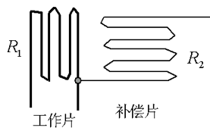

补偿片不在拉伸方向上，产生的应变可以不计，但是二者的温漂是一致的，差分得到结果

#### 2.1.3 电桥

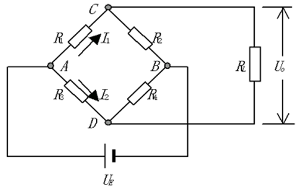

电桥平衡条件：$R_1R_4 = R_2R_3$

负载$R_L$很大，可以视为断路，此时的$U_0$为
$$
U_0 = U_E \frac{R_1R_4-R_2R_3}{(R_1+R_4)(R_2+R_3)}
$$
定义平衡时的桥臂比$n = \frac{R_2}{R_1}=\frac{R_4}{R_3}$

若$R_1$是电阻传感器，其他是定值电阻，定义$\delta_R = \frac{\Delta R}{R_1}$，那么有
$$
U_0 = U_E \frac{n\delta_R}{(1+n)(1+\delta_R+n)}
$$
由上文，$\delta_R = K_s \varepsilon$，这个值往往很小，有$\delta_R < < 1$，那么有
$$
U_0^{'} = U_E \frac{n}{(1+n)^2}\cdot \delta_R
$$
定义灵敏度$K_U = \frac{U_0}{\delta_R}=\frac{n}{(1+n)^2}U_E$，显然$n=1$时取最大值，$U_E$不能过大（温漂压不住）

这样近似的非线性误差为
$$
\gamma = \left|\frac{ U_0 -U_0^{'}}{U_0^{'}} \right| = \frac{\delta_R}{1+\delta_R+n}
$$
是比较小的

上面是单臂电桥，还有其他的

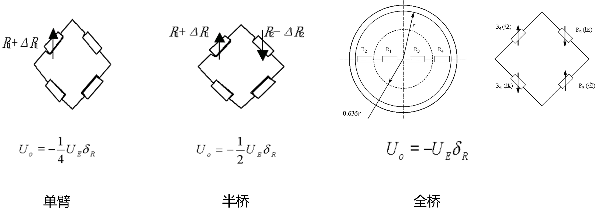

都是$n=1$

**半桥**
$$
U_0 = U_E\left(\frac{R+\Delta R}{2R}-\frac{R}{2R}\right)=U_E\frac{\Delta R}{2R}
$$
**无非线性误差**，灵敏度是单臂的2倍，还有温度补偿作用

**全桥**
$$
U_0 = U_E\left(\frac{R+\Delta R}{2R}-\frac{R-\Delta R}{2R}\right)=U_E\frac{\Delta R}{R}
$$
**无非线性误差**，灵敏度是单臂的4倍，有温度补偿作用

$U_o$一般都比较小，需要直流放大器，但是直流的电路容易零漂，因此就有了交流电桥

### 2.2 电容式传感器

#### 2.2.1 应用

触摸屏，麦克风

电容式心音传感器

助听器，一般使用驻极体作为电容材料，没有电压也有电荷存在，减小能耗

#### 2.2.2 电容传感器

不考虑边缘效应，$C=\frac{Q}{U}$，用高斯定理可得，平行板电容器$C=\frac{\varepsilon S}{d}$

当极板受压时，极板间距$d$发生变化，导致电容C的变化，$C^{'} = \frac{\varepsilon S}{d-\Delta d}$，$\Delta C =C^{'}-C_0=C_0\frac{\Delta d/d}{1-\Delta d/d}$

得到
$$
\Delta C /C_0=\frac{\Delta d/d}{1-\Delta d/d}=\frac{\Delta d}{d}\sum_{n=0}^{+\infty} \left(\frac{\Delta d}{d}\right)^n=\frac{\Delta d}{d}\cdot\left(1+\frac{\Delta d}{d}+\left(\frac{\Delta d}{d}\right)^2+\ldots\right)
$$
可以发现C与d是非线性的关系

当$\Delta d<< d_0$时，可以近似舍去2次及以上项，得到
$$
\frac{\Delta C}{C}=\frac{\Delta d}{d}
$$
灵敏度$K=\frac{\Delta C /C_0}{\Delta d }=\frac{1}{d}\mathsf{mm^{-1}}$或$K=\frac{\Delta C /C_0}{\Delta d /d}=1$，后者无量纲

由此近似的模型在$(0,\Delta d)$内的非线性误差（与保留到二次项对比）为$\delta = (\frac{\Delta d}{d})^2/\frac{\Delta d}{d}=\frac{\Delta d}{d}$，发现d相对Δd越大，线性度越好

**为什么不用电阻式的分析方式？**

* 那样可以很容易看出灵敏度K，但是看不出非线性误差δ

* 定义的变化量也不同，电阻定义应变$\varepsilon=\frac{\Delta l }{l}$，而电容使用的是$\Delta d$
* 那样分析也存在误差

#### 2.2.3 差动变极距型电容式传感器

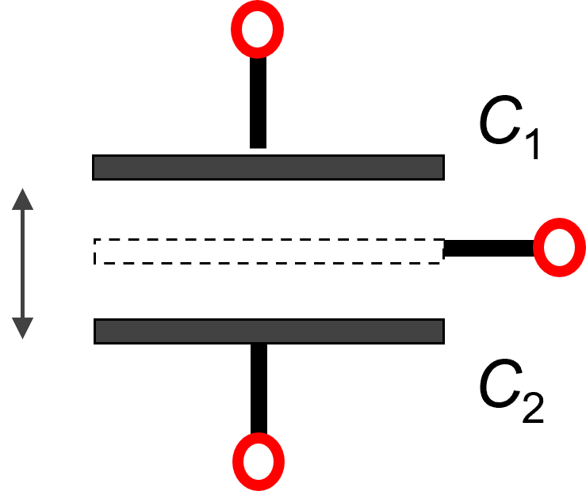

$$
\Delta C_1 /C_0=\frac{\Delta d}{d}\cdot\left(1+\frac{\Delta d}{d}+\left(\frac{\Delta d}{d}\right)^2+\ldots\right)\\
\Delta C_2 /C_0=-\frac{\Delta d}{d}\cdot\left(1-\frac{\Delta d}{d}+\left(\frac{\Delta d}{d}\right)^2+\ldots\right)
$$

用差分电路检测两个电容的差值$\Delta C_1/C_0-\Delta C_2/C_0$，得到
$$
\Delta C_1/C_0-\Delta C_2/C_0=2\frac{\Delta d}{d}\cdot\left(1+\left(\frac{\Delta d}{d}\right)^2+\ldots\right)
$$
灵敏度$K=\frac{2}{d}$，非线性误差$\delta = \left( \frac{\Delta d}{d}\right)^2$

这是假设向$C_1$移动

#### 2.2.4 差动传感器材料和结构选择

$d_0$较小，灵敏度高；过小则容易引起击穿

极板间使用高介电常数材料（云母），此时$C=\frac{S}{\frac{d_g}{\varepsilon_g \varepsilon_0}+\frac{d_0}{\varepsilon_0}}$，由于$\frac{d_g}{\varepsilon_g \varepsilon_0}$是常数，这可以让非线性误差减小

#### 2.2.5 变面积和变介质式传感器

**变面积式**

可以横向位移，$C=\frac{\varepsilon b x}{d}$，b为宽度，x可变
$$
\Delta C = \frac{\varepsilon b}{d}\Delta x
$$
是线性的，$K=\frac{\Delta C}{\Delta x}=\frac{\varepsilon b}{d}=\mathsf{const}$

**变介质式**

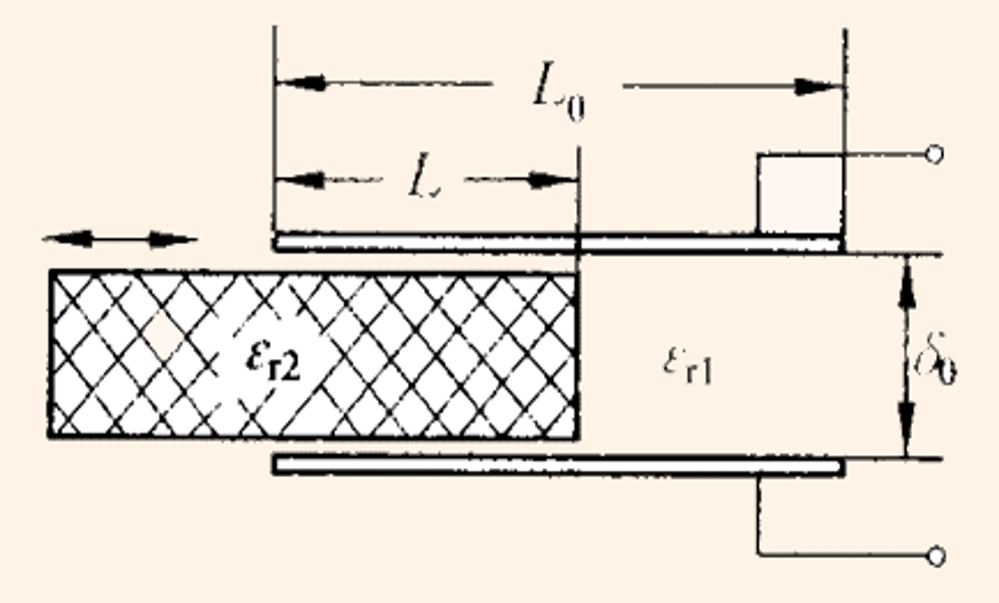

视为两个电容并联，$C=\frac{\varepsilon_0}{d}(\varepsilon_{r1}(l_0-l)b+\varepsilon_{r2}lb)$

若右边是空气且$l$一开始为0，则
$$
\frac{\Delta C}{C_0}=\frac{(\varepsilon_{r2}-1)\Delta l}{l_0}
$$
是线性的

#### 2.2.6 电容式传感器优缺点

优点

1. 温漂小（发热小）
2. 结构简单
3. 动态响应好
4. 非接触式
5. **能耗低**

缺点

1. **阻抗大，带载能力弱**
2. 寄生电容影响
3. 非线性，测量范围小
4. **成本高**

### 2.3 光电式传感器

#### 2.3.1 应用

典型应用是**血氧仪**

原理如下：

血液是**胶体**，当光通过均匀无散射的溶液时，溶液的透光系数如下
$$
T = \frac{I}{I_0}=10^{-acl}\\
A = -\lg\frac{I}{I_0} =-\lg{T}=acl
$$
其中a是液体吸光系数，c是溶液摩尔浓度，l是光程

血液中存在两种红细胞，一种富氧，一种乏氧，富氧细胞占总细胞的百分数即为血氧值，记为$\mathsf{SaO_2}$

血液的总吸光系数为$a=a_o\mathsf{SaO_2}+a_H(1-\mathsf{SaO_2})$，其中$a_o$是富氧的系数，$a_H$是乏氧的系数

使用两个波长的光对样品进行检测，得到
$$
\lambda_1 : A_1 = \left[(a_o-a_H)\mathsf{SaO_2}+a_H\right]cl\\
\lambda_2 : A_2 = \left[(b_o-b_H)\mathsf{SaO_2}+b_H\right]cl\\
Q = \frac{A_1}{A_2} = \frac{\left[(a_o-a_H)\mathsf{SaO_2}+a_H\right]}{\left[(b_o-b_H)\mathsf{SaO_2}+b_H\right]}
$$
得到$\mathsf{SaO_2}$的值为
$$
\mathsf{SaO_2}=\frac{a_H-Qb_H}{(b_o-b_H)Q-(a_o-a_H)}
$$
要使传感器是线性的，就让$b_o=b_H=b$，选择合适的波长的光可以做到，得到最终表达式
$$
\mathsf{SaO_2} = \frac{b}{a_o-a_H}Q-\frac{a_H}{a_o-a_H}
$$

#### 2.3.2 内光电效应

当**半导体**材料受光照时，对光子的吸收会在材料**内部**激发**电子-空穴对**，使物体的**电导率变化**或**产生光电动势**，分别对应**光电导效应**和**光生伏特效应**

##### 2.3.2.1 光电导效应

光电导体受光线作用，其**电导率**发生变化

本质是价带中的电子受到能量**大于或等于禁带宽度**的光子轰击，使其跃入导带，导带中的电子和价带中的空穴浓度增加，电导率变大

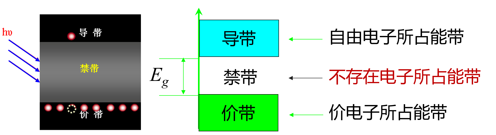

应用：光敏电阻，光导管

##### 2.3.2.2 光生伏特效应

光线作用下，半导体或电介质产生一定方向的**电动势**

在PN结及附近吸收足够能量的光子后，产生载流子，在内电场（耗尽层，N指向P）作用下，电子由P区涌入N区，空穴相反，使得**P区带正电，N区带负电**，并在外回路产生电流

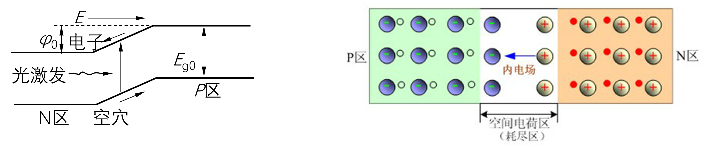

应用：光电池，光敏二极管

#### 2.3.3 外光电效应

光子能量足够大，使物质表面逸出电子
$$
h\nu = \frac{1}{2}mv_m^2+\phi
$$
不赘述

应用：光电管，光电倍增管

#### 2.3.4 光电式传感器的特性参数

**灵敏度**

定义为输出信号$S$的变化量与入射光功率变化量$P_s$之比
$$
K = \frac{\Delta S}{\Delta P_s}=\frac{\Delta S}{\Delta H A_d}
$$
其中H是辐照度变化，Ad是受光面积

**光谱特性**

传感器的**灵敏度**和**入射光波长**的关系

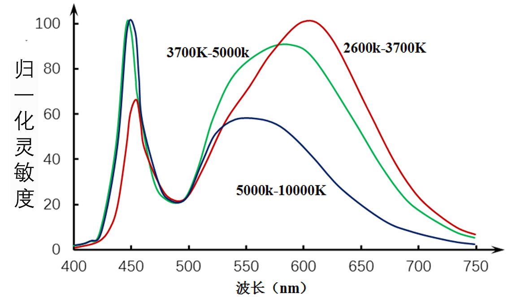

**线性度**

输出信号与输入光功率成线性比例的程度和范围

**响应时间**

对入射光变化的响应快慢，是叫时间常数

**等效噪声功率**

产生强度正好等于传感器的噪声输出值的辐射功率，用NEP表示，是表征传感器的品质优劣的重要参数
$$
NEP = P_s\frac{S}{N}
$$
其中S/N是信号/噪声的有效值（方均根），S/N是信噪比，NEP越小，性能越好

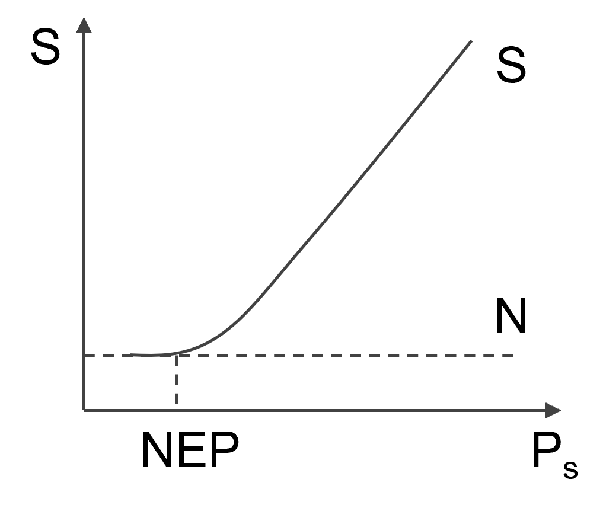

**还有其他传感器都有的特性**

#### 2.3.5 光电敏感器件

##### 2.3.5.1 光敏电阻

使用半导体材料制成的电阻，光照作用于半导体时，**载流子密度发生变化**，电导率变化（光电导效应）

光敏电阻没有极性，可以加交流电

结构示意图如下

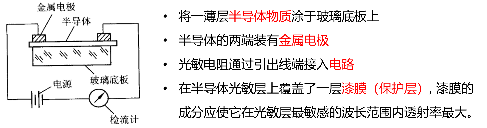

**参数**

**暗电阻**：不受光时的阻值，很大（MΩ），此时的电流是暗电流

**亮电阻**：受光照射的阻值，比较小（kΩ），亮电流

**光电流**：亮电流 - 暗电流

希望暗电阻越大、亮电阻越小越好

**特性**

**伏安特性**：在一定照度下的伏安关系。在一定电压范围，I-U为直线；入射光不同，I-U斜率不同

**光谱特性**：光敏电阻的相对灵敏度与入射波长的关系

**温度特性**：影响光谱响应、灵敏度和暗电阻等

**优点**：灵敏度高；光谱响应范围宽

**缺点**：强光下线性度差；光电弛豫时间长；频率响应低；发热

##### 2.3.5.2 光电管

光线照射到**金属感光材料**时，有电子**逸出**（外光电效应），在外加电场作用下移动到阳极，在光电管内部产生电子流，在外电路产生电流

光电子数目（电流大小）与光照强度有关

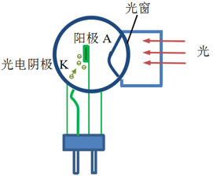

中间是阳极，四周是金属感光材料的阴极

**特性**

**伏安特性**：光通量一定时的I-U关系

**光电特性**：电压一定时，光通量（流明）与光电流的关系

**光谱特性**：在单位辐照通量（w）下，不同波长的光照射光电管时产生的饱和光电流和光波波长的关系，主要取决于阴极材料

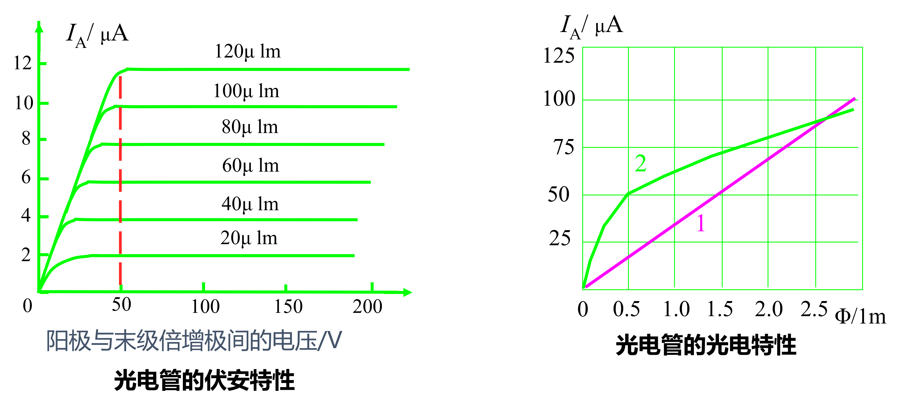

##### 2.3.5.3 光电倍增管

一个阴极，多个阳极

从阴极K上逸出的光电子被第一倍增极D1加速，高速轰击D1，使D1表面逸出更多**二次电子**，逐级前进，直到最后的阳极A

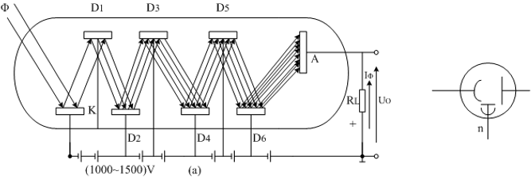

由**光阴极K**，**次阴极（倍增电极Dn）**，**阳极A**组成

**特性**

**灵敏度**：每单位光通量使阳极产生的饱和光电流（入射一个光子后在阳极上能收集到的平均光电子数目），衡量探测能力；光电倍增管的灵敏度极高，设$n$个次阴极，每个次阴极二次电子发射倍增率为$\delta$，总共增大$\delta^n$倍

**光谱特性**：对不同频率的入射光的灵敏度，故描述灵敏度时需要指明光波长

**暗电流**：没有光照，但是有电压时的电流大小，由热发射或场致发射造成，可用补偿电路消除；决定了PMT的**可检测光通量的阈值**

**伏安特性**：与光电管类似

**磁特性**：磁场会使电子轨迹偏移

**应用**

分光光度计，γ射线探测（pet），各种荧光显微镜的检测端，流式细胞仪

##### 2.3.5.4 光电池

利用光生伏特效应，半导体内部产生光生电动势，可以储能

##### 2.3.5.5 光纤

设纤维芯和覆盖层的折射率分别为$n_1,n_2$，角度定义为与光纤轴的偏角（即在界面入射角的余角），定义$\theta_0$为临界角，有
$$
\cos{\theta_0} = \frac{n_2}{n_1}
$$
定义数值孔径$N.A. = n_1\sin{\theta_0} = \sqrt{n_1^2 - n_2^2}$，反应了光纤对入射光的吸收能力，越大越好

为什么这样定义？因为这样的话使得$N.A.$与$\theta_0$正相关

### 2.4 压电式传感器

#### 2.4.1 应用

机器人的表面仿生皮肤，拥有了触觉

#### 2.4.2 压电效应

**压电效应**：一些非中心对称的**晶体**，在外界压力作用下内部产生**极化**，在两个表面上产生等量异种电荷；外力消失后，电荷中和；电荷量大小**正比于**外力大小

**逆压电效应**：外部附加交变电场产生机械形变

本质上是介质极化产生电偶极矩，一般都是**各向异性**的晶体

表面电荷密度的公式为
$$
\delta _i = d_{ij} \cdot \sigma _j=d_{ij} \frac{F_j}{A_j}
$$
其中$d_{ij}$为压电系数，表示在$j$方向上受力而在$i$方向上产生电荷

#### 2.4.3 常见材料

**石英**：不是任何方向都有，而且不是很大

**钛酸钡**：第一个压电陶瓷材料

**锆钛酸铅**：PZT，性能比钛酸钡好

#### 2.4.4 应用

**特点**：**频带宽，灵敏度和信噪比高**，结构简单，工作可靠

**压电振子**

在材料上铺设激励和接收电极，在激励电极上施加电信号，利用逆压电效应产生机械形变

可以产生位移，也在光电传感器中作为精密微调环节（**位移台**）

**石英微天平**

一层吸附膜可以吸附被探测物体，吸附后膜的总质量变化，固有频率改变，引起谐振频率的改变

加入不同频率的交流电可以测量谐振频率

精度很高

### 2.5 热电式传感器

#### 2.5.1 应用

典型应用是电子体温计和温度报警器

#### 2.5.2 原理

信号转换过程为：温度$\rightarrow$电阻$\rightarrow$电压

**金属热电阻**

金属的电阻率随温度变化，经验公式为$R_T = R_0[1+\alpha(T-T_0)]$，没啥用

常用材料：铂（稳定，标准，贵）；铜（工业，便宜）；铁，镍（高灵敏）

**半导体热敏电阻**

一些金属氧化物，分为三类

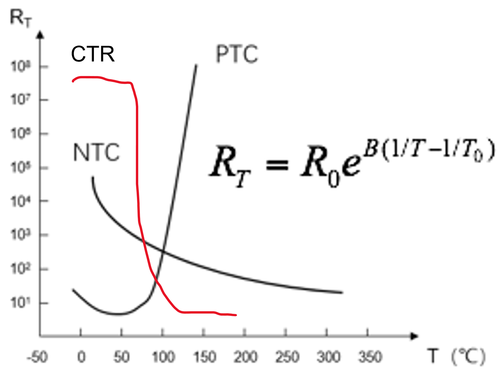

**PTC**：B<0，可以作为限流元件

**NTC**：B>0，变化的范围广，测温，线性度好

**CTR**：在某个临界温度变化极快，灵敏度高，响应快，分辨率高，适合测量**微弱**的温度变化，但是线性度差

**伏安特性**

在不同温度下的电压电流曲线

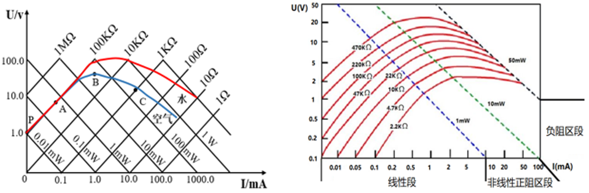

#### 2.5.3 热电偶传感器

两种不同的金属导体组成闭合回路，两端产生温度差，电子的运动产生差异，热运动快的电子扩散向另一端，产生了一个空间电场区

由于是导体，有电势差就有电流

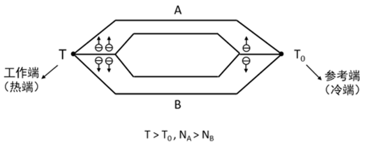

其中参考端的温度已知，根据电流/电势大小可以粗略测量温差

这是一个无源元件，不需要额外供能，结构简单，测量范围宽，但是灵敏度低

响应曲线近似表达为
$$
E_{AB}(T, T_0) = a(T-T_0)+b(T^2-T_0^2)
$$

#### 2.5.4 其他热电式传感器

温敏三极管和外围电路集成在一个芯片上，构成独立的温度传感器

热辐射传感器，不同温度的波源产生的热辐射的波长不同，在内部存在一个热电偶堆，热电偶串联，电势加强

总结起来，热电式传感器的工作原理如下

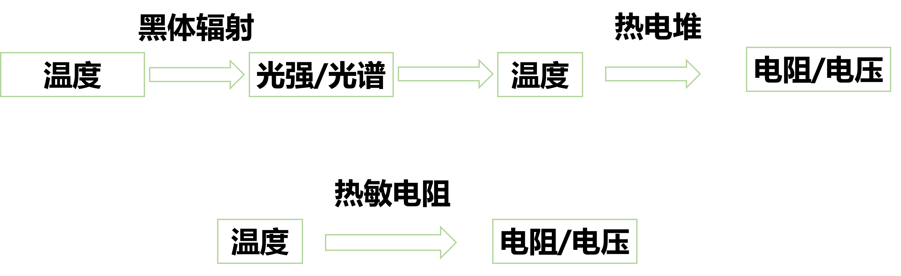

**几种热电式传感器对比**

热敏电阻：

1. 原理：半导体材料的电阻随温度变化，主要因素是载流子浓度和迁移率随温度的变化关系
2. 温度变化特性：分为三类，但都是非线性
   1. 负温度系数（NTC）热敏电阻，随温度上升，电阻值减小
   2. 正温度系数（PTC）热敏电阻，随温度上升，电阻值增加
   3. 临界温度系数（CTR）热敏电阻，当温度升高到某临界点时，电阻值突然下降
3. 测量范围：相对来说最小
4. 灵敏度：相对来说最高
5. 精度：三者的中间水平

RTD热电阻：

1. 原理：由线圈或纯金属沉积膜组成，电阻以已知且可重复的方式随温度变化
2. 温度变化特性：几乎是纯线性，正温度系数
3. 测量范围：三者的中间水平
4. 灵敏度：三者的中间水平
5. 精度：相对来说最高

热电偶：

1. 原理：当热电偶的两端处于不同温度时，两种不同的金属的连接产生可测量的电压
2. 温度变化特性：非线性
3. 测量范围：相对来说最大
4. 灵敏度：相对来说最低
5. 精度：相对来说最低

## 3 化学量传感器

化学量传感器和物理量传感器最大的不同就是专一性，是针对特定的分子或物质进行检测

这里指的是敏感元件的专一性，对于换能器，二者都是通用的

化学传感器主要分为

1. 离子传感器
2. 气体传感器
3. 湿度传感器（检测水分子）

### 3.1 电化学传感器

利用电极-介质**界面**上发生的电化学反应，将待测信号转化为电信号

系统由电解质溶液，电极和测量电路组成

#### 3.1.1 原理

在电极-介质的界面发生了什么？

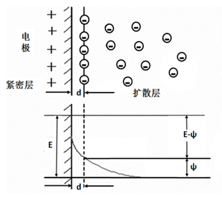

电极和介质存在电势差，在界面上吸引正/负电荷，形成紧密层，在紧密层中发生电化学反应

**能斯特方程**
$$
E=E_0 -\frac{RT}{ZF}\ln{\frac{\alpha_{还原态}}{\alpha_{氧化态}}}
$$
其中$E_0$是电极电位，R是气体常数，T为绝对温度，F是法拉第常数，Z是一个离子发生反应产生的电荷转移（注意参与电子转移的物质在方程中是归一化的）

$\alpha$是离子浓度，对于固体来说，是常数

由此，离子的浓度可以通过电势差测量

在25℃时，$\frac{RT}{F}\ln 10=0.05916$，因此换底后，方程为$E=E_0-\frac{0.05916}{Z}\lg \frac{\alpha_{还原态}}{\alpha_{氧化态}}$

离子活度单位同离子浓度，标准单位是mol/L

**电极分类**

* 指示电极：电极电位随待测离子浓度而变化；常与另外的电极组成电池，测量电学性质
* 工作电极：在测试过程中激发信号的产生者，引起溶液中离子浓度的显著变化
* 辅助电极：和工作电极形成回路，要求本身电阻小且不易极化（铂电极）
* 参比电极：提供标准电位的电极，有良好的可重复性，不易极化，内阻小

#### 3.1.2 原电池

不外加电源，利用电化学反应产生的电势差，在外界连接回路，产生电流

注意不能使用会产生气体的反应，这样会减少界面的接触面积，妨碍反应

原理：能斯特方程

计算公式
$$
E = E_0 - \frac{RT}{ZF}\ln\frac{产物浓度}{反应物浓度}
$$
在锌铜原电池中，产物是$Zn^{2+}$，反应物是$Cu^{2+}$

纯固/液体的浓度为1

#### 3.1.3 电解池

外加直流电压，测量直流电流，利用
$$
Q = \int_t i\,dt
$$
测量总转移电荷，那么$Q/Z$就是参与反应的离子数目，换算出浓度

原理：法拉第方程

$$
C = \frac{A_{\mathsf{peak}}}{nFV}
$$
其中$A_{\mathsf{peak}}$是电流和坐标轴的面积（也就是电荷量），$n$是一次反应中的电子转移数目，$F$是法拉第常数，$V$是溶液体积

#### 3.1.4 电导池

施加大直流电压，产生静态电流；然后施加小交流电压，测量动态电流，利用$\dot{Z}=\frac{\dot{u}}{\dot{i}}$测量出等效阻抗

由于电极-介质界面存在紧密层，相当于一个电容，当电极表面结合物质后，等效阻抗会改变

利用电导池可以**检测表面修饰物是否结合**

### 3.2 离子传感器

#### 3.2.1 离子选择性电极

**原理**

* 敏感膜对待测离子有选择性响应
* 利用膜电势的变化（能斯特方程）测定离子浓度

**电极结构**

在敏感膜的下方就是待测溶液

* 敏感膜与离子发生扩散和交换，改变电荷分布，形成电位差
* 内参比溶液含有特定的离子成分，为内参比电极提供稳定的离子环境
* 内参比电极的电位保持稳定（不为0）

**基本特性**

* 选择性系数

实际上敏感膜对其他离子也不是完全排斥的，膜电位的公式实际为
$$
E_{膜} = K \pm \frac{RT}{Z_AF}\ln{\left(\alpha_A + \sum K_{AX}\alpha_X^{\frac{Z_A}{Z_X}}\right)}
$$
其中$X$代表其他离子，$K_{AX}$表示在$A$的体系中膜对$X$的透过性；这里的$Z_X,Z_A$是带上离子的电荷符号的，正的$Z_A$对应$+$，有

$$
K_{AX} = \frac{\alpha_{A}}{\alpha_{X}^{Z_A/Z_X}}
$$

#### 3.2.2 玻璃电极（pH计）

在溶液中发生下面的反应
$$
H^+(玻璃)+Na^+(溶液)\rightleftharpoons Na^+(玻璃)+H^+(溶液)
$$
敏感膜就是玻璃膜（$\mathsf{SiO_2,Na_2O,CaO}$），内参比溶液为$0.1$M的HCl，内参比电极为Ag/AgCl

**原理**：玻璃电极的水合硅胶层中的$Na^+$被溶液中$H^+$取代，由于水合硅胶层的$H^+$浓度与溶液中的浓度不同，产生电势差

使用前必须用水浸泡，形成水合硅胶层

#### 3.2.3 几种测量方法

**直接电位法**

直接测量内外电极的电势差，利用能斯特方程计算离子浓度

但是由于测量电路难以测量液接电位和不对称电位，实际中一般不适用这个

**标准曲线法**

用待测离子配置一系列不同浓度的标准溶液，用**总离子强度调节缓冲溶液(TISAB)**保持溶液离子强度相对稳定

测量传感器输出电压，绘制标准曲线$E-\lg c_i$

缺点是需要定期标定

**标准加入法**

首次测量的关系如下
$$
E_1 = K + k\ln c
$$
设溶液体积为$V_0$，此时加入浓度$c_s$很高的已知浓度标准溶液$V_s$，$V_s$很小，认为溶液体积不变，那么溶液的离子溶度变化为
$$
\Delta c = \frac{c_sV_s}{V_0}
$$
此时在此测量
$$
E_2 = K + k\ln (c+\Delta c)
$$
两次相减得到
$$
E_2 - E_1 =k\ln(1+\frac{\Delta c}{c})
$$
解出$c$

#### 3.2.4 液膜电极和敏化电极

**液膜电极**：使用液体作为敏感材料，惰性多孔膜浸入液体离子交换剂中

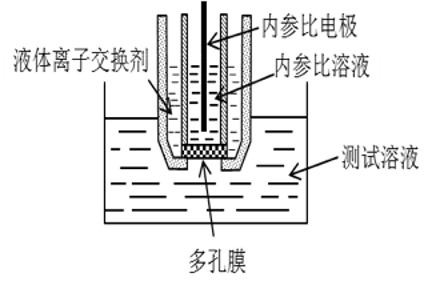

**敏化电极**：气敏电极采用复合电极结构，含有参比电极和指示电极，气体透过透气膜与指示电极上的敏感膜作用

#### 3.2.5 离子敏场效应管（ISFET）

**原理**：在绝缘栅上沉积离子选择性敏感膜，通过膜电位的变化影响漏极电流，通过测量电流反应电压，最终测量离子浓度

**优势**：可以做的很小，测量微量液体，也可以微型化和批量生产

#### 3.2.6 光寻址电位传感器（LAPS）

**原理**

基于半导体的光电效应，使用周期性的调制光源激发光电子。耗尽层相当于电容，光电子对耗尽层的反应相当于电容的充放电

敏感膜选择离子，相当于对偏置电压进行改变，也就改变了电流曲线

**优势**：利用光可以进行单点信号激发，实现高分辨率成像

#### 3.2.7 微电极阵列（MEA）

**原理**：多个微电极构成阵列，利用重金属离子的氧化还原反应，采用溶出伏安法降低LoD

**优势**：传质速率高，无需搅拌；电流密度大；充放电时间短，高扫描速率，检测快；信噪比高，用于痕量物质的检测

### 3.3 气体传感器

#### 3.3.1 电化学气体传感器

**电压型电极**

气敏电极由离子选择电极，透气膜和中介溶液组成，就是一个能透气的离子选择电极

同样利用能斯特方程计算电压，测量电压反应气体浓度

**电流型电极**

CLARK电极是一个代表，利用氧化还原反应产生的电子流动的电流，测量浓度

用于测量强氧化/还原型气体，响应快，高灵敏

根据法拉第定律测量浓度
$$
C = \frac{A_{\mathsf{peak}}}{nFV}
$$
其中$A_{\mathsf{peak}}$是电流和坐标轴的面积（也就是电荷量），$n$是一次反应中的电子转移数目，$F$是法拉第常数，$V$是溶液体积

#### 3.3.2 固体电解质气体传感器

固体电解质具有**离子导电特性**，以离子导体为电解质，是一种化学电池，但不会存在溶液泄露

两边是多孔的贵金属电极

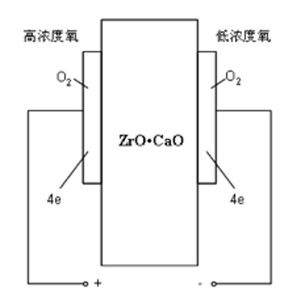

正极（低浓度）发生：$2O^{2-} \rightarrow O_2+4e^-$；负极（高浓度）发生：$O_2 + 4e^-\rightarrow 2O^{2-}$

根据能斯特方程计算电位差

#### 3.3.3 半导体气体传感器

使用MOS管制成的阻抗器件，结构简单，价格低廉

通常由气敏元件，加热器和封装体组成

#### 3.3.4 接触燃烧式气体传感器

利用催化燃烧的热效应，用热敏电阻组成电桥，最终测量的还是电压变化

**优点**：应用面广（所有可燃气体），响应快，体积小

**缺点**：选择性差，工作温度高

#### 3.3.5 光学型气体传感器

根据不同气体的吸收光谱不同，利用朗伯-比尔定律
$$
I(\lambda) = I_0e^{-\alpha(\lambda)LC}
$$

其中$L$是光程，$C$是摩尔浓度

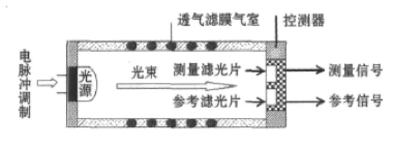

单光源双光束，一个是参考信号

#### 3.3.6 声表面波气体传感器

利用压电和逆压电效应，由于敏感区的质量/折射率等变化，接收到的电压会变化，核心是叉指换能器，实现声电换能

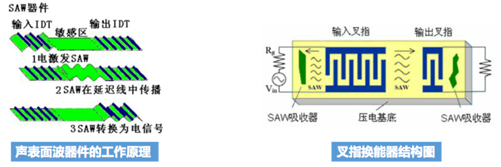

### 3.4 湿度传感器

测量空气中水蒸气含量的装置

**湿度**：空气中水蒸气的含量

**绝对湿度**：单位体积空气中水蒸气的质量

**相对湿度**：绝对湿度和最大绝对湿度（饱和蒸汽压）的比值

湿度传感器主要有下面几个形式

* 电阻式：湿度——>电阻变化——>电压变化
* 电容式：电容变化——>电压变化/阻抗变化
* 压阻式：湿度——>压力——>电阻
* 光纤式：湿度——>光学参数

## 4 生物传感器

是一类特殊的化学量传感器，感受生物颗粒，有**生物识别元件**

### 4.1 概述

**原理**

* 待测物**扩散**至功能表面
* **敏感元件**与待测物发生相互作用，引起**表面性质的变化**
* 换能器换能

**分类**

* 根据生物识别元件
  * 酶；免疫；核酸；细胞；组织
* 根据信号转换方式
  * 光电；压电；半导体

**发展历史**

* 催化代谢型：被测分子与敏感元件上的发生反应，检测产物
  * 代表：血糖监测
* 亲和型：利用被测分子和敏感元件的生物亲和作用
  * 代表：SPR传感器

**生物传感器的特性**：取决于生物识别元件的特性

* 选择性，特异性，敏感性：高
* 稳定性和重复性：不足

**生物传感器的关键技术**

* 生物材料的固定化：与载体结合，形成不溶于水的生物功能膜，要求与传感元件之间有良好的耦合
  * 脂膜包埋：通常采用一个半透膜对生物识别元件与待测物进行隔离，而传感元件则与识别元件紧密贴近。
  * 物理吸附：依赖于范德华力、疏水作用力、氢键及离子作用力将生物材料贴附在传感器表面。
  * 基质吸附：往往采用多孔材料在生物材料四周形成孔内镶联基质，并将其与传感器连接。
  * 共价结合：利用可供生物材料连接的活性基团对传感器表面进行修饰，最终通过共价结合的方式将其固定在传感器表面。

### 4.2 酶传感器

**结构**：固定化酶膜，基体电极

**原理**：酶促反应，产物用于检测

**检测范围**

* 将待测物转化为可被传感器检测的产物
* 检测可作为酶抑制剂/激活剂的物质
* 评价修饰后的酶与待测物反应的特性

**酶的固定**：关键环节

* 基于载体的酶固定化：吸附法；化学交联；共价结合；物理包埋；但是有位阻，会减弱酶的作用
* 无载体酶固定技术：克服位阻
* 酶的定向固定化：共价固定；氨基酸置换；抗体耦联；疏水定向固定；生物素-亲和素

#### 4.2.1 葡萄糖检测

酶催化反应为
$$
C_6H_{12}O_6+O_2 \overset{GOD}{\longrightarrow} C_6H_{10}O_6 +H_2O_2
$$
将葡萄糖氧化酶固定在膜上，利用产生的过氧化氢进行进一步检测

具体的检测电极有：Clark氧电极和过氧化氢电极（反应电极都是铂电极）

**氧电极葡萄糖传感器**

结构：铂电极（-0.6V，阴极），Ag/AgCl电极（+0.6V，阳极）；特氟龙膜将电极与反应腔隔离

原理：电极对氧的响应电流反应葡萄糖含量
$$
2H^+ + O_2+2e^- \rightarrow H_2O_2\\
H_2O_2+2H^++2e^- \rightarrow 2H_2O
$$

这两个反应都发生，上面的是酶促反应，下面的是还原反应，合起来，消耗一个$O_2$转移$4e^-$

**过氧化氢葡萄糖传感器**

结构：铂电极（+0.6V，阳极），Ag/AgCl电极（-0.6V，阴极）

原理：电极对过氧化氢的响应电流
$$
H_2O_2 \rightarrow H_2O+O_2+2e^-
$$
缺点：正电压易将其他物质氧化；易受环境中氧分压波动的影响；响应时间长且难以活体分析；灵敏度不高

为什么反应慢？氧化还原酶的结构特点**阻碍**反应中心和电极表面的**电子转移**和还原性辅酶的**有效循环**

**介体型酶传感器**：普遍采用的第二代酶生物传感器，介体取代了氧/过氧化氢的电子传递

促进电子传递过程；加快电极反应；降低工作电位；排除其他活性物质干扰

**直接电催化葡萄糖传感器**：第三代

**三代的差别**：电子供给方式

### 4.3 免疫传感器

主要就是抗原-抗体反应，结合力是**非共价力**

**结构**：免疫识别，信号转换

**抗原抗体的固定**

* **生物素-亲和素自组装膜法**：利用金原子和巯基的金硫键自组装，结合力很强
* **戊二醛交联法**
* 蛋白A共价连接

#### 4.3.1 电化学免疫传感器

非标记的传感器，也就是样品不需要孵育

将抗原/抗体固定在电极表面，当产生结合时，引起电容/电阻变化，电学特性改变是更好检测的，最终导致膜电位改变

#### 4.3.2 酶联免疫吸附测定（ELISA）

这里酶的作用是催化，放大信号

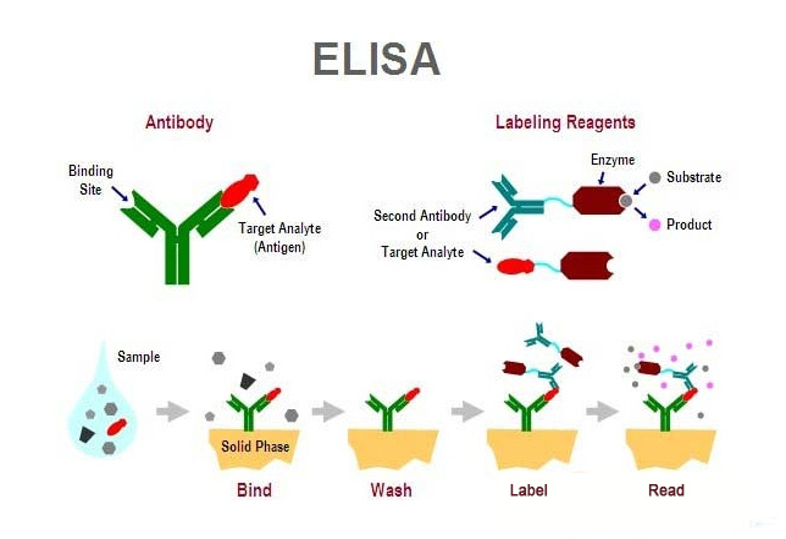

第一步加入样品，里面的抗原被抗体1结合

第二步洗脱无关信息，需要用力甩

第三步加入另一个带有酶的抗体2，与结合了抗原的抗体1形成夹心结构

第四步洗脱未固定的抗体2，加入酶的底物

检测酶促反应的产物量进行抗原评估（信号放大）

问题在于，流程复杂且需要人工介入，方差很大（非均相）

#### 4.3.3 电化学发光免疫分析（ECL）

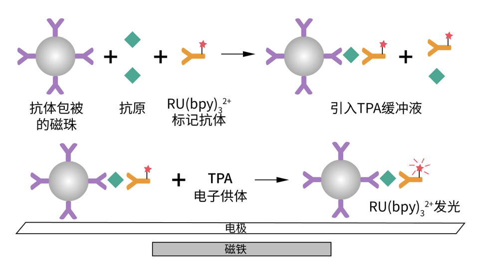

也是夹心结构，区别是这里有磁珠，可以自动化，不需要人工介入，方差小（均相）

检测发光强度来确定被测物浓度

#### 4.3.4 SPR传感器

用于结合动力学检测，根据共振角变化

原理在Research里，我可能不会发布

**优点**：高灵敏，无标记，原位，动态

#### 4.3.5 DNA电化学传感器

核酸分子探针进行核酸分子杂交

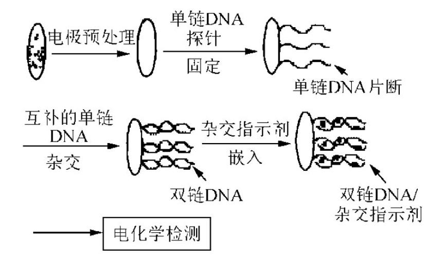

#### 4.3.6 COVID-19检测

无非是对特异的生物分子进行检测：核酸，蛋白质，抗体

* 核酸
  * RT-PCR：先逆转录为cDNA，然后进行扩增
  * CRISPR-Cas
* 蛋白质
  * ELISA
  * LFIA：也就是胶体金试纸的原理，侧向流动层析，带动抗体（有标记物），与检测线形成夹心结构（夹目标物），与控制线（标记物的抗体）必须要结合
* 抗体
  * ELISA，LFIA
  * SVN：在体外将病毒和样品混合，若样品中有抗体，那么病毒会失去致病力（接种到敏感个体检测）

### 4.4 细胞与组织传感

整个细胞/组织传感的优势：更接近生理环境；某些分子（膜蛋白等）无法提取

分类：

* **代谢型**：检测细胞代谢产物，如胞外酸化率，离子代谢等
* **接触式**：测量细胞与电极界面性质的改变，如阻抗传感器，电生理传感器等；关键是细胞与电极界面的耦合
* **类器官**：3D的细胞培养物，包含代表器官的一些关键特征

### 4.5 新型传感技术

* 纳米生物医学传感：至少有一维在纳米尺度内
* 穿戴式生物医学传感
* 仿生生物学传感
* 微流控分析芯片

