# 生物医学图像处理

## 1 绪论

数字图像：二维函数$f(x,y):\mathbb{R^2}\rightarrow \mathbb{R}$，$x,y,f(x,y)$均有限、离散

像素：组成图像的**有限**元素，包含**位置**和**灰度**信息

## 2 图像基础

### 2.1 视觉

不是光强度的简单函数

**图像获取的基本过程**

光源->对象->摄像单元（传感器）->A/D转换单元->图像储存单元->计算机

### 2.2 取样和量化

**取样**：对图像坐标(x,y)数字化，决定矩阵大小（MxN）

**量化**：对幅值$f(x,y)$数字化，决定灰度级数（$L=2^k$），灰度越高越亮

**存储比特数**：$b=M\times N\times k$

### 2.3 空间分辨率和灰度分辨率

对于取样精度$M\times N$，灰度级数$L=2^k$，灰度比特k

**dpi**: dots per inch，1英寸里有几个像素点就是几

**空间分辨率**=$\frac{视场(\mathsf{FOV})}{像素点数}$，越小，空间分辨率越高

**饱和度**：最大的灰度值，超过这个值灰度被裁掉，为恒定的高灰度级

**对比度**：最高与最低灰度级之间的灰度差L

**图像内插**

用已知数据估计位置数据，用于放大、收缩、旋转和校正

常用算法：最邻近，双线性，双三次

matlab函数： imresize(), imrotate(), imtransform(), interp1(), interp2()

### 2.4 像素基本关系

**相邻像素**

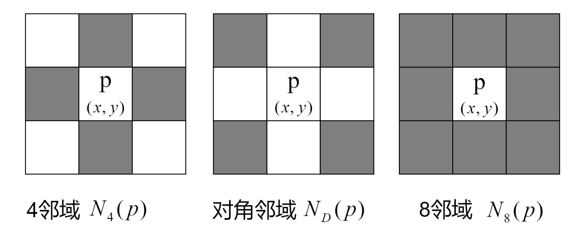

图中阴影为相应的邻域

**邻接性**

要素：像素**灰度值邻接**（灰度都在一个值域V内）；像素**位置相邻**

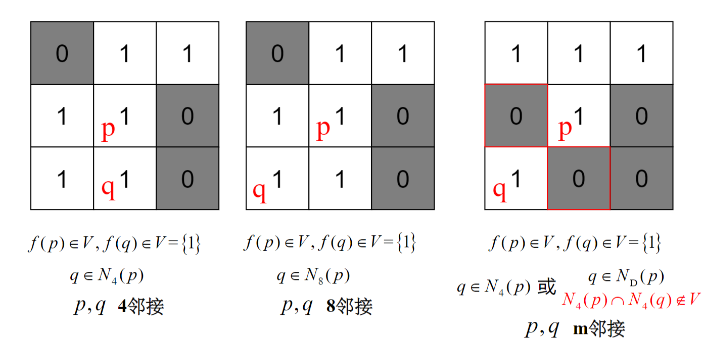

其中4邻接和m邻接都是8邻接，但8邻接不一定

**连通性**

用邻接定义的连通，x邻接就是x通路（x=4，8，m）

如果通路闭合，为闭合通路；一个通路中的任意像素连通；

连通分量见离散，只有一个连通分量，称连通集

**区域和边界**

图像的一个连通子集称为区域；如果两个区域可以连通，称为邻接区域

图像中k个不邻接的区域，且不触及图像边界，称k个区域的并集为**前景**，其余为**背景**

区域的边界：区域与图像其他部分相邻的像素集合

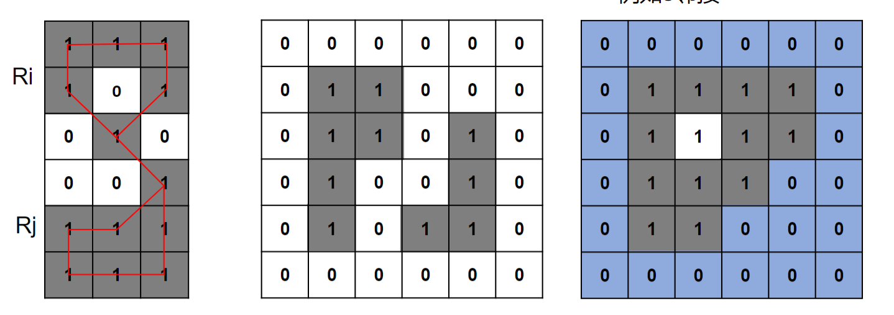

分别是邻接区域，前景，边界

**像素之间的距离**

**欧氏距离**：$D_e(p,q)=\sqrt{(x-s)^2+(y-t)^2}$

**城市街区距离**：$D_4(p,q)=|x-s|+|y-t|$

**棋盘距离**：$D_8(p,q)=\max\{|x-s|,|y-t|\}$

<table>
	<tr>
    	<td>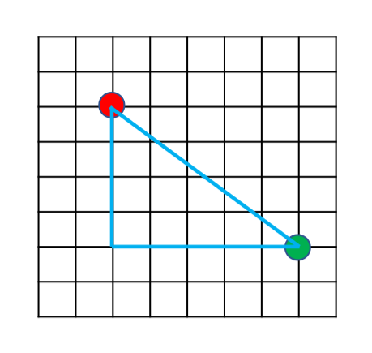</td>
        <td>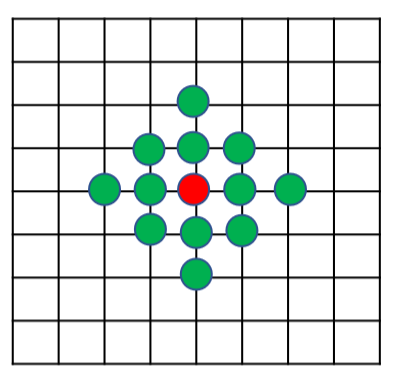</td>
        <td>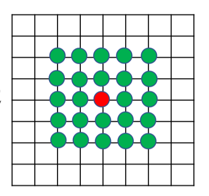</td>
    </tr>
</table>

分别是欧氏，曼距，棋盘

### 2.5 图像的列阵操作

列阵操作就是**逐个像素操作**

图像相加，相减，乘除（不是矩阵乘除，是元素）

## 3 图像增强

定义：使图像比处理前更适合一个特定的应用

图像增强：不估计图像退化过程，求得平均图像质量改进

图像复原：估计图像退化过程，有点像逆过程

**空间域图像增强**

空间域内将一个灰度区间映射到另一个灰度区间：$g(x,y)=T[f(x,y)]$，T为在(x,y)邻域上定义的算子

1x1的邻域算子：点运算增强

全图像邻域算子：直方图处理

mxn邻域算子：空间滤波

### 3.1 点运算增强

改变某一位置的灰度值，与像素位置无关，即：$s=T[r]$，其中r是原灰度，s是变换后灰度

**常见的点运算增强函数**

**阈值处理函数**

增强**图像轮廓**
$$
s=T[r]=\begin{cases}
s_0, r<k\\
s_1, r\geq k\\
\end{cases}
$$

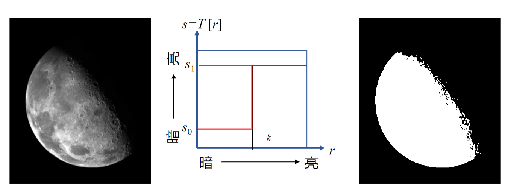

**灰度反转函数**
$$
s=T[r]=L-r-1
$$
注意要-1，防止溢出，增强**暗区域中的亮细节或亮区域内的暗细节**

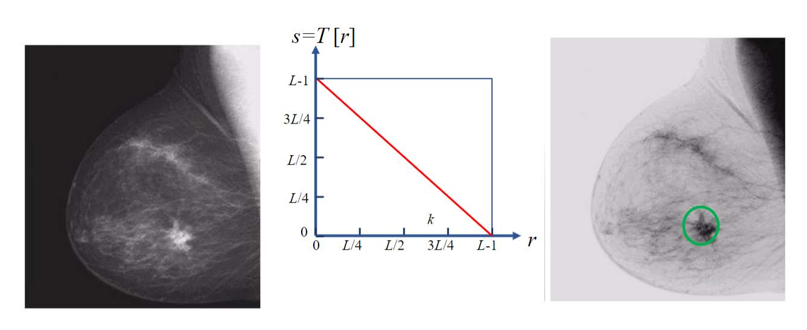

**对数变换函数**
$$
s=T[r]=c\log{(1+r)}
$$
低灰度区：拉伸；高灰度区：压缩

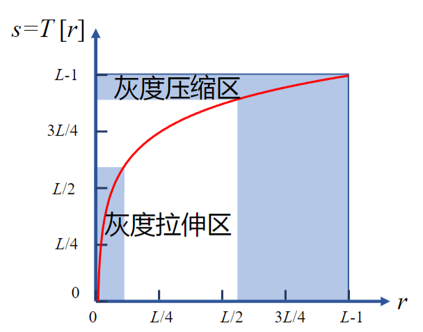

典型应用：图像的傅里叶频谱范围很广，压缩高频噪点，可以显示低频信息

**幂律变换函数**
$$
s=T[r]=cr^\gamma
$$
也称伽马变换；γ>1，压缩低灰度区；γ<1，扩展低灰度区

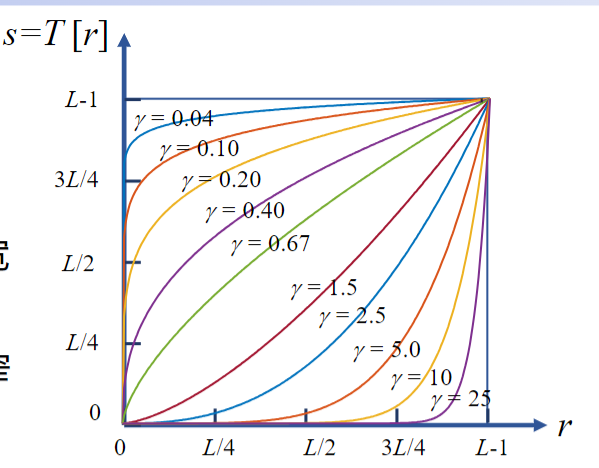

应用最广泛；让太暗的图像变亮，γ<1

**分段线性变换**

一个分段的线性函数，可以拉伸对比度

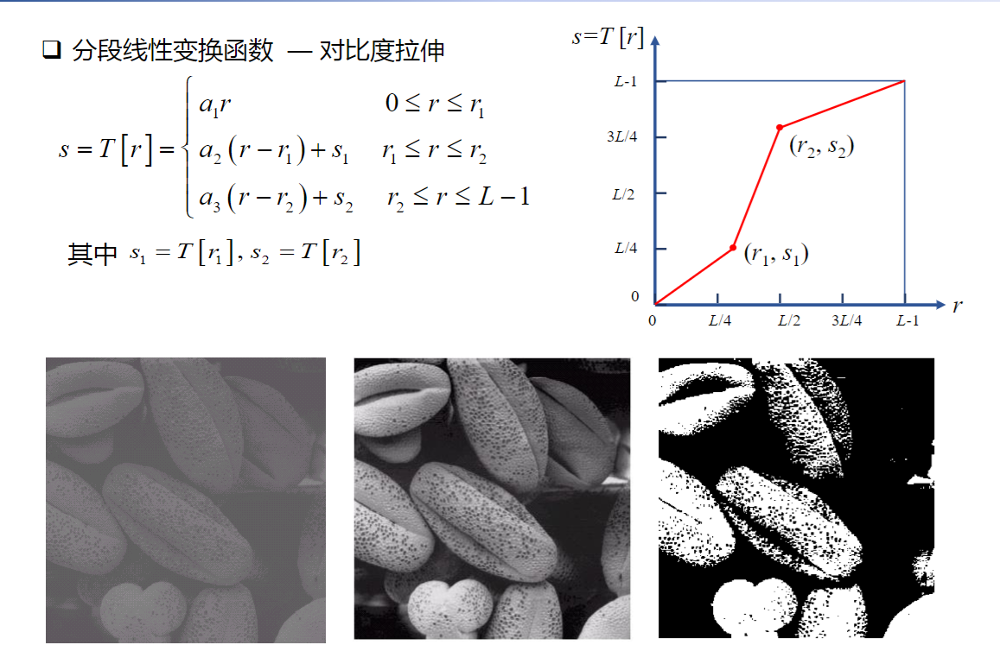

**灰度级分层**

比阈值处理函数灵活

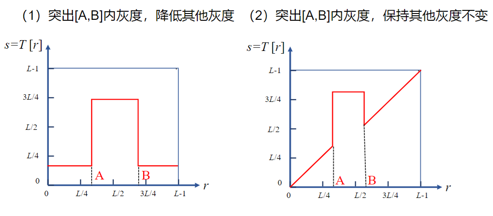

**比特平面分层**

| 十进制灰度 | 比特平面8 | 比特平面7 | ...  | 比特平面1 |
| ---------- | --------- | --------- | ---- | --------- |
| 0          | 0         | 0         | ...  | 0         |
| 1          | 0         | 0         | ...  | 1         |
| ...        | ...       | ...       | ...  | ...       |
| 255        | 1         | 1         | ...  | 1         |

用二进制表示灰度，将一张图分成8张图，按位显示

### 3.2 直方图处理

**灰度直方图**：图像中某一灰度的像素个数的分布情况，只反映灰度的分布，不反应图像位置

一幅图像的各个子区域的直方图之和等于全图的直方图

PDF：$P_r(r_k)=\frac{n_k}{\sum n}$ ； CDF：$F_r(r_k)=\sum\limits_{i=0}^k P_r(r_i)$

一般来说，像素占据整个灰度级且分布均匀的图像，将具有高对比度和多种灰色调，最好看细节

将一副图像处理成上述样子的过程，为**直方图均衡化**

#### 3.2.1 直方图均衡化

目标

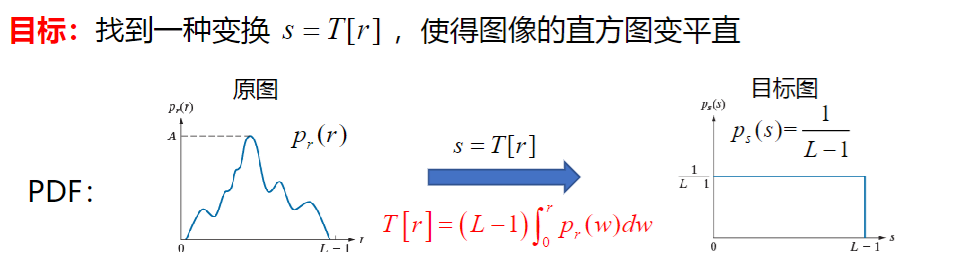

CDF：$F_r(k)=\int_0^k{p_r(r)dr}$，$F_s(k)=\int_0^k{p_s(s)ds}$

为了防止黑白颠倒，$T[\cdot]$应该是一个单增函数，即对任意的k，都有$F_r(k)=F_s(k)$（极端反例，黑色变得比白少，图像变白了）

得到$p_r(r)dr=p_s(s)ds\Rightarrow ds=(L-1)p_r(r)dr\Rightarrow s=(L-1)\int _0^r p_r(w)dw$

对于数字图像，灰度级离散，有$s_k=[T(r_k)]=[(L-1)\sum\limits_{j=0}^k p(r_j)]$，一般四舍五入

由于**取整**操作的存在，直方图均衡化**不是线性操作**，可能引起**灰度级数变化**和图像**细节损失**

不同图像经过直方图均衡化后的直方图**类似**，直方图均衡化不需要输入任何参数

优点：能自动增强图像的对比度

缺点：灰度级减少，细节损失；存在高峰的直方图，处理后不自然；结果唯一不能交互

#### 3.2.2直方图规定化

目标：修改直方图，使其与事先预定的直方图匹配

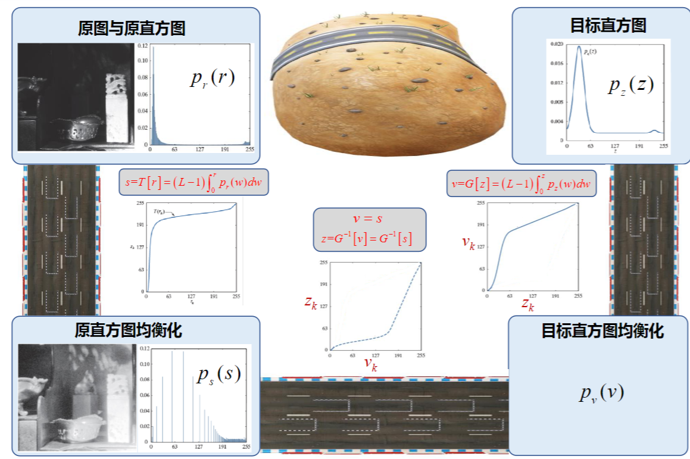

方法

1. 先将原图和目标图进行直方图均衡化，分别得到$p_s(s)$和$p_v(v)$
2. 对每一个$s_k$，找到使得$|v_q-s_k|$最接近0的$v_q$所对应的均衡化前的$z_q$
3. 重复2，建立$r_k\rightarrow z_q$的映射，其中$r_k$与$s_k$对应
4. 3中得到的映射就是最接近目标的转换函数

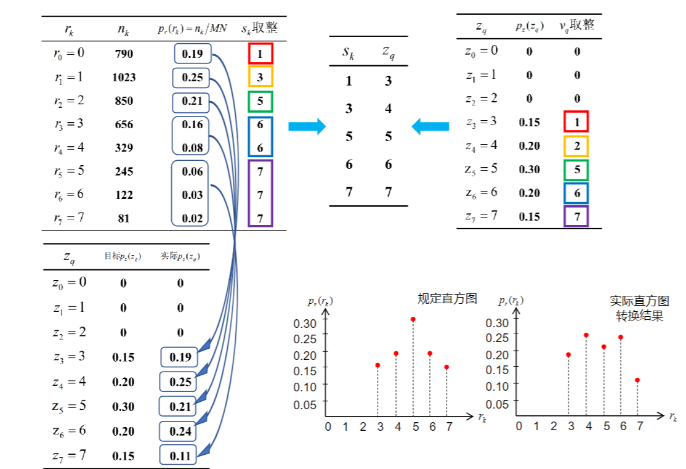

由于取整操作，存在一定偏差

#### 3.2.3**局部直方图均衡化**

对图像的小细节增强，在图像的**每一个像素**的邻域中，根据灰度级分布设计变换函数，进行直方图规定化

### 3.3 空间滤波

#### 3.3.1 **基础定义**

机制：输出图像中**每一点**关于**相关区域**的映射，实质是**相关/卷积**运算

空间滤波器又称掩膜，窗口，核，模板（Spatial Kernel）

模板中的值是**无量纲**的

滤波器的形状和大小**没有规定**，不需要一定是矩阵，没有原点

对于一个mxn，中心坐标为(0,0)的模板w(s,t)，定义以下运算

**相关运算**
$$
g(x,y)=\sum\limits_{s=-(m-1)/2}^{(m-1)/2}\,\sum\limits_{t=-(n-1)/2}^{(n-1)/2}w(s,t)f(x+s,y+t)
$$
即
$$
\left|\begin{matrix}
a & b & c\\
d & e & f\\
g & h & i\\
\end{matrix}\right|
*
\left|\begin{matrix}
z & y & x\\
w & v & u\\
t & s & r\\
\end{matrix}\right|
=az+by+cx+dw+ev+fu+gt+hs+ir
$$

**卷积运算**
$$
g(x,y)=\sum\limits_{s=-(m-1)/2}^{(m-1)/2}\,\sum\limits_{t=-(n-1)/2}^{(n-1)/2}w(s,t)f(x-s,y-t)=\sum\limits_{s=-(m-1)/2}^{(m-1)/2}\,\sum\limits_{t=-(n-1)/2}^{(n-1)/2}w(-s,-t)f(x+s,y+t)
$$
即先将模板**中心对称**，然后做相关运算
$$
\left|\begin{matrix}
a & b & c\\
d & e & f\\
g & h & i\\
\end{matrix}\right|
*
\left|\begin{matrix}
z & y & x\\
w & v & u\\
t & s & r\\
\end{matrix}\right|
=ar+bs+ct+du+ev+fw+gx+hy+iz
$$

一般模板是中心对称的，此时相关运算与卷积运算一致

#### 3.3.2 **边界处理**

很显然空间滤波后，原图的**边界**无法被映射

一副MxN的图，经过mxn的模板处理后，得到的图像大小是$[M-(m-1)][N-(n-1)]$

处理图象时要说明边界处理的方法

**舍弃边缘像素点**

图片变小

**边缘外圈补零**

用0灰度补边缘，看起来就是多了一圈黑框

**边缘外圈补边缘点像素**

分为三种补法：重复（replicate），对称（symmetric），循环（cirular）

<table>
	<tr>
    	<td>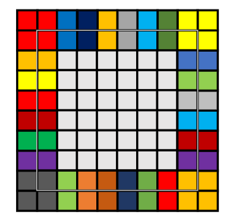</td>
        <td>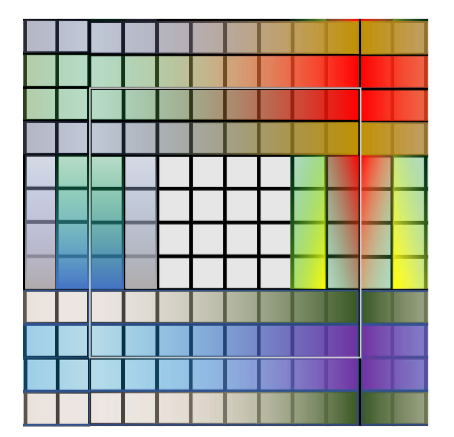</td>
        <td>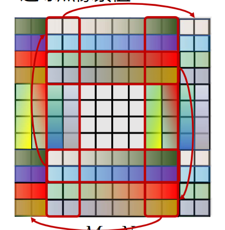</td>
    </tr>
</table>

**图像识别**

不是中心对称的图像，要用相关运算，不能用卷积运算（会先中心对称一次，识别不了）

#### 3.3.3 **空间滤波器分类**

按数学形态

1. 线性滤波器：结果像素值$R=\sum\limits_{k-1}^{mn}w_kz_k$
   1. 低通滤波器：用于**平滑图像**和**去除噪音**
   2. 高通滤波器：用于**边缘增强**和**边缘提取**
   3. 带通滤波器：用于**删除特定频率**，用的少
2. 非线性滤波器：结果像素由邻域决定
   1. 中值滤波器：$R=\mathsf{mid}\{z_k|k=1,2,...,mn\}$，用于**平滑图像**和**去除噪音**
   2. 最大值滤波器：$R=\max\{z_k|k=1,2,...,mn\}$，用于寻找**亮点**或**腐蚀亮区相邻的暗域**
   3. 最小值滤波器：$R=\min\{z_k|k=1,2,...,mn\}$，用于寻找**暗点**或**腐蚀暗区相邻的亮域**

按处理效果

1. 平滑滤波器：**削弱高频**，**突出低频**，来**滤除噪声，模糊图像**
2. 锐化滤波器：**突出高频**，**削弱低频**，来**加强细节和边缘，去模糊**

平滑--求和平均（积分）；锐化--微分差分（梯度）

**常见噪声分类**

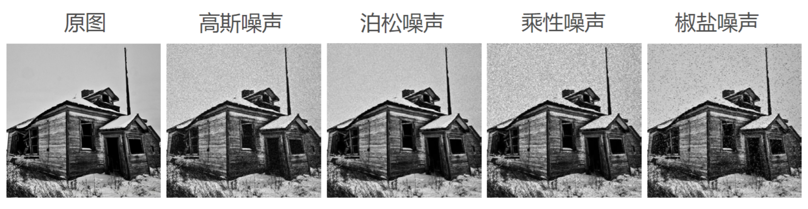

#### 3.3.4 平滑滤波器

**平滑线性滤波器**

分为**盒状滤波器**和**加权平均滤波器**

前者所有的系数相同，采用邻域均值法；后者依据像素的重要性赋予权重

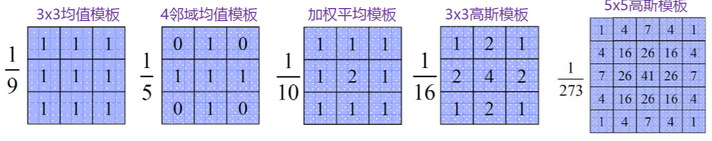

注意为了防止灰度值溢出，需要对滤波器进行**归一化**、

**盒状滤波器**

半径越大，信噪比提升越大，平滑效果越好，但是图像更模糊

优点：算法简单，速度快

缺点：在边缘和细节处模糊

**加权平均滤波器**

重点在于选择参与平均的点数和各点的权重；**待处理**的点和**离它越近**的点权重越大

优点：保留了边缘细节

**平滑非线性滤波器**

主要是中值滤波器，它对**滤波脉冲干扰**和**颗粒噪声**（如椒盐噪声）很有效，在消除噪声的时不会/小程度边缘模糊

但是对一些**细节多**（点/线/尖顶）的图像，不能用中值滤波

在医学图像中，病灶一般符合细节特点，故医学图像不能中值滤波

**平滑滤波器小结**

1. 本质是低通，模板的所有系数为正数
2. 通常要求行列数为奇数
3. 模板越大，去噪能力越强
4. 一般会模糊边缘和细节

#### 3.3.5 **锐化滤波器**

**梯度运算**

一阶差分：$\frac{\part f}{\part x}=f(x+1,y)-f(x,y)$

二阶差分：$\frac{\part^2 f}{\part x^2}=[f(x+1,y)-f(x,y)]-[f(x,y)-f(x-1,y)]=f(x+1,y)+f(x-1,y)-2f(x,y)$

一阶差分对**灰度阶梯**有较强响应，会产生**较宽的边缘**

二阶差分对**细节**有较强响应，对灰度阶梯产生双响应

二阶的处理比一阶好（细节），一阶主要提取边缘

**拉普拉斯算子**
$$
\nabla^2f=\frac{\part^2f}{\part x^2}+\frac{\part^2f}{\part y^2}
$$
Laplace算子的模板是
$$
\left|\begin{matrix}
0 & 1 & 0\\
1 & -4 & 1\\
0 & 1 & 0\\
\end{matrix}\right|
$$
是最简单的各向同性算子（旋转90°不变），且是**线性**的

以上是水平竖直的差分，也能定义斜的差分
$$
\left|\begin{matrix}
1 & 0 & 1\\
0 & -4 & 0\\
1 & 0 & 1\\
\end{matrix}\right|
$$

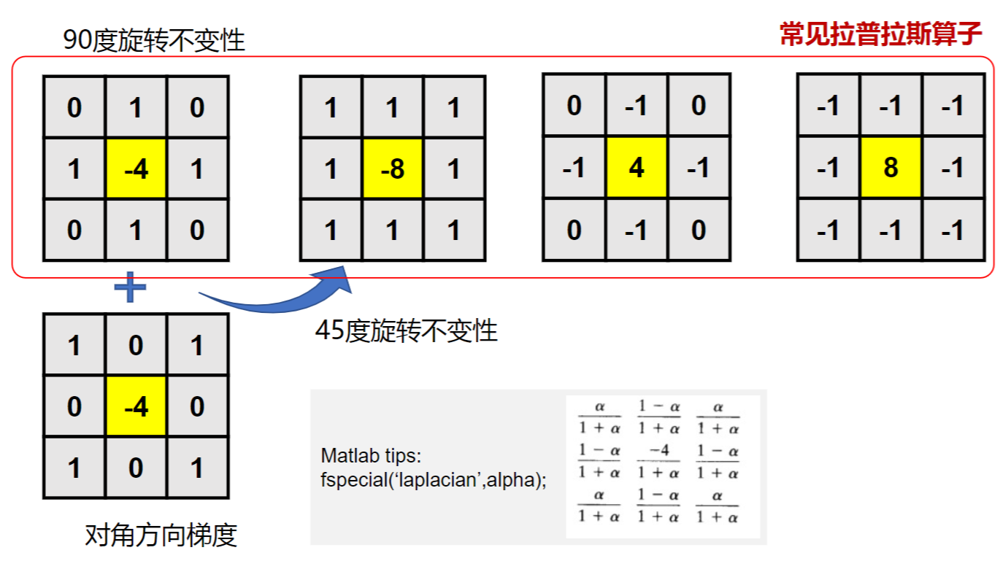

当α取0，表示水平竖直；当α=1，表示斜向

所有的Laplace算子模板，其数值之和**恒等于0**

**拉普拉斯增强**

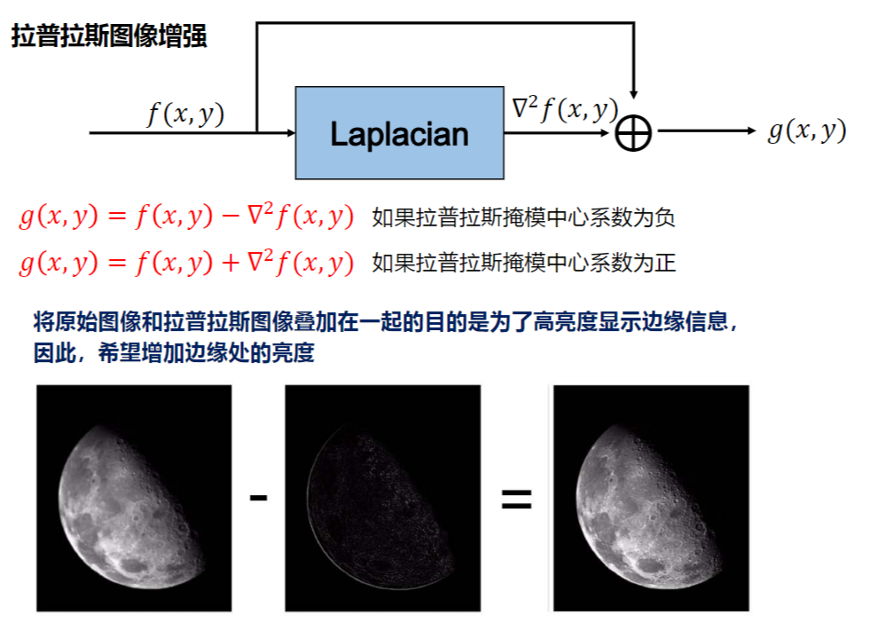

可以增加边缘的亮度，注意正负号

有**锐化**作用

由于Laplace算子存在负数，在处理后可能出现负的灰度，一般有两个处理

1. 所有负值**用0**替代，结果导致黑色部分多
2. 将（min，max）映射到（0，L-1）

$g(x,y)=f(x,y)+\nabla^2f(x,y)$，α=0时的算子
$$
\left|\begin{matrix}
0 & -1 & 0\\
-1 & 5 & -1\\
0 & -1 & 0\\
\end{matrix}\right|
$$
这个模板的锐化效果更好
$$
\left|\begin{matrix}
-1 & -1 & -1\\
-1 & 9 & -1\\
-1 & -1 & -1\\
\end{matrix}\right|
$$

**钝化掩蔽**

也叫非锐化掩蔽

记$\overline f(x,y)$为原图的**平滑**处理，则$g_{\mathsf{mask}}(x,y)=f(x,y)-\overline{f}(x,y)$为锐化模板（损失低频，保留高频）

最终得到$g(x,y)=g_{\mathsf{mask}}(x,y)+f(x,y)$

**梯度增强**

存在**负值**和**溢出**

利用梯度算子的模量$M(x,y)=|\nabla f(x,y)|=\sqrt{f_x^2+f_y^2}$

由于这个运算很耗时，用近似处理

$\sqrt{f_x^2+f_y^2}=\sqrt{(f(x+1,y)-f(x,y))^2+(f(x,y+1)-f(x,y))^2}$

$=\sqrt{(z_6-z_5)^2+(z_8-z_5)^2}\approx|z_6-z_5|+|z_8-z_5|$

得到基本梯度算子（保证一正一负即可，有绝对值）

x掩膜：$\left|\begin{matrix}1 & -1\\0 & 0\\\end{matrix}\right|$；y掩膜：$\left|\begin{matrix}1 & 0\\-1 & 0\\\end{matrix}\right|$

如果α=1.则是Roberts算子：x淹膜：$\left|\begin{matrix}-1 & 0\\0 & 1\\\end{matrix}\right|$；y掩膜：$\left|\begin{matrix}0 & -1\\1 & 0\\\end{matrix}\right|$

这个算子**边缘定位准，对噪声敏感**，突出斜线

**Sobel梯度算子**

$M(x,y)\approx |(z_7+2z_8+z_9)-(z_1+2z_2+z_3)|+|(z_3+2z_6+z_9)-(z_1+2z_4+z_7)|$

x掩膜：$\left|\begin{matrix}-1 & -2 & -1\\0 & 0 & 0\\1 & 2 & 1\\\end{matrix}\right|$；y掩膜：$\left|\begin{matrix}-1 & 0 & 1\\-2 & 0 & 2\\-1 & 0 & 1\\\end{matrix}\right|$

优点：

1. 奇数大小，方便卷积
2. 突出中心，平滑
3. 突出横竖线

**混合空间增强**

使用多个滤波器，当使用线性滤波器时，在数学上是可以换序的（不能对整型灰度操作）

## 4 形态学

**基本想法**

用具有一定形态的**结构元素**去度量和提取图像中的对应形状，为了识别和分析

### 4.1 集合论

**补集**：记为$A^c=\{w|w\notin A\}$

**差集**：$A-B=A\cap B^c = \{w|w\in A \and w\notin B\}$

**平移**：将集合B的**原点**平移到$z=(z_1, z_2)$，则集合B重新记为$(B)_z=\{w|w = d+z,d\in B\}$

**反射**：集合B按照原点**中心对称**，$\hat{B}=\{w|w=-b, b\in B\}$

### 4.2 结构元

一个像素集合，**没有**大小和形状**限制**，但必须有**原点**（可以任意位置，filter没有原点）

通常情况下假定结构元是矩阵，数值是**逻辑**0/1，原点是中心点

在形态学运算中，只关心结构元的前景（1）的逻辑运算

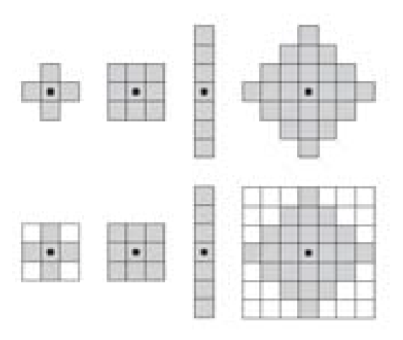

逻辑运算的结果是像素点，使用结构元的原点遍历图像的每一个像素

### 4.3 在二值图像中的操作

#### 4.3.1 基本操作：适合（Fit）和击中（Hit）

**适合**：结构元中所有1都和图像区域重合

**击中**：结构元中存在1和图像区域重合

#### 4.3.2 腐蚀

集合A用结构元B来腐蚀，记为$A\ominus B$，定义为
$$
A \ominus B = \{z|(B)_z\subseteq A\} \Leftrightarrow \{z|(B)_z\cap A^c = \phi\}\\
A(z)=
\begin{cases}
1\,\,\,\, (B)_z \mathsf{Fits} A\\
0\,\,\,\, o.w.
\end{cases}
$$
表示B移动后完全在A中，B的**原点位置**的集合

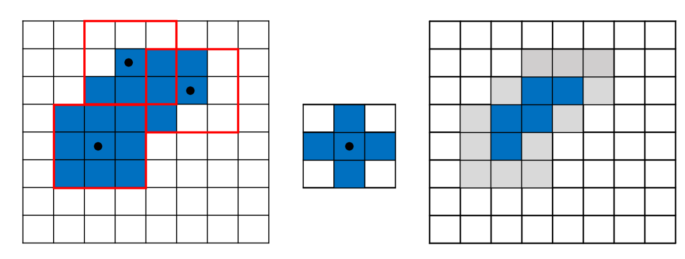

腐蚀可以**消除边界点**，使边界向内部收缩，可以消除小且无意义的物体

#### 4.3.3 膨胀

集合A用结构元B来膨胀，记为$A\oplus B$，定义为
$$
A \oplus B = \{z|\hat{(B)_z}\cap A\neq \phi\}\\
A(z)=
\begin{cases}
1\,\,\,\, \hat{(B)_z} \mathsf{Hits} \,\,\,A\\
0\,\,\,\, o.w.
\end{cases}
$$
表示B的**反射**进行平移且与A存在非空交集，B的**原点的位置**的集合

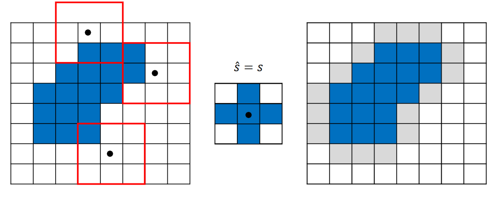

膨胀使得边界**向外部扩展**，增加大小，填补缺口和凹陷

#### 4.3.4 腐蚀与膨胀的对偶性

$$
(A\ominus B)^c = A^c\oplus \hat{B}\\
(A\oplus B)^c = A^c\ominus \hat{B}
$$

#### 4.3.5 开运算

集合A用结构元B进行开运算，就是先用B腐蚀A，再对结果进行膨胀，记为$A\circ B$
$$
A\circ B = (A\ominus B)\oplus B
$$
开运算能后去除孤立的小点，毛刺和小桥

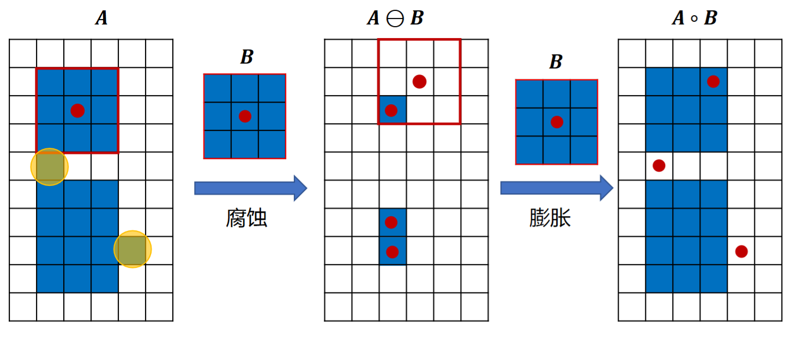

**几何解释**

B在A边界**内部**转动，B中的点能达到的A的内部的最远的点，即
$$
A\circ B = \bigcup \{(B)_z|(B)_z\subseteq A\}
$$
所有的平移后的**结构元**的集合（与原点的集合区分）

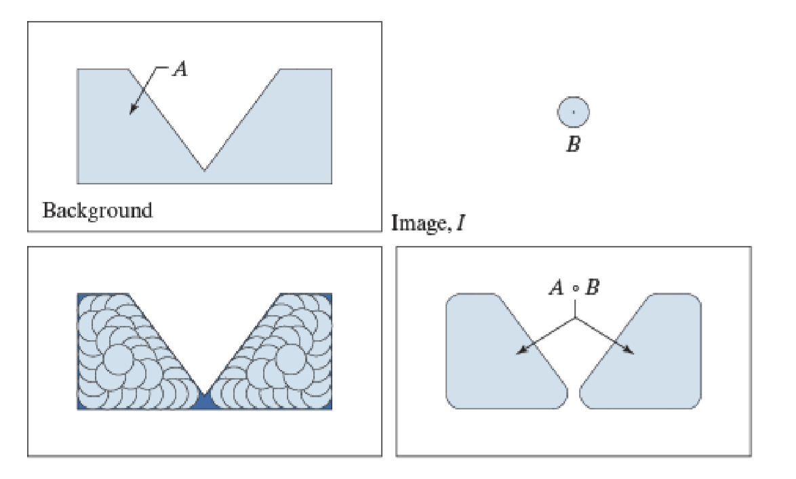

#### 4.3.6 闭运算

结构元B对集合A做闭运算，就是先用B对A膨胀，后用B对结果进行腐蚀，记为$A\cdot B$
$$
A \cdot B = (A\oplus B )\ominus B
$$
闭运算可以填补物体内细小空洞，连接临近物体

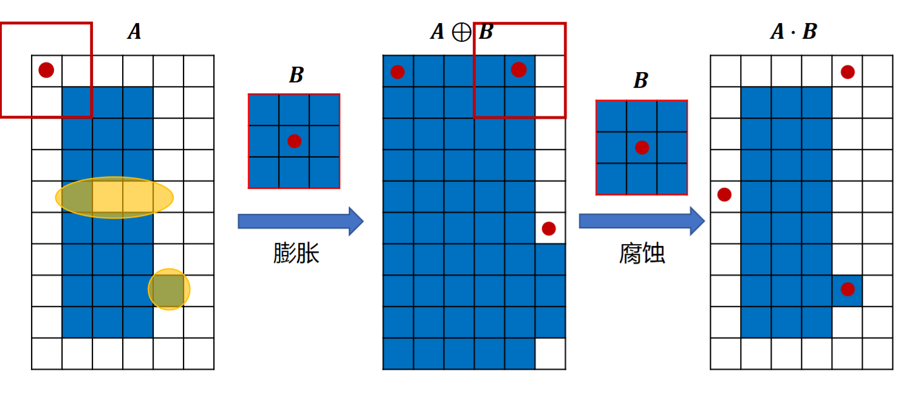

**几何解释**

B在A的**外边界**转动，B中的点能达到的A的边界的最近点

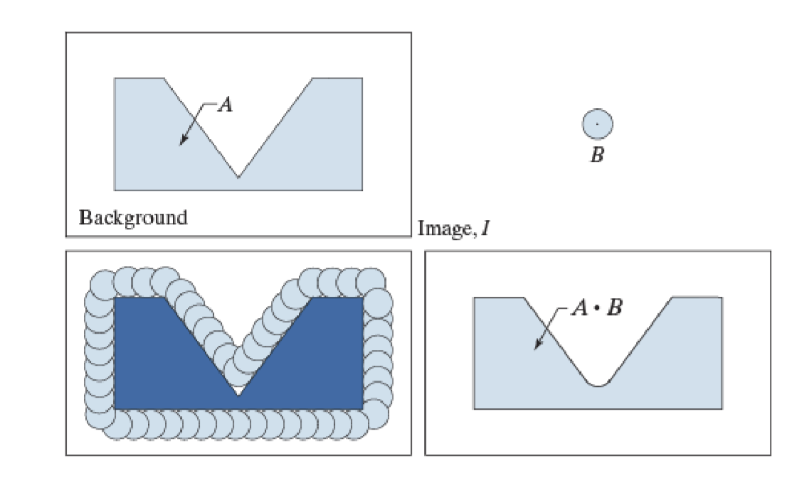

#### 4.3.7 开运算与闭运算

1. 先开操作，构成了噪声滤波器，将小的噪声颗粒去除
2. 但是内部的一些有效性息也没了，需要闭运算进行修补

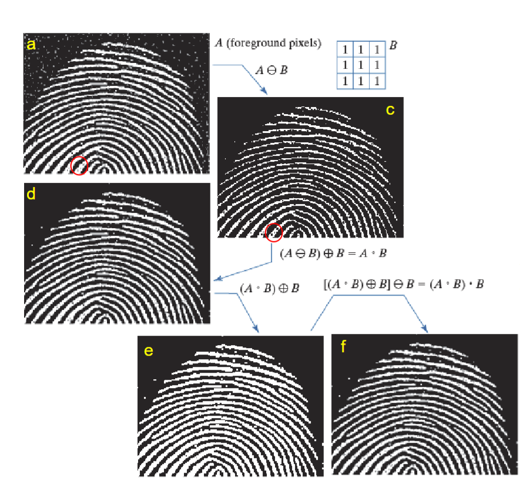

**对偶性**
$$
(A\cdot B)^c = A^c \circ \hat{B}\\
(A\circ B)^c = A^c \cdot \hat{B}
$$

**开运算性质**

1. $A\circ B \subseteq A$
2. 如果$C \subseteq D$，那么$C\circ B \subseteq D\circ B$
3. $(A\circ B )\circ B = A \circ B$

**闭运算性质**

1. $A \subseteq A\cdot B$
2. 如果$C \subseteq D$，那么$C\cdot B \subseteq D\cdot B$
3. $(A\cdot B )\cdot B = A \cdot B$

#### 4.3.8 击中-击不中变换

定义两个结构元$B_1,B_2$，在前景中使用$B_1$进行腐蚀，在背景中使用$B_2$
$$
A \circledast B_{1,2} = \{z|(B_1)_z\subseteq A \and(B_2)_z\subseteq A^c  \} = (A\ominus B_1)\cap(A^c\ominus B_2)
$$
一般选定的$B_1 = B, B_2=B^c$，此时的返回结果就是**A中与B一摸一样的结构的原点**

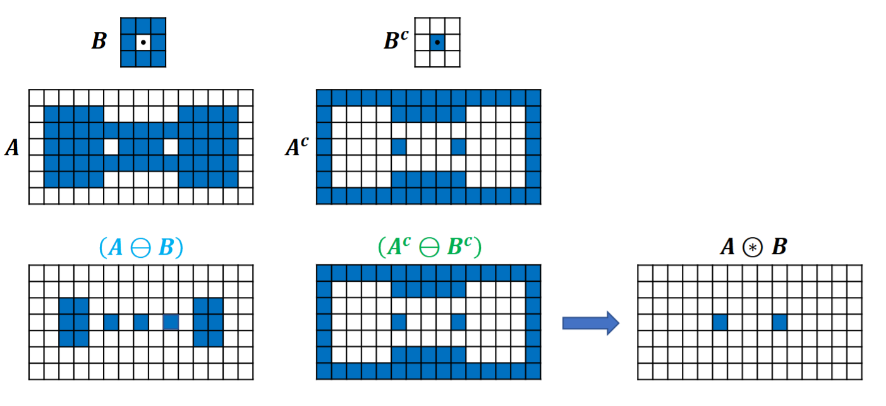

#### 4.3.9 边界提取

边界定义为$\beta(A)$，使用结构元B腐蚀A，然后求其与A的差集
$$
\beta(A) = A - (A \ominus B)
$$
其中B是8邻接的

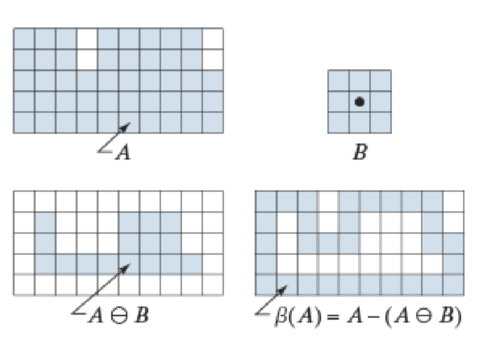

边界提取相对于锐化滤波的好处：后者通常对噪声敏感，边缘不连续不规则

#### 4.3.10 孔洞填充

将**闭合**边界内部的空洞填满
$$
X_k = (X_{k-1} \oplus B) \cap A^c
$$
当$X_k = X_{k-1}$时，停止迭代；A是原图中的一个轮廓，B是4邻接的

需要先给定一个**种子点**，从种子点膨胀至整个孔洞，最后与原图做并集，得到填充完的图像

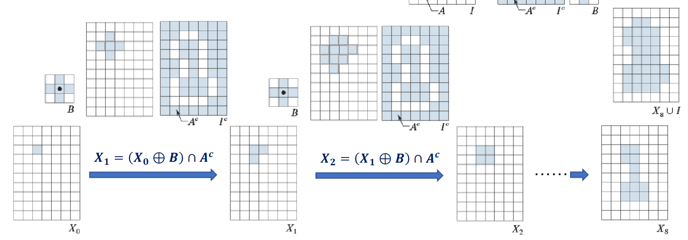

为了找出所有的孔洞，可以使用阈值变换

当边缘未闭合时，收敛次数会很大，因为背景也在填充。通过设置收敛次数的阈值，可以用来检测**图像是否闭合**

**如何一次性找出所有的种子点？**

利用白顶帽，将本就灰度低的孔洞灰度变得更低，可以认为灰度为0，然后用阈值反变换，将0变为255，得到所有的孔洞种子

但是风险也很明显

#### 4.3.11 连通分量提取

$$
X_k = (X_{k-1} \oplus B) \cap I
$$

当$X_k = X_{k-1}$时，停止迭代；I是原图，B是8邻接的

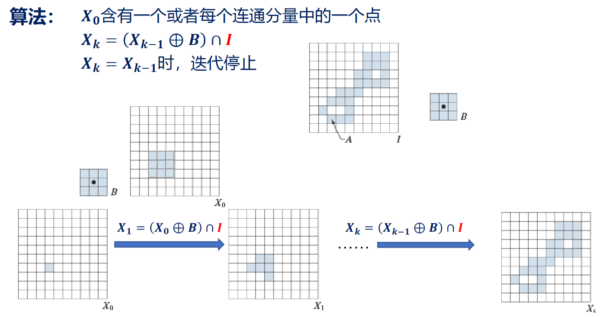

算法和孔洞填充很像，但是B和I不同

#### 4.3.12 凸壳

一个多边形内任意两点的连线在多边形内，则称这是个凸集

集合$S$的**最小凸集**$H$称为S的凸集合，$H-S$称为凸缺

图像在采集时可能由于光照等原因发生缺损，凸壳处理可以弥补缺损

求$A$的凸壳$C(A)$的算法如下：

令$B^i$如下所示，其中$\times$表示don't care term

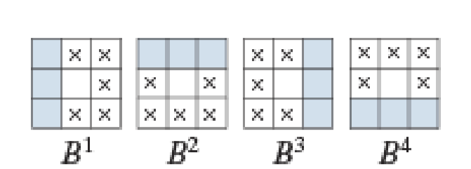

$$
X^i_k = (X^i_{k-1}\circledast B^i)\cup X_{k-1}^i
$$

其中$X^i_0 = A$，当$X_k^i = X_{k-1}^i$时结束，记$D^i = X_k^i$，则凸壳为
$$
C(A) = \bigcup \limits_{i=1}^4 D^i
$$

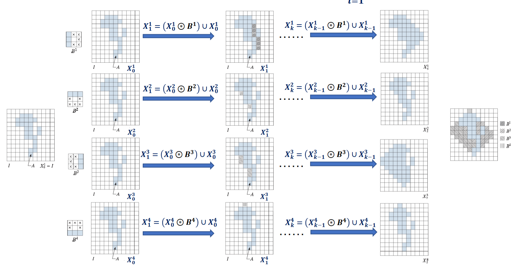

但是还没结束，这样并不是最小的，需要在水平和垂直方向上再限制大小

或者设计更精准的结构元，代价是时间复杂度更高

<table>
	<tr>
    	<td>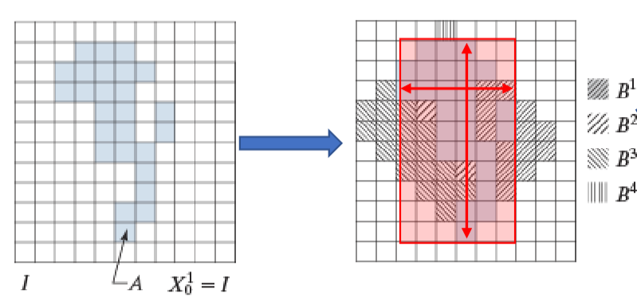</td>
        <td>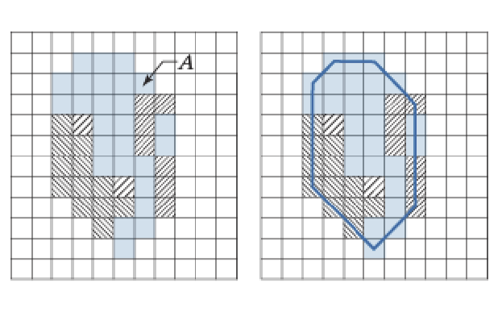</td>
    </tr>
</table>

#### 4.3.13 细化

细化表示为
$$
A \otimes B = A - (A\circledast B) = A\cap (A\circledast B)^c
$$
定义结构元序列$\{B^i\}$，$B^{i+1}$通常是$B^i$的旋转，使用这个序列对$A$连续细化，直到$A$不再发生改变为止

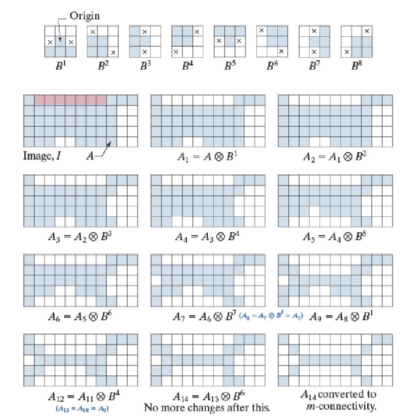

#### 4.3.14 粗化

粗化表示为
$$
A \odot B = A\cup (A\circledast B)
$$
与细化类似，可以用一系列的$B^i$操作

实际中通常是先对$A^c$细化得到$C$，再求$C^c$得到粗化的结果，不过会产生一些断点

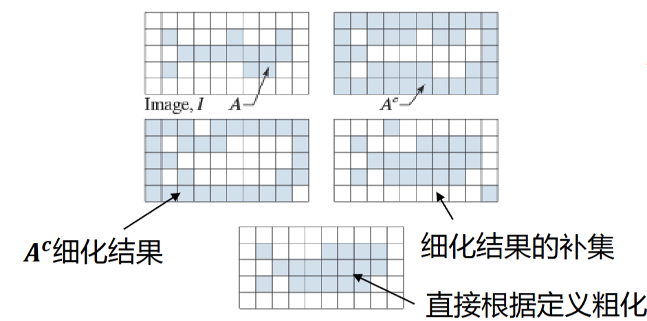

#### 4.3.15 骨架

角平分线

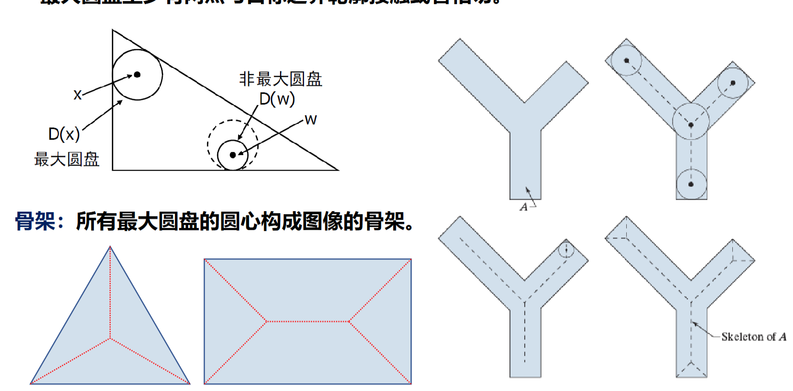

可以通过腐蚀和开运算来实现
$$
S(A) = \bigcup\limits_{k=0}^N S_k(A)
$$
其中$S_k(A)=(A\ominus kB)-(A\ominus kB)\circ B$，$A\ominus kB$表示连续$k$次腐蚀，$N$是$A$被腐蚀为空集前最后一次迭代

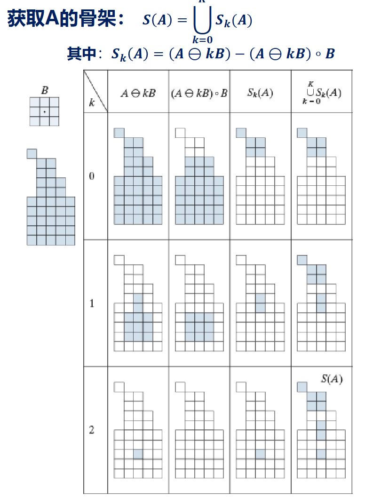

上面$N=2$

可以通过$A$的骨架的**子集**来重建$A$，注意存储的是子集
$$
A = \bigcup\limits_{k=0}^N (S_k(A)\oplus kB)
$$

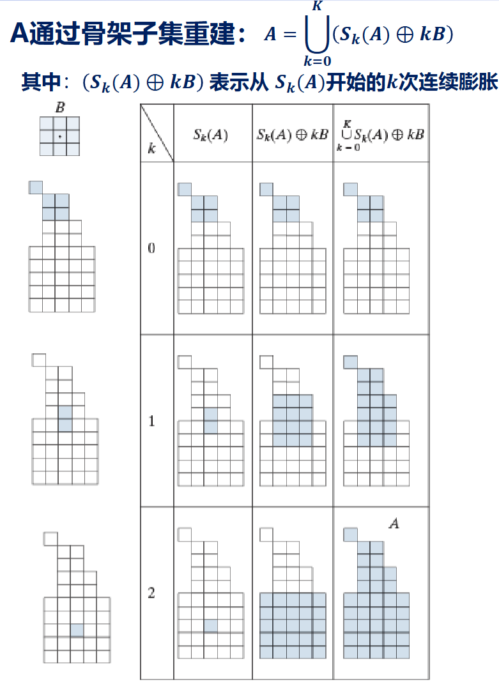

#### 4.3.16 剪裁

是对细化和骨架化的补充

分为以下几步：

细化
$$
X_1 = A\otimes \{B\}
$$
多次细化消除毛刺

寻找端点
$$
X_2 = \bigcup\limits_{k=1}^N (X_1\circledast B^k)
$$
其中$N$是$B^i$的个数

膨胀，次数等于细化的次数（也就是删除的毛刺的最大元素个数）
$$
X_3 = (X_2\oplus H)\cap A
$$
其中$H$是一个满的正方形

取并集
$$
X_4 = X_1\cup X_3
$$
得到的$X_4$就是目标结果

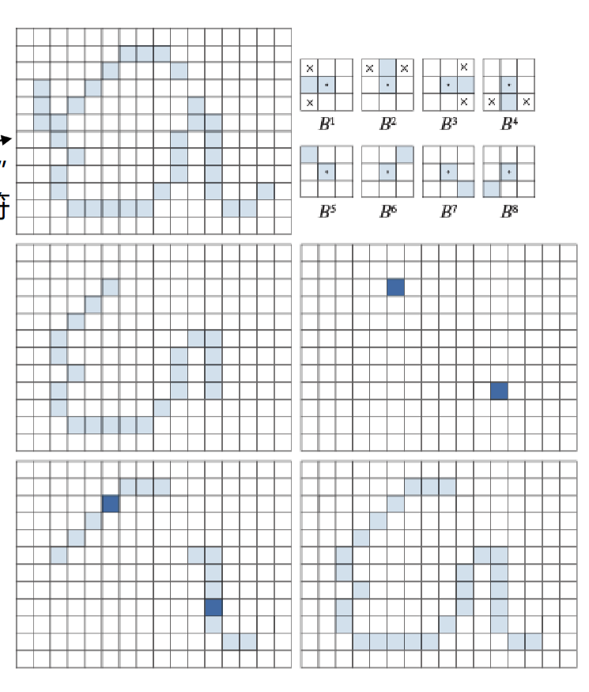

上面有3个删除的毛刺，膨胀了3次

### 4.4 灰度级形态学

结构元分为**平坦/非平坦**，前者只有0和1，后者多样

同样地，结构元存在原点，但是不同的是结构元的每一个像素值是**灰度值**

#### 4.4.1 腐蚀与膨胀

对平坦结构元$b$，当其原点位于$(x,y)$时，腐蚀和膨胀分别如下，也就是这个范围内灰度的**极值**
$$
[f \ominus b](x,y) = \min\limits_{(s,t)\in b}\{f(x+s,y+t)\}\\
[f \oplus b](x,y) = \max\limits_{(s,t)\in b}\{f(x-s,y-t)\}\\
$$
$"-"$产生自对b的中心对称

对非平坦结构元，定义为
$$
[f \ominus b](x,y) = \min\limits_{(s,t)\in b}\{f(x+s,y+t)-b(s,t)\}\\
[f \oplus b](x,y) = \max\limits_{(s,t)\in b}\{f(x-s,y-t)+\hat{b}(s,t)\}\\
$$
其中$\hat{b}(x,y) = b(-x,-y)$，一一对应相加减

对偶特性依然在
$$
[f\ominus b]^c = f^c\oplus \hat{b}\\
[f\oplus b]^c = f^c\ominus \hat{b}
$$
其中$f^c(x,y) = -f(x,y)$

一般腐蚀后更暗，膨胀后更亮

#### 4.4.2 开闭运算

定义同二值图像

满足
$$
[f\circ b]^c  = f^c\cdot \hat{b}\\
[f\cdot b]^c = f^c\circ \hat{b}
$$
几何解释如下

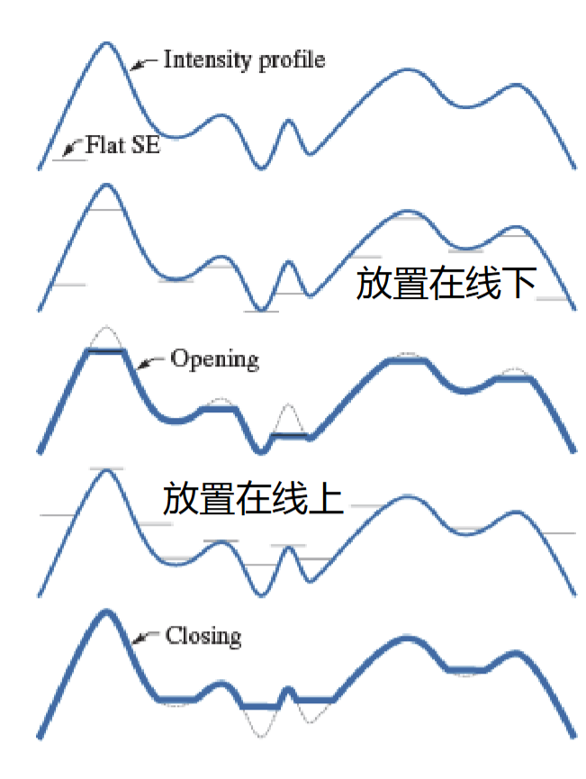

这是一维的灰度刨面图，开运算就是从下方削去峰值，闭运算就是从上方填平谷值

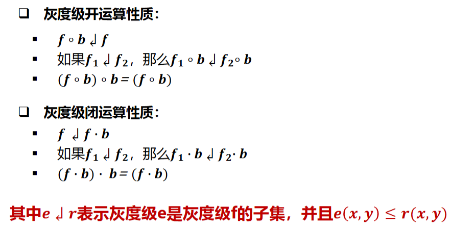

红字的$f$改为$r$

开运算对图像的暗特征和背景的影响**忽略不计**，但**亮特征变小**；闭运算相反；**效果取决于结构元大小**

**开闭运算的组合可以产生形态学滤波器进行平滑和去噪**

#### 4.4.3 形态学梯度

定义
$$
g = (f\oplus b)-(f\ominus b)
$$
为灰度图像的形态学梯度，其中$b = I_{3\times 3}$，原点在中心

#### 4.4.4 顶帽变换和底帽变换

白顶帽变换和黑底帽变换分别是
$$
T_{hat}(f) = f - (f\circ b)\\
B_{hat}(f) = (f \cdot b) -f
$$
白顶帽可以获取大的亮特征，除去暗特征

黑底帽可以获取大的暗特征，除去亮特征

一个重要应用是矫正不均匀光照的影响，进行阈值处理之前先进行对应的帽变换

#### 4.4.5 粒度测定

特殊大小的开运算会对包含类似大小颗粒的区域产生最大影响，用不同大小的结构元对图像进行开运算，除去的就是类似大小的结构，可以进行粒度的检测和统计

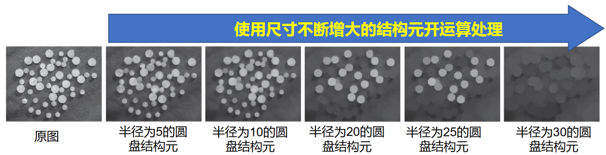

#### 4.4.6 纹理分割

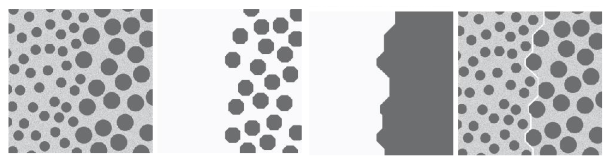

如何一步一步得到右边的图像：

1. 选用小结构元进行闭运算，得到第二张图
2. 用很大的结构元进行开运算，得到第三张图
3. 对第三张图进行形态学梯度变换得到纹理边界，将边界叠加到原图上得到第四张图

## 5 图像分割

图像处理的整个过程

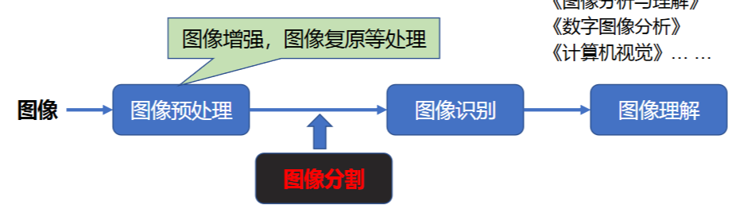

### 5.1 图像分割基础

$R$表示全图，$R_i$表示分割后的图像的子图，有以下条件

1. $R = \bigcup R_i$，分割必须完全
2. $R_i$是一个联通集
3. $R_i \cap R_j=\phi (i\neq j)$，各个区域不相交
4. $P(R_i)=True$，$R_i$必须满足一定的属性（谓词逻辑）
5. $P(R_i\cup R_j)=False$，其中$R_i$和$R_j$邻接，任意两个相邻区域不能同时满足一个属性

### 5.2 区域间不连续

有三类不连续的灰度：点（孤立点）；线（较细）；边缘（相连边缘像素集合）

由于一阶微分处理通常会产生**较宽的边缘**，二阶微分处理**对细节有较强的响应**（细线/孤立点），在不同情况下用不同的算法

#### 5.2.1 孤立点检测

使用空间拉普拉斯算子$\nabla^2f=\frac{\part^2f}{\part x^2}+\frac{\part^2f}{\part y^2}$
$$
\left|
\begin{matrix}
-1&-1&-1\\
-1& 8&-1\\
-1&-1&-1\\
\end{matrix}
\right|
$$
整个过程的流程如下

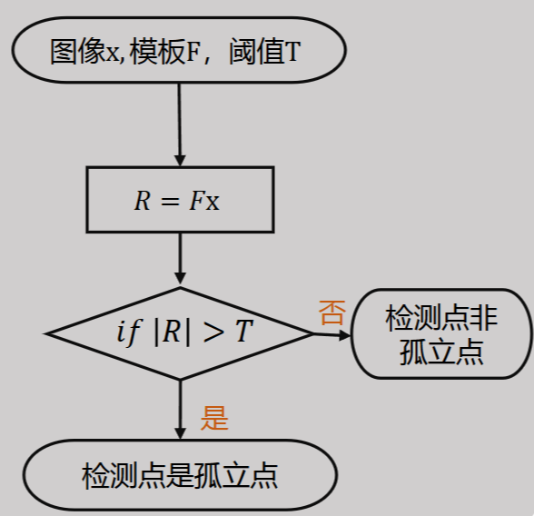

当$R$的值足够大才能说明这个点是孤立的点

#### 5.2.2 线检测

也使用上面的算子，但是这样会产生正负的值，有以下的处理情况

1. 取绝对值：得到的线宽会加宽
2. 取正值：获得单线
3. 存在噪声：取阈值

由于存在山谷效应（较宽的线中间没有响应），线检测通常指**细线**，**宽度小于卷积核大小**

而且拉普拉斯核是各向同性的，响应与线的方向无关，设计和方向有关的检测核

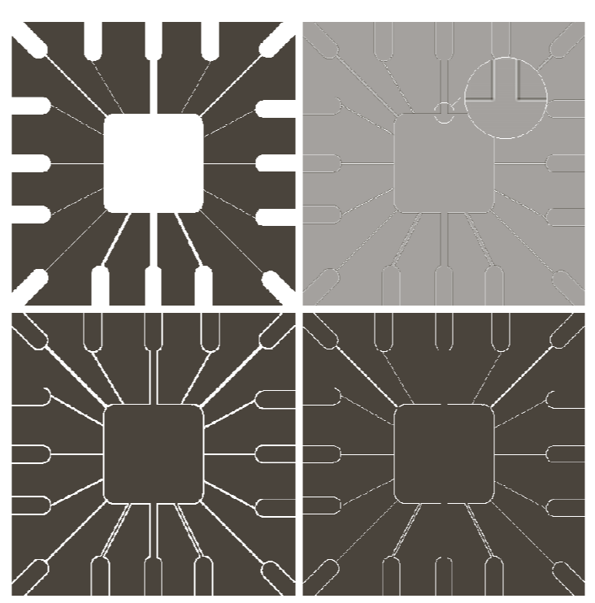

左上角是原图，右上角是阈值变换，左下角是取了绝对值，右下角是取了正值

可以发现有些较粗的线只有边缘，中间没了

**规定线方向检测核**

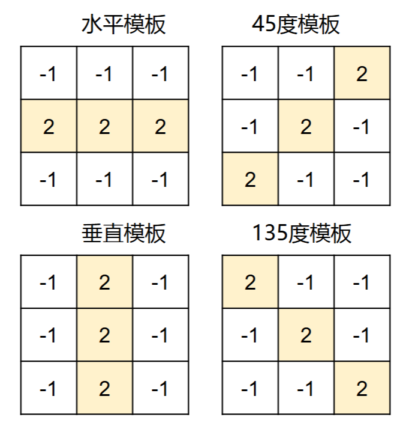

注意卷积操作会**中心对称**模板，模板设计要注意以下标准

1. 可以大于3*3
2. 模板系数和为0
3. 感兴趣的方向系数大

#### 5.2.3 边缘检测

存在3种边缘模型

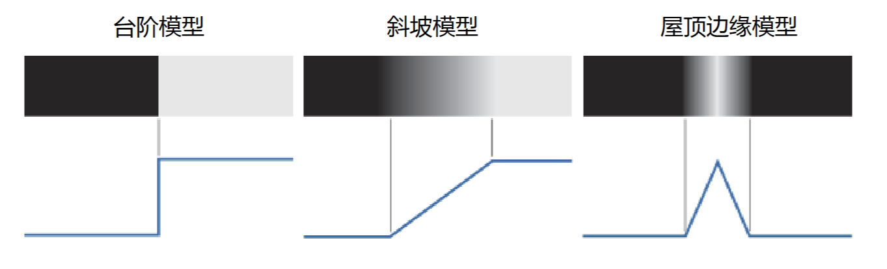

边缘检测的原理：导数在边缘方向取到极值

基本思路：计算局部的一、二阶导数

1. 一阶导数**直接定位边缘点**
2. 二阶导数的**过零点**可以定位边缘的**中心**
3. 二阶导数对噪声敏感，有时不好用，可以先平滑

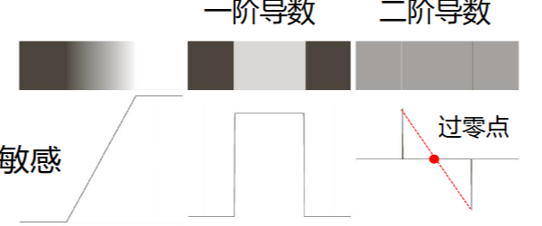

不同操作的结果如图

常见边缘检测方法

1. 梯度算子

   1. 基本梯度算子
   2. Roberts算子
   3. Prewitt算子
   4. Sobel算子

   以上都是一阶微分算子

2. 拉普拉斯算子，对噪声非常敏感，通常不单独使用

3. LoG（拉普拉斯高斯算子）

4. Canny算子

**梯度算子**

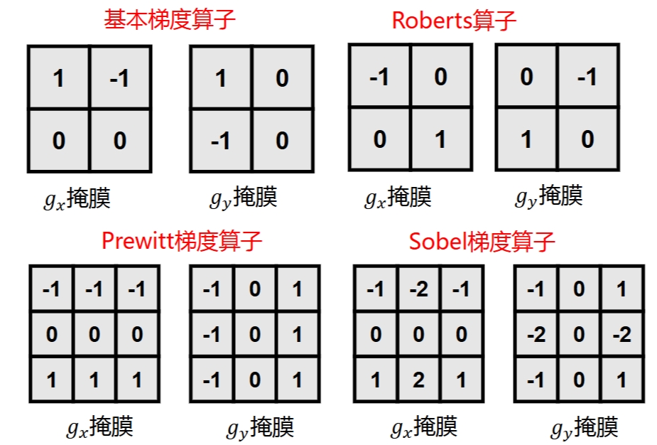

Sobel的y掩膜的右边的-2改为2

梯度幅度为
$$
M(x,y)=|\nabla f(x,y)|=\sqrt{f_x^2+f_y^2} \approx |f_x|+|f_y|
$$
梯度方向为
$$
\alpha(x,y) = \tan^{-1}\frac{f_y}{f_x}
$$
边缘的方向与梯度方向垂直，则
$$
\phi = \alpha(x,y) -90^\circ
$$
上式中$f_x,f_y,M(x,y), \alpha(x,y)$都是和原图大小相同的矩阵（边缘补全了）

**LoG算子**

将高斯滤波和拉普拉斯边缘检测结合在一起，算子为
$$
LoG = \nabla^2G(x,y) = \frac{\part^2G(x,y)}{\part x^2}+\frac{\part^2G(x,y)}{\part y^2}=\frac{x^2+y^2-2\sigma^2}{\sigma^4}e^{-\frac{x^2+y^2}{2\sigma^2}}
$$
等效于先用一个高斯滤波后在用拉普拉斯算子

这个模板**对平坦区域无响应**，故算子内的系数和应该为0，否则需要调整模板

模板非零部分的大小为$3\sigma$为宜，5阶的模板如下
$$
\left|
\begin{matrix}
0&0&-1&0&0\\
0& -1&-2&-1&0\\
-1&-2&16&-2&-1\\
0& -1&-2&-1&0\\
0&0&-1&0&0\\
\end{matrix}
\right|
$$
由于用到了二阶导数，需要使用检测0交叉来定位边缘，过程如下

1. 使用一个3*3的领域，检查中心点中心对称元素的符号情况（相乘）
2. 符号小于0说明中心点是边缘的中心
3. 当存在噪声时，还需要对正负值的绝对值之差进行阈值检测，**只有绝对值差的足够小才不是噪声**

优点：有平滑滤波，可以克服噪声的影响

缺点：可能产生假边缘（二阶微分缺点）；对曲线边缘的定位误差大（对角线都是直的）

**Canny算子**

Canny提出边缘检测的三大目标

1. 低错误率（信噪比高）：所有边缘都被检测，没有虚假响应
2. 边缘点被很好的定位（定位准确）
3. 单个边缘响应：真实边缘周围的局部最大数应该最小

Canny算法流程如下：

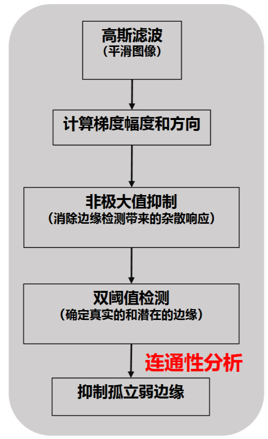

前两个就正常做，使用高斯算子和梯度算子（一阶微分）

第三步，寻找最接近$\alpha(x,y)$的方向$d_k$，若在这个方向上，$M(x,y)$小于邻域内的邻点的幅度，则将$M(x,y)$置零（非极大值抑制）

第四步，使用两个阈值（一大一小），得到两幅阈值变换的图，记为$g_H,g_L$，做$g_N = g_L-g_H$，$g_N$只剩下弱边缘；在$g_H$中定位强边缘点$p$，在$g_N$对应的点$p$处用8联通连接到所有标记为弱边缘的点，这些是真的弱边缘，对所有的$p$做此工作；将$g_N$中未联通的点置零，这些是噪声；$g = g_N +g_H$，得到边缘的图像

#### 5.2.4 边缘连接

获取到的边缘可能不连续，需要连接边缘

**局部连接处理**

在$S$邻域内，若有
$$
|M(x,y) - M(s,t)|\leq T
$$

$$
|\alpha(x,y)-\alpha(s,t)|\leq A
$$

则认为这是应该连续的边缘，需要将$(s,t)$连接到$(x,y)$

在实际处理中上面的方法太复杂，开销大，简化为下面的流程

1. 设定阈值大小$A,T_M,T_A$
2. 令$g(x,y)=\begin{cases}1,\,\,\,\,\, M(x,y)>T_M\and \alpha(x,y)\in(A\pm T_A)\\0, \,\,\,\,\, o.w.\end{cases}$
3. 得到一个二值图像
4. 扫描$g$的每一行，在不超过设定的$L$的每行中填充（$g(x,y) = 1$）所有的间隙
5. 将$g$旋转$\theta$，扫描$g(\theta)$的每一行，重复步骤四，将结构旋转$-\theta$

**霍夫变换**

当找出边界点集之后，有时需要连成线才能看出特征，需要连线

直接一根根连时间复杂度很大（$n(n-1)/2$根线，匹配每个点，总共$O(n^3)$）

但是，一根直线在图像空间表达为$y=a_1x+b_1$，这里引入参数空间，即将参数和变量的地位调换，得到
$$
b_1 = xa_1-y
$$
对于两个点$(x_1,y_1), (x_2,y_2)$，其在直线$y=a_1x+b_1$上的充要条件就是在参数空间内，直线$b=x_1a-y_1,b=x_2a-y_2$相交于$(a_1,b_1)$

也就是**图像空间共线等价于参数空间共点**

不过还有一个问题，无法表达形如$y=a,x=b$的直线，故采用极坐标形式（非传统极坐标）
$$
\rho = x\cos\theta +y\sin\theta
$$
共线的充要条件没有改变

霍夫变换就是将参数空间划分为累加单元，$\theta\in[-90^\circ, 90^\circ], \rho\in[-D,D]$，其中$D$是图像的对角线长度

1. 初始直线上的点计算矩阵$A=0$，$A$是累加器，用于统计每个点经过的次数，次数最大的点是最接近的直线参数
2. 对图像上的所有边缘点$(x_k,y_k)$，遍历$\theta$，计算$\rho = x_k\cos\theta+y_k\sin\theta$
3. 若使用$\theta_q$得到了$\rho_p$，那么将$A(p,q) +=1$
4. 最终$A(p,q)$表示由参数$\rho_p,\theta_q$确定的直线上的**点的个数**，显然越大的参数越接近真实的直线

理论上，霍夫变换可以扩展到任何形如$g(v,c)=0$的函数，其中$v$是坐标向量，$c$是系数向量

霍夫变换的抗噪声能力特别强，在信噪比低的情况下能识别出曲线；缺点是首先需要二值化、边缘检测等预处理，会损失原图信息

### 5.3 区域内相似性

#### 5.3.1 阈值处理

阈值的选取需要根据直方图进行，当阈值$T$适用于全图时，是全局阈值处理；当$T$在一幅图上改变时，是可变阈值处理

**基本全局阈值迭代算法**

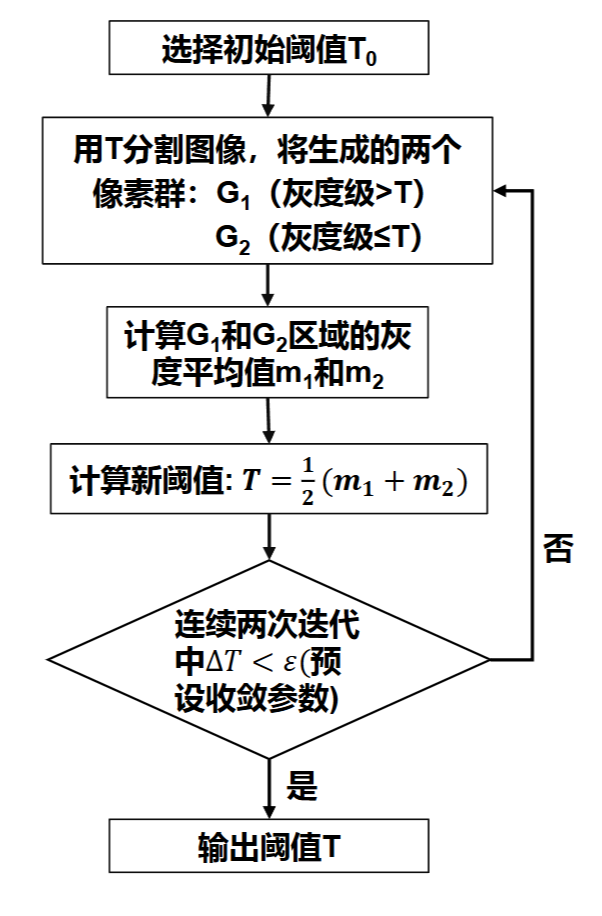

其中$\Delta T = |T^{'}-T|$，将一次迭代中的新阈值记为$T^{'}$，迭代的过程就是$T=T^{'}$（赋值）

一般初始值为整幅图像的平均值，迭代算法的收敛速度较慢

**最大方差最佳全局阈值选取法（Otsu）**

体现出区域内部的相似性和不同区域之间的差异性

以分为两组为例，设阈值为$K$，步骤如下

1. 计算归一化直方图，即纵坐标是占比$p_i$
2. 计算阈值划分开的区间的占比累和$P_1(K)=\sum\limits_{i=0}^Kp_i, P_2(K)=1-P_1(K)$
3. 计算所有区域的均值$m_G=\sum\limits_{i=0}^{L-1}ip_i$，其中$L$是灰度级
4. 计算各个区域的均值$m_1=\frac{1}{P_1}\sum\limits_{i=0}^{K}ip_i, m_2=\frac{1}{P_2}\sum\limits_{i=K+1}^{L-1}ip_i$
5. 计算类间方差，也就是几个类之间的方差，$\sigma^2_B(K)=\sum P_i(m_i-m_G)^2=P_1P_2(m_1-m_2)^2=\frac{(m_GP_1-m)^2}{P_1(1-P_1)}$，其中$m=\sum\limits_{i=0}^Kip_i$
6. 获得的类间方差取最大值，即$\sigma_B^2(K)=\max\limits_{0\leq K\leq L-1}\sigma^2_B$，若极大值不唯一，则取$K=avg\{k_i\}$
7. 计算全局方差$\sigma_G^2=\sum\limits_{i=0}^{L-1}(i-m_G)^2p_i$，注意是全体方差，计算可分离测度$\eta^*=\frac{\sigma_B^2(K)}{\sigma_G^2}$

**几个tips**

1. 对于存在很强的噪声，以至于直方图没有明显的多个峰的图像，可以先用平滑滤波器处理，再用otsu
2. 当目标与背景面积相差很大时，直方图没有明显的双峰/峰的大小相差很大，这时分割效果不好，即使用了平滑滤波

**边缘信息改进全局阈值处理**

当峰相差很大时这么干

1. 计算原图$f(x,y)$的梯度幅度或Laplace绝对值获取边缘信息
2. 规定阈值$T$对边缘图像处理得到$g_T(x,y)$
3. 用$g_T(x,y)$的直方图计算$K$
4. 将$K$代入**原图**，分割$f(x,y)$

**Otsu多阈值处理**

将灰度分为$k$类$(C_1,C_2,\ldots, C_k)$，计算$P_i, m_i$，计算相邻区域之间的差异性$\sigma_B^2(K_1,K_2,\ldots, K_{k-1})=\sum\limits_{i=1}^kP_i(m_i-m_G)^2$

将$\sigma_B^2$对$K_i$求偏导取极值，得到$k-1$个$K$的值，注意只有$k-1$个阈值

**局部分区阈值处理**

局部图像中的背景与目标**尺寸相当**，否则会出现tips2的情况，需要再细分

**根据局部图像性质的可变阈值处理**

阈值的选取根据局部的统计值来改变，即
$$
Q(x,y) = 
\begin{cases}
1\,\,\,\,\,, f(x,y)>a\sigma_{x,y},f(x,y)>bm_{x,y}\\
0\,\,\,\,\,, o.w.
\end{cases}
$$
其中$\sigma_{x,y},m_{x,y}$表示以$(x,y)$为中心的领域的方差和均值，有时可以用全局均值代替局部均值

**基于移动平均的可变阈值处理**

当目标尺寸相比图像大小较小时，移动平均的可变阈值处理效果较好，处理**速度比较快**

就是用一个点的行区域的均值作为阈值来处理这个点

常用于打印或手写图像的分割，尤其在不均匀光照下，手写字体灰度极低，用平均准而且快

**阈值处理的缺点**

1. 分类太简单，无法准确地分割类内方差较大的目标
2. 没有完全利用图像信息，直方图完全就没有利用像素的空间分布，导致分割结果易被噪声干扰

#### 5.3.2 区域分割

主要分为**区域增长法**和**区域分离与聚合**

**区域增长法**

1. 确定一组能正确代表所选区域的种子（手动选）
2. 确定包括相邻像素的规则（生长/相似规则）
3. 指定生长停止的条件

**区域分离与聚合**

从整个图像开始不断分裂，得到各个区域，然后聚合这些小区域

令$Q(R)$表示在$R$中的所有像素有相同的灰度值1

1. 对整幅图，进行判定，$Q(R)$不成立，则水平竖直分为4等分
2. 对每一个子图进行步骤1，
3. 对相邻的区域$R_i,R_j$，如果$Q(R_i\cup R_j)$，将二者聚合为一个，即使大小不一样
4. 重复3直到不能聚合

当然$Q(R)$可以用别的谓词逻辑$P(R)$替换

#### 5.3.3 聚类分割

先对数据进行标准化
$$
Z_f = \frac{x_f-\mu}{\sigma}
$$
聚类分割有很多，这里只看k-均值聚类算法

1. 随机选取k个初始聚类中心

2. 计算每个样本到各个中心的距离，将每个样本归类到最近的中心

   这里的距离也是需要选择的，不一定是欧氏距离

3. 对每个簇，以所有样本的均值作为新的聚类中心

4. 重复2，3，直到中心不再变化或达到规定步骤

## 6 频域滤波图像增强

### 6.1 傅里叶变换

#### 6.1.1 基本概念

使用二维傅里叶变换将图像从空间域变换到频率域，公式如下
$$
F(\mu, \nu) = \int_\infty\int_\infty f(x,y) e^{-j2\pi(\mu x+\nu y)}dxdy\\
f(x,y) = \int_\infty\int_\infty F(\mu, \nu)e^{j2\pi(\mu x+\nu y)}d\mu d\nu
$$
这是连续图像，一般用的是数字图像，那么退化为DFT，公式如下
$$
F(\mu, \nu) = \sum_{x=0}^{M-1}\sum_{y=0}^{N-1}f(x,y)e^{-j2\pi\left(\frac{\mu x}{M}+\frac{\nu y}{N}\right)}\\
f(x,y) = \frac{1}{MN} \sum_{\mu=0}^{M-1}\sum_{\nu =0}^{N-1} F(\mu, \nu)e^{j2\pi\left( \frac{\mu x}{M}+\frac{\nu y}{N}\right)}
$$
其中$\mu=0,1,\ldots,M-1, \nu=0,1,\dots, N-1$

注意，图像中心往往是一个幅值非常大的点，需要对DFT后的图像做**对数变换**

正常情况下，做完DFT后中心是高频信号，四周是低频信号，需要进行`fftshift`，将低频信号放在中心，因为人脑习惯这么思考

需要做如下变换，实际上，后文中所有的$F(\mu,\nu)$都是下面的形式
$$
F(\mu, \nu) \rightarrow F\left(\mu - \frac{M}{2}, \nu - \frac{N}{2}\right)
$$
那么对应到空间域中，
$$
f(x,y) \rightarrow f(x,y)(-1)^{x+y}
$$

对于实信号，$F(\mu,\nu)$是共轭对称的，所以采集一半就行；但是一般会多采一点，用于相位矫正

#### 6.1.2 几个性质

1. 线性

2. 空间域位移 等价于 频率域相移；频率域位移 等价于 空间与相移

3. **旋转**
   $$
   f(r, \theta+\theta_0) \leftrightarrow F(\omega,\phi+\theta_0) 
   $$
   其中，$\omega = \sqrt{\mu^2+\nu^2}, \phi = \tan^{-1}\frac{\nu}{\mu}$

   简言之，即空间域和频率域图像旋转相同角度

4. **可分性**

   即$x,y$独立，可以先后变换

   
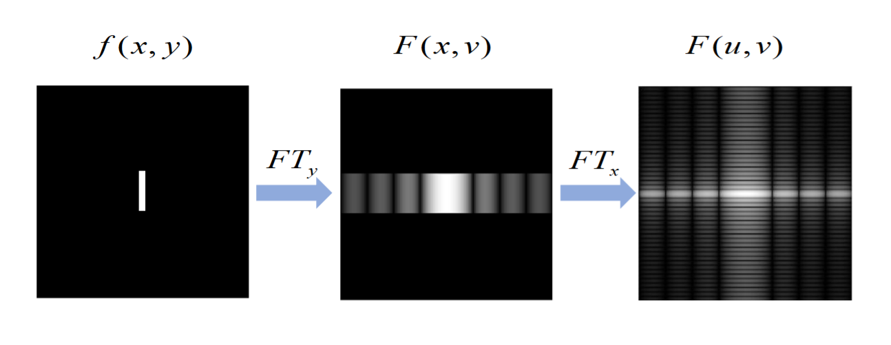

5. 均值定理
   $$
   \overline{f}(x,y) = \frac{1}{MN}F(0,0)
   $$

6. 对称性，即实函数的傅里叶变换共轭对称

7. 周期性，即DFT周期延拓为DFS

8. 卷积定理
   $$
   f(x,y) * h(x,y) \leftrightarrow F(\mu, \nu)\cdot H(\mu, \nu)\\
   f(x,y)\cdot h(x,y) \leftrightarrow F(\mu, \nu) *H(\mu,\nu)
   $$

#### 6.1.3 频率域图像增强

图像的频谱反应了什么？

频谱的直流低频分量，代表图像的平滑区域；交流高频分量，代表图像的边界区域

因此，可以根据这个特点在频域上对图像进行滤波

**主要步骤**

1. **fftshift**， $f(x,y)(-1)^{x+y}$，这步非常重要
2. DFT，得到$F(\mu-M/2, \nu-N/2)$
3. 使用滤波器$H(\mu, \nu)$与$F(\mu, \nu)$相乘
4. 反变换得到$g(x,y)(-1)^{x+y}$，注意需要反转一下，得到滤波图像

### 6.2 低通滤波

消除随机噪声，减弱边缘效应，平滑图像

常用的滤波器：理想低通；巴特沃斯低通；高斯低通

#### 6.2.1 理想低通

物理上做不到，只能在计算机中实现
$$
H(\mu, \nu)=
\begin{cases}
1\,\,\,\, , D(\mu, \nu)<D_0\\
0\,\,\,\, , o.w.
\end{cases}
$$
其中$D(\mu,\nu)$是点$(\mu,\nu)$到图像中心的欧氏距离

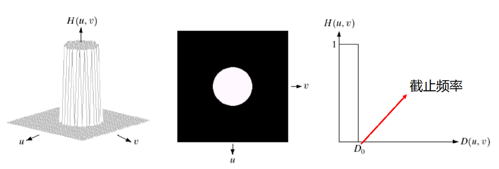

但是，使用理想低通滤波器产生的图像，存在振铃现象（吉布斯效应，图像还是连续的，一定会存在sinc函数）

这个现象在图像的边界等**突变点**最明显

#### 6.2.2 n阶巴特沃斯低通

$$
H(\mu, \nu) = \frac{1}{1+[D(\mu,\nu)/D_0]^{2n}}
$$

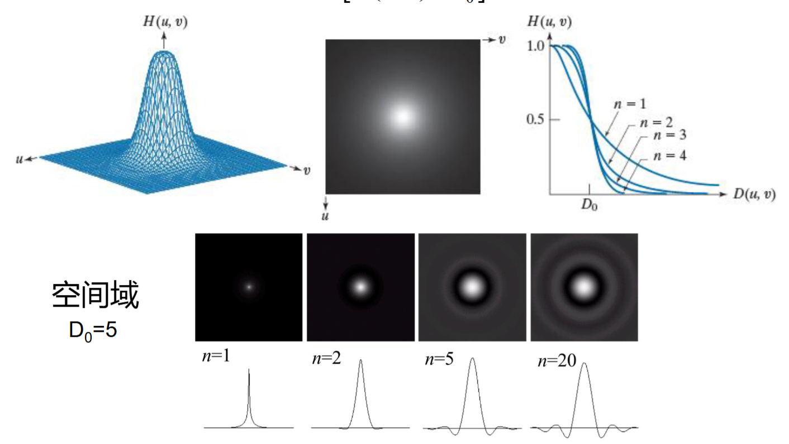

截止频率处变化地更平滑

相比于理想低通，它

1. 没有明显突变，导致了吉布斯现象很弱
2. 过渡平滑，模糊程度减少
3. 但是相对的，尾部的高频成分也更多，平滑效果没理想低通好

#### 6.2.3 高斯低通

$$
H(\mu, \nu) = e^{-D^2(\mu,\nu)/2D_0^2}
$$

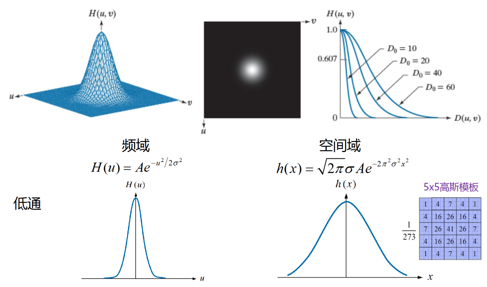

几个典型应用：将破碎的文字片段连接起来；减少眼角皱纹；减小水平扫面线对宏观边界检测的影响

### 6.3 高通滤波

增强图像的边缘，起到锐化作用

常见的高通滤波器有：理想高通；巴特沃斯高通；高斯高通；频域拉普拉斯；高频加强锐化等

#### 6.3.1 与低通对应

既然低通已经存在了，那么将$H_h = C - H_l$不就行了吗？

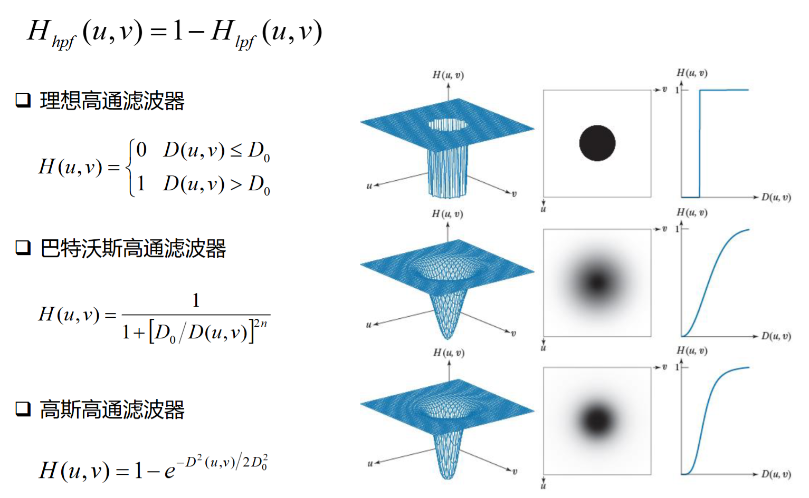

#### 6.3.2 频域拉普拉斯

空间域的拉普拉斯算子由上可知，根据傅里叶变换的性质，得到
$$
\mathcal{F}\{\nabla ^2f(x,y)\} = -(\mu^2+\nu^2)F(\mu,\nu)
$$
利用了$\frac{df}{dx} \leftrightarrow j\mu F$

那么传递函数为
$$
H(\mu, \nu) = -(\mu^2+\nu^2)
$$
为了shift，平移滤波器，得到
$$
H(\mu,\nu) = -[(\mu-M/2)^2+(\nu-N/2)^2]
$$
为什么$H$也要平移？：对原图先Laplace，然后再$(-1)^{x+y}$，即$(\nabla^2f(x,y))(-1)^{x+y}$

即
$$
\nabla^2 f(x,y) \leftrightarrow H(\mu,\nu) F(\mu,\nu)
$$

#### 6.3.3 高频加强图像增强

$$
g(x,y) = \mathcal{F}^{-1}\{[k_1+k_2H_{h}(\mu,\nu)]F(\mu,\nu)\}
$$

就是将高频信息叠加到原图上

### 6.4 同态滤波

非均匀光照的处理：同态滤波，顶帽变换，凸壳处理，滑动平均阈值处理手写/打印图像

研究问题：非均匀光照或非均匀强度检测的图像，二者都能近似表达为
$$
f(x,y) = i(x,y)r(x,y)
$$
其中前者是检测器分量，后者是检测量分量，在非均匀光照的例子中，前者是不均匀的光照，后者是光反射分量（即成像灰度）

目标是实现亮度调整和对比度提升，**消除非均匀光照的影响**

考虑到**人眼对图像亮度的响应类似于对数运算**，可以对$f$取对数进行计算

由此引入**同态滤波**，这是一种将**频率过滤**和灰度变化结合的方法，优点是符合人眼的响应，避免了直接变换的失真

流程如下：

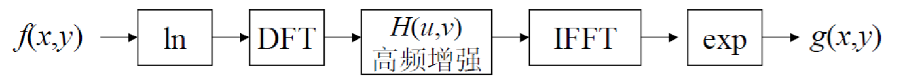

经过取对数之后，$\ln f = \ln i + \ln r$，其中$\ln i$是**变化缓慢的低频分量**，利用傅里叶的线性性可以解

为了压制$\ln i$，同时增强高频的反射分量$\ln r$，可以构造一个滤波器
$$
H(\mu,\nu) = (\gamma_h-\gamma_l)H_h(\mu,\nu) +\gamma_l
$$
其中$\gamma_h >1,\gamma_l < 1$，$H_h$为高通滤波器

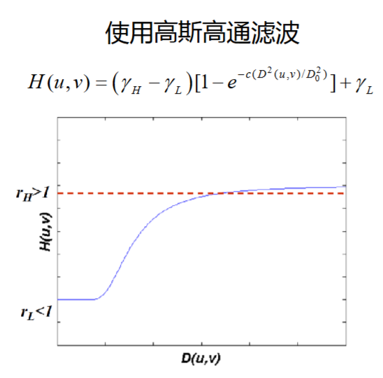

## 7 图像复原

图像增强是主观的，提高图像的可懂性；图像复原是客观的，提高图像的保真度

### 7.1 图像退化模型

**图像退化的因素**

* 噪声干扰：在采集过程中的噪声，或者探测器损坏
* 运动模糊：被采集物体运动产生的模糊，运动伪影
* 几何失真：由于成像过程的系统非线性造成
* 辐射失真：传输介质的不均一，如大气湍流等
* 成像系统的像差、畸变、带宽有限等
* 灰度失真：系统本身的亮度响应不均匀，同亮度的灰度不同

一般是非线性的

建立图像退化模型是复原的第一步，大致如下

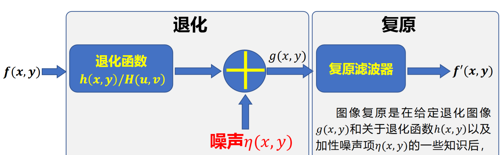

得到退化图像为
$$
g(x,y) = f(x,y)*h(x,y) + \eta(x,y) \\
G(\mu,\nu) = F(\mu,\nu)\cdot H(\mu,\nu) + \Eta(\mu,\nu)
$$
其中$\Eta$是大写的$\eta$

### 7.2 常见噪声模型

#### 7.2.1 高斯噪声

**来源**

* 视场不够明亮，亮度不均匀
* 元件自身的热噪声
* 长期工作的高温，产生噪声

**分布**
$$
p(z) = \frac{1}{\sqrt{2\pi}\sigma}e^{-\frac{(z-\mu)^2}{2\sigma^2}}
$$
其中$z$是灰度值，均值为0的噪声（$\mu = 0$）又称白噪声

#### 7.2.2 瑞利噪声

**来源**：平坦衰落信号的接收包络或是多路径分量的接收包络（雷达）

**分布**
$$
p(z) = \begin{cases}
\frac{2}{b}(z-a)e^{-\frac{(z-a)^2}{b}} , \,\,\,\, z\geq a\\
0\,\,\,\,\,\,\,\,\,,o.w.
\end{cases}
$$
均值和方差为
$$
\mu = a+\sqrt{\frac{\pi b}{4}}\\
\sigma^2 = \frac{b(4-\pi)}{4}
$$

#### 7.2.3 γ噪声

**来源**：激光成像的噪声，pet等

**分布**
$$
p(z) = \begin{cases}
\frac{a^bz^{b-1}}{(b-1)!}e^{-az},\,\,\,\,z\geq 0\\
0  ,\,\,\,\,\,\,\,\,\,  o.w.
\end{cases}
$$
均值和方差为
$$
\mu = \frac{b}{a}\\
\sigma^2 = \frac{b}{a^2}
$$

其中$a>0, b\in \Z^+$，**当$b=1$时，退化为指数分布**

#### 7.2.4 均匀分布噪声

**来源**：一定范围内的模拟输入被量化为一个数字输入，如果模拟信号的幅值时随机的，那么量化误差是均匀分布的

**分布**
$$
p(z) = \begin{cases}
\frac{1}{b-a} ,\,\,\, a\leq z \leq b\\
0,\,\,\,\,\, o.w.
\end{cases}
$$
均值和方差为
$$
\mu = \frac{a+b}{2}\\
\sigma^2 = \frac{(b-a)^2}{12}
$$

#### 7.2.5 脉冲噪声（椒盐噪声）

**来源**：受到强烈的脉冲信号干扰

**分布**
$$
p(z) = \sum P_i\delta(z-i)
$$
其中高灰度的噪声为盐噪声（白点），低灰度的噪声为胡椒噪声（黑点）

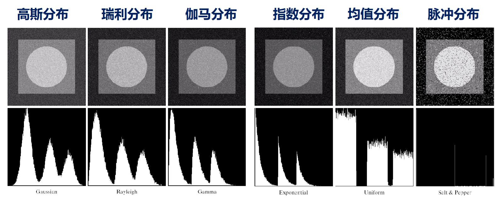

#### 7.2.6 周期噪声

**来源**：由于电气或电机干扰产生，是一种空间依赖型噪声，可以通过频域滤波显著减少

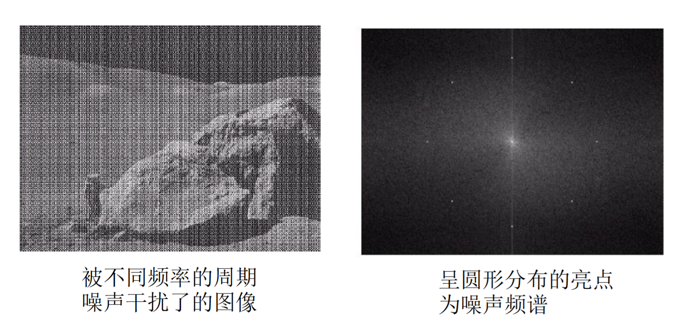

### 7.3 噪声处理

#### 7.3.1 噪声参数估计

当只有加性噪声存在时，图像增强和图像复原几乎一致

根据直方图进行估计，但是要注意不能找边界处进行直方图处理

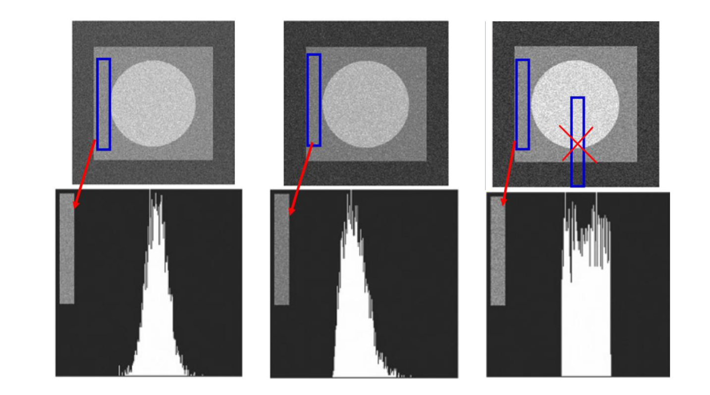

#### 7.3.2 均值滤波器
算数均值就是上面的平滑，不赘述

**几何均值滤波器**

利用邻域内的几何均值进行计算
$$
\hat{f}(x,y) = \left( \Pi g(s,t)\right)^\frac{1}{mn}
$$
但是需要注意，当邻域内存在0时，这个滤波器不好用

即对**椒噪声不好用**

**谐波均值滤波器**

利用调和平均数进行计算
$$
\hat{f}(x,y) = \frac{mn}{\sum \frac{1}{g(x,y)}}
$$
这对高灰度的**盐噪声很好**，但是同样对**胡椒噪声不好用**；**善于处理高斯噪声**

**逆谐波均值滤波器**
$$
\hat{f}(x,y) = \frac{\sum g(s,t)^{Q+1}}{\sum g(s,t)^Q}
$$
其中$Q$是滤波器的阶数

当$Q>0$时，善于处理胡椒噪声；当$Q<0$时，处理盐噪声；不能同时处理两种噪声

当$Q=0$时，退化为算术均值滤波器；当$Q=-1$时，退化为谐波均值滤波器

#### 7.3.3 统计排序滤波器

**中值滤波**
$$
\hat{f}(x,y) = \mathsf{mid}\{g(s,t)\}
$$
对**单极或双极脉冲噪声**很有效

**最值滤波器**

分为最大/小值，在发现图像的亮/暗点有效，对胡椒/盐噪声有效

**中点滤波器**
$$
\hat{f}(x,y) = \frac{1}{2}\left(\max \{g(s,t)\} + \min \{g(s,t)\}\right)
$$
结合了排序和平均，对**高斯**和**均匀**噪声效果好

**修正的α均值滤波器**
$$
\hat{f}(x,y) = \frac{1}{mn-d} \sum g_d(s,t)
$$
其中$f_d$表示在邻域内分别去除$d/2$个最高和最低值后的集合

结合了中值和均值，对多种混合噪声的效果好，如高斯+椒盐

#### 7.3.4 自适应局部降噪滤波器

可以根据局部的统计特征自动调整滤波效果
$$
\hat{f}(x,y) = g(x,y) - \frac{\sigma^2_\eta}{\sigma^2_L}[g(x,y)-m_L]
$$
其中$\sigma_\eta^2,\sigma_L^2$分别是整个图中的噪声方差和邻域内的灰度方差，$m_L$表示局部均值

分为以下几种情况

* $\sigma^2_\eta=0$，即没有噪声，那么$\hat{f}=g$
* $\sigma_L>>\sigma_\eta$，那么这里是边界突变点，不能平滑，$\hat{f}=g$
* $\sigma_L\approx \sigma_\eta$，那么这里是噪声，可以用普通的均值滤波，$\hat{f}=m_L$
* $\sigma_L<\sigma_\eta$，根据加性噪声假设，令二者相等，$\hat{f} = m_L$

#### 7.3.5 自适应中值滤波器

中值滤波器的效果受窗口大小影响

小的窗口能保护细节，但是对噪声过滤不好，大的反之；且当噪声的数目多于正常像素数目，结果会是噪声

根据局部统计值动态调整**窗口大小**

整个流程如下

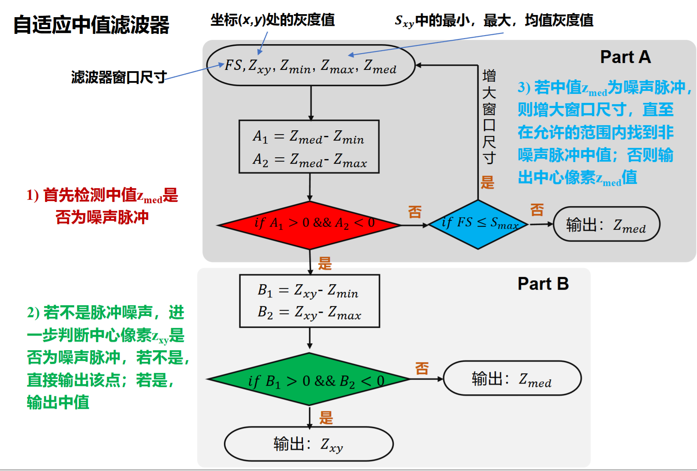

基本想法就是噪声不能是中值，所以判断条件没有$"="$，还需要一个窗口的最大值作为限制

去噪的效果类似于中值，但是保留了很多细节

#### 7.3.6 频率域消除周期噪声

由于周期噪声在频域内就是几个离散的点，可以使用带阻滤波器进行过滤

几个常用的**带阻滤波器**

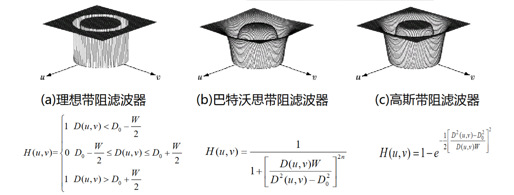

如果使用$H_p = 1-H_R$得到带通滤波器

对同一幅图像进行处理，带通会得到周期性噪声，带阻得到去噪图像，因为是互补的

有时候周期噪声没有明显的频带，使用**陷波滤波器**

陷波滤波器阻止/通过实现定义的中心频率的邻域内的信号

由于傅里叶变换的对称性，噪声信号应该是中心对称的，因此滤波器也需要中心对称

但是陷波区的形状和数目是任意的

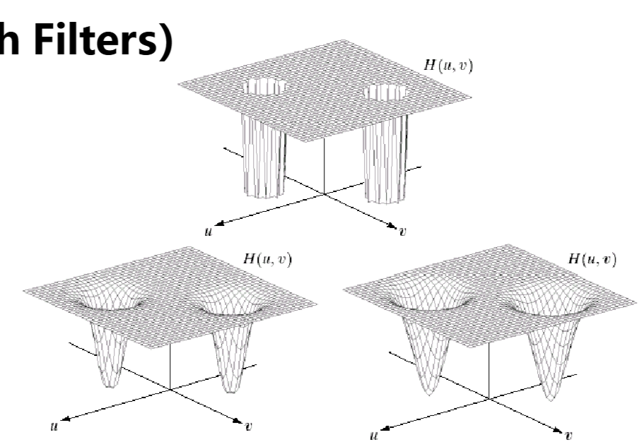

 

### 7.4 估计退化函数

找到退化函数$H(\mu,\nu)$是图像复原的关键，有以下方法

#### 7.4.1 图像观测估计法

在图像没有明显噪声的地方进行取样，得到子图像$g_s(x,y)$，利用无噪声重建得到$f_s(x,y)$，那么退化函数为
$$
H(\mu,\nu) = \frac{G_s(\mu,\nu)}{F_s(\mu,\nu)}
$$

#### 7.4.2 实验估计法

利用冲激函数，得到系统的冲激响应，做实验
$$
\delta(x,y) \rightarrow h(x,y) \Rightarrow1\rightarrow H(\mu,\nu)
$$

#### 7.4.3 模型估计法

从引起图像退化的基本原理进行推导，根据先验的模型

例如，已知大气湍流函数为
$$
H(\mu,\nu) = e^{-k(\mu^2+\nu^2)^{5/6}}
$$
那么
$$
G = HF \Rightarrow F = H^{-1}G
$$
**运动伪影**

设$x_0(t),y_0(t)$是$t$时刻的位置分量，曝光时间为$T$的图像得到结果是
$$
g(x,y) = \int_0^T f(x-x_0(t),y-y_0(t)) dt
$$
两边DFT，由于积分不含位置项，等价于对$f$进行DFT，得到
$$
G = \int _0^T F \cdot e^{-j2\pi(\frac{\mu x_0(t)}{M}+\frac{\nu y_0(t)}{N})}dt
$$
那么系统函数就是
$$
H =\int _0^Te^{-j2\pi(\frac{\mu x_0(t)}{M}+\frac{\nu y_0(t)}{N})}dt
$$

### 7.5 图像复原方法

分为逆滤波和维纳滤波

#### 7.5.1 逆滤波

$$
\hat{F} = \frac{G}{H} = F + \frac{\Eta}{H}
$$
当$|H|\rightarrow 0$时，噪音会变得很大，因此加入一个小的常数$k$，改写为
$$
\hat{F} = \frac{G}{H+k}
$$
逆滤波的问题在于**完全没有考虑到噪声的统计特性**

#### 7.5.2 维纳滤波

令
$$
\hat{F}(\mu,\nu) = H_{wie}(\mu,\nu) \cdot G(\mu,\nu)
$$
通过误差的最小二乘法得出$H$，即使得
$$
e^2 =\mathsf{E}\left(|F-\hat{F}|^2\right)
$$
最小的$H$，带入，得到
$$
H_{wie} = \frac{1}{H}\cdot \frac{|H|^2}{|H|^2+\frac{S_\eta}{S_f}}
$$
注意，这个结果的前提是**噪声的均值为0且与图像独立**

其中$S_\eta,S_f$分别是噪声和原图的功率谱，有$S_\eta(\mu,\nu)=\mathsf{E}\{ |\Eta(\mu,\nu)|^2 \}$，$S_f$同理

当二者未知时，用$K$代替

### 7.6 图像复原的质量评价

有主观和客观，主观就是人看，客观就是与原图的误差的统计值，常用的统计值如下

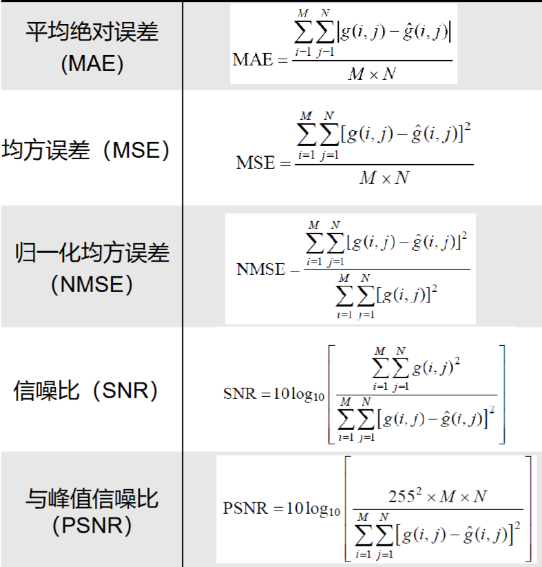

