# 微机原理

说明：红色为神人沈国峰钦定的必考题，绿色为杨建龙老师重点，蓝色为神人沈国峰重点，交集为橘色

补充章节一定是要考的

---

## 1 绪论

### 1.1 计算机中数的表示

<font color=green>**数据单位**</font>

位bit：1位二进制，1b

字节byte：8位二进制，1B=1byte=8bit

字word：2B，1word=2B=高字节$\mathsf{D_{15}\sim D_{8}}$+低字节$\mathsf{D_{7}\sim D_{0}}$

字长word length：计算机**一次**可以处理的二进制数据位数，64位机字长64，即一次最多处理$2^{64}$个bit


<font color=green>**打印数和字符的表示**</font>

BCD码（Binary Coded Decimal）

ASCII码（American Standard Code for Information Interchange）：7位二进制编码的字符

键盘输入到显示器的字符都要用ASCII码表示


<font color=orange>**原码，反码和补码**</font>

搞清楚原码、反码和补码，正数负数都是有的

<font color=red>例：7-19</font>

$=[7]_{补}+[-19]_{补}=0000\space 0111+1110\space 1101=1111 \space 0100$ 到这一步是结果的补码，要还原

$=1111\space 0100 -0000\space 0001=1111 \space 0011$ 到这一步是结果的反码，把全部取反就是结果的绝对值

$=-(0000\space 1100)=-12$

要注意只有后7位是有效的，MSB是符号位，1一定是负数


### 1.2 计算机的组成与发展

<font color=orange>**组成**</font>

<center>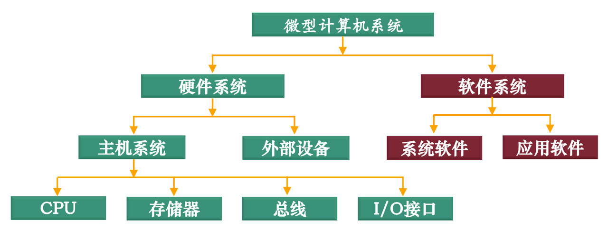</center>

第一代通用计算机**ENIAC**

PC中的首个操作系统**DOS**，**Disk Operating System**


<font color=orange>**主机系统（微机）**的组成</font>

* CPU（Central Processing Unit）
  * 运算器（Arithmetic and Logic Unit，ALU）
  * CPU内部总线
  * 寄存器（Register）
  * 控制器（Control Unit）
* 存储器
* 总线
  * 地址总线（address bus）
  * 数据总线（data bus）
  * 控制总线（control bus）
* IO接口


**指令集架构**：分为复杂指令集（CISC Complex Instruction Set Computer）和精简指令集（RISC Reduced ...）

**存储器**：**数据和指令**都存在内存或者硬盘上，都是**二进制**信息


**总线**

连接CPU和其他芯片

* 地址总线：宽度决定可寻址的存储单元大小，N跟总线，可寻址$2^N$，8086有20跟地址总线（可寻址1M个存储单元，一般一个单元存一个字节，即最大可以寻址1MB）
* 数据总线：宽度决定计算机的字长，64位机的64根，8086有16根（一次读写两个字节）
* 控制总线


**CPU对存储器的读写**

<center>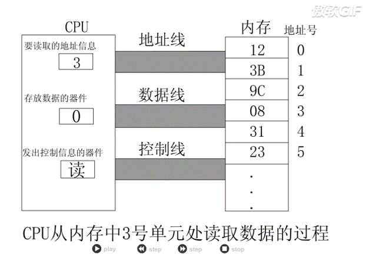</center>

读取内存3号位的“08”，记录在寄存器上（0->08）


## 2 访问寄存器和内存

### 2.1 寄存器和数据存储

<font color=green>**8086的CPU和内存**</font>

<center>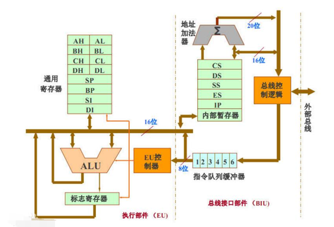</center>

其中**EU(Execution Unit)**和**BIU(Bus Interface Unit)**

8086有**14**个寄存器

* 通用寄存器AX,BX,CX,DX都可以分为高位和低位
* CS：IP是存放指令的地址组合

所有寄存器都是**16位**的，可以存放两个字节，上述四个都可以**分为两个独立的八位寄存器使用**（AX=AH+AL）

8086是16位字长（1个字），一次可以处理一个寄存器的内容，一个寄存器存储一个字


### 2.2 MOV和ADD指令

|  汇编指令  |    控制CPU     | 高级语言 |
| :--------: | :------------: | :------: |
| mov ax, 18 |   把18送入ax   | ax = 18  |
| mov ax, bx | 把bx的值送入ax | ax = bx  |
| add ax, 8  |   ax的值加8    | ax += 8  |
| add ax, bx | ax的值加bx的值 | ax += bx |

汇编指令不区分大小写

<font color=red>例：</font>ax=8226h，bx=8226h，执行add ax, bx，得到ax=？

解：ax=044ch，本来是1044ch，但是ax只有16位，去掉msb

<font color=red>例：</font>ax=00c5h，bx=8293h，执行add al, bl，得到ax=？

解：ax=0058h，本来是0158h，但是al只有8位，去掉msb


### <font color=green>2.3 确定物理地址</font>

所有的内存单元构成的存储空间是**线性**的（C++的数组）

8086的寻址能力是$2^{20}$，但是它是16位机，只能一次处理16bit，需要使用**地址加法器**合成物理地址

**合成方法**：段地址*16+偏移地址=物理地址

<center>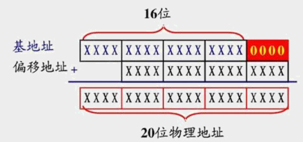</center>

都是16进制表示，*16表示末尾加一个0，转为2进制就是多0000，变成了20bit

<center>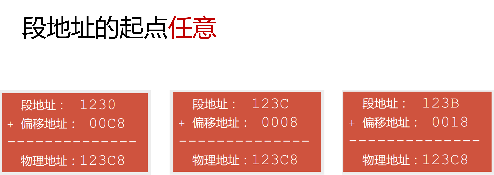</center>


**8086处理物理地址的过程**

<center>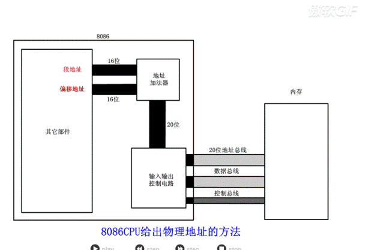</center>


### 2.4 内存分段表示

内存本身是连续的，段的划分来自CPU（就是段地址的划分）

段地址由于*16，所以**段的起始地址一定是16的倍数**，在二进制中表现为0000结尾；偏移地址为16bit，故每个段最大长度$2^{16}=64$kB

不同的段地址和偏移地址可以表示一个物理地址，如2000h*16+1F60h=2100h\*16+0F60h


### 2.5 Debug常见命令

R（Register）查看、改变寄存器的内容；R 寄存器名 改变指定寄存器内容（-r ax /endl ax 1234，ax=1234）

D（Data）查看内存内容，列出预设地址内存的128个字节（8*16，一个地址2bit）的内容

* -d 段地址：偏移地址 （结尾偏移地址）列出指定位置的内存内容

E（Edit）改变内存内容

* -e 段地址：偏移地址 12 34 将起始位置开始的两个地址内容改为12 34

U将内存中的机器指令翻译为汇编指令

A以汇编指令的格式在内存里写指令

* -a 段地址：偏移地址 汇编指令

T执行机器指令

* -t 执行CS:IP处的指令，每次执行一条


### 2.6 CS、IP和代码段

CS：代码段寄存器

IP：指令指针寄存器

CS:IP：CPU将该地址指向的内容当作指令（不当作数据）


**8086CPU的指令读取和执行**

<center>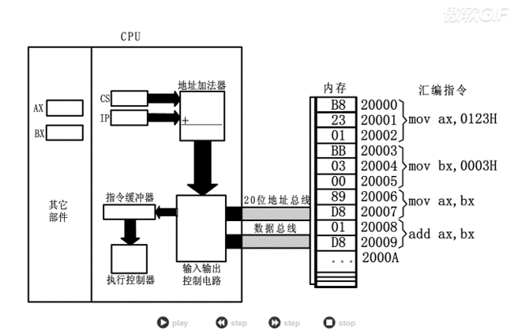</center>

1. 从CS:IP指向的单元读取指令，指令进入指令缓冲器
2. IP += 上一段指令的长度（如 mov ax, 8长3个字节，ip从0100变为0103）
3. 执行这段指令

重复上面三个步骤（一直-t）


### 2.7 JMP指令

用于修改CS和IP的值，改变程序执行的顺序


**修改CS/IP的方式**

1. -rcs+值，-rip+值；但这是debug内部调试手段
2. mov cs，2000H；**错误**，特殊的寄存器不能用mov
3. 转移指令jmp
   1. jmp 段地址:偏移地址：修改CS:IP，用于**段间**程序跳跃
   2. jmp 某个值或寄存器：仅修改IP，用于**段内**程序跳跃


<font color=red>例：</font>如图，从20000H开始执行，执行的序列是？

<center>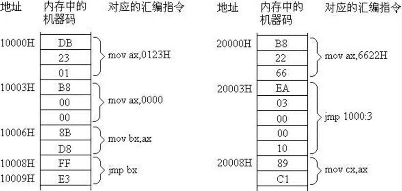</center>

1. mov ax, 6622H;ax=6622H
2. jmp 1000:3;段间跳跃
3. mov ax, 0000H;ax=0000H
4. mov bx, ax;bx=0000H
5. jmp bx;段内跳跃
6. mov ax, 0123H;ax=0123H
7. mov ax,0000H;ax=0000H,开始循环


### 2.8 内存中字的储存

16bit=2byte=1word，1word的高八位放在高字节，低八位放在低字节

如"4E20H,0012H"，存放方式是

|  0   |  1   |  2   |  3   |
| :--: | :--: | :--: | :--: |
| 20H  | 4EH  | 12H  | 00H  |


**字节型和字型**

**字节型**指一个字节；**字型**指从这个字节开始的2个字节，这个字节为**低八位**

如上的内存，1地址存放的**字节型**数据是“4EH”，1地址存放的**字型**数据是“124EH”

但是，每次读内存段开始的一个字节

图中就是偶数开始，故读0地址的字型数据要**1**次，读1地址的字型数据要**2**次


### 2.9 用ds寄存器和[address]实现字的传送

ds(data segment)寄存器存放的是**当前指向的段地址**信息，[address]表示偏移地址

下面代码：

```assembly
mov bx, 1000H
mov ds, bx
mov al, [0] #等价于 mov al, ds:[0]
```

由于mov无法直接操作ds，需要一个中间变量；bx表示base，常用来存放地址的中间变量

上面对代码将段地址写为1000H，将1000H:0000H的数据写入al中（也可以用ax）


<font color=red>例：</font>

<center>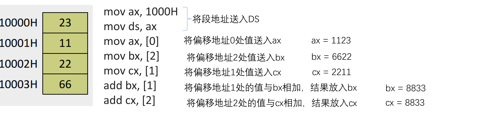</center>

注意ax是字型变量，al是字节型变量，故所有的mov操作都将内存地址视为字型变量的低地址


**数据段**

默认由ds寄存器的值决定，偏移地址由[address]决定


**数据累加问题**

看以下的区别：

mov ax, 123BH								mov ax, 123BH

mov ds, ax										mov ds, ax

mov al, 0										   mov ax, 0

add al, [0]										  add ax, [0]

add al, [1]										  add ax, [2]

add al, [2]										  add ax, [4]

左边是用一个字节累加，是**字节型**累加；右边用2个字节累加，是**字型**累加


### 2.10 mov和add的指令形式

|        mov指令        |     示例      |        add指令        |    示例     |
| :-------------------: | :-----------: | :-------------------: | :---------: |
|   mov 寄存器， 数据   |   mov ax, 8   |   add 寄存器， 数据   |  add ax, 8  |
|  mov 寄存器， 寄存器  |  mov ax, bx   |  add 寄存器， 寄存器  | add ax, bx  |
| mov 寄存器， 内存单元 |  mov ax, [0]  | add 寄存器， 内存单元 | add ax, [0] |
| mov 内存单元， 寄存器 |  mov [0], ax  | add 内存单元， 寄存器 | add [0], ax |
| mov 段寄存器， 寄存器 | mov ds/cs, ax |           /           |      /      |

sub用法与add相同


### <font color=orange>2.11 栈与栈操作的实现</font>

栈：先进后出

栈段(stack segment, ss)是专门开辟的一个区域，用于**暂存数据**（如函数调用等）

栈的基本操作：push入栈，pop出栈


**8086中栈的操作**

CPU对栈的指定：SS寄存器存放**栈顶**的段地址，SP(stack pointer)存放**栈顶**的偏移地址

栈指令操作：push ax和pop ax，没有push al和pop al

任意时刻，SS:SP**指向栈顶元素**；栈顶的地址**最低**


**指定栈空间**

mov ax, 1000H

mov ss, ax

mov sp, 0010H

ss不能mov，但是sp可以

栈空间范围：SS:0000H——SS:SP-1，由于SP最大64K，一个栈最大空间为64KB

栈段和数据段可以**共享段地址**


**push和pop指令**

push ax：将ax值送入SS:SP；SP -= 2

pop ax：将SS:SP中的值送入ax；SP += 2

push和pop无法保证指针不出栈，要自己注意


## 3 汇编语言编程

### 3.1 汇编语言编写程序的工作过程

<center>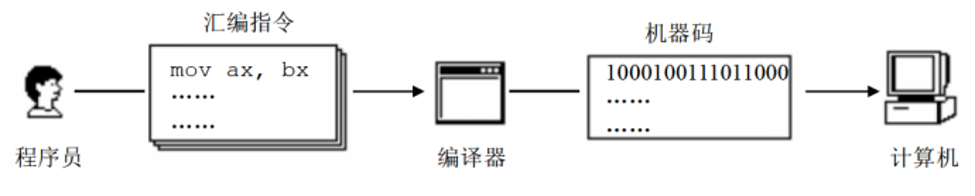</center>

一个完整的汇编程序示例：

```assembly
assume cs:codesg
codesg segment

mov ax, 0123H
mov bx, 0456H
add ax, bx
add ax, ax

mov ax, 4c00H
int 21H

codesg ends
end
```

其中首尾是**伪指令**，不被CPU执行，但需要编译器执行

倒数第二段相当于return 0，表示程序返回

第二，三段为CPU执行的汇编指令


段分配语句：assume cs:code, ds:data, ss:stack

段名 segment，表示一个段的开始，将内容写入该段内

段名 end**s**，表示一个段的结束

end，表示程序结束


**可执行文件生成过程**

<center></center>

记事本写.asm，masm生成.obj，link生成.exe

在编写一个程序的过程中，会得到包括.obj，.lst，.crf，.map在内的中间结果


**用debug装载程序**

在没有指定DS时，会**自动**装载CS前的**256（100H）**个字节，作为数据区

故此时CS=DS+10H，CX寄存器的值等于**代码**的长度

注意程序在int 21处结束，后续为垃圾值


**p，g命令**

P在遇到子程序，中断时，直接执行所有结果（t时逐条执行）

G可以指定开始运行的代码，直到遇到断点或程序结束


### 3.2 LOOP指令

实现循环的指令

CPU在收到loop指令时，依次执行以下操作：

1. CX = CX - 1
2. CX == 0

当CX=0时，循环结束；CX=n，则程序执行n次；CX需要在循环之前指定值，且不能为0（否则执行65536次）

loop程序需要定义一个标号，从标号处到loop，循环


### 3.3 段前缀

在访问内存单元的指令中，要**显示**地用段前缀指明

```assembly
mov al, [0]
mov bl, [0]
```

最终得到的al=bl=00H，此时需要改为如下

```assembly
mov al, ds:[0]
mov bl, ss:[0]
```


<font color=red>例：</font>计算ffff:0~ffff:b内所有值的和的方法

解：add dx, ds:[0]？不行，此时为**字型**数据相加

​		add dl, ds:[0]？不行，会溢出

​		解决方案

```assembly
mov bx, 0
mov cx, 0bH
s:	mov al, ds:[bx]
mov ah, 0
add dx, ax
inc bx #bx += 1
loop s
```


**安全存放数据**

在段地址指定，运行时由OS分配空间

可以将CS,DS,SS指定为一个段地址，一般不这么干


### 3.4 将数据写入代码段

示例代码：

```assembly
assume cs:code
code segment

dw 0123H,0456H,0789H,0abcH,0defH,0fedH,0cbaH,0987H

start: mov ax,0
         mov bx, 0h
         mov cx, 8

     s: add ax,cs:[bx]
         add bx,2
         loop s

         mov ax,4c00h
         int 21h

code ends
end start
```

其中 dw表示定义字型数据（define word），还有db（define byte），dd（define double）

用

```assembly
start:

end start
```

这个代码段包裹代码，主要是end后的符号和：前的符号需要统一名称

end除了告知结束外，还告知编译器程序代码的入口，与数据做区分


## 4 内存寻址方式

<font color=orange>**寻址方式分类**</font>

1. 直接寻址：`mov ax, [0001]`
2. 寄存器间接寻址：`mov ax, [bx]`
3. 寄存器相对寻址：`mov ax, [bx+idata]`
4. 基址变址寻址：`mov ax, [bx+si]`
5. 相对基址变址寻址：`mov ax, [bx+si+idata]`
6. 立即数寻址：`mov ax, 1`
7. 寄存器寻址：`mov ax, bx`


### 4.1 处理字符问题

汇编语言中，用'xxxxx'的形式指明数据的**字符**类型，长度为5（没有'\0'）

编译器将字符转化为**ASCII**码

```assembly
data segment
	db 'HelloWorld'
data ends	
```


**大小写转换**

大写+20H=小写，所有大写字母第六位=0，所有小写字母第六位=1

20H=0010 0000 B

故大写变小写只需要将第6位变1，其余位不变，若本身就是小写经过上述流程还是小写

故有：**任意字母 | 0010 0000 = 小写**，|表示按位或

同理，**任意字母 ^ 1101 1111 = 大写**，^表示按位与


**在汇编中的表示**

```assembly
and al, 11011111b
```

表示将al中的字符转为大写

```assembly
or  al, 00100000b
```

表示将al中的字符转为小写


### 4.2 [bx+idata]方式寻址

idata是一个数字类型的常量

```assembly
mov ax, [bx+200]
```

表示将内存地址位`ds:[bx+200]`处的内容存入ax中，以下写法等价

```assembly
mov ax, [200+bx]
mov ax, 200[bx]
mov ax, [bx].200
```

这个方式可以用作**一维数组**，idata为0地址


### 4.3 si,di寄存器寻址

SI，DI作为变址寄存器，和bx的用法功能相近（唯一区别，bx可以分为两个8为寄存器bh+bl）

SI：source  index，源变址寄存器；DI：destination index，目标变址寄存器

```assembly
mov si, 0
mov di, 16
mov cx, 8
s:	mov ax, [si]
	mov [di], ax
	add si, 2
	add di, 2
loop s
```

这个代码实现了将一个16B的字符串从`ds:0000`移动到`ds:0010`，每次移动一个字


**用[bx+si]和[bx+di]方式寻址**

```assembly
mov ax, [bx+si]
mov ax, [bx][si]
```

这两个方式等价，两个都是变量，相当于实现了一个**二维数组**


### 4.4 [bx+si+idata]和[bx+di+idata]方式寻址

```assembly
mov ax, [bx+200+si]
mov ax, [200+bx+si]
mov ax, 200[bx][si]
mov ax, [bx].200[si]
mov ax, [bx][si].200
```

以上写法等价，只有当idata位于第二/三位时，需要.


**结构体**

使用`[bx+idata+si]`定位结构体，`[bx]`定位结构体基地址，`.idata`定位某一个数据项，`[si]`定位这个数据的某一个字节（数组的下标）


**多重循环次数储存**

由于只有一个cx用于存储循环次数，当存在循环嵌套时，会丢失上一次的次数信息

需要将cx保存下来

1. 用其他合法寄存器
2. 用固定内存空间
3. 用栈

推荐第三种


### 4.5 BP寄存器

BP，Base Pointer，基指针寄存器，于BX类似，区别是不能当成2*8来用，且默认指向`SS:BP`

只有BX，BP，SI，DI可以在`[]`中寻址，且只能**一个基地址一个变址**，不能`[BX+BP]`或`[SI+DI]`


### 4.6 数据的位置

**立即数idata**

直接保存在指令中

```assembly
mov ax, 1
add bx, 2000
```


**寄存器**

保存在CPU内部的寄存器，使用时不需要外部的dataBus传递

```assembly
mov ax, bx
```


**内存**

保存在内存中

```assembly
mov ax, [bx]		;ds:[bx]
mov cx, [bp]		;ss:[bp]
```


### 4.7 数据的长度

`add/mov`指令最多只能使用一个内存地址作为操作数，另一个必须是reg或idata


**word**

涉及到16b寄存器的操作，都是字型

```assembly
mov ax, 1
mov ds:[0], ax
```

当不涉及寄存器时，可以用`word ptr`显式地指出

```assembly
mov word ptr ds:[0], 1
add word ptr [bx], 2
```


**byte**

涉及到8b寄存器的操作，都是字节型

```assembly
mov al, 1
add bl, [bp]
```

同理可用`byte ptr`显式指出

```assembly
mov byte ptr ds:[0000], 1
add byte ptr [bx], 2
```


### <font color=blue>4.8 DIV和MUL指令</font>

**在寄存器中使用DIV**

```assembly
mov ax, 1234
mov dx, 0001
mov bx, 0209
div bx
```

实现了将`(dx*10000H+ax)/bx`的商存在`ax`中，将余数存在`dx`中

实测`div ax`会将ax作为**除数**，结果储存不变


```assembly
mov al, 12
mov ah, 34
mov bl, 23
div bl
```

实现了将`ax/bl`的商保存在`al`中，将余数保存在`ah`中


当商超过了`ax`或`al`的存储范围，结果溢出，程序自动产生一个中断（表现为指令地址跳跃很大的距离）


**在内存单元中使用div**

```assembly
data segmemt
	dd 100001h				;定义一个double变量，占4B，ds:[0]-ds:[3]为(01,00,10,00)
	dw 100h					;定义一个word变量，占2B，ds:[4]-ds:[5]为（00，01）
	dw 0h					;定义一个word变量，占2B，ds:[6]-ds:[7]为（00，00），用于存放结果
data ends

code segment
	mov ax, data			
	mov ds, ax				;这两步将ds指向定义的数据段地址
	mov ax, ds:[0]			;由于一个寄存器不足以存放dd，用ax存在后四位，一定是后四位
	mov dx, ds:[2]			;用dx存放前四位，一定是前四位
	div word ptr ds:[4]		;没有寄存器参与，指明类型，这是除数
	mov ds:[6], ax			;将商保存在事先定义的结果空间
	
	mov ax, 4c00h
	int 21h
code ends

end
```


**MUL指令**

与DIV类似

```assembly
mul bl	;或任意8b寄存器
```

表示将`al*bl`的结果存放在`ax`中


```assembly
mul bx	;或任意16b寄存器
```

表示将`ax*bx`的结果存放在`dx,ax`中，`dx`是高位


`mul`是无符号数的乘法，`imul`是有符号数的乘法


### 4.9 使用DUP设置内存空间

和`dd,db,dw`等**伪指令**一起使用，定义数据重复次数，这个是给**编译器**读的

```assembly
db 3 dup (0)				;db 0,0,0
db 3 dup (0,1,2)			;db 0,1,2,0,1,2,0,1,2
db 3 dup ('abc','ABC')		;db 'abcABCabcABCabcABC'
```

dup前面跟的是重复的次数

一个典型用法是开辟一个空的数据空间

```assembly
stack segment
	db 200 dup (0)
stack ends
```

开辟了一个200B的空栈段


**数据定义语句**

将操作数存入**变量名指定的**存储单元，或分配空间

<center>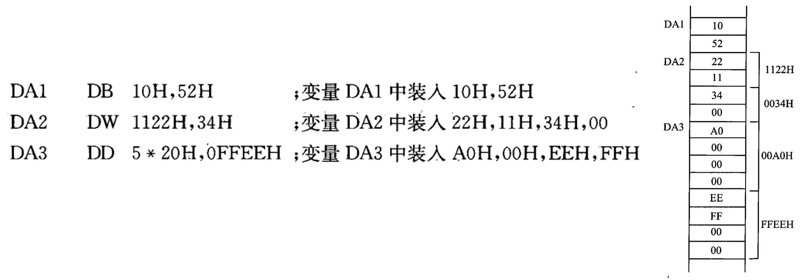</center>

还能在定义时计算，如`5*20H=A0H`


## 5 流程转移和子程序

### 5.1 转移

本质是修改`ip`和`cs`的值，改变命令执行的顺序


分类

按行为：段内转移和段间转移

按修改范围：短转移（`-128-127`）和长转移（`-32768-32767`）

按指令：

1. 无条件转移：jmp
2. 有条件转移：jcxz和jcxnz
3. 循环指令：loop
4. 过程
5. 中断：int


### 5.2 JMP指令汇总

<font color=green>**JMP 标号**</font>

标号也就是名称，如`s:inc bx`，中s为标号

1. `jmp short label`，段**内**短转移，8位，机器码是**位移**

2. `jmp near ptr label`，段**内**近转移，16位，机器码是**位移**

3. `jmp far ptr label`，段**间**转移，机器码是**label的内存地址`CS:IP`**，按小端存储，ip地址低

   ```assembly
   jmp far ptr statr		;假设start的位置是076A:010B，那么这条的机器码就是EA0B016A07
   ```


**JMP 寄存器**

`jmp bx`，bx是目标指令的**ip地址**


**JMP 立即数**

`jmp 00`，`ip = 00`

`jmp 00:00`，`cs = 00, ip = 00`


**JMP 内存单元**

1. `jmp word ptr [address]`，段**内**转移，转到`[address]`所**存储的值**的位置
2. `jmp dword ptr [address]`，段**间**转移，`CS=2-3[address],IP=0-1[address]`，dword是双字，4B


**基于位移进行的JMP指令**

在机器码中的位移是jmp指令**指向的地址** - jmp指令**后一条的地址**

```assembly
mov ax, 0		;假设存在076A:0000中
jmp short s		;存在076A:0003中，对应机器码EB05,EB是jmp short的代码，05 = 0A - 05
add ax, 1		;存在076A:0005中
nop				;空指令，占1B，076A:0008
nop				;076A:0009
s:	inc ax		;076A:000A
```

为什么会是减去后一条？

程序执行流程：

1. IP指向jmp，jmp指令进入指令缓冲器
2. IP += last length，指向下一条
3. jmp执行，IP += （jmp指向 - 目前指向）=（jmp指向 - jmp下一条）

当要加的数值超过限定时，会报错


**转移地址在内存中的jmp指令**

```assembly
mov ax, 0123
mov ds:[0], ax
jmp word ptr ds:[0]			;执行后，IP = 0123
```

内存地址的**内容**是IP的**值**


```assembly
mov ax, 0123
mov ds:[0], ax
jmp dword ptr ds:[0]		;执行后，CS=0000,IP=0123
```

存放两个字，高字是CS，底字是IP


**有条件转移：JCXZ**

`jcxz label`

`jmp when cx == zero`

当cx寄存器的值为0时，执行jmp指令（对应jcxnz）

机器码是label的地址 - 这条指令的下一条地址（**位移**），对IP的修改范围是**-128 - 127**


**循环转移：LOOP**

```assembly
s:	add ax, ax		;设地址为076A:0006
loop s				;地址为076A:0008，机器码为E2FC
mov ax, 4c00		;地址为076A:000A
```

FC是-4的补码，表示IP -= 4，LOOP指令的机器码是**位移**，一般是负的


**用位移转移的好处**

无论label的位置如何，IP转移的位移是固定的，适用于调用函数指针时**动态装载**


### 5.3 OFFSET指令

```assembly
s:	mov ax, offset s
```

将s的偏移地址（ip）存入ax中，一定是一个**16b寄存器**

<font color=red>例：</font>下面是一个将s处的指令复制到s0处的代码

```assembly
s:	mov ax, bx
mov si, offset s
mov di, offset s0
mov ax, cs:[si]
mov cs:[di], ax
s0:	nop
```

s0原来是空的

指令也是数据，由机器码形式储存，也可以mov add等，一条`mov ax, bx`指令长2B，可以用一个16b寄存器存储


### <font color=blue>5.4 模块化设计程序（函数）</font>

**CALL指令**

```assembly
main:
		mov ax, 0123
		call func1
		mov ax, 4c00
		int 21

fun1:
		call func2
		ret
		
fun2:
		mov bx, 2
		ret
```

call指令的实质是**修改IP或IP和CS**

CPU执行call的流程：将当前的ip或cs和ip入栈（先入cs后入ip），转移到label处执行

call的机器码是**label地址** - call**后第一个指令地址**，也是**位移**，范围是`-32768 - 32767`

类似于`jmp near ptr label`，用risc-V指令表示为

```assembly
addi sp, sp, -4
lw cs, 2(sp)		;只有call far ptr有
lw ip, 0(sp)
;jmp near ptr label 这是cisc
```


同理还有`call far ptr`，实现段**间**转移，机器码为**目标地址**，小端存储，先ip后cs

但是，在执行过程中是**CS先入栈**，其实都是`IP`的地址更低


**转移地址在寄存器中的call**

```assembly
mov ax, 0123
call ax
```

相当于

```assembly
push ip
jmp near ptr ax		;ip = ax
```


**转移地址在内存中的call**

```assembly
mov sp, 10H
mov ax, 0123H
mov ds:[0], ax
call word ptr ds:[0]
```

执行后，`ip=0123H`，cs不变，`sp=0EH`，sp -= 2


```assembly
mov sp, 10H
mov ax, 0123H
mov ds:[0], ax
mov ds:[2], 0000H
call dword ptr ds:[0]
```

执行后，`ip=0123H, cs=0000H,ip=0CH`，高地址是cs，低地址是ip，sp -= 4


**返回指令ret/retf**

后者就是ret far，搭配call far ptr使用

```assembly
fun2:
		mov bx, 2
		ret				;相当于	pop ip
```

```assembly
fun2:
		mov bx, 2
		retf			;相当于	pop ip, pop cs
```


在实际过程中，一般要先开辟栈段

```assembly
assume ss:stack, cs:code
stack segment
		db 8 dup (0)
		db 8 dup (0)
stack ends
code segment
		mov ax, stack
		mov ss, ax
		mov sp, 16
```

开辟了一个16b的栈段（`ss:0000H`到`ss:0015H`）


**ret n指令**

`ret 4`等价于

```assembly
pop ip
add sp, 4
```

如果函数中使用了某寄存器，在函数的开头要先将原始值入栈，在结束前对这些寄存器出栈

如果不是对寄存器入栈，而是一些数，则可以直接`ret n`，重新归位`SP`

```assembly
mov ax, 1
push ax
mov ax, 3
push ax
call func

func: 	push bp
		mov bp, sp
		;codes
		pop bp
		ret 4		;栈中还有0001H，0003H这四个字节，要归位
```


### 5.5 寄存器冲突问题

在处理字符串时，为了能够自动处理而不设置`cx = n`（循环次数），会在字符串末尾加上一个0

```assembly
db 'conversation', 0
;格式省略
func:	mov si, 0H
		mov cl, [si]
		mov ch, 0H
		jcxz over
		inc si
		jmp short func
over:	ret
```

但是这样有一个问题，cx是循环控制的寄存器，这样就不能控制外层循环了

所以在编写的程序中必须对使用到的所有寄存器进行入栈出栈操作

代码修改为

```assembly
func:	push cx
		push si
func1:	mov si, 0
		mov cl, [si]
		mov ch, 0H
		jcxz over
		inc si
		jmp short func1
over:	pop si
		pop cx
		ret
```


### 5.6 标志位寄存器

`PSW/FLAGS`，是一个东西，程序状态字/标志位寄存器

是一个16bit寄存器，按位起作用，在8086中为

<center>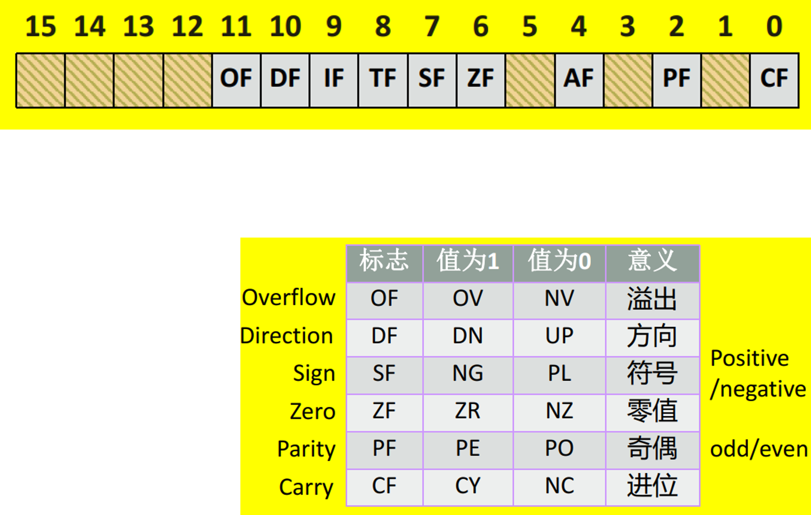</center>

剩下的都是没用的

使用

```assembly
pushf		;将FLAGS的值压栈
popf		;将栈顶值赋给FLAGS，弹栈
```

直接对FLAGS进行操作，此外没有办法直接操作

只有运算指令和部分指令的操作结果会对FLAGS产生影响，如`add, sub, mul, div, or, and`，`inc`指令不影响`CF`

大部分传送指令对FLAGS无影响，如`mov, push, pop`等


**ZF，零标志**

记录指令的结果是否为零，即`zf = (result == 0)`

```assembly
sub ax, ax
```

执行后`ZF = 1`


**PF，奇偶标志**

记录指令的结果的**二进制**表示的1的个数，`pf = (numOf1 == even)`

```assembly
mov ax, 0
add ax, 3
```

执行后`PF = 1`


**SF，符号标志**

将所有结果都视为**有符号**数，`SF = 符号位`，即负数为1，正数和0为0

```assembly
mov ax, 1H
add ax, F000H
```

执行后`SF = 1`

如果数据是无符号数，那么SF没有意义，别看就行


**CF，进位标志**

只有在进行**无符号数**运算时，记录了结果的**MSB**向**更高位**的进位/借位，`CF = (有进位/借位)`

如果是有符号数运算，也会记录，但是没用，不看这个就行

```assembly
mov al, 98H
add al, al
```

执行后`CF = 1`

Nbit无符号数，其最高位为N-1，注意有第0位


**OF，溢出标志**

与CF对应，这是仅针对有符号数的，`OF = (有溢出)`

```assembly
mov al, 98
add al, 99
```

执行后`OF = 1`


### <font color=blue>5.7 带进/借位的加减法</font>

`abc`指令是带进位的加法，`abc ax, bx`实现了`ax = ax + bx + CF`，用于超过16bit的数的相加

这个例子实现了`1EF000H + 201000H`

```assembly
mov ax, 1EH
mov bx, F000H
add bx, 1000H
adc ax, 20H
```

将后四位给了bx，前四位给了ax


`sbb`指令是带借位的减法，`sbb ax, bx`实现了`ax = ax - bx - CF`

这个例子实现了`003E1000H - 00202000H`

```assembly
mov ax, 003EH
mov bx, 1000H
sub bx, 2000H
sbb ax, 0020H
```


### <font color=green>5.8 cmp指令和条件转移指令</font>

`cmp`是比较指令，相当于减法，但是不保存结果，`cmp ax, bx`运算`ax - bx`，但是不对`reg`造成改变，会改变`FLAGS`


**jxxx指令**

没有提到寄存器（cx）的就是只对`FLAGS`进行判断

* `js`，sign符号位，在负数时为1
* `jc`，carry进/借位，存在进/借位时为1
* `jp`，parity奇偶位，偶数为1
* `jo`，overflow溢出位，溢出为1


**cmp和条件转移的配合**

```assembly
cmp ah, bh
je s					;je表示ZF=1就执行
add ah, bh
jmp short over
s:		add ah, ah
over:	ret
```

相当于

```c++
if (ah == bh){
	ah += ah;
}
else{
	ah += bh;
}
```

jxxx不一定配合cmp，可以单独使用，反正都是只看`FLAGS`的值


### 5.9 DF标志位和串传送指令

DF是方向标志，`DF = 0`，每次串操作后`si++, di++`；`DF = 1, si--, di--`


**设置`DF`的指令**

`cld`表示将`DF` clear，`DF = 0`；`std`表示将`DF` set，`DF = 1`


<font color=orange>**串传送指令**</font>

`movsb`以字节传送，功能是`[es:di]=[ds:si]`，注意是**es**

```assembly
data segment
	db 'Welcom'
	db 6 dup (0)
data ends

code segment
start:	mov ax, data
		mov ds, ax
		mov si, 0
		mov di, 6
		mov cx, 6
		
		mov es, ax
		cld
s:		movsb
		loop s
		
		mov ax, 4c00H
		int 21H
code ends

end start
```


`movsw`以字传送，串操作后`di+=2,si+=2`


**rep指令**

根据cx的值，重复执行后面的指令，上面的s指令可以改成

```assembly
rep movsb
```


## 6 中断和外部设备操作

### <font color=orange>6.1 位移指令</font>

<center></center>

<center>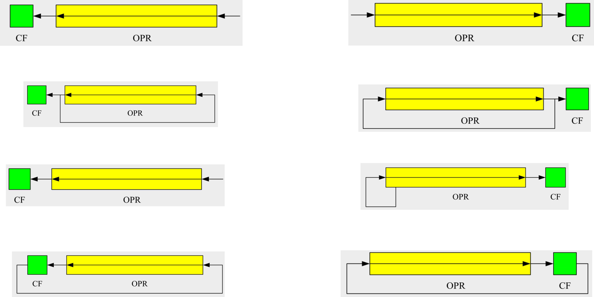</center>

其中逻辑左移和算术左移是等价的

当移动位数大于1时，必须使用`cl`

```assembly
mov al, 01010001B
mov cl, 3
shl al, cl
```


### 6.2 操作显存单元

显存总共`32kB`，占用了`B8000H`到`BFFFFH`的内存空间，将每`4kB`分为1页，一共存8页

默认显示第0页，一页显示`80*25`个字符

每一列由两个字节组成，低字节是要显示的字符的ASCII码，高字节是显示的属性

<center>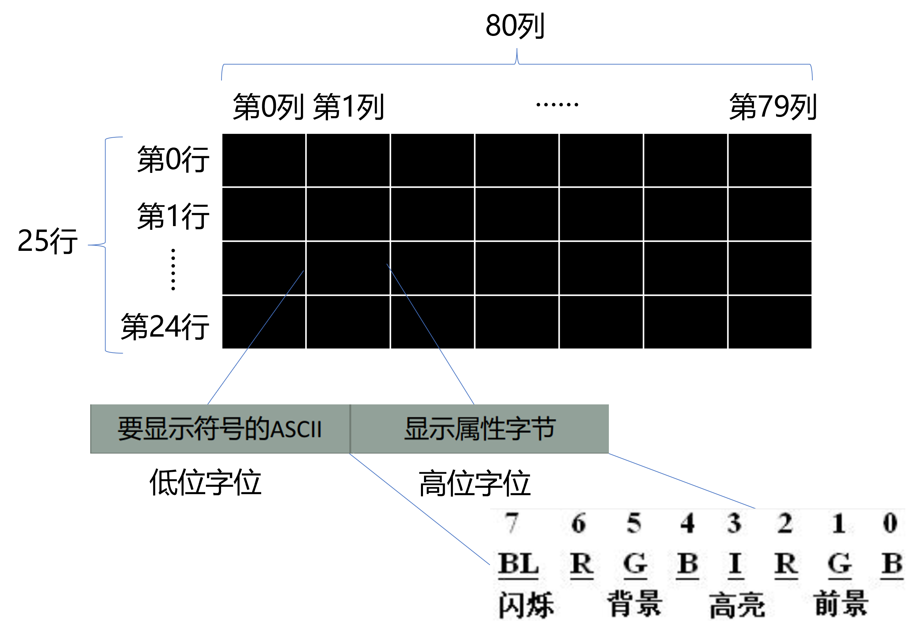</center>


### 6.3 描述内存单元的标号

什么是标号（label），就是表示一个数据区域的东西，如`codesg, start`等

也可以这样写

```assembly
code segment
	a: db 1, 2, 3, 4
	b: dw 0
start:
	mov si, offset a
	;xxxxx
```

这些都是**地址标号**

当标号去了冒号后，就成了**数据标号**，含有存储数据的**位置**和**类型（长度）**

```assembly
	a db 1, 2, 3
	b dw 0
s:	mov si, 0
	mov al, a[si]
	mov ah, 0
	add b, ax
```

不再需要`byte ptr`或`word ptr`

同时数据标号可以在数据段和代码段使用，地址标号只能在代码段中使用


扩展用法

```assembly
data segment
	a db 1, 2, 3, 4
	b dw 0
	c dw a, b
data ends
```

`c dw a, b`等价于`c dw offset a, offset b`

```assembly
data segment
	a db 1, 2, 3, 4
	b dw 0
	c dd a, b
data ends
```

储存的是段地址加偏移地址，等价于

```assembly
c dw offset a, seg a, offset b, seg b
```

`seg`可以获取标号的段地址


### 6.4 直接定址表

类似于哈希表，加快运算速度

函数也可以这么调用

```assembly
assume cs:code, ds:data

data segment
	table dw sub1, sub2
data ends

code segment
start:
	mov ax, data
	mov al, 0
	mov ah, 2
	call func
	mov ax, 4c00H
	int 21
	
func:
	push bx
	cmp al, 1
	ja over					;当al>1时就结束
	mov bl, al
	mov bh, 0
	add bx, bx				;table是字型的，故要乘2
	call word ptr table[bx]

over:
	pop bx
	ret

sub1:
	;xxxx
	
sub2:
	;xxxx
```

这样写的函数便于补充和调用


### <font color=orange>6.5 中断</font>

指CPU不再接着执行下面的任务，而是转移到别的地方执行

内中断：CPU内部的事件导致

外中断：外部设备导致，如键盘、鼠标的输入

每一种中断都有对应的中断服务程序（ISP，Interrupt Service Program），也就是中断例程


<font color=green>**8086的内中断**</font>

1. 除法溢出错误，0
2. 单步执行指令（-t），1
3. 执行`into`指令，4，是溢出时自动产生的（interrupt if overflow）
4. 执行`int n`指令，n是中断类型码

在8086中有一个中断向量表，记录了不同类型的中断所需要跳转的`CS:IP`地址

`ip = 0000:[N*4], cs = 0000:[N*4+2]`，N是中断类型

<center>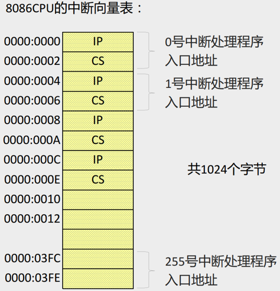</center>

随后CPU执行`CS:IP`处的指令


**执行过程**

1. CPU获取中断类型码`N`

2. `pushf`

3. 将标志位的`TF = 0, IF = 0`，`TF`是trap flag，等于1时单步调试，`IF`是interrupt flag，等于1时能被中断

   整个意思就是程序将**不能再被中断且连续执行**

4. `push cs,push ip`

5. `ip = 0000:[N*4], cs = 0000:[N*4+2]`


### 6.6 编写一个中断指令

整个框架如下，`doN`表示中断类型码为N

```assembly
assume cs:code

code segment
	
start:
	;doN 安装程序
	
	;设置中断向量表
	
	mov ax, 4c00H
	int 21H
	
	;doN主程序
	mov ax, 4c00H
	int 21H			;这是doN函数的返回
doNend:	nop			;程序结束标志

code ends
end start
```


**安装程序**

需要将主程序的内容复制到一段不会被使用的内存空间，在中断向量表的`0000:0200`之后的空间未被使用且不会被程序自动使用，可以储存

```assembly
;doN安装程序
mov ax, cs
mov ds, ax
mov si, offset doN
mov ax, 0
mov es, ax
mov di, 200H
mov cx, offset doNend - offset doN		;长度就是doN的指令的长度
cld
rep movsb
```


**设置中断向量表**

想要发生N中断时自动调用，那么需要修改中断向量表中原来`4N+2:4N`处的内容

```assembly
mov ax, 0
mov es, ax
mov word ptr es:[N*4], 200H		;保证中断后IP=200H
mov word ptr es:[N*4+2], 0		;保证中断后CS=0
```

`0000:0200H`是doN的入口地址，下面是doN的主程序


### 6.7 单步中断

`-t`指令到底干了些什么

1. 首先产生中断
2. 将`TF = 1`
3. CPU单步执行指令，返回修改后的寄存器内容和下一条指令


如果一开始就是`TF = 1`，那么将一直重复`-t`指令的第一个指令，永远不能结束

故进入中断前CPU会自动设置`TF = 0`


**单步中断不响应**

有些时候，`-t`指令的单步中断不会被识别，如

```assembly
mov ax, 12H
mov ss, ax
mov sp, 21H
```

在执行完`mov ss, ax`后会**自动执行下一条**，因为规范就是`ss, sp`连续定义

故`ss`下一条必须是`sp`的赋值


### <font color=blue>6.8 由`int Nh`引发的中断</font>

执行`int n`时，自动执行以下操作

```assembly
pushf
push cs
push ip
```

所以在中断调用的函数（**中断例程**）中需要在结束前加上一句`iret`，依次执行

```assembly
pop ip
pop cs
popf
```

共弹出6个元素


### 6.9 BIOS和DOS中断处理

**BIOS中断**

BIOS：Basic Input Output System，在主板的ROM（read only memory）存放的一套程序

对于8086来说，这个程序长`8kB`，从`FE000H`开始，到`FFFFFH`结束

主要内容：硬件系统的检测和初始化程序；外部和内部中断的中断例程；对外部设备进行I/O中断


**DOS中断**

比BIOS更高层，是系统层面的中断

和硬件有关的中断，一般都是调用的BIOS的中断例程


**`int 21H`**

这个中断使用`ah`中的值作为功能号，返回结果保存在`al`中

`4cH`表示程序返回，结果保存在`al`中


**BIOS和DOS的中断例程的安装过程**

1. CPU供电，初始化使得`CS:IP = FFFF:0000`，执行这个位置的程序，跳转到BIOS的硬件检测和初始化
2. 建立BIOS中断的中断向量表
3. 调用`int 19H`，引导操作系统，交管控制权到OS（这里是DOS）
4. DOS建立自己的中断向量表和中断例程


### 6.10 端口的读写

**CPU的邻居**

CPU可以直接读写三个地方的数据

1. 内部寄存器
2. 内存单元
3. 端口（连接到主板的外部设备和CPU的交流通道）

端口有64K的地址空间


<font color=green>**读写指令**</font>

`in`用于读端口

`in al, 60h`表示从`60h`这个端口号读入一个字节，赋值给`al`

执行过程：

1. CPU通过地址总线将`60H`发出，通过控制总线发出`in`（读）命令
2. `60H`端口将内容通过数据总线送入CPU


`out`用于写端口

`out 21h, al`表示将`al`的内容写入到`21h`端口


在`in, out`指令中，只能使用`ax, al`来进行读写，前者用于16bit，后者8bit


### 6.11 CMOS RAM芯片

包含一个实时钟和一个128个单元的RAM存储器，该芯片依靠电池工作，主板断电后内容不会丢

有两个端口，`70h, 71h`，前者存放读取的内存地址，后者存放选定的内存里的值


**提取CMOS RAM中的时间**

已知地址`08`存放月份，使用BCD码存放，如何提取？

```assembly
assume cs:code

code segment
	mov al, 8					;访问8号地址
	out 70h, al					;写入8
	
	in al, 71h					;读出月份
	;下面是将BCD转换为ASCII
	;先将高四位和第四位分开，再直接+30h
	;就得到月份的十位和个位的ASCII码
	
	mov ah, al
	mov cl, 4			
	shr ah, cl					;逻辑右移4次得到高四位，最高位补0
	and al, 00001111B			;做and运算
	
	add al, 30H					;变成ASCII码
	add ah, 30H
	;打印
code ends

end
```


### 6.12 外设连接与中断

外中断分为**不可/可屏蔽中断**，前者是CPU必须响应的中断，后者可以不响应

可屏蔽：看标志位寄存器的`IF`，`IF = 0`，则不响应这次中断；`IF = 1`，则在执行完当前指令后响应；几乎所有外设的中断都是可屏蔽中断；信息来自于CPU外部，通过数据总线送入CPU

不可屏蔽：CPU必须在执行完当前指令后响应，对于8086来说，这个中断的**中断码固定为2**（`N = 2, int 2`）


### 6.13 PC机键盘处理过程

**键盘按键**

1. 按下键盘，得到一个扫描码，表示按下的键的位置，称为通码
2. 通码送入寄存器的`60H`端口
3. 松开按键，得到一个扫描码，称为断码
4. 断码送入`60H`

断码的第七位为1，通码的第七位为0，有`通码 + 80H = 断码`，这都**不是**ASCII码


**引发9号中断**

1. 键盘输入达到`60H`端口，芯片向CPU发出`N = 9`的可屏蔽中断

2. `IF = 1`，响应中断，否则不管

3. 接受的输入信息存放在**BIOS键盘缓冲区**（`16B`的空间），这个区域可以存放15个键盘输入，一个输入占`1B`

   高位是扫描码，低位是对于的ASCII码

   如果输入的是控制键/切换键（shift，ctrl等），则会改变键盘状态字节，也是一个FLAG，按位生效，存放在`0040:0017`中


**执行9号中断**

1. 读出`60H`的扫描码
2. 如果是字符，将扫描码和对于的ASCII码送入键盘缓冲区；如果是控制键/切换键，将其转变为状态字节，送入FLAG的单元
3. 向键盘芯片发出回应


### 6.14 操作外部设备

以键盘操作为例

按下键盘时产生的`int 9`中断，如果响应了，那么跳转到BIOS的键盘中断处理程序`int 16H`


**`int 16H`中断**

当`ah = 0`时，从键盘缓冲区读取`1B`，并删除这个字节，返回值为`ah = 扫描码, al = ASCII码`

ASCII码会根据键盘状态字而改变，如果shift按下，caps为1，那么按键`A`的**扫描码不会改变**，ASCII码变为`61H`（小写a）


**`int 16H`的0号中断例程具体实现过程**

1. 检查缓冲区有无数据
2. 没有数据，重复1；有数据，向下走
3. 读取第一个字单元的键盘输入
4. 将扫描码送入`ah`，ASCII码送入`al`
5. 将读取到的输入从缓冲区删除


`int 9`和`int 16H`是一对配合的中断例程，前者在键盘按下/松开时写数据，后者在被调用时读数据


### 6.15 定制和改写键盘中断例程

<font color=red>例：</font>现在想在屏幕上依次显示`a~z`，且人看得见；显示过程中，按下ESC后改变字体颜色，要求原先的`int 9`中断例程仍然能调用

解：自动变化字母，人能看清，那么得延迟，延迟函数有两个

1. 调用中断例程

   ```assembly
   delay:
   	push ax
   	push cx
   	push dx
   	mov cx, 000FH
   	mov dx, 4240H
   	mov ax, 8600H
   	int 15H
   	pop dx
   	pop cx
   	pop ax
   	iret
   ```

   `int 15H`在`ah=86H`时，会延迟`cx:dx`微秒的延迟，`1s = 10e6 us = F4240H us`

2. CPU空循环

   ```assembly
   delay:
   	push ax
   	push dx
   	mov dx, 10H
   	mov ax, 0
   s1:	sub ax, 1
   	sbb dx, 0		;使用sbb，带借位的减法
   	cmp ax, 0
   	jne s1
   	cmp dx, 0
   	jne s1
   	pop dx
   	pop ax
   	ret
   ```

   8086的时钟频率为5MHz，一个周期200ns，4个周期构成一个总线周期（存/取1B的时间）

   对于sub指令，占4B，需要4个总线周期，执行这条指令也需要1个总线周期，共5个，时间为$200\times 4\times 5 = 4\mathsf{us}$，为了实现秒级的延迟，`16B`的寄存器不够，需要`dx:ax`配合使用


​	按下ESC后改变颜色，得写新的`int 9`中断例程

```assembly
int 9:
	push ax
	push bx
	push es
	
	in al, 60H		;从60H端口读入键盘的输入
	pushf			;标志位寄存器压栈
	
	pushf			;为了手动设置IF，TF标志位为0而压栈，可以认为上面是准备工作
	pop bx			;和上一句一起，将标志位赋给bx
	and bh, 11111100B
	push bx
	popf 			;和上一句一起改变标志位寄存器
	
	;执行原来的int 9中断，取键盘输入，这里留空后面补上
	
	cmp ah, 1h		;ESC的扫描码为1H
	jne int9ret		;不是就退出这个例程
	
	;改变颜色的函数
	mov ax, 0B800H
	mov es, ax
	inc byte ptr es:[160*12+40*2+1]
	
int9ret:
	pop es
	pop bx
	pop ax
	iret			;中断例程的返回
```


要求原先的`int 9`中断例程忍让能用，那么得存放原先的入口

```assembly
data segment
	dw 0, 0
data ends			;datasg 用来保存原来的入口

;下面是改变int 9的入口到自己定义的
mov ax, 0
mov es, ax

;通过栈来实现存原先的入口
push es:[9*4]
pop ds:[0]
push es:[9*4+2]
pop ds:[2]

;重定向int 9的入口
mov word ptr es:[9*4], offset int9
mov es:[9*4+2], cs

;恢复原来的中断例程地址
push ds:[0]
pop es:[9*4]
push ds:[2]
push es:[9*4+2]
```

这样原来的中断指令的地址就在`ds:[0], ds:[2]`中，通过`call dword ptr ds:[0]`就能实现原先的中断例程（取键盘输入）


完整的指令如下

```assembly
assume cs:code
stack segment
	db 128 dup (0)
stack ends

data segment
	dw 0,0
data ends

code segment
start: 
    mov ax,stack
    mov ss,ax
    mov sp,128
    mov ax,data
    mov ds,ax

;改变中断例程的入口地址
    mov ax,0
    mov es,ax
;通过入栈出栈的方式将原始int9中断例程的入口地址放到定义好的数据段
    push es:[9*4]
    pop ds:[0]
    push es:[9*4+2]
    pop ds:[2]
;将中断向量表的9号例程指向自定义的例程程序入口，即cs:offset int9处
    mov word ptr es:[9*4], offset int9
    mov es:[9*4+2],cs

;显示“a~z”
    mov ax,0b800h
    mov es,ax
    mov ah,'a'
s: 	mov es:[160*12+40*2],ah
    call delay
    inc ah
    cmp ah,'z'
    jna s
    mov ax,0
    mov es,ax

;恢复原来的中断例程地址
    push ds:[0]
    pop es:[9*4]
    push ds:[2]
    pop es:[9*4+2]

    mov ax,4c00h
    int 21h

;延迟和变颜色子程序
;延时子程序
delay:
    push ax
    push cx
    push dx
    mov cx,000fh
    mov dx,4240h
    mov ah,86h
    mov al,0
    int 15h
    pop dx
    pop cx
    pop ax
    ret

;新的int9中断例程
int9: 
;子程序中用到的寄存器压栈
    push ax
    push bx
    push es
;从60h 从端口读入键盘的输入
	in al,60h
;标志位寄存器压栈
	pushf
;手动设置IF、TF标志位为零
    pushf
    pop bx ;先push再pop，将标志位寄存器的值放到通用寄存器中
    and bh,11111100b
    push bx ;压栈改变后的标志位寄存器的值
    popf ;设置IF、TF标志位为零
    call dword ptr ds:[0] ;执行原来的int9中断例程，取键盘输入
    cmp al,1h ; ESC扫描码1
    jne int9ret
;改变颜色
    mov ax,0b800h
    mov es,ax
    inc byte ptr es:[160*12+40*2+1] ;改变字符属性
int9ret:
	pop es
    pop bx
    pop ax
    iret ;中断例程返回

code ends
end start
```

注意到`int9`函数不用写在主程序中，这是在键盘输入时自动跳转的


`cli`指令可以屏蔽外部中断，保证代码运行，当保护的代码结束时，`sti`指令可以恢复外部中断的中断性


### 6.16 磁盘读写

BIOS提供`int 13H`作为磁盘读写中断


## 7 高级汇编语言技术

### 7.1 子程序的另一种写法

为了更方便地阅读和调用，子程序的另一种写法是

```assembly
func proc
	;function realization
func endp
```

其中`func`是子程序的标号，调用和返回的写法不变


### <font color=blue>7.2 程序的多文件组织</font>

一个程序可以由多个文件组成，一个文件由多个子程序组成

<center>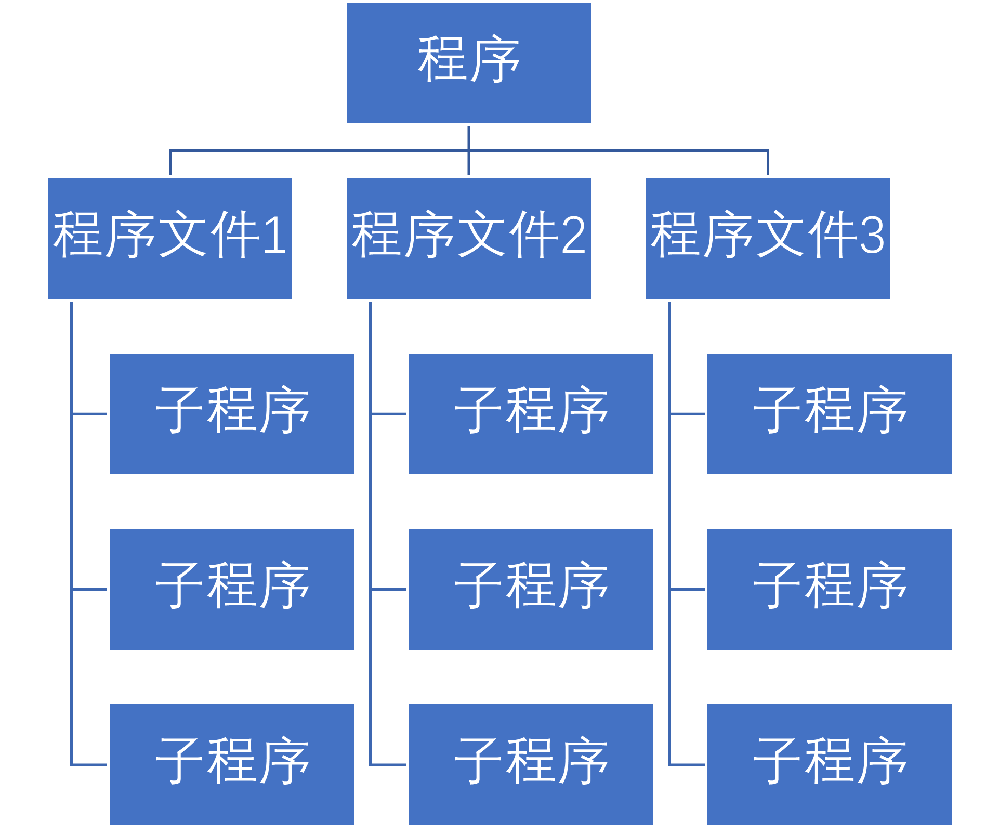</center>

假定`p1.asm`是主程序所在的文件，`p2.asm`是被调用的子程序所在的文件，那么分别如下

`p1.asm`

```assembly
extrn subp:far
assume cs:code
code segment
start:
	;xxxxx
	call far ptr subp;	调用子程序
	;xxxxx
	mov ax, 4c00H
	int 21H
code ends
end start
```

`p2.asm`

```assembly
public subp			;必须是public才能被调用
assume cs:code		;子文件也要写这些
code segment
subp proc
;xxxxxx
retf				;注意是retf
subp endp
```

在进行编译和连接时如下

```assembly
masm p1.asm;
masm p2.asm;
link p1.obj + p2.obj;
```


### 7.3 汇编指令汇总

略，用到再查吧


### 7.4 汇编过程

<center>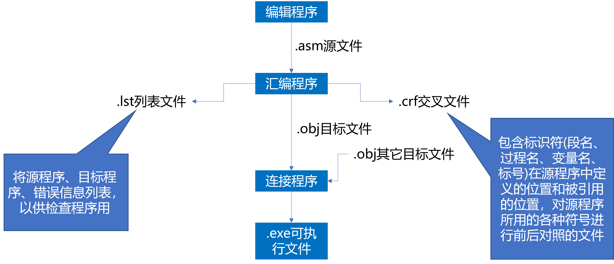</center>


**汇编过程**

有**两次**编译

1. 确定地址，翻译机器码，将字符标号原样写出
2. 标号代真，将字符标号用计算出的地址/偏移量代换


### <font color=orange>7.5 宏汇编</font>

程序开始之前的预处理，根据预处理命令对程序做出相应处理

经过预处理后编译器才能对程序进行编译

在C语言中，宏定义写法为

```c++
#define //xxx
```


在汇编语言中，宏是源程序中一段有独立功能的代码，由用户定义

在编程时多次使用的功能可以打包为一条宏指令，定义和调用方法如下

```assembly
assume cs:code
code segment

mproc macro p1, p2, p3		;虚参
mov ax, p1
mov cx, p2
mov dx, p3
endm

start:
	mov ax, data
	mov ds, ax
	mproc [bx], bx, 100H	;实参
	mov ax, 4c00H
	int 21H
code ends
end start
```

其中`mproc`是宏的标号，`p1, p2, p3`是宏的虚拟参数表

宏是**先定义后调用**，必须在开始前定义（不然start不好找）

宏展开后如下

```assembly
mov ax, [bx]
mov cx, bx
mov dx, 100H
```

这在编译器编译时**一定会展开，用实参代替虚参**，而不像函数一样转移


**子程序和宏的区别**

子程序是模块化的，多次CALL也只是**转移**，因此可以先调用后定义，且不需要参数列表；但由于多次`push, pop`，时间开销大

宏需要先定义，且需要指定参数列表，但是宏的参数传送简单，时间开销少；但是宏必须展开，空间开销大

简单说：子程序用时间大换空间小，宏用空间大换时间小

在子程序本身比较短，参数又很多的情况下，宏指令更有效


当然，宏也可以没有参数

```assembly
pushreg macro
	push ax
	push bx
	push cx
	push dx
	push bp
	;.....
endm

popreg macro
	;.....
	pop bp
	pop dx
	pop cx
	pop bx
	pop ax
endm
```

这可以在调用函数前后使用，这样子程序的时间开销也变小了，而且子程序更短

```assembly
pushreg
call far ptr func
popreg
;......

func:
	;不用push
	;....
	;不用pop
	retf
```


**宏中的局部标号**

在定义宏的时候可以用一个局部标号，必须在宏头下的**第一句话**

```assembly
func macro p1
	local next			;局部标号next
	cmp p1, 0
	jge next
	neg p1
next:
endm
```

如果这样的程序调用了宏

```assembly
func var
;.....
func bx
```

在展开后如下

```assembly
;第一个
;...
	cmp var, 0
	jge xx0000
	neg var
xx0000:
	endm
	
;第二个
;...
	cmp bx, 0
	jge xx0001
	neg bx
xx0001:
	endm
```

发现局部标号的地址不受宏之外的程序影响，按顺序排列

不同标签共享一个排序


**宏的虚参是操作码的一部分**

宏的虚参也可以作为指令的一部分

```assembly
leap macro cond, lab
	j&cond lab
endm
```

调用如下

```assembly
leap z, there
leap nz, here
```

展开如下

```assembly
	jz there
	jnz here
```

就是`jxxx`的`xxx`可以被参数代替


**宏库**

将用到的宏定义分类放到不同的宏库文件中，也是一个程序文件

与`.asm`文件类似的，宏库的文件后缀是`.mac`

如`name.mac`，内容如下

```assembly
macro1 macro p1, p2
	;xxxx
	endm

macro2 macro p3, p4
	;xxxx
	endm
;xxxx
```

注意，`name`中不能含有数字

在主程序文件中调用时

```assembly
include name.mac
;xxxx
macro1 bx, ax
;xxxx
```


### <font color=green>7.6 条件汇编</font>

根据条件把一段程序包括/排除在编译后的文件内，常常和宏一起使用

下面是一个例子，用于求最大值

```assembly
max macro k, a, b, c
	local next, out
	mov ax, a
	if k-1
	if k-2 
	cmp c, ax
	jle next
	mov ax, c
	endif		;对应k-2
next:
	cmp b, ax
	jle out
	mov ax, b
	endif		;对应k-1
out:
	endm
```

宏调用如下

```assembly
max 1, p
max 2, p, q
max 3, p, q, r
```

宏展开如下

```assembly
	mov ax, p	;k=1,k-1为假，将内部包括的都不执行
??0001:			;结束宏，out的第一个局部标号

	mov ax, p
??0002:			;next的第一个局部标号，可以发现不同label是共享排序的
	cmp q, ax
	jle ??0003
	mov ax, q
??0003:			;out的第二个局部标号
	
	;最后一个宏展开是完整的宏，不赘述
```


`ifndef p`（if not define）在虚参`p`未定义时满足，执行内部的语句


### 7.7 重复汇编

用于连续产生类似的一组代码，如下面将字符A到Z的ASCII码填入了`table`数组

```assembly
char = 'A'
table label byte	;相当于定义了一个数组，数组名是table，数组类型是byte
	
	rept 26
	db char
	char = char + 1
	endm
```

使用

```assembly
rept 表达式		;重复的次数
;重复的操作
endm
```


**不定重复伪操作`IRP`**

格式如下

```assembly
IRP	哑元，<自变量表>
	;重复的内容
endm
```

下面是一个例子，用于入栈

```assembly
IRP reg, <ax, bx, cx, dx>
	push reg
endm
```


对于字符串类型的变量表，有专用的表示

```assembly
array label byte
IRPC k, 12345
db 'NO.&k'
endm
```

编译后`array`中存了`db 'NO.1'`到`db 'NO.5'`


### 7.8 反汇编

逆向工程，将机器语言转换为汇编语言（低级转高级）

debug就是一个反汇编工具


### 7.9 混合编程

使用两种或以上的语言变成，利用每种语言的优势

在使用客场语言时，用对于的后缀包裹起来，例如在C++中使用汇编

```assembly
_asm
{
	;xxx
}
```


## 8 CPU的结构和工作模式

### 8.1 计算机体系结构

冯诺依曼结构和哈佛结构的区别：后者的指令和数据存在不同的Memory


**计算机的基本组成**

* 存储器（Memory）
* 运算器（Arithmetic Unit）：包含累加器（Accumulator）和ALU
* 控制器（Control Unit）
* 输入/输出设备（I/O Device）

将运算器和控制器称为CPU，将CPU和存储器称为**主机**，将I/O称为外设


**微机的基本结构**

和计算机没有本质区别，只是CPU采用集成化的微处理器，各部件通过总线相连


### 8.2 8086CPU的构成

由两部分组成：

1. 总线接口单元：BUs Interface Unit，BUI
2. 指令执行单元：Execution Unit，EU

BIU和EU独立，取指和执行可以同时进行（流水线）


**外部引脚**

<center>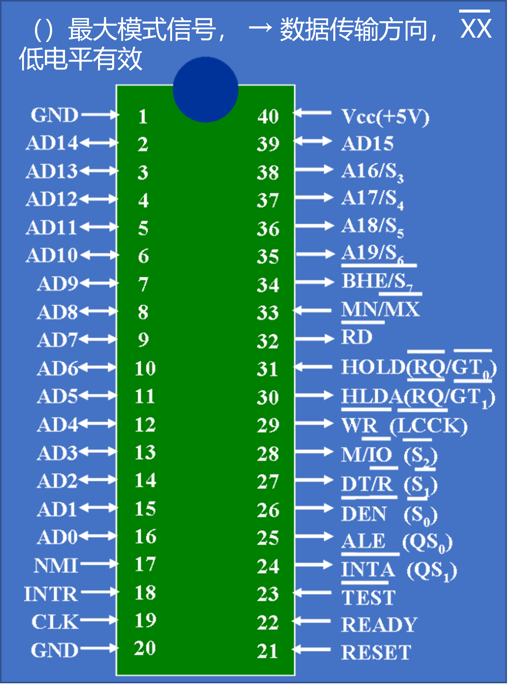</center>

其中`AD`指Address/Data，8086的地址总线宽20bit，共20根（`AD0 - A19`），其中`AD0-AD15`是地址和数据复用，`A16-A19`是地址和状态复用


**与中断有关的引脚**

* INTR：可屏蔽中断请求（Request）信号，当`IF=0`时不读取，当`IF=1, INTR=1`时，执行中断
* NMI：不可屏蔽中断（Non-Maskable）
* $\overline{\mathsf{INTA}}$：中断响应信号（Acknowledge），在CPU响应外部的可屏蔽中断后**向外设发送的应答**


**RESET引脚**

这是复位信号，至少要维持4个时钟周期

复位后CPU停止所有操作，总线无效

设置`DS,ES,SS,FLAGS,IF = 0`，`CS:IP = FFFF:0000`；指令队列清空，禁止中断

复位结束，CPU执行重启过程


### 8.3 CPU的工作模式

当`MN/MX`接+5V时，CPU工作在最小模式，是单处理器系统；当接地时，处于最大模式，支持构成多处理器系统


**最小模式**

送到存储器和I/O接口的所有信号都是CPU自身产生的

<center>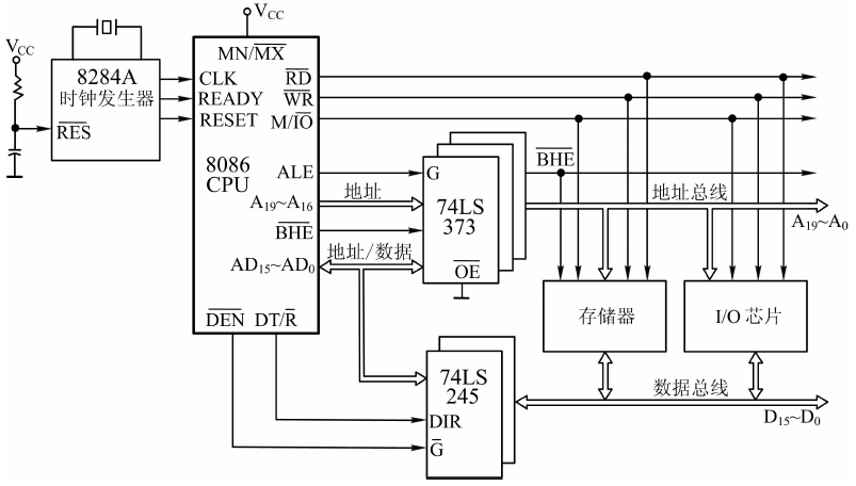</center>

使用3个74LS373（8位地址锁存器）和2个74LS245（8位双向数据总线缓冲器），一个时钟发生器8284A

锁存器：2片与`AD0-AD15`连接，1片与`A16/S3-A19/S6, BHE/S7`连接

**为什么是这个数量？**

8086地址总线有20位，8\*3=24才够；数据总线16位，8\*2就够了

**为什么需要锁存器？**

在数据和地址线复用的情况下，地址信息可能被数据信息干扰，在总线上先传地址，锁存，再传数据/状态信号

**为什么需要缓冲器？**

作为双向的数据总线接收器；协调高速CPU和慢速外设的速度差；提高驱动能力；隔离后级电路

**时钟提供了什么？**

系统时钟；复位信号（CPU重启）；READY信号；供外设使用的时钟信号

注意，这个芯片可以外接时钟，输出外接时钟的信号，对于8086来说，就是用的**外接**15/24MHz信号经过8284A3分频后产生的5/8MHz信号作为时钟


**最大模式**

某些控制信号有8288总线控制器产生

最大模式主要用于解决总线的**共享控制**和产生**总线控制信号**

需要增加一片总线控制器8288 


### 8.4 CPU的总线时序

**总线操作时序**

CPU读写一次的时间叫做**总线周期**

执行一条指令的时间交**指令周期**，一个指令周期可包含若干个总线周期

1个总线周期需要4个系统的**时钟周期**（$T_1$-$T_4$），时钟周期是8086CPU动作的最小单位

在5MHz时钟频率下，一个总线周期为800ns


**最小模式下的读总线周期**

CPU读取一个数据的时序逻辑

<center>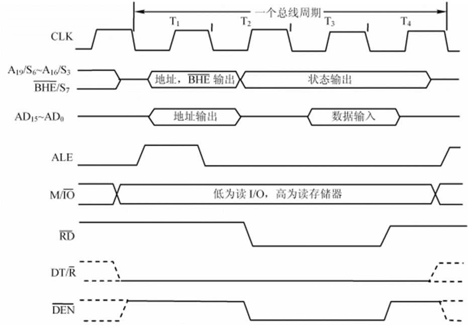</center>


**最小模式下的写总线周期**

CPU写入一个数据的时序逻辑

<center>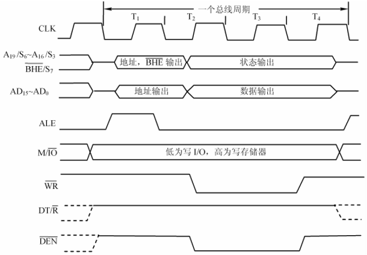</center>


**最大模式下的读/写总线周期**

没有`M/IO`信号，使用`MEMR`和`IOR`来区分是存储器还是I/O


## 9 存储器

### <font color=blue>9.1 概述</font>

**什么是存储器**

半导体存储器是由能够表示二进制`0,1`的，具有记忆功能的半导体器件构成的

能存放一位二进制（1bit）的期间称为一个**存储元**，8个存储元（1Byte）构成一个**存储单元**


**分类**

按位置分类

* 内部存储器
  * 随机存取存储器：Random Access Memory，RAM
  * 只读存储器：Read Only Memory，ROM
* 外部存储器
  * 磁带
  * 磁盘
  * 光盘等


### 9.2 内存和外存

<font color=green>**内部存储器**</font>

CPU可以**直接访问**，**速度较快**的半导体存储器，分为ROM和RAM

* RAM：断电后内容全部丢失，随机读写，访问速度快，分为
  * SRAM，Static RAM，静态RAM
  * DRAM，Dynamic RAM，动态RAM
  * PSRAM，Pseudo SRAM，伪静态RAM
* ROM：断电不会消失，只读，改写要用专门的编程器，广泛用于微机化仪器设计，分为
  * MROM，Masked ROM，掩膜ROM
  * PROM，Programmable ROM，可编程ROM
  * EPROM，Erasable Programmable ROM，可擦除可编程ROM
  * EEPROM，Electricity EPROM，电可擦除PROM
  * Flash Memory，闪存


**外部存储器**

CPU不能直接访问，使用接口电路读写，访问速度慢，数据不易丢失


### 9.3 存储器性能

**存储容量**：内存最大容量受CPU**地址总线宽度**限制，外存无限大（理论上）

**存取速度**：远低于CPU工作速度，对**性能产生主要的影响**，使用**存取时间**$T_{AC}$表示从接受到CPU的稳定的地址信息到完成读写的最大时间，一般在10ns级别

**功耗**：包括有效功耗和待机功耗，前者是主要的

**可靠性**：使用**平均故障时间（Mean Time Between Failures，MTBF，Hours）**


### 9.4 存储器设计

设计时要考虑的问题

* CPU总线的宽度
* CPU时序与存储器速度的配合
* 存储器的地址分配和片选
* 控制信号的连接


使用**地址译码器**进行内存单元的选择

* 存储器由多个芯片构成，首先要选定芯片，称为**片选**，CPU传送的地址信号**高位用来片选，低位直连芯片**，实现片内寻址

* 用高位地址实现片选的电路是地址译码器，有门电路译码器，N中取一译码器和PLD（Programmable Logic Device）译码器等

* 常用74LS138（8中取一译码器）

  <center>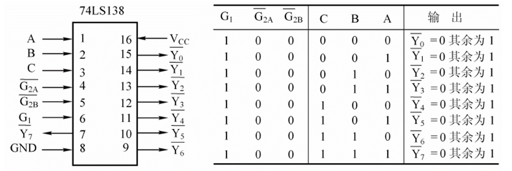</center>

  8个输出中产生一个**低电平片选信号**


### <font color=red>9.5 存储空间的扩展</font>

**位扩展**

存储单元的大小可以改变，但是主流的是8bit

将同类型的芯片**并联**，扩展一个存储单元的大小，使之与CPU匹配

例如，下面将一个`x1`的芯片扩展为`x8`的存储单元

<center>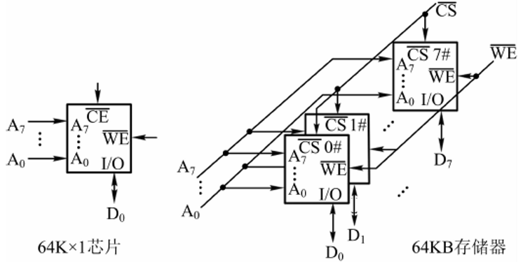</center>

将**地址信号并联**，保证选中的是一个地址；将**片选信号**（$\overline{\mathsf{CE}}$）和写入信号（$\overline{\mathsf{WE}}$）**并联**，保证这个单元被同时选中；将每个芯片的`I/O`引脚串接，形成一个`x8`的地址单元，依次连接到数据总线的`D0-D7`


**字扩展**

芯片的位数符合CPU的要求，但是能够存放的地址个数没有地址总线宽，这时可以扩展

将同类型的芯片串联，扩展能表示的地址

例如，下面用4个`16Kx8`的芯片扩展为`64Kx8`的存储器，使用一个`2-4`译码器进行片选

<center>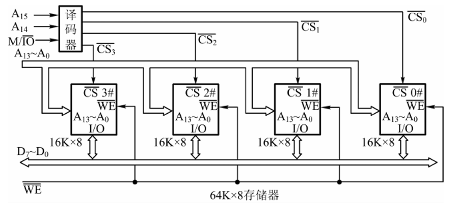</center>

这样，一个芯片能接受`A0-A13`共$2^{14}=16$K的地址，现在是$2^{2} \times 2^{14}=64$K的地址，前者是片选信号的位数

直连的**低地址信号**在各个芯片之间是**并联**的，**高地址信号**经过译码器作为**片选信号**

由于`M/IO`必须是`1`，也就是必须是对Memory操作，故虽然是一个`3-8`译码器，却只能作为`2-4`使用


**字位扩展**

当芯片的容量和位数都需要扩展时，可以综合上面两个方法

例如，下面使用8个`1Kx4`的SRAM芯片，扩展为了`4Kx8`的存储器

`1K`变为`4K`，需要2高地址作为片选，即4个单元串联；`x4`变为`x8`，需要两个芯片并联

<center>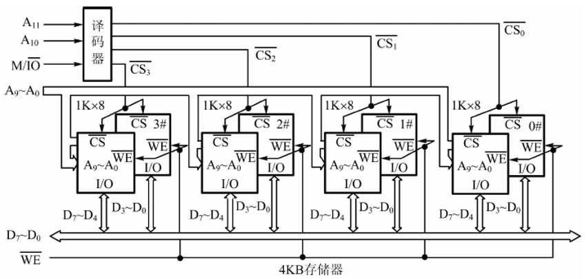</center>


### <font color=red>9.6 形成选片信号的方法</font>

**线选法**：用1位高地址做片选，低位地址直连芯片，片内选址

电路简单，但是浪费了很多空间（很多高位没用上），而且**地址重叠且不连续**


<font color=red>例：</font>用两块2764芯片和线选法，组成一个存储器，写出地址范围

解：芯片能够接受13个地址信号`A0-A12`，那么考虑用`A13, A14`进行片选，得到的电路和地址范围是

<center>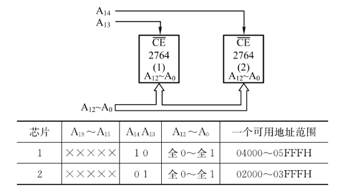</center>

`A19-A15`被浪费，会**地址重叠**；而且`A14A13`只能是表中的数据，**地址不连贯**


**全译码法**：全部高位地址参与译码

地址唯一，不会重叠，但是电路复杂


<font color=red>例：</font>8bit系统，设计一个用1片27128和1个74LS138译码器，规定地址范围为`1C000 - 1FFFF H`的存储器

解：27128芯片是一个`16Kx8`的存储器，使用X/Y译码器进行片内选址，`A0-A6`是行地址，`A7-A13`是列地址

​		首先看看地址范围：`1C000 = 0001 1100 0000 0000 0000`，`1FFFF = 0001 1111 1111 1111 1111`

​		不难发现从全0变化为全1的是`A0-A13`，而`A14=A15=A16=1`，其余恒0 

​		74LS138是`3-8`译码器，有三个门控通道，其中一位必须是`M/IO`，那么按照上面的不变量存在很多中设计方法，下面给出一种

<center>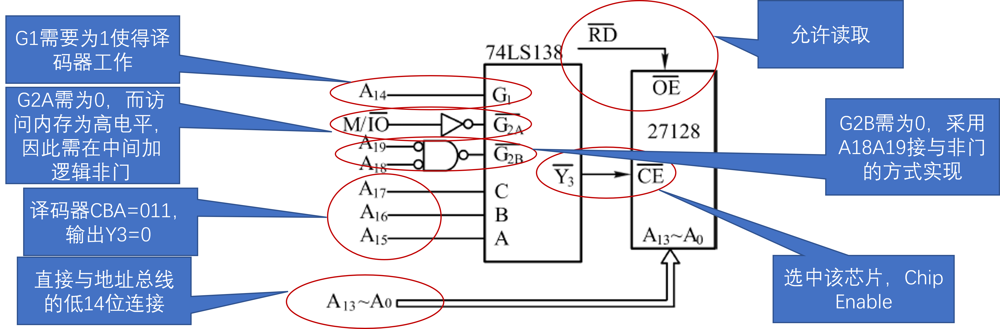</center>


**部分译码法**：使用高地址中的几位作为片选信号

会产生重叠，因此这个只适用于小内存系统


<font color=red>例：</font>用4块2732芯片构成`16Kx8`存储器，起始地址为`10000H`，要求地址连续，使用部分译码法和74LS138

解：2732是`4Kx8`芯片，有12根地址线，能直接连接`A0-A11`，那么使用`A12-A19`的几位进行片选

​		地址的起点是`0001 0000 0000 0000 0000`，$2^{14}=16$K，有4块芯片，用2个信号选片，但是74LS138是

`3-8`译码器，故再选一个不会变的位

​		要求的是地址连续，那么终点的地址就是`0001 0011 1111 1111 1111`，那么连续变化的是`A14A13`，作为片选信号，不变的`A15=0`作为第三个选择信号，那么整个存储器就是

<center>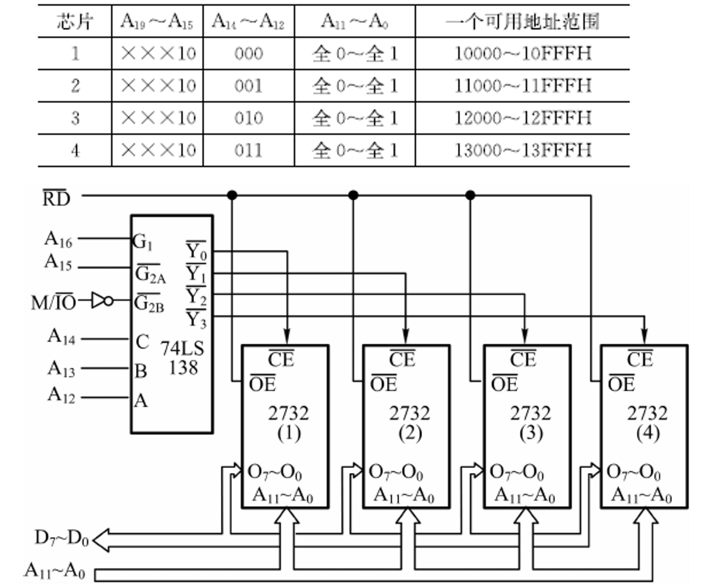</center>


### <font color=green>9.7 8086的存储器奇偶分体设计</font>

<center>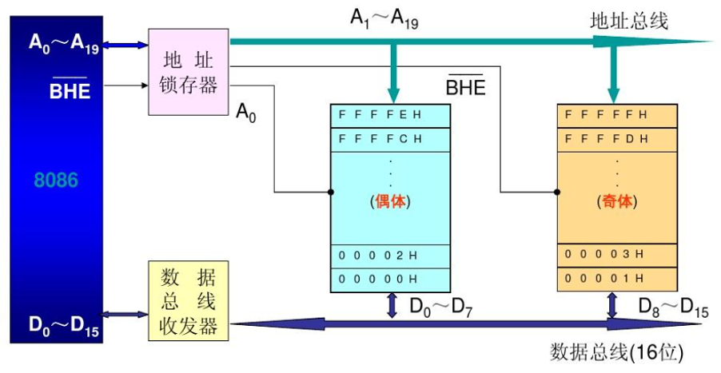</center>

其中$\overline{\mathsf{BHE}}$表示Bus High Enable，选择高地址（奇地址），地址选择器的构造如下

<center>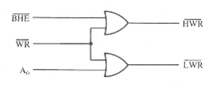</center>

其中$\overline{\mathsf{LWR}}$表示Low Write Enable，写入低地址（偶地址），因为`A0`作为最低为决定了地址的奇偶，故这里用`A0`


会看芯片表示的图就行


### 9.8 层次化储存结构

**局部性原理**

1. 在任意一段时间内，程序只会访问地址空间中**相对较小**的一部分
2. 时间局部性：某个数据被访问，那么在不久的将来还会访问
3. 空间局部性：某个数据被访问，那么与它地址相邻的数据也很快被访问

由于这个规律，设计出层次化的存储结构

<center>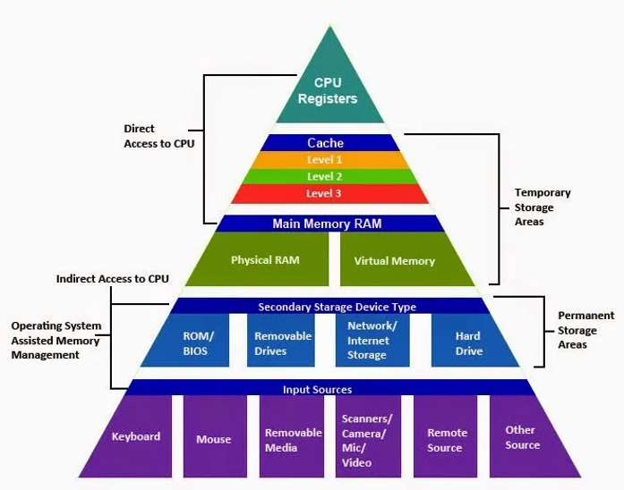</center>


**高速缓存（Cache）的工作原理**

为了解决CPU速度和访问内存速度的差异，有以下几种方法

1. 插入多个等待周期$T_w$，但是浪费CPU的能力
2. 用高速的SRAM存储，但是成本高
3. 在慢速的DRAM和快速CPU中用容量较小的Cache（SRAM，功能由硬件实现）

第三个方法好啊


## 10 I/O接口芯片

### <font color=blue>10.1 为什么需要接口</font>

**为什么**

* CPU和外设速度不匹配
* CPU和外设信号电平不匹配（CPU是TTL，即0为低5为高，外设各有不同）
* 信号格式不匹配（CPU是8b，16b等并行数据，外设不一定）
* 时序不匹配


**接口电路的解决方法**

* 数据缓冲：锁存器，缓冲器等
* 加入电平转换电路
* AD/DA转换器
* 以握手联络信号（Ready）保证同步


**端口分类**：数据端口；状态端口；命令端口


**I/O端口的寻址方式**

1. 存储器映象寻址：将每一个I/O端口看作一个存储单元，所有的访问内存的指令都能直接访问端口

   优点：不用专门的I/O指令

   缺点：占用了大量存储单元的地址空间

2. I/O单独编址方式

   优点：程序更加明确；不占用内存空间；指令短，译码电路简单

   缺点：`IN,OUT`的功能不如访存指令强；CPU需要提供`M/IO`信号

   **8086/8088都是这个方式**


<font color=green>**CPU与外设之间的数据传送方式**</font>

* 程序控制方式（软件）

  * 分为无条件（同步）传送和有条件（查询式）传送

  * 前者用于简单外设的操作；后者需要**先握手**

  * 传输完一个字符，CPU持续发送请求，直到外设准备完；CPU不能干别的事

* 中断方式（软件）

  * 只有当输入设备的数据准备好了（READY），或数据缓冲器已空时，才会发送中断

  * 传输完一个字符，CPU发送请求并回到原来干的事，直到外设发送中断，继续传输

* DMA方式（硬件），Direct Memory Access

  * DMA**临时接管CPU的地址、数据和控制总线**，实现批量的数据传送
  * CPU可以继续干别的事


### 10.2 两种通信方式

**并行通信**：一次性直接传输

优点：速度快

缺点：需要的线很多，远距离不现实


**串行通信**：在单根线上按顺序传送一段数据

微机和远程终端进行数据交换都用这个方式


### 10.3 可编程并行接口芯片8255A

**8255A并行接口芯片**

<center>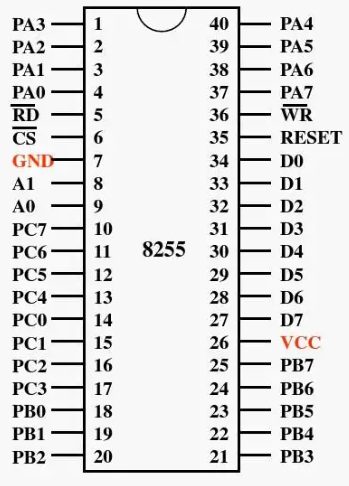</center>

含有3个独立的8bit并行In/Out端口，其中`PA,PB`是8bit端口，`PC`可以拆分为两个4bit端口

**基本操作**

<center>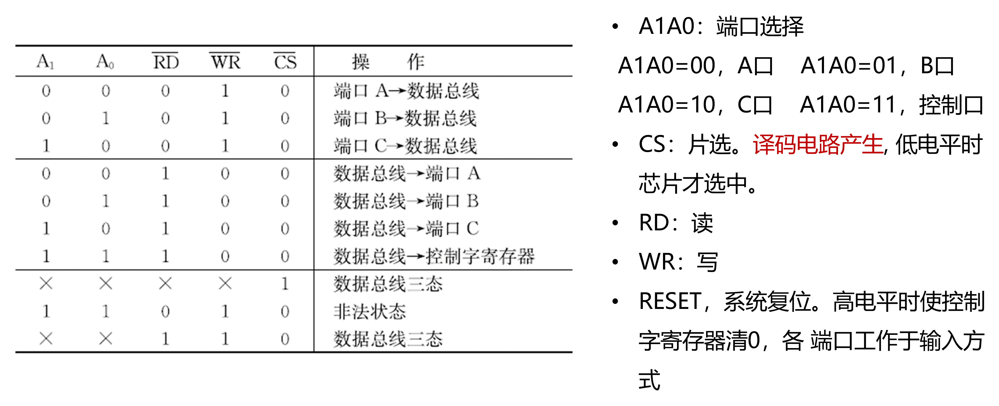</center>

其中控制字寄存器是每个IO设备都有的，决定工作模式的寄存器

`RESET`让系统复位，控制寄存器清0，各端口工作于**输入模式**


**与CPU的连接方式**

在8bit系统中，`A1A0`地址线与芯片的`A1A0`连接。若基地址是`60H`，A、B、C和控制口的端口分别是`60H,61H,62H,63H`

在16bit系统中，`A0`地址线用来选取奇偶位，故使用`A2A1`地址线，注意计算端口时`A0`位也要计算，相邻端口相隔`2H`


**控制字的设置**

在进行初始化时必须先输入

根据标志位的不同有两个状态：

<center>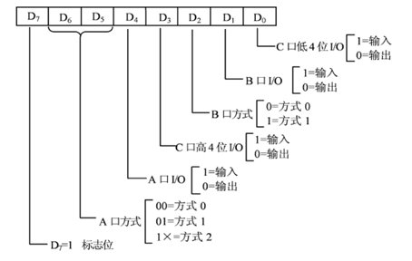</center>

<center>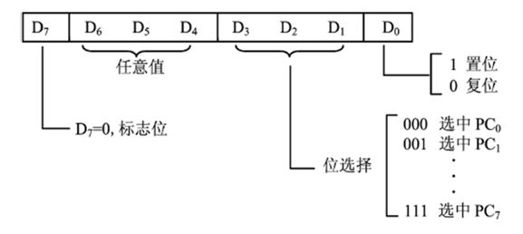</center>

注意到只有`PA`有方式2，`PC`只能工作在方式0，但是设置`D7=0`可以任意输出`PC`的引脚为`1/0`

三种方式：基本I/O，选通工作，双向传送


<font color=red>例：</font>检查8个开关，要求不断检测开闭状态，当开端断开时对应的LED灯点亮

解：使用8086CPU，8255A，74LS138提供全译码

​		设置`PA`用于读取，`PB`用于输出，都工作在方式0，8086是16bit系统，`AD2D1`接入`A1A0`

​		那么`PA`对应于`1111 0000B`，`PB`对应于`1111 0010B`，`PC`对应于`1111 0100B`，控制字对应于`1111 0110B`

​		接下来为全译码选择合适的信号，74LS138有3个门，3个选择信号，$\mathsf{M/\overline{IO}}$占一个$\mathsf{\overline{G2A}}$

​		由于16bit的芯片，故一定要指明高低字节，`A0`一定作为一个选择信号，剩下的选两个不变的就行，这里选择`A4A3A0`作为选择信号，始终为`100B=4D`，因此$\mathsf{\overline{Y4}}$连接到$\mathsf{\overline{CE}}$，剩下的就是门

​		硬件电路如下图：

<center>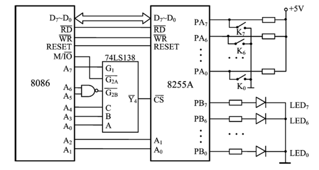</center>

​		还需要软件，一开始需要设置控制字，观察每个bit对应的信息

```assembly
mov dx, 0F6H		;指向控制字
mov al, 10010000B
out dx, al			;写入
```

​		然后检测开关状态

```assembly
watch:
	mov dx, 0F0H		;指向PA
    in al, dx			;读取状态
    mov dx, 0F2H		;指向PB
    out dx, al			;写入状态
    call delay			;为了人看清楚需要延迟亮灯
    jmp watch			;持续检测
```


### <font color=blue>10.4 串行通信</font>

**数据传输方向**

1. 单工：单向通信，A只能发送，B只能接受；广播
2. 半双工：双向通信，但只有一根传输线，同一时间只能单工；对讲机
3. 全双工：两个通路，可以同时收发；电话


**基本工作方式**

* 异步方式

  * 数据规格：起始位1b；数据位5-8b，D0在先；奇偶校验位1b（可选）；停止位1/1.5/2b

  * 传输效率低

* 同步方式

  * 数据规格：1/2b同步字符（单/双同步）/外同步无同步字符，5-8b数据，2b校验字符

  * 接受方利用同步字符，将周期与发送方同步，直接接受后面的数据段

  * 效率高很多，但是错误率也高很多


**波特率**：每秒传输的数据的位数，异步远低于同步


**调制解调**

串行接口不适合远距离传送，可以用标准电话线传送

首先要调制为音频信号，然后解调

根据调制的不同分为调频，调幅，调相，多路载波等


### <font color=red>10.4 可编程串行接口芯片8251A</font>

**8251A接口芯片**

是通用同步/异步数据收发器（USART）


<font color=red>**编程流程**</font>

**看ppt上的编程流程**

1. 向控制口写入**复位**字

2. 写入**方式字**，确定工作方式

3. 若是同步，则写入1/2个同步字符，后面写入命令字

   若是异步，则直接写入命令字

4. 要是想改变方式，需要重复1-3

在工作中可以随时使用`IN`读取状态字，检查错误

方式字的定义如下 

<center>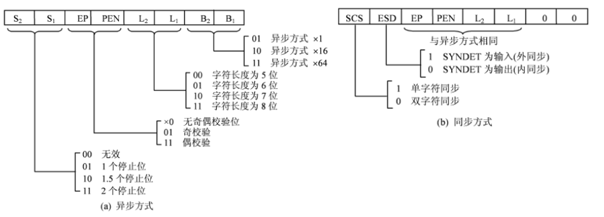</center>

其中异步方式的`x1, x16, x64`表示的是波特率系数，这是一个人为定义的概念，没有实际意义

实际传输过程中的$收发波特率=\frac{收发时钟频率}{波特率系数}$


初始化前需要先复位，复位字为`0100 0000B = 40H`，在写入控制字，然后再写入命令字`0001 0101B`，具体看ppt


## 11 可编程计数器/定时器8253/8254

### 11.1 8253的结构和作用

<center>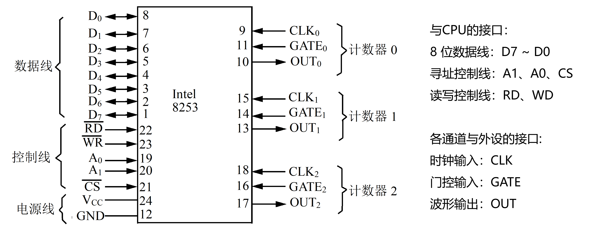</center>

有三个独立而相同的通道，每个通道都有

* `8bit`控制字寄存器
* `16bit`计数初值寄存器，说明计数有上限，超过需要外层循环；**定时时间=时钟周期*计数初值**
* `16bit`计数执行部件，是一个减法计数器，从初值开始`-1`循环
* `16bit`输出锁存器，必要时从这里读出计数的瞬时值

三个`16bit`的寄存器都可以当成两个`8bit`的寄存器用

`A1A0`连接CPU的`A1A0`时，是`8bit`CPU；`A2A1`，则是`16bit`CPU

地址对应如下

<center>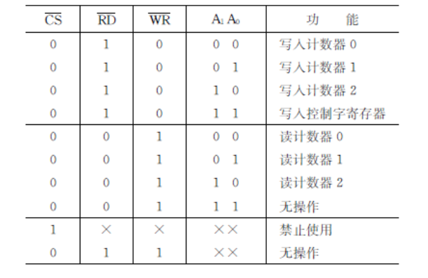</center>


**控制字寄存器**

每个位的作用如下

<center>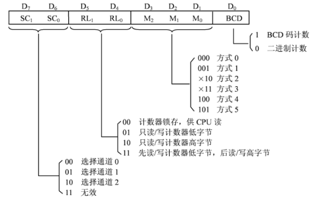</center>

注意`D5D4=11`时的读/写顺序是先低后高

当工作于二进制计数时，`n=0000 - FFFF H`，其中`0000`代表`n=65536`

当工作于BCD码计数时，`n=0000 - 9999 D`，其中`0000`代表`n=10000`


### <font color=red>11.2 8253的工作方式</font>

一共有6种方式，但是`-1`操作一定是在**CLK的下降沿**进行的


**方式0**：计数结束产生中断信号

* 向计数通道写入初值n，`OUT=0`

* 只用`GATE=1`时才计数，`-1`；`GATE=0`，不会重新计数；计数一次有效，需要手动再装载

* 只有在n**写入1个CLK之后**才开始`-1`，在写入后**第`n+1`CLK减为0**

  `OUT`产生一个正的跳变，作为中断信号输出到别的芯片

<center>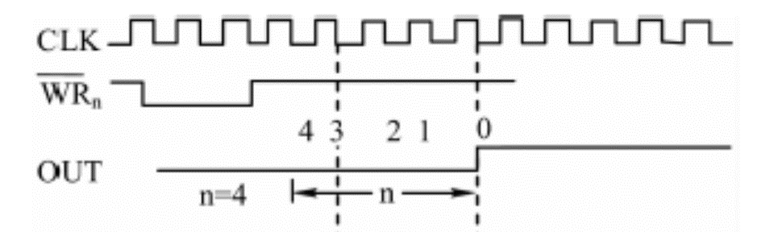</center>


<font color=red>**方式1**</font>：可编程单稳定输出

* 写入初值n
* `GATE`产生**上升沿**，才**启动**计数，**之后不需要**`GATE`信号；计数一次有效
* 当开始计数时，`OUT=0`，在`n=0`时恢复，产生1一个$t=nT_c$的负脉冲信号

<center>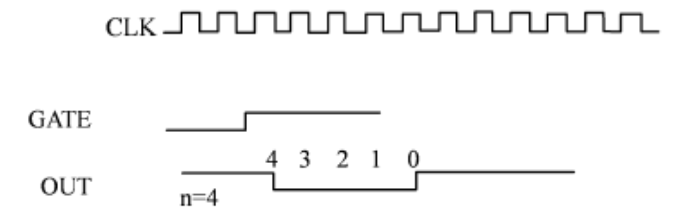</center>


**方式2**：比率发生器

* 写入初值n
* `GATE=1`时开始计数，**当`n=1`时**`OUT`输出1个$T_c$的负脉冲，然后自动装入n（初值），重新计数
* 即每隔$nT_c$产生一个负脉冲
* 如果在计数过程中装入新的n，那么**下次计数**按新的来
* 在计数过程中`GATE`变为0，则在下次`GATE=1`时**重新开始**计数

<center>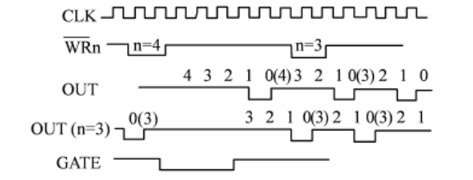</center>

**注意，这是特别的，当n=1时的输出**


<font color=red>**方式3**</font>：方波发生器（分频）

* 输入初值n，`GATE=1`按下面方式计数

* 若n为**偶数**，每次计数`-2`，减到0时`OUT=0`；n回到初值，每次`-2`，减到0时`OUT=1`

  循环上面过程，产生占空比=0.5，周期=$nT_c$的方波

* 若n为**奇数**，`-1`，然后每次`-2`，减到0时`OUT=0`；n回到初值，`-3`，然后每次`-2`，减到0时`OUT=1`

  循环上面过程，产生不对称的方波，周期=$nT_c$的方波

* 计数过程中`GATE=0`，停止计数，当`GATE=1`时**从头开始计数**

<center>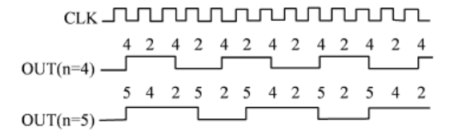</center>


**方式4**：软件触发选通

* 输入初值n，当`GATE=1`时（不必是上升沿）**直接开始**计数，减到0时输出$T=T_c$的**单个**负脉冲
* n一次有效，想要继续必须再次输入
* 计数过程中`GATE=0`，**恢复后从头开始**

方式4不需要`GATE`信号


<font color=red>**方式5**</font>：硬件触发选通

* 输入初值n，**`GATE`上升沿开始计数**，之后不需要，减到0时输出$T=T_c$的**单个**负脉冲
* n一次有效，想要继续必须再次输入
* n个CLK后产生一个1CLK的负脉冲
* 计数过程中`GATE=0`，**恢复后从头开始**

方式4、5是类似的，但是方式5需要一个硬件的`GATE`**上升沿**信号

<center>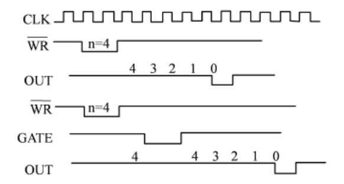</center>


**共同点**

* 除了方式0外，其他的方式`OUT`初始输出为1
* 除了方式4外，其他在`GATE=1`或其上升沿下才能/触发计数


<font color=red>例：</font>8086系统中，8253基地址为`310H`，时钟频率`1MHz`，让三个通道实现下面的功能

* 通道0，方式3，输出2kHz方波
* 通道1，产生宽度为480us的单脉冲
* 通道2，硬件触发，输出单脉冲，时间常数为26

解：基地址为`310H = 0011 0001 0000B`，`A2A1`接入芯片的`A1A0`，使用部分译码和74LS138作为译码器

​		三个时钟口共用一个时钟信号，得到的硬件连接如下

<center>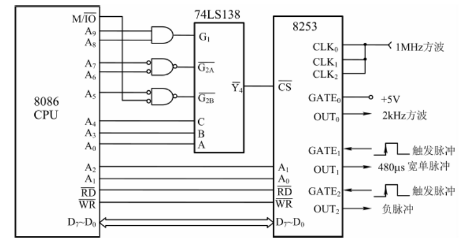</center>

还需要写软件

通道0需要的稳定的方波，使用方式3，而$1M \div 2k=500$，那么$n=500D=0500H$，后者使用BCD编码

控制字为`00 11 011 1`，控制字地址为`316H`，写入通道0，端口是`310H`

```assembly
mov al, 00110111B
out 316H, al		;写入控制字
mov al, 00H
out 310H, al		;写入低位
mov al, 05H
out 310H, al		;写入高位
```

通道1产生指定长度的单脉宽，时钟周期$T_c=1\mu s$，一共480个时钟周期，选择方式1，$n=480D=0480H$

控制字为`01 11 001 1`，通道1地址为`312H`

```assembly
mov al, 01110011B
out 316H, al		;写入控制字
mov al, 80H
out 312H, al		;写入低位
mov al, 04H
out 312H, al		;写入高位
```

通道2产生单脉冲，且硬件触发，使用方式5，时间常数就是延迟，即$n=26D=0026H$

控制字为`10 01 101 1`，通道2地址为`314H`

```assembly
mov al, 10011011B
out 316H, al		;写入控制字
mov al, 26H
out 314H, al		;写入低位
```


## 12 可编程中断控制器

### <font color=blue>12.1 中断</font>

**作用**

* 使CPU和外设在部分时间并行工作，提高CPU效率
* 便于实时数据处理
* 便于发现故障和处理
* 调用中断例程，方便程序编写


**外部中断**

* 不可屏蔽中断（NMI），如I/O校验位错误，掉电等紧急事件，不受`IF=0`的影响
* 可屏蔽中断由8259A的`INT`引脚输出，连接到CPU的`INTR`，受`IF=0`的屏蔽


**中断优先级**

由高到低为

1. 除法错（`INT 0`），`INT N`（N号中断），`INTO`（溢出错误），都是内部中断
2. NMI
3. INTR
4. 单步中断`-t`


**中断嵌套**

当CPU正在处理中断时，有更高优先级的中断被挂起，CPU产生中断嵌套；深度没有限制，但是有堆栈的物理限制

<center>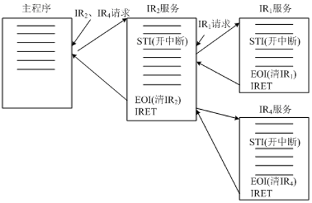</center>

**如何实现？**

1. 进入中断后硬件会自动关闭中断
2. 此时需要使用`STI`指令打开中断，才能嵌套
3. 中断结束时，用`EOI`指令结束中断，用`IRET`返回到上一级中断/原程序


### <font color=blue>12.2 8259A的结构和功能</font>

<center>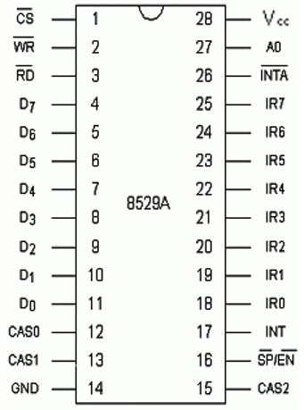</center>

* `IR7-IR0`：8级中断请求输入，优先级为`IR0 - IR7`，多片8259A级联时，从片的`INT`连接到`IRi`

* `INT`：高电平有效，连接到CPU的`INTR`

* `INTA`：中断响应应答输入，接收到CPU第二个`INTA`信号时将最高级别的中断请求码送出

* `A0`：决定IO地址

* `CAS2-CAS0`：级联信号引脚，主片输出，从片输入

* `SP/EN`：非缓冲下，主片为1，从片为0；缓冲模式，EN作为外部数据总线缓冲器的启动信号

  缓冲模式：多片时大部分工作于此，少部分可以非缓冲


8259A内部存在**4个8bit寄存器**，分别是

1. 中断请求寄存器（IRR），当外部`IRi`存在请求时，对应的位置为`1`，响应完为`0`，可以允许多个中断请求
2. 中断屏蔽寄存器（IMR），存放屏蔽信息，当对应位置为`1`时，不响应`IRi`
3. 中断服务寄存器（ISR），保存正在处理的中断，`IRi`被处理时，对应位置为`1`；多重中断时多个位置为`1`
4. 优先级判决器（PR，resolver），判断`IRi`的优先级，还会判断新的中断能否打断正在执行的中断


**由8259A引入的中断类型码**

一共8个8bit中断类型码，其中`D7-D3`由用户编程决定，`D2D1D0`由`IRi`决定


**8259A设置优先级的方式**

* 全嵌套方式
  * `IRi`具有固定的优先级，初始化后默认进入此方式
    * 中断响应后，ISR对应的bit置`1`，保持到终端结束，即使有嵌套，类型码N由DataBus送入CPU
  * CPU发出`EOI`指令，对应的ISR复位（置`0`）；也有自动中断命令`AEOI`，看芯片设置
  * 高级中断可以嵌套在低级中断中
* 特殊嵌套方式：允许同级中断嵌套


**中断屏蔽方式**

* 使用`CLI`指令屏蔽所有可屏蔽中断
* 开中断时，存在两种屏蔽方式
  * 普通屏蔽：将IMR中的对应位置`1`
  * 特殊屏蔽：仅屏蔽本级中断，其他不屏蔽，不允许同级嵌套


* 优先权管理
  1. 固定优先级：固定`IR0-IR7`的优先级
     1. 全嵌套方式：高级中断可以嵌套在低级中断中
     2. 特殊嵌套方式：允许同级嵌套
  2. 循环优先级：圆周循环，轮流处于最高优先级
     1. 自动循环方式：当前中断结束后自动变为最低，下一级变为最高，沿用了`IR0-IR7`的优先级排序
     2. 特殊循环方式：由编程决定优先级，也会循环
* 中断结束方式
  1. 自动中断结束（AEOI）：第二个中断响应周期下降沿，ISRi置0
  2. 正常中断结束（EOI）：CPU发出EOI指令，将ISRi置0
  3. 特殊中断结束（SEOI）：CPU发送指定的ISRi置0
  4. 一般中断结束（SEOI）：8259A自动选择ISRi置0


### 12.3 编程控制：初始化命令字

初始化命令字是`ICW1-ICW4`，对8259A初始化，其中`ICW3`只在级联时使用

8259A一共有两个端口，根据`A0`的不同分为奇偶地址口，分别是**`21H/20H`（在XT机中）**


**ICW1**

<center>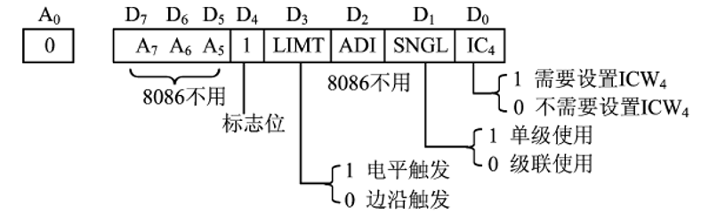</center>


**ICW2**

**紧跟`ICW1`写入**，但是是奇地址

<center>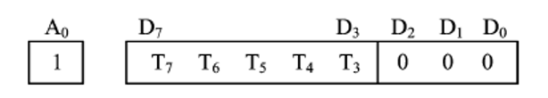</center>

其中

* `T7-T3`用于确定中断类型码的`D7-D3`，如前文所述
* `T2-T0=000`，由`IRi`决定


**ICW3**

`A0=1`，只在级联时使用，主片从片的格式不同，要和硬件搭配

<center>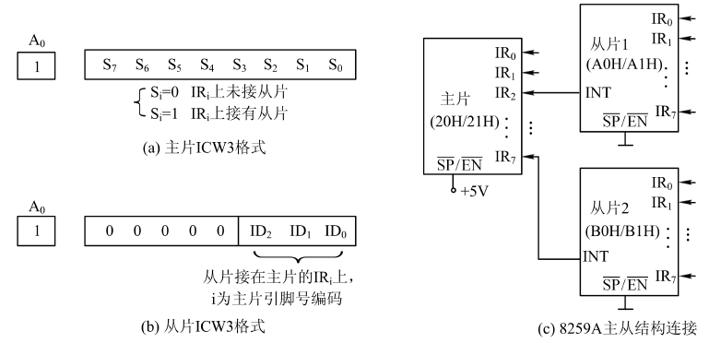</center>

注意主/从片的`SP/EN`接法


**ICW4**

8086CPU必须设置，`A0=1`；无`ICW3`时紧跟`ICW2`，有就跟3

<center>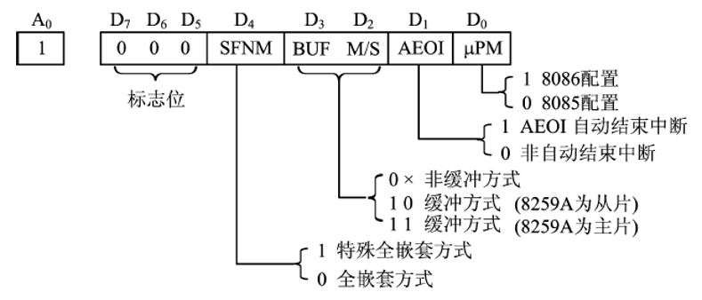</center>


### 12.4 编程控制：操作命令字

没有规定写入顺序，但是写入端口有规定

`OCW1`写入奇地址，`OCW2,OCW3`写入偶地址


**OCW1**

也称中断屏蔽字，直接对IMR的各位进行操作

<center>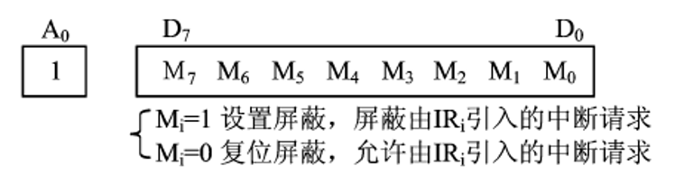</center>

如果是**直接更改**

```assembly
mov al, 11111101B
out 21H, al
```

如果是**新增**

```assembly
in al, 21H
and al, 11111101B
out 21H, al
```


**OCW2**

设置优先级循环方式和中断结束方式

<center>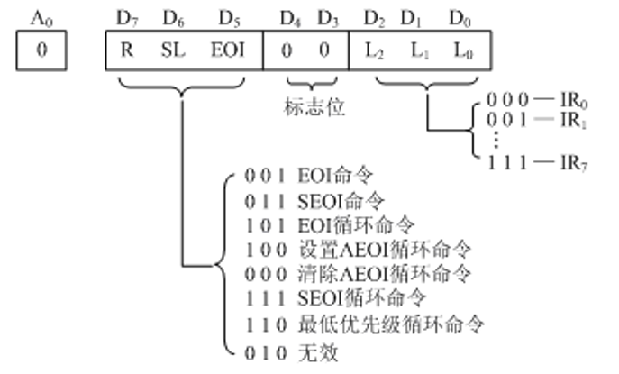</center>


**OCW3**

<center>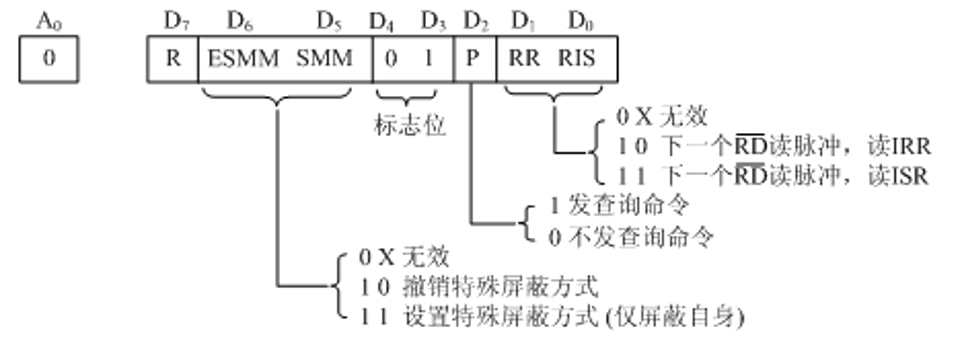</center>


## 13 AD/DA转换

### 13.1 数据采集和过程控制

**AD/DA**: Analog Digital Converter

<center>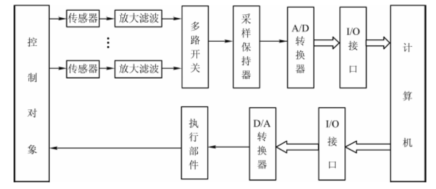</center>


**模拟量输入通路**

* 传感器：换能
* 放大器：高输入阻抗
* 滤波器
* 多路模拟开关：切换输入信号通路
* 采样保持器：信号比较平缓的可以直接加到ADC；变化快的需要使用保持器


### 13.2 采样、量化和编码

**采样**：不赘述


**量化**：采集下来的电压瞬时值用数字表示，只能达到一定的精度，用分辨率表示

量化单位q就是电压的分辨率，而分辨率n用编码的比特数n表示

即一个电压5V使用8bit编码，那么$q = 5/2^8 = 19$mV，分辨率为8

由于q在数值上等于仅LSB的值，即000...001  = q，故q也称1LSB


**编码**：用二进制代码的形式表示数字量，有很多方式，常用自然二进制码

**自然二进制码**：输入量是满量程（FSR，full-scale range）的百分数，用二进制表示这个小数

故从MSB开始，分别是$2^{-1}, 2^{-2},...,2^{-n}$，无法表示小数点


### 13.3 D/A转换器

将输入的数字量转换为与其成比例的模拟信号的器件，大多数变成模拟电流，当然用运放就能转换成电压


**权电阻网络D/A转换器**

<center>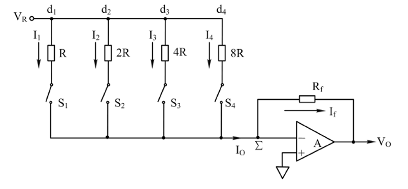</center>

使用加权的电阻并联，每一个开关表示这个位置编码的`0/1`（当然实际上是半导体元件，不需要真的开关）

最终用输出电流$I_o$作为模拟电流，接上运放后$V_o = -\frac{R_f}{R}V_{in}$，其中$V_{R}$是最大值，$R_f$等于所有权电阻并联的阻值


这个网络输出的模拟信号会存在很多台阶，当D/A的位数变多，台阶的高度差变小，输出与真实信号更接近


**主要性能指标**

* 分辨率：输入数据发生1LSB变化时输出模拟量的变化，显然$\Delta = \frac{FSR}{2^{n}}$，所以用n表示分辨率也行
* 精度：$Accuracy = \frac{Error}{FSR}$，一般不能大于0.5LSB
* 建立时间：从数字量输入到建立稳定输入的时间差


<font color=red>例：</font>假定一个0.5V-2.5V的三角波被FSR=5V的8bitDA输出，写一个输出代码

解：首先需要看输出范围，0.5/0.019=26=1Ah，2.5 /0.019=128=80h，那么代码如下

```assembly
Begin:	mov al, 1Ah		;下限值

Up:		out 80h, al		;假设输出口为80h
		inc al
		cmp al, 80h		;al<80h?
		jnz Up			;没到上限就接着上
		dec al			;超了就-1，开始下降

Down:	out 80h, al
		dec al
		cmp al, 1Ah
		jnz Down
		Jmp Begin
```


### 13.4 A/D转换器

原理有很多，这里只需要考虑逐次逼近式A/D转换器，因为它速度快，分辨率高，成本低

逐次逼近的原理就是从MSB到LSB的二分法，低于输入就要，超了就不要


**逐次逼近A/D转换器**

* 由逐次逼近寄存器SAR，D/A转换器，比较器，缓冲器等组成
* SAR含有位移寄存器，数据寄存器和去/留码的逻辑电路

需要在CLK下使用

<center>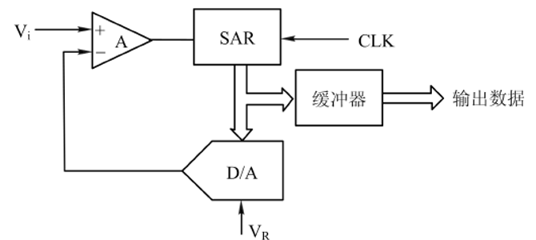</center>

其中$V_i$是模拟信号输入，D/A每次将编码后的数字信号转换为模拟电压，在放大器上比较

放大器输出`1`，那么这个码就留下，即这位的数字码编码为`1`

每一位码的去留，需要8个时钟周期


ADC的指标同DAC，不赘述


## 14 总线技术和DMA控制器

### 14.1 总线概述

**分类**

* 根据传输类型：数据/地址/控制，电源总线
* 根据在位置：片内/间，内/外总线
* 根据传输方式：串行总线，并行总线


<font color=orange>**总线数据传输的四个步骤**</font>

1. 申请（Arbitration）：多个主模块提交申请，仲裁机构确定授权给谁
2. 寻址（Addressing）
3. 传输（Data Transferring）：主从模块之间进行数据传输
4. 结束（Ending）：主从模块的有关信息撤出总线，让给下一个模块


### 14.2 总线的性能指标

**总线频率**：总线每秒能传输数据的次数，和时钟频率区分

**总线宽度**：20bit等

**总线带宽**：总线最大数据传输速率，单位MB/s

* 并行总线的带宽：总线宽度 / 8 * 总线频率；但是宽度越大，总线之间的干扰越严重，故不会很大
* 串行总线的带宽：用高频率取得高带宽，用多条管线增加效率；带宽 = 总线频率 * 管线数 / 8

**同步方式**：

* 同步：总线上主从模块依次传输时间固定，用时钟统一，速度快
* 异步：应答式传输，灵活，适应性高，但是带宽小

**总线复用**：分时复用，如8086的`AD0-AD15`

**信号线数**：所有总线的数目之和，与性能无关

**寻址能力**：$2^{宽度}$

**定时协议**：同步/异步等同步手段


### <font color=green>14.3 代表性总线</font>

* PC总线，第一台IBM PC机的总线，共62根信号线，用于PC/XT机；数据线8bit

* ISA，Industry Standard Architecture，工业标准体系结构，一种总线标准，总线频率8MHz

  用于8086的PC/AT机和386/486机，共98根信号线；数据线16bit，地址线24bit，中断15bit，DMA通道8bit

* PCI，Peripheral Component Interconnect，周边部件互连，总线频率为33.3/66.6MHz；数据线32bit；在ISA总线和CPU之间，形成独特的中间缓冲隔绝，高速外设可以直接接在PCI总线上；速度快，局部总线

* PCI-E，Express，升级的高速总线

* USB，Universal Serial Bus，通用串行总线，外部总线


<font color=red>**USB总线的数据传输**</font>

传输的是`D+, D-`上的差动信号，幅度3.3V；将`0/1`信号定义为：电压跳变/电压保持

这样的定义称为不归零反转编码NRZI（Non-Return-to-Zero Inverted Code）

但是这样有一个问题：当一长串的`1`输入时双方会丢失同步，使用为填充在连续的6个`1`后添加`0`；接收方采用同一套标准，会自动丢弃这个`0`

<center>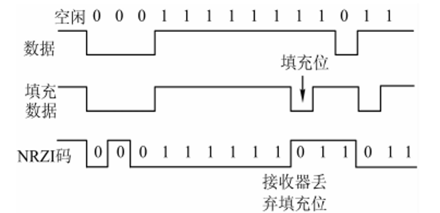</center>


### 14.4 DMA控制器

在10.1节提到过，Direct Memory Access

<font color=green>**基本功能**</font>

* 控制数据传输
  1. 向CPU的`HOLD`引脚发出DMA请求信号
  2. CPU响应后，DMAC（Controller）获得总线控制权，控制数据的传输，CPU停止工作
  3. 传送完，发送DMA结束信号`EOP`
* 提供读/写MEM/IO的各种命令
* 确定数据传输的起始地址、目的地和长度，每传送一个数据就修改地址，长度-1


**8237A**

具有4个具有优先级的、64K地址和字节计数能力的DMA通道，每个通道的请求可以接受/拒绝

有两种工作状态

* 从态：开始DMA传输前，是系统总线的从属
* 主态：控制总线的数据传输


每个通道有4种传送方式，分别是

* 单字节传送：每次只传送1B数据
* 块数据传送：连续传输一批数据
* 请求传送：连续传输，每传送1B后都要测试DREQ，若无效则马上停止
* 级联传送：连接多个8237A扩充DMA通道

任一通道完成数据传输后，会产生`EOP`信号，结束传输；也可由外界产生引入

**自动预置**：该通道完成一次 DMA 传送，出现 EOP信号后，又能自动恢复有关寄存器的初值，继续执行另一次 DMA 传送


## 15 补充

神人sgf的迷惑出题


### 15.1 求整数平方根

数学原理是$n^2 = \sum_{i=0}^{n-1} 2i+1$，那么用$\sum 2i+1$和$n^2$比大小，正好相等时的$i=n-1$，代码如下

```assembly
SQRT PROC NEAR
	push ax
	push bx
	push cx
	
	mov ax, si		;取n2
	sub cx, cx		;cx=0,同时让FLAGS置零
again:
	mov bx, cx		;bx=i
	add bx, bx
	inc bx			;bx=2i+1
	sub ax, bx		
	jc over			;存在借位，说明ax<bx，就结束
	inc cx
	jmp again		;ax>bx就继续
over:			
	mov si, cx
	pop cx
	pop bx
	pop ax
	ret
SQRT ENDP
```


### 15.2 冒泡排序

算法就是一次次冒泡，一共n个数，就有n-1+n-2+...+1次交换，也就是两层循环，外层n-1次，内层n-i次（从1开始），代码如下

```assembly
start:
	mov ax, data		;存放要排的数据
	mov ds, ax
	mov cx, n-1			;n个数排序
LP1:
	mov di, cx			;di就是j,j=n-i
	mov bx, 0			;寻址用
LP2:
	mov al, table[bx]
	cmp al, table[bx+1]	;两个数比较
	jge	next			;这里的排序方法是从大到小，所以是ge
	xchg al, table[bx+1]	;不是就交换两个数，这个是交换的代码
	mov table[bx], al
next:
	inc bx				;下一对数据
	dec di				;内层循环-1
	jnz LP2
	loop LP1			;外层循环-1
```


### 15.3 小tips

* `in, out`指令只能用`ax, al`存放读/写的数据，16bit用`ax`，8bit用`al`
* USART: Universal Synchronous/Asynchronous Receiver/Transmitter 通用同步/异步数据收发器
* 在8251A异步初始化中，需要多次向端口写0，详见复习ppt第60页
* 异步串行通讯的数据规格：起始位1b；数据位5-8b，D0在先；奇偶校验位1b；停止位1/1.5/2b
* 8253的方式1，方式3，方式5比较重要
* <font color=red>**DOS系统的启动**</font>
* 冷启动是从完全断电状态开始，电源上电后产生复位信号，BIOS执行POST（Power On Self Test）进行全面硬件检测和初始化，并加载引导程序启动操作系统内核。热启动是在计算机已开启状态下，通过特定按键组合或系统选项触发，发送复位信号使CPU等硬件复位，但不重新上电，BIOS仅对部分硬件简单检测，操作系统关闭程序后重新加载内核并尝试恢复用户环境，速度比冷启动快。
* 冷启动：电源重新打开，整个系统初始化
  
  1. 清理内存
  
  2. 检查内存
  
  3. `CS = FFFFH`
  
  4. `IP = 0000H`，3/4一起将指令指向了BIOS
  
  5. BIOS检查端口，识别和初始化设备
  
    6. BIOS 建立两个数据区：从`0000H`开始的中断向量区；BIOS数据区
  
    7. BIOS 加载系统文件
* 热启动：跳过自检，不会清空内存
  
  * 复位启动reset：复位，见8.2节RESET引脚
* 程序段前缀（PSP，Program Segment Prefix）
  * 加载子程序时在程序占用的内存前256个Byte中，含有程序返回，文件名等信息
  * PSP的地址默认作为`DS, ES`的值，故不加指定，则`CS = DS +10H`（`256D = 100H`）
* `TEST`指令，改变`SF/ZF/PF`，`OF = CF = 0`
  * `TEST reg1/opr1, reg2/opr2`，按位进行与操作，只改变`FLAGS`不改变操作数
  * 当两个都是0时，结果是0
* `INT 21H`
  * 2号功能
    * 字符显示功能，功能号存在`MOV ah, 02H`中；输入`MOV dl, char`，是字符的ASCII码
  * 9号功能
    * 字符串显示功能，`MOV ah, 09H`，`DS:DX`指向一个以`$`结尾的字符串，显示这个字符串
  * 0A号功能
    * 键盘输入存放到缓冲区（包括回车，回车是输入结束标志），`MOV ah, 0AH`，`DS:DX`指向缓冲区
    * 缓冲区第一个字节是用户预先定义的缓冲区大小（1-255），第二个字节是DOS系统写的读取的字符数
* 显示数字的那个实验题，《微机原理实验》的10.3节
* 传统总线结构，见复习ppt第67页
* `PUSHA`指令，依次压入`AX, CX, DX, BX, SP, BP, SI, DI`，然后`SP -= 16`；`POPA`返回所有
* 压缩的BCD码：用4bit binary表示1bit decimal；非压缩：用8bit binary，其中高四位都是0
  
  * 数字的ASCII码是非压缩的BCD码：0 - 0011 0000 = 30H = 48D；9 - 0011 1001
* 中断和DMA比较
  * 中断：在CPU执行完一条指令后响应；通过中断服务程序（保护和恢复寄存器）；可由软/硬件引起
  * DMA：在CPU执行完一个总线周期后响应；传送1B只需要1~2个总线周期；可有软/硬件引起
* 无论是`jmp dword ptr`，`call far ptr`，在保存或设置`CS:IP`时，都是`IP`的地址更低，在机器码中也是`IP`编译得更低
* `XLAT`指令将`ds:[bx+al]`地址的内容存放到`al`寄存器中，一般而言`bx`是某个表的偏移地址，`al`原始值则是需要的值在表中的偏移，在使用直接定址表时比较方便（我在努力帮神人sgf说话了，学这指令干嘛？）
* `REPZ/E, REPNZ/E`和`REP`类似，但是多一个检查`ZF`的状态，前者在相等时继续，后者在不等时继续，搭配`CMPSB/W`（对比`es:[di]`和`ds:[si]`的字节/字）和`SCASB/W`（查找`al/ax`，从内存地址`es:[di]`开始）

