# 自动控制原理

## 1 绪论

### 1.1 一些定义

**被控变量**：一种被测量和被控制的量值或状态，系统输出量

**操作变量**：一种由控制器改变的量值或状态

**扰动**：一种对系统的输出量产生不利影响的信号；分为**内部**和**外部**扰动，外部扰动是系统的**输入量**

**给定量**：系统输入量，也叫参考量

**反馈**：输出量返回输入端，与参考量比较

**反馈控制**：**检测**输出量与参考量的**偏差**，再**纠正**

**前馈控制**：根据扰动作用的大小或给定值变化进行控制；**扰动产生后、被控变量变化前**进行的控制

### 1.2 控制系统分类

按信号传递方向：反馈控制和前馈控制

按系统构成：开环控制，闭环控制，半闭环控制

#### 1.2.1 **闭环控制**

输出和输入之间存在**反馈**，可以**减小偏差**

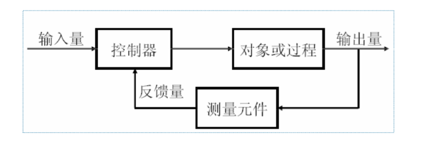

优点：精度高，对外部扰动和系统参数变化不敏感

缺点：存在**稳定、振荡、超调**等问题

#### 1.2.2 **开环控制**

只有当输出量与输入量关系已知，且**不存在扰动**时，才能用

优点：简单，稳定可靠；精密制造的元件可以保证一定控制精度

缺点：精度低，无自动纠偏能力

## 2 控制系统的数学模型

建立方法：

1. 解析法。依据数理规律建立准确模型
2. 实验法。把系统当黑箱，也称系统辨识

### 2.1 数学模型的分类

线性/非线性，分布性/集总性（能否用有限原件描述），参数时变性

只考虑线性时不变集总模型，用线性常微分方程描述

方程的输出阶次**大于**输入阶次，否则会有**不因果**

### 2.2 传递函数和脉冲响应

在**全部初始条件为0**的假设下，传递函数$H(s)=\frac{Y(s)}{X(s)}$

称$X(s)=0$为**系统的特征方程**，$X(s)$的最高阶次为系统的阶次

s=0时，$H(0)$的值是**系统的放大系数/增益**，表示系统处于静态时输出与输入之比

这里有必要说明：$X(s)=0$指的就是传递函数的极点，这种表述在定义上不准确，但是在数学上是等价的

说明：

1. H(s)仅取决于系统，与输入无关
2. H(s)**不提供**系统的**物理结构的信息**
3. 当H(s)已知时，系统的**动态特性被充分的描述**
4. h(t)称为系统的**权函数**，是初始条件全部为零时得到的
5. 当系统的时间常数较大时，很短的脉动信号可以视为脉冲信号

### 2.3 自动控制系统

#### 2.3.1 **方框图**

各个元件的功能和信号回流的图解表示，表示各种元件之间的互相关系

**闭环系统框图**

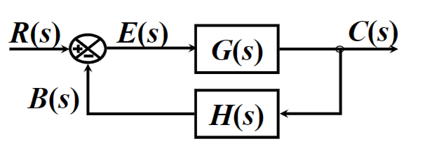

定义：$开环传递函数=\frac{反馈信号}{误差信号} , 前向传递函数=\frac{输出量}{误差信号}$

有$开环传递函数=\frac{B(s)}{E(s)}=\frac{E(s)G(s)H(s)}{E(s)}=G(s)H(s)，前向传递函数=\frac{C(s)}{E(s)}=\frac{E(s)G(s)}{E(s)}=G(s)$

$闭环传递函数=\frac{输出量}{出入量}=\frac{C(s)}{R(s)}=\frac{G(s)}{1+G(s)H(s)}$

#### 2.3.2 **扰动下的闭环系统**

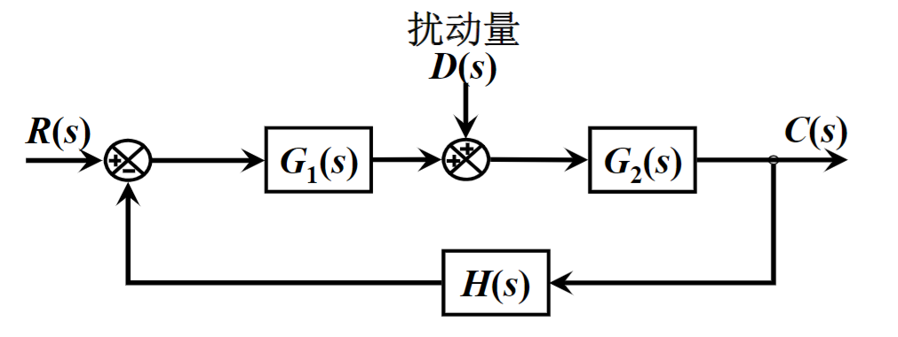

扰动也是输入量，由于是LTI系统，可以将R(s)与D(s)单独作用后叠加

扰动的闭环传递函数=$\frac{G_2}{1+G_2\cdot G_1H}$，可以将扰动视为以G2为增益，以HG1为反馈的系统

激励的闭环传递函数=$\frac{G_1G_2}{1+G_1G_2\cdot H}$

系统的闭环传递函数为二者相加，在$|G_1G_2H|>>1$时，扰动的干扰很小

#### 2.3.3 **自动控制器**

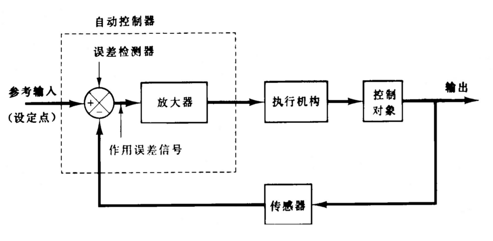

### 2.4 工业控制器分类

#### 2.4.1 双位/开关控制

$$
u(t)=\begin{cases}
U_1,\,\, e(t)>0\\
U_2,\,\, e(t)<0\\
\end{cases}
$$
其中e(t)为误差

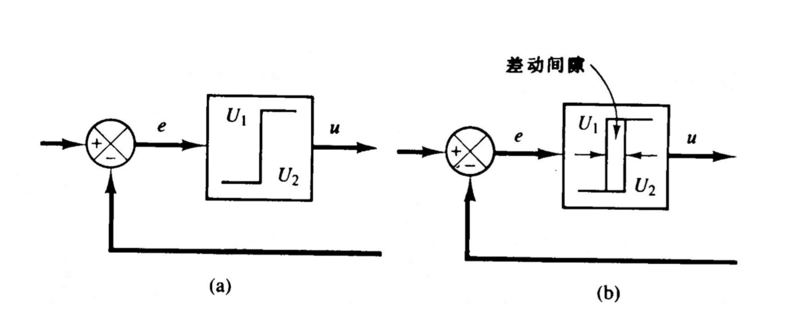

#### 2.4.2 **比例控制**

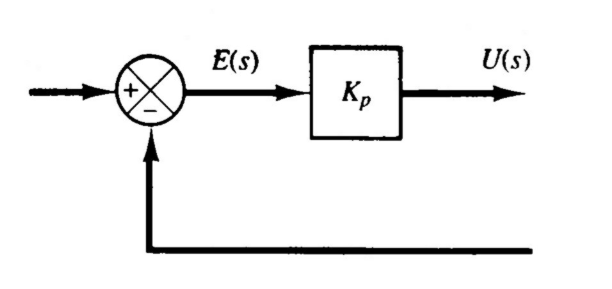

$$
u(t)=K_pe(t)
$$

比例增益为$\frac{U(s)}{E(s)}=K_p$

#### 2.4.3 **积分控制**

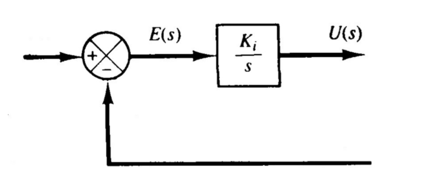

$$
u(t)=K_i\int_0^t e(a)da
$$

积分增益为$\frac{U(s)}{E(s)}=\frac{K_i}{s}$

#### 2.4.4 **比例积分控制**

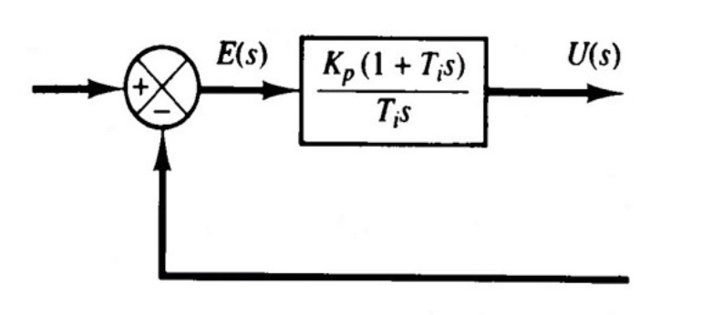

$$
u(t)=K_pe(t)+\frac{K_p}{T_i}\int_0^te(a)da
$$

其中$T_i$为积分时间常数，PI增益为$\frac{U(s)}{E(s)}=K_p(1+\frac{1}{T_is})$

#### 2.4.5 **比例微分控制**

由于微分的非因果性，PD控制一定程度上可以预测误差

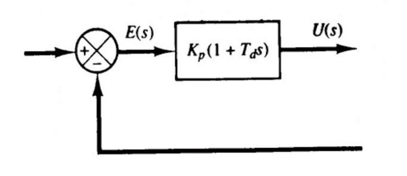

$$
u(t)=K_pe(t)+K_pT_d\frac{de(t)}{dt}
$$

其中$T_d$为微分时间常数，PD增益为$\frac{U(s)}{E(s)}=K_p(1+T_ds)$

#### 2.4.6 **比例积分微分控制**

比较难调

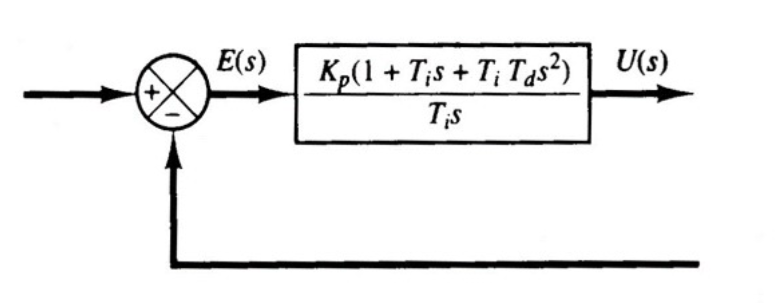

$$
u(t)=K_pe(t)+\frac{K_p}{T_i}\int_0^t e(a)da+K_pT_d\frac{de(t)}{dt}
$$

PID增益为$\frac{U(s)}{E(s)}=K_p(1+\frac{1}{T_is}+T_ds)$

### 2.5 方框图的简化

**原则**

1. 前向通路中传递函数的乘积不变
2. 反馈回路中传递函数的乘积不变

#### 2.5.1 代数法则简化

利用传递函数在频域的代数法则进行化简

例：化简并求总体传递函数C/R

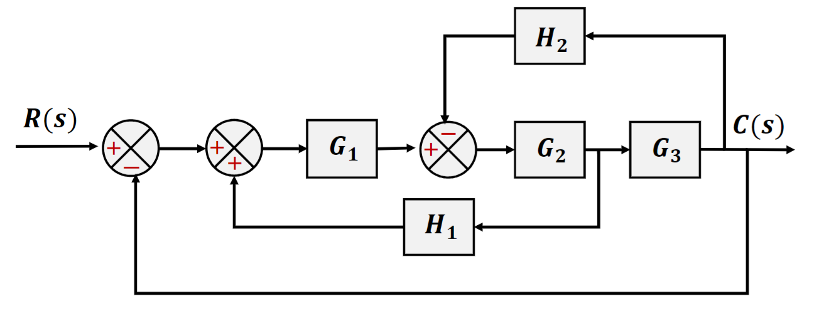

有兴趣就画吧，这种方法比较麻烦，结果是$\frac{G_1G_2G_3}{1-G_1G_2H_1+G_2G_3H_2+G_1G_2G_3}$

#### 2.5.2 代数法求传递函数

将中间变量用输入量表示，比较麻烦

例：化简并求总体传递函数

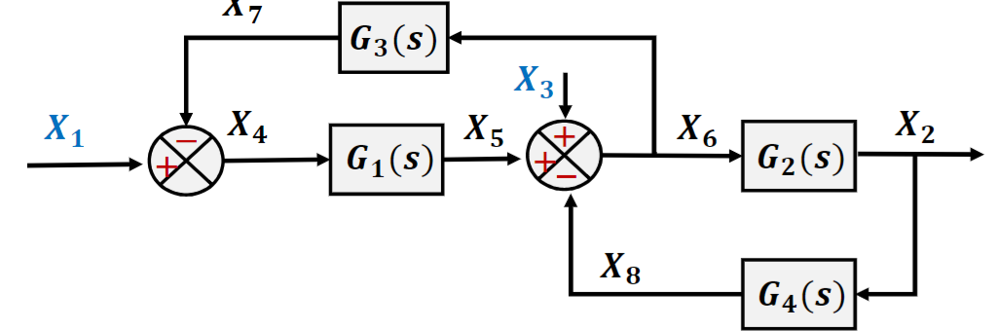

结果是$X_2=\frac{G_1G_2}{1+G_1G_3+G_2G_4}X_1+\frac{G_2}{1+G_1G_3+G_2G_4}X_3$

#### 2.5.3 梅逊公式

当方框图有多个前向通路，且存在不接触的回路时，系统的总体传递函数C/R有
$$
\frac{C}{R}=\frac{1}{\Delta}\sum\limits_{k=1}^n {P_k\Delta_k}
$$
其中$\Delta =1-\sum L_{(1)}+\sum L_{(2)}+\ldots+(-1)^m\sum L_{(m)}$

$\sum L_{(1)}$是所有不同**回路**的传递函数之和（正负反馈的符号要注意）

$\sum L_{(2)}$是两两不接触的回路传递函数**乘积**之和，依次类推

$P_k$是第k条前向通路

$\Delta_k$是第k条前向通路的余因子，由$\Delta$将所有**与这条通路接触的回路**置零得到

对余因子的理解：重点在“余”，也就是必须包含前向通路没有的信息，舍弃**所有**已知信息，那么无论$L_{(i)}$，只要其中一个回路接触了这个通路，就令$L_{(i)}=0$

例子可以拿前面两个练手，下面也给一个

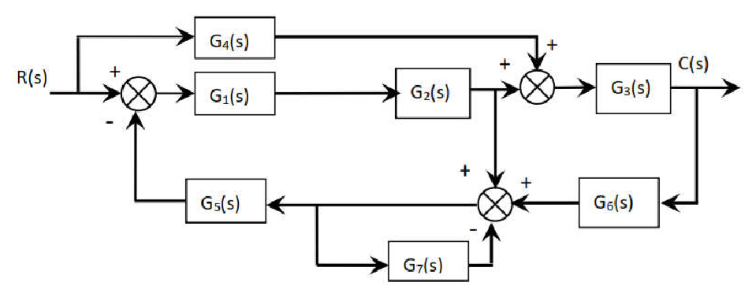

P1=G1G2G3, P2=G4G3

L1=-G1G2G5, L2=-G1G2G3G6G5, L3=-G7

为什么G3G5不是？因为箭头不构成回路; 为什么G4G3G6G5不是？因为G5不能回到G4

L(1)=L1+L2+L3, L(2)=0，都是有接触的

Δ=1-L(1), Δ1=1+G7, Δ2=1+G1G2G5+G7

C/R=(P1Δ1+P2Δ2)/Δ

另一个例子：

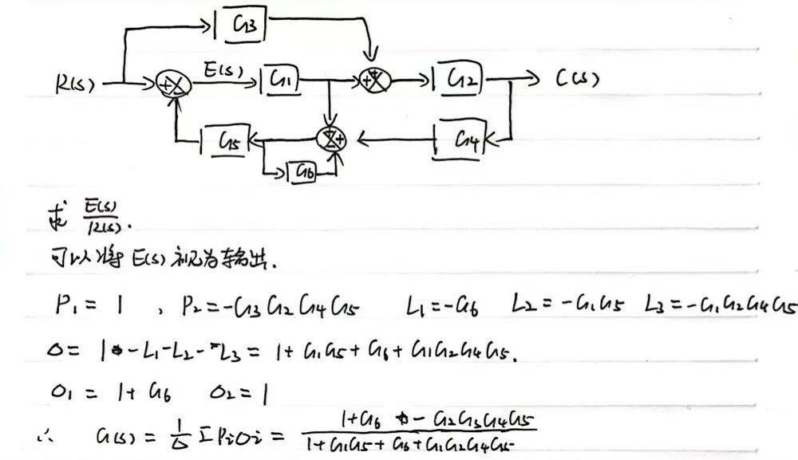

### 2.6 状态空间模型

多输入多输出模型，无论线性和时变性，任何系统都行，能在时域和频域建模

#### 2.6.1 基本概念

**状态**：一组最小变量，能确定系统

**状态变量**：确定动态系统的状态

**状态向量**：将状态变量写成向量形式

**状态空间**：状态向量组成的空间

对于连续时间控制系统，**积分器**是记忆元件，其数目**等于**状态变量数目

#### 2.6.2 状态空间方程

设系统的状态变量是$x_i$，输入量是$u_i$，输出量是$y_i$

有$x(t)=[x_1(t),x_2(t),\ldots,x_n(t)]^\top$，y(t),u(t)同理，组成向量，得到方程
$$
\dot{x}(t)=f(x,u,t);y(t)=g(x,u,t)
$$
这是矩阵运算，对方程线性化为状态方程和输出方程
$$
\dot{x}(t)=A(t)x(t)+B(t)u(t)\,\,\,\,\,\,\,y(t)=C(t)x(t)+D(t)u(t)
$$

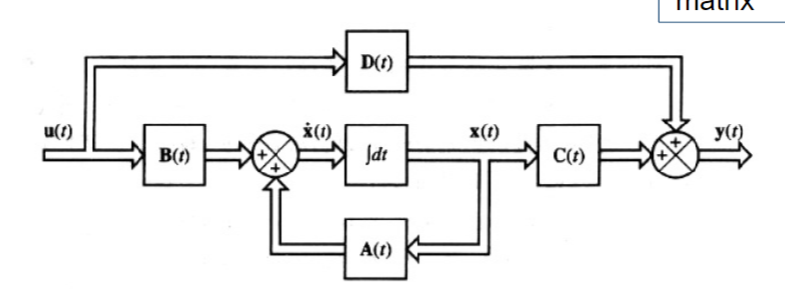

例：已知系统方程为$m\ddot{y}+B\dot{y}+Ky=u$，求状态方程

解：有二阶导，显然需要2次积分，故状态变量为2个，令$x_1=y,x_2=\dot{y}$，因为还要求导，所以这么设

​		则有$\dot{x_1}=\dot{y}=x_2,\dot{x_2}=\ddot{y}=-\frac{K}{m}x_1-\frac{B}{m}x_2+\frac{1}{m}u,y=x_1$

​		得到$A=\left(\begin{matrix} 0 & 1\\ -\frac{K}{m} & -\frac{B}{m}  \end{matrix}\right),B=\left(\begin{matrix} 0 \\ \frac{1}{m} \end{matrix}\right),C=\left(\begin{matrix} 1 & 0\end{matrix}\right),D=0$

#### 2.6.3 传递函数和状态空间方程的关系

对状态空间方程进行拉氏变换，带入0状态，得到
$$
sX(s)=AX(s)+BU(s)\,\,\,\,\,\,\, Y(s)=CX(s)+DU(s)
$$
将X(s)用U(s)带入，得到
$$
Y(s)=\left(C(sI-A)^{-1}B+D\right)U(s)
$$
即传递矩阵为$C(sI-A)^{-1}B+D$

例：求状态空间表达式

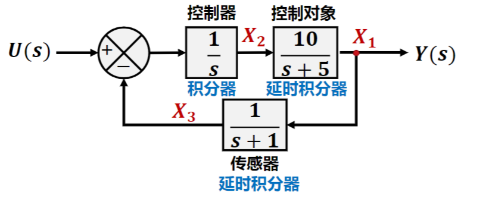

首先得到$Y=X_1=\frac{10}{s+5}X_2,X_3=\frac{1}{s+1}X_1,X_2=(U-X_3)/s$

由于复频域状态空间方程形式为$sX(s)=AX(s)+BU(s)$，将上面等式化为
$$
sX_1=-5X_1+10X_2, sX_2=U(s)-X_3, sX_3=X_1-X_3
$$
易得矩阵

## 3 瞬态响应和稳态响应分析

### 3.1 相关概念

在系统一段加入信号$r(t)$后，得到输出$c(t)$，将其分为$c(t)=c_t(t)+c_s(t)$，分别时瞬态和稳态响应

$c_t(t)$满足$\lim\limits_{t\rightarrow\infty}c_t(t)=0$

对线性系统而言，$r(t)$**只影响$c_s(t)$**，因为$c_t(t)$在无穷时刻恒为0

**稳定性**

**绝对**稳定性：指**系统**的稳定性，分为**稳定**，**临界稳定**，**不稳定**，分别表示稳定，周期振荡和不稳定的输出

**相对**稳定性：指在一个**裕度**内系统稳定，瞬态指标

**稳态误差**：达到稳态响应后，系统输出与预期值的误差，即$e_{ss}=\lim\limits_{s\rightarrow0}sE(s)=s\cdot(X-HY)=\frac{sX}{1+GH}$

### 3.2 一阶系统

讨论传递函数为$\frac{C}{R}=G(s)=\frac{1}{Ts+1}$的系统

#### 3.1.1 单位阶跃响应

$r(t)=u(t)\Rightarrow R(s)=\frac{1}{s}$，得到$c(t)=1-e^{-\frac{t}{T}}$，其中$c_t(t)=-e^{-\frac{t}{T}},c_s(t)=1$，误差$e(t)=e^{-\frac{t}{T}}$

稳态误差=0

在$t=4T$时，系统达到98.2%稳定值，此时认为系统稳定，4T为**响应时间**

#### 3.1.2 单位斜坡响应

$r(t)=tu(t)\Rightarrow R(s)=\frac{1}{s^2}$，得到$c(t)=t-T+Te^{-\frac{t}{T}}$，$e(t)=r(t)-c(t)=T(1-e^{-t/T})$

稳态误差=T，响应时间4T

#### 3.1.3 单位脉冲响应

$r(t)=\delta(t)\Rightarrow R(s)=1$，得到$c(t)=\frac{1}{T}e^{-\frac{t}{T}}$，$e(t)=r(t)-c(t)=\delta(t)-\frac{1}{T}e^{-\frac{t}{T}}$

稳态误差=0，响应时间4T

#### 3.1.4 LTI系统特征

其实就是能用卷积表达输出，最终得到$x^{(n)}*h=(x*h)^{(n)}=y^{(n)}$

### 3.3 二阶系统

讨论伺服系统（精确跟随或复现某个过程的反馈系统）

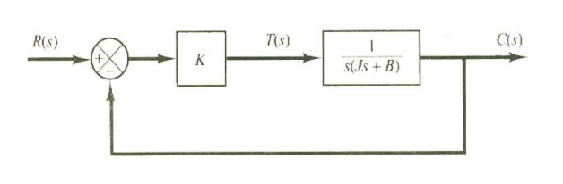

系统传递函数$G(s)=\frac{K}{Js^2+Bs+K}=\frac{K/J}{[s+\frac{B}{2J}+\sqrt{(\frac{B}{2J})^2-\frac{K}{J}}][s+\frac{B}{2J}-\sqrt{(\frac{B}{2J})^2-\frac{K}{J}}]}$

令$\frac{K}{J}=\omega_n^2,\frac{B}{J}=2\zeta\omega_n=2\sigma$，其中σ是衰减系数，$\omega_n$为无阻尼自然频率，**$\zeta$是系统的阻尼比**

$\zeta=\frac{B}{B_c}$，其中$B,B_c$分别为实际阻尼、临界阻尼系数，$B_c$是$(\frac{B}{2J})^2-\frac{K}{J}=0$的解，故$\zeta=\frac{B}{2\sqrt{JK}}$

传递函数可以改写为$G(s)=\frac{\omega_n^2}{s^2+2\zeta\omega_ns+\omega_n^2}$，极点为$s_{1,2}=-\zeta\omega_n\pm j\omega_n\sqrt{1-\zeta^2}=-\sigma \pm j\omega_d$，$|s_{1,2}|=\omega_n$

记$\omega_d=\omega_n\sqrt{1-\zeta^2}$为阻尼自然频率，可观察到的总是$\omega_d$，总是小于$\omega_n$

对$\zeta$做以下讨论：

1. $0<\zeta<1$，**欠阻尼**，瞬态响应是振荡的
2. $\zeta=1$，**临界阻尼**，瞬态响应不振荡
3. $\zeta>1$，**过阻尼**，瞬态响应不振荡
4. $\zeta=0$，**无阻尼**，瞬态响应为正弦振荡（等幅）

**单位阶跃响应**

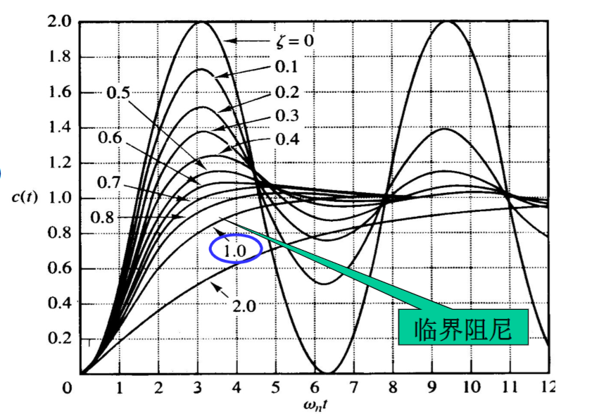

上图为不同阻尼比下的响应

在$\zeta>0$时，稳态误差总是0

在$\zeta=1$时，两个极点重合，$c(t)=1-e^{-\omega_nt}(1+\omega_nt)$

实际上，在两个极点**接近相等**时，系统也可以近似看为临界阻尼

在$\zeta>>1$时，$s_{1,2}=(-\zeta\pm \sqrt{\zeta^2-1})\omega_n$，在频率不大的情况下，$s_2$对系统的影响很小，可忽略（$e^{-\infty t}$，那么$t$对结果就没有影响）

$c(t)\approx 1-e^{(-\zeta+\sqrt{\zeta^2-1})\omega_nt}$

由上图可知，当$0.4<\zeta<0.8$时，其响应曲线比临界阻尼或过阻尼系统**更快**达到稳定值

且在无震荡系统中，临界阻尼有**最快响应特性**；而过阻尼系统对任何输入信号的响应都是**缓慢**的

### 3.4 瞬态响应指标

都是在0状态下的指标

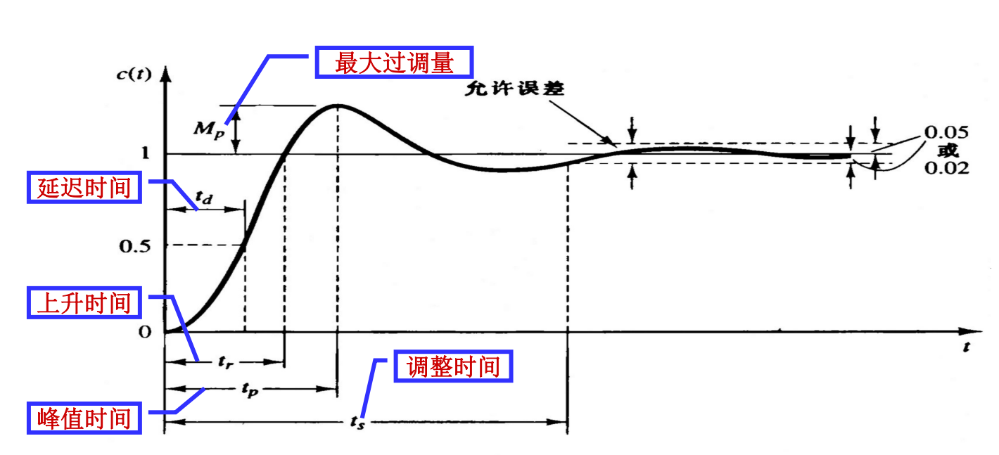

**延迟时间$t_d$**：第一次到达稳态值一半所需的时间

**上升时间$t_r$**：从稳态值的0%到100%所需要的时间

**峰值时间$t_p$**：到达**过调量**的第一个峰值所需的时间

**最大过调量$M_p$**：计算公式为$M_p=\frac{最大峰值-c(\infty)}{c(\infty)}\times100\%$，直接说明了系统的**相对稳定性**

**调整时间$t_s$**：用一个稳态值的百分比误差范围，曲线达到并**永远保持**在这个范围内所需的时间，与系统的最大时间常数有关（如一阶系统的4T）

很显然，最大过调量和上升时间是相互矛盾的，必须做一个取舍

#### 3.4.1 二阶系统的瞬态响应指标

注意，以下所讲的都是对于二阶系统的阶跃响应而言
$$
c(t)=1-e^{-\zeta\omega_n t}\left( \cos{\omega_d t}+\frac{\zeta}{\sqrt{1-\zeta^2}}\sin{\omega_d t}\right)
$$

**上升时间**

当$c(t)=1$时，解得
$$
t_r=\frac{1}{\omega_d}\tan^{-1}{\frac{\omega_d}{-\sigma}}=\frac{\pi - \beta}{\omega_d}
$$
其中$\beta$如图

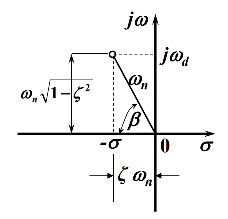

**峰值时间**

当$\frac{dc(t)}{dt}=0$时就是峰值时间
$$
\sin{\omega_d t_p}=0\Rightarrow t_p = \frac{k\pi}{\omega_d}
$$
由于是第一个，$t_p=\frac{\pi}{\omega_d}$，是阻尼振荡周期的一半

**最大过调量**

显然发生在$t_p$上
$$
M_p = \left(c(t_p)-1\right)/1=e^{-\frac{\sigma}{\omega_d}\cdot \pi}\times 100\%
$$
如果阻尼比$0.4<\zeta<0.8$，那么$2.5\%<M_p<25\%$

**衰减比**

同方向的两个相邻波峰的比值，此处为$M(t_{p1})/M(t_{p3})$，是减去了稳态输出的
$$
n=e^{2\pi {\zeta}/{\sqrt{1-\zeta^2}}}
$$

可见如果两个二阶系统用同样的ζ，它们就会出现相同的**过调量和震荡模式**，这类系统称为具有**相同相对稳定性**的系统

**调整时间**

对于欠阻尼二阶系统，其响应被两条曲线包围，分别是$1\pm (e^{-\zeta\omega_n t}/\sqrt{1-\zeta^2})$，这条曲线的时间常数是$1/\zeta\omega_n$
$$
t_s = 4T = \frac{4}{\zeta \omega_n} \,\,\,\,\,\,\,\,2\% 误差标准\\
t_s = 3T = \frac{3}{\zeta \omega_n} \,\,\,\,\,\,\,\,5\% 误差标准
$$

### 3.5 高阶系统的瞬态响应

对于闭环传递函数
$$
\frac{C(s)}{R(s)}=k\frac{\Pi (s+z_i)}{\Pi(s+p_j)}
$$
对于单位阶跃信号的响应可以化为

#### 3.5.1 **闭环极点均为不同的实数**

$$
{C(s)} = \frac{a}{s}+\sum\frac{a_i}{s+p_i}
$$

其中$a_i=(s+p_i)\frac{C(s)}{R(s)}|_{s=-p_i}$，是$s=-p_i$这个极点的**留数**（默认都是一阶的）

做几个讨论：

1. 如果一个**闭环零点**和闭环极点$s_i$接近，那么$a_i$会很小，这个极点的作用也比较小（即消去极点主导性的原理）
2. 如果一个闭环极点$s_i$离原点很远，那么$a_i$也会很小，且对应$e^{-\sigma_it}$的作用也很小（$\sigma_i$很大，这个指数的随时间变化不会很大）
3. 可以忽略留数很小的项，**用低阶系统近似**

#### 3.5.2 闭环极点由实数极点和成对的共轭复数极点组成

$$
C(t) = a + \sum a_ie^{-p_it}+\sum b_ke^{-\zeta_k\omega_kt}\cos{(\omega_k\sqrt{1-\zeta^2}t)}+\sum b_ke^{-\zeta_k\omega_kt}\sin{(\omega_k\sqrt{1-\zeta^2}t)}
$$

稳定的高阶系统响应曲线是**一些指数曲线**和**阻尼正弦曲线**之和

如果所有的极点都在左半平面，那么系统最终的稳定输出为$a$

做几个讨论：

1. 远离虚轴的极点对应的指数项会迅速衰减到0
2. 极点距离虚轴越近，调整时间**越长**
3. 响应**类型**（阻尼）由闭环极点决定，响应**形状**由闭环零点决定，因为零点决定留数大小

#### 3.5.3 闭环主导极点

1. 取决于闭环极点的**实部**与**留数**的相对大小
2. 附近不存在零点，离虚轴近

#### 3.5.4 复平面上的稳定性分析

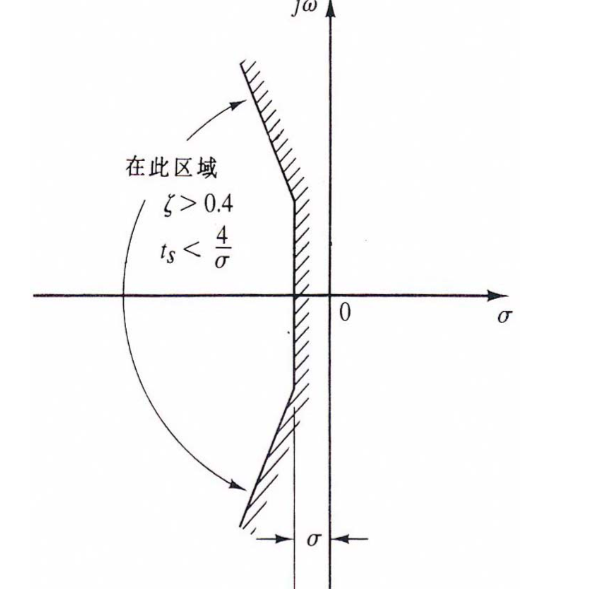

在上述区域中，系统的稳定性最好

但是，即使系统稳定，也不能保证有满意的瞬态响应特性

### 3.6 劳斯稳定判据

#### 3.6.1 应用步骤

写出系统（**闭环**传递函数）的特征方程
$$
a_0s^n+a_1s^{n-1}+\ldots+a_{n-1}s+a_0 = 0
$$
其中$a_0\neq0$，排除所有0根

系统稳定的**必要条件**：所有系数都是正数。即有负的系数那么一定不稳定

若所有系数都是正数，按以下方式列数（没有就用0补齐）

|     s     |  k1   |  k2   |  k3   |  k4   | ...  |
| :-------: | :---: | :---: | :---: | :---: | :--: |
|   $s^n$   | $a_0$ | $a_2$ | $a_4$ | $a_6$ | ...  |
| $s^{n-1}$ | $a_1$ | $a_3$ | $a_5$ | $a_7$ | ...  |
| $s^{n-2}$ | $b_1$ | $b_2$ | $b_3$ | $b_4$ | ...  |
| $s^{n-3}$ | $c_1$ | $c_2$ | $c_3$ | $c_4$ | ...  |
|    ...    |  ...  |  ...  |  ...  |  ...  | ...  |
|   $s^2$   | $d_1$ | $d_2$ | $d_3$ |   0   |  0   |
|    $s$    | $e_1$ | $e_2$ |   0   |   0   |  0   |
|   $s^0$   | $f_1$ |   0   |   0   |   0   |  0   |

其中$b_1=\frac{a_1a_2-a_0a_3}{a_1}, b_2=\frac{a_1a_4-a_0a_5}{a_1}, c_1=\frac{b_1a_3-a_1b_2}{b_1}$，依次类推

计算系数必须算到全为零位置（就是一列连续出现两个0，那么下一行的某个值一定是0）

整个阵列可以用正数乘/除一整行，结论不变

劳斯稳定判据：特征方程中具有的正实部的根的数目，等于阵列的**第一列的系数符号改变次数**

**稳定的充要条件**

方程的全部系数都是正值，且第一列所有系数都是正号

例：单位负反馈系统的前向传递函数为$\frac{K}{s(s+1)(s+2)}$，求系统稳定的K的范围

解：系统的闭环传递函数为$\frac{K}{s^3+3s^2+2s+K}$，特征方程为$s^3+3s^2+2s+K=0$，列出阵列为

|  s   |       K1        |  k2  |
| :--: | :-------------: | :--: |
| s^3  |        1        |  2   |
| s^2  |        3        |  K   |
| s^1  | $\frac{6-K}{3}$ |  0   |
| s^0  |        K        |  0   |

要使系统稳定，那么$0<K<6$，$K>0$是因为系统的增益为$K$，默认是$>0$

#### 3.6.2 特殊情况

**第一列存在0**

用一个很小的正数$\varepsilon$来代替0，继续进行阵列计算

如果0上下的系数符号相同，那么系统存在一对**虚根**；如果不同，系统存在**一个**符号变化

前者说明系统**临界稳定**；后者说明系统**不稳定**

**某一行的所有系数都是0**

表明系统存在一对**奇对称**的根

可以构造辅助多项式，如
$$
s^5+2s^4+24s^3+48s^2-25s-50=0
$$

|  s   |  K1  |  k2  |  k3  |
| :--: | :--: | :--: | :--: |
| s^5  |  1   |  24  | -25  |
| s^4  |  2   |  48  | -50  |
| s^3  |  0   |  0   |  0   |
| s^2  |      |      |      |
| s^1  |      |      |      |
| s^0  |      |      |      |

将全0行的上一行用来构造辅助多项式
$$
2s^4+48s^2-50=0
$$
由于这是高一次的多项式，对这个多项式求导得到$s^3$的多项式
$$
8s^3+96s=0
$$
按这个系数代替全0行

|  s   |  K1   |  k2  |  k3  |
| :--: | :---: | :--: | :--: |
| s^5  |   1   |  24  | -25  |
| s^4  |   2   |  48  | -50  |
| s^3  |   8   |  96  |  0   |
| s^2  |  24   | -50  |  0   |
| s^1  | 112.7 |  0   |  0   |
| s^0  |  -50  |  0   |  0   |

存在一个正实部的根，不稳定

#### 3.6.3 相对稳定性分析

劳斯判据是将特征根与0比，得出系统的绝对稳定性

令$s = \hat{s}-\sigma$，带入特征方程，重写对于$\hat{s}$的阵列，将$\hat{s}$与0对比，就可以判断系统在$-\sigma$右侧的根的个数

### 3.7 积分和微分控制作用对系统性能的影响

#### 3.7.1 比例控制

对于阶跃信号，没有积分器时，系统的比例控制会造成稳态误差

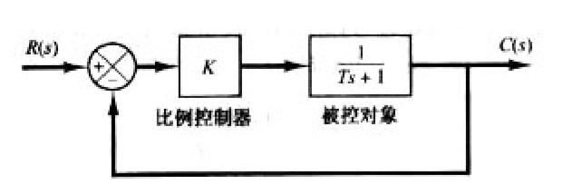

这里的没有积分器指的是反馈环节没有积分器
$$
E/R = (R-C)/R = 1-C/R=\frac{1}{1+G(s)}\\
G(s)=\frac{K}{Ts+1}
$$
得到稳态误差
$$
E = \frac{Ts+1}{Ts+1+k}\frac{1}{s}\\
e(\infty) = \lim\limits_{s\rightarrow0}sE(s)=\frac{1}{K+1}
$$

#### 3.7.2 积分控制

控制器存在积分环节，可消除误差

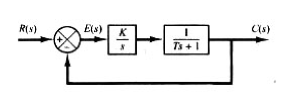

单位阶跃的稳态误差是
$$
e_s = \lim\limits_{s\rightarrow 0}sE(s)=\lim\limits_{s\rightarrow 0}\frac{s^2(Ts+1)}{Ts^2+s+K}\cdot \frac{1}{s}=0
$$
但是积分控制也使得输出振荡，不太好

#### 3.7.3 微分控制

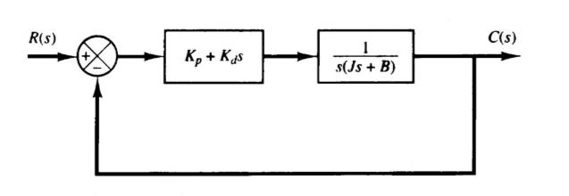

系统的阻尼比为
$$
\zeta = \frac{B+K_d}{2\sqrt{K_pJ}}
$$

**绝对不能单独使用**，因为微分是非因果的，它在预测

优点：能反映误差信号的变化速度，在误差变大前修正，提高系统稳定性；增加了系统的阻尼，允许更大的增益K，改善精度

### 3.8 单位反馈控制系统的稳态误差

依照开环传递函数对系统进行分类，单位反馈的意思是**反馈是$H(s) = 1$**
$$
G(s) = \frac{K\cdot\Pi(T_i s+1)}{s^N\cdot \Pi (T_js+1)}
$$
对**纯积分环节**数进行分类，也就是上式的$N$

#### 3.8.1 稳态误差

一切的前提是**单位反馈**
$$
\frac{E}{R} = \frac{R-C}{R} = 1-\frac{G}{1+G}  =\frac{1}{1+G}\\
E(s) = R(s)\frac{1}{1+G}\\
e(\infty) = \lim\limits_{s\rightarrow 0}sE(s) = \lim\limits_{s\rightarrow 0}\frac{sR(s)}{1+G(s)}
$$

#### 3.8.2 静态位置误差常数$K_p$

是系统对**单位阶跃信号**的特性

系统的稳定误差为$e = \frac{1}{1+G(0)}$，定义$K_p = \lim\limits_{s\rightarrow 0}G(s)$，$e=\frac{1}{1+K_p}$

对于0型系统，$K_p = K$

对于1型或更高系统，$K_p = \infty$，此时稳态误差为0

#### 3.8.3 静态速度误差常数$K_v$

是系统对**单位斜坡信号**的特性

系统的稳定误差为$e = \frac{s}{(1+G(s))s^2}=\lim\limits_{s\rightarrow 0}\frac{1}{sG(s)}$，定义$K_v = \lim\limits_{s\rightarrow 0}sG(s)$，$e = \frac{1}{K_v}$

对于0型系统，$K_v = 0$

对于1型系统，$K_v = K$​

对于2型或更高系统，$K_v =\infty$，此时稳态误差为0

#### 3.8.4 静态加速度误差常数$K_a$

是系统对**单位抛物线信号**的特性，单位抛物线信号为$r(t) = \frac{t^2}{2},t>0$

系统的稳态误差为$e =\lim\limits_{s\rightarrow 0}\frac{1}{s^2G(s)}$，定义$K_a=\lim\limits_{s\rightarrow 0}s^2G(s)$，$e = \frac{1}{K_a}$

对于0型和1型系统，$K_a = 0$

对于2型系统，$K_a = K$

对于3型或更高系统，$K_a = \infty$

#### 3.8.5 小结

误差常数越大，系统的误差越小

故为了满足系统的响应条件，可以增大误差常数

如果$K_v$和$K_a$存在矛盾，应该先满足前者

系统更高阶就是积分器更多，增加积分器可以更稳定，但是很难设计

## 4 根轨迹分析

一种用图解方法表示特征方程的根与系统某个参数的全部值的关系的方法

简言之，用**开环**0/极点，表示对**闭环**0/极点的影响

使开环传递函数$GH = -1$的解，也就是$GH+1 = 0$，解出的$s$是**闭环传递函数**的极点

### 4.1 根轨迹图

#### 4.1.1 辐角和幅值

闭环传递函数为
$$
\frac{C}{R} = \frac{G}{1+GH}
$$
特征方程为
$$
GH+1=0\\
GH = -1
$$
满足条件的解和下面的方程相同
$$
|GH| = 1\\
\angle{GH} = (2k+1)\pi
$$
分别是幅值条件和辐角条件，满足上述条件的$s_i$就是**闭环**极点，**只满足辐角条件**的点构成的图形就是**根轨迹**，这个轨迹上满足**幅值条件**的点就是闭环极点

一般$GH = \frac{K\cdot \Pi (s+z_i)}{\Pi(s+p_j)}$，其中$K$是增益参数，方程可以写为
$$
K\cdot \Pi(s+z_i) + \Pi(s+p_j) =0
$$
当$K$从0增大到$\infty$时，**开环**0点的作用变大，**开环**极点的作用变小，故根轨迹始于**开环**极点，终于**开环**0点，但是轨迹是**闭环**极点的轨迹

关于这里到底是+0/极点的负数，还是直接-0/极点，看个人喜好，这里用+只是因为图片内是+而我不好修改

对于
$$
GH = \frac{K(s+z)}{(s+p_1)(s+p_2)(s+p_3)(s+p_4)}
$$
而言，辐角为
$$
\angle{GH} = \varphi_1-\theta_1-\theta_2-\theta_3-\theta_4
$$
幅值为
$$
|GH|= \frac{KB}{A_1A_2A_3A_4}
$$

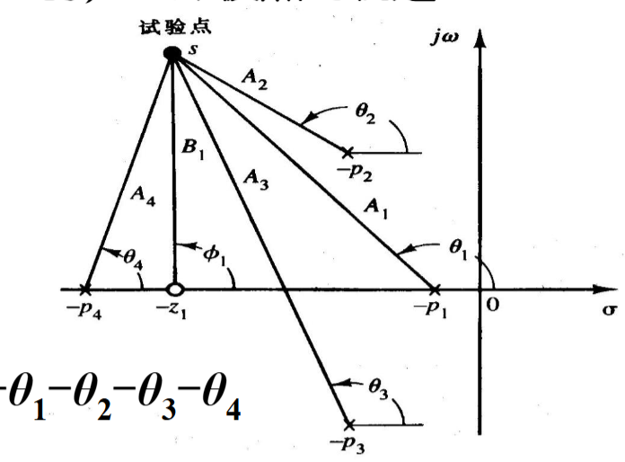

图中都是**开环**0/极点

### 4.2 根轨迹图解计算法

以下面这个为例

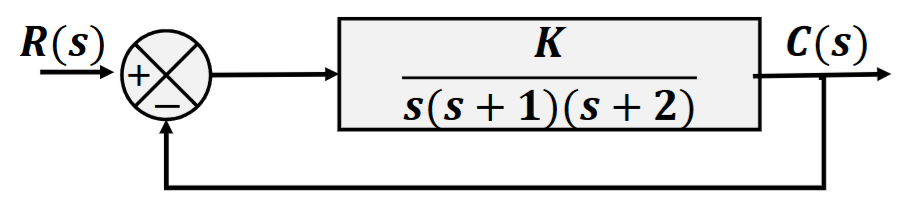

$$
G = \frac{K}{s(s+1)(s+2)}\\
p_1 = 0,p_2 = -1, p_2 = -2
$$

#### 4.2.1 画出0/极点，确定辐角轨迹

根轨迹的起点就是极点，根轨迹的数目就是开环极点数目（也就是闭环极点数目）

上面有三个开环极点，说明有三条根轨迹

m条根轨迹终于开环0点，n-m条根轨迹终于无限远点

实轴上的根轨迹满足其**右边区域有奇数个开环0/极点之和**

在实轴上，符合辐角条件的区域有：$(-\infty,-2), (-1,0)$，这是根轨迹的一部分

完整的轨迹不好找，但是轨迹的渐近线是可以找的

渐近线一定满足辐角条件，即$\lim\limits_{s\rightarrow \infty}\angle G(s) =(2k+1)\pi$，而$\lim\limits_{s\rightarrow \infty}\angle G(s)=\angle\frac{Ks^M}{s^N} = (N-M)\angle s$  

得到渐近线的倾角
$$
\phi = \frac{(2k+1)\pi}{N-M}
$$
渐近线与实轴的交点则为（推导复杂，用到了我看不懂的近似方法，大致可以理解为这就是0/极点的重心）

$$
\sigma = \frac{\sum p_i- \sum z_i}{N-M}
$$

一般来说渐近线只有这几种情况（N=2时只有竖线，图画错了）

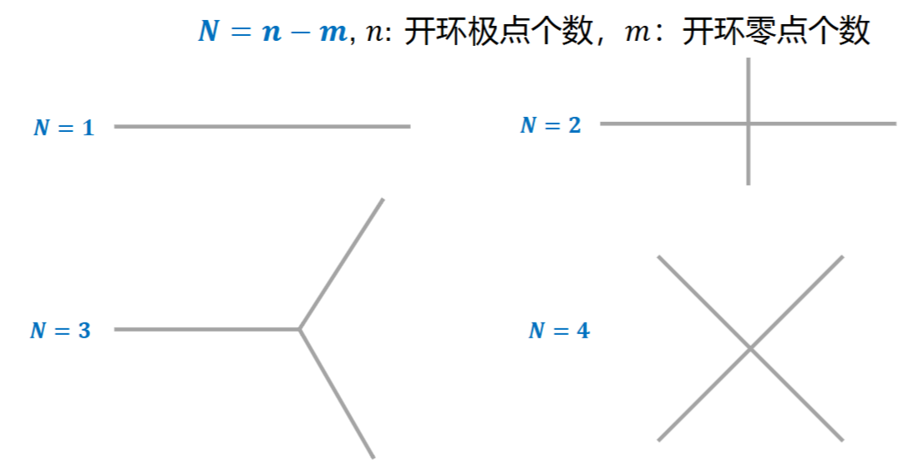

第一阶段结束，得到下图

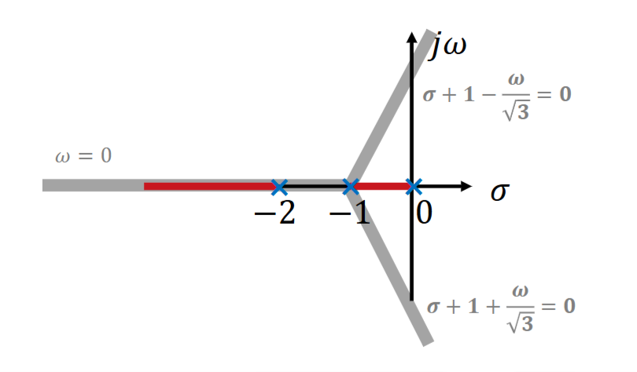

#### 4.2.2 确定分离点

根轨迹从极点出发，在满足辐角条件的地方汇合并分离，上图的$(-1,0)$之间就存在一个分离点

将特征方程写为
$$
f(s) = B(s) + KA(s) = 0
$$
而分离点就是是同时存在于多条根轨迹上的点，那么就是特征方程的重根

显然$f(s) = \Pi(s-s_i)$，为了求得重根可以求使得$\frac{df}{ds} = 0$的点，或者令$K = -\frac{B(s)}{A(s)}$，这些点等价于
$$
\frac{dK}{ds} = 0\Rightarrow BA^{'} - B^{'}A = 0
$$
注意不是所有的满足条件的解都是分离点，判断方法如下

1. s在某条根轨迹上，那么一定是
2. s对应的K为正值（K>0），那么一定是

其他都不是

分离点上根轨迹的切线的角度与在该点上相遇的根轨迹数目$\gamma$有关
$$
\phi_b = \frac{\pi}{\gamma}
$$

对本例，$s_1 = -0.4226, s_2 = -1.5774$，对应$K_1 = 0.3849, K_2 = -0.3849$，舍弃$s_2$

将分离点添加，指出对应的$s,K$，在**同一个实轴上的区间**从极点开始向分离点靠拢，然后向渐近线走

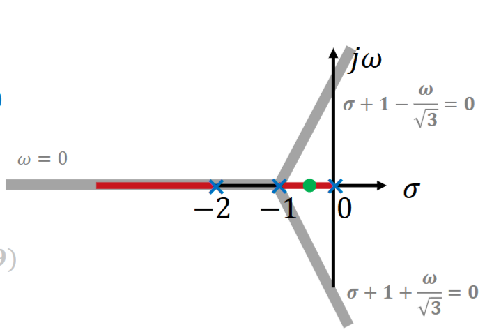

#### 4.2.3 确定根轨迹和虚轴的交点

很显然一个稳定的系统收敛域必须包括虚轴，当存在渐近线穿过虚轴时，说明一定存在使系统不稳定的增益

沿远离极点的方向是K增大的方向，按正确的区间得到使得系统稳定的K区间

这有两个办法，第一个就是用劳斯判据，不赘述，得到$0<K<6$

第二个就是令$s=j\omega$，带入特征方程，解出临界稳定的$K$

方法二的好处就是可以得到具体的K和临界解ω

#### 4.2.4 确定出射角

出射角指的是开环极点上的根轨迹切线的角度

为了确定这个值，在开环极点附近做试验

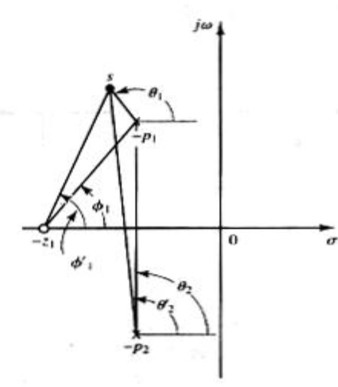

那么其他点的辐角都能确定，根据辐角条件出射角满足
$$
\theta_1 = \pi - \theta_2 + \varphi_1
$$
根据对称性共轭极点的出射角相同，0点则是根轨迹终点，不需要求

很显然，共轭极点退化为$k$重根后，出射角就是$k\theta_1 = (2n+1)\pi -\theta_2 +\varphi_1$

#### 4.2.5 完整的根轨迹

得到完整的根轨迹

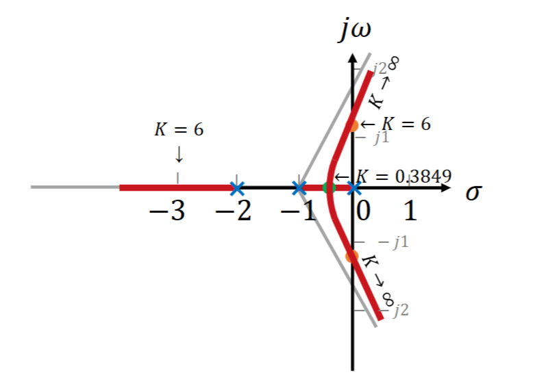

#### 4.2.6 确定闭环主导极点

注意此时求的是**闭环**极点，这个主导极点需要让系统有好的瞬态响应，也就是$\zeta = 0.5$

而$\sigma = \zeta\omega_n, \omega_d = \omega_d\sqrt{1-\zeta^2}$，主导极点可以表示为$s_i = -\sigma \pm j\omega_d$，一定在斜率为$\pm\sqrt{3}$的直线上

对于本例，已知$\zeta, G(s)$，解得$s_1,s_2$，通过幅值条件求的对应的K值

由于$\left| \frac{K\Pi(s-z_i)}{\Pi(s-p_i)} \right| = 1$，代入上面的$s_{1,2}$，由于共轭代一个就行，得到
$$
K = \left| \frac{\Pi(s-p_i)}{\Pi(s-z_i)} \right|
$$
得到$K = 1.0383$，利用K求得第三个极点$s=-2.3326$，在图上表现为

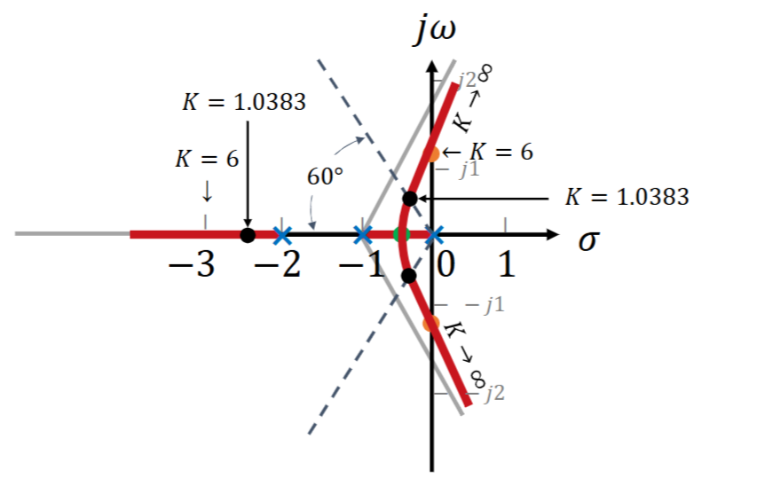

**主导极点是离虚轴近的那个/对**，这就是为什么要求个$s_3$出来

#### 4.2.7 另一个例子

这是一个存在0点的例子

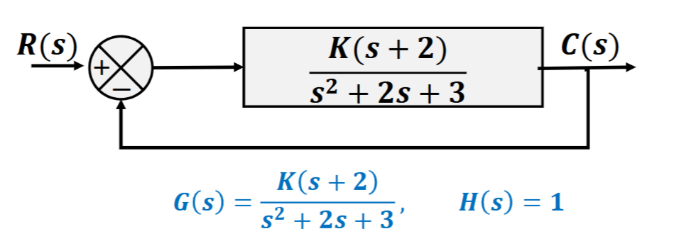

$$
p_1 = -1+j\sqrt2 ,p_2 = -1-j\sqrt2, z=-2 
$$

实轴上符合辐角条件的区域为$(-\infty, -2)$，和显然两条根轨迹一条走向$-\infty$，一条走向$-2$

计算渐近线的斜率和实轴交点均为0，说明渐近线就是实轴

确定分离点，得到$s=-3.7320, K =5.4641$

确定出射角，都是$145^\circ$

确定分离点的切线斜率，带入γ=2，得到90°

最终图像为

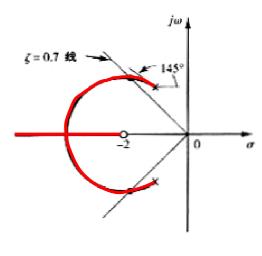

由于这个轨迹和60°斜线不相交，换一个ζ

### 4.3 根轨迹图的说明

#### 4.3.1 闭环极点的结论

系统的闭环特征多项式可以写为
$$
\underset{i=1}{\overset{n}{\Pi}}(s-p_i) + K\underset{i=1}{\overset{m}{\Pi}}(s-z_i) = \underset{i=1}{\overset{n}{\Pi}}(s-s_i) = s^n +a_1s^{n-1}+\ldots + a_{n-1}s+a_n
$$
其中$s_i$是**闭环**极点，有如下结论
$$
\underset{i=1}{\overset{n}{\Pi}}s_i = (-1)^n a_n\\
\underset{i=1}{\overset{n}{\sum}} s_i =-a_1
$$
当$n-m\geq 2 $时，

1. 闭环极点之和与增益$K$无关，是常数，且$\sum\limits_{i=1}^ns_i = \sum\limits_{i=1}^n p_i= -a_1$
2. 闭环极点$s_i$的和不变，当$K$增大时，有根轨迹向左移动，则一定有向右移动的

#### 4.3.2 变量参数不以乘法因子出现

例：如图

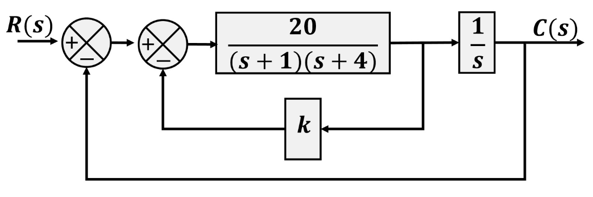

确定闭环主导极点，使得$\zeta=0.4$

解：先解开内层循环，得到$G_1(s)=\frac{20}{(s+1)(s+4)+20k}$，再和$\frac{1}{s}$相乘得到$G_2(s)=\frac{20}{s(s+1)(s+4)+20ks}$

这不是一个标准的形式，问题不大，先写出$1+GH=0$，得到$s(s+1)(s+4)+20ks+20=0$，除以$s(s+1)(s+4)+20$得到
$$
1+\frac{20ks}{s(s+1)(s+4)+20}=0
$$
这就是标准的形式，$K\triangleq 20k$，为增益

最终得到的的根轨迹和$\zeta=0.4$的交点为

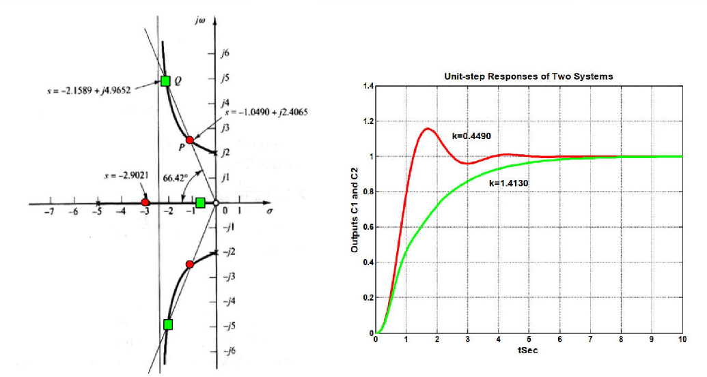

发现由于闭环主导极点不同，虽然$\zeta$相同，但是图像的形状不同

#### 4.3.3 $G,H$的0极点相消

考虑特征方程
$$
1+\frac{K(s+1)}{s(s+1)(s+2)} = 0
$$
此时不能削去$s+1$，很显然这是一个**闭环**极点

#### 4.3.4 非最小相位系统

系统的**开环**0极点都在左半平面且**没有传递延迟因子**，则系统是一个最小相位系统；反之则不是

对于一个非最小相位系统
$$
G(s) = \frac{K(1-T_as)}{s(Ts+1)}
$$
由于之前讨论的都是$1+\frac{K\Pi(s-z_i)}{\Pi(s-p_i)}=0,K>0$的形式，这里需要改写$G(s)=-\frac{(T_as-1)}{s(Ts+1)}$

这样就导致了辐角条件改变为
$$
\angle\frac{K(T_a-1)}{s(Ts+1)} = 2k\pi
$$
对应的一些结论也要改变，不过不记结论就行

#### 4.3.5 正反馈系统

特征方程变为
$$
1- GH=0
$$
同样也是辐角条件改变为
$$
\angle GH = 2k\pi
$$

同样的传递函数，对于正负反馈系统来说，根轨迹往往是互补的

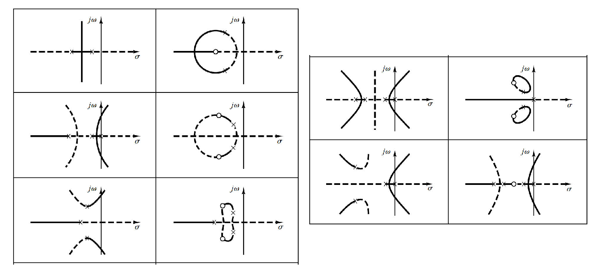

图中虚线是正反馈，实线是负反馈

正反馈系统在$K$增大时往往更容易不稳定

#### 4.3.6 条件稳定系统

当$K$的取值对应于不稳定的工作状态，系统可能不稳定；或是存在非线性的因素，饱和之后系统非线性

这类系统叫做**条件稳定系统**

增加矫正网络

#### 4.3.7 具有传递延迟的系统的根轨迹

存在一个$e^{-st}$，这使得相位变成了$\omega$的函数，系统变得很复杂，不要求

### 4.4 矫正系统

通过在**开环**传递函数中增加0极点，改变根轨迹的形状，使得根轨迹通过希望的的**闭环**极点（主导极点）

#### 4.4.1 初步设计研究

**增加极点的影响**

极点一定是增加在左边的，不然系统不稳定了

很显然在左边的极点会使得根轨迹右移，

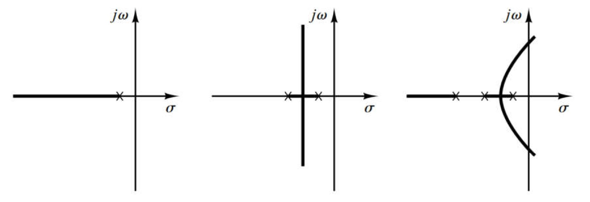

系统将变得不稳定，同时调整时间($\frac{1}{\sigma}$)也会增加（闭环极点的实部减小，调整时间为实部的倒数）

**增加零点的影响**

根轨迹左移，系统变得稳定，调整时间减小

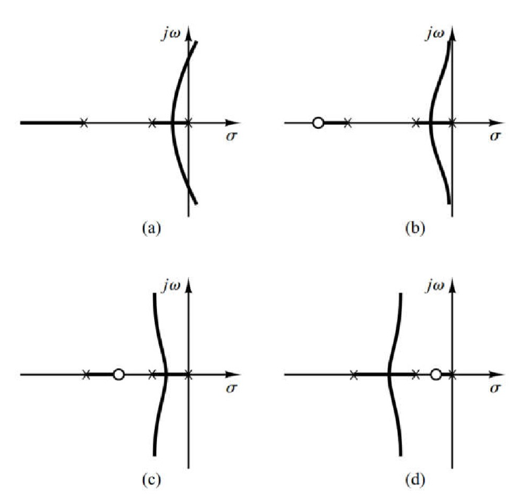

#### 4.4.2 超前矫正

为了找到满意的**闭环**极点而使用，**提高瞬态响应性能**

为系统串联一项
$$
G_c(s) = K_c \frac{s+\frac{1}{T}}{s+\frac{1}{\alpha T}}
$$
为了使得相位是正（超前），且系统稳定，有$-\frac{1}{\alpha T}<-\frac{1}{T}\Rightarrow \alpha\in(0,1)$，$\alpha,T$的值由辐角缺额条件决定，而$K_c$由幅值条件确定

例：单位负反馈系统的开环传递函数$G(s)=\frac{4}{s(s+2)}$，要求不改变闭环极点的阻尼比，使$\omega_n$变为4

解：闭环极点的期望位置是$-2\pm j2\sqrt3$，由于共轭，只需要考虑上面的极点，将这个值代入$GH$中，得到的辐角为$-210^\circ$，与辐角条件相差$30^\circ$，辐角缺额条件就是后者，故$\angle{s+\frac{1}{T}} - \angle {s+\frac{1}{\alpha T}} = 30^\circ$，有很多组解，都行

这里选择$\frac{1}{T} = 2.9,\frac{1}{\alpha T}=5.4$，这是$G_c$的0/极点，代入$|G_c(s_1)G(s_1)|=1$，解出$K_c=4.68$

#### 4.4.3 滞后校正

滞后矫正减小了稳态误差，**提高稳态响应性能**

为系统串联
$$
G_c(s)=\hat{K}_c\frac{s+\frac{1}{T}}{s+\frac{1}{\beta T}}
$$
其中$\beta>1$

与超前矫正不同，滞后矫正是因为系统没有满意的稳态特性，但是有较好的瞬态特性

因此为了不让瞬态特性发生显著变化，**0极点应当接近且接近原点**，消除极点的影响

为什么需要接近原点：$\beta$不会小的，这样为了使0极点绝对接近，必须是二者都小，比如0.01和0.001，相对差距大，但是绝对差距小

这样一来**闭环**极点只会偏离一点，而$|G_c(s)|\approx \hat{K}_c,\angle G_c(s)\in(-5^\circ, 0)$

当$\hat{K}_c\approx1$时，瞬态响应不明显改变

校正后的系统的静态速度误差常数$\hat{K}_v = \hat{K}_c\beta K_v\approx \beta K_v$，由指定的静态误差常数决定$\beta$的值

选取的$T$只需要满足0极点相近就行，没有特别的要求，根据幅值条件计算$\hat{K}_c$

#### 4.4.4 滞后-超前矫正

可以加快响应，减小稳态误差；同时增加了瞬态和稳态性能

为系统串联
$$
G_c(s)=K_c\frac{s+\frac{1}{T_1}}{s+\frac{\gamma}{T_1}}\cdot\frac{s+\frac{1}{T_2}}{s+\frac{1}{\beta T_2}}
$$
其中$\beta>1,\gamma=\frac{1}{\alpha}>1$，为了方便$\beta=\gamma$，故取倒数

由于$\angle \frac{s+1/T_2}{s+1/\beta T_2}$很小，故可以通过辐角缺额确定$\gamma,T_1$的值，进而根据幅值条件确定$K_c$的值

串联上$G_c$后系统的静态速度误差常数$K_v=\lim\limits_{s\rightarrow0}sG_cG=sK_c\frac{\beta}{\gamma}G$，根据要求的$K_v$值确定$\beta$的值，继而选择$T_2$的值

注意，$\beta T_2$不能太大，否则物理上无法实现

**PI控制**：$G_c=k_p(1+\frac{1}{T_i s})$，$z=-\frac{1}{T_i},p=0$，是一个滞后矫正器，提高了稳态特性

**PD控制**：$G_c=k_p(1+T_ds)$，$z=-\frac{1}{T_d}$，没有极点，是一个超前矫正器，提高了瞬态特性

**PID控制**：$G_c=k_p(1+\frac{1}{T_i s}+T_ds)$，两个0点，一个极点，是一个滞后-超前矫正，但是相对于4点的矫正器又少一个参要调，更方便

#### 4.4.5 并联矫正

控制器位于小回路，长这样

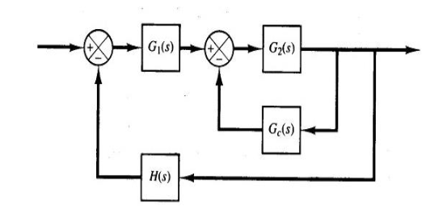

其中$G_c(s)$是矫正器，系统的闭环传递函数为
$$
\frac{C}{R}=\frac{G_1G_2}{1+G_2G_c+G_1G_2H}
$$
特征方程是$1+G_2G_c+G_1G_2H=0$，不是标准形式，将不包含$G_c$的项除去，得到
$$
1+\frac{G_2G_c}{1+G_1G_2H}=0
$$
定义$G_f=\frac{G_2}{1+G_1G_2H}$，则特征方程为
$$
1+G_cG_f=0
$$

## 5 频率响应分析

### 5.1 频率响应

定义正弦传递函数，其实就是单位冲激响应的傅里叶变换$G(j\omega)$，同样地定义相位和幅度

对于正弦信号$x(t)=X\sin\omega t$，假定传递函数是多项式分式$G(s)=\frac{P(s)}{Q(s)}$，那么
$$
Y(s) = G(s)\frac{X\omega}{s^2+\omega^2} = \frac{a}{s+j\omega}+\frac{\bar{a}}{s-j\omega}+\sum\frac{b_i}{s-s_i}
$$
其中$a=\lim\limits_{s\rightarrow -j\omega}G(s)\frac{X\omega}{s-j\omega}=-\frac{XG(-j\omega)}{2j}$是常数，为什么是$a,\bar{a}$经过通分可知，很显然，
$$
y(t) = ae^{-j\omega t}+\bar{a}e^{j\omega t}+b_ie^{s_it}
$$
对于一个稳定的系统，$s_i$的实部都在负半轴，故
$$
y_{ss}(t)=ae^{-j\omega t}+\bar{a}e^{j\omega t}=X|G(j\omega)|\sin(\omega t+\phi)
$$
上式的推导用到了$G(j\omega)$的共轭对称性，即$|G(j\omega)|=|G(-j\omega)|,\phi_+=-\phi_-=\angle G(j\omega)$，其中$\phi$是相位（实际系统的时域响应一定是实函数，那么就有共轭对称性）

那么正弦响应就可以直接这么求

### 5.2 波特图

略，学了三次了也该会了

#### 5.2.1 二阶因子

这是特别的，单独讲一下

对于一个标准的二阶因子，形如
$$
\frac{1}{1+2\zeta \left(\frac{j\omega}{\omega_n}\right)+\left( \frac{j\omega}{\omega_n} \right)^2}
$$
若$\zeta>1$，那么可以化成两个一阶因子

若$0<\zeta<1$，那么有新的方法简便计算（实际上是化成共轭复数作为一节因子的方法不再正确）

当$\zeta$较小时，转角频率处的响应与$\zeta$有关

**频率响应曲线**

不难发现
$$
20\lg|H| = -20\lg{\sqrt{\left( 1-\frac{\omega^2}{\omega^2_n}\right)^2+\left( \frac{2\zeta\omega}{\omega_n} \right)^2}}
$$
当$\omega<<\omega_n$时，$20\lg|H| = -20\lg{1}=0\mathsf{dB}$

当$\omega>>\omega_n$时，$20\lg{|H|} = -40\lg{\frac{\omega}{\omega_n}}$

在$\omega_n$处，根据$\zeta$的不同有如下

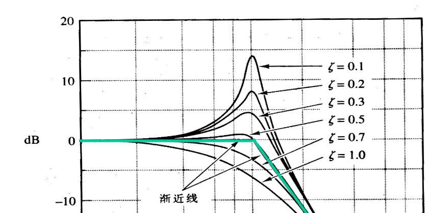

实际上就是系统在$\omega_n$附近存在共振频率，计算得到
$$
\omega_r=\omega_n\sqrt{1-2\zeta^2}
$$
为**谐振频率**，因此，当$\zeta<0.707$时，需要对近似的波特图进行**修正**

进一步，谐振峰值$M_r=\frac{1}{2\zeta \sqrt{1-\zeta^2}}$

二者分别和阻尼频率和超调量有类似的表达式

**相位响应曲线**
$$
\phi = -\tan^{-1}\frac{2\zeta\frac{\omega}{\omega_n}}{1-\left(\frac{\omega}{\omega_n}\right)^2}
$$
在转角频率，$\phi=-90^\circ$，与$\zeta$无关

画法和一阶类似，区别是从$0^\circ\sim -180^\circ$

#### 5.2.2 最小相位系统

当系统函数的0极点都位于左半平面，且没有延迟因子$e^{-j\omega T}$时，系统是最小相位系统

在所有有相同幅度响应的系统中，最小相位系统的**相角变化是最小**的，因此，确定了幅度响应，就确定了一个最小相位系统

可以通过全通滤波器，将非最小相位系统转化为最小相位系统（0极点相消）

全通滤波器不改变幅值曲线，但是改变相角曲线

**利用波特图判断**

最小相位系统的波特图存在以下的性质，其中$p,q$分别是分子/母的次数

1. $\omega\rightarrow \infty \Rightarrow \angle H = -90^\circ(q-p)$
2. $\omega\rightarrow \infty \Rightarrow -20(q-p)$的斜率

这是充要条件，就是**排除右边的0极点和延迟因子**，也就是必须是$\Pi(1+j\omega T_i)^{\pm1}$的形式，其中$T_i>0$

#### 5.2.3 延迟传递

$$
G(j\omega)=e^{-j\omega T}
$$

幅值恒为1，相位$\angle G = -\omega T\mathsf{rad} = -57.3 \omega T ^\circ$，在波特图上表现为指数函数

#### 5.2.4 系统类型和幅值曲线的关系

在低频时，**曲线的斜率只由纯积分因子决定**

1. 0型系统：水平线
2. 1型系统：-20dB/十倍频
3. 2型系统：-40dB/十倍频

下面的讨论都是针对的**单位负反馈系统**

**0型系统**
$$
\lim\limits_{\omega\rightarrow 0}G(j\omega) = K_p
$$
那么水平线的方程为
$$
y = 20\lg{K_p}
$$

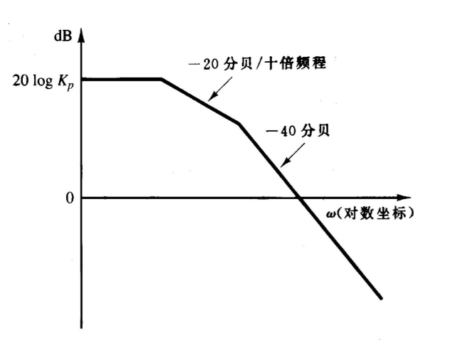

**1型系统**

低频时的曲线方程为
$$
y =20\lg{\frac{K_v}{\omega}}
$$
那么当$\omega=1$时，可以算出$K_v$
$$
y|_{\omega=1}=20\lg{K_v}
$$
当然也能通过$y=0$计算$K_v$，当$y=0$时
$$
\omega_1 = K_v
$$
存在以下关系

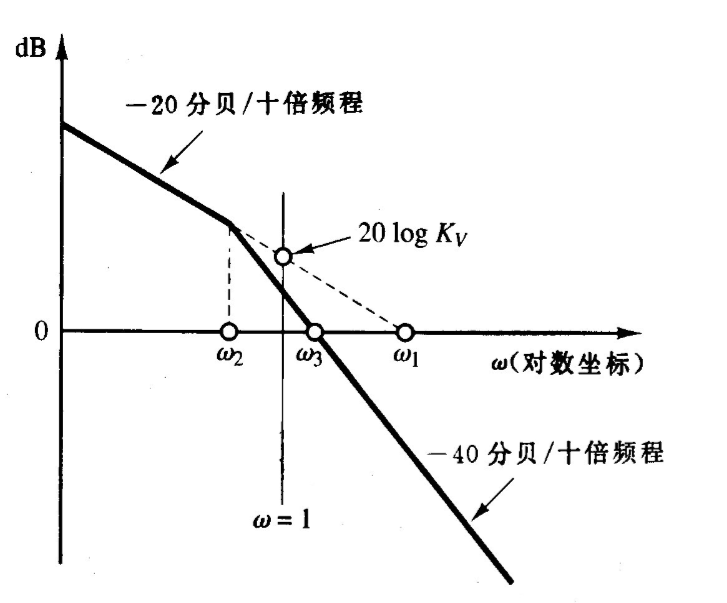

其中$\lg\omega_2 +\lg{\omega_1} = 2\lg{\omega_3}$，且$\zeta = \frac{\omega_2}{2\omega_3}$

前者很好证明，$\tan \omega_3= 2\tan\omega_1$，这里指图上对应的角度，而不是频率本身，那么$|\lg\omega_2-\lg\omega_3|=|\lg\omega_3-\lg\omega_1|$

**2型系统**

低频时曲线的方程为
$$
y =20 \lg \frac{K_a}{\omega^2}
$$
当$\omega = 1$时，有
$$
y = 20\lg K_a
$$
同理，使用交点坐标也行，当$y = 0$时
$$
\omega_a = \sqrt{K_a}
$$

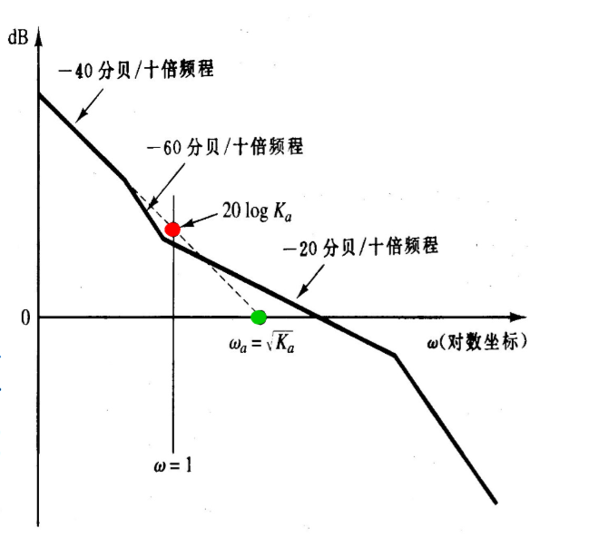

### 5.3 奈奎斯特图

也叫极坐标图，但是注意此时的坐标轴是$\mathsf{Re}\{G\},j\mathsf{Im}\{G\}$，而不是那个变换了空间的极坐标

将$G(j\omega)$表达为
$$
G = |G| e^{j\angle G}
$$
使用$(|G|, \angle G)$表达传递函数，形如

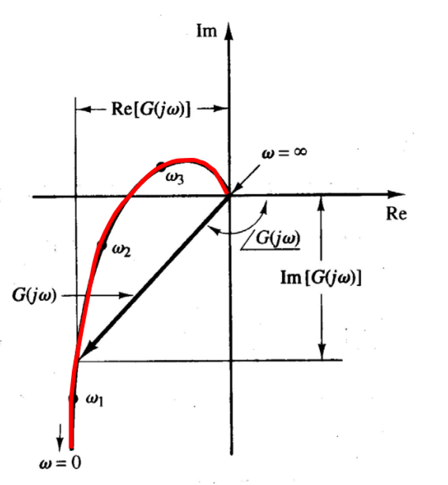

#### 5.3.1 积分和微分因子

**积分因子**
$$
G = \frac{1}{j\omega}
$$
拥有恒定的相位$\angle G = -90^\circ$，幅值$|G| = \frac{1}{\omega}$，故图像为负虚轴，但是注意$\omega$越小，$|G|$越大

**微分因子**
$$
G = j\omega
$$
拥有恒定的相位$\angle G = 90^\circ$，幅值$|G| = \omega$，故图像为正虚轴，$\omega$越大，$|G|$越大

#### 5.3.2 一阶因子

**积分**
$$
G = \frac{1}{1+j\omega T}
$$
$\angle G = -\tan^{-1}\omega T, |G| = \frac{1}{\sqrt{1+\omega^2T^2}}$，在极坐标中表现为半圆，圆心位于$(0.5,0)$，半径为$0.5$

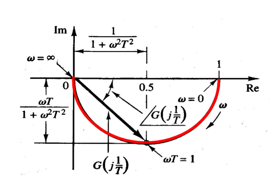

**微分**
$$
G = 1+j\omega T
$$
$\angle G = \tan^{-1}\omega T, |G|=\sqrt{1+\omega^2T^2}$，表现为一条直线

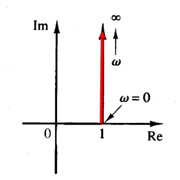

这张图中虚轴可以对应于$\omega$，但只是巧合

#### 5.3.3 二阶因子

**积分**
$$
G = \frac{1}{1+2\zeta \left(\frac{j\omega}{\omega_n}\right)+\left( \frac{j\omega}{\omega_n} \right)^2}
$$

图不重要，只需要关注两个点$G(j0),G(j\infty)$即可
$$
G(j0)=1\angle 0,G(j\infty)=0\angle-\pi
$$
因此图大致如下

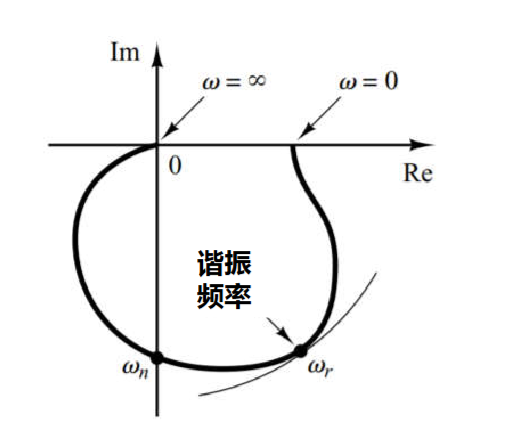

其中在虚轴上的点代表了**自然频率**处的幅值，幅值最大的点代表了**谐振频率**处的幅值

谐振频率处的幅值大小可以用1（即ω=0）来估计

上面的是$\zeta<1$的图，当$\zeta>>1$时，两个实轴上的极点相差很大，退化为类似1个极点的一阶因子图像，即一个半圆

**微分**

类似的，图像如下

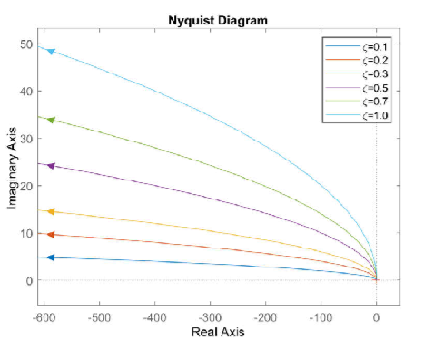

例：求$G(s)=\frac{1}{s(Ts+1)}$的奈奎斯特图

解：首先写成
$$
G = \frac{1}{\sqrt{\omega^4T^2+\omega^2}}\angle-\tan^{-1}\frac{1}{\omega T}
$$
光有这个不足以确定图像，还需要写出实部和虚部辅助判断
$$
\mathsf{Re}\{G\} = -\frac{T}{\omega^2T^2+1}\,\,\,\,,\mathsf{Im}\{G\} = -\frac{1}{\omega^3T^2 + \omega}
$$
由此可以画出

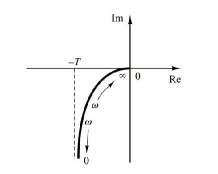

#### 5.3.4 极坐标图的一般形状

假定传递函数形如
$$
G = \frac{K\Pi(1+j\omega T_a)}{(j\omega)^\lambda\Pi(1+j\omega T_b)} = \frac{\sum_{i=0}^m a_i(j\omega)^i}{\sum_{i=0}^n b_i(j\omega)^i}
$$
其中$n>m$，这类函数的极坐标图存在以下性质

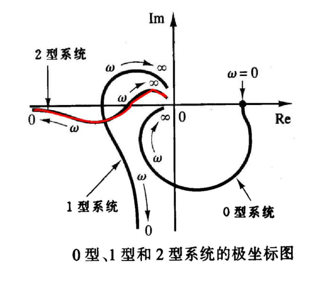

**$\lambda=0$，即0型系统**

代入$\omega=0$，得到$G=K\in R$，即起点是正实轴上的一个有限值，发射角也与实轴垂直

代入$\omega=\infty$，得到$|G |= 0$，且与坐标轴相切

**$\lambda=1$，即1型系统**

同理得到$G(0)=-j\infty$，且渐近线是一条平行于负虚轴的线，代入$\omega=\infty$，得到$|G|= 0$，且与坐标轴相切

**$\lambda=2$，即2型系统**

$G(0)=-\infty$，从负实轴而来，相切于坐标轴

**如何判断$\omega=\infty$时的切线**

使用后一个式子，当$\omega=\infty$时，只需要考虑最高次，那么
$$
G = \frac{a_m(j\omega)^m}{b_n(j\omega)^n}\\
|G| = 0\\
\angle G = j^{m-n}
$$

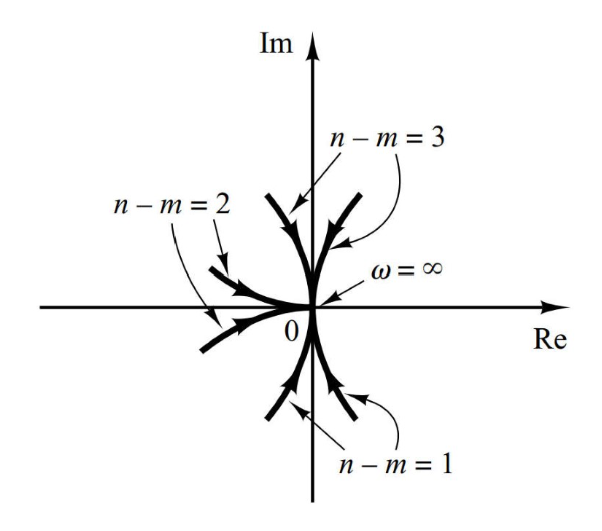

至于从哪边相切，无法确定

极坐标图的任何**复杂形状**都是由**分子**的**动态特性**引起的，即分子的时间常数

### 5.4 对数幅-相图

用分贝表示幅度和相位的关系图，也叫尼柯尔斯图

由于
$$
20\lg |G^{-1}| = -20\lg {G}\\
\angle G^{-1} = -\angle G
$$
那么在极坐标空间中，$G$和$G^{-1}$的尼柯尔斯图是关于原点对称的

不同于奈奎斯特图，这里真的是变换到极坐标空间了

画法就是根据波特图上的一个$\omega$，对应的$|G|,\angle G$，用函数$|G| = F(\angle G)$表示

### 5.5 几幅图的对比

以二阶因子为例

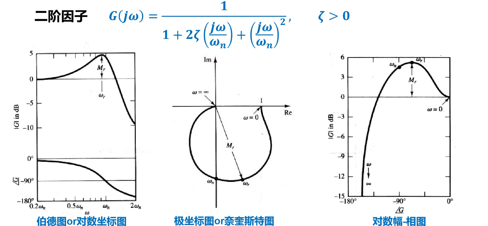

### 5.6 奈奎斯特稳定判据

根据**开**环频率响应和**开**环极点确定系统的稳定性

即将$GH$与$1+GH$在右半平面的0极点数相联系

#### 5.6.1 基本概念

对于特征函数
$$
F(s) = 1+G(s)H(s)
$$
可以得到下面的表格

| s平面的特殊点 | F(s)的特殊点 |
| :-----------: | :----------: |
|   闭环极点    |     0点      |
|   开环极点    |     极点     |

不加证明，直接引入下面的定理

* 函数$F(s)$在$s$平面上除了奇点外，处处解析

* 对于$s$平面上的任一条闭合曲线（变量是$s=\sigma+j\omega$），在$F(s)$平面上一定有一条对应的闭合曲线（变量是$\mathsf{Re}\{GH\},\mathsf{Im}\{GH\}$）

* $s$平面上的曲线**顺时针**经过$Z$个$F(s)$的0点（**闭**环极点），$P$个$F(s)$的极点（**开**环极点）

  那么在$F(s)$平面上，对应一条封闭曲线，**顺时针**包围原点$N=Z-P$次，$N<0$表示逆时针

由于$F(s)$的0点就是系统的**闭**环极点，是否能够通过上面的性质进行稳定性判定？

系统稳定等价于传递函数收敛域包含虚轴，由于这里讨论的都是有理分式，故等价于$s$平面的右半平面没有极点

即：系统稳定等价于$F(s)$在$s$的右半平面没有0点

由于$Z=N+P$，后二者是好算的

可以构造一个$s$平面的曲线，让$Z$表示在右半平面的0点，即一个半径无限的半圆

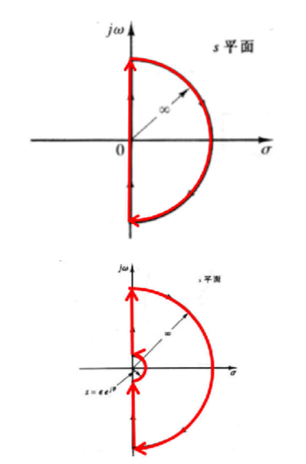

下方的图表示$s=0$是0/极点的情况，做一个小圆绕过去

为了顺时针，$s$平面是从$0-j\infty$到$0+j\infty$，再回到$0-j\infty$，这就是$\omega$的变化过程

由于$\lim\limits_{s\rightarrow \infty}GH=\mathsf{const}\in \R$，故在**圆弧段的所有$s$对应在$F(s)$的一个点(实轴上，包含0)**，在$\omega$从$-\infty$到$+\infty$对应的是主要的曲线

即只需要考虑$\omega$的变化，那么就回到了奈奎斯特图

再考虑$F(s)=1+GH$对原点的包围，等价于$GH$对$-1+0j$的包围

又由于$G,H$的各自的共轭对称性，存在$G(j\omega)H(j\omega)=G(-j\omega)H(-j\omega)$，因此只需要画一半就行

#### 5.6.2 奈奎斯特稳定判据

这个东西看着鸡肋，但是当**系统函数不显式**时是比较好用的

根据上面的讨论，当$GH$顺时针包围$-1\,\,\,N$次时，系统的右半平面的闭环极点个数为$N+P$

那么为了系统稳定，$GH$需要**逆时针**包围$-1\,\,\,P$次

如果通过$-1$，说明系统存在纯虚的闭环极点，系统临界稳定

例：$GH=\frac{K}{s(Ts+1)}$，判断是否稳定

解：$P=0$，需要画奈奎斯特图，由于
$$
\mathsf{Re}\{GH\} = -\frac{T}{\omega^2T^2+1}\,\,\,\,,\mathsf{Im}\{GH\} = -\frac{1}{\omega^3T^2 + \omega}
$$
故部分的曲线形如

注意这里的$0$指的是$0^+$，相应的，关于实轴对称后得到$\omega:-\infty\rightarrow 0^-$的图像，那么还有$0^-\rightarrow0^+$的图像呢？

由于这个函数的极点在0上，需要对$s$平面上的曲线进行取小圆弧，令这段圆弧为
$$
s=\sigma+j\omega = \varepsilon e^{j\theta} = \varepsilon\cos\theta + j\varepsilon\sin\theta
$$
其中$\sigma\rightarrow 0,\varepsilon\rightarrow 0, \theta:-90^\circ\rightarrow 90^\circ$

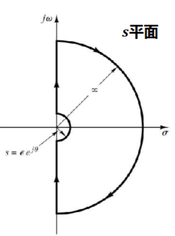

那么这部分的$GH = \frac{K}{\varepsilon}e^{-j\theta}$，由于我们需要$\omega:0^-\rightarrow0^+$，而$\omega=\varepsilon \sin\theta$，那么就是前面$\omega$的取值变化对应于$\theta$就是$\theta:-90^\circ\rightarrow 90^\circ$

那么$GH$在奈奎斯特图中表现为

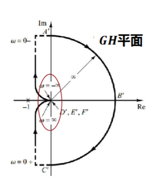

图中的无限半径的圆弧就是$s$平面上这一小段圆弧产生的

根据$s$平面的顺时针方向，即$\omega:-\infty\rightarrow +\infty\rightarrow -\infty$，来确定$GH$的方向，上图中$N=0$，系统稳定

补：对于包含积分因子$\frac{1}{s^n}$的$GH$，$s$沿小圆运动会产生n个上面的圆环绕原点，没什么用

### 5.7 相对稳定性

以下的讨论默认系统具有**单位负反馈**，且是**最小相位**系统（没有右边的0/极点）

#### 5.7.1 通过保角变换进行相对稳定性分析

将$s$平面的虚轴映射为$GH$平面的奈奎斯特轨迹，那么将得到

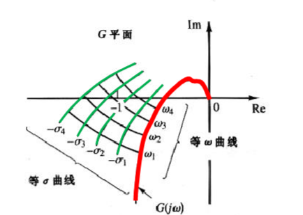

由此，将  **闭**环极点距离虚轴的距离  转换为  $GH$曲线距离$-1+j0$  的距离

后者越小，那么前者也越小，系统的$\zeta$也就越小，那么系统的瞬态响应和稳态响应也对应变化

当然二者同时也表征了相对稳定性

#### 5.7.2 相位裕量和增益裕量

**几个定义**

* 增益交界频率：$|GH|=1$时的频率

* 相位裕量：在$|GH|=1$时，$\angle GH$与-180°的差值，即$\angle GH -\gamma =-180^\circ\Rightarrow \gamma =\angle GH +180^\circ$

  通常$\angle GH$用顺时针的负角度表示，即$240^\circ = -120^\circ$

  很显然，为了使最小相位系统稳定，$\gamma$必须是正的

* 相位交界频率：$\angle GH =-\pi$时的频率

* 增益裕量：$\angle GH=-\pi$时，$K_g=\frac{1}{|GH|}$，一般用dB表示，$K_g(\mathsf{dB})=20\lg K_g=-20\lg{|GH|}$

  若$K_g>1$，在奈奎斯特图上表现为与实轴的交点在单位圆内，系统稳定

  $K_g<1$，系统不稳定
  
  为什么需要先取倒数？：可以将其理解为$|GH|<1$是否成立，当起在$\angle GH=-\pi$成立时，说明不包围$-1+j0$，那么为了和相位裕量统一，都定义为正值，就取倒数后再取对数；或者直接理解为$(0-20\lg|GH|)$，这种语境下，相位裕度就是$\angle GH -(-180^\circ)$

相位裕量和增益裕量在波特图中是最好看的

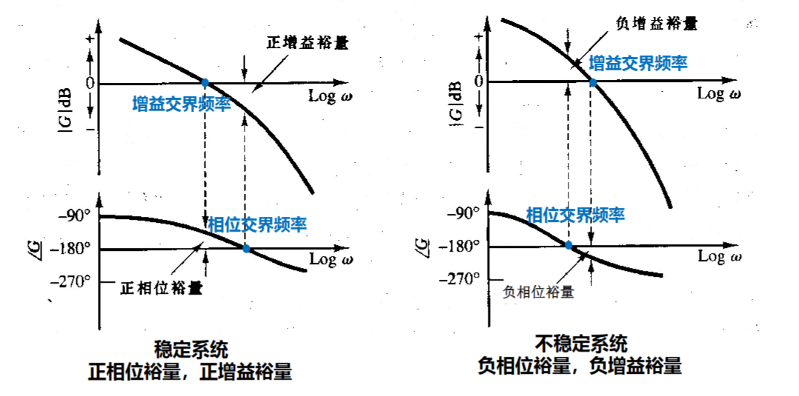

实际上在对数幅-相位图更好看

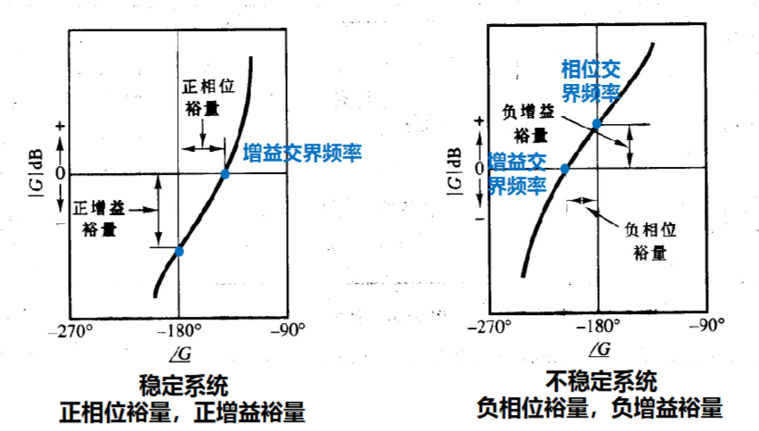

**几点补充**

* 对于条件稳定的非最小相位系统，由于其存在右边的0/极点，奈奎斯特图必须包围（分情况顺逆时针）$-1$

  因此这个系统一定是**负的相位和增益裕度**

* 条件稳定系统具有**多个相位交界频率**，对于存在多个增益交界频率的系统，在计算相位裕量时用**最大的频率**

* 为了确定系统的相对稳定性，增益和相位裕量必须**同时给出**

* 对于最小相位系统，只有二者**同时是正值**时才稳定

* 确定非最小系统稳定性的最好办法，是奈奎斯特判据

#### 5.7.3 谐振峰值和谐振峰值频率

**谐振峰值幅度**：表征了系统的相对稳定性

* 大的谐振峰值表示存在一对**主导闭环极点**，且具有较小的$\zeta$，瞬态响应不理想
* 小的，不存在，有较大的$\zeta$，阻尼比较良好

联系二阶系统的最大过调量和阻尼频率，可以发现**频率响应**的系统动态信息和**瞬态响应**的信息是相同的

当$\zeta$较小时，谐振频率与阻尼自然频率相近，因此，谐振频率可以代表响应速度

$\zeta$越小，谐振峰值$M_r$和超调量$M_p$就越大，当$M_r\in [0,3]\mathsf{dB}$时，表示$0.4<\zeta<0.7$，系统有满意的瞬态

**相位裕量与阻尼比的关系**

当$0\leq \zeta \leq 0.6$时，$\zeta = \frac{\gamma}{100}$

#### 5.7.4 截止频率和带宽

当**闭环**响应的幅值降到-3dB时，认为系统截止，对应的频率称为截止频率$\omega_b$，也就是带宽

带宽的性质

* 与$\zeta$成反比，与上升时间反比，与响应速度成正比
* 反映对高频噪声的过滤

**剪切率**：对数幅值曲线在截止频率附近的斜率，如-20dB/十倍频等

反映了系统的抗干扰能力，越**大**，系统可能有**大的谐振峰值**，**小的稳定裕度**

不严谨的理解，可以理解为变化很快，说明变化很大，说明谐振峰值很大，说明$\zeta$小，根据$\zeta = \gamma/100$进一步说明稳定裕度很小

### 5.8 单位反馈系统的闭环频率响应

注意是**闭环**，如何构造呢
$$
\frac{C}{R} = \frac{G}{1+G}
$$
根据0极点图的想法，将上下视为向量

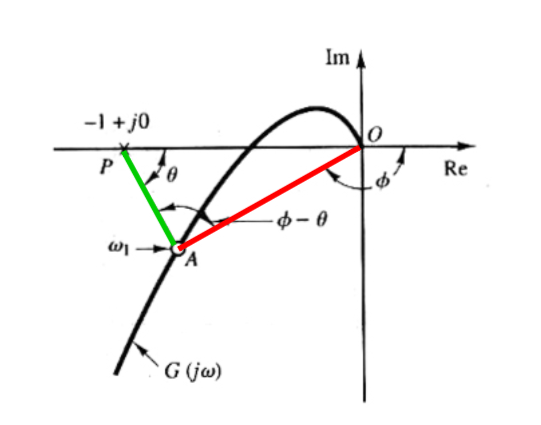

下面的就是$G-(-1)$

令$G = X+jY$，再令$\frac{C}{R} = Me^{j\alpha}$，那么
$$
M = \left|\frac{X+jY}{X+1+jY}\right| \Rightarrow \left( X+\frac{M^2}{M^2-1} \right)^2+Y^2 = \frac{M^2}{(M^2-1)^2}\,\,,\,\, M\neq 1
$$
当$X=-\frac{1}{2}$时，$M=1$

根据上面的方程可以确定等幅值轨迹

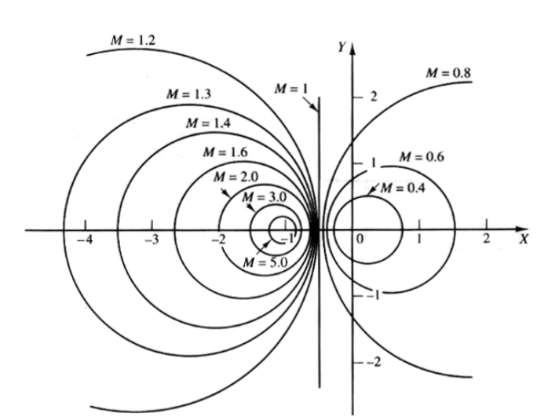

同理，令$N=\tan \alpha$，那么
$$
N = \frac{Y}{X^2+X+Y}\Rightarrow \left( X+\frac{1}{2} \right)^2+\left( Y-\frac{1}{2N} \right)^2 = \frac{1}{4}+\frac{1}{4N^2}
$$
根据上面的方程，确定等辐角轨迹

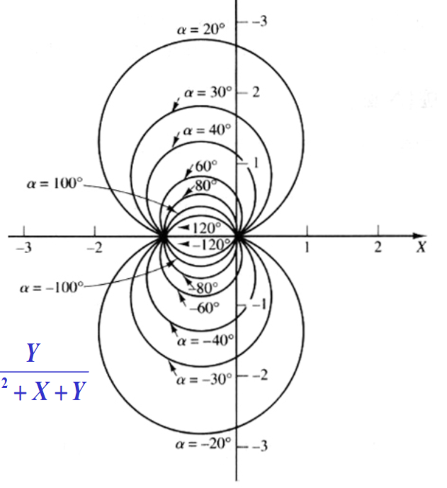

这些轨迹都存在于$\mathsf{Re,Im}$空间，也就是奈奎斯特图的空间，在这些图上叠加$G$的奈奎斯特图，得到

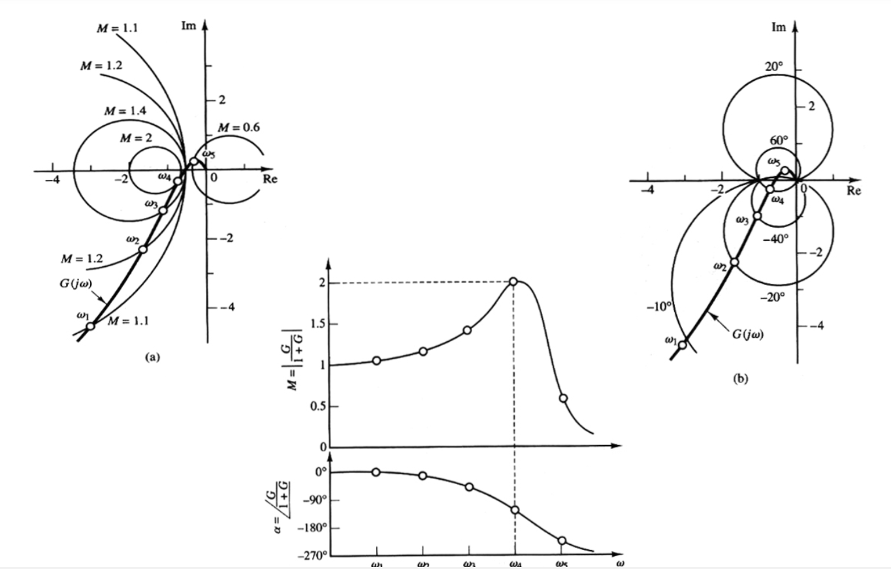

交点表示对应频率下的**闭环**函数的特征，由此可以得出闭环传递函数的尼科尔斯图（对数幅-相图）

如果和$G$有切点，那么相切代表谐振，切点的频率就是谐振频率：观察尼科尔斯图可以发现，谐振频率就是最高的，也就是仅一个$\omega$对应，那么就是切点

### 5.9 有波特图求最小相位的传递函数

只能求最小相位，而且波特图必须以渐近线的形式给出

很显然，对于最小相位系统，传递因子只包括了5.2节中提到的那些，只需要根据这些因子的特性进行反推就行

阻尼比可以根据谐振峰值的大小进行估计

增益的确定见5.2.4节，那里讲了不同系统的$K$的对应值

非最小相位系统，不好搞，不要求

### 5.10 系统矫正

使用波特图居多，因为只需要平移图像就好了

奈奎斯特图的变化非常复杂

开环响应的轨迹反应了什么？

* 在低频区（远低于转角频率），表征**闭**环系统的**稳态特征**
* 在中频区（靠近$-1+j0$），表征**闭**环**相对稳定性**
* 在高频区，表征系统的复杂性

#### 5.10.1 超前矫正

超前矫正函数见4.4.2节，这里给出其正弦传递函数
$$
G_1(j\omega) = K_c\alpha \frac{1+j\omega T}{1+j\alpha\omega T}\,\,,\,\,\alpha\in(0,1)
$$
做出其极坐标图

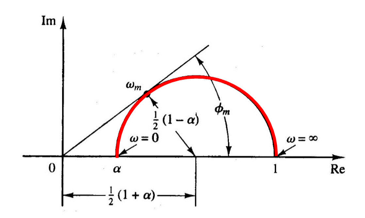

那么能提供的最大超前角就是
$$
\sin \phi_m = \frac{1-\alpha}{1+\alpha}
$$
做出波特图，可以发现提供最大超前角的频率为
$$
\omega_m = \frac{1}{\sqrt{a}T}
$$
由于超前矫正给系统带来了正的幅值，使得增益交界频率向右移动，减小了相位裕度

因此，最大超前角必须在原有的相位裕度上增加5°

如果在增益交界频率附近，相角减小很快，那么超前校正将无效，因为很难在右移的同时产生足够的相位裕度

为了产生足够的相位裕度，$\alpha$将会很小，但是这个值做不到很小

如果需要$\phi_m>65$°，需要考虑多个超前矫正串联

超前矫正使得**系统的带宽变大，瞬态响应变好**

#### 5.10.2 滞后矫正

其传递函数为
$$
G_c(s) = K_c\beta \frac{Ts+1}{\beta Ts+1}\,\,,\,\, \beta\in (1,+\infty)
$$
其极坐标图为

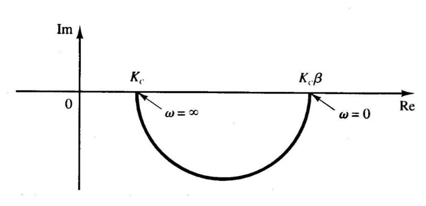

根据波特图发现滞后矫正器本质是一个低通滤波器，存在一个$20(\lg\frac{1}{\beta T} - \lg\frac{1}{T})=-20\lg\beta$的下降，这就是用来重新确定增益交界频率的，也就是将**增益交界频率向低频处移动**，这样会**降低系统的带宽**，导致**瞬态响应变差**，但结果是增大了相位裕量

其主要作用是在**高频段造成衰减**，使系统获得足够的相位裕量

但是由于滞后矫正本身会引入一个相位滞后，因此在设计时要多加5°-12°的裕量

且为了防止滞后的相位的影响，配置的0极点必须要至少**远离**新增的**增益交接频率10倍频**

#### 5.10.3 滞后-超前矫正

先滞后，后超前
$$
G_c(s) = K_c\frac{\beta}{\gamma}\left( \frac{T_1s+1}{\frac{T_1}{\gamma}s+1} \right)\left( \frac{T_2s+1}{\beta T_2s+1} \right)\,\,,\,\, \gamma,\beta >1
$$
可选$\gamma = \beta$

#### 5.10.4 三者的比较

**超前矫正**

* 主要用于改善稳定裕量
* 系统带宽更大，瞬态响应好
* 但对高频噪声更敏感
* 需要附加的增益增量来补偿超前网络的衰减

**滞后矫正**

* 通过高频衰减特性进行增益交接频率的重新确定，来改善相位裕量
* 系统带宽更小，瞬态响应变差
* 降低了高频增益，系统的总增益可以变大，低频的增益可以变大，系统的稳态精度更好

**滞后-超前矫正**

* 瞬态响应快，稳态精度高
* 低频增益变大，带宽百年大，稳定裕度也变大

#### 5.10.5 不希望极点的抵消

通过串联0点，但是

* 几乎不可能完全抵消
* 未完全抵消的0极点产生一个**持续时间长，幅度很小**的瞬态响应分量

## 6 控制系统的状态空间分析

### 6.1 传递函数的状态空间表达式

系统可以表达为
$$
y^{(n)} + a_1y^{(n-1)} + \ldots+ a_{n-1}y^{(1)} +a_ny = b_0u^{(n)} + b_1u^{(n-1)} +\ldots+b_{n-1}u^{'} +b_nu
$$
那么传递函数就是
$$
G = \frac{Y}{U} = \frac{b_0s^n+b_1s^{n-1}+\ldots+b_{n-1}s+b_n}{s^{n}+a_1s^{n-1}+\ldots+a_{n-1}s+a_n}
$$
注意上下是齐次的，否则需要添0

存在以下几个标准型

**可控标准型**

可控性：在有限时间内，系统输入无约束的$u$，$x(t_0)$变化为$x(t^{'}_0)$

形如

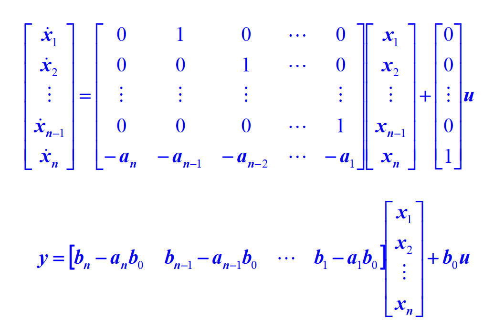

的状态空间方程，称为可控标准型

**可观测标准型**

可观测性：$x(t_0)$在有限时间内可由输出的观测值确定

形如

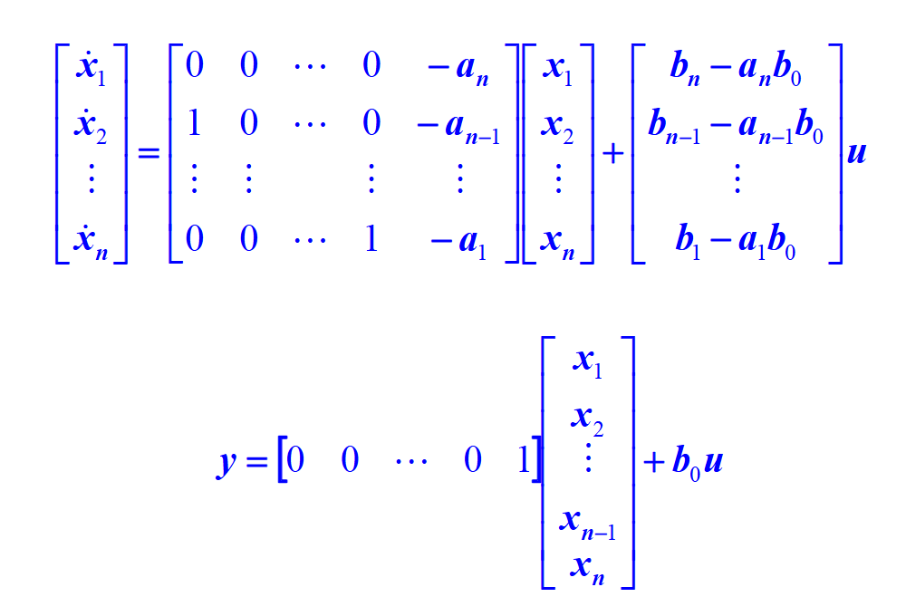

的状态空间方程，称为可观测标准型

不难发现，二者的系数矩阵存在以下关系
$$
A_2 = A_1^{T}\\
B_2 = C_1^{T}\\
C_2 = B_1^{T}\\
D_2 = D_1
$$
这个性质称为对偶性

**对角线标准型**

将传递函数化为
$$
G = b_0 + \sum\frac{c_i}{s+p_i}
$$
那么

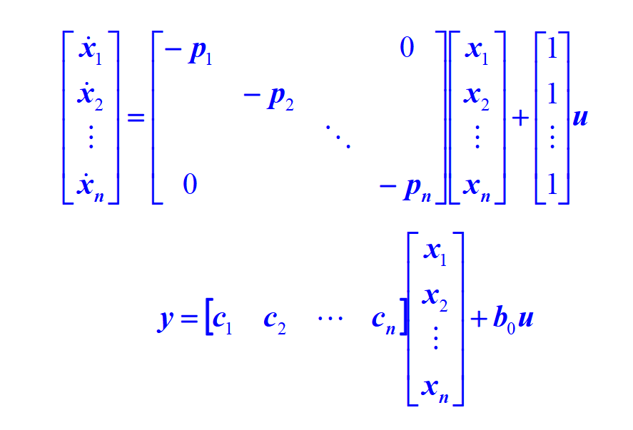

### 6.2 定常系统的状态空间方程的解

从本节开始，对符号做出区分：小写的字母一律为时域标量，如$x$；大写的字母不带变量/带$t$一律为时域向量/矩阵，如$A,X(t),X(0)$；大写字母带变量$s$的一律为Laplace变换，如$X(s)$，至于是否为矩阵/向量，看上下文。

#### 6.2.1 齐次方程

形如
$$
\dot{X} = A X
$$
的状态空间方程的解，不加证明的给出
$$
X = e^{At}X(0)
$$
其中$X$是列向量，$A,e^{At}$都是矩阵

解的过程使用了拉普拉斯变换
$$
(sI-A)X(s) = X(0)\Rightarrow X(s) = (sI-A)^{-1}X(0)
$$
不加证明给出
$$
\mathcal{L}^{-1}\{(sI-A)^{-1}\} = e^{At}
$$

$e^{At}$有以下的性质

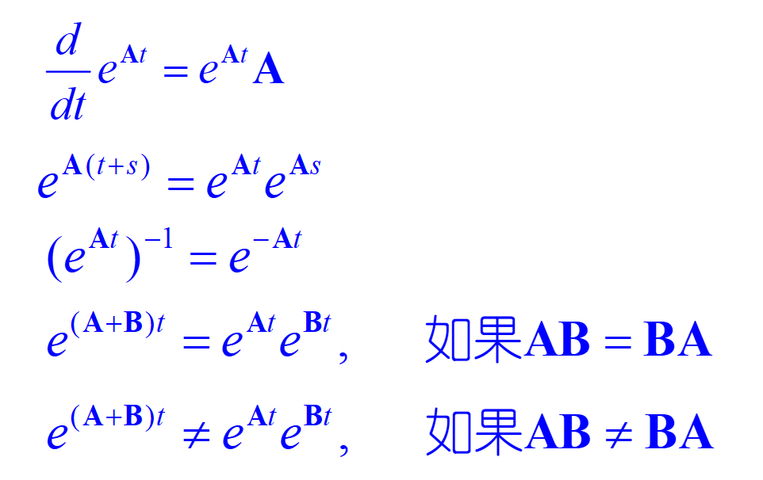

将系统的状态用初始值表达
$$
X = \Phi X(0)
$$
那么
$$
\Phi(t) = e^{At}
$$
称$\Phi$为系统的状态转移矩阵，包含系统自由运动的所有信息；方程的解仅仅是状态的转移

#### 6.2.2 非齐次方程

形如
$$
\dot{X} = AX + BU
$$
做拉普拉斯变换
$$
(sI-A)X(s) = X(0)+BU(s)
$$
得到
$$
X(t) = e^{At}X(0)+e^{At}*BU(t)=\Phi(t)X(0)+\int^t_0\Phi(t-\tau)BU(\tau)d\tau
$$
若是在$t_0$时刻q起始，则
$$
X(t)=\Phi(t-t_0)X(t_0)+\int^t_{t_0}\Phi(t-\tau)BU(\tau)d\tau
$$
进一步打开卷积，不加证明的
$$
X(t) = e^{At}X(0)+A^{-1}(e^{At}-I)BU(t)
$$

### 6.3 可控性和可观测性

对于系统
$$
\dot{X}_{n\times 1} = A_{n\times n}X_{n\times1}+B_{n\times m}U_{m\times 1}\\
Y_{s\times 1} = C_{s\times n}X_{n\times 1}+D_{s\times m}U_{m\times 1}
$$

#### 6.3.1 可控

如果在$t_0\leq t\leq t_1$内，施加一个**无约束**的控制信号，系统能从初始状态转移到**任意**终止状态，称系统在$t=t_0$可控；如果对于$\forall t_0$，系统**可控**，称为系统为**状态完全可控**

**状态完全可控的充要条件**

先说结论：当且仅当向量组
$$
[B, AB, \ldots,A^{n-1}B]_{n\times nm}
$$
行满秩时，系统完全可控，该矩阵称为可控性矩阵

**证明**

设终止状态为$X(t_1)=0$，对于任意的$X(0)$都能够达到这个状态，那么将其代入6.2.2节的方程中，得到
$$
X(0)=-\int^{t_1}_0e^{-At}BU(t)dt
$$
将$e^{-At}$展开为
$$
e^{-At} = \sum_{k=0}^{n-1}a_k(t)A^k
$$
那么
$$
X(0) = -\sum_{k=0}^{n-1}A^kB\int_0^{t_1}a_k(t)U(t)dt=-[B,AB,\ldots,A^{n-1}B][\int_0^{t_1}a_k(t)U(t)dt]^{T}
$$
那么为了能够表达所有的$X(0)$，可控性矩阵必须满秩

**输出完全可控的充要条件**

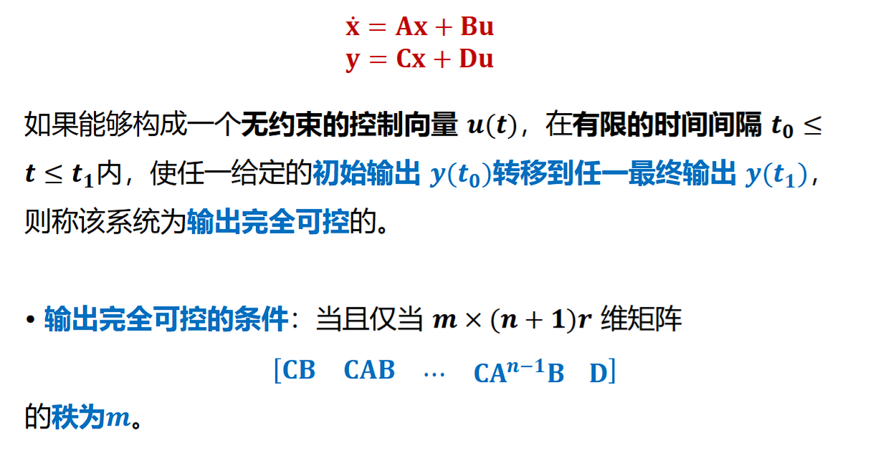

这是直接截的图，放在本文档的语境下，这是一个$s\times m(n+1)$维矩阵，充要条件为其是行满秩

**不可控制系统**：包含一种物理上与输入量不相连接的子系统，存在部分状态变量不受控制

如果一个不可控制系统的**不可控**模块是**稳定**的，**不稳定**的模块是**可控**的，那么这个系统**可稳定**

**利用A矩阵判断系统稳定性**

* 计算A的特征值$|sI-A|=0$，如果所有特征值的实部小于0，那么稳定

  原因在于，$|sI-A|=0$就是闭环传递函数的特征方程

* 求出传递函数/矩阵，利用劳斯稳定判据

#### 6.3.2 可观测

如果**每一个状态**$x_i(t_0)$都可以通过在有限时间$t_0\leq t \leq t_1$内由**输出量**$y(t)$的观测值确定，称系统为**完全可观测**

很显然当每一个状态分量$x_i$都影响输出$Y_{s\times 1}$时，系统完全可观测

**状态完全可观的充要条件**

先说结论：当且仅当向量组
$$
\left[\begin{matrix}
C\\
CA\\
\ldots\\
CA^{n-1}
\end{matrix}\right]_{sn\times n}
$$
列满秩时，系统完全可观，该矩阵的**转置**称为可观测矩阵

**证明**

忽略输入，仅看状态变量
$$
Y = CX = Ce^{At}X(0) = \sum_{k=0}^{n-1}a_kCA^kX(0)=[a_kX(0)]\left[\begin{matrix}
C\\
CA\\
\ldots\\
CA^{n-1}
\end{matrix}\right]
$$
为了满足每个状态变量都有独立的影响，可观测矩阵必须列满秩

**可检测性**

对于一个**局部可观测**系统，如果其**不可观测**的状态是**稳定**的，其**可观测**的状态是**不稳定**的，那么这个系统**可检测**

**可检测与可稳定互为对偶**

## 7 控制系统的状态空间设计

### 7.1 控制器的极点配置

相比于根轨迹法只能确定主导极点，极点配置可以把**所有的闭环极点**配置到想要的位置

**几个假设**

* 系统完全可观测
* 如果系统状态完全可控，那么通过状态反馈增益矩阵就行
* 系统是单输入单输出
* 参考输入为0

#### 7.1.1 状态反馈法

此方法要求系统完全可控

选取控制信号为
$$
u = -K_{1\times n}X_{n\times 1}
$$
即控制信号由瞬时状态决定，系统如下

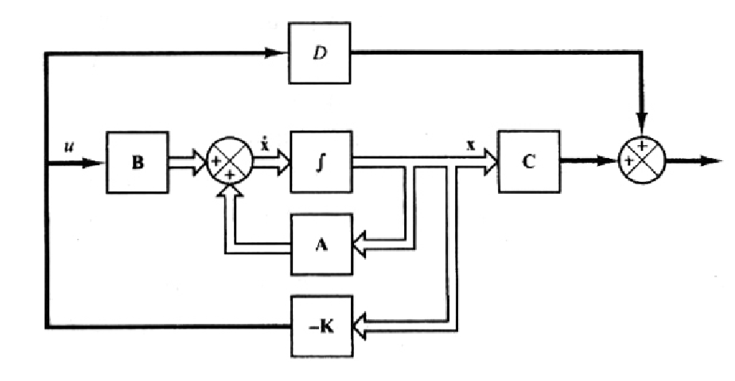

这个闭环系统没有输入量，参考输出也为0，最终的目的就是输出量为0

如果调节参考输入为**常数**，则这样的系统是**调节器系统**

如果会**时变**，则是**控制系统**

将控制信号带入状态空间方程，得到
$$
\dot{X}(t) = (A-BK)X(t)
$$
那么得到
$$
X(t) = e^{(A-BK)t}X(0)
$$

* 矩阵$A-BK$的特征值为调节器的**极点**
* 如果这些极点都在$s$平面的左半边，则当$t\rightarrow\infty$时，系统状态$x_i=0$
* 将调节器极点（也就是闭环极点）配置到所期望的位置，就是极点配置问题

#### 7.1.2 任意配置极点

能够任意配置极点的充要条件是：**系统状态完全可控**

证明略，有两种方法配置$K$

**变换矩阵T**：一般用不到

1. 检验系统的可控性，若不可控，那没得谈

2. 根据$|sI-A|=s^n+a_1s^{n-1}+\ldots+a_{n-1}s+a_n$确定原始系统的闭环极点和$a_i$的值

3. 求解变换矩阵$T=M_{n\times n}W_{n\times n}$，其中
   $$
   M = [B, AB, \ldots,A^{n-1}B]_{n\times n}\\
   W = 
   \left[\begin{matrix}
   a_{n-1},a_{n-2},\ldots,a_1,1\\
   a_{n-2},a_{n-3},\ldots,1,0\\
   \ldots\\
   a_1,\,\,\,1,\,\,\,\,\ldots\,\,\,\,\,\,,0\,\,\,\,\,,0\\
   1,\,\,\,\,0,\,\,\,\,\ldots\,\,\,,0\,\,\,\,0
   \end{matrix}\right]
   $$

4. 利用期望的极点配置$\Pi(s-p_i)=s^n+b_1s^{n-1}+\ldots+b_{n-1}s+b_n$得到$b_i$的值

5. 确定增益矩阵
   $$
   K = \left[ b_n-a_n,b_{n-1}-a_{n-1},\ldots,b_2-a_2,b_1-a_1\right]_{1\times n}T^{-1}_{n\times n}
   $$

值得一提，当原系统是可控标准型时，$T=I_{n}$

**直接带入**

对于低阶的系统有效

1. 检验系统的可控性

2. 假设增益矩阵是$K=[k_1, k_2,k_3]_{1\times 3}$

3. 更改后的系统的闭环传递函数的特征方程应该是
   $$
   |sI-A+BK|=0
   $$
   其中$BK_{n\times n}$

4. 利用
   $$
   |sI-A+BK| =\Pi(s-p_i)=s^n+b_1s^{n-1}+\ldots+b_{n-1}s+b_n
   $$
   来直接确定$k_i$的值

$k_i$越大，代表响应速度越大，所需要的能量也越大；实际系统中需要折衷考虑

### 7.2 状态观测器

思路和卡尔曼滤波一样

实际情况中不是所有的状态变量都可以用来反馈，需要用状态观测器估计（观测）不可用的状态变量

如果一个观测器能观测所有的状态变量，则称其为全阶状态观测器，对应于降阶和最小阶

能够设计状态观测器的充要条件是：**系统满足可观测条件**

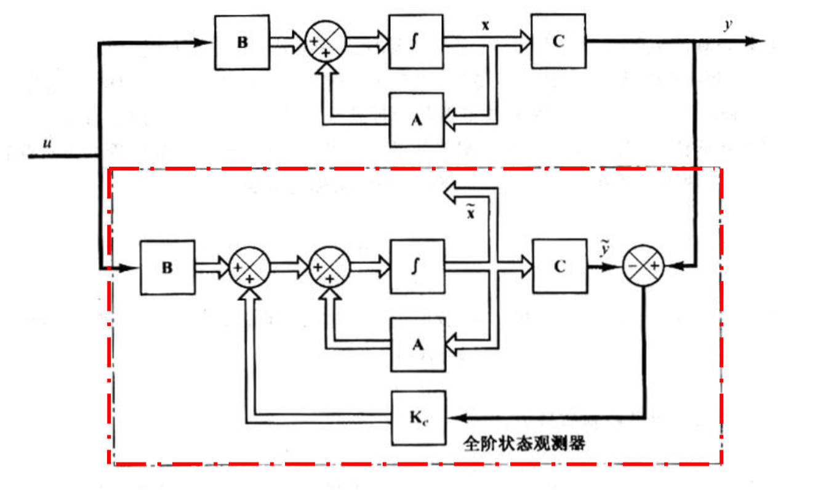

红框中的就是一个全阶状态观测器，基本思路如下

1. 使用状态变量的观测/估计值$\tilde{X}$代替$X$进行计算，得到的状态空间为
   $$
   \dot{\tilde{X}} = A\tilde{X}+Bu+K_e(y-\tilde{y})\\
   \tilde{y} = C\tilde{X}
   $$
   其中$K_{e\,\,{n\times 1}}$是观测器的配置增益

2. 结合系统的状态方程，得到
   $$
   \dot{X}-\dot{\tilde{X}} = (A-K_eC)(X-\tilde{X})
   $$

3. 令$E=X-\tilde{X}$，那么
   $$
   \dot{E} = (A-K_eC)E
   $$

4. $E$的解就是上面极点配置的问题，如果系统完全可观测，那么$A-K_eC$将具有任意的特征值，也就是极点

   对这句话的解释：将$(A-K_eC)$取转置，秩不变，得到$(A^T-C^TK_e^T)$，根据可观和可控的对偶性，这就是对偶系统的可控，那么就是本系统的可观

5. 由于$E$是观测量和实际值的误差，当然希望$E=0_{n\times 1}$，$k_{ei}$越大越好

   但是一般而言，实际系统存在噪声，故这是一个抗干扰和快速响应的trade-off

配置方法同7.1.2，不赘述；是根据观测器的期望闭环极点配置的

### 7.3 控制器-观测器系统

#### 7.3.1 控制和观测的独立性

一个完全可控和完全可观的系统，使用基于观测的状态变量进行极点配置，即
$$
u=-K_{1\times n}\tilde{X}
$$
那么
$$
\dot{X} = AX-BK\tilde{X} = (A-BK)X+BK(X-\tilde{X})=(A-BK)X+BKE\\
\dot{E} = (A-K_eC)E
$$
那么状态空间为
$$
\left[\begin{matrix}
\dot{X}\\
\dot{E}
\end{matrix}\right]

=
\left[\begin{matrix}
A-BK,\,\, BK\\
0,\,\,\,\,\,A-K_eC
\end{matrix}\right]
\left[\begin{matrix}
X\\
E
\end{matrix}\right]
$$
那么特征方程为
$$
\left|\begin{matrix}
sI-A+BK,\,\,\, -BK\\
0\,\,\,,\,\,\, sI-A+K_eC
\end{matrix}\right| = 0\Rightarrow|sI-A+BK|\cdot|sI-A+K_eC|=0
$$
根据行列式的性质，二者各自为0

也就是控制器和观测器是独立的，互不影响

#### 7.3.2 控制器-观测器的传递函数

系统完全可测量，但是不能直接测量，即
$$
\dot{X} = AX+Bu\\
y=CX\\
u=- K\tilde{X}
$$
观测器方程为
$$
\dot{\tilde{X}} = (A-K_eC)\tilde{X}+Bu+K_ey\\
\Rightarrow  \tilde{X} = (sI-A+K_eC+BK)^{-1}K_eY
$$
那么系统的闭环传递函数的倒数（自身不好表示，但是倒数好表示）就是
$$
\frac{U(s)}{Y{(s)}} = \frac{-K\tilde{X}}{Y(s)}=-K(sI-A+K_eC+BK)^{-1}K_e
$$
很显然这个要是串联那么设计起来会非常麻烦，故实际中一般都是并联的系统

### 7.4 最小阶观测器

如果$y$仅仅是$m$个状态变量的线性组合，那么余下的$n-m$个变量需要估计，需要一个$n-m$阶的降阶观测器

这个$n-m$的观测器就是最小阶观测器

## 8 课程总结

这部分内容是给判断题用的，比较琐碎的知识点

### 8.1 整体框架

将整门课分为对系统的瞬态/稳态性能分析

**瞬态**：侧重速度

* 响应速度
  * 无阻尼自然频率$\omega_n$
  * 上升时间$t_r$
  * 峰值时间$t_p$
  * 调整时间$t_s$
  * 谐振频率$\omega_r$
  * 带宽
* 振荡模式，也就是相对稳定性
  * 阻尼比$\zeta$
  * 最大超调量$M_p \%$
  * 相位裕量
  * 增益裕量
  * 谐振峰值$M_r$

**稳态**：侧重稳定

* 绝对稳定性：只有不/稳定两种
  * 在$s$平面上，根据闭环极点是否都在左半平面判断
  * 劳斯稳定判据，根据特征方程判断
  * 奈奎斯特稳定判据，$Z = N + P$，看是否顺时针过$-1+j0$
* 稳定误差：稳定状态下的精确性
  * $e_{ss}=\lim\limits_{s\rightarrow 0} sE_{ss}(s) = \lim\limits_{s\rightarrow\ 0} \frac{sX}{1+GH}$
  * 以下三个量是在单位负反馈系统中描述的：静态位移/速度/加速度常数：$K_p, K_v, K_a$

### 8.2 矫正的特点和作用

还是建议配合4.4节和5.10节一起看，不需要会矫正，但得直到每一条性质怎么来的

#### 8.2.1 增加0/极点的影响

**加极点**：极点一定加在左半平面；会导致根轨迹右移，主导极点实部变大，调整时间增加

**加0点**：根轨迹左移，主导极点实部变小，调整时间更小；增益$K$能更大，相对稳定性提高

#### 8.2.2 超前矫正

* 使用目的：为了找到满意的闭环极点，提高系统的瞬态响应性能；改善稳定裕度（增加相位裕度）
* 0/极点配置：极点在左，0点在右
* 需要提供新的主导极点，本质是高通Filter
* 增益交界频率右移，相位裕度减小（副作用，列举这条的目的是说明设计时增加的相位裕度需要考虑这个减小的量）；同时系统的带宽变大，瞬态响应变好（与$\zeta$反比），但是高频噪声的干扰也会变大
* 在增益交界频率附近，相角变化很快，那么不能使用，因为无法在右移时留出足够大相位裕度
* 需要附加增益（$|G|\approx K_c\alpha$）
* 如PD控制器

#### 8.2.3 滞后矫正

* 使用目的：减小稳态误差，提高稳态响应性能；重新确定增益交界频率（高频衰减），改善相位裕量
* 0/极点配置：极点在右，0点在左，要求二者接近且接近原点
* 需要保证主导极点不变，本质是低通Filter
* 增益交界频率左移，相位裕度变大；但是系统的带宽会减小，瞬态响应变差
* 降低高频增益，使得低频的增益可以适当放大，系统的精度提高
* 如PI控制器

#### 8.2.4 滞后-超前矫正

* 同时结合上面二者的优点，但是很难调
* 瞬态响应快，稳态精度高
* 低频增益变大，带宽变大，稳定裕度也变大
* 如PID控制器

### 8.3 一些tips

* 外部扰动是输入量
* 方程输出阶次必须大于等于输入阶次，否侧不因果
* $H(0)$是系统的放大系数/增益，表示系统处于静态时的增益
* 线性系统的输入只会影响稳态输出
* 两个二阶系统有相同的$\zeta$，则超调量和震荡模式相似，具有相同的相对稳定性
* 响应类型由闭环极点决定，响应形状由闭环零点决定；可以忽略留数很小的项，近似为低阶系统；当二阶系统的$\zeta$很大时，可以只保留大的极点，近似为一阶系统
* 期望$0.4\leq \zeta \leq 0.7$，当$0\leq \zeta\leq 0.6$时，$\zeta = \gamma/100$，其中$\gamma$是相位裕度
* 积分控制使输出振荡；微分控制使输出变快
* 最小相位系统的相频响应变化最小
* 条件稳定的非最小相位系统，奈奎斯特图一定包围$-1+j0$
* 带宽与$\zeta$反比，与响应速度正比
* 剪切率反应系统的抗干扰能力，越大，一般而言，系统的谐振峰值越大，稳定裕度越小
* 开环响应的各种图反应了什么：
  * 在低频区（远低于转角频率），表征闭环系统的稳态特征
  * 在中频区（靠近$-1+j0$），表征闭环相对稳定性
  * 在高频区，表征系统的复杂性
* 系统的状态转移矩阵$\Phi = e^{At}$反应了系统自由运动的所有信息，方程的解仅仅是状态的转移
* 控制器的极点配置前提是状态完全可控，控制器的$k_i$越大，表示需要的能量也越大，需要trade-off
* 状态观测器的前提是系统状态完全可观，$k_{ei}$越大，误差越小，但是噪声放大也越大，需要trade-off
* 控制器-观测器系统中，二者是独立的；实际中一般用并联系统，设计简单