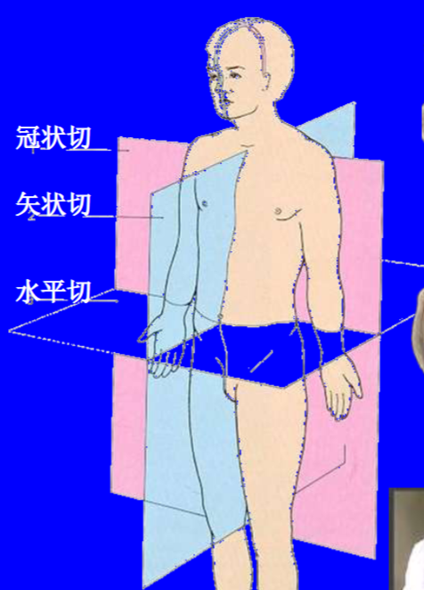
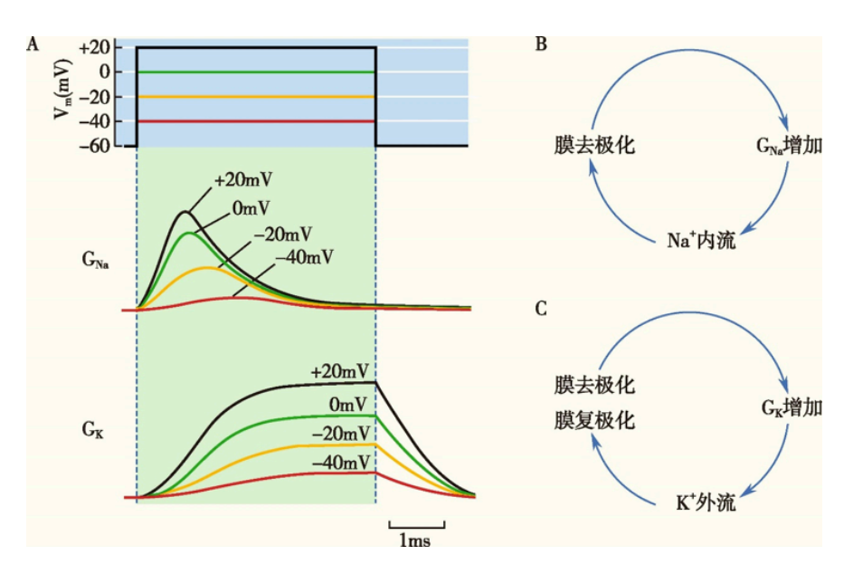
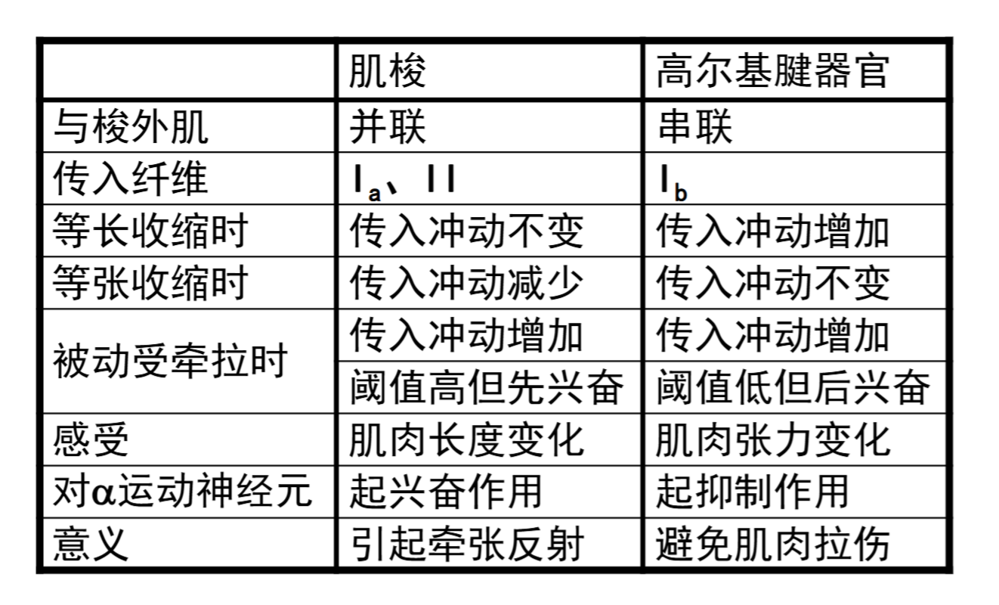

# 解剖与生理 1

## 1 绪论

### 1.1 解剖学
**解剖学中人体的轴**

分为**矢状轴、冠状轴、垂直轴**

### 1.2 生理学

#### 1.2.1 体液

占体重60%（细胞内液40%，细胞外液20%）

细胞外液分为**组织液、血浆、淋巴液**和脑脊液（内环境）

**稳态**

内环境的各项理化性质的相对恒定或动态平衡

稳态是维持正常生命活动的必要条件，稳态的维持是机体**自我调节**的结果

#### 1.2.2 生理功能的调节

**神经调节**

基本方式——**反射**

反射的结构基础——**反射弧**

**体液调节**

全身性体液调节：循环**激素**、其他化学因子、神经激素

局部性体液（代谢物质）调节：**旁分泌**、**自分泌**

**自身调节**

是组织、细胞本身的特性，**不依赖神经/体液调节**；调节能力相对**弱**

 

**直接调节**

典型例子，甲状腺激素在血液中含量正常，但是有甲亢症状，是甲状腺激素直接作用细胞

#### 1.2.3 体内的控制系统

**负反馈控制**

意义：维持体内各种稳态

缺点：波动性强，有明显滞后性

**正反馈控制**

意义：加速某一生理过程完成

**前馈控制**

通过某些捷径预判进行控制

#### 1.2.4 生命活动的基本特征

1. 新陈代谢：最基本的生理特征，包括**物质**代谢和**能量**代谢
2. 兴奋性：刺激，反应，可兴奋组织，兴奋，阈值，兴奋度
3. 适应性：生理性适应和行为性适应
4. 生殖
5. 衰老：结构成分的老化，细胞数减少，器官功能下降，机能改变，适应力下降

### 问题

那些因素可以影响内环境稳态？

细胞代谢、环境温度变化、饮食中的营养成分、情绪变化等

老年患者的体位性低血压是因为什么调节发生了障碍？

神经-体液调节

高血压患者服用降压药后，血压下降至正常范围，但随后出现头晕乏力等，可能是因为？

血压维持稳定的调节，神经调节，体液调节，负反馈调节

神经体液调节的例子

身体颤栗，体位性低血压慢慢恢复，饥饿导致的血糖下降在进食后慢慢升高

内环境最活跃的成分

血浆

## 2 细胞的基本功能

### 2.1 细胞膜的基本结构

#### 2.1.1 磷脂双分子层

细胞的**热力学稳定性**和**流动性**来源

#### 2.1.2 蛋白质

分为表面蛋白（酶，骨架蛋白）和整合蛋白（通道，载体）

氨基酸是**左旋**的

#### 2.1.3 糖类

糖链作为分子标记 （抗原或受体）

自然界的糖是**右旋**的，能被生物利用的糖是自然界的糖

### 2.2 物质的跨膜运输

**不耗能**：单纯扩散，易化扩散

**耗能**：主动转运，膜泡运输

#### 2.2.1 单纯扩散

**脂溶性小分子**或**不带电的极性分子**由高浓度转运到低浓度

大的极性分子和带电荷的无机离子无法单纯扩散

#### 2.2.2 易化扩散

难溶于脂的物质，借助膜上的特殊蛋白质进行扩散，分为**经通道**和**经载体**

**经通道**

特征：离子选择性，门控特性

通道分类：电压（膜电位达到阈值），化学（与特定受体结合），机械（受牵拉扩张）

钙依赖性钾通道：细胞内有钙离子结合位点，当细胞缺钙时，通道关闭，对钾离子的通透性减小，血钾降低

反之血钾升高；但是，正常情况下钙通道由电压调控，当钾离子通透性减小时，电位升高，钙通道激活，负反馈，反之也成立。

经钙通道流入细胞的Ca2+成为触发或激活许多生理过程的关键因素，故没有其他表现就不是钙通道出问题了

例：使用乌本苷、地高辛作为强心剂，能抑制钠钾泵的活性从而加强心肌收缩，其原理是？

解：经通道的钙可以加强肌肉活性，抑制了钠钾泵，细胞内钠离子变多，Na-Ca交换通道效率变高，内流的Ca变多

**经载体**

特征：结构特异性，会饱和，存在竞争性抑制

#### 2.2.3 主动转运

分为**原发性**和**继发性**

**钠钾泵**

也叫钠泵，是钠钾ATP酶，当膜内钠离子浓度升高或膜外钾离子浓度升高时激活，消耗**一个ATP**，**运走3个Na+**，**运进2个K+**

例：用抑制剂抑制钠泵活性，可能会出现？

1. 细胞水肿
2. K+内运增多
3. Na+外运增多
4. 细胞膜超极化
5. 细胞容积变大

解：钠泵转出3个，转入2个，导致细胞内离子浓度降低；抑制活性后细胞内离子变多，吸水膨胀，容积变大，**1和5正确**；抑制后细胞内K+浓度下降，不可能超极化，234错误

**继发性主动转运**

利用原发性主动转运建立的膜两侧电化学势能，完成逆浓度梯度跨膜运输

根据转运方向分为**同向转运**和**反向转运**

例：Na+-葡萄糖/氨基酸同向转运，Na+-H+交换，Na+-Ca2+交换（正常时3Na进1Ca出，某些原因可以反转），甲状腺腺泡上皮细胞聚碘，肾小管对葡萄糖的重吸收（就是前面的Na+同向转运）

例：腹泻患者口服糖盐水的目的

解：利用Na+-葡萄糖同向转运，快速补充盐分，促进吸收

#### 2.2.4 膜泡运输

分为**出胞**和**入胞**

大分子物质，与膜系统有关

如：肾小管对蛋白质的重吸收

### 2.3 跨膜信号转导

信号转导：针对外源信息所发生的细胞应答反应全过程

外界信号——>细胞膜表面——>膜蛋白构象改变——>新的信号进入胞内——>膜电位或其他功能变化

**转导方式**

1. 离子通道
2. G蛋白耦联受体
3. 酶联型受体
4. 招募型受体
5. 核受体（胞内）

1-4为膜受体

### 2.4 生物电现象

#### 2.4.1 离子平衡电位

根据Nernst方程 $E_x=\frac{RT}{ZF}\ln{\frac{[X^+]_o}{[X^+]_i}}$，单位V，其中Ex为离子X+的平衡电位，R为气体常数，T为绝对温度，F为法拉第常数，Z为原子价，带入哺乳动物，得到
$$
E_x=\frac{61.5}{Z}\ln{\frac{[X^+]_o}{[X^+]_i}}(\mathsf{mV})
$$

#### 2.4.2 细胞膜电路模型

得到
$$
I=C_mV+g_{Na}hm^3(V-V_{na})+g_Kn^4(V-V_K)+G_L(V-V_L)
$$

#### 2.4.3 细胞膜静息电位

**计算静息电位**
$$
E_m=\frac{P_K}{P_K+P_{Na}}E_K+\frac{P_{Na}}{P_K+P_{Na}}E_{Na}
$$

其中P为离子的跨膜速率，Pk>>PNa，Em≈Ek

**静息电位的形成机制**

静息状态下对**K**有通透性，Na的通透性小；钠钾泵的生电活动造成离子的浓度差

膜两侧的电位差仅存在于内外表面之间

#### 2.4.4 动作电位及其产生机制

这是一个典型动作电位随时间的变化，各个阶段的名称是比较老的

**峰电位**由动作电位的**去极相**和**复极相**组成，是动作电位的**主要部分**

在峰电位之后的缓慢电位变化是**后电位**，分为**去极化电位**和**正后电位（后超极化电位）**

**离子的电化学驱动力**

电化学驱动力 = 膜电位 - 离子平衡电位 = $E_m - E_x$

利用电压钳技术将膜电位固定在一定水平，则离子的电化学驱动力不变，记录离子X的跨膜电流Ix，由公式$G_x=\frac{I_x}{E_m-E_x}$得到离子的跨膜电导，也就是**通透性变化**

超射值与$E_{Na}$接近

**电压钳制后钠钾离子的膜电导变化**

Na通道在动作电位后有CD，不能一直开放

K通道一直开放，无论去极化还是复极化（存在K漏通道，不是复极化主要原因）

复极化过程中Na电导快速下降是主要因素

**河豚毒素（TTX）**

阻断钠通道，无法去极化产生动作电位，膜电流恒正

静息电位不变

**四乙胺（TEA）**

阻断钾通道，无法极化形成静息电位，膜电流恒负

**动作电位产生机制**

1. 细胞膜去极化至**阈值电位**，引起电压门控Na通道开放，Na顺浓度梯度**正反馈**流入，直至膜电位达到Na平衡电位
2. Na通道迅速失活，电压门控K通道开放，是复极化的主要原因
3. 钠钾泵的活动，使离子分布复位

**动作电位的传播**

1. 无髓神经纤维：局部电流，连续传导，大小不会变
2. 有髓神经纤维：被施万细胞包裹，没有包裹的地方是朗飞结，兴奋在相邻的朗飞结跳跃式传导，大小不会变
3. 全或无：同一个细胞的动作电位大小在传导过程中**不会变化**

例：病理性影响钠钾泵活动时，将导致？

解：病理性就默认时活动减弱，将导致静息电位绝对值降低，动作电位幅度减小

例：根据Nernst方程$E_x=61.5\lg\frac{[X]_o}{[X]i}$，已知静息电位为-90mV，离子浓度

| 离子类型 | 胞外浓度（mM） | 胞内浓度（mM） |
| :------: | :------------: | :------------: |
|    Na    |      145       |       12       |
|    K     |       4        |      155       |

1. 计算正常的Na和K平衡电位
2. 高钾血症（胞外浓度6.5mM）的患者K的平衡电位，此时细胞静息电位发生和细胞兴奋性的变化

解：

1. $E_{Na}=61.5\lg\frac{145}{12},E_{K}=61.5\lg{\frac{4}{155}}$

2. $E_K^{'}=61.5\lg\frac{6.5}{155}$，静息电位升高（绝对值降低），发生去极化，细胞的兴奋性增强，患者易抽搐

   但是严重高钾血症时，静息电位接近阈电位，使Na通道失活（电压门控），细胞兴奋性反而降低

   急性低钾血症时，细胞内外钾离子浓度差变大，但是低钾使心肌细胞膜的钾电导**降低**，K外流减少，静息电位绝对值变小，兴奋性增高

总结就是，高钾血症时，静息电位升高，细胞的兴奋性**先升高后降低**，急性低钾血症时，静息电位**升高**，细胞的兴奋性**升高**

#### 2.4.5 细胞兴奋后兴奋性的变化

**绝对不应期**：无论多大刺激，都不能再产生任何大小的动作电位，兴奋性为0

**相对不应期**：高于阈强度的刺激能够引起动作电位，但是细胞兴奋性低于正常水平，动作电位也小于正常值

**超常期**：阈下刺激就能引起动作电位，细胞兴奋性高于正常

**低常期**：一段较长时间的低兴奋性

#### 2.4.6 电紧张电位和局部电位

**电紧张电位**

在外加电流作用下，引起细胞膜固有电位的被动改变

电紧张电位的空间分布由细胞膜和胞质的被动电学特性（电导）决定

**局部电位**

**阈下**刺激引起的**产生于局部、较小**的去极化膜电位变化为局部兴奋，此时的膜电位是局部电位

是由阈下刺激产生的**去极化电紧张电位**和**部分Na通道开放**产生的电位变化叠加的结果

**局部电位特点**

1. 衰减性传导，随距离增加而迅速衰减
2. 空间总和，邻近的局部电位可以叠加
3. 时间总和，相临时间的局部电位可以叠加
4. 不是“全或无”

例：具有局部兴奋特征的是：神经干的动作电位；锋电位；终板电位；突触后电位；发生器电位。

解：终板电位，突触后电位和发生器电位

## 3 人体的基本组织和功能

### 3.1 肌组织

#### 3.1.1 肌组织的组成

主要是肌细胞，细胞间有少量的结缔组织，血管，淋巴管和神经

**特殊名词**

肌细胞：肌纤维

细胞膜：肌膜

细胞质：肌浆，其中的平行排列的**肌原纤维**是肌纤维舒缩的主要物质基础

**分类**

1. 根据形态学
   1. 横纹肌
   2. 平滑肌
2. 根据神经支配性
   1. 躯体神经支配：随意肌
   2. 自律神经支配：非随意肌
3. 根据功能特点
   1. 骨骼肌
   2. 心肌
   3. 平滑肌

#### 3.1.2 骨骼肌的精细结构

**肌节**

**肌节**：相邻的两条z线之间的一段横纹肌肌原纤维，是骨骼肌纤维的**基本结构**和收缩舒张的**功能单位**

肌节 = 1/2 明带（I带） + 暗带（A带） + 1/2 明带

在收缩舒张过程中，暗带**长度不变**，明带和H带**在收缩时缩短，在舒张时伸长**

**肌管系统**

**横管**：T管，是肌膜向肌浆内凹陷形成的管状结构，垂直于肌纤维长轴，**迅速同步肌膜的兴奋到肌纤维内部**

**肌质网**：L管，特化的滑面内质网，分为**纵管**和**终池（JSR）**，可以浓缩，储存，释放Ca2+

**三联管**：耦联膜动作电位和肌原纤维收缩的关键部位，由**两个终池夹着一个横管**构成

例：骨骼肌纤维收缩的肌节变化是

解：细肌丝滑入暗带，明带变窄

**骨骼肌的收缩机制**

肌丝滑行理论：细肌丝向肌节中央粗肌丝内滑行

1. 相邻的Z线靠近，**肌节变短**
2. **暗带长度不变**，粗肌丝长度不变
3. Z线到H带边缘长度不变，恒**等于细肌丝长度**
4. 明带和H带变窄

例：肌细胞收缩的说法正确的是：

​		A肌原纤维的缩短是肌小节的收缩

​		B肌原纤维的缩短是细胞内肌丝本身的卷曲

​		C肌原纤维的缩短是细肌丝在粗肌丝之间的滑行

​		D当肌肉被动拉长时明带长度增大

​		E肌小节变为最短时，即使肌细胞缩短的最大限度

解：ACDE

**骨骼肌的兴奋收缩耦联**

电变化的兴奋和肌丝滑行的收缩的中介过程

1. 肌膜电兴奋传导：肌膜产生AP（动作电位），AP由横管迅速传向肌细胞深处，达到三联管和肌小节附近
2. 三联管信息传递：AP激活横管膜和肌膜上的L型Ca2+通道，通过**变构**或**Ca2+内流（心肌）**，使终池膜上的Ca2+释放通道开放
3. 肌质网中Ca2+的释放：**终池内Ca2+顺浓度梯度进入肌浆**，触发肌丝滑行，肌细胞收缩

**Ca2+是骨骼肌兴奋-收缩耦联的耦联物**

**骨骼肌舒张过程**

1. 肌膜电位复极化
2. **终池对Ca2+通透性下降**，肌质网膜Ca2+泵激活（主动转运回终池）
3. **胞质Ca2+下降**
4. Ca2+与肌钙蛋白解离
5. 原肌球蛋白覆盖肌动蛋白横桥结合位点
6. 骨骼肌舒张

#### 3.1.3 神经-肌肉接头处兴奋的传递

接头前膜：囊泡内含有ACh（乙酰胆碱），以囊泡为单位释放（量子释放）

接头间隙：50-60nm

接头后膜：又称**终板膜**，存在ACh/N2受体，与ACh特异性结合，没有电压门控钠通道

终板区：整个神经-肌肉接头

**兴奋的传递过程**

1. 神经冲动使前膜去极化
2. 膜Ca2+通道开放，膜外Ca2+内流
3. 囊泡移动，出胞后释放乙酰胆碱
4. ACh与终板膜上的N2受体结合，蛋白质构型改变
5. 终板膜对Na+，K+尤其是Na+的通透性提高
6. 终板膜去极化，终板电位（EPP）积累
7. EPP电紧张性扩散至肌膜
8. 去极化达到阈值
9. 肌细胞产生动作电位

**特征**

1. 没有“全或无”现象
2. **没有不应期**
3. 有总和现象，50mVEPP需要约250个囊泡（是局部电位）
4. EPP的大小与ACh释放量有关
5. 是“电-化学-电”的过程：N末梢AP ——> ACh + 受体 ——> EPP ——> 肌膜AP
6. 具有一对一的关系：前膜传来一个AP，便能引起兴奋收缩一次，但是也只有一次（终板膜上的乙酰胆碱酯酶很多，能迅速水解ACh）

**影响因素**

1. 阻断ACh受体：筒箭毒，银环蛇毒
2. 抑制乙酰胆碱酯酶活性：有机磷农药
3. 自身免疫疾病：重症肌无力（抗体破坏ACh受体），肌无力综合征（抗体破坏神经末梢Ca2+通道）
4. 抑制前膜ACh释放：肉毒杆菌中毒（毒素与前膜表面受体相结合，组织出胞）

#### 3.1.4 肌肉收缩形式

**单收缩：**受到一次刺激，收缩舒张一次

**强直收缩：**连续刺激，在前一次收缩/舒张未完成时进行收缩，是单收缩的机械叠加，幅度和力更大

分为不完全强直收缩和完全强直收缩，区别是前者在上一次的**舒张期**，后者在**收缩期**

**等长收缩：**只增加张力，长度不变

**等张收缩：**相反

在提起重物时，**先等长收缩，后等张收缩**（先增加张力，提起时改变长度）

**收缩强度影响因素**

主要：兴奋-收缩耦联期间内胞浆内Ca2+的水平；肌球蛋白的ATP酶活性；刺激频率；肌纤维长度（正相关）

其他：体内神经递质，体液物质，药物水平，病理作用

例：骨骼肌收缩过程中，肌动蛋白头部的ATP酶被激活，兴奋直接传向肌质网

解：**错误**，是肌**球**蛋白头部的ATP酶，肌**动**蛋白能促进ATP酶的活性；兴奋由肌膜传向横管，再传向肌质网

### 3.2 神经组织

#### 3.2.1神经元的基本结构形态

基本可分为：胞体，树突，轴突

树突：多尼式体（颗粒状/斑块状嗜碱性物质，游离核糖体）；轴突：没有尼式体

**树突棘**：树突上与其他神经元轴突末梢形成的突触后膜，扩大膜面积，数量和形态上都有易变性，是**脑功能可塑性**的基础

神经原纤维：嗜银性（可被银染料染色），在胞体内交织成网，是神经丝和微丝组成。维持细胞形态，参与物质运输

#### 3.2.2 神经元分类

1. 根据突起数量

   * 假单极神经元
   * 双极神经元
   * 多极神经元

   

2. 根据神经元功能

   * 感觉神经元
   * 运动神经元
   * 中间神经元

3. 根据化学突触神经递质的化学性质

#### 3.2.3 神经胶质细胞的基本结构和形态

**共同特点**

数目多；有突起，但是没有树突轴突；无尼式体；不形成突触，有分裂能力

HE染色仅能显示细胞核，特殊银染色可以显示细胞全貌

在神经元之间，神经元与非神经元之间，除了突触之外都被神经胶质细胞分隔、绝缘，保证信息传递的专一和不受干扰

**星形胶质细胞**

神经系统中数目最多的细胞，星形，突起多

功能：

1. K+水平缓冲
2. 神经递质再循环
3. 调节成年后的神经形成
4. 释放神经递质调节神经元活动
5. **参与血脑屏障**，还有部分免疫应答

**少突胶质细胞**

形态较小，突起少

功能：参与**中枢神经系统**有髓神经纤维**髓鞘**的形成，可以包裹几个轴突形成

**小胶质细胞**

最小、细长

功能：来源于血液的单核细胞，有吞噬功能（清除死细胞和病原体，参与病理条件下的防御反应）

**室管膜细胞**

**分泌脑脊液**、支持和再生作用，控制脑脊液流动

**施万细胞**

参与**周围神经系统**的髓鞘形成，**诱导神经再生**

只能包裹一个轴突形成髓鞘

**卫星细胞**

神经节内包裹神经元胞体的一层扁平或立方性细胞

核圆，染色质浓密；外表面有基膜

支持和提供营养

**神经横截面**

#### 3.2.4 神经纤维与神经

神经纤维：轴突和感觉神经元长树突+（髓鞘或神经膜）

神经：可以含**多根束神经**

一束神经：**多根神经纤维**

神经外膜：包裹再一条**神经**表面的结缔组织

神经束膜：神经**束**表面，几层扁平细胞

神经内膜：神经**纤维**表面的薄层结缔组织

**周围神经系统的有髓神经纤维**

**施万细胞**呈长卷筒状套在轴突外形成髓鞘；相邻的施万细胞的狭窄处是朗飞结；相邻的两个朗飞结之间的一段神经纤维是**结间体**

朗飞结处细胞外的Na+浓度很高，电信号在朗飞结之间跳跃传导

**周围神经系统的无髓神经纤维**

施万细胞不规则长柱状，表面有纵行凹沟，沟内有较细的轴突，**不形成髓鞘**，相邻的施万细胞紧密衔接，**没有朗飞结**

一条无髓神经纤维可以含有多条轴突

**中枢神经系统的有髓神经纤维**

由**少突胶质细胞**形成髓鞘，多个突起末端形成扁平薄膜，可包裹多个轴突，胞体在神经纤维之间

**多发性硬化**

中枢神经系统**白质炎性脱髓鞘**，是一种自身免疫疾病，症状包括：肢体无力；感觉异常；运动障碍

**神经纤维的轴浆运输**

顺向轴突运输：主要运输**有膜结构的细胞器**，如线粒体，囊泡等

逆向轴突运输：主要运输**轴突末梢摄取的物质**，如神经营养因子，狂犬病毒等

**神经元功能分区**

树突：接收信息

胞体：整合信息

轴突：传递信息

轴丘：产生动作电位

#### 3.2.5 突触

按连接分类

* 轴-树突触
* 轴-体突触
* 轴-轴突触

按功能分

* 电突触：主要见于**平滑肌、心肌和大脑**，速度非常快，可以**双向传导**，神经元之间的**同步放电**
* 化学突触

**化学突触**

以神经递质为媒介，单向传递

化学突触处一般都是球状/扣状膨大的

突触前：前膜（增厚）；突触小泡；线粒体、微丝、微管

突触后：后膜（增厚）；递质受体；离子通道

**化学突触的信息传递**

1. 前膜去极化，Ca2+通道打开，膜外向膜内流
2. 囊泡出胞，神经递质释放，扩散过间隙
3. 与后膜受体结合，门控通道打开
4. 后膜对Na+通透性上升，去极化产生兴奋性突触后电位（EPSP）/抑制性突触后电位（IPSP）
5. 电位局部扩布
6. 积累，去极化达到阈电位
7. 后细胞膜产生动作电位

速度慢于电突触，单向传递，可以是**兴奋型或抑制型**

**EPSP**

是一种局部电位，没有阈值，幅度会逐渐增加（时空可加性），没有不应期

被动电场特性，传导在时空上变化很快

**IPSP**

使后膜**超极化**

抑制性递质使后膜Cl-通道开发（也可以是K+，但是Na+和Ca2+是关闭的），Cl-内流（K+外流），后膜局部超极化

**神经突触兴奋传导的特征**

1. 单向传布
2. 中枢延搁：兴奋通过反射中枢时慢的现象
3. 总和：单根神经纤维的传入冲动一般不能使中枢发出传出效应，若干神经纤维的**同时达到同一**中枢，则可以
4. 兴奋节律改变：同一反射弧传入神经和传出神经的**放电频率不同**
5. 后发放：最初的刺激已经停止，传出通路上的冲动发放仍能继续一段时间
6. 对内环境变化敏感和易疲劳

**定向与非定向**

突触前后成分**不是一一对应**的，递质扩散较远且远近不等

释放的递质能否产生信息传递的效应取决于后膜有无相应的受体

**递质共存现象**

两种或以上的递质共存于同一个神经元内

一种神经递质也可以作用于多种受体

## 4 神经系统

### 4.1 神经系统的感觉分析功能

**感觉**：神经系统对刺激物部分属性的反映

**知觉**：外部信息经过大脑加工产生的认知

**神经系统的感觉分析过程**

分为下面4步

1. 感受器换能
2. 感受器纤维或神经节编码
3. 动作电位在中枢传导中的处理和加工
4. 神经系统的解码

####  4.1.1 感受器

**感受器官**：感受器及其附属结构组成

感受器分类：

1. 按分布
   1. 内感受器：本体感受器（肌梭等）；内脏感受器
   2. 外感受器：远距离感受器（视听嗅等）；接触感受器（触压味，温度等）
2. 按接受刺激的性质

**感受器的一般生理特性**

适宜刺激：感受器最敏感的形式的刺激

感觉阈值：强度，时间，面积

感觉辨别阈：感受刺激强度变化的最小分辨率

**换能作用**

将各种形式的能量转换为**传入神经的动作电位**

感受器存在电位：感受器/发生器电位，性质与局部电位相同

**编码功能**

将外界信息变化为动作电位**发放序列**，起到信息转移作用

机制如下

1. 刺激的**类型和部位**：专用路线，包括感受器，传入通路和中枢部位
2. 刺激的**强度和持续时间**：单一神经纤维上动作电位的频率，参与的神经纤维数目

特异神经能量定律：特定感觉有专用路线，此通路的神经兴奋都可以引起这个特定感觉

侧向抑制：增加刺激中心区和外周区的差异，加强感觉分辨能力

**感受野**：能够引起一个神经元产生神经冲动的刺激空间范围

**适应现象**

强度恒定的刺激持续作用，传入神经动作电位发放**频率随时间降低**

分为快适应（触觉）和慢适应（痛觉）

例：关于感受器电位的说法正确的是

​		A.具有局部电位的性质		B.与动作电位发生的部位是分开的		C.一旦产生即表明感受器功能完成

​		D.一般能够真实反映外界刺激所携带的信息		E.与发生器电位有显著区别

解：ABD。C：还需要传递；E：发生器是一种特殊的感受器

例：为什么盲文和盲道都设计成凸出来的？

解：在人的手掌面和足趾面，触觉感受器的分布密度较大。这些感受器对触压觉非常灵敏（若是凹进去就不太行）；触压觉的传入通路存在侧向抑制，有助于降低辨别阈值，提高分辨能力；凸起设计能够有效刺激感受器，通过传入通路传导大脑。

#### 4.1.2 躯体和内脏感觉

**躯体感觉**

浅感觉：粗触压觉，温度觉，痛觉

深感觉：本体感觉/深部感觉，精细触觉

**内脏感觉**：主要是痛觉

#### 4.1.3 躯体感觉传导路

**深感觉**：后索（薄、楔束）——丘系交叉——内侧邱系——丘脑

**浅感觉**：前外侧索——白质前 连合——脊髓丘脑前、侧束——丘脑

**头面部感觉**：三叉神经节——三叉神经主核交叉后——三叉丘系——丘脑

**丘脑的功能分布**

丘脑的腹后核：产生特定的感觉

外侧部：躯干、肢体感觉；内侧部：头面部感觉

内侧膝状体：听觉；外侧膝状体：视觉

**深感觉传导路**

**先上升，后交叉**

第一级神经元：脊神经节的**大型**假单极细胞，**中枢突进入脊髓后索**（薄束、楔束），至延髓后终止于薄束核和楔束核细胞（第二级神经元）

第二级神经元：纤维在**丘系产生交叉**，终于**丘脑腹后外侧核**（第三级神经元）

第三级神经元：纤维经内囊后肢，投射到大脑皮层中央后回上2/3

**浅感觉传导路**

**先交叉，后上升**

第一级神经元：脊神经节的**小中型**假单极细胞，中枢突进入**脊髓后角**

第二级神经元：传出纤维经灰质和白质前连合交叉到**对侧脊髓前侧索**，再向上，形成**脊髓丘脑束**；传递**痛、温觉**的纤维偏后，在**侧束**；传递**粗触觉**的纤维位于**前束**；达到延髓，终于**丘脑腹后外侧核**

第三级神经元：经过内囊后肢，投射到中央后回上2/3

**头面部感觉传导路**

第一级神经元：中枢突构成**三叉神经感觉根**，进入脑桥后部分分为短升支和长降支，另一部分不分支直接上升/下降；升支主要传导**触压觉**到**三叉神经脑桥核**；降支主要传导**温痛觉**，形成脊束，止于**脊束核**

第二级神经元：纤维交叉到**对侧**组成**三叉丘系**，终止于**丘脑腹后内侧核**

第三级神经元：投射到中央后回下1/3

**躯干感觉传导路**

浅感觉先交叉后上升；深感觉先上升后交叉

例：某老年患者近一个月来主键出现胸部、腰部皮肤感觉麻木、迟钝，两天前夜里被热水袋轻度烫伤。患者一年前肺癌手术，医生怀疑有肿瘤转移到脊髓，初发病灶最可能是？

解：**胸髓近中央部**。患者丧失了粗感觉和温觉，这是先交叉后上升。且依次失去了胸部、腰部感觉，观察上图粗感觉的分布，为了符合这个顺序，一定是从中间开始发展（左下角，胸髓在内），且患者的颈部感觉正常，说明还没到颈髓的部位。综上，判定为胸髓近中央部。

#### 4.1.4 大脑皮层感觉代表区

**体表感觉代表区**

第一感觉区（S1）：中央后回

投射规律

1. 交叉：躯体感觉是对侧，头面部是双侧
2. 大小：分辨越精细，代表区面积越大
3. 倒置：下肢在顶部，面部在底部

### 4.2 视觉

#### 4.2.1 眼

由两个功能系统构成

1. 折光系统：角膜，房水，晶状体，玻璃体
2. 感光系统：视网膜感光、双极细胞、神经节细胞

存在视盘/盲点（视神经乳头）；黄斑/中央凹（视锐度最高）

#### 4.2.2 视觉产生过程

**双眼会聚**

注视近物时，两眼球内收，视轴向鼻侧聚拢，称为**视轴会聚**。眼球内直肌反射性收缩，称为**辐辏反射**

#### 4.2.3 视锥与视杆细胞

|    特点    |        视锥细胞        |          视杆细胞          |
| :--------: | :--------------------: | :------------------------: |
|  空间分布  | 集中在视网膜**中央凹** | 主要分布于视网膜**周边部** |
| 神经元联系 |        单线联系        |        普遍存在会聚        |
|  光敏程度  |           低           |             高             |
|  感光色素  |   三种（红、绿、蓝）   |          视紫红质          |
|  颜色视觉  |           有           |    无，**只能感知明暗**    |
|  动物种系  |     白昼活动（鸡）     |       夜间活动（鸮）       |

#### 4.2.4 视杆细胞的感光换能机制

**暗处**：cGMP门控Na+通道打开，Na+内流产生内向电流

**光照下**：光致超极化，Na+通道关闭，K+外流

膜电流和电位变化如图

例：正确描述视杆细胞在暗处产生的暗电流的是

​		A.是静息电位产生的主要原因		B.是由Na+跨膜内流引起		C.是由K+跨膜外流引起

​		D.受控于胞质内cAMP的浓度 		E.增大时引发视杆细胞的感受器电位

解：B。A：K+外流才是；C：这是正电流，暗电流是负的；D：受控于cGMP浓度；E：减小时引起感受器电位

#### 4.2.5 视锥细胞和颜色视觉

三原色学说：视网膜上分布有三种不同的视锥细胞，分别含有对红、绿、蓝光敏感的视色素

#### 4.2.6 视网膜的信息处理

光刺激——>感光细胞（视杆视锥）**超极化**——>cGMP门控通道**关闭**——>电紧张性扩布至**突触前膜**——>释放谷氨酸

——>双级细胞产生慢电位——>神经节细胞产生**动作电位**——>传导到视觉中枢（位于大脑**枕叶的皮层**）

### 4.3 听觉

耳是听觉和平衡觉感觉器官

#### 4.3.1 外耳和中耳的功能

外耳：

* 耳廓：采音
* 外耳道：声波传导通路，共振增压作用

中耳：

* 鼓膜：传音（频率响应好，失真小），增压降幅
* 听骨链：传音（惰性小，效率高），增压降幅
* 鼓膜张肌和镫骨肌：降幅增阻，保护过大音量
* **咽鼓管**：调节鼓室内压力

#### 4.3.2 听骨链

位于股室腔内，人体内最小最轻的骨

锤骨和鼓膜相连，砧骨位于锤骨和镫骨之间，砧骨长突借砧镫关节连接镫骨头，镫骨底板嵌在**卵圆窗**

三个听骨中的任何一个被炎症腐蚀破坏，都会造成声音传导中断，引起**传音性耳聋**（传递过程出问题）

#### 4.3.3 声波传入内耳的途径

**气传导**：这是正常的途径

主要途径：声波——>外耳道——>鼓膜——>**听骨链**——>卵圆窗膜——>内耳

听骨链障碍时途径：声波——>外耳道——>鼓膜——>**鼓室空气**——>卵圆窗膜——>内耳

**骨传导**：非正常途径

在气传导正常时几乎没有作用，但是气传导受损时增强

声波——>颅骨震动——>颞骨岩部耳蜗外淋巴振动

#### 4.3.4 耳蜗的感音换能作用

**基底膜振动**

卵圆窗膜内移——>前庭膜和基底膜下移——>外淋巴液（位于**前庭阶**和**鼓室阶**中）流向卵圆窗——>卵圆窗外移

若卵圆窗膜外移——>所有的移动方向相反

**行波理论**

振动波自蜗**底**开始，向蜗**顶**传播

高频波：频率越**高**，行波传播越**近**，最大振幅越接近蜗**底**

低频波：**低**，**远**，**顶**

**耳蜗初步分析声频的原理**：基底膜不同部位的听神经纤维能**感受不同的声频**

**基底膜运动和毛细胞兴奋**

基底膜振动——>盖膜和基底膜**交错移动**——>毛细胞顶部纤毛收剪切力作用而**弯曲**——>机械门控通道改变

纤毛弯曲分为两种情况

1. 短纤毛向长纤毛弯曲：产生**耳蜗动作电位**

   机械门控通道打开，**K+内流**，膜去极化激活电压门控Ca2+通道，**Ca2+内流**，递质释放；而后Ca2+激活K+通道，K+外流，**膜复极化**

2. 长纤毛向短纤毛弯曲：膜超极化，无递质释放

   机械门控通道**关闭**，膜超极化

#### 4.3.5 听神经动作电位

**听神经复合动作电位**：振幅由**声强**、**兴奋纤维数**和不同神经纤维放电的**同步化程度**所决定

**听神经单纤维动作电位**

* 特征频率：每一根纤维有自己的最佳感音频率，取决于在纤维末梢在基底膜上的位置
* 单纤维放电频率范围与声强正相关

#### 4.3.6 听觉大脑皮层代表区

* **初级听皮层**：颞横回和颞上回

* **听觉联络区**：与听皮层毗邻，延伸至脑岛
* **传入通路**：自上橄榄核起为双侧性，一侧外侧丘系以上受损，则**无明显听觉障碍**
* **皮层音调定位**：**低音**组分在听皮层**前外侧**，**高音**组分在听皮层**后内侧**

#### 4.3.7 内耳前庭的平衡感觉

* 直线加速度的检测：位砂/凝胶帽的相对运动——>毛细胞的兴奋型改变
* 水平方向加速度：椭圆囊
* 垂直方向加速度：球囊

**前庭反射**

* 姿势调节反射：前向加速度：躯干屈肌和下肢伸肌紧张；上升加速度：四肢伸肌紧张，下肢屈曲
* 自主神经反应：心率上升，血压下降，呼吸频率上升，出汗，恶心，呕吐
* 姿势维持

例：关于耳蜗f对声音的初步分析，正确的是

​		A.引起基底膜振动，在传向耳蜗顶部的过程中振幅变大		B.声音的频率越高，基底膜振动传向顶部越远

​		C.声波越强，被兴奋的听神经纤维数越多		D.声波越强，听神经动作电位频率越大

​		E.听神经动作电位的振幅不能反应声波的频率特性

解：CDE

### 4.4 运动控制

**上肢痉挛**

一种由**牵张反射兴奋性增高**导致的速度依赖型（肌肉牵伸速度越快，痉挛程度越高）运动功能障碍，伴有**腱反射活跃**

**人体三大运动类型**

* 随意运动：是神经系统控制的**程序性运动**，由前馈和反馈系统共同控制，反复练习能够提高随意运动的准确性
* 节律运动
* 反射运动

#### 4.4.1 神经系统的三个运动调控层次

由上到下，分别是：

1. 大脑皮层联络区，基底神经节，皮层小脑
2. 大脑运动皮层，脊髓小脑
3. 脑干，脑髓

分别代表了策划和执行的功能

躯体的任何运动，都是在一定的**肌紧张**和一定的**姿势**下进行的

#### 4.4.2 脊髓前角运动神经元

分为三种神经元，是**神经中枢**

* α神经元：支配梭**外**肌，运动传出的**最后**路径
* γ神经元：支配梭**内**肌，兴奋性比α高，主要调节肌梭的敏感性
* β神经元：支配梭内肌，功能不明确

**α作为最后路径的作用**：整合、会聚各种传递运动信息的神经冲动

* 引发随意运动
* 调节姿态
* 协调不同肌群，更加平稳和精确

**分布**

可以看到特别明显的颈膨大和腰底膨大，前者会聚了控制上肢活动的神经元，后者则是下肢，中间是躯干，没有太多

**运动单位**：指**一个α神经元及其支配的全部肌纤维**组成的功能单位，大小不一，交叉分布（产生均匀的肌肉收缩）

**脊髓对躯体运动的调控**

脊髓是完成躯体动作的最基本的低位反射中枢

**脊休克**：脊髓与高位中枢离断，横断面以下的脊髓反射功能暂时消失（杀牛蛙）；意义在于表明了脊髓能完成某些简单反射，并且在高位中枢的控制下活动

脊休克后，随意运动、知觉永久丧失，脊髓反射可以逐渐恢复

#### 4.4.3 反射与反射弧

反射：神经系统对运动调控的基本方式，感受器感受内外环境的刺激到机体做出适宜的反应活动

反射弧：感受器——>传入神经元——>中枢（中间）神经元——>传出神经元——>效应器

**姿势反射**：中枢神经系统通过反射改变肌紧张或产生运动，对抗重力，**保持身体姿势**避免倾倒

由脊髓完成的姿势反射：

* 牵张反射：肌紧张就是牵张反射，是最简单的姿势反射
* 屈肌反射
* 对侧伸肌反射
* 节间反射：搔爬反射等

#### 4.4.4 牵张反射

有完整神经支配的骨骼肌受外力牵拉时引起受牵拉的**同一肌肉**收缩的反射

类型包括：腱反射，快速单突触反射；肌紧张，持久紧张性反射

反射弧组成：肌梭（感受器），Ia,II传入纤维，αβγ传出纤维，脊髓前角α运动神经元（中枢），梭外肌（效应器）

**腱反射**：人体内**唯一**的单突触反射，耗时很短（膝跳反射，跟腱反射等）

**肌紧张**：缓慢而持续地牵拉肌腱时引起的牵张反射，特点：

* 是多突触反射，效应器为**慢肌纤维**
* 无明显运动表现，骨骼肌处于持续轻微收缩
* 同一肌肉的不同运动单元交替收缩，不易疲劳

意义：

* 对抗肌肉的牵拉，维持身体姿态
* 破坏肌紧张的反射弧，会出现肌肉张力减弱，肌肉松弛，无法维持正常姿势

**肌梭**：分布在骨骼肌内的梭形小体

长轴与骨骼肌纤维纵轴平行排列，表面被结缔组织的披囊包裹，囊内有特殊分化的骨骼肌纤维，称**梭内肌纤维**

肌梭外骨骼肌称为**梭外肌纤维**

**核袋纤维**：对快速牵拉刺激敏感

**核链纤维**：对静止持续牵拉刺激敏感

其中长的是核袋纤维，短的是核链纤维

**肌梭的传入传出纤维**

Ia类传入纤维：末梢呈螺旋形缠绕于核袋及核链感受部位，肌梭被动牵拉导致螺旋形末梢变形，引起冲动

II类传入纤维：末梢呈花枝状分布于核链感受部位，是**本体感觉**的传入神经

γ传出纤维：核袋：板状；核链：蔓状

**肌肉状态与神经纤维的关系**

* 肌肉静息，一定频率传入冲动
* 受牵拉伸长，梭内肌紧张，Ia传入增多
* γ传出增多，梭内肌紧张，Ia传入增多
* 肌肉缩短，梭内肌舒张，Ia传入减少

**γ神经元的作用**

兴奋型较高，且随α运动神经元的活动而增强，使梭外肌收缩时梭内肌也收缩，维持肌梭传入纤维的放电

受高位中枢下行通路调控，调节肌梭敏感性从而调控牵张反射阈值

#### 4.4.6 反牵张反射

当牵张张力过大时，腱器官兴奋，通过中间神经元抑制牵张反射，防止肌肉拉伤

**高尔基腱器官**：传入神经是Ib类神经

#### 4.4.7 肌梭与高尔基腱器官比较

#### 4.4.8 脑干对肌紧张和姿势的调控

脑干对其调控存在不同的区域

* 易化区：加强肌紧张和肌运动，范围较大
* 抑制区：抑制，范围较小

**去大脑僵直**：切断脑干，表现为四肢伸直，坚硬如柱，这是过强的牵张反射

由脑干完成的姿势反射：状态反射，翻正反射

#### 4.4.9 基底神经节与小脑

**基底神经节**：功能不十分明确，主要包括：运动调节，自主神经调节，感觉传入，心理行为和学习记忆等

**结构**：纹状体、丘脑底核、黑质，纹状体包括：旧：苍白球；新：尾核、壳核

**大脑皮层与基底神经节的联系**：包括直接和间接，直接为兴奋，间接多为抑制

其中实线表示促进，虚线表示抑制

**与基底神经节有关的疾病**

* 帕金森：多巴胺分泌过多，肌肉过于兴奋，全身肌紧张增高，肌肉僵硬，静止性震颤，随意运动减少，动作缓慢，面部表情呆板

* 亨廷顿病：纹状体萎缩，中间神经元受损，抑制通路减弱，直接通路相对加强，运动皮层活动变强

  症状：不由自主地上肢和头部舞蹈样动作，**肌张力减弱**

  治疗：用多巴胺的拮抗剂（利血平），可以缓解

# 到此为止了

## 不能再在垃圾课上浪费时间了

### 快去看速通笔记，做小抄

