# 解生1速通

是不是对这门课感到非常失望？

> 在你认为有更重要的事要做的时候，你应该有选择将这些繁杂的课程对你的影响降到最小的权利

所有我放弃了总结每节课的内容，而转向了这份文档，我希望这是一个最小关键集

这里整理PPT里所有列为重点的内容，次要的也许会被列为条目保存

然后，请不要过分依赖任何速通笔记

最后，祝你顺利

---

整理日志

> 2024/12/19
>
> 我要破防了整理这玩意

>2024/12/21
>
>第一轮整理完了，开始做减法，毕竟没人想看1w+字吧

> 2024/12/23
>
> 第二轮整理完了，剪了1/3，继续按照习题特化一下

> 2024/12/24
>
> 正式版预计通过word发布，这个文档可能不会发布了

---

## 1 绪论

### 1.1 解剖学

知道解剖面和轴的名字就行

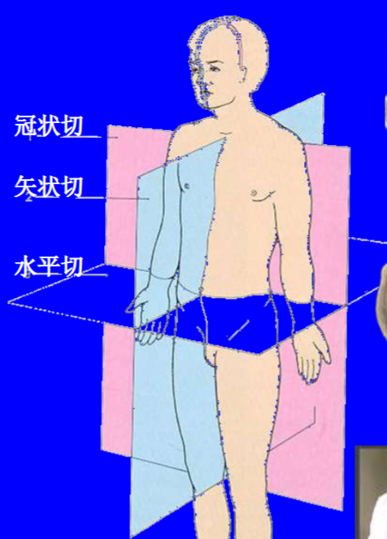

矢状轴，冠状轴水平，垂直轴垂直

### 1.2 生理学

#### 重点

##### 1.2.1 反馈控制系统

**负反馈控制**

意义：维持体内各种稳态

缺点：波动性强，有明显滞后性

**正反馈控制**

意义：加速某一生理过程完成

#### 其他

* 体液的成分
* 稳态
* 生理功能的调节方式
  * 神经；体液；神经-体液；自身；直接
* 生命活动基本特征

## 2 细胞的基本功能

### 2.1 细胞膜的基本结构

#### 重点

无，爽

#### 其他

* 脂双层的作用
* 蛋白质，氨基酸自然状态左旋
* 糖，自然状态右旋

### 2.2 物质的跨膜转运
#### 重点
##### 2.2.1 钠钾泵

也叫钠泵，是钠钾ATP酶，消耗**一个ATP**，**运走3个Na+**，**运进2个K+**

##### 2.2.2 物质跨膜转移总结

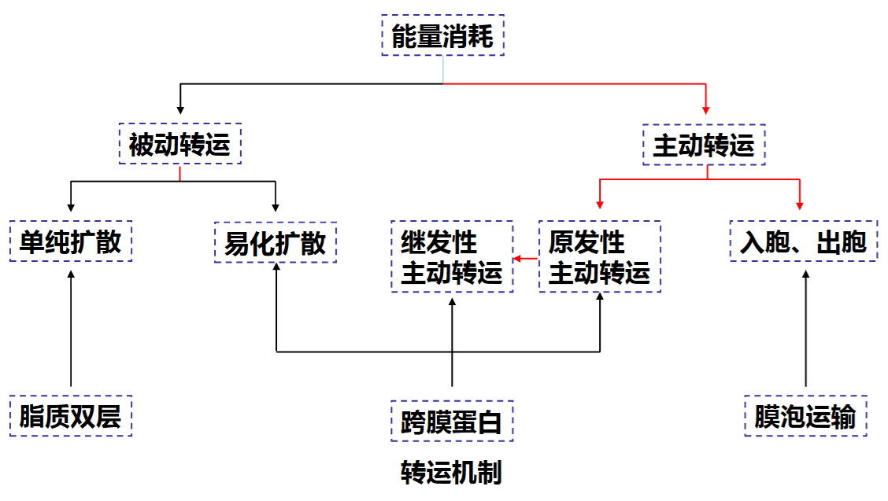

#### 其他

其实关键就是2.1.2节的图，这个看看就行，这一章关键的就是各种方式和各种协同，还有各种通道蛋白

* 具体的运输的例子，见例题节，也可能没有，取决于文档的规模😉

### 2.3 跨膜信号转导

#### 重点

无，爽

#### 其他

* 转导方式

  * 离子通道；G蛋白耦联受体；酶联型受体；招募型受体；核受体（胞内）
  
  前4个是膜上的受体

### 2.4 生物电现象

这章是比较重要但是高中涉及非常多的内容，所以虽然重点多但和下面比起来还是很好的

#### 重点

##### 2.4.1 细胞膜静息电位产生机制

* 由于离子通透性造成的浓度差（K+漏通道）
* 钠钾泵造成的浓度差（作用小，5%）

膜两侧的电位差**仅存在于内外表面**之间

##### 2.4.2 动作电位产生机制

1. 细胞膜去极化至**阈值电位**，引起电压门控Na通道开放，Na顺浓度梯度**正反馈**流入，直至膜电位达到Na平衡电位
2. Na通道迅速失活，电压门控K通道开放，是复极化的主要原因（K+漏通道不是）
3. 钠钾泵的活动，使离子分布复位

**峰电位**由动作电位的**去极相**和**复极相**组成，是动作电位的**主要部分**

**后电位**分为**去极化电位**和**正后电位（后超极化电位）**

**电压钳制后钠钾离子的膜电导变化**（验证实验）

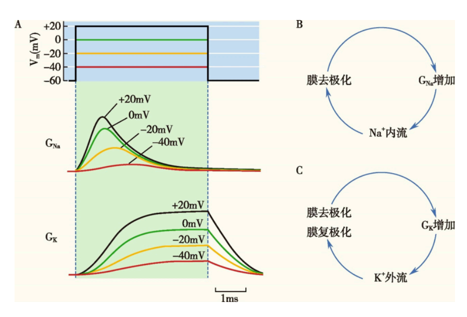

##### 2.4.3 动作电位的传播

1. 无髓神经纤维：局部电流，**连续**传导
2. 有髓神经纤维：兴奋在相邻的朗飞结**跳跃式**传导
3. 全或无：同一个细胞的动作电位大小在传导过程中**不会变化**（1/2都是）

##### 2.4.4 局部电位

来源于**去极化电紧张电位**和**部分Na+通道**开放

**局部电位特点**：衰减性传导；时空总和

#### 其他

* 能斯特方程和离子平衡电位，在生物体内就是
  $$
  E_x = \frac{61.5}{Z}\ln \frac{[X^+]_{\mathsf{outside}}}{[X^+]_{\mathsf{inside}}}
  $$

* 细胞膜静息电位，利用上面方程导出
  $$
  E_m = \frac{P_K}{P_K+P_{Na}}E_K+\frac{P_{Na}}{P_K+P_{Na}}E_{Na}
  $$
  其中$P_X$是$X$的跨膜速率

* 细胞膜电路模型，得出模电导，在电压钳的钳制下保持细胞膜电位不变，测量离子的通透性（电导）
  $$
  G_x = \frac{I_X}{E_m-E_X}
  $$

* 河豚毒素阻断Na通道，膜电流恒正；四乙胺阻断K通道，膜电流恒负

* 动作电位后细胞兴奋性变化

  * 绝对不应期；相对不应期；超常期；低常期
  
  
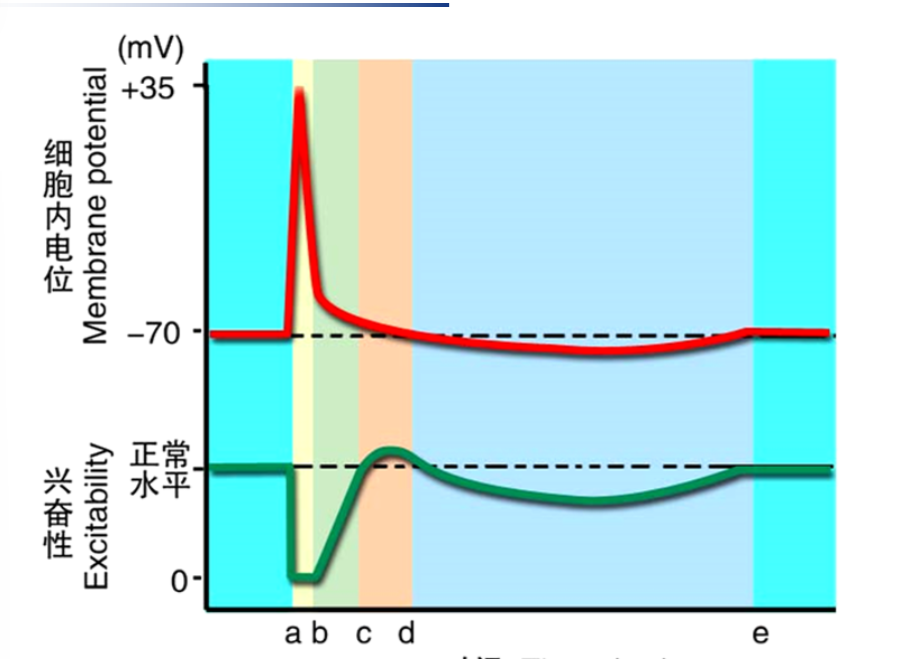

  

## 3 人体的基本组织和功能

### 3.1 肌组织

#### 重点

##### 3.1.1 骨骼肌的精细结构

**肌节**

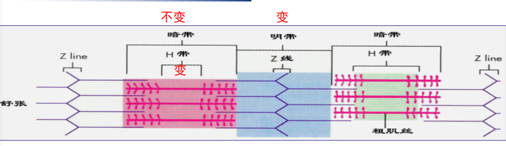

**肌节**：相邻的两条z线之间，是骨骼肌纤维的**基本结构**和收缩舒张的**功能单位**；肌节 = 1/2 明带（I带） + 暗带（A带） + 1/2 明带

在收缩舒张过程中，暗带**长度不变**，明带和H带**在收缩时缩短，在舒张时伸长**

**肌管系统**

**横管**：T管，是肌膜的一部分，**迅速同步肌膜的兴奋到肌纤维内部**

**肌质网**：L管，分为**纵管**和**终池（JSR）**，内部Ca2+浓度很高

**三联管**：两个终池夹着一个横管

##### 3.1.2 骨骼肌的收缩理论

**肌丝滑行理论**：细肌丝向肌节中央粗肌丝内滑行

1. 相邻的Z线靠近，**肌节变短**
2. **暗带长度不变**，粗肌丝长度不变
3. Z线到H带边缘长度不变，恒**等于细肌丝长度**
4. 明带和H带变窄

##### 3.1.3 骨骼肌的兴奋收缩耦联

电变化的兴奋和肌丝滑行的收缩的中介过程，第2，3环节是中介

1. **肌膜电兴奋传导**：肌膜产生动作电位（AP），AP通过横管迅速传至三联管和肌小节。
2. **三联管信息传递**：AP激活L型Ca²⁺通道，通过变构或Ca²⁺内流（心肌），使终池Ca²⁺释放通道开放。
3. **肌质网Ca²⁺释放**：终池Ca²⁺顺梯度进入肌浆，引起肌钙蛋白构型改变。
4. **肌丝滑行**：原肌球蛋白位移，暴露细肌丝结合位点，横桥与之结合并摆动，牵动细肌丝滑行，肌节缩短。
5. **横桥复位**：激活肌球蛋白ATP酶分解ATP，横桥复位。

**Ca²⁺是骨骼肌兴奋-收缩耦联的关键物质**

##### 3.1.4 神经-肌肉接头处的兴奋传递过程

1. 神经冲动使前膜去极化，Ca2+通道开放，膜外Ca2+内流，囊泡移动，出胞后释放乙酰胆碱（ACh）
4. ACh与终板膜上的N2受体结合，蛋白质构型改变，对Na+的通透性提高（净：Na内，K/Ca外），终板电位（EPP）积累
7. EPP电紧张性扩散至肌膜，当去极化达到阈值，肌细胞产生动作电位

**一些tips：**

* 接头后膜：又称**终板膜**，存在ACh/N2受体，**没有电压型钠通道**

* 终板区：整个神经-肌肉接头
* 终版电位是一种局部电位，**没有不应期**

#### 其他

* 肌肉收缩形式
  * 等长/张收缩：提起重物时，先等长，后等张
  * 单/强直收缩：强直收缩分不/完全，区别是后一次的收缩期与前一次的舒张/收缩期重叠
* 收缩强度影响因素
  * 主要：兴奋-收缩耦联期间胞浆内Ca2+水平；肌球蛋白ATP酶活性；刺激频率；肌纤维长度；都是正相关
* 一些药物的对应关系

### 3.2 神经组织

#### 重点

##### 3.2.1 神经胶质细胞的基本结构与形态

**共同特点**

* 数目多；有突起，但是没有树突轴突；无尼式体；不形成突触，**有分裂能力**

* 除突触之外都被神经胶质细胞分隔、绝缘，保证**信息传递的专一**和不受干扰

**具体而言**

* **星形胶质细胞**：神经系统中**数目最多**的细胞，星形，突起多；功能：K+水平缓冲；神经递质再循环；调节成年后的神经形成；释放神经递质调节神经元活动；**参与血脑屏障**，还有部分免疫应答
* **少突胶质细胞**：形态较小，突起少；功能：参与**中枢神经系统**有髓神经纤维**髓鞘**的形成，可以包裹几个轴突形成

* **小胶质细胞**：**最小**、细长；功能：来源于血液的单核细胞，有吞噬功能

* **室管膜细胞**；**分泌脑脊液**、支持和再生作用，控制脑脊液流动

* **施万细胞**；参与**周围神经系统**的髓鞘形成，**诱导神经再生**；只能包裹一个轴突形成髓鞘

* **卫星细胞**：神经节内包裹神经元胞体的一层扁平或立方性细胞；支持和提供营养

后面两个是周围神经系统的

##### 3.2.2 化学突触

以神经递质为媒介，单向传递

化学突触处一般都是球状/扣状膨大的

突触前：前膜（增厚）；突触小泡；线粒体、微丝、微管

突触后：后膜（增厚）；递质受体；离子通道

##### 3.2.3 化学突触的信息传递

1. 前膜去极化，Ca2+通道打开，内流
2. 囊泡出胞，神经递质释放，扩散过间隙
3. 与后膜受体结合，门控通道打开
4. 后膜对Na+通透性上升，去极化产生兴奋性/抑制性突触后电位（EPSP/IPSP）
5. 电位局部扩布，积累，去极化达到阈电位
7. 后膜的细胞产生动作电位

速度慢于电突触，单向传递，可以是**兴奋型或抑制型**；E/IPSP都是局部电位

#### 其他

* 神经元的基本结构形态

  * 胞体（整合信息），树突（有多尼式体，树突棘；接收信息），轴突（传递信息；轴丘：产生AP）

* 多发性硬化：中枢神经系统白质炎性脱髓鞘，自身免疫病

* E/IPSP的特征和膜通道开放情况（IPSP：后膜Cl-通道开，内流；或是K+通道开，外流）

* 递质共存：多种递质共存在一个神经元内，一种递质作用于多种受体

## 4 神经系统

### 4.1 神经系统的感觉分析功能

大的要来了🥵

喜报，大的被我删了

#### 重点

##### 4.1.1 躯体感觉通路

**深感觉**：后索（薄、楔束）→丘系交叉→内侧丘系→丘脑

**浅感觉**：前外侧索→白质前连合→脊髓丘脑前、侧束→丘脑

**头面部感觉**：三叉神经节→三叉神经主核交叉后→三叉丘系→丘脑

**丘脑功能分布**

- 腹后核：产生特定感觉
- 外侧部：躯干、肢体感觉；内侧部：头面部感觉
- 内侧膝状体：听觉；外侧膝状体：视觉

**深感觉传导路**：先上升，后交叉；投射到中央后回上2/3

**浅感觉传导路**：先交叉，后上升；投射到上2/3

**头面部感觉传导路**：汇聚于三叉神经感觉根，在脑干水平交叉，触压觉上升，温通觉下降；投射到下1/3

**躯干感觉传导路**

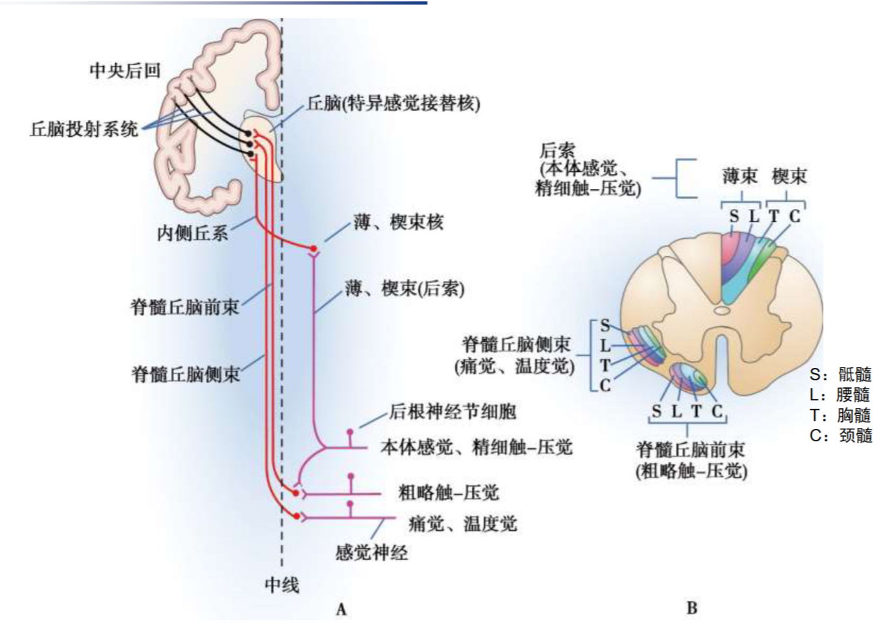

注意B图每个部位的分布，要考的

#### 其他

* 感受器

  * 生理特性：感觉阈值；感觉辨别阈；侧向抑制；感受野；适应现象
  * 换能作用；编码作用

* 躯体和内脏感觉

  * 浅感觉：粗触压觉，温度觉，痛觉
  * 深感觉：本体感觉/深部感觉，精细触觉
  * 内脏感觉：主要是痛觉

* 大脑皮层感觉代表区：第一感觉区（S1）：中央后回；投射规律：交叉，大小，倒置

* 脊髓背根是传入神经大量分布的地方

### 4.2 视觉

#### 重点

##### 4.2.1 视锥与视杆细胞

|    特点    |        视锥细胞        |          视杆细胞          |
| :--------: | :--------------------: | :------------------------: |
|  空间分布  | 集中在视网膜**中央凹** | 主要分布于视网膜**周边部** |
| 神经元联系 |        单线联系        |        普遍存在汇聚        |
|  光敏程度  |           低           |             高             |
|  感光色素  |   三种（红、绿、蓝）   |          视紫红质          |
|  颜色视觉  |           有           |    无，**只能感知明暗**    |
|  动物种系  |     白昼活动（鸡）     |       夜间活动（鸮）       |

##### 4.2.2 视杆细胞的感光换能机制

**暗处**：cGMP门控Na+通道打开，Na+内流产生内向电流

**光照下**：光致超极化，Na+通道关闭，K+外流

存在钠钾泵，吸钾排钠；K+漏通道一直打开

#### 其他

* 眼的组成
  * 折光系统；感光系统
  * 盲点：视神经乳头；黄斑/中央凹处视锐度最高（视锥细胞多，直径小）
* 视觉产生过程：可见光——折光——感光——感受器电位——视觉中枢（枕叶的皮层）
* 三原色学说：视网膜上分布有三种不同的视锥细胞

### 4.3 听觉

全是重点🥵，有福了大火

#### 重点

##### 4.3.1 听骨链

位于股室腔内，人体内最小最轻的骨；任何一个被炎症腐蚀破坏，都会造成声音传导中断，引起**传音性耳聋**

镫骨底板嵌在卵圆窗

##### 4.3.2 声波传入内耳途径

**气传导**：这是正常的途径

主要途径：声波——>外耳道——>鼓膜——>**听骨链**——>卵圆窗膜——>内耳

听骨链障碍时途径：声波——>外耳道——>鼓膜——>**鼓室空气**——>卵圆窗膜——>内耳

**骨传导**：非正常途径，气传导损伤后增强

声波——>颅骨震动——>颞骨岩部耳蜗外淋巴振动

##### 4.3.3 耳蜗的感音换能作用

**基底膜振动**

卵圆窗膜内移——>前庭膜和基底膜下移——>外淋巴液（位于**前庭阶**和**鼓室阶**中）流向卵圆窗——>卵圆窗外移

若卵圆窗膜外移——>所有的移动方向相反

**行波理论**

振动波自蜗**底**开始，向蜗**顶**传播

高频波：频率越**高**，行波传播越**近**，最大振幅越接近蜗**底**

低频波：**低**，**远**，**顶**

**耳蜗初步分析声频的原理**：基底膜不同部位的听神经纤维能**感受不同的声频**

#### 其他

* 听神经动作电位
  * 复合：振幅由声强，兴奋纤维数，不同纤维放电同步化程度决定
  * 单根：存在共振频率，取决于纤维末梢在基底膜上的位置；放电频率与声强正相关
  
* 听觉大脑皮层代表区
  * 初级听皮层：颞横回和颞上回
  * 传入通路：自上橄榄核起双侧性，一侧外侧丘系以上受损没事
  * 皮层音调定位：低音：前外侧；高音：后内侧
  
* 内耳前庭的平衡感觉
  
  * 前庭反射：姿势调节/维持，交感神经反应
  
* 基底膜运动和毛细胞兴奋

  基底膜振动——>盖膜和基底膜**交错移动**——>纤毛弯曲——>机械门控通道改变

  纤毛弯曲分为两种情况：

  1. 短纤毛向长纤毛弯曲：产生**耳蜗动作电位**

  2. 长纤毛向短纤毛弯曲：膜超极化，无递质释放

### 4.4 运动控制

大的还没来🥵

#### 重点

##### 4.4.1 神经系统的三个运动调控层次

由上到下，分别是：

1. 大脑皮层联络区，基底神经节，皮层小脑（策划）
2. 大脑运动皮层，脊髓小脑（执行）
3. 脑干，脑髓（执行）

躯体的任何运动，都是在一定的**肌紧张**和一定的**姿势**下进行的

##### 4.4.2 脊髓前角运动神经元

分为三种神经元，是**神经中枢**

* α神经元：支配梭**外**肌，运动传出的**最后**路径
* γ神经元：支配梭**内**肌，提高敏感，随α的增强而增强，使梭内/外肌同步收缩
* β神经元：支配梭**内**肌，功能不明确

**分布**：颈膨大（上肢）；腰底膨大（下肢）

**α作为最后路径的作用**：整合、会聚各种传递运动信息的神经冲动

* 引发随意运动；调节姿态；协调不同肌群，更加平稳和精确

**运动单位**：指**一个α神经元及其支配的全部肌纤维**组成的功能单位，大小不一，交叉分布（产生均匀的肌肉收缩）

##### 4.4.3 脊髓对躯体运动的调控

**脊髓**：完成躯体动作的最基本的低位反射中枢

**脊休克**：脊髓与高位中枢离断，横断面以下的脊髓反射功能暂时消失（杀牛蛙）；意义在于表明了脊髓能完成某些简单反射，并且在高位中枢的控制下活动

脊休克后，随意运动、知觉永久丧失，脊髓反射可以逐渐恢复

##### 4.4.4 反射与反射弧

反射；反射弧；不赘述

##### 4.4.5 牵张反射

有**完整神经支配**的骨骼肌受外力牵拉时引起受牵拉的**同一肌肉**收缩的反射

**类型**：腱反射，**快速单突触**反射；肌紧张，**持久紧张性**反射

反射弧组成：肌梭（感受器），Ia,II传入纤维，αβγ传出纤维，脊髓前角α运动神经元（中枢），梭外肌（效应器）

##### 4.4.6 肌梭与高尔基腱器官比较

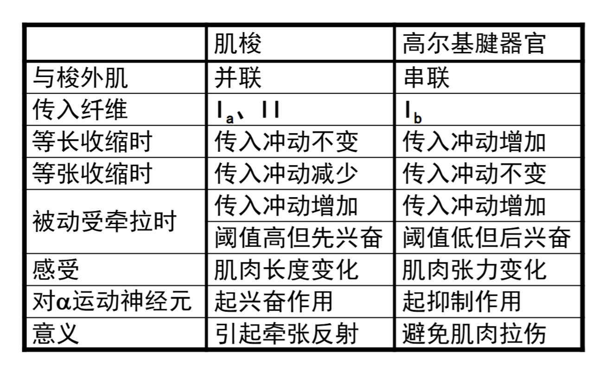

#### 其他

* 脑干对肌紧张和姿势的调控

  * 易化区：范围大；抑制区：范围小
  * 去大脑僵直：切断脑干，表现为过强的牵张反射
  
* 基底神经节（**很可能是重点**）

  * 主要功能（准备阶段）：运动调节，自主神经调节，感觉传入，心理行为，学习记忆

  * 大脑皮层与其联系：直接为兴奋，间接多为抑制

    
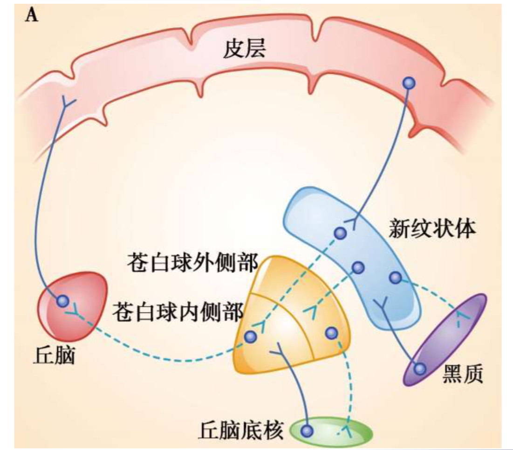

  * 有关疾病：帕金森：多巴胺分泌过多，肌肉过于兴奋；亨廷顿：纹状体萎缩，抑制通路减弱，肌张力减弱
  
* 小脑（**很可能是重点**）：运动的进行阶段

  * 前庭小脑：保持身体平衡；损伤表现：站不稳，运动病（晕船/车）消失，位置性眼震颤
  * 脊髓小脑：协调运动，调节肌紧张；损伤表现：意向性震颤、轮替运动不能，小脑共济性失调，肌张力减弱
  * 皮层小脑：策划运动；损伤表现：不产生明显症状
  
* 肌紧张：缓慢而持续地牵拉肌腱时引起的牵张反射

  * 特点：效应器为慢肌纤维；同一肌肉的不同运动单元交替收缩，不易疲劳

* 肌梭的传入传出纤维

  
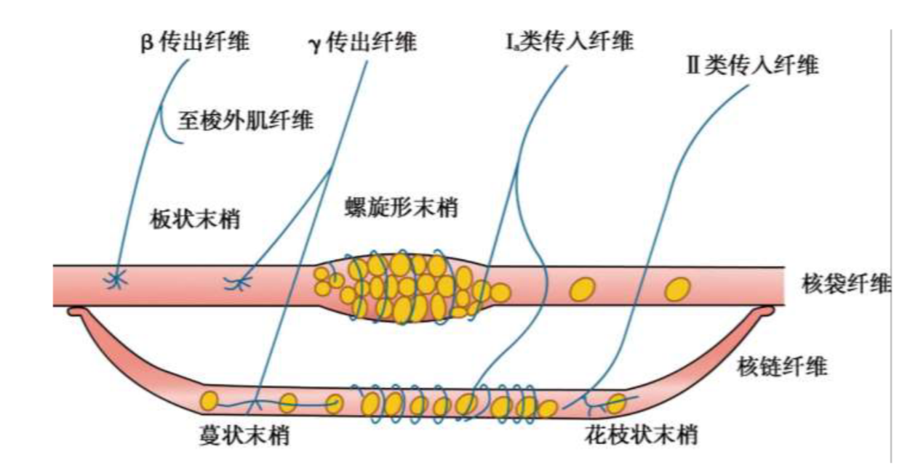

* 肌肉状态与神经纤维的关系：也是个负反馈过程：α开始传出，为了同步收缩γ增多，Ia增多；太多了，为了防止拉上，Ia就减少，同时Ib增多；肌肉被拉长了为了拮抗Ia增多

### 4.5 神经系统对内脏活动的调节

#### 重点

##### 4.5.1 皮肤痛与内脏痛的比较

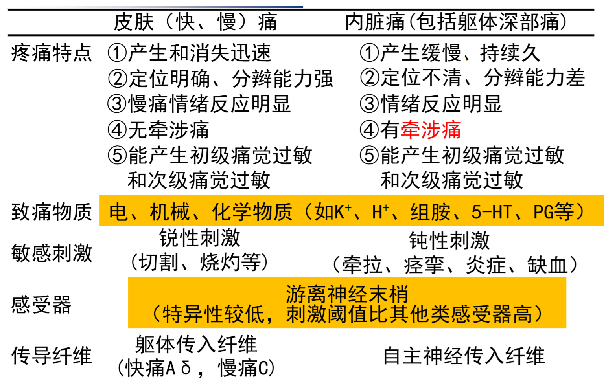

##### 4.5.2 内脏运动神经与躯体运动神经比较

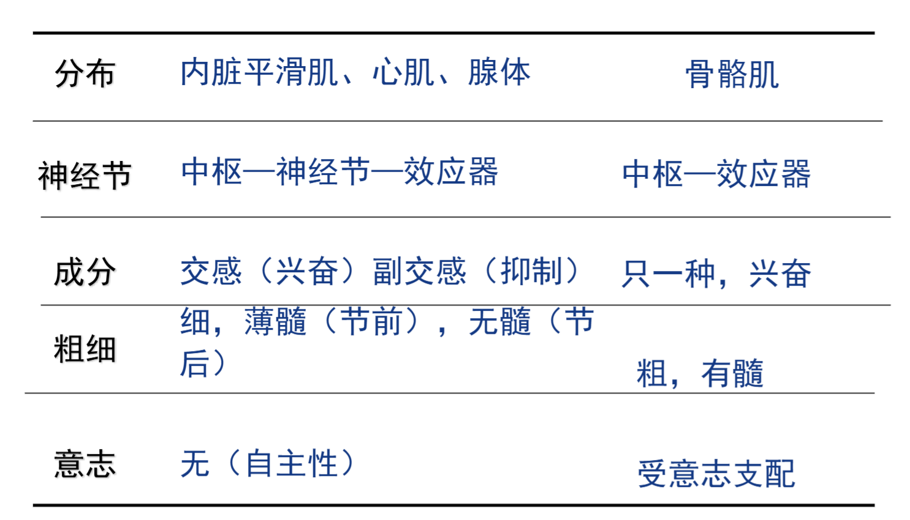

主要区别：

* 需要交换神经元；形成神经丛
* 副/交感神经双重支配

##### 4.5.3 自主神经的功能特征（副/交感）

* 潜伏期长，作用持久
* 双重支配
* 功能上**往往**相互拮抗（留伏笔）
* 受效应器状态影响：子宫平滑肌，有孕收缩，未孕舒张
* 两者平衡活动才能稳态
  * 交感神经：范围广，适应环境迅速变化，能量动员，常伴有肾上腺素分泌增多
  * 副交感神经：范围小，促进消化吸收，能量储备，常伴有胰岛素分泌增多

##### 4.5.4 副/交感神经对比

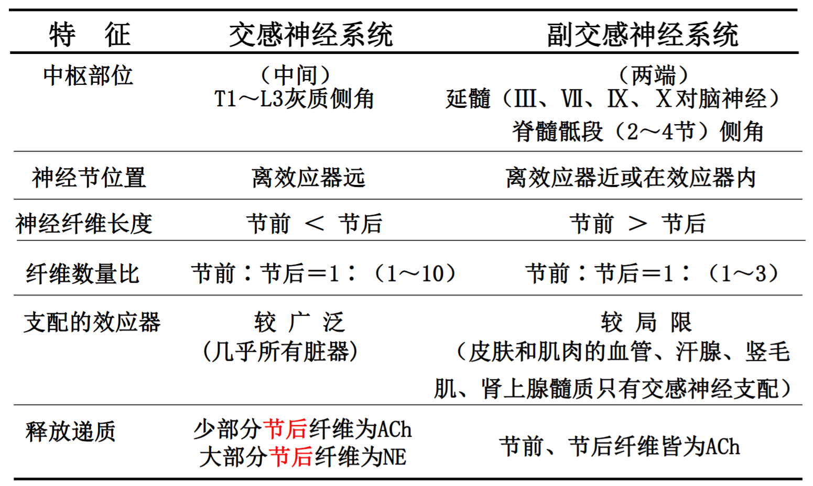

NE：去甲肾上腺素

#### 其他

* 内脏痛的特点
  * 定位不明确；发生缓慢，持续长；对扩张性、牵拉性敏感；易产生不愉快情绪；存在牵涉痛
* 牵涉痛：内脏器官出问题，在体表会感觉痛
* 内脏活动的调节中枢
  * 脊髓：可完成低级反射
    * 脊休克时，各种反射消失，血压下降；回复后，血压可以完全恢复，但是反射不行
  * 低位脑干：延髓为基本生命中枢（内脏感觉核，运动核，脑干网状结构）
    * 心血管反应；呼吸运动；吞咽呕吐
  * 大脑皮层边缘系统
    * 内脏活动，摄食，性，情绪，学习与记忆
  * 下丘脑：与皮层及以下结构联系（很可能是重点）
    * 较高级的内脏活动调节中枢
    * 刺激间脑睡眠区/前脑基底部睡眠区可引起睡眠/觉醒；生物节律的控制中心：视交叉上核
    * 对体温的控制：分为热/冷敏神经元，分别对应血温上升/下降放电频率上升
      * 视前区-下丘脑前部（PO/AH）：热敏多，少量冷敏；弓状核、脑干网状结构：冷敏多
      * 体温调定点在下丘脑，发热时上升；PO/AH是体温调节整合中枢
    * 摄食行为调节
      * 能量平衡：调定点学说；摄食中枢：下丘脑外侧区；饱食中枢：下丘脑腹内侧核
    * 情绪调节
      * 腹内侧区：防御反应；外侧区：攻击行为；背侧区：逃避行为

### 4.6 脑电和睡眠节律

#### 重点

##### 4.6.1 脑电图

* α波阻断：在清醒，安静并闭眼时出现；慢波
* β波阻断：睁开眼睛或接收其他刺激时出现；快波

##### 4.6.2 睡眠的两个时相

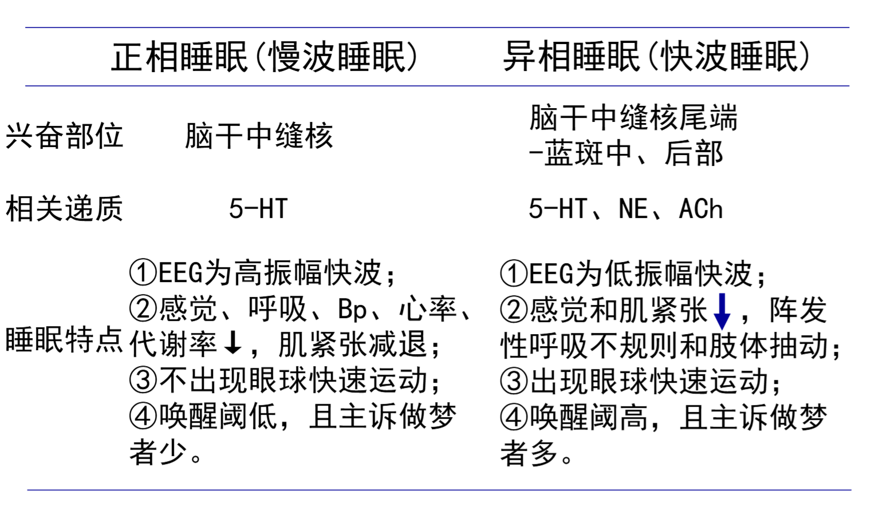

* 慢波睡眠：生长激素分泌增多，促进生长和体力恢复，不出现快速眼动（NREM）
* 快波睡眠：生长激素分泌减少，脑内蛋白质合成加快，促进神经系统的发育和记忆活动，出现快速眼动（REM）

#### 其他

* 大脑皮层神经元的两种电活动
  * 自发脑电：没有明显刺激，经常性自发产生的节律性电位变化
  * 皮层诱发电位：传入系统受刺激，引发较为固定的电变化；是在自发脑电的背景下发生的
* 脑电形成机制：脑内大量神经元同步发生的突触后电位总和
* 睡眠各个时期的脑电波特点
  * 入睡期：θ波，β波
  * 浅睡期：σ波，κ-复合波
  * 中度睡眠期：出现了δ波
  * 深度睡眠期：δ波超过了50%

## 5 泌尿系统

### 5.1 泌尿系统的解剖结构

#### 重点

##### 5.1.1 泌尿系统的功能

* 排泄
* 维持内环境稳态：细胞外液总量；渗透压；电解质
* 肾脏的内分泌功能：各种激素

##### 5.1.2 肾的功能解剖

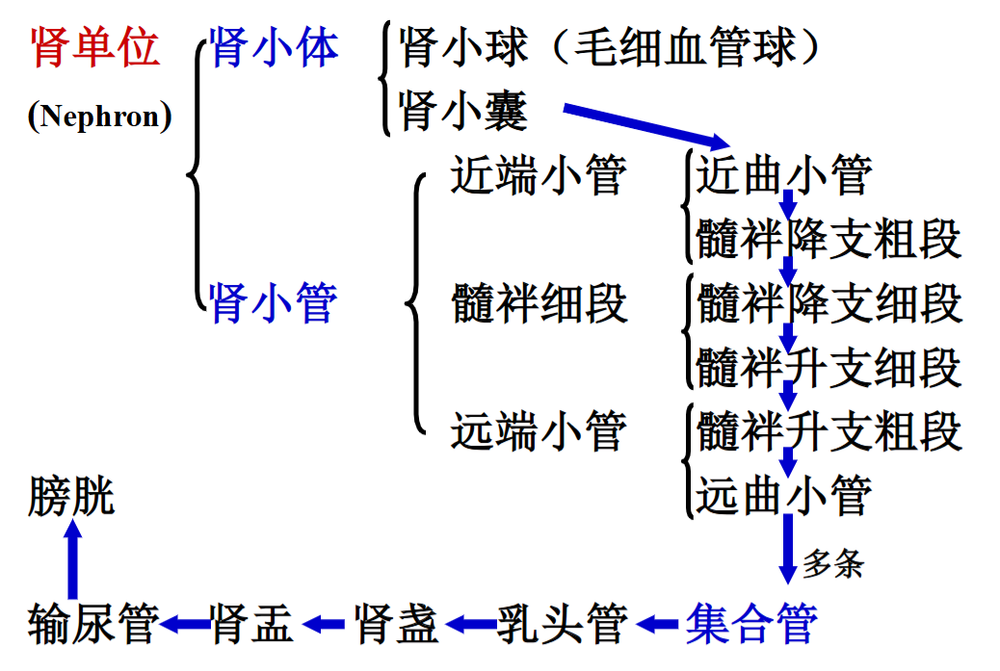

##### 5.1.3 皮质肾单位和近随肾单位

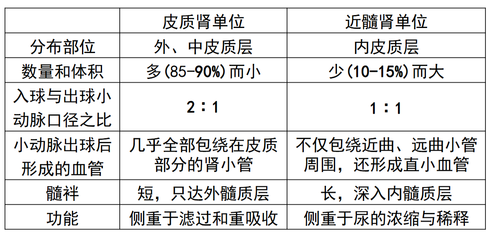

##### 5.1.4 肾小体的过滤膜

从内到外一共三层。

1. 窗孔：内皮细胞层；最大
2. 网孔：基膜层；最小
3. 裂隙膜：足细胞的足突

##### 5.1.5 球旁器

* 颗粒细胞：球旁细胞，分泌肾素
* 球外系膜细胞：吞噬与收缩功能
* 致密斑：Na感受器

#### 其他

* 肾的三个重要结构：肾门（各种管道入口）；肾蒂（肾门外包结缔组织）；肾窦（肾门到肾实质间隙）
* 左肾高右肾低
* 肾单位：包含一个肾小体（肾小球+囊）和肾小管；每侧肾有100w个以；形成原尿
* 肾小球：一团毛细血管，用于过滤；肾小囊：内层有足细胞，上有裂孔膜覆盖
* 肾小管：近端小管：重吸收蛋白质和分泌；细段；远端小管：吸收Na，Cl和水，分泌K
* 滤过功能障碍会导致终尿中出现蛋白质

### 5.2 尿的生成和排除

#### 重点

##### 5.2.1 尿的生成和排除的基本过程

1. 肾小球过滤
2. 肾小管与集合管重吸收与分泌

### 5.3 肾脏的调节功能

#### 重点

##### 5.3.1 过滤的动力

有效过滤压（EFP）= 肾小球毛细血管血压 + 囊内液胶体渗透压 -（血浆胶体渗透压 + 肾小囊内压）

肾小球的入球端EFP>0，出球端=0

#### 其他

* 肾脏的血液循环特点
  * 肾血流量丰富但是分布不均，大部分在皮质层
  * 两次形成毛细血管网：肾小球毛细血管网（血压高，利于滤过）；管周毛细血管网（血压低，利于重吸收）
* 原尿没有蛋白质
* 滤过膜的电学屏障：各层含有带负电的糖蛋白，排斥带负电的蛋白质，不让过
* 滤过膜的通透性：机械屏障：三层膜，主要是肌膜（最重要）和裂隙膜的孔；电学屏障
* 尿液一般低渗，有时高渗；出现等渗溶液说明滤过出问题
* 等渗输液，尿不变；高渗输液，尿变多（组织水肿使使用，吸组织液，排到尿液中）

