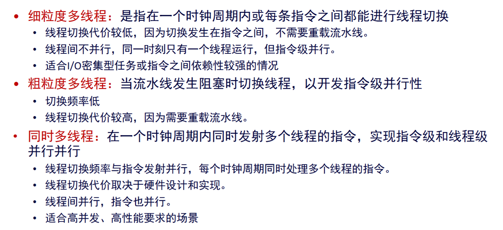

# 计算机体系结构速通

### 1 绪论

* 体系结构：指软硬件协同的部分

* 摩尔定律：处理器性能指数级增长；如何打破（GPGPU）

* 局部性：内存数据的时空局部性

* 并行：指令级：流水线，多发射，超标量；数据级：SIMD，向量机；线程级：多线程，多核处理器

* SISD/SIMD/MISD/MIMD的基本概念

* 阿姆达尔定律：并行计算的加速比受限于并行资源N和并行任务比重p，即
  $$
  S = \frac{1}{(1-P)+\frac{P}{N}}
  $$

* CPU时间（指令数目\*CPI\*时钟周期），吞吐率（每秒完成的指令数目），延迟

### 2 数据的计算和表达

* 冯诺依曼架构：CPU，Mem，I/O，BUS

* Unsigned int and int的编码方式（原码，反码，补码）特点和表示范围，具体看几位的

* unsigned int和int的硬转换

* 逻辑左移=算术左移，逻辑右移补0，算术右移补符号位

  slli，slai，srli，srai，shift left/right logical/arithmetic immediate

* 小段存储，大段存储（基本没有），内存对齐

* IEEE754浮点数标准

  * 单精度（float）：MSB符号s，中间8位指数e，末23位尾数m，用小数表示

  * 双精度（double）：MSB符号s，中间11位指数e，末52位尾数m，用小数表示

  * 表示方式

    * 规格化数

    $$
    x=(-1)^{s}\times 1.m\times 2^{e-bias}
    $$

    偏置bias在单精度为127（2**7-1），在双精度为1023

    * 非规格化数

    $e=0\and m\neq0$，因此最小的规格化数为$1.0\times 2^{1-127}$

    NAN：$e=255\and m\neq 0$

    小于1的数：$e=0\and m\neq 0, x=(-1)^s\times 0.m\times 2^{e-126}$

* 整数的溢出判断：符号位的进位（MSB）≠数值最高位的进位（MSB-1），则溢出

* 浮点数的舍入：当尾数超过能表示的个数时（超过23/52bit），首先就近舍入，对于从第24位开始为`10..0`的数，保证第23位为0，如`10.11100=11.00, 10.10100=10.10`，第23位只进不退

  * 当两个float阶码相差超过25时，就不用计算直接取阶码大的，因为23bit尾数，24位可以进位影响第23位，但是25位就不行

* 浮点数的加法：对阶，尾数相加，规格化，舍入，检查溢出

* 浮点数的乘法不会对符号位溢出，故$d>0\Rightarrow d^2>0$，而int不行

* 类型转换时长转短一定有问题

* **x/4 + y/8 == (x>>2) + (y>>3)**

  * 对于正数，等式成立，但负数情况下不成立，因为算术右移保留符号位，而除法向零取整

* 对于一个n（n≥8）位二进制变量x，C语言表达式：((x^~0xFF)>>8)<<8 的功能是

  * x的最低有效字节全变为0，其余各位取反。

* 在模2^32下，`x * y == ux * uy` 是成立的，也就是在`unsigned / int`下

### 3 指令集架构

* 指令集：硬件和软件的接口
* CISC、RISC各自的优缺点
* 寻址方式：立即数：`mov ax, 4c00H`；变址：`mov ax, [bx]`；寄存器：`mov ax, bx`；相对：`lw ax, 0(sp)`；直接：`mov ax, [add]`
* 内存对齐：起始地址是这个类型的整数倍；接口简单，速度快，访问一次
* `ra`保存下一条指令的地址
* `jal ra, reg`保存偏移量，`jalr ra, reg, offset`保存实际地址
* 保存寄存器时，从高地址保存`lw x0, 4(sp), lw x1, 0(sp)`
* SIMD指令和向量机，需要超长的寄存器，时空图不同于流水线；向量寄存器之间存在前向通路，直接同步寄存器之间的结果
* RISC-V编码规则

  * Branch指令编码是偏移量的一半
  * JALR指令编码的是具体地址，idata不用变成一半
* JAL指令编码偏移量的一半；`jal reg, offset`，其中reg是ra写入，offset是偏移
  

### 4 处理器

* load/store结构：只有lw/sw指令能访问内存

* 哈佛结构：将指令和数据分开存储，IF和MEM可以同时进行

* 数据通路，看ppt

* 段寄存器：传递控制信号和结果，存储上一段结果和后面用到的控制信号

* CPI：完成一条指令的周期数，理想情况下，CPI，吞吐率=1，并发度=5

  导致CPI>1的情况：冒险；访存延迟（涉及到MEM的都很慢）

* 流水线相关性：RAW，WAR，WAW，不考虑latency和时间上是否真的相关，写会覆盖，之后不相关

* 流水线冒险

  * 结构冒险：两个指令同时使用一个硬件，如ID和WB同时用REG

    指令MEM和数据MEM分离，IF和MEM没有冒险；ID发生在后半周期，WB发生在前半周期，读写口独立，ID和WB没有冒险。故结构冒险是可以消除的

  * 数据冒险：数据依赖性；插入`nop`（软），但是导致性能下降；流水线停顿（stall，硬），和前者一样的效果；前向通路（硬），将EX，MEM产生的结果直接给到EX，但是不能解决`lw,use`冒险，但是`lw,sw`可以，EX/MEM有反馈通路；编译时调度（软），调换顺序

  * 控制冒险：brunch/jmp指令引起，EX后产生的PC要在下一个周期才写入，也就是在MEM段才能判断要去哪里；最简单办法，清空正在执行的指令（2条）；在ALU前REG后增加一个加法器，计算转移地址，但是还要清空1条；编译时调整顺序（软）；转移延迟槽（软硬协同），大小为要清空的指令数目，有提前决策就是1，没有就是2，槽是硬件给的，编译器要调度指令

* 提高CPU性能，即减小CPU时间

  * 增加时钟频率（深度流水），会导致段寄存器延迟比例占比提高，功耗提高，重叠执行的指令更多，相关性增加
  * 减小CPI，多发射（编译时确定，超长指令字：一次取多条；冒险开销成倍增加），多条流水线并行执行，双发射CPI=0.5；超标量（执行时确定），多条指令交替执行，典型的就是乱序超标量处理器，但是提交是顺序的

* 静态转移预测：分为两种：永远预测转移，永远预测不转移

* 动态转移预测：转移历史表，分为存储区和索引，前者用于存放预测位，后者存放转移指令的地址（Cache的映射）；转移地址池（Buffer），就是转移的目的地

### 5 Cache

* 时空局部性

* Cache映射方式：一块能放n Byte，用内存的末$\log_2n$bit作为块内编码；有一个有效位

  * 直接映射：Cache有m行，那么就有m块，用中间$\log_2 m$作为块编码，用m对这$\log_2m$bit二进制取模，得到映射的块，剩下的就是tag

    存在乒乓效应，就是两个映射到同一块的内存交替访问，结果就是hit0次

    地址变换很快，一对一映射，但是很容易冲突

  * 全相联映射：只有块内编码，其他都是tag，查找的硬件很复杂，替换算法复杂，冲突率低
  * 组相联映射：m行的Cache，分为s路，$\frac{m}{s}=t$组，用$\log_2 t$bit编码组号，剩下的是tag，可以发现一样大Cache，直接映射的tag更短
  * Cache大，那么就直接映射，速度最快；不大，就相联映射
  * 要求速度快就只能直接映射
  * 直接映射=1-way组相联映射，全相联映射=1-set组相联映射

* 内存更新策略

  * 写直达：Cache和MEM一起改，控制简单，但是慢，不必同时更新，当然也做不到同时
  * 写回：只改Cache，当Cache内容被更改时set dirty bit，在换地址时检查dirty bit，=1再写回MEM，控制复杂

* Cache miss的写策略：前提是Cache miss

  * 按写分配：从主存调入，在Cache中更改，与写回搭配
  * 不按写分配：直接改主存内容，然后调入Cache，与写直达搭配

* 替换策略：一次换一块

  * 最近最少使用LRU，增加硬件和访问时间；数学上最有效，但是有例外（n个数据循环，但只有n-1路，导致hit=0）

    n-way组关联，需要$\log_2 n$位的标记位

  * 先进先出，队列

  * 随机替换

* 例：主存空间32kB，按字节编址，Cache是4-way，LRU和写回策略，能放4kB数据，1 Block = 64B，问Cache一共多大

  主存32kB = 2^15，地址用15bit编码，1Block = 2^6，用末6bit编块内，4k/4/64 = 16 = 2^4，用4bit编码set，余下15-4-6=5bit为tag，4-way LRU需要 $\log_2 4=2$bit编码使用频率，写回需要1bit dirty bit，1bit 有效位，那么Cache一共为64行，大小就是 64\*（1+1+2+5+64\*8）=33344bit

* 会算Cache的失效率

* Cache失效的4C

  * Compulsory：首次访问，本来就不在
  * Capacity：容量上限
  * Conflict：直接映射和组关联映射，地址冲突了
  * Coherence：多核处理器的问题

* 矩阵乘法的优化方法

  * 分块，向量化，内存重排，循环展开

* 多核处理器的Cache一致性问题

  * 广播/写更新：当一个核的Cache更新后，广播到所有核，更新这个数据，速度慢，空间占用大
  * 写失效：增加一位invalid，将这个块标记，除了最常用这个数据的核的Cache
  * 一致性导致的问题：假共享。两个不同Data在同一个块内，被两个核使用，D1被更新后D2无法被CPU2使用；解决方案是手动解决

### 6 其他

* 提高CPI的方法

  * **多发射（VLIW）**：处理器每个时钟周期可以发射多条指令到执行单元，以提高并行度。编译时确定
  * **静态调度**：编译器在程序执行前确定指令的执行顺序和并行性，硬件按固定顺序执行。
  * **动态超标量**：处理器在运行时动态分析指令间的依赖关系，并调度多条指令并行执行。执行时确定
  * **按序多发射流水线（按序超标量）**：处理器按程序顺序发射和执行指令，但每个周期可以发射多条指令。
  * **乱序超标量处理器**：处理器在运行时动态重排指令顺序，以最大化并行执行，但最终结果保持程序顺序。执行时确定
* 多线程处理器：一种虚拟处理器技术，多个逻辑处理器共享一套物理处理器
  * 主要受限于寄存器数目，需要幅值多份寄存器和程序计数器（PC），不需要增加功能元件
  * 粒度越细，切换越频繁，Cache越大

