# 数据库原理

## 1 绪论

<center>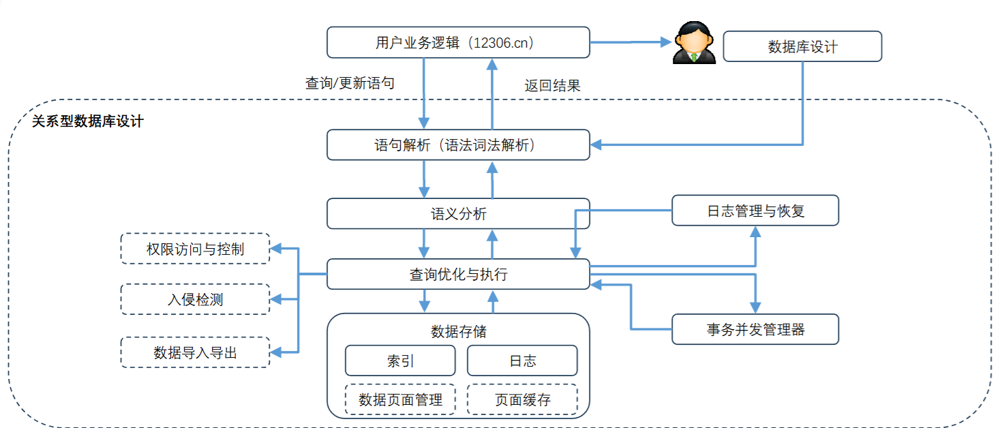</center>


## 2 关系代数

### 2.1 基本概念

| 关系模型 |      一般称呼      |
| :------: | :----------------: |
| 关系模式 |        表头        |
|  关系名  |        表名        |
|   关系   |       二维表       |
|   元组   |      行/记录       |
|   属性   |         列         |
|  属性名  |        列名        |
|  属性值  |        列值        |
|   分量   | 一条记录的一个列值 |


**关系模式**：$R(A_1,A_2,\ldots,A_n)$，如火车票记录（乘客，车次，......）

**属性**：有属性名和属性域定义，有属性值赋给每一个元组

**元组**：给定的R的一次取值，记为$t(a_1,a_2,\ldots,a_n),a_i\in Dom(A_i)$，$R=\{t|a_i\in Dom(A_i)\}$


**超键**：任一个属性组$(A_i,A_j,A_k,...)$称为一个键，能在关系中**唯一**标识一个元组的键称为超键

**候选键**：不含多余属性的超键，任去一个都不能称为超键

**主键**：选定的一个候选键

**外键**：派生关系的属性组，是主关系的主键，这个属性组是**派生关系**的外键


### 2.2 关系完整性约束

**实体完整性约束（主键）**

1. 主键的任意属性不能取空值
2. 主键的取值组合不能重复


**参照完整性约束（外键）**

1. 删除规则：一个实体A被另一个实体B引用，那么禁止删除A实体
2. 插入规则：被引用的元素必须在数据库中存在


**用户定义完整性约束**

用户自己定义的特殊约束

如：非空约束，唯一约束

**自增长约束（auto_increment）**

自动生成一个唯一的值用作新数据的值，一般作为主键

**检查约束（check（条件））**

自己定义

**默认约束（default value）**

跟在表的属性定义之后


### 2.3 关系运算

**计算优先级**：从左到右，有括号先括号


#### 2.3.1 基本关系代数

**选择**：从关系R中获取满足条件的元组，p是谓词逻辑
$$
\sigma_p(R)=\{t|t\in R \and p(t)\}
$$


**投影**：从R中获取某些列组成新的关系（从k个属性中取n个属性）
$$
\Pi_{A_1,A_2,\ldots ,A_n}=\{t[A_1,A_2,\ldots, A_n]|t\in R\}
$$


**并**：两个关系取并集

R，S的属性个数相同，属性存在一一对应关系，每个属性的域相同

Union 元组不可重复；Union all 元组可以重复

**差**操作同理


**笛卡尔积**：与离散数学相同
$$
R\times S = \{(t,q)|t\in R \and q\in S\}
$$
$|R\times S|=|R|\times |S|$


**重命名**：将关系R重命名为关系S，同时将各个属性重命名为$A_i$
$$
\rho_S(A_1,A_2,\ldots, A_n)(R)
$$
若是$\rho_S(R)$，则不改变属性名


#### 2.3.2 附加关系代数

**交**：不是基本运算，可以用$A-(A-B)$得到
$$
R\cap S=R-(R-S)
$$
用韦恩图看看，可以求不同运算


**连接**：笛卡尔积加选择加投影
$$
R\Join_pS=\{(t,q)|t\in R\and q\in S\and p\left((t,q)\right)\}
$$
p是选择谓词


**等值连接**：某两个属性值要相等

**自然连接**：将同一个属性中属性值相同的做等值连接
$$
R\Join S
$$

**外连接**：特殊的自然连接，可以处理缺省值

**左外连接**：$R ⟕ S$，保留左侧的属性值，若右侧没有左侧的某个值，则用NULL缺省，若左侧不存在右侧的值，则不搬运右侧的值

**右外连接**：$R⟖S$，同理

**全外连接**：$R⟗S$，两边都保留，即使重复了


<font color=red>例：</font>

|  A1  |  B1  |  A2  |  C2  |
| :--: | :--: | :--: | :--: |
|  1   |  A   |  1   |  D   |
|  1   |  B   |  2   |  E   |
|  3   |  C   |  4   |  F   |

表1**左**外连接表2得到

|  A   |  B   |  C   |
| :--: | :--: | :--: |
|  1   |  A   |  D   |
|  1   |  B   |  D   |
|  3   |  C   | NULL |

表1**右**外连接表2得到

|  A   |  B   |  C   |
| :--: | :--: | :--: |
|  1   |  A   |  D   |
|  1   |  B   |  D   |
|  2   | NULL |  E   |
|  4   | NULL |  F   |

表1**全**外连接表2得到

|  A   |  B   |  C   |
| :--: | :--: | :--: |
|  1   |  A   |  D   |
|  1   |  B   |  D   |
|  3   |  C   | NULL |
|  1   |  A   |  D   |
|  1   |  B   |  D   |
|  2   | NULL |  E   |
|  4   | NULL |  F   |


**赋值**：A$\leftarrow$E，其中E是关系运算，A是一个关系


**除**：$R\div S$，留下S中没有的，R中存在的属性，只保留能完全保留S中的属性的值的其余属性值；S中存在R中没有的属性，不能除

| A_R  | B_R  |
| :--: | :--: |
|  a   |  1   |
|  a   |  2   |
|  a   |  3   |
|  b   |  1   |
|  b   |  2   |

| B_S  |
| :--: |
|  1   |
|  2   |
|  3   |

| A_R/S |
| :---: |
|   a   |

当R中的每一个A都有所有的B时（能整除），除和笛卡尔积为逆运算


#### 2.3.3 扩展关系代数

**广义投影**：允许用算术运算和字符串函数对投影进行扩展
$$
\Pi_{F_1,F_2,\ldots ,F_n}(R)=\{t[B_1,B_2,\ldots, B_m]|t\in R\}
$$
F是对B的运算


**聚合**：相当于EXCEL的筛选，可以用max，count，average等
$$
\mathcal{G}_{F_1(A_1),F_2(A_2),\ldots,F_n(A_n)}(R)
$$
F为对属性的具体操作，A为属性


**分组**：先少选某些属性的值，进行分组，再聚和，相当于pandas的groupby()
$$
_{G_1,G_2,\ldots,G_n}\mathcal{G}_{F_1(A_1),F_2(A_2),\ldots,F_k(A_k)}(R)
$$
G为分组用的属性，在所有G上取值相同的将分为一组


**排序**：字面意思
$$
\tau_{A_1,A_2,\ldots,A_n}(R)
$$
A是排序的属性，若前一个属性相同，则按后一个属性排序


## 3 SQL语句

### 3.1 SQL查询语言分类

1. 数据定义语言：定义一种关系和键
2. 数据操作语言：关系运算
3. 数据控制语言：定义管理权限
4. 事务控制：对一个操作分步
5. 存储过程和调用：编程和调包
6. 触发器：事件发生后执行

<center>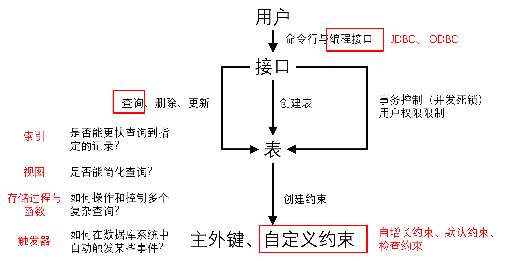</center>


### 3.2 SQL语句

MySql不区分大小写，即使变量名是大小写混杂的

**关系代数和SQL语句的关系**

<center>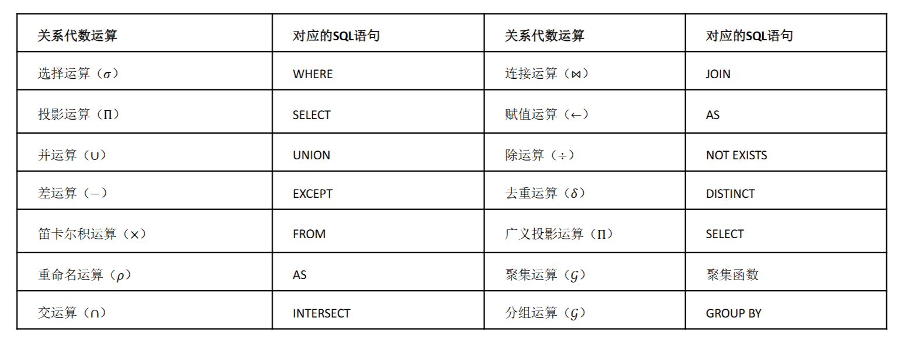</center>


#### 3.2.1 建库和表

 **建库并使用**

```mysql
create database student_db;
use student_db;
```


**建表**

```mysql
create table student
(
	student_id char(10) not null,
	student_name varchar(50) not null,
	gender char(2),
	age integer,
	department varchar(50),
	primary key (student_id)		#指明主键
    unique uq_student_student_id(student_id)	#唯一性约束
    foreign key (course_id) references course(course_id)	#外键约束，这张表没有这个属性
    														#仅做演示
);
```


使用`show tables`返回**库**中所有的表；使用`desc student`返回表的属性，按降序排列


**修改表**

```mysql
alter table student add hobby varchar(50);		#添加属性hobby
alter table	student change column hobby interest varchar(50);	#重命名hobby为interest
alter table student drop interest;				#删除interest属性
alter table student add/drop foreign key FK_course_course_id;
alter table student add primary key student_id
```

添加属性和删除属性**不对应任一个**关系运算，重命名就是重命名


**删除表**

```mysql
drop table student
```

当一个表的某个属性是另一个表的外键时，这个表不能直接删除


#### 3.2.2 数据查询

select语言很强大

```mysql
select student_id, student_name 
from student
where department = 'CS' and student_name = 'A';

select * from student where xxx #返回所有属性
```

上面是一个选择，投影的操作，where语句就是选择运算


**广义投影**

```mysql
select 2023-age as birthyear, lower(student_name)
from student
where department = 'CS';
```

将2023-age作为出生年份


```mysql
select student_id, student_name 
from student
where department = 'CS' and student_name like '%A';
```

like用于查询和匹配字符串，`_`匹配字符串中的**一个**任意字符，`%`匹配字符串中的**任意**个任意字符（包括0和1）


```mysql
select distinct department from student;
```

distinct：消除重复的行，返回所有出现过的值


**聚集**

```mysql
select count(*) from student where xxx #*指所有，返回元组数
#sum(), avg(), max(), min()同理
```


**分组**

```mysql
select course_id, count(*) 
from courseselection 
group by course_id;
```

查询每门课的选课人数


```mysql
select course_id, count(*) 
from courseselection 
group by course_id having count(*)>5
```

加上条件，选课人数大于5人


**排序**

```mysql
select * from courseselection
order by grade desc;
```

desc是降序，asc是升序，不写默认升序


**连接**

```mysql
select * 
from student,courseselection 
where student.student_id = courseselection.student_id;
```

一个自然连接


#### 3.2.3 数据更新

**插入**

```mysql
insert into student
(student_id, student_name, gender, age, department)
values ('1', 'xx', 1, 30, 'CS'), ('2', 'XA', 0, 22, 'PE');
```

没有出现的属性，除非有默认值，否则都认为是NULL


**修改**

```mysql
update student
set age = 31 
where student_id = '2'
```

没有`where`，所有的元组都会被修改


**删除**

```mysql
delete from student
where xxx 
```

没有`where`，表就变空表了


**自增长、默认值和检查约束**

```mysql
create table exchangestudent
(
	student_id integer not null auto_increment,
    home varchar(50) default 'shanghai',
    age integer check(age>0)
);
```

自增长一般用于主键，每次插入记录时自动生成一个唯一的数字值

默认值可以在插入数据不指明该属性值时默认填充

检查约束是用户自定义的


有时候在实践过程中也会放弃一些约束，原因是

1. 某些约束太复杂，不适合在sql中验证
2. 额外的性能开销在高并发下不合适
3. 有些历史数据/新规则不符合约束


**索引**

```mysql
creatr index id_index
on exchangestudent
(student_id asc);
```

asc升序，desc降序

```mysql
drop index id_index on exchangestudent;
alter table exchangestudent drop index id_index
```

两种方法都能删除索引


索引的优劣

优势：提高查询速度

劣势：增加空间需求（索引占空间）；插入、更新和删除的同时需要更新索引，提高性能开销；导致过度优化，还不如服务器自动优化


**视图**

```mysql
create view total as select student.student_id as student_id, student.age as age
from student 
where xxx;
```

创建一个名叫“total”的视图来存储信息，相当于一张表，操作和table差不多，将table换成view就行

视图是一种虚关系，实际操作还是通过定义语句**对底层的table进行操作**，在MySQL中对视图进行更新会对table进行更新


#### 3.2.4 存储过程，函数和触发器

**存储过程**

```mysql
delimiter // #注意有空格，不然编译不过的
create procedure incrementNumber (in num int, out result int, inout abc int)
begin
	set result = num + 1;
end // #有空格
delimiter;
```

相当于一个函数，in是需要输入的变量，out是函数返回值，可以没有；inout既可以作为输入也可以作为输出，看有没有

调用过程如下

```mysql
set @result = 1
call incrementNumber(5, @result);
select @result;  #@result = 6
```

@表示这个变量是用户定义的会话变量，在这次会话结束会销毁

```mysql
show procedure status where db = 'student'; #不用_db，打印所有的存储过程
drop procedure incrementNumber;  #删除存储过程
```

```mysql
declare v_counter int;  #声明变量，必须紧跟在begin之后
set v_counter = 10;  #变量赋值

if v_counter > 10 then
	v_counter = 10
elseif v_counter < 5 then
	v_counter = 5
else
	v_counter = 1
end if;
```

存储过程中的循环定义如下

```mysql
while condition do
#do something
end while;
```


**游标**

存储过程中还可以使用**游标**，相当于指针，在解引用后会自增，使用方法如下

```mysql
declare cur_name cursor for select student_id from student order by age;
open cur_name;				#打开光标
while xxx do
fetch cur_name into id, name; #存储过程的临时变量
end while;					#关闭光标
close cur_name;
```

在`fetch`过后光标会自增，不需要手动操作

光标也可以用很复杂的函数，如

```mysql
declare cur cursor for
select student_id, AVG(grade) as avg_grade
from courseselection
group by student_id
having avg_grade > 80;
```


**函数**

```mysql
delimiter //
create function addTwoNumbers(a int, b int)
returns int
deterministic
begin
	return a + b
end //

delimiter;
```

```mysql
select addTwoNumbers(5, 3);	#返回8
```

返回的是结果单值，不是一个集合

**存储过程和函数的区别**

1. 存储过程可以是out/inout组成的一个集合，函数只能是return语句声明的值
2. 函数的参数只能in
3. 存储过程通过call调用，函数可以在查询语句中调用
4. 函数内必须要有一个returns


**触发器**

```mysql
DELIMITER //

create trigger name
after insert on student
for each row
begin
#触发体动作
end;
//
DELIMITER ;
```

其中`after`表示在`student`这张表发生`insert`之后，执行触发器内容，也可以是`before`

对于作用的每一行（for each row），都会执行触发体动作，在触发事件之前的该行内容是`OLD`，之后是`NEW`

可以这样访问

```mysql
new.student_id;
old.course_id
```

当是修改一行内容时，存在`old`和`new`；当是插入一行时，只有`new`，指代新插入的那行


触发器可以认为是特殊的存储过程，但是触发器**只允许数据操作**行为，不允许建表，指定主键等定义行为，而触发器可以

因此，当触发器需要数据定义时，可以调用对应的存储过程


#### 3.2.5 事务控制

```mysql
start transaction
```

指定一个事务的开始

```mysql
commit
```

指定事务的结束

```mysql
rollback
```

回退所有操作，直到最近的标记点，若无标记点则回退到`start transaction`，类似于撤销

```mysql
savepoint sp_name
```

设置回退标记点

```mysql
release savepoint sp_name	#删除标记点
rollback to sp_name 		#退回到这个点
```


#### 3.2.6 用户权限控制

```mysql
create user 'username'@'hostname' identified by 'password';		#创建用户
drop user 'username'@'hostname';								#删除用户
select user, host from mysql.user								#查看用户

grant insert					#授予insert的权限
on table student_db1.student	#在这个库的这个表
to '123'@'localhost'			#给这个用户
with grant option;				#可以给别人这个权限

revoke insert					#回收权限
on table student_db1.student
from '123'@'localhost';			#mysql不支持级联回收，123给出去的权限收不回来
```


## 4 数据库设计

**概念设计**

通常采用**E-R**模型（Entity-Relationship）

| E-R模型 |             例子             |
| :-----: | :--------------------------: |
|  实体   |          学生，课程          |
|  属性   |          学号，课号          |
|  联系   | 学生与课程之间存在“选课”联系 |


**逻辑设计**

常见的有**关系模型**，层次模型等，前者是主流

关系模型就是第二章所讲


**物理设计**

在内存/硬盘中的表示


### 4.1 概念设计

可以使用E-R图表示

<center>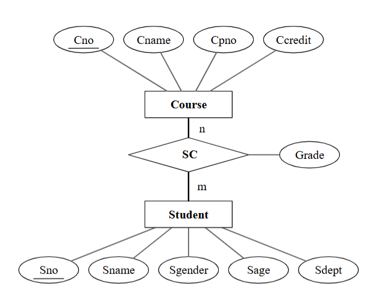</center>

其中

椭圆型：属性，带下划线的是标识符（主键）

方框：实体

菱形框：联系

数字：从对面看，二者的关系数量，图中就是说**一个学生对应n门课，一门课对应m个学生**，这里的$m,n$都是虚指，意思是学生和课程是**多对多**关系


#### 4.1.1 E-R联系类型

统统都可以化为二元联系

<center>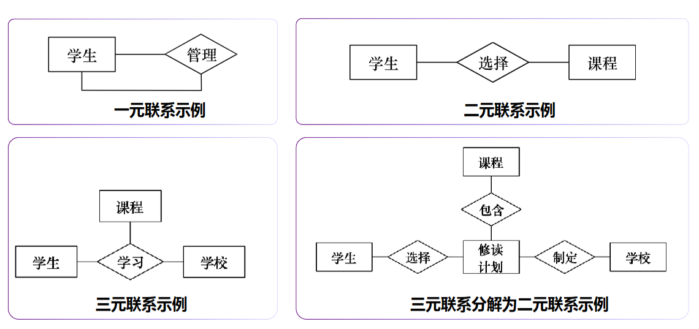</center>


#### 4.1.2 实体 OR 属性

简化原则：能当属性的，就不当实体

两条准则：

1. 属性不能包含其他属性
2. 属性不能与其他实体有联系


如下面的例子，如果”职称“与”工资“无关，那么可以向上图定义；但是如果有关，那么就得用下面的模式

<center>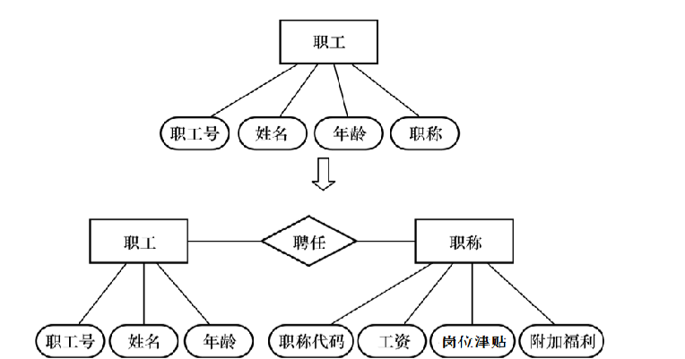</center>


**联系属性还是实体属性**

联系的属性一般存在于**多对多**联系，但也不一定


#### 4.1.3 约束

包括**属性约束**和**联系约束**，前者见第二章


**联系约束**

包括**基数**和**参与度**

基数：实体参与联系的**最大**次数，也就是x对x联系中的x

参与度：实体参与的联系的**最小**次数

<center>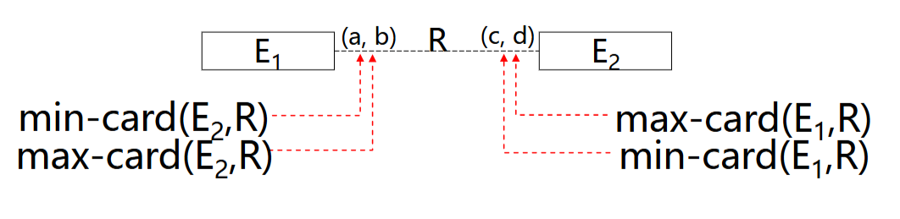</center>

意思是$E_1$与$(c,d)$个$E_2$的实体发生联系


### 4.2 逻辑设计

#### 4.2.1 **实体集转换**

实体集：关系模式（table）

属性：属性

标识符：键


#### 4.2.2 **联系转换**

一元/三元联系，都可以用二元联系表示，下面仅讨论二元联系


**一对一联系**

有两种转换方式

1. 在**任意**一个关系模式的属性中加入**另一个关系模式的键**，和**联系的属性**
2. 添加一个关系模式，包含**联系的属性**和**各个实体集的标识符**


**一对多联系**

有两种转换方式

1. 在**n端**实体中**加入1端**实体的标识符和联系的属性
2. 添加一个关系模式，属性是**各个**实体集的标识符和联系的属性，**主键是n端**的标识符


**多对多联系**

添加一个新的关系，属性是各个实体集的标识符和联系的属性，键是两个实体集的**标识符的组合**


### 4.3 数据库规范化

#### 4.3.1 函数依赖

一个关系中属性或属性组的依赖和制约关系（约束），定义如下：

给定的关系$R(U)$，其中$X,Y \subseteq U,\,\,\, \forall t,l\in R$

若$t[X]=l[X]\Rightarrow t[Y]=l[Y]$，称$Y$函数依赖于$X$，或$X$函数决定$Y$，记为
$$
X\rightarrow Y
$$
若不依赖，记为
$$
X\nrightarrow Y
$$
若$X,Y$相互函数依赖，记为
$$
X \leftrightarrow Y
$$
一个函数依赖要成立，需要使$X,Y$的任意可能值都满足这个依赖，即使这些值不在表中存在


**用函数依赖定义键**

一个/多个属性的集合$K$满足

1. 其他属于函数依赖于$K$
2. 其他属性都不函数依赖于$K$的任意真子集

那么$K$就是这个关系的键


$K$是$R(U)$的超键，当且仅当$K \rightarrow U$


**非/平凡函数依赖**

**非平凡函数依赖**
$$
X\rightarrow Y\and Y\nsubseteq X
$$
则称非平凡

反之是子集则为平凡，很好理解一个属性组一定决定自身

所有关系都满足平凡函数依赖，一般指的都是非平凡依赖


**完全/部分函数依赖**

**完全函数依赖**
$$
X \rightarrow Y \and X^{'}\nrightarrow Y \Rightarrow X\stackrel{f}{\rightarrow}Y
$$
其中$X^{'}$是$X$的任意真子集，f为fully

否则称部分函数依赖，记为$X \stackrel{p}{\rightarrow} Y$


**传递函数依赖**
$$
X \rightarrow Y\and Y\nrightarrow X\and Y\rightarrow Z
$$
则称$Z$对$X$有传递函数依赖


**多值依赖**

对于$R(U)$，设$X,Y\subseteq U \,\,\,, Z = U-X-Y$，当存在$(x,y_1,z_1),(x,y_2,z_2)$时，也存在$(x,y_1,z_2),(x,y_2,z_1)$

那么称$Y$在$R$上多值依赖于$X$，记为
$$
X\rightarrow\rightarrow Y
$$
也就是对于任意的$a[X]=b[X] \in R(U[X])$，交换$a,b$的$Y$的值，交换后的元组也存在于$R(U)$中（不一定在表中），则称$Y$多值依赖于$X$

直观上说，就是$X$决定了$Y$的取值范围，$Y$的取值与$Z$无关


如果$Z = \phi$，那么这是平凡多值依赖，反之是非平凡


函数依赖是多值依赖的一个特例，此时取值范围唯一


**连接依赖**

一个关系分为若干子关系，这些子关系通过连接操作后得到原始关系，则连接依赖成立

多值依赖就是可以分解为两个子关系的连接依赖


#### 4.3.2 关系模式的范式

一个第一辑的范式，通过模式分级可以转换为若干个高一级的范式，这个过程叫规范化

通常分解到第三范式就行

<center>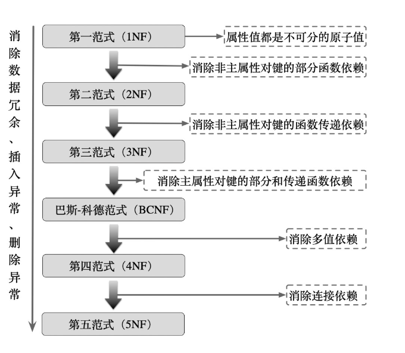</center>


**第一范式**

指$R$中每一个属性都不可再分


**第二范式**

满足第一范式，且每一个非主属性都完全函数依赖于任一个候选键

主属性：包含在候选键中的所有属性，即使不是主键

如果一个关系只有一个候选键，那么一定满足第二范式


**第三范式**

满足第一范式，不存在非主属性对候选键的传递函数依赖


**巴斯-科德范式**

满足第三范式，任何属性都非平凡地完全函数依赖于$R$的候选键

即：$X\rightarrow Y \and Y\nsubseteq X\Rightarrow X$是超键

如果一个关系满足BCNF，那么在函数依赖的范围内，它已经实现了关系模式的彻底分解，消除了插入和删除异常


**3NF和BCNF的联系**

1. 满足BCNF，一定满足3NF
2. 满足3NF，且只有一个候选键，则满足BCNF


**第四范式**

满足BCNF，消除了多值依赖


### 4.4 数据依赖的公理系统

#### 4.4.1 Armstrong公理系统

**逻辑蕴含**

对于满足函数依赖$F$的关系$R<U,F>$，函数依赖$X\rightarrow Y$成立，则称$F$逻辑蕴含$X\rightarrow Y$

将$F$蕴含的所有函数依赖的集合称为$F$的闭包，寻找这个集合的推理规则就是Armstrong公理系统


**公理定义**

$R<U,F>,U=\{A_1,A_2,\ldots ,A_n\}$，存在以下规则

1. 自反律：$Y\subseteq X\subseteq U$，则$X\rightarrow Y$为$F$所蕴含（平凡函数依赖）
2. 增广律：$X\rightarrow Y$为$F$所蕴含，且$Z\subseteq U$，则$XZ\rightarrow YZ$为$F$所蕴含，其中$AB$表示集合$A\cup B$
3. 传递律：$X\rightarrow Y,Y\rightarrow Z$为$F$所蕴含，则$X\rightarrow Z$为$F$所蕴含

根据公理可以推出以下推理规则

1. 合并规则：$X\rightarrow Y,X\rightarrow Z$，则$X \rightarrow YZ$
2. 分解规则：$X\rightarrow Y, Z\subseteq Y$，则$X\rightarrow Z$
3. 伪传递规则：$X\rightarrow Y, WY\rightarrow Z$，则$XW\rightarrow Z$

还有一条引理：$X\rightarrow \Pi A_i$成立的充要条件是$X\rightarrow A_i$成立


#### 4.4.2 函数依赖的闭包

将$F$蕴含的所有函数依赖的集合称为$F$的闭包，记作$F^+$

**属性集的闭包**：$X_{F}^+=\{A|(X\rightarrow A)\in F^+\}$，很显然$F^+ = \bigcup X_i\rightarrow Y_i$

**如何计算**

输入：$X,F$

输出：$X^+_F$

算法：

1. 一个序列$X^{(i)}$，令$X^{(0)}=X$
2. 求$B$，其中$B=\{A|(\exist V)(\exist W)(V\rightarrow W\and V\subseteq X^{(i)})\and A\in W\}$
3. $X^{(i+1)} = X^{(i)}\cup B$
4. 当$X^{(i)}$不再变化时，迭代结束

步骤二相当于将$X^{(i)}$的子集的函数依赖的右边加入$B$中


<font color=red>例：</font>如图

<center>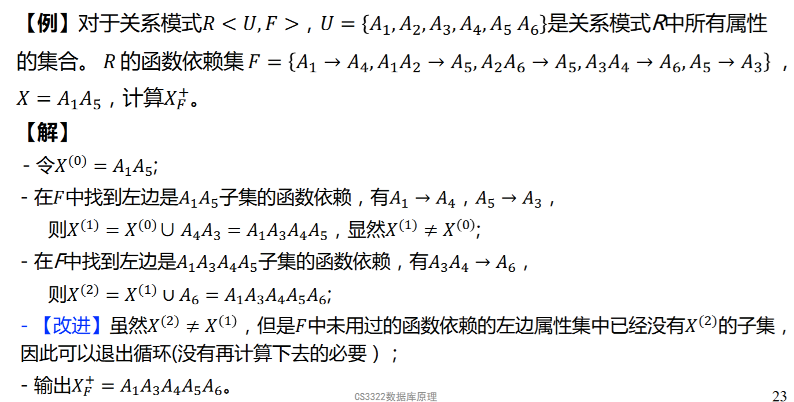</center>


**属性集闭包的作用**

1. 判断函数依赖是否成立：$X\rightarrow Y \in F^+\Leftrightarrow Y\subseteq X^+_F$
2. 判断是否是键：$X^+_F = U$，则$X$是超键；若还有$X$的任意子集不满足前式，则$X$是候选键


#### 4.4.3 函数依赖的等价和最小函数依赖集

**函数依赖的等价**：$F^+ = G^+$，则$F$与$G$等价

但是求闭包开销很大，这里给出等价的充要条件：$F\subseteq G^+ \and G\subseteq F^+$

前者很容易证明后者，这里给出充分性证明：

$\forall X\rightarrow Y\in F^+$，有$Y\subseteq X^+_F\subseteq X^+_{G^+}$，故$X\rightarrow Y\in (G^+)^+=G^+$，故$F^+\subseteq G^+$；同理可以证明另一边

 而判断$F\subseteq G^+$是否成立就是判断$\forall X\rightarrow Y \in F^+$，是否有$Y\subseteq X^+_G$


**最小函数依赖集（最小覆盖）**

当函数依赖集$F$满足以下条件时，是最小覆盖

1. $F$中任一函数依赖的右边只有一个属性
2. $F$中不存在多余的函数依赖（就是不能有能被余下的函数依赖蕴含的依赖）
3. $F$中的任一函数依赖的左边没有多余的属性

每一个函数依赖集都等价于一个最小覆盖$F_m$，且$F_m$不唯一


### 4.5 基于关系模式的分解

#### 4.5.1 关系模式分解

对于关系模式$R<U,F>$，其分解指的是$\rho =\{R_1<U_1, F_1>, R_2<U_2,F_2>,\ldots ,R_n<U_n,F_n>\}$

并且这个分解需要满足

1. 关系不丢失：$U = \bigcup U_i$
2. 模式不冗余：不存在$U_i \subseteq U_j$
3. 依赖不丢失：$F_i$是$F$在$U_i$上的投影，$F_i=\{X\rightarrow Y|X\rightarrow Y \in F^+\and XY\subseteq U_i\}$

分解有很多种，但需要满足分解前后的等价性

1. 数据等价：分解的**无损链接性**，指分解后的关系可以通过**自然连接**恢复为原关系
2. 语义等价：分解要保持**函数依赖**


#### 4.5.2 检验无损分解的算法

输入：$R<\{A_1,A_2,\ldots,A_n\},F>,\rho=\{R_1,R_2.\ldots ,R_m\}$

输出：$\rho$是否为无损分解

算法：

1. 构造一个m行n列表，每一行对应一个分解的关系模式，每一列对应一个属性
2. $A_j\in R_i$，则在第i行，第j列标记上$a_j$，否则为$b_{ij}$
3. 依次检查$F$中的每一个函数依赖，若$X\rightarrow Y\in F$，在$X$的分量上寻找标记相同的行，将这些行的$Y$的标记改为相同值，若存在$a_j$则标记为$a_j$，否则标记为$i$最小的$b_{ij}$
4. 如果存在一行为$a_1,a_2,\ldots ,a_n$，那么$\rho$是无损分解，否则不是
5. 做完一轮$F$还得再做几轮，直到没有标号的改变为止


<font color=red>例：</font>如图

<table>
    	<tr>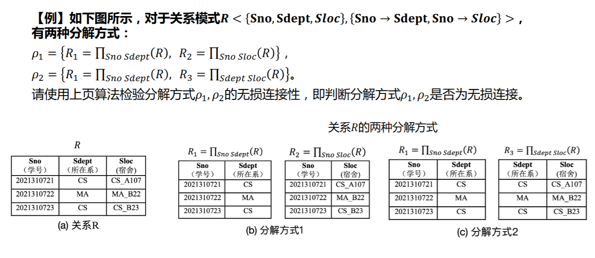</tr>
        <tr>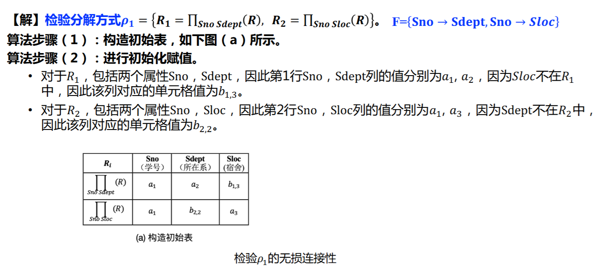</tr>
        <tr>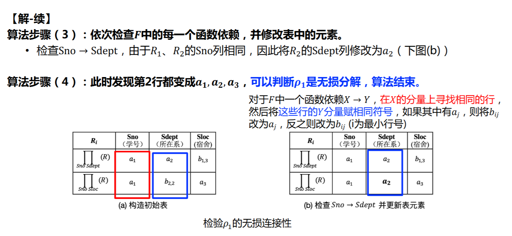</tr>
</table>


**特殊情况**

对于只有两个分量的分解，存在更快的判断方法

$\rho$是$R$的无损分解的充要条件是$\{(R_1\cap R_2) \rightarrow [(R_1-R_2)\or (R_2-R_1)]\}\in F^+$

满足一个就行，为了方便就这么写了


#### 4.5.3 检验保持依赖的算法

很遗憾，这个没有算法

1. 寻找每个分量的函数依赖$F_i$，记$G = \bigcup F_i$
2. 若$G^+ = F^+$，即$G$与$F$等价，那么$\rho$保持依赖


**注意**

无损链接仅能保证不丢失信息；保持依赖仅能保证依赖等价

二者是相互独立的标准，**没有任何关系**


#### 4.5.4 模式分解算法

**分解到3NF，保持函数依赖**

<table>
    	<tr>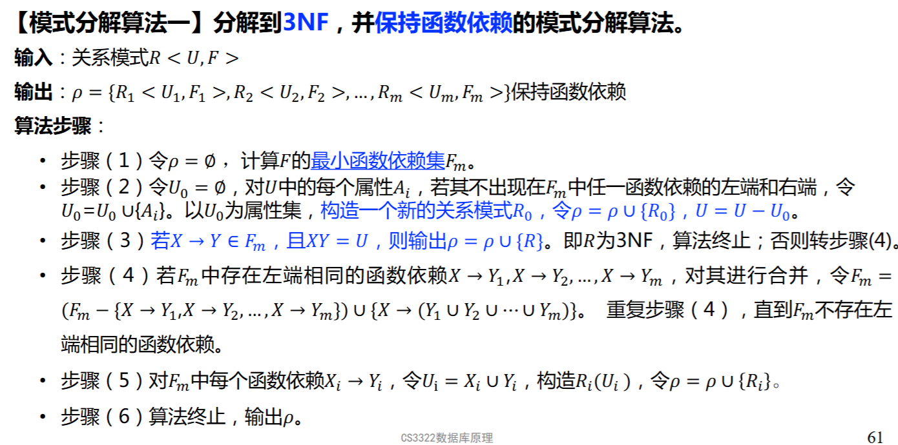</tr>
        <tr>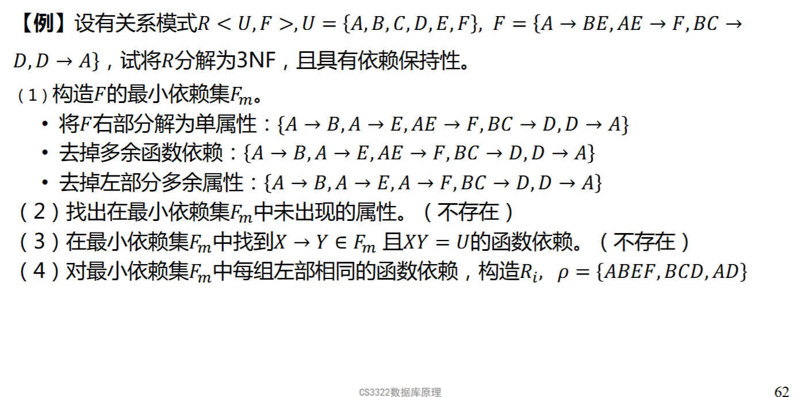</tr>
</table>


**分解到3NF，即保存无损连接又保存函数依赖**

<table>
    	<tr>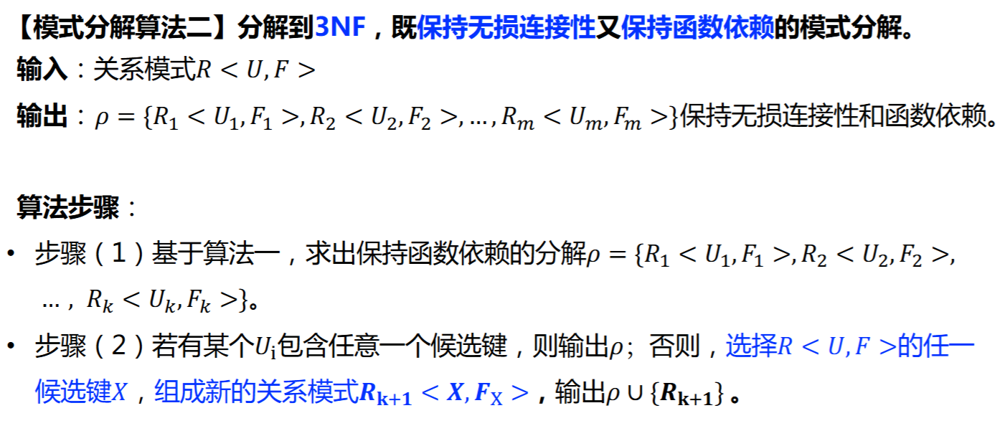</tr>
        <tr>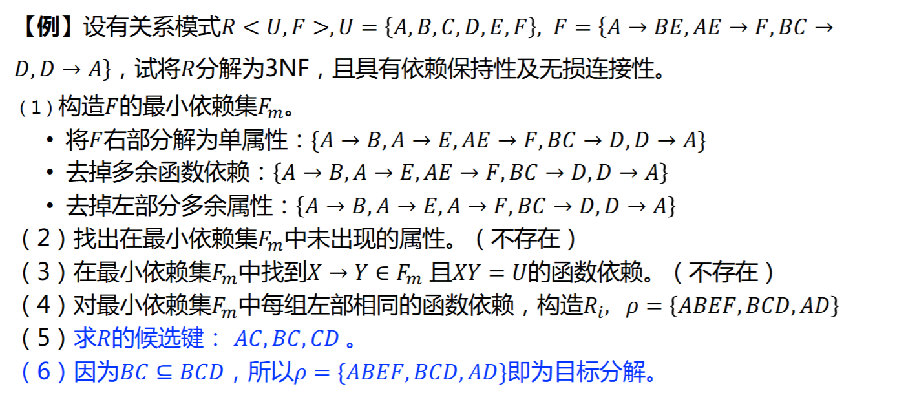</tr>
</table>


**分解到BCNF，保持无损连接**

<table>
    	<tr>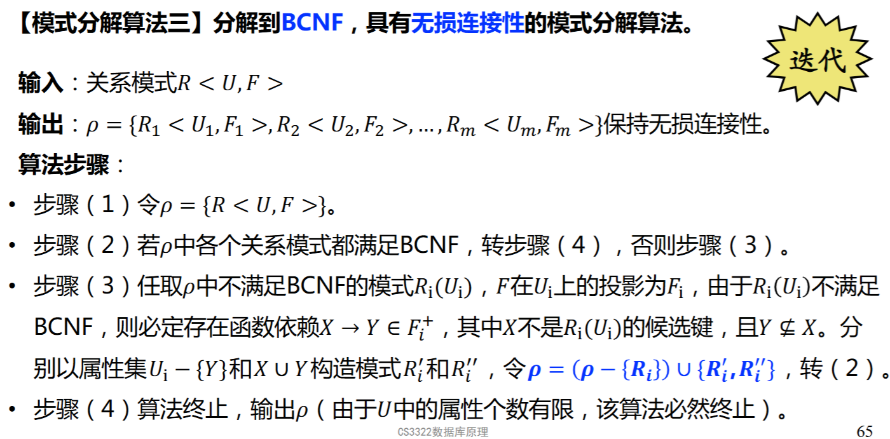</tr>
        <tr>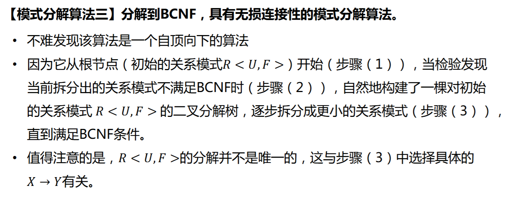</tr>
    	<tr>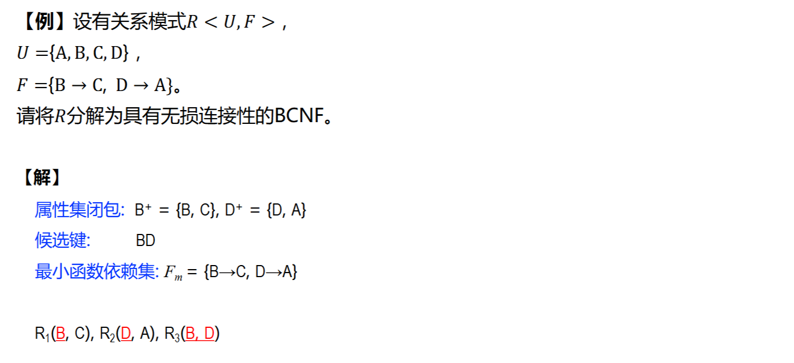</tr>
</table>


## 5 并发控制

### 5.1 并发事务的冲突

#### 5.1.1 脏读

事务之间可以看到未提交的数据

<center>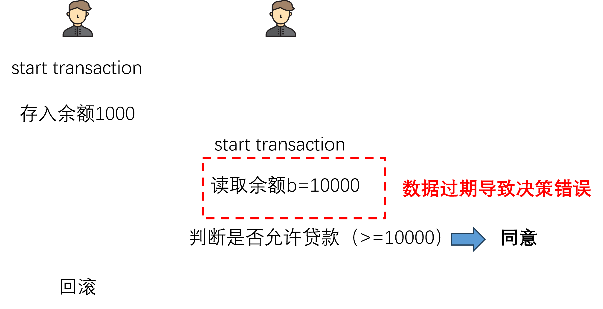</center>


#### 5.1.2 不可重复读

事务之间可以看到已提交的数据，但是不能得知**数据是否会更新**

<center>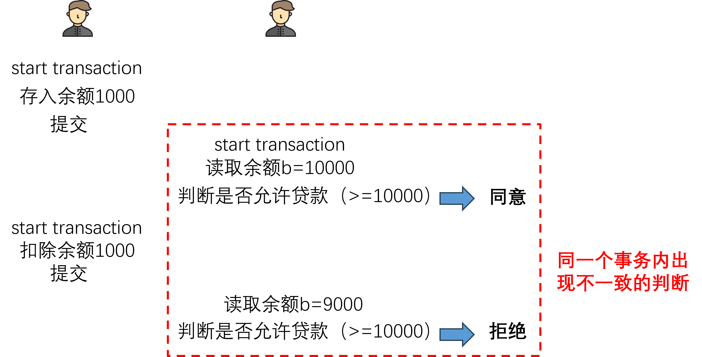</center>


#### 5.1.3 幻读

事务之间可以看到已提交的数据，但是不能得知数据的条目是否变化

<center>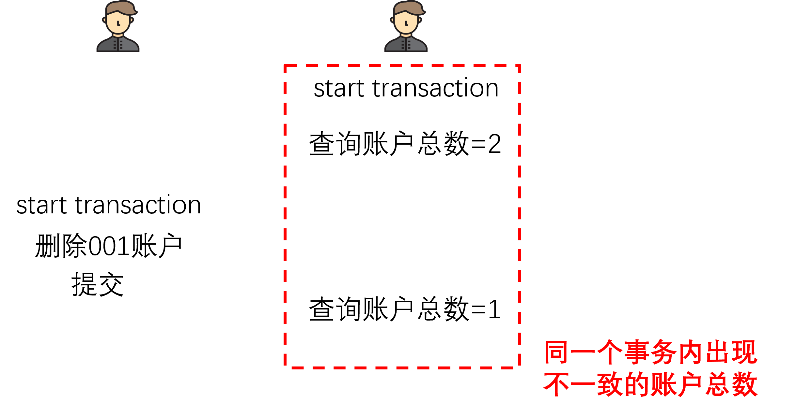</center>

幻读和不可重复读的区别，大致可以对应为`INSERT/DELETE`和`UPDATE`的区别


#### 5.1.4 写冲突

两个事务同时提交对一个数据的修改

<center></center>


#### 5.1.5 隔离机制

* **读未提交**：最低级的隔离，可以允许脏读
* **读提交**：事务只能读取其他事务已提交的事务
* **可重复读**：确保事务可以多次读取统一数据，保证每次结果相同
* **串行化**：以串行的方式执行，没有并发，性能差

这几个隔离中，只有最高级的**串行化**可以避免写冲突

<center>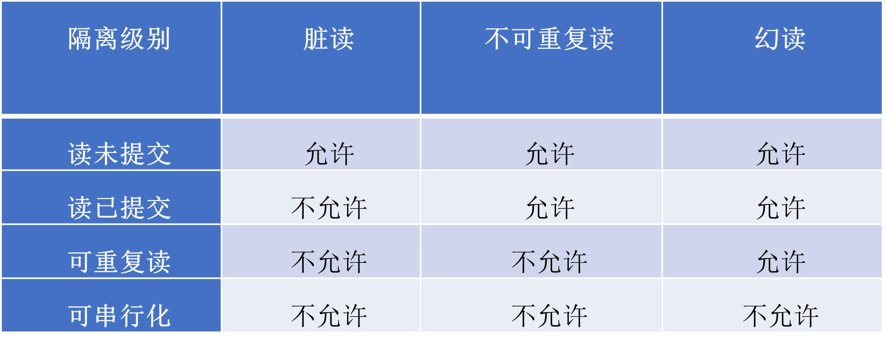</center>


### 5.2 锁

并发错误来自于**多个事务对一项数据的同时读写**，因此出现了事务锁。锁一定是**事务**对数据项施加的。


#### 5.2.1 共享锁（读锁，S锁）

某个事务在数据项d上加了S锁，那么

* 该事务只能读取d，不能修改

* 其他事务存在
  1. 不加锁的情况下无法读取d
  2. 加S锁可以读取d


#### 5.2.2 互斥锁（写锁，X锁）

某个事务在d上加了X锁，那么

* 该事务能读写d
* 其他事务存在
  1. 不能对d加S/X锁
  2. 不加锁时无法读写d


#### 5.2.3 锁带来的问题

在一个事务加锁的情况下，另一个事务无法操作数据，必须等待加锁事务结束，那么这可能导致

1. **饿死**：锁导致等待，等的时间可以很长

   如何避免：先来先服务，按顺序给资源

2. 不可解决不可重复读，幻读和写冲突

3. **死锁**：n个事务需要的锁和这个锁所在的事务成环

必须对事务的调度顺序做出规定


#### 5.2.4 二阶段锁

希望事务将自己的操作一次性做完，且中途不能被打扰，这样就能解决所有的冲突，由此引入二阶段锁

将事务锁分为两个阶段


**加锁阶段**

1. 在这个阶段事务可以获取**所有**需要的锁
2. 每当事务访问一个新的数据时，必须先加锁
3. 这个阶段持续到事务获取所有的锁


**解锁阶段**

1. 一旦事务开始解锁，那就不能再加锁
2. 开始于事务释放第一个锁，结束于释放了所有的锁


二阶段的锁数目变化如图

<center>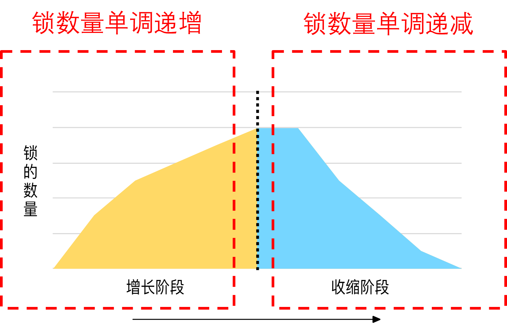</center>


#### 5.2.5 解决死锁

**死锁预防**

死锁的形成是因为两个事务相互等待，那么首先不能允许相互等待

有两种方式，但都是基于时间戳确定老事务To和新事物Tn

1. Wait-Die

   如果Tn持有锁，To申请这个锁，那么To等待

   如果To持有锁，Tn申请这个锁，那么Tn被撤销，但Tn保留创建的时间戳（否则会饿死）

2. Wound-Wait

   如果Tn持有锁，To申请这个锁，那么Tn被撤销，保留原来的时间戳

   如果To持有锁，Tn申请这个锁，那么Tn等待


**死锁检测与恢复**

检测：检测事务依赖，如果成环那么就产生了死锁，这时需要选择一个事务牺牲

牺牲的依据：

1. 事务的时间戳
2. 事务已经执行的语句数量
3. 事务已经持有的锁

时间戳越新，执行的语句和持有的锁越少，那么事务越先被牺牲


**设锁超时重启**

设置一个事务的最长等待时间，当事务超时时仍没有取得需要的锁，那么事务重启


#### 5.2.6 锁的粒度

根据被施加锁的数据项的粒度（数据库，表，记录，属性等），锁也有锁粒度（依次减小）

锁的粒度越**大**，数据项越**少**，管理锁的**开销越小**，事务间发生**冲突的可能越大**，并**发度越低**


**多粒度锁**

数据库中所有对象构成一棵**多粒度树**，每一个节点都可以独立加锁

**对某个节点加锁表示对其后代加相同类型的锁**


**显示锁**：该节点直接被加上的锁

**隐式锁**：该节点没有直接加，但是其祖先被加锁

<center>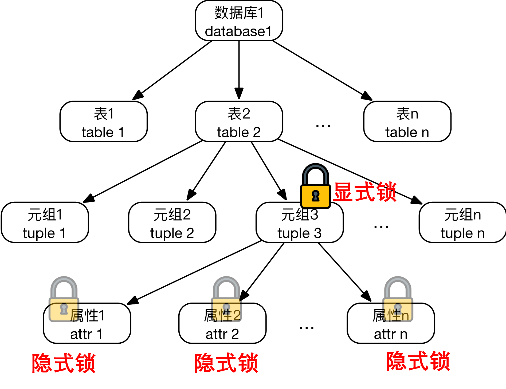</center>


#### 5.2.7 意向锁

对某个节点的所有祖先加的锁


**意向共享锁（IS锁）**：某个数据加共享锁，其祖先加的这个

**意向互斥锁（IX锁）**：某个数据加互斥锁，其祖先加这个

**共享意向互斥锁（SIX锁）**：某个数据同时**显式地**加共享锁和IX锁

<center>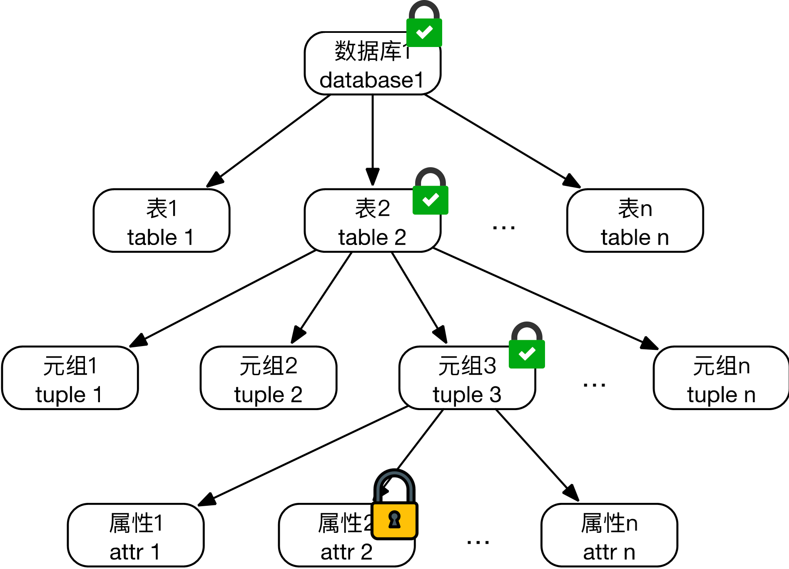</center>

这些所的容斥关系如图

<center>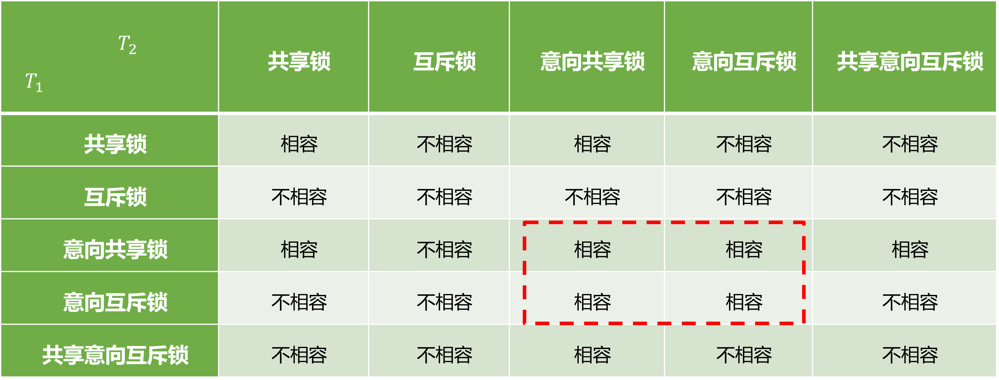</center>

这样设计，意味着允许同时读写一个大粒度下的不同细粒度数据项，**提高了并发度**


#### 5.2.8 谓词锁

作用于满足特定条件的所有对象，这个锁的施加条件比较特殊

1. 事务T1想要施加谓词锁，这个锁影响的所有数据**都不能存在互斥锁**
2. 事务T1想要给某些存在谓词锁的数据进行更改（`UPDATE,INSERT,DELETE`），需要检查这些数据的**旧值和新值**是否满足谓词锁，满足，则需要谓词锁释放后才行


#### 5.2.9 索引区间锁

在索引上施加的锁，用于锁定一个特定的索引键值范围

影响所有在这个范围内的索引，**即使目前的表中不存在**

<center>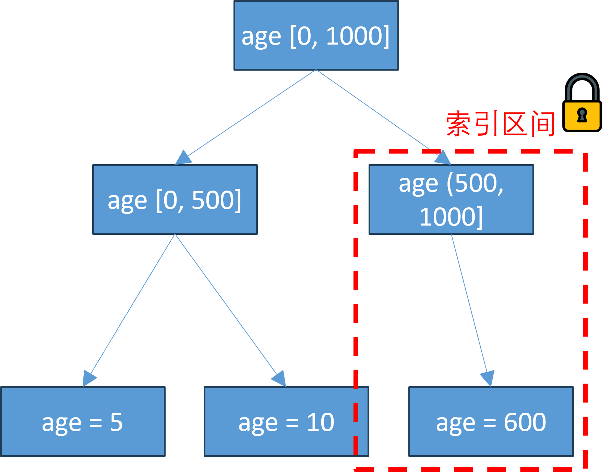</center>

索引区间锁的检查与索引更新同步，开销不大，但是加大了锁的范围，导致更多的冲突和等待


索引区间和谓词锁是为了**减少开销**存在的，所有满足条件的数据项加一把锁，减少了需要的锁的数目


### 5.3 事务

* 原子性（A）：几个操作一起做完才能提交，不可分割
* 一致性（C）：转账不能出错，金额不变
* 隔离性（I）：串行和并行的结果一致，互不干扰
* 永久性（D）：提交完不会变


### 5.4 调度

事务执行的顺序（并发/串行）

<center>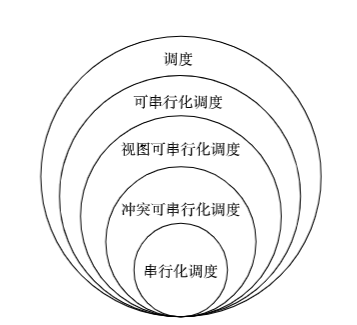</center>


#### 5.4.1 可串行化调度

一个并发调度$S$，存在一个串行调度$S^{'}$，两个效果一致；不需要锁的机制，也没有锁的问题

$N$个事务的串行排列一共$N!$种，那么判断一个调度是否可串行的复杂度为$O(N!)$


**交换**：不同事务的两个相邻操作交换顺序

交换后等价的情况：

* R(A), R(A)
* R(A), R(B)
* R(A), W(B)
* W(A), W(B)

非等价：

* R(A), W(A)
* W(A), W(A)


#### 5.4.2 冲突可串行化调度

并发调度$S$，通过等价交换可以变成可串行化调度$S^{'}$，则是一个冲突可串行化调度

根据不等价交换的执行顺序构建一张有向图（优先图），当图中出现环时，这个调度不可串行化，即不是冲突可串行化

对于一个冲突可串行化调度，用拓扑排序可以找到一个串行化调度


#### 5.4.3 视图可串行化调度

每个事务读取到的数据结果与某个串行化调度的结果相同

$S$与$S^{'}$的读取的$X$的初始值、更新值和最终写入结果相同


**重画有向图**

引入$T_0=W(A)$，这是最先的操作，保证初始值一致；$T_{n+1}=R(A)$，这是最后的操作，保证最终结果一致

如果$T_i$读取了$T_j$的变量，那么$T_j$指向$T_i$

然后通过逻辑上的先后连接没有连接但存在关系的事务

<font color=red>例：</font>

<center>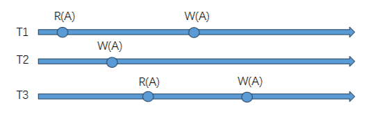</center>

<center>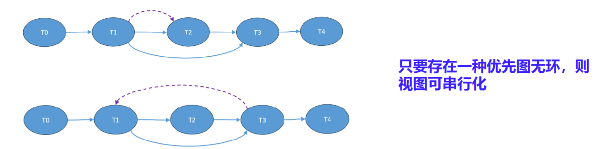</center>

判断完第一步，得到0->1，2->3->4；判断逻辑先后，得到1->2，1->3，因为是1先执行的

然后1有w，可以放到2->3前/后，只要一种无环就行


### 5.5 其他并发控制机制
#### 5.5.1 乐观并发控制技术

假设：多个事务同时操作一个数据的概率很低

分为三个阶段

1. 读取：不加锁，允许其他事务访问
2. 验证：准备提交时，检查事务执行过程中有无修改
3. 不/存在问题：提交/回滚，重试


如何回滚？

**时间戳排序协议**

每个事务有唯一的时间戳，每次读写都记录这个时间点的时间戳，对比这个时间和事务的时间戳进行决定

* 事务只能读之前写的数据
* 事务只能写之前读的数据


#### 5.5.2 多版本机制

记录多个提交的版本，最终再选择（git）


## 6 数据库恢复

### 6.1 数据库故障

* 事务故障：资源冲突导致死锁
* 系统故障（软件）
* 磁盘故障（硬件）：或者其他非易事存储介质
* 自然灾害。。。


### 6.2 缓冲池策略

数据库系统产生错误，在RAM中的数据没写到磁盘就消失了

**如何恢复**？

* 撤销未完成（ROLLBACK）修改
* 重做已完成（COMMIT）修改


**未提交事务**

* 允许修改磁盘：STEAL，缓冲池效率高（占用完就消除了）
* 不允许：No-STEAL，效率低，并发低（一直占用）

**以提交事务**

* 强制修改：FORCE，I/O效率低（占用I/O接口，带宽满了就得等）
* 不强制修改：No-FORCE，效率高


上面有4种组合

考虑下面的故障，四种组合的恢复策略分别是

<center>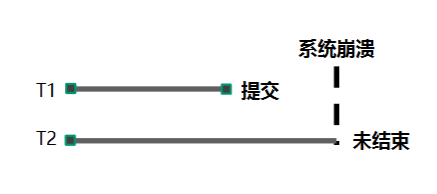</center>

**No-STEAL AND FORCE**

执行效率低，但是恢复最友好，T1T2都不需要任何操作


**NO-STEAL AND No-FORCE**

需要重做T1


**STEAL AND FORCE**

需要撤销T2


**STEAL AND No-FORCE**

执行效率高但是恢复难度高，T1重做，T2撤销，最麻烦


### 6.3 数据库日志

日志记录的序列，顺序写入磁盘，不会修改；只能写不能改


#### 6.3.1 Undo回滚日志

**格式**：<T,X.v_old>，分别是事务标识符，数据项，数据项修改**前**的值

**产生时机**：T修改X的值（W(X)）时产生

**作用**：用于回滚


#### 6.3.2 Redo重做日志

**格式**：<T,X.v_new>，分别是事务标识符，数据项，数据项修改**后**的值

**产生时机**：T修改X的值（W(X)）时产生

**作用**：用于重做


#### 6.3.3 预写日志WAL

日志必须在磁盘中才有效，且必须比数据先写入磁盘（Write Ahead Logging）

日志写回磁盘的顺序和生成的顺序一致，且只有<T,commit>写入磁盘后，事务T才算结束

因此事务执行前必先写日志，然后才能做缓冲池策略，恢复时就看日志


### 6.4 故障恢复机制

#### 6.4.1 事务分类

分为三类：

* 已完成，存在<T,start>和<T,commit>，没写入磁盘需要redo
* 不完整，只有<T,start>，已经写入磁盘需要undo
* 已终止，存在<T,start>和<T,rollback>，不需要恢复


#### 6.4.2 No-STEAL AND FORCE

使用影子拷贝法，将原始数据拷贝到另一个数据库（再开空间），修改完后，事务提交完才提交到原始数据库

空间开销大，不实用


#### 6.4.3 STEAL AND FORCE

需要WAL和Undo，不需要Redo，使用Undo日志，恢复流程如下

1. 找到**未提交**的事务
2. **回滚**这些事务
3. 写入<T,rollback>

恢复时，**从后向前看日志一次**，每条记录有以下动作

* <T,commit>，将T标记为已提交，不操作
* <T,rollback>，将T标记，不操作
* <T,X,v_old>，如果T没有任何标记，那么将X恢复为v_old
* <T,start>，如果T没有标记（不完整），在最下方下入<T,rollback>


#### 6.4.4 No-STEAL AND No-FORCE

需要WAL和Redo，不需要Undo，使用Redo日志，恢复流程如下

1. 找到**提交**的事务
2. **重做**这些事务
3. 写入<T,commit>

恢复操作，整个日志**顺序扫描两遍**

1. 第一次，记录所有commit和rollback并标记
2. 第二次，<T,X,v_new>，根据T的标记，commit就将X写为v_new，rollback就不管
3. 对于<T,start>，没有标记的，那么就写一个rollback


#### 6.4.5 STEAL AND No-FORCE

需要WAL，Redo，Undo，使用混合日志，恢复流程就是上面两个的混合

**记录流程**

* 开始事务，<T,start>
* 修改事务，<T,X,v_old,v_new>
* 提交事务，<T,commit>
* 终止事务，<T,rollback>


**恢复流程**

1. 第一次**顺序**扫描，记录所有的commit和rollback

   有start而没有commit/rollback，则需要撤销；有start且有commit，需要重做

2. 第二次**顺序**扫描，**重做commit**的T，也叫重放历史

3. 第三次**逆序**扫描，**撤销没有标记（不完整）**的T


### 6.5 检查点

只会读取检查点之后的日志


#### 6.5.1 全量检查点

设置流程

1. 停止所有事务
2. 将RAM没写的数据写到磁盘
3. 记录检查点
4. 恢复事务


#### 6.5.2 涉及检查点的恢复

* 检查点之前完成（commit/rollback）的事务不用管
* 检查点之后的commit需要redo
* 所有未完成的事务需要undo


## 7 数据库物理存储和索引

### 7.1 数据库的物理存储

#### 7.1.1 计算机系统的存储架构

**内存的层级结构**

见体系结构，微机原理


**磁盘**

最小读写单位：扇区

磁盘块/页：连续的多个扇区

一个页面的访问时间包括：寻道，旋转，传输

顺序访问对磁盘更加友好，平均的访问时间更少


**缓冲池**：内存中存放大量磁盘页面的区域，减少磁盘的访问

**缓冲池页面替换策略**

* LRU，最近最少使用，least recent use

  在某些情况下使用不佳，见体系结构

* 先进先出

* MRU，most recent use，在连接操作时使用


#### 7.1.2 记录的组织方式

**记录**：字节的序列

有一个header用于描述记录（meta data），类似于Cache的tag

按照关系定义的顺序存储各个属性，定长的属性写在前边，变长的（VAR）用指针指向末尾，从后向前写；记录头后紧跟着指针数组，指向每个属性

每个属性值在记录中存储位置的偏移量是4B/8B的整数倍

<center>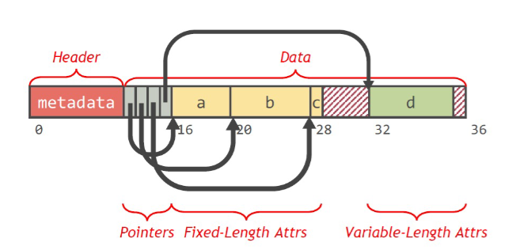</center>


**页布局**：包含页头和页数据

页头就是meta data，页数据就是data


#### 7.1.3 文件的组织方式

**无序文件组织**：记录可以在磁盘上的任意位置存储

存在两种管理方式：

1. 删除的文件做标记，不删除；新文件加在末尾
2. 删除的文件做标记；新文件插入在标记处

文件需要定期重组，真的删除标记了删除的文件，将文件之间连续排列，回收未利用空间

特点：插入效率高，检索效率非常低


**有序文件组织**：记录按照某个属性顺序插入

插入效率低，检索效率高

**溢出文件**：为未来可能的文件预留一块空间，用来插入文件，这些文件称为溢出文件

溢出文件和主文件各自是有序的，但二者是独立的

必要时需要重组


**散列文件**：就是哈希表储存文件，需要一个散列函数用于确定地址分布

插入效率高，检索效率高


### 7.2 数据库索引

#### 7.2.1 索引分类

**按物理存储类型**

* 聚集索引：数据按照查找键排序，一张表只能有一个
* 非聚集索引：不按键排列，可以有多个

**按粒度**

* 稀疏索引：索引到文件
* 稠密索引：索引到记录

**等**


**查询类型**

* 点查询：xx=0，使用哈希索引，B+树索引
* 范围查询：xx>0，使用B+树索引
* 多列条件查询：xx=0 AND yy=1，位图索引
* 空间范围查询：多维的范围查询，多维索引


#### 7.2.2 B+树索引

**结构**：平衡多叉查找树

扇出m：每个节点的最大分叉数

* 子节点数目范围：$[\lceil \frac{m}{2} \rceil, m]$
* 查找键数目范围：$[\lceil \frac{m}{2} \rceil-1, m-1]$，分为了N+1个子节点

叶节点之间存在双向链表

节点的左子树都比节点小，右子树都大；叶节点是升序的

访问的时间是$\log n$，仅与树的高度有关

<center>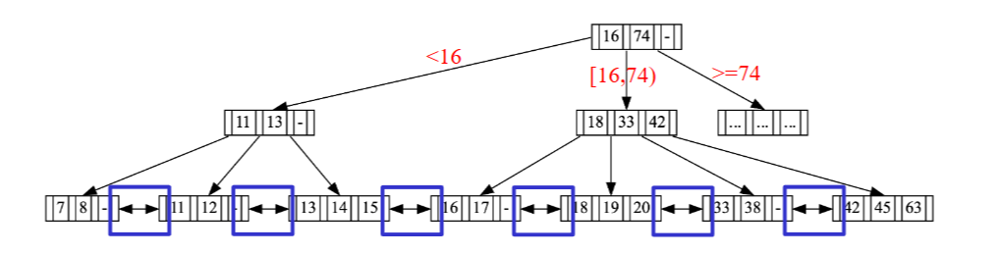</center>


**点查询**：从根节点逐层加载，直到叶节点，一定会到叶节点

**区间查询**：查询$[L,H]$的值，根据$L$找左端点，然后用链表一直找，直到$>H$，$\leq H$的都输出


**插入算法**

* 找到叶节点L
* 有空间就插入
* 没空间就分裂，向上递归
  * 假设L的中间值为K，那么<K的放原来节点；>K的，将K作为父节点的一个关键字，插入到这个关键字的右子树
  * 如果父节点也满了，需要继续分裂
  * 向上递归，直到ROOT分裂，那么会多一个ROOT，B+树深一层


**删除算法**

* 找到叶节点L
* 删除了满足子树条件就ok
* 不满足，那么需要合并节点，向上递归
  * 向兄弟节点借一个叶子，并且更新被借的兄弟节点，使二者都半满
  * 如果都不能半满，就合并两个父节点，将父节点的父节点变为子节点，子节点中值变为父节点
  * 向上递归，直到ROOT合并，B+树少一层

<center>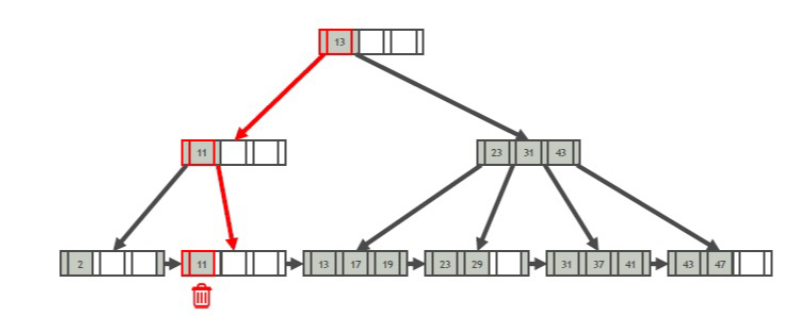</center>

<center>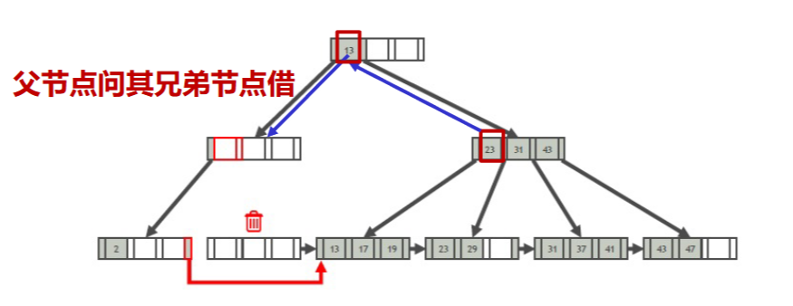</center>

<center>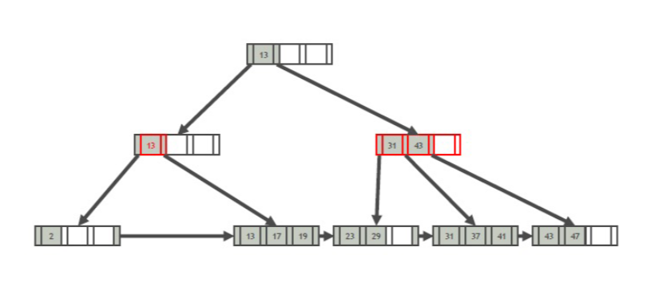</center>

<center>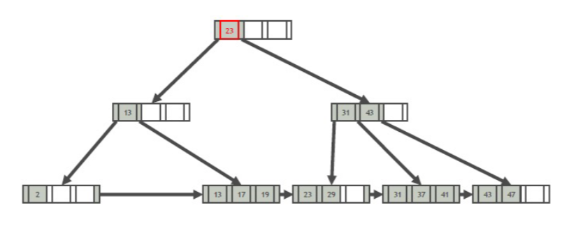</center>


#### 7.2.3 哈希索引

**静态哈希**：桶的数目不变，发生溢出时需要添加桶并重排

* 闭哈希：寻找空位置：线性探测（+1，+2，+3，容易堆积），平方探测（+1，+4，+9）
* 开哈希：哈希桶链表，同一个地址，用链表连接，长了就没有查询效率了

**动态哈希**：桶的数目动态变化

* 可扩展哈希表：存在问题
  * 每次扩容时会阻塞访问，降低性能
  * 少量的桶多次溢出，却要对整个表扩容，造成空间浪费
* 线性哈希表：对可扩展哈希的解决


## 8 查询

* 查询树：叶节点一定是关系，自下向上运算；存在最优的查询树

  <center>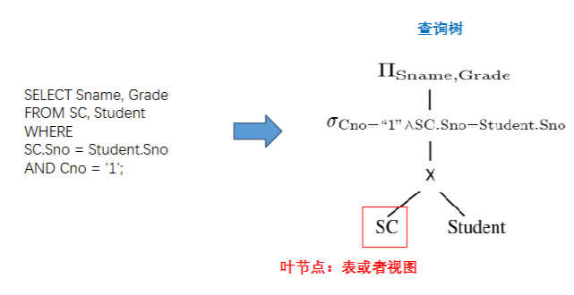</center>

* 编译：

  * 词法：关键词（SELECT），标识（LABEL），常量（1），运算符（=），分隔符（，；）；在状态机中匹配
  * 语法：建立语法树，看看每个关键词的语法使用是否正确
  * 语义：检查语义正确性，建立查询树

* 查询优化

  * 逻辑优化：依赖于逻辑的等价关系
  * 物理优化：特化的，如索引等
  * 代价估计：预测每个树的开销，找出最小的

* 重写规则：将每一步的表做的越小越好

  <center>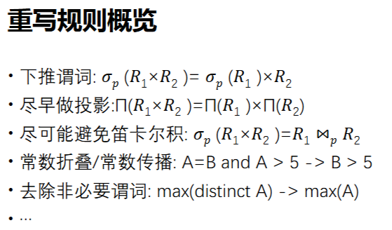</center>
  <center>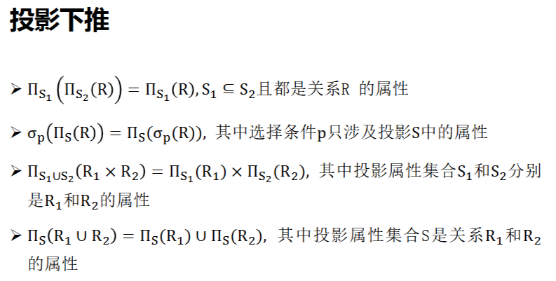</center>

  

  