# 嵌入式系统

## 1 绪论

### 1.1 嵌入式系统在BME的应用

**便携式医疗仪器的架构**

<center>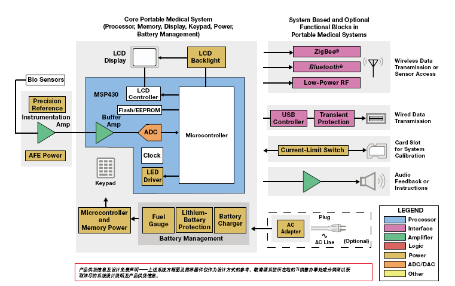</center>


## 2 嵌入式计算机系统概述

### 2.1 定义

一种**专用**的计算机系统

**主要特点**

* **功耗低，体积小，专用性强**
* 不具备自主开发能力
* 可靠性高
* 便携性好
* 低成本


### 2.2 架构

#### 2.2.1 组成

1. **硬件层（Hardware）**
   * 处理器
   * 存储器：Cache，主存，辅助存储器
   * 设备接口
2. **中间层（Firmware）**
   * 硬件初始化程序（BIOS）
   * 设备驱动程序
3. **系统软件层（Software）**
   * 嵌入式操作系统等（WinCE）
4. **用户专用应用系统**

51单片机性能太低，没有板载OS，程序直接运行在硬件上（只能用指令集语言）

<center>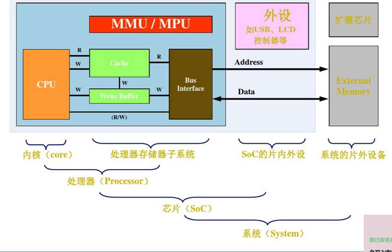</center>

其中外设指的都是**片内**外设，通过内部总线连接I/O接口

<font color=red>51的内部架构</font>

<center>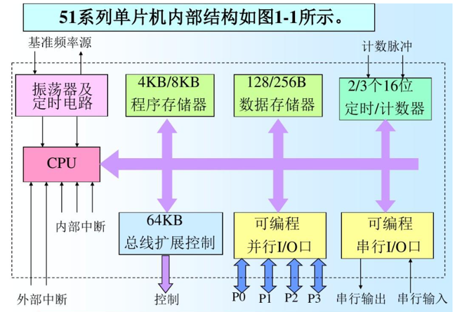</center>

注意大小，这是51单片机片内所有的元件，没有ADC


#### 2.2.2 核心部件

* CPU：MCS-51是8位机，MSP430是16位机；MSP430是冯诺依曼架构，MCS-51系列不完全是哈佛架构（但数据总线没有分开）
* 内部总线：注意哈佛架构必须有多套总线
* 寄存器：MCS-51有8个，`R0-R7`
* 存储器：Cache，内存，外存
* I/O


#### 2.2.3 操作系统

分为

* 分时操作系统：平均分配时长
* 实时操作系统：类似于粗粒度多线程，根据任务耗时分配时间
* 无操作系统（裸机）


### <font color=red>2.3 分类和应用</font>

* MCU，Microcontroller Unit，微控制器：最常用的简单紧凑嵌入式处理器，集成外设和IO到一个板子上
* MPU，Microprocessor Unit，微处理器：高性能处理器，需要外接外设
* DSP，数字信号处理器：专门处理数字信号
* SOC，片上系统，有数字电路、模拟电路和射频电路（RF，通讯用）


### 2.4 开发环境

* Keil是编译器；Proteus是仿真软件；CCSV5.3既是开发环境也是仿真工具，可以在线硬件仿真
* MCS-51只能离线调试（在运行中无法查看寄存器和内存），MSP430可以在线调试


### 2.5 单片机概述

**特点**

* 性价比高
* 集成度高，体积小，可靠


### 2.6 单片机的开发与仿真

**开发**

`ORG xxxxH`是一个伪指令，为编译器指明后续程序存储的位置；在**编译**时运行

对于51来说，内存空白时为`1`，而不是`0`


**开发过程**

1. 写程序
2. 编译
3. 链接
4. 下载/烧录
5. 调试


<font color=red>例：</font>时钟类比为脉搏更恰当，因为相比于呼吸，大脑无法控制

解：正确


<font color=red>例：</font>台式机或笔记本等微机的CPU采用冯诺依曼架构

解：正确。虽然在L1 Cache上Data和Instruction分开，但是总线只有一套


<font color=red>例：</font>可以并行处理任务的是

解：多核处理器，FPGA


<font color=red>例：</font>网络摄像头、智能手机、自动洗衣机采用的嵌入式系统分别是

解：DSP，SOC，MCU


<font color=red>例：</font>Keil可以看到51单片机内部Reg实际值

解：错误，不能在线调试


## 3 MCS-51 MCU结构与原理

### 3.1 51结构

<center>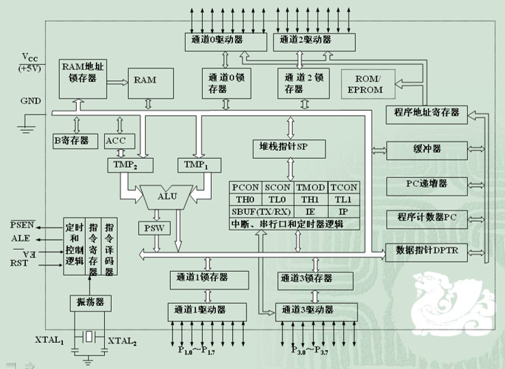</center>


### 3.2 CPU

分为运算器和控制器


**运算器**

* ALU
* ACC（Accumulator）：在与外部的MEM进行读写时，必须有ACC参与
* PSW（Program Status Word）：程序状态字
* TMP1/2：两个暂存寄存器
* Reg B：`MUL`和`DIV`指令，就是`BX`

**控制器**

* IR（Instruction Reg）
* ID（Instruction Decoder）
* PC（Program Counter）：`16b`，与地址线同宽
* 定时控制与条件转移逻辑电路


**CPU工作过程**

1. 写代码，烧录
2. 上电/RST复位
3. `PC=0000H`，跳转到程序入口
4. IF, ID
5. EX，MEM，WB
6. 三种可能
   * PC += 1
   * PC跳转
   * 中断/函数
7. 重复，直到结束


### 3.3 存储器组织

**统一编址**

存储器的**逻辑地址与物理地址对应**，如8086，MSP430等

MCS-51的CPU是**非**统一编址的，如`0x0000H`可以对应片内/外 ROM/RAM


**MCS-51的存储器架构**

包括片内`4KB`ROM，`128B`RAM；和片外`64KB`ROM，`64KB`RAM寻址能力（16根地址线）

<font color=red>8051内部是ROM</font>


**访问不同空间的指令**

* 程序存储器空间：`MOVC`；片内/外通过$\mathsf{\overline{EA}}$决定

  当其为高电平，执行片内**前`4KB`ROM**地址中程序，超过`4KB`时从片外读取

  当其为低电平，**所有程序都在片外**，此时片外从`0000H`开始编址

* 片内数据存储器：`MOV`

* 片外数据存储器：`MOVX`，<font color=red>其中一个操作数必须是`A`</font>


**存储器特殊区域**

* `0000H`：8051复位后`PC`指向
* `0003H`：外部中断0入口
* `000BH`：定时器0溢出中断入口
* **`0013H`：外部中断1入口**
* `001BH`：定时器1溢出中断入口
* `0023H`：串行口中断入口

通常会在这些地址存放一条**绝对跳转**指令，如

```assembly
ORG 0000H
	LJMP main
	
	ORG 0013H	;外部中断1入口，中断时PC自动跳转到这里
	LJMP INT1
	
	ORG 0040H
main:			;xxxx
INT1:			;xxxx
	END
```


**片内RAM空间分布**

如下图

<center>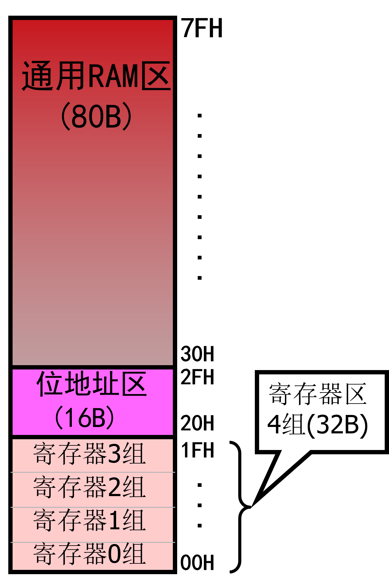</center>

其中位地址区是`bit`编址，即每个`bit`都有自己的地址

寄存器组也可以直接当一般的缓存区使用


### 3.4 寄存器和功能

**特殊功能寄存器**：Special Functional Register(SFR)

**与ALU相关SFR**

* A Reg(Accumulator)：`8bit`累加器，用A/ACC表示，可以字节寻址(`E0H`)或位寻址(`E0H - E7H`)

  ALU在运算时一个数**一定在`ACC`中**

* B Reg：`8bit`暂存寄存器，字节寻址(`F0H`)，在`MUL, DIV`时使用

* <font color=red>PSW(Program Status Word)：`8bit`程序状态字，也就是FLAGS，可字节寻址(`D0H`)</font>

  <center></center>

  * `CY`：进位标志，在**第8位进位**时为1

  * `AC`：半进位标志，在**第4位进位**时为1

  * `F0`：用户标志位

  * `RS1, RS0`：工作寄存器组选择位，其值**`00, 01, 10, 11`**分别对应寄存器组**0，1，2，3**工作

  * `P`：奇偶校验位，累加器**`ACC`**中若**奇数个`1`则`P=1`**

  * `OV`：溢出标志位，当符号位(MSB)与次高位不同时进位时`OV=1`

    主要受`ADD, ADDC, SUBB, MUL, DIV`影响，`MUL`结果大于`16bit`(255)时、`DIV 0`时`OV=1`，其他为0

    * `MUL`指令：`MUL AB`，表示$A\cdot B$，结果的**低8位在A，高8位在B**
    * `DIV`指令：`DIV AB`，表示$A\div B$，结果的**商在A，余数在B**

  * <font color=red>例：</font>

    <center>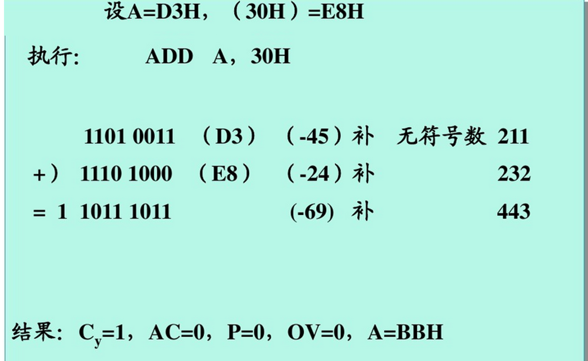</center>


**与指针相关SFR**

  * SP(Stack Pointer)：8位寄存器，指向栈顶，初始化后`SP=07H`

  * DPTR(Data Pointer)：16位寄存器，可以分为两个8位`DPH, DPL`

    可以用来访问外部RAM中的任一单元，也可以作为通用Reg使用

  

  **MCS-51的栈操作**：与8086完全不同

  * ` A`：`SP += 1`，将A中值入栈
  * `POP A`：将栈顶值赋给A，`SP -= 1`
  * 在发生函数调用`CALL`时自动**入栈两次**(PC是16位)，函数返回`RET`也是**两次**

 

**与端口相关SFR**

* P0 - P3：I/O口的寄存器，存放上一个状态所有管脚的输出，初始值为`FFH`
* SCON
* SBUF
* PCON


**与定时/计数器相关SFR**

* TMOD
* TCON
* TH0，TL0，TH1，TL1


**与中断相关SFR**

* IE(Interrupt Enable Register)：地址为`A8H`，可按位寻址`A8H - AFH`

  `EA=0`，**总中断禁止**；`EA=1`，按各个设置

* IP(Interrupt Priority Register)：地址为`B8H`，可按位寻址`B8H - BFH`

  某个`bit = 1`，这个优先级**高**


**PC**

* 与`CS:IP`相同
* 低8位从`P0`输出，高8位从`P2`输出


<font color=red>例：</font>需要往程序存储器写信息时，通过改变`PC`的值

解：错误，程序存储器只能烧录不能写


### 3.5 MCS-51管脚定义与功能

<center>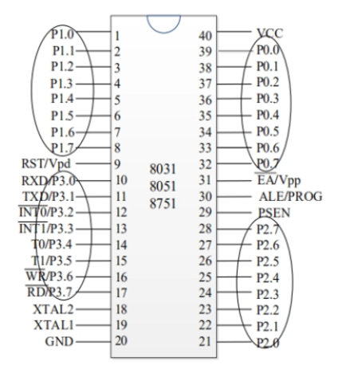</center>

* 4个`P`脚都能用作`I/O`

  * `P0`脚作为**`8b`数据口**和`16b`**地址口的低8位**使用
  * `P1`脚只能用于`I/O`
  * `P2`脚用于**地址口的高`8b`**
  * `P3`脚与单片机的功能输入/出复用

* `Vss = GND`

* `XTAL1/2`外接晶振，产生CPU的工作时钟（芯片**内部存在**振荡电路，产生时钟）

  一般用12MHz作为时钟的振荡周期，**12**个振荡周期作为**机器周期**（1us）

* <font color=red>`RST/Vpd`外接复位电路；当CPU工作时，`RST`**超过两个机器周期**（2us）的高电平可以让CPU复位</font>

  当CPU掉电时，该脚接上备用电源，保持RAM中的数据

* `ALE/PROG`提供地址的**低字节锁存信号**，ALE以**6倍振荡周期为周期进行输出**

  当访问外部数据存储器时，跳过一个`ALE`脉冲（表示数据不需要锁存）

  <font color=red>对于EPROM机，在EPROM编程期间，这个脚接受**编程脉冲**</font>

<center>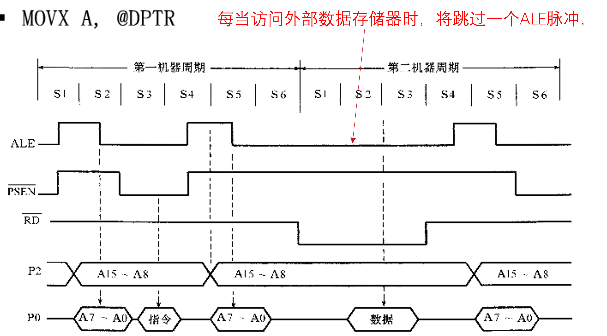</center>

* <font color=red>`PSEN`是外部程序存储器选通信号输出，在读写外部MEM时，每个机器周期内**两次有效**（访问指令和数据）</font>

* <font color=red>`EA/Vpp`高电平，访问内部程序MEM；低电平，访问外部程序MEM</font>

  在EPROM编程期间，这个脚加上21V EPROM**编程电源**（不是编程脉冲）

* `P3`的一些第二功能

  <center>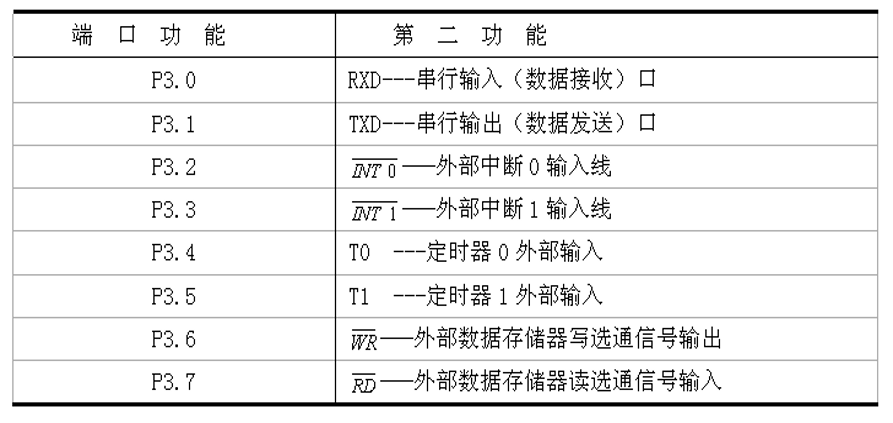</center>

注意在串口通讯时，`RXD`和`TXD`（Receiver和Transmitter）是**交叉**的

<center>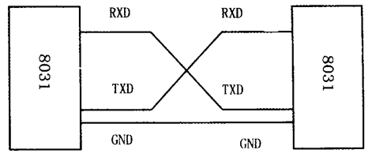</center>


### <font color=red>3.6 MCS-51的最小系统</font>

包括

* 电源和地：电源用稳压芯片

* 时钟电路：外部晶振

* 复位电路：包括**上电复位**、**手动按钮**复位和**看门狗芯片**复位

  <center>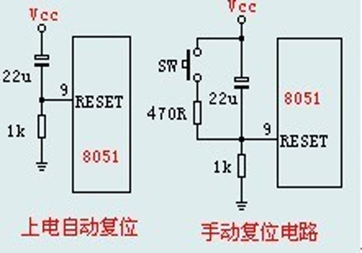</center>

看门狗是一个计数器，MCU会周期性发送清空信号；当MCU死机后，看门狗计数会计满，自动向`RST`发送高电平；但是只能修复软件问题，硬件出错是不能修复的

<center>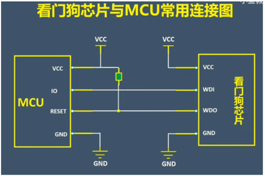</center>


## 4 I/O原理与接口技术

### 4.1 I/O结构与原理

<center>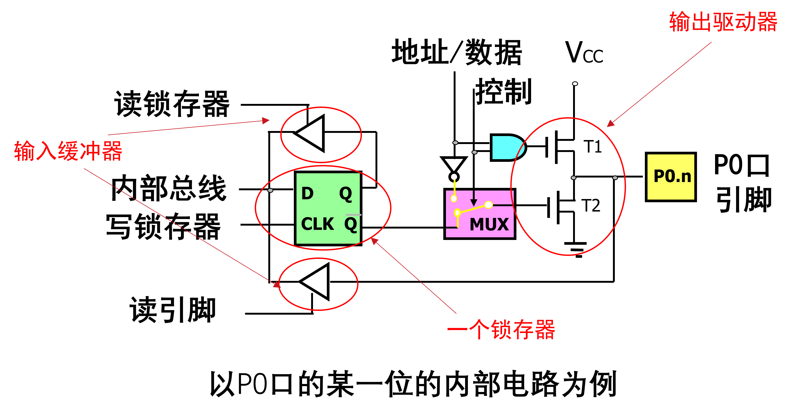</center>

锁存器就是专用寄存器`P0/1/2/3`，这个是`P0`口，故`MUX`控制输出的是低地址还是数据

每个端口都有一个**锁存器**，一个**输出驱动器**，一个**输入缓冲器**

图中的输入缓冲器就是类似MosFET的东西，开关端加上电压就是能导通

4个I/O口都是**准双向**，读引脚前必须写入`1`，否则引脚状态不定

<font color=red>仅`P0`口没有内部上拉电阻</font>


#### <font color=red>4.1.1 P0口的工作原理</font>

**作为I/O口输出**

<center>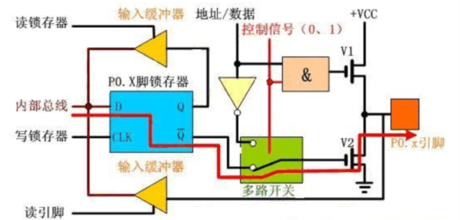</center>

控制信号为`0`，与门输出0，V1截止，不输出地址/数据；多路开关打到下方

内部总线输出`1`时，$\bar{Q}$口输出`0`，V2截止，此时引脚**既不接地，又不接Vcc**，故需要**外接上拉电阻**，置为高电平

内部总线输出`0`时，V2导通，引脚接地，输出`0`


**作为I/O口输入**

<center>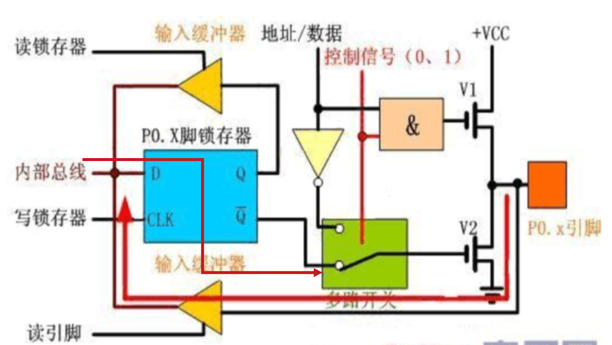</center>

控制信号为`0`

<font color=red>在读写切换时，需要先向引脚写入`1`，经过图中线路使V2截止，防止干扰输入</font>

读引脚，通常是I/O为源的指令，如`MOV A, P2`，走下方的输入Buffer到内部总线

读Reg，通常是I/O为操作数指令，如`ANL P1, A`，走上方的输入Buffer


**作为地址/数据输出**

控制信号为`1`，多路开关置为上方，由CPU自动设置

A/D输入`0`，V1截止，A/D经过非门变为`1`输出

反之，V1导通，直接输出Vcc，不需要上拉电阻


**作为A/D输入**

控制信号为`0`，开关在下方，V1截止；CPU自动向P0口写`1`（实际是`FFH`），V2截止

真正的双向口


#### 4.1.2 P2口的工作原理

<center>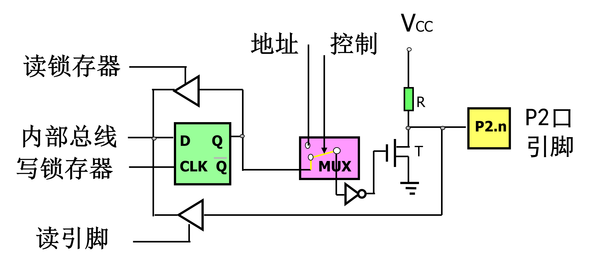</center>

**片内有**上拉电阻，不需要外接

当作为普通I/O口时，和P0一样，不赘述


**作为地址输出**

控制口为`1`，开关向上

地址输入`1`，T截止，输出Vcc；地址输入`0`，T导通，输出接地


#### 4.1.3 P1口的工作原理

<center>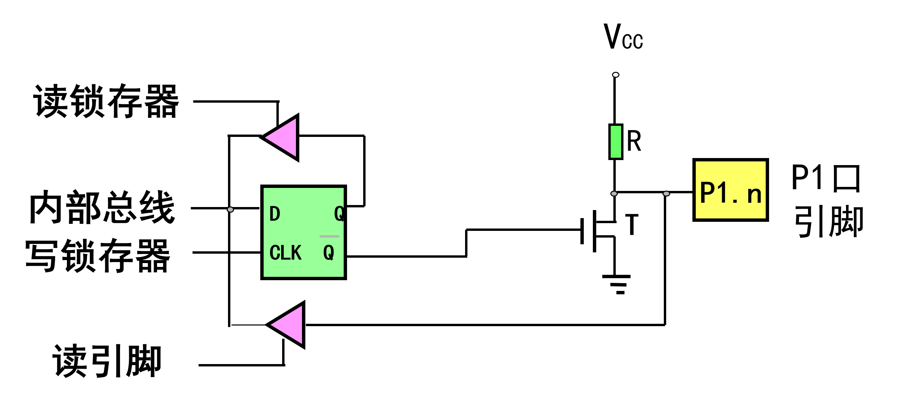</center>

非常简单，也是**片内上拉**


#### 4.1.4 P3口的工作原理

<center>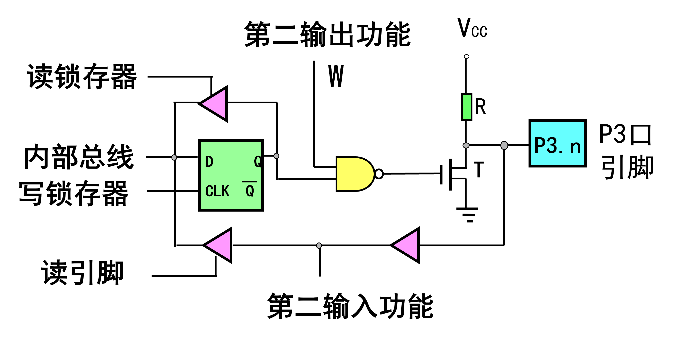</center>

片内上拉

除了第二输出功能外，和P1一致

第二输出功能时，是由`Q=W=1`，才会输出高电平


#### 4.1.5 I/O口使用小结

* 准双向口，**读引脚**前必须先写入`1`
* P3的**第二功能使用前**必须写入`1`
* P0作为数据I/O口时，需要上拉电阻才能高电平
* P0作为A/D输入输出时是真的双向口


### 4.2 访问外部存储器总线与时序

**几个周期**

* 振荡周期：晶振的振动周期，一般用12MHz；就是时钟周期
* 状态周期：包含**2个**振荡周期
* 机器周期：包含**12个**振荡周期，1MHz
* 指令周期：执行一条指令的时间，**最小单位是机器周期**


<font color=red>**访问外部MEM的时序**</font>

<center>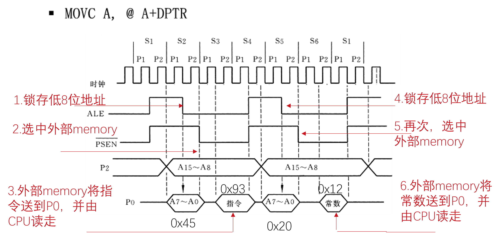</center>

比较好懂


## 5 MCS-51指令系统

### 5.1 指令概述

在系统定时时，最小间隔就是机器周期，12MHz的最小间隔就是1us


**通用寄存器**

在`8bit`寄存器间接寻址时，只能使用`R0, R1`，即

```assembly
MOV A, @R0		;@R1
```

`R0, R1`统称为`Ri`，`R0-R7`统称为`Rn`

`16bit`直接用`DPTR`


### 5.2 寻址方式

* 立即寻址

  ```assembly
  MOV A, #10H	;10H为idata
  ```

  优点是很快，缺点是占用ROM空间，因为立即数在机器码中占1B

* 直接寻址

  ```assembly
  MOV A, 10H	;10H为地址单元
  ```

* 寄存器寻址

  ```assembly
  MOV A, R0	
  ```

  虽然`R0`地址为`00H`，但这条指令是单字节、单周期，而直接寻址是双字节、双周期

* <font color=red>寄存器间接寻址</font>

  ```assembly
  MOV A, @R0
  MOV B, @DPTR
  ```

  使用`R0, R1`时，表示`8bit`寻址；使用`DPTR`时，表示`16bit`寻址

* 基址变址寻址

  ```assembly
  MOVC A, @A+DPTR
  MOVC A, @A+PC		;执行时先要PC+=1,然后才赋值
  ```

  `MOVC`是程序存储器，但不一定外部；只有`DPTR, PC`能够基址变址寻址（作为基址使用）

* 相对寻址

  ```assembly
  JC LABEL	
  ```

  短距离跳转用

* 位寻址

  ```assembly
  SETB 3DH		;将27H.5位置为1
  CLR C			;将CY置为0
  ```

  按位寻址来


### 5.3  数据传输类指令

<font color=red>例：</font>将外部RAM的100H地址处的数据存放在200H处

```assembly
MOV	DPTR, #0100H
MOVX A, @DPTR
MOV DPTR, #0200H
MOVX @DPTR, A
```


**查表**

```assembly
MOV DPTR, #0100H		;CODE Seg内的数据头位置
MOV A, R0
MOVC A, @A+DPTR

ORG 0100H
DB 0, 1, 4, 9
```


**交换指令**

```assembly
XCH A, Rn			;交换A,Rn
XCH	A, idata		;交换A,(idata)
XCHD A, @Ri			;交换低位, A.3-A.0 与 (Ri).3-(Ri).0
SWAP A				;交换A的高低位, A.3-A.0 与 A.7-A.4
```


### 5.4 算术运算指令

对`A`操作，均对`PSW`有影响

```assembly
ADD A, #data		;不带进位
ADDC A, #data		;带进位，+CY
INC A				;A += 1

MOV A, #00010101 BCD	;BCD表示
ADD A, #8			;A = 1DH,按二进制加
DA A				;修正BCD指令，A = 23H

CLR C				;清空CY
SUBB A, #data		;带借位，A = A - #data -CY，故第一次减法前要 CLR C
DEC A				;A -= 1

;乘除只能用AB
MUL AB				;BA = A*B,高8bit在B,低8bit在A
DIV AB				;A/B,商在A，余数在B
```


### <font color=red>5.5 逻辑运算类指令</font>

目的操作数为`A`时，影响`PWS`

```assembly
ORL A, #data		;按位或
ORL A, address		;若为I/O口，则读引脚
ORL address, A		;(address)按位或A
ORL address, #data	;后两条指令若地址为I/O口，则为读锁存器-改写指令

ANL A, #data		;按位和

XRL A, #data		;按位异或

CPL A				;按位取反，A = A_bar

CLR	A				;清零

RL A				;Rotate Left,A循环左移1bit
RR A				;循环右移1bit
RLC A				;CY-A.7-A.0循环左移，CY是MSB
RRC					;CY是MSB，循环右移
```


### 5.6 控制转移类指令

改变的是`PC`，对`PSW`无影响

```assembly
AJMP addr11			;短转移，2KB，即两个地址高5bit一致，且在同一个页内
					;也就是不是在转移开始的2k，而是定死的
LJMP addr16			;长转移，64KB
SJMP rel			;相对转移，-128~127，用的是偏移地址
JMP	@A+DPTR			;间接转移，-128~127，常用的散转分支转移语句

JZ rel				;A=0转移，偏移地址，可以是label，下同
JNZ rel				;A!=0转移
CJNE A, #data, rel	;比较A与#data,不等就跳转，偏移地址;同时会A-#data，仅改变CY
					;A的位置也能写Rn和@Ri

DJNZ Rn, rel		;先将Rn-1，若Rn!=0则跳转，Rn的位置可以写地址

JC rel				;JMP Carry，CY=1就JMP
JNC rel				;JMP Not Carry

JB bit, rel			;位地址(bit)=1，JMP
JNB bit, rel		;(bit)=0
JBC	bit, rel		;若(bit)=1,则将其置为0，并JMP

LCALL addre16		;长调用指令，16bit，64KB，指令3B，可以用label代替addre，PC+3压栈
ACALL addre11		;短调用指令，11bit，2KB，指令2B，可以用label，PC+2压栈

RET					;子程序返回指令，栈顶的PC返回给PC，弹栈两次
RETI				;中断例程返回，栈顶PC返回，弹栈，对中断优先级状态触发器的清零
```


### 5.7 位操作指令

涉及到能按位寻址的寄存器等

```assembly
MOV C, P1.0			;将P1口的第0bit赋给CY寄存器
CLR C
SETB C				;令CY=1
ANL C, /P1.0		;将P1.0取反后与C做and，赋给C，P1.0本身不会改变
```


## 6 MCS-51程序设计

### 6.1 概述

编译流程图

<center>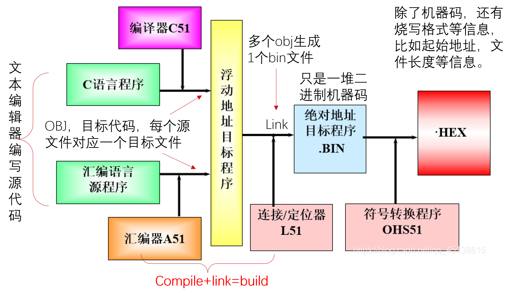</center>


**<font color=red>伪指令</font>**

```assembly
ORG 0000H			;Origin
END					;程序结束
KC EQU 30H			;赋值伪指令,KC=30H
DB	'A', 34H
DW	'AB', 1234H
ABC BIT P1.1		;位地址赋值，将P1.1赋给ABC这个变量
```

伪指令在编译时起作用


### 6.2 汇编语言编程

汇编器(MASM)在编译时执行

1. 将汇编指令翻译为机器码
2. 确定每条指令的大小，形成相对地址
3. 给出语法错误
4. 形成`.obj`文件


查表，求平方

```assembly
ORG 0000H
LJMP START
ORG 1000H
START: 	MOV DPTR, #table
		MOV A, 20H
		MOVC A, @A+DPTR		;由于table在Code内，故适用MOVC
		MOV 21H, A
		SJMP $				;原地跳转
ORG 2000H
table: db 0, 1, 4, 9, 16, 25
END
```


将30H内的变量分类放回

```assembly
ORG 0000H
LJMP START
ORG 1000H
START:	MOV A, 30H
		JZ ZERO
		ANL	A, #80H			;保留符号位，A<0，那么结果不为0
		JNZ MINUS
		LJMP DAYU0
ZERO:	MOV 30H, #20H
		LJMP OVER
MINUS:	MOV A, 30H
		ADD A, #5H
		MOV 30H, A
		LJMP OVER
DAYU0:	MOV 30H, A
OVER:	SJMP $
END
```


50ms延迟程序，12MHz时钟，机器周期为1us

```assembly
DEL:	MOV R7, #200		;1机器周期(MC)
DEL1:	MOV R6, #123		;1MC
		NOP					;1MC
		DJNZ R6, $			;2MC * 123
		DJNZ R7, DEL1		;2MC
		RET
```

延时$1+200\times[(1+1+2\times123)+2]+2\approx 50$ms


将RAM中起始地址为data的数据段发送到外部起始地址为buffer的存储区域，数据段以'$'结尾

```assembly
		MOV R0, #data
		MOV DPTR, #buffer
LOOP1:	MOV A, @R0
		CJNE A, #24H, LOOP2		;24H是'$'的ASCII码
		SJMP LOOP3
LOOP2:	MOVX @DPTR, A
		INC R0
		INC DPTR
		SJMP Loop1
LOOP3:	END
```


### 6.3 C/ASM混合编程

**函数命名规则**

在KEIL C51中，编译器对C语言程序中的函数名会自动转换

`void fun1(void)` 转为 `fun1`，即无参数/寄存器传递的函数

`void fun2(int)` 转为 `_fun2`，即有参数传递的函数


**参数传递规则**

<center></center>

<center></center>


**混合编程**

* 在一个group内需要声明多个文件类型，不能重名；编译完有多个`.obj`文件需要link

* 在C中编写主函数

  ```C++
  #include<reg51.h>
  
  extern int sqr(int a, int b);		#外部的函数需要用extern声明
  
  int main()
  {
  	int a = 1;
  	int b = 2;
  	return sqr(a, b);
  }
  ```

* 在a51中编写子函数

  ```assembly
  ?PR?FUNCTION SEGMENT CODE		;在ROM中定义段，其中?PR?是段定义指令，FUNCTION是自定义段名
  
  RSEG ?PR?FUNCTION
  
  public _sqr						;可以被其他模块调用
  ```


## 7 中断系统

### 7.1 概念

**中断相对轮询的优势**

* 轮询：CPU使用软件查询，效率低


### 7.2 MCS-51中断系统

<font color=red>中断源</font>

<center>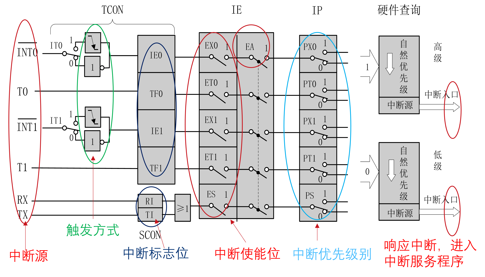</center>

当中断源给出有效信号，中断标志位自动置为`1`

`EA`是所有中断的总开关

中断入口固定：

* `0003H`为`INT0`；`000BH`为`T0`溢出中断；`0013H`为`INT1`；`001BH`为`T1`溢出中断；`0023H`串口中断，读/写UART的BUFFER；共5个


**中断标志位**

* 除串口上的标志位外，其他中断标志位会自动清零；置`1`一定是硬件干的；串口的标志位手动清零
* 由于`Rx, TX`共用一个中断例程，需要在进入例程时判断当前是`R/T`，进入对应的分支


**中断触发方式**

当`IT0=1`时，采用下降沿有效；当`IT0=0`时，采用低电平有效；`IT`可以更换为其他的控制位

当采用低电平时，输入的低电平不应该大于一个机器周期，否则会多次触发

当采用下降沿时，高低电平都应该保持一个机器周期，否则采集不到


<font color=red>**中断控制优先级**</font>

<center>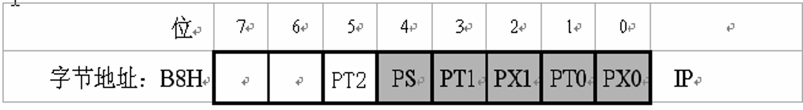</center>

按位设置优先级，当两个中断都设为`1`时，参考自然优先级排序

优先级只在响应之前排队时有效，一旦开始响应，同一级别（无视自然优先级）不能被打断；高级别可以

<font color=red>仅两个优先级</font>


### 7.3 中断处理过程

**中断响应条件**

* 中断源产生请求
* 这个请求的中断允许为`1`（如`EX0=1`）
* CPU开总中断`EA=1`


**响应时间**

* 最快响应时间：1周期查询，2周期`LCALL`，都是机器周期
* 最慢响应时间：1周期查询，1周期返回（`RET, RETI`），4周期乘除法，2周期`LCALL`


**中断响应过程**

1. 在机器周期的S5P2期间，中断系统对各个源采样，这些采样值在下一个机器周期内按优先级查询
2. 某个标志位被置`1`，则会在查询周期中被发现
3. 将相应的优先级状态触发器（用户不可见）置为`1`，防止同级/低级的中断请求
4. 执行硬件`LCALL`，压栈`PC`，写入入口
5. 执行中断例程

`RETI`会将对应的中断优先级触发器置为`0`，告诉CPU中断例程结束


一些例外：

> 遇以下任一条件，硬件将受阻，不产生LCALL指令：
>
> CPU正在处理同级或高优先级中断；
>
> 当前查询的机器周期不是所执行指令的最后一个机器周期。即在完成所执行指令前，不会响应中断，从而保证指令在执行过程中不被打断；
>
> 正在执行的指令为RET、RETI或任何访问IE或IP寄存器的指令。即只有在这些指令后面至少再执行一条指令时才能接受中断请求。


### 7.4 中断实例

<center>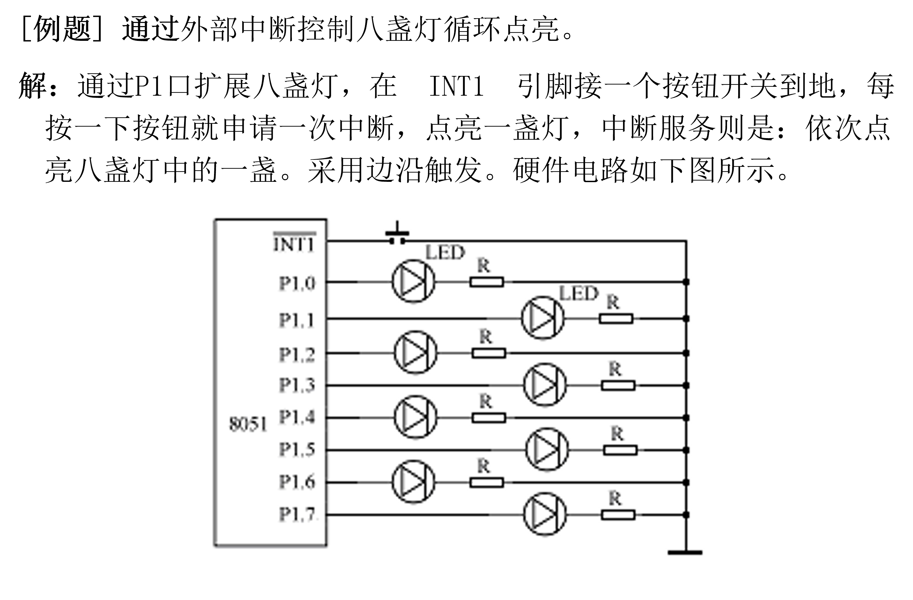</center>

程序如下

```assembly
ORG  0000H 
        LJMP  MAIN
ORG   0013H				   ; 中断服务程序入口地址
        LJMP  IN11		   ; 使用LJMP
        				   ; 因为在中断时自动保存了返回地址，这里不用CALL
MAIN:	SETB  EA           ; 开总中断允许“开关”
        SETB  EX1          ; 开分中断允许“开关” 
        CLR   PX1          ; 低优先级（也可不要此句） 
        SETB  IT1          ; 边沿触发
        MOV   A, #01H      ; 给累加器A赋初值
        SJMP  $            ; 原地等待中断申请
IN11:	RL    A            ; 左环移一次
        MOV   P1, A        ; 输出到P1口
        RETI               ; 中断返回
        END
```


## 8 定时器原理与应用

### 8.1 定时器概述

**定时的方法**

* 软件定时：占用了CPU时间，降低利用率
* 时基电路：如555等，不可编程
* 定时芯片：8253/8254等，很好


<center>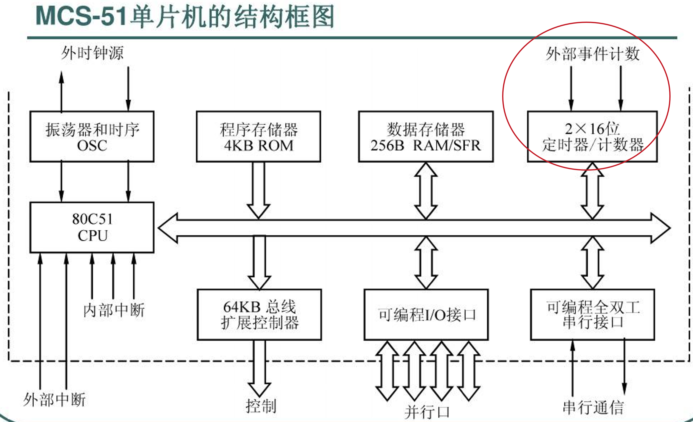</center>

两个`16bit` Timer；仅`PC, DPTR`和两个Timer是`16bit`

本质是+1计数器；如果使用外部时钟，称为计数器；如果是内部时钟，称为定时器
$$
t = n\cdot T
$$
其中$t,n,T$分别是定时，计数和周期


### 8.2 结构与原理

<center>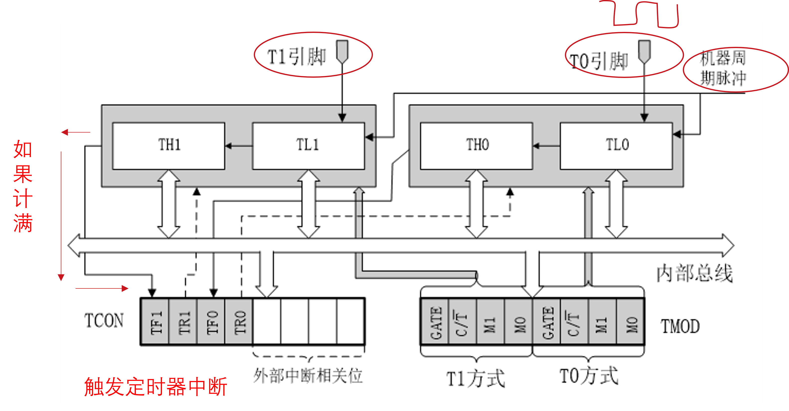</center>

分为两个`8bit`，当MSB溢出时产生一个中断信号

**定时**：对机器周期进行定时，是震荡周期的12倍

**计数**：每个机器周期进行采样，根据采样定理，计数脉冲频率必须是机器频率的一半以下，即计数脉冲周期大于2us

<font color=red>计数的原理：</font>

> 设置为计数器模式时，外部事件计数脉冲由T0或T1引脚输入到计数器。在每个机器周期的S5P2期间采样T0、T1引脚电平。当某周期采样到一高电平输入，而下一周期又采样到一低电平时，则计数器加1，更新的计数值在下一个机器周期的S3P1期间装入计数器。由于检测一个从1到0的下降沿需要2个机器周期，因此要求被采样的电平至少要维持一个机器周期。当晶振频率为12MHz时，最高计数频率不超过1/2MHz，即计数脉冲的周期要大于2 us。


**工作模式**：初始化寄存器

<center>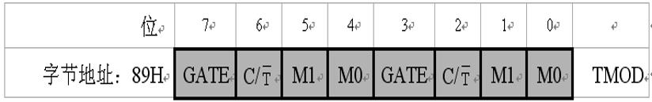</center>

高4bit和低4bit分别控制两个Timer

* `GATE=0`时，用软件将`TR0/TR1=1`就可以定时/计数
* `GATE=1`时，除了软件置位外，还需要外部中断引脚`INT0/INT1=1`
* $\mathsf{C/\bar{T}}$：定时/计数选择；=0为定时，接内部时钟；=1为计数，接外部脉冲
* `M1M0`的用处如下

<center>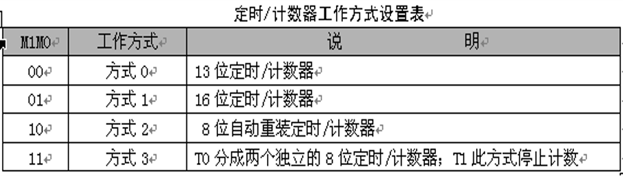</center>

方式2用于精确定时


**控制寄存器TCON**

`0/1`分别控制Timer0/1，以`1`为例

* `TF1`：是T1溢出中断请求标志位。T1溢出时硬件自动置为`1`，CPU响应后自动清零；CPU可以查询/更改`TF1`状态，可作为标志位或进行软件更改，效果和硬件一致
* `TR1`：`TR1=1`，T1开始工作；`TR1=0`，T1停止工作；由软件决定，故可以软件控制Timer的启动/停止；硬件不会改变这值，程序员自己改变


### 8.3 工作模式

**方式0**

<center>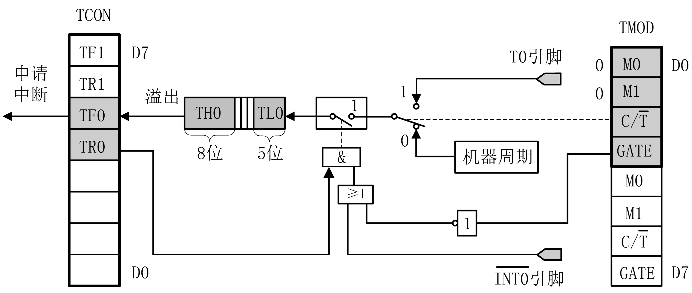</center>

注意计数位只有13位，且中间是不用的，在初始化时要注意；TMOD选为`00`

初值的计算公式为
$$
x = 2^{13} - N
$$
其中$N$为要计的时长对应的数字


**方式1**

16位，都能用，TMOD选为`01`

初值计算公式为
$$
x = 2^{16} - N
$$


**方式2**

<center>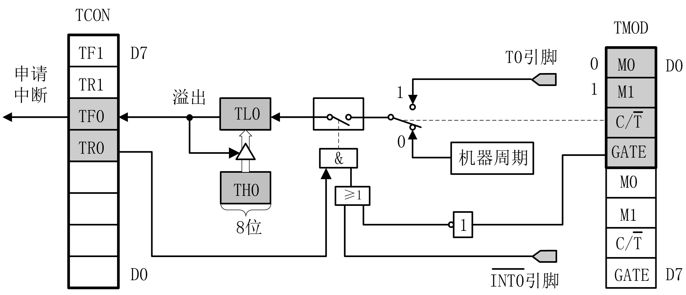</center>

此时是自动补充模式，8位，TMOD选为`10`

初值计算公式为
$$
x = 2^{8} - N
$$


**方式3**

<center>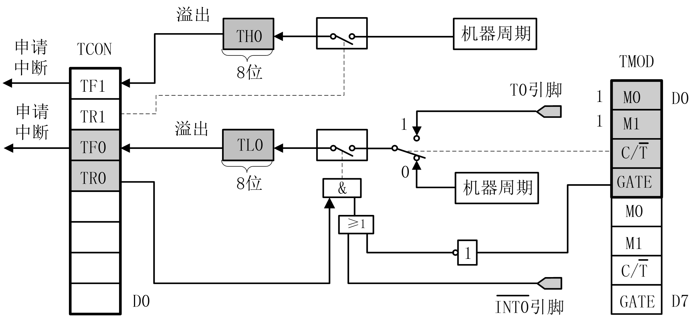</center>

此时将T0拆分为两个独立的8位计数器，高八位占用了T1的资源，因此T1不能工作在这个模式；此时T1只能作为非中断方式使用，如作为串口波特率发生器等


### 8.4 应用实例

<font color=red>例：</font>测量外部中断管脚输入的正脉冲宽度

解：初值为0，`GATE=1, TR0=1`，等待外部正脉冲开始计时，工作在`MOD=0`，将脉冲接在`INT0`作为中断输入，在电平转为负时停止计数，读出计数值，乘以周期


<font color=red>例：</font>扩展外部中断

解：工作在`MOD=2`，`TH0=TL0=FFH`，此时只要`T0`口来一个脉冲下降沿，`TL0+=1`产生一个定时器中断


<font color=red>例：</font>用T0的方式1，产生10ms的定时，并使P1.0引脚上输出20ms的方波，系统时钟频率为12MHz

解：机器周期为1us，需要计数$N=10000$次，$X=2^{16}-N=\mathsf{D8F0H}$，将D8送入TH0，将F0送入TL0

​		`M1M0=01, GATE=0, C/T=0`，程序如下

```assembly
ORG   0000H
		LJMP  MAIN              ;跳转到主程序
ORG   000BH              		;T0的中断入口地址
		LJMP  DVT0              ;转向中断服务程序
ORG   0100H
MAIN:	MOV   TMOD, #01H		;置T0工作于方式1
        MOV   TH0, #0D8H        ;装入计数初值
        MOV   TL0, #0F0H          
        SETB  ET0               ;T0开中断
        SETB  EA                ;CPU开中断
        SETB  TR0               ;启动T0
        SJMP $                  ;等待中断
DVT0:	CPL   P1.0              ;P1.0取反输出
        MOV   TH0, #0D8H        ;重新装入计数值
        MOV   TL0, #0F0H
		RETI                    ;中断返回
END
```


## 9 串口通信原理及接口技术

### 9.1 串口通信

UART，SPI都是全双工，I2C是半双工

**并行通讯**：多条线并行；特点是控制简单，速度快，但多根线长距离成本高且同时接收存在困难

**串行通讯**：单根线，长距离成本低，数据流控制复杂

**同步通讯**：两个时钟连接，每个周期采集数据

**异步通讯**：时钟周期尽量相近，相位可以不同，但是波特率是一致的

* <font color=red>异步通讯数据格式：一个字符帧 = 1b低电平起始位 + 5-8b数据位 + 1b校验位 + 1b停止位</font>


UART是串行、全双工、异步通讯（在空闲时为高电平）

<center></center>

每一位持续的时间由波特率决定


**SPI的主机、从机**

<center>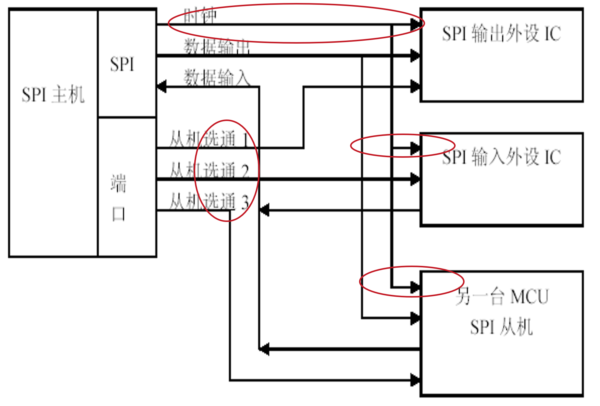</center>

主机提供时钟，选择要通讯的从机

只能有一个主机


<font color=red>**UART连接方式**</font>

<center>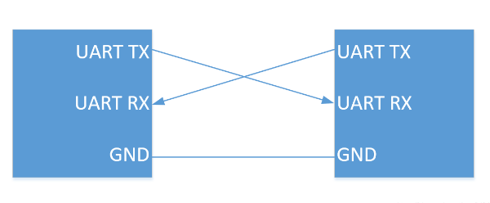</center>

注意要对着连


**波特率、比特率**

波特率：信号电平在1s内的变化次数

比特率：每秒传递的二进制位数

二者的关系通过码元状态数目
$$
R = Nb \cdot \log_2{M}
$$
其中$R,Nb,M$分别是比特率，波特率和码元状态数目


### 9.2 串口原理

<center>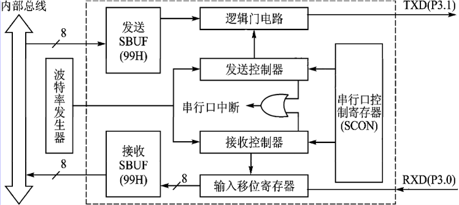</center>

接受和发送的物理上的BUFFER不是一个，但是地址是共享的`99H`

但是由于CPU可以区分发送和接收的状态，因此可以区分；发送时CPU是主动的


**收发的触发**

* 发送：任何将`SBUF`作为目的寄存器的写指令
* 接收：`Mode=0`时，`RI=0, REN=1`；其他模式下，`REN=1`，接收到起始位，就开始接收


**SCON控制寄存器**

<center>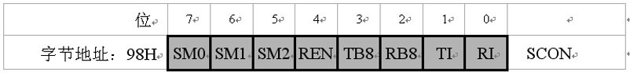</center>

* `SM0SM1`的组合确定了4种工作方式，其中波特率由Timer产生，可变

<center>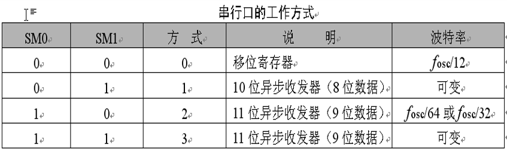</center>

* `SM2`控制方式2/3下的多机通讯

* `REN`是允许串行接收位，由软件置1，启动串行口接收数据；若软件置0，禁止接收

* `TB8`：在方式2/3中使用，是发送数据的第8位（BUFFER仅8位），作为奇偶校验位，或在多机通讯中作为地址/数据帧校验位

* `RB8`：方式2/3中如上，方式1中，若`SM2=0`，则`RB8`是接收到的停止位

* `TI/RI`：中断标志位，在发送/接收第7位数据时，由硬件置1，发送中断；中断完成后不会自动置0，必须软件置0取消申请

  在中断前CPU会知道是接受还是发送


**PCON控制寄存器**

仅最高位的`SMOD`与串口工作有关，是波特率倍增位

* 当工作在方式1/2/3时，波特率与之有关
* `SMOD=1`，波特率翻倍，否则不变


### 9.3 串口工作方式

**方式1**

数据格式：1b起始位 + 8b数据位 + 1b停止位

* 发送时序

  <center></center>

* 接收时序

  <center></center>

当`REN=1`时，用16倍波特率进行RXD引脚采样

当检测到第一个低电平（起始位）时，将其移入输入移位寄存器（不是SBUF），从右呈队列左移，当起始位移动到MSB时，控制电路进行最后一次位移

当`RI=0`时，若`SM2=2`或接收到停止位=1时，将接收到的9b数据的前8b装入SBUF，停止位进入`RB8`，置`RI=1`，发送中断请求

在方式1，若`SM2=1`，则只有接收到停止位才置`RI=1`


**方式2/3**

数据格式如下

<center>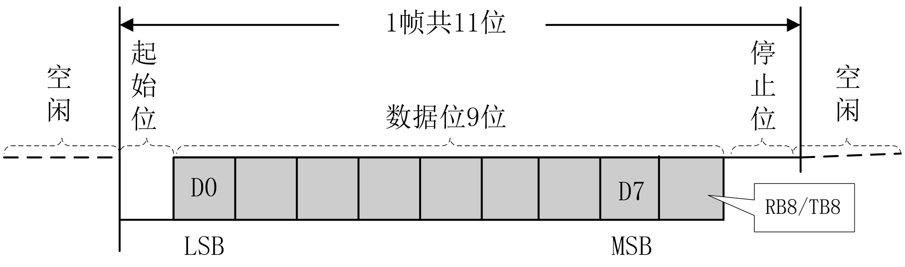</center>

多了一个附加的第8位

方式2的波特率固定为内部晶振的1/64或1/32，方式3的波特率由T1的溢出率决定


**波特率的计算与配置**

* 方式0，固定为晶振的1/12，即机器频率
* 方式1，波特率 = $2^{\mathsf{SMOD}}/32\cdot$(T1溢出率)
* 方式2，波特率 = $2^{\mathsf{SMOD}}/64\cdot$晶振频率
* 方式3，波特率 = $2^{\mathsf{SMOD}}/32\cdot$(T1溢出率)

其中T1初值和波特率的关系查表如下，溢出率指定时器每秒钟的溢出次数

<center>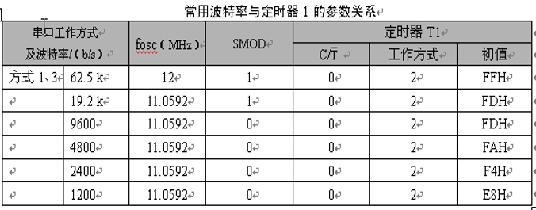</center>


**UART初始化**

1. 确定T1工作方式，编程`TMOD`
2. 计算T1初值，装载`TH1,TL1`
3. 启动T1
4. 确定串口工作，编程`SCON`
5. 若是中断方式，要进行中断设置，编程`IE,IP`寄存器


### 9.4 串口接口技术

8051 UART 通过 RS232 与 PC USB 连接，实际并没有使用USB，而是模拟RS232进行电平转换

UART除了收发线之外还有一个共地线


**I2C通讯**

特点是同步、半双工、串行通讯


<font color=red>**判断题**</font>

* 51的UART不支持多机通讯，错误
* 单片机的UART和PC通讯，需要通过USB模拟一个RS232，通过UART-RS232-USB实现，正确
* 51的UART通讯的收发共用一个中断例程，正确；但是可以用RI和TI判断
* 51的UART接收中断指的是UART收到一帧后，通知CPU读取数据的中断，正确
* 51的UART发送中断指的是UART发完一帧后，通知CPU可以写SBUF，正确


## 10 MSP430 概述

### 10.1 芯片概述

MSP: Mixed Signal Processer，许多模拟/数字电路和微处理器集成在芯片上


### 10.2 与MCS-51相比

* 集成度更高，片上外设丰富，有ADC/DAC等

* 16bit总线，16位机

* 超低功耗

* <font color=red>RISC精简指令集，单时钟周期能执行1条指令（流水线），比51快12倍</font>

* 能在线仿真

* 多套时钟，根据使用环境进行切换快速时钟和慢速时钟

  ACLK：辅助时钟；MCLK：主时钟

<center>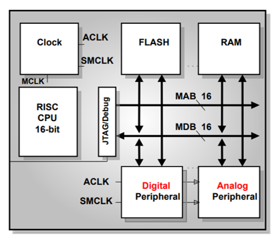</center>


* <font color=red>低功耗</font>

  * 一种活动模式（Activate Mode，AM），五种低功耗模式（Low Power Mode 0\~4，LPM0\~4）

  * CPU高速，MEM和外设低速，优化功耗

  * 运行时以类似中断的方式进入AM

    <center>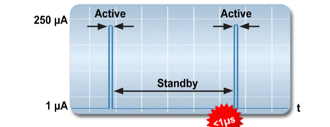</center>

* 处理能力

  * 16bit data bus，REG，ALU，ADD
  * 24MHz主频
  * 硬件乘加器MAC，一条指令实现乘法和加法
  * 集成了DMA

* 片上外设

  * 看门狗WDT
  * 模拟比较器A，Timer_A/B，10/12bit ADC
  * USART_0/1
  * 液晶驱动器

* 系统稳定性

  * 自带看门狗，可以自动复位

* 开发环境

  * 支持在线/离线仿真
  * JTAG(Joint Test Action Group)：JTAG接口可以实现在线编程/修改/调试


### 10.3 MSP430系统架构

* 16KB机内RAM
* <font color=red>32外部中断口（P1, P2, P3, P4）</font>
* <font color=red>有一个实时时钟，看门狗，16bit定时器A、B，基本定时器</font>
* 带CRC校验器
* ALU还支持扩展到20bit
* R4 - R15是通用寄存器
* R2/Status REG（SR）复用，R0/PC复用，R1/SP复用，R3/Constant Generator（CG2）常数发生器复用
* <font color=red>Memory统一编址，片内/外RAM/ROM都是统一编址，不需要用指令区分</font>


### <font color=red>10.4 芯片封装</font>

<center>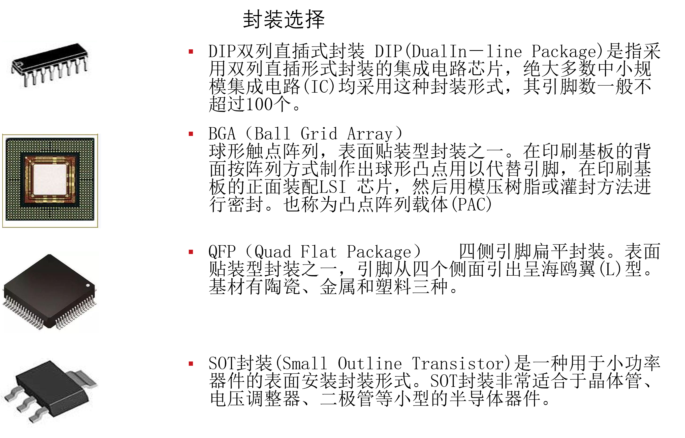</center>


## 11 MSP430 GPIO接口原理

### 11.1 概述

MSP430一共有9个IO，每个IO8个口，共72个IO口

大部分的接口都是复用的（GPIO和外设两个模式）

其中`P1 ~ P4`都是中断复用口，一共32个外部中断输入


### 11.2 原理与配置

* **Input**：PxIN；每个IO都有8bit寄存器存放输入
* **Output**：PxOUT；当配置为IO的输出时，就是输出的电平；当配置为输入时，0表示下拉电阻，1上拉
* **Direction**：PxDIR；一个方向寄存器用来确定是输入0/出1
* **上/下拉电阻使能**：PxREN；0不使能，1使能
* **输出增强**：PxDS；有输出增强寄存器，增强IO口的电流输出（电压恒定），输出驱动增强，但是功耗和电磁干扰变大
* **功能选择标志位**：PxSEL；复用的IO口需要指定使用的功能：1=外设 ，0=IO；当选为外设时，方向根据外设的要求手动设置，且中断功能失效
* **中断标志位**：PxIFG；0表示没有中断输入，1表示有
* **中断触发方式**：PxIES；0表示上升沿触发，1表示下降沿触发
* **中断开启标志位**：PxIE；0关，1开
* **不使用的管脚**：将不使用的管脚配置为IO，方向输出，不连接，防止悬空输入，并减少功耗

MSP430的管脚需要先初始化（配置寄存器）再使用，和51不同


### 11.3 GPIO代码解读

按下按钮控制LED的程序中，管脚需要设置为IO

```c
#include <msp430f6638.h>

void main(void)
{
	// 初始化阶段
	WDTCTL = WDTPW + WDTHOLD;		// 关闭看门狗定时器
	P4DIR |= BIT5;					// BITn表示第n位为1，从0开始
									// P4DIR是方向寄存器
									// 这里表示P4.5为输出
	P4REN |= BIT0;					// P4.0上/下拉电阻使能
	P4OUT |= BIT0;					// P4.0配置为上拉电阻
	// 因为Px不能进行位操作，所以用这种方式配置
    // 这样解读：上拉电阻在引脚悬空时读到的都是1，只有输入0才读到0，可以作为接地开关的入口
    // 这样的开关按下后引脚读到0，因此需要配置为上拉电阻

	// 真正的主程序
	while (1)
	{
		if (P4IN & BIT0)			// 按位与，只判断这个键
									// 按下时P4.0=0
		{
			P4OUT |= BIT5;			// 没按下，灯亮
		}
		else
		{
			P4OUT &= ~BIT5;			// 按下，灯灭，取反后按位与
		}
	}
}
```


## 12 段式LCD接口原理

### 12.1 概述

专门用来输出LCD显示信号的引脚与IO复用

<center>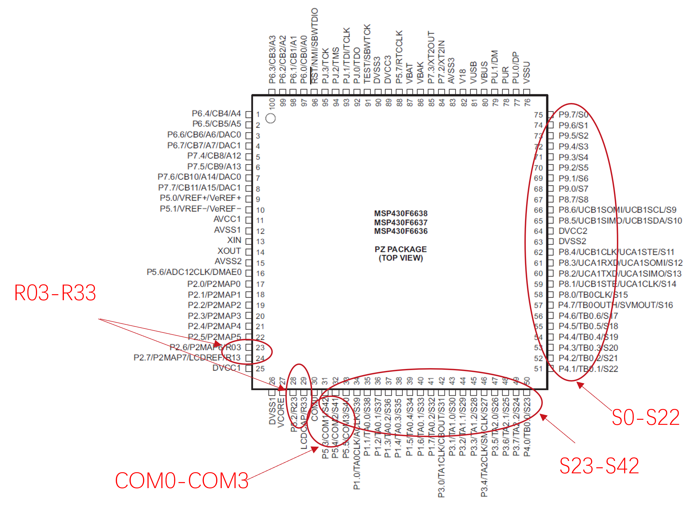</center>


### 12.2 原理

存在专用显存单元，将需要显示的信号写入专用内存单元即可显示


**静态模式**

显示原理与51不同，在COM0模式，使用时钟信号与LCD段电压差来显示

<center>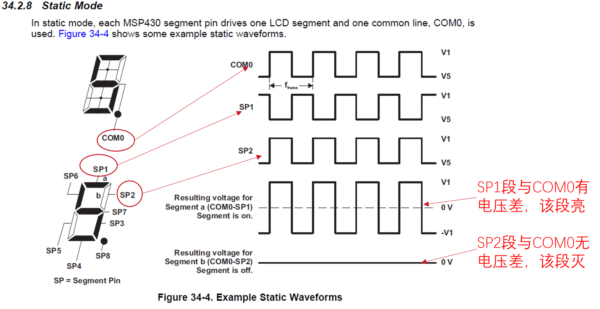</center>

显存单元如下

<center>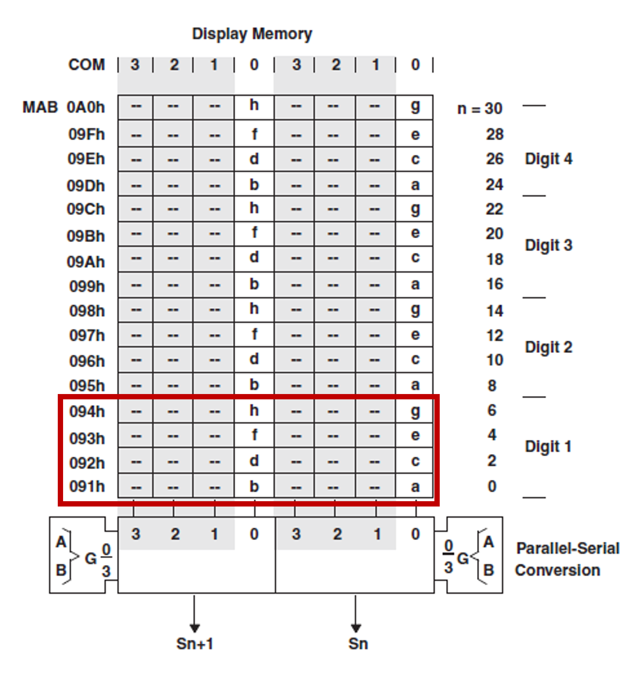</center>

当前选通COM0，不用管其他的bit，只看COM0的位置，图中红框表示控制一个数码管的内存

在连续的内存单元`91h ~ 94h`中依次写入`01h, 11h, 10h, 01h`可以显示数字`5`


**二复用模式**

此时内存单元的表示有点区别，但是用法一样

<center>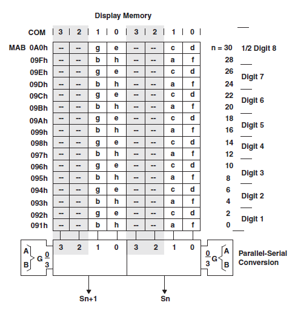</center>

此时只需要两个内存单元就能够表示一个数字，在`91h, 92h`中写入`03h, 23h`显示数字`5`


复用的模式越大，占用的管脚就越少，利用率大


### 12.3 代码解读

已经封装好了显示函数

```c
void LCDSEG_SetDigit(int pos, int value);		// 在第pos位上显示数字value
// 1<=pos<=6, 0<=value<=15, 但显示为16进制

void LCDSEG_DispalyNumber(int32_t num, int dppos); 
// 显示num，用dppos表示小数点位置
// 0<=num<=999999(6个管子), 0<=dppos<=3，为0表示不显示小数点
```


## 13 MSP430低功耗模式及中断

### 13.1 低功耗模式

MSP430的每个模块可以独立运行，因此CPU的活跃时间很短


**进入和退出**

进入：设置`LPM0 - LPM4`的`SR`寄存器中的`CPUOFF, OSCOFF, SCG0, SCG1`来实现

退出：任何使能的中断和非屏蔽中断将使CPU进行Active Mode

进入中断：`PC, SR`被保存在Stack中，`CPUOFF, SCG1, SCG0, OSCOFF`自动置零

中断返回：`PC, SR`弹栈，CPU重新进入低功耗模式

在中断例程中可以修改Stack中的`SR`bit，使得中断返回后修改低功耗状态


**初始化**

<center>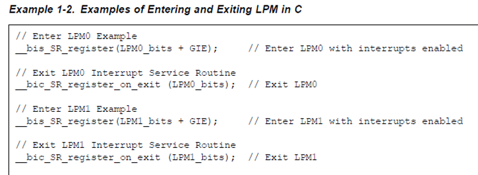</center>


### 13.2 中断原理

可以用`GIE=0`进行屏蔽的中断为可屏蔽，其余为非屏蔽中断

<center>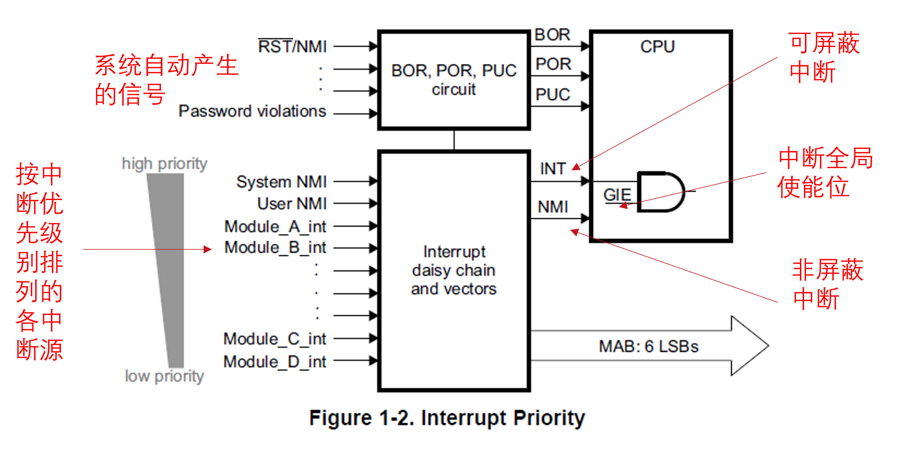</center>

MSP430不希望发生中断嵌套，因为很多中断进行嵌套时，堆栈等资源会大量消耗，导致效率不如没有嵌套

级别越高的中断，中断例程的处理速度要越快（牛老师的工程师经验）


**中断响应机制**

1. 当前正在进行的指令要完成
2. PC进栈
3. SR进栈（低功耗模式类型）
4. 多个中断排队，最高优先级先处理
5. 正在处理的中断对应的中断请求标志位IRF置0，其余保持为1
6. <font color=red>除了`SCG0`外其他`SR`的bit置0，这一步清除了低功耗模式，并了关闭中断`GIE=0`，防止嵌套</font>
7. 中断向量装入PC，进行中断例程

中断优先级别只在进入中断前的排队系统里起作用


### 13.3 中断例程

写法如下

```c
// P4中断
#pragma vector=PORT4_VECTOR
__interrupt void Port_4(void)
{
	P4OUT ^= BIT5;	
	P4IFG &= ~BIT0;				// 清除P4.0的中断标志位
}
```

因为`P4`口8个bit都能作为中断，因此系统不会自动清0（因为可能别的口有中断输入），故需要手动清0


## 14 MSP430的定时器

<font color=red>**看门狗**</font>

正常运行的程序会定时喂狗，清除计数；计数记满认为程序出故障，WDT发送reset信号

<center>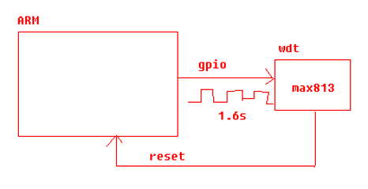</center>

MSP430自带的WDT有两种模式

* 看门狗模式
* 定时器模式：产生特定的时间间隔，发送中断

自带时钟失效保护特征：保证在看门狗模式下WDT的时钟不能失效

* 默认工作在看门狗模式下，将会影响低功耗模式的使用
* 当SMCLK或者ACLK失效时，系统自动切换VLOCLK给看门狗


在控制WDT时需要指定的口令：高字节必须是`5A`，因为01011010比较难随机产生

* 否则将触发PUC系统复位信号，类似于复位
* 低字节是需要配置的值


喂狗操作

```c
WDTCTL = WDTPW + WDTCNTCL
```


**具体配置**

<center>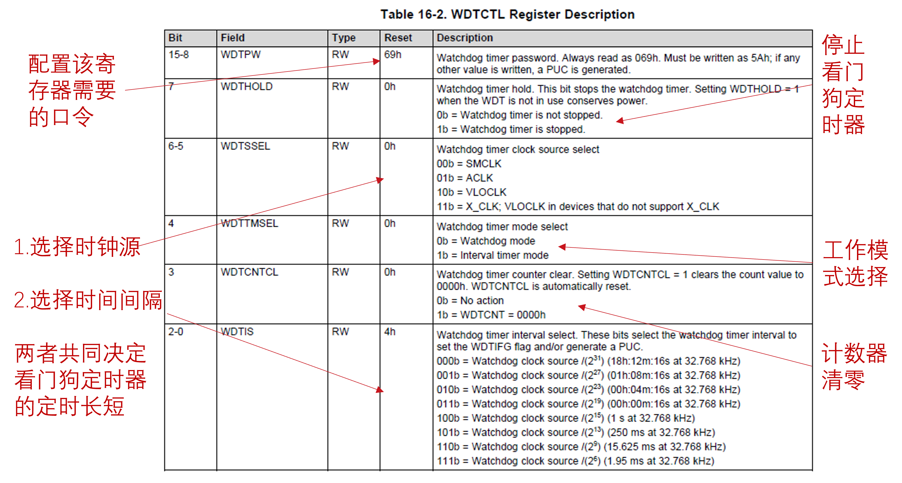</center>

定时时长配置：由时钟源和分频共同决定


**16bit定时计数器A**

* 可以选择不同的时钟源，也可以分频
* 三种操作模式
  * up mode：计数到指定的数字产生中断
  * continuous mode：计数到最大值FFFFh产生中断
  * up/down mode
    * 计数方向被锁存，当计数器被停止后，重新开始时，能沿着原来的方向继续计数
    * 产生两个中断，计满TAxCCR0 产生CCIFG中断，减到0，产生TAIFG中断。
* TAxR软件可读写
* 计数器溢出产生中断
* 通过置TACLR，清零TAR

x是一个数字，可以是0，1等

**启动方式**

* `MC`寄存器非0，`MC=01,10,11`分别工作于上面三种模式
* 时钟源激活
* TAxCCR0写0可以停止计数


**RTC**

Real-Time Clock，实时时钟，51需要外部扩展，430内部自带

是一个独立的实时时钟芯片


## 15 MSP430的ADC/DAC

主要参数

* 大于200kps的采样率
* 12bit采样精度
* 12路可独立配置的外部采样通道


## 16 MSP430的USCI和SPI

Universal Serial Communication Interface

分为USCI_A和USCI_B，分别支持UART、SPI、I2C


### <font color=red>16.1 SPI接口原理</font>

SPI：Serial Peripheral Interface

同步串行外设接口，共四条线

<center>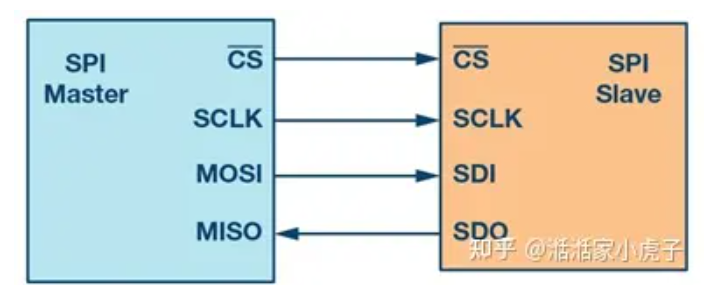</center>

* CS：片选
* SCLK：时钟，主机输出
* MOSI：主机输出；SDI：从机输入
* MISO：主机输入；SDO：从机输出

<font color=red>**读写时序**</font>

<center>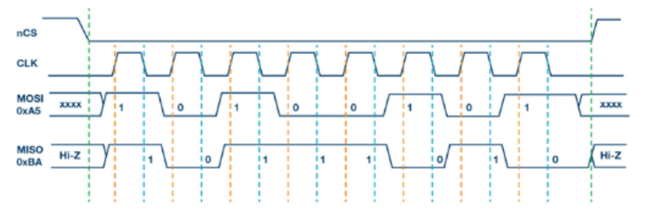</center>

注意上升沿和下降沿，牛老师认为的是上升沿从机采样，下降沿主机采样，但实际好像不是这样，考到了自己取舍

一般来说是有4种模式，模式0上升沿采样，下降沿输出


**多从机架构**

<center>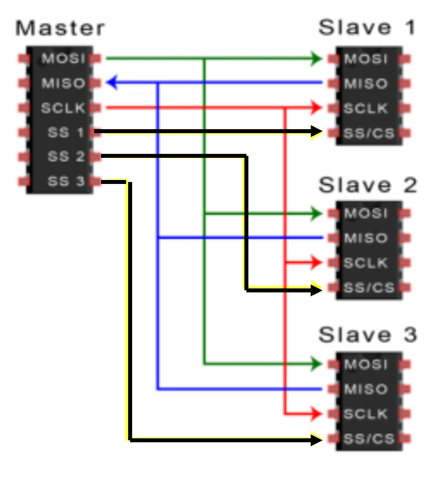</center>

注意看哪些是共用的


### 16.2 SPI接口

**主机模式**

<center>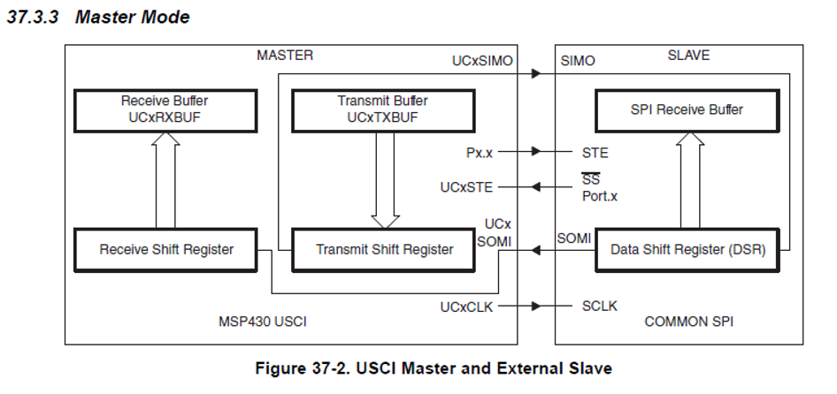</center>

主机模式下通过移位寄存器和BUFFER配合工作


发送机制

* 主机模式下，写`UCxTXBUF`寄存器立即触发发送，不需要额外操作
* 从机模式下，片选低电平有效，选中后发送，时钟由主机提供

接收机制

* 只要有发送，就会同步接收


`PUC`或`UCSWRST`bit置1将立即停止USCI，并终止任何传输

`UCBUSY=1`表示USCI收发正在进行


### 16.3 基于SPI的点阵液晶接口

`RS`寄存器用来选择输入的是指令还是数据

仅需要连接MOSI，因为显示器是输出设备，不会有输入

```c
# 将特定的区域置为相应的 color 颜色
void etft_AreaSet(uint16_t startX, uint16_t startY, 
                  uint16_t endX, uint16_t endY,
                  uint16_t color);

# 在指定位置显示一个字符串，其字符颜色为fRGB，背景颜色为bRGB
void etft_DisplayString(const char* str, 
                        uint16_t sx, uint16_t sy, /* start x, start y */
                        uint16_t fRGB, uint16_t bRGB);

# 显示图像
void etft_DisplayImage(const uint8_t* image, /* dim = 1 */
                       uint16_t sx, uint16_t sy, 
                       uint16_t width, uint16_t height);
```


**字符的显示像素**

用16进制表示

<center></center>


## 17 MSP430的USCI和UART

参考51的UART，基本大差不差

需要注意的是在初始化阶段不能开中断，所有的串口初始化结束后才能开中断


**配置串口**

在配置串口时，需要配置寄存器=1时才能进行，然后需要清零

<center>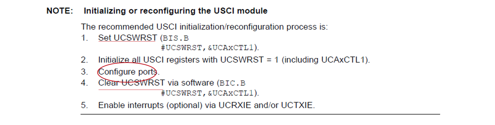</center>


**配置波特率**

可以有小数波特率


<font color=red>**RS232**</font>

MSP430使用这个通讯协议，特点如下

* 异步
* 比特率固定为19200，传输速率低
* 双方共地，共模干扰，抗噪能力弱
* 传输电压很高，-3\~-15为1，3\~15为0
* 传输距离有限