# 医学超声基础

## 1 绪论

### 1.1 基本概念

接受超声的装置：**换能器**

**HIFU**：高强度聚焦超声，High Intensity Focused Ultrasound

超声检查中的液体：耦合剂，不导电

超声**无法穿透骨骼**

### 1.2 声波和超声波

一种机械波，人耳能听到的在20-20000Hz之间

声波可以理解为截止偏离平衡态的**小扰动的传播**，只是**能量**的传递，不发生质量的传递

以上是线性声波的表述，非线性声波可以整体向外传播

### 1.3 超声发展史

墨子最早使用声波

例：M超属于？

解：空间一维设备，诊断设备，回波式，脉冲波，记录一维信息随时间的变化

## 2 超声波的特点和应用

### 2.1 次声，声波和超声波

特点对比

* 次声：穿透力强（衍射），传播衰减小，反射弱
* 声波：穿透能力中，衰减适中，方向性适中
* 超声波：**衰减大**，但是**方向性好**

### 2.2 超声，可见光和无线电波

特点对比

* 超声：传播需要**弹性介质**（刚体不行），穿透能力一般，方向性一般；**水中衰减小**，空气中衰减大
* 可见光：穿透能力差
* 无线电波：不需要介质，**水中衰减大**（因此，潜艇用声纳）
* X射线：穿透能力很强，几乎没有反射；只能透射成像

### 2.3 超声波的特点

* 方向性较好：有比较好的空间分辨力

  
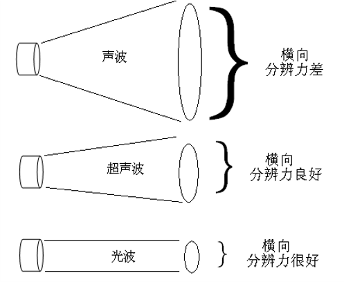

* 携带能量高（能量输送：超声治疗）

* 穿透能力适中（软组织）：适合反射式深度组织成像

### 2.4 超声波的应用

* 治疗设备：1MHz；诊断设备：5MHz；声波的**频率越大**，**穿透性越低**，但是准直更好，**横向分辨率高**
* 超声成像：回波信号携带**深度信息**和反射源的**声学特性**（反射率越大，回波幅度越大）
* A超，M超（超声心动图），B超，超声多普勒，HIFU

## 3 声学物理基础

### 3.1 机械振动和机械波

产生机械波的条件

1. 有机械振动的波源
2. 能传播波的**弹性**介质

描述一个机械波

* 波幅
* 频率：通常波动频率在数值上**等于波源振动频率**
* 波速：**仅由介质决定**，一般比质点振动快
* 波长：$\lambda = c\cdot T$
* 相位

一般用
$$
p = p_a\cos(\omega t-kx+\varphi)
$$
来描述一个波，其中$p_a$是声压的振幅，$k = \frac{2\pi}{\lambda}$是波矢

### 3.2 声波和分类

**根据质点振动方向**

* 纵波：凡是能受拉/压的介质都能传播
* 横波：**仅固体**能传播，因为只有固体能受剪切力
* 表面波：椭圆运动，短轴在传播方向

**根据波阵面分类**

由于能量守恒，能流$I$与面积$S$的乘积不变，而$I\propto A^2$，那么波幅$A$与传播距离$r$的关系是

* 平面波：$A$不随$r$变化，波源是一个平面

* 柱面波：$A\propto \frac{1}{\sqrt{r}}$，波源是一条直线

* 球面波：$A\propto \frac{1}{r}$，波源是一个点

平面圆片换能器发射的超声波：离换能器**近**的区域，认为是**平**面波；**远**的区域，认为是**球**面波

同样的，太阳光是平面波而星光是球面波

**根据振动持续时间**

* 连续波

* 脉冲波，视为连续波乘矩形窗

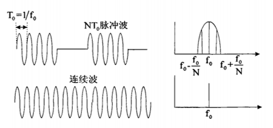

### 3.3 声学参量

#### 3.3.1 **声速**

给定介质的声速是个常量，但受温度和波**型**的影响

声速与介质的**密度反相关**，**弹性模量正相关**，固体中还与泊松比有关

根据声速随水温的变化还能用声速反推温度

声速的本质：反映了介质受声扰动时的压缩特性，记为
$$
c^2 = \left(\frac{dp}{d\rho}\right)_S
$$
其中$S$表示绝热过程，若介质可压缩性较大（$p$变化不大而$\rho$变化大），那么声速就较低

#### 3.3.2 **声压**

定义为声波引起的**压强差**
$$
p = P - P_0
$$
前者是当前压强，后者是静态压强，有

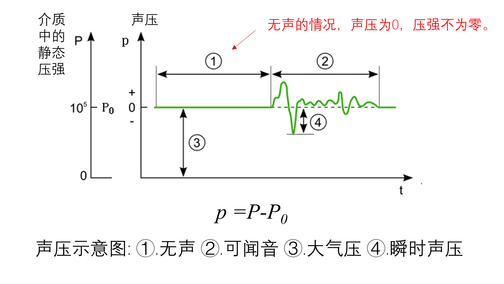

**有效声压**：瞬时声压的方均根
$$
p_e = \sqrt{\frac{1}{T}\int _T p^2dt}
$$
平面余弦波的$p_e = \frac{\sqrt{2}}{2}p_a$

**声压级**

用分贝表示
$$
L_p = 20\lg{\frac{p}{p_0}} \,\,\,\mathsf{dB}
$$
其中$p_0=2\times 10^{-5}\mathsf{Pa}$，是基准声压，对应于1000Hz下人耳能听到的最低声压

用奈培表示
$$
L_n = \ln {\frac{p_1}{p_0}} \,\,\,\mathsf{Np}
$$
二者的换算关系为 1 Np / cm = 8.686 dB / cm

#### 3.3.3 **质点振动速度**

注意与声波速度区分

一维声波的质点振动速度可以通过牛顿第二定律推导
$$
\rho \frac{dv}{dt} = -\frac{dp}{dx}
$$
其中$\rho$是介质密度，分为静态密度$\rho_0$和扰动下的密度变化，在线性声波下可以认为密度不变

$p = p_a \cos{(\omega t-kx+\varphi)}$是声压，于是得到
$$
v = -\frac{1}{\rho_0} \int \frac{dp}{dx}dt = \frac{p_a}{\rho_0 c}\cos(\omega t -kx+\varphi)
$$
其中$c$是波速

#### 3.3.4 声阻抗和声阻抗率

**声阻抗**：界面声压与通过界面的声通量之比
$$
Z_a = \frac{p}{U} = \frac{p}{vS} = R_a + jX_a
$$
$R_a$表示能量传递，$X_a$表示存储在介质中的能量（不传播）

**声阻抗率**：归一化，**最能反映介质声学特性**的量
$$
Z_s = \frac{p}{v} = Z 
$$
带入$v$的表达式，得到
$$
Z = \rho_0 c
$$
波速$c$能用绝热压缩系数表示为$c = \frac{1}{\sqrt{\rho_0 K}}$，那么
$$
Z = \sqrt{\frac{\rho_0}{K}}
$$
一般而言，声阻抗率是复数；但是对无衰减的平面波，声阻抗率是一个与频率无关的实数

此时声阻抗率完全由介质决定

#### 3.3.5 声强

**声强**：单位面积上的声功率
$$
I(t) = p(t)\cdot v(t)
$$
在稳态声场中，用一段时间的平均值来表示

对于平面余弦波，其平均声强为
$$
I = \frac{1}{2}\rho_0 cA^2\omega^2 = \frac{p_a^2}{2\rho_0c}=\frac{p_a^2}{2Z}
$$
其中$A$是质点振幅，$A = \frac{p_a}{\omega \rho_0 c}$

**声强级**
$$
L_I = 10\lg \frac{I}{I_0} \,\,\,\mathsf{dB}
$$
从20变为10的原因是$I\propto p_a^2$

#### 3.3.6 声功率

$$
W = \int_S IdS
$$

声强在一个面上的通量

**声功率级**
$$
L_W = 10\lg\frac{W}{W_0}
$$

### 3.4 生物组织的声学特性

**声阻抗率**最能反映生物组织的声学特性

生物组织之间的声速差不大，不超过5%；脂肪声速小于水，其他生物组织与水相近；骨骼和固体类似

**生物组织的超声特性**

* 似水组织
* 多脂类组织
* 骨骼等固体组织
* 肺泡、肠胃气等含气生物组织

主要区别是声阻抗率

## 4 声波的传播特性

### 4.1 波动方程

求解的前提假设

* 体积元的尺寸远小于波长
* 体积元内部的量变忽略不计（均一）
* 体积元的尺寸远大于原子分子的尺寸，且介质连续

根据牛顿第二定律，得到
$$
F = ma = m\frac{dv}{dt}=\rho A\Delta x\frac{dv}{dt}
$$
而$v=v(x,t)$，全微分得到$dv = \frac{\part v}{\part x}dx+\frac{\part v}{\part t}dt$，得到$\frac{dv}{dt}=\frac{\part v}{\part x}\frac{dx}{dt}+\frac{\part v}{\part t}$

同时，体积元上的力由两边的压强差造成
$$
F = [p(x)-p(x+\Delta x)]A
$$
联立二式得到
$$
-\frac{\part p}{\part x} = \frac{p(x)-p(x+\Delta x)}{\Delta x} = \rho\left(\frac{\part v}{\part x}\frac{dx}{dt}+\frac{\part v}{\part t}\right)
$$
带入$v,x$的表达式进一步得到
$$
\frac{\part p}{\part x}+\rho_0\frac{\part v}{\part t} = 0
$$
根据质量守恒，单位时间内离开体积元的质量就是体积元质量的减少，即
$$
A[\rho(x+\Delta x)v(x+\Delta x)-\rho(x)v(x)] = -A \Delta x\frac{\part \rho}{\part t}
$$
整理为
$$
\frac{\part(\rho v)}{\part x}+\frac{\part \rho}{\part t} = 0 \tag{4-1}
$$
带入$\rho(t) = \rho_0+\rho_1(t)$，且$\rho_0 >>\rho_1$，前者不随时间变化，得到
$$
\rho_0 \frac{\part v}{\part x} +\frac{\part \rho_1}{\part t} =0 \tag{4-2}
$$
为了反映介质特性，定义绝热压缩系数
$$
K = \frac{\rho_1}{\rho_0}\frac{1}{p}
$$
将上式对时间求导后带入4-2
$$
\frac{\part p}{\part t} +\frac{1}{K}\frac{\part v}{\part x}=0 \tag{4-3}
$$
结合4-1,4-3，再次求导，得到
$$
\frac{\part^2 p}{\part x^2} -\frac{1}{c^2}\frac{\part^2 p}{\part t^2}=0
$$
这个波动方程的通解是
$$
p = A_1e^{j(\omega t -kx)} +A_2e^{j(\omega t+kx)}
$$
定义色散关系：$\frac{\omega}{k}=c= \frac{1}{\sqrt{\rho_0 K}}$

**推导方程的前提**

* 主要考虑纵波，这在生物体软组织中成立（剪切模量很小）
* 声强不太大，因此体积元的密度变化不大，在诊断时满足（HIFU不满足）
* 无热量交换，在治疗时不满足
* 没有考虑介质吸收的衰减

### 4.2 声波的叠加、干涉和衍射

**相控阵聚集扇扫**：基于叠加原理，一系列不同相位的波在目标地叠加加强

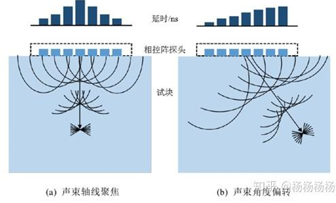

**驻波**：两束传播方向不同的波叠加

入射波$p_i = p_{ia}e^{j(\omega t-kx)}$，反射波$p_r=p_{ra}e^{j(\omega t+kx)}$，合成后为
$$
p=p_i+p_r=e^{j\omega t}\left[(p_{ia}-p_{ra})e^{-jkx} +2p_{ra}\cos{kx}\right]
$$
当$p_{ia}=p_{ra}$时，得到
$$
p = 2p_ae^{j\omega t}\cos{(kx)}
$$
故在$x=\frac{1+2k}{4}\lambda$时为波节，振幅为0；$x=\frac{k}{2}\lambda$时为波腹，振幅最大

**驻波的应用**

换能器压电晶片的厚度选择声波在换能器介质中的$\frac{\lambda}{2}$的奇数倍，**$\frac{\lambda}{2}$对应换能器工作的基频**，倍数为谐波频率

**衍射**

影响

* 由于超声的衍射，换能器能探测的病灶深度方向的**最小尺寸为**$\frac{\lambda}{2}$，再小，声波就衍射走了，**没有回波**

* 小结石无声影，大结石有很长的声影

  
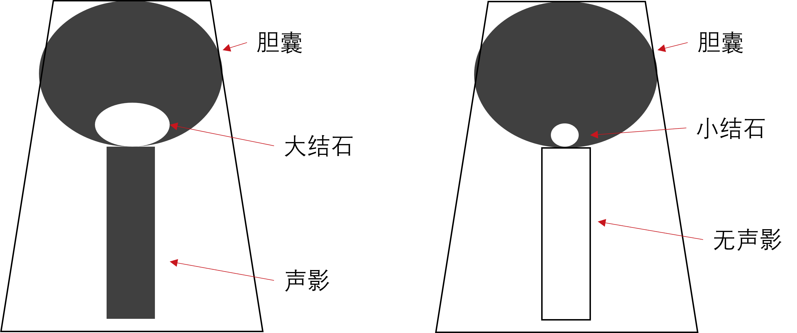

###  4.3 声波的反射、折射与透射

#### 4.3.1 声波垂直入射的反射与透射

定义声**压**反射率$r$和声**压**透射率$t$，对于下面的垂直入射过程存在

$$
r = \frac{p_r}{p_0} = \frac{Z_2-Z_1}{Z_2+Z_1}\\
t = \frac{p_t}{p_0} = \frac{2Z_2}{Z_2+Z_1}
$$

其中$Z_i$是声阻抗率，$Z_i$不同是反射折射产生的原因

进一步定义声**强**反射率$R$和声**强**透射率$T$，有
$$
R = \frac{I_r}{I_0} = \frac{\frac{p_r^2}{2Z_1}}{\frac{p_0^2}{2Z_1}} = r^2 = \left( \frac{Z_2-Z_1}{Z_2+Z_1} \right)^2\\
T = \frac{I_t}{I_0} = \frac{\frac{p_t^2}{2Z_2}}{\frac{p_0^2}{2Z_1}} = \frac{Z_1}{Z_2}\frac{p_t^2}{p_0^2} = \frac{4Z_2Z_1}{(Z_2+Z_1)^2}
$$
存在以下讨论

* $Z_1>Z_2$，入/反射波**声压的相位反相**，质点**振动速度同相**
* $Z_1\gg Z_2$，$r\approx-1,t\approx0,R=1,T=0$
* $Z_1<Z_2$，入/反射波**声压的相位相同**，质点**振动速度反相**
* $Z_1\ll Z_2$，$r\approx1,t\approx2,R=1,T=0$，形成驻波，**振动速度的波节是声压的波腹**
* $Z_1\approx Z_2$，不反射

洗澡时，水进入耳朵，由于水的声阻抗率远大于空气，类似情况4，声音听不清

透射波永远与入射波同相，无论声压/振动速度

从上式得到以下结论
$$
R+T = 1 \\
t = 1+r
$$
上式理解为能量守恒，下式理解为法向声压连续（透射 = 入射 + 反射）

超声成像的原理是不同介质的声阻抗率**之差**，而不是绝对大小；即**超声成像依靠组织之间的反射系数差异**

#### 4.3.2 声波斜入射的反射与折射

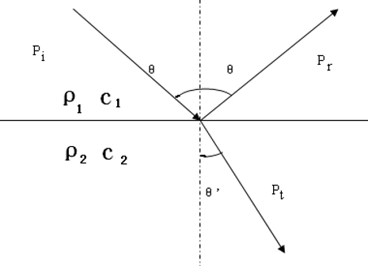

存在以下关系
$$
\frac{\sin\theta}{\sin\theta^{'}} = \frac{\lambda_1}{\lambda_2} = \frac{c_1}{c_2}\\
k_1\sin\theta = k_2\sin\theta^{'}
$$
下式也称为声折射定律

斜入射条件下声压反射率与折射率有
$$
r_p = \frac{Z_2\cos\theta-Z_1\cos\theta^{'}}{Z_2\cos\theta+Z_1\cos\theta^{'}}\\
t_p = \frac{2Z_2\cos\theta}{Z_2\cos\theta+Z_1\cos\theta^{'}}
$$

* 当$Z_2\cos\theta=Z_1\cos\theta^{'}$时，反射率 = 0，称为全透射
* 当$\sin\theta > \frac{c_1}{c_2}$时，折射角大于90$^\circ$，透射消失，称为全反射

#### 4.3.3 成像伪影

B超等设备的成像依赖于声波的直线传播，故任何的散射，折射等非直线的情况都会产生**成像伪影**

* 回声失落：大界面的回声与角度有关，当**界面与声束的角度很小**时，反射波不能返回换能器，图像上没有这一块

  
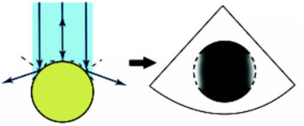

* 折射引起的伪影：类似于筷子在水中折断，会产生双重图像

  
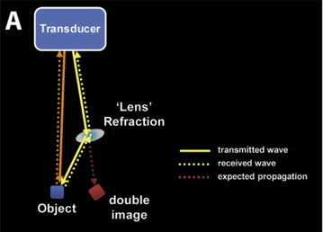

* 多普勒超声中的折射伪影：折射会**改变**声波的传播方向

**折射的应用**

声波在空气中的速度比在玻璃中慢，故与光相反，**凸**透镜是**发散**声束，**凹**透镜是**会聚**声束

当然介质改变后凸透镜也能会聚声束

### 4.4 三层介质透射与换能器声学匹配

声波在声阻抗率相差很大的两个介质中传播时，要用耦合剂进行耦合

那么有
$$
T_{13} = T_{12} \cdot T_{23} = \frac{I_2}{I_1} \cdot\frac{I_3}{I_2} = \frac{4Z_3Z_1}{(Z_3+Z_1)^2\cos^2(k_2l_2)+\left( Z_2+\frac{Z_3Z_1}{Z_2} \right)^2\sin^2(k_2l_2)}
$$
其中$k_2 = \frac{2\pi}{\lambda_2}$，$l_2$是中间介质的厚度

* 当$l_2\ll \lambda_2$，相当于没有介质层
* 当$l_2=\frac{n}{2}\lambda_2$，由于$Z_1,Z_3$相差很大，与上面相似
* 当$l_2 = \frac{2n+1}{4}\lambda_2$，且$Z_2 = \sqrt{Z_1Z_3}$时，发生全透射，$T_{13}=1$

因此，在换能器内部存在$l=\frac{1}{4}\lambda$的声学匹配层

## 5 声波的散射和吸收衰减

### 5.1 散射

**广义**：声波的**波幅、波前方向、相位和频率**由于介质中**非均匀体**的再辐射而改变

**狭义**：声波传播过程中遇到**线度小于波长**的障碍物时反射波不再是平面波。称为散射波场

超声波在生物组织中的衰减主要由**吸收**和**散射**组成

散射分类

* $d\gg \lambda$，反射、透射、折射
* $d\approx \lambda$，衍射（结石）
* $d\ll \lambda$，瑞利散射、分子散射（红细胞）

**瑞利散射**

当$d\ll \lambda$时，散射波的**强度**与入射波的波长有如下关系
$$
I(\lambda)_{\mathsf{scattering}} \propto \frac{I(\lambda)_{\mathsf{incident}}}{\lambda^4}
$$

例：为什么天空是蓝色的？为什么早晨或者晚上太阳是红色的？

解：空气分子粒径与光波长相近，波长短的蓝色光强度大；这两个时间段太阳光经过的大气最长，蓝光都被散射，红光的波长长，散射强度低，看起来显得红

**影响红细胞超声散射的主要因素**

* 散射体的尺度
* 散射体的数目
* 散射体和周围环境的声阻抗率**之差**
* 超声的频率

### 5.2 超声散射的作用

**超声造影剂**

本质是微米量级的包膜微气泡，用来增强超声的散射强度，显影更清晰

为什么用气泡？：因为气泡的声阻抗率和生物组织相差往往很大；气泡**共振**产生很强的散射

**超声多普勒**：测量血液流速，**利用**的是声波的**散射**；血液的反射非常微弱

* 观察者动：$f^{'} = \frac{v+c}{\lambda} = (1+\frac{v}{c})f_0$
* 波源动：$f^{'} = \frac{c}{\lambda-vT}=\frac{c}{c-v}f_0$

都是靠近的情况

为了增强散射信号的强度，超声多普勒仪的功率很大，比B超大

### 5.3 声波在生物组织中的衰减吸收

**声压衰减系数$\alpha$**

很显然满足
$$
\frac{dp}{p} = -\alpha dx
$$
得到
$$
p(x) = p(x_0)e^{-\alpha(x-x_0)}
$$
取对数得到
$$
\alpha = \frac{1}{x-x_0}\ln{\frac{p(x_0)}{p(x)}}\,\,\, \mathsf{Np/cm}\\
\alpha = \frac{20}{x-x_0}\lg{\frac{p(x_0)}{p(x)}} = \frac{10}{x-x_0}\lg{\frac{I(x_0)}{I(x)}}\,\,\, \mathsf{dB/cm}
$$
有时也用声**强**的衰减系数$\mu=2\alpha$
$$
I(x) = I(x_0)e^{-\mu(x-x_0)}
$$

**衰减因素**：只考虑无吸收的理想衰减

* 扩散衰减：波阵面扩大（平面波不会）
* 散射衰减：改变了传输方向
* 吸收衰减：转换为其他能量
* 界面反射衰减：改变了传输方向

衰减是包括了吸收的，因此**衰减系数>吸收系数**

**吸收衰减随频率的变化**

在1MHz - 15MHz的频段，吸收系数几乎与频率成正比，即
$$
\alpha \propto f
$$

实际上
$$
\alpha = af^b
$$
其中$b$很接近1

## 6 非线性声学及应用

### 6.1 非线性

* gamma变换
* TGC变换：时间增益补偿。由于声波传播会衰减，在接收到声波时需要进行指数补偿，否则区域的明暗差别很大（依靠幅度进行明暗显示）

**线性声学的近似条件**

* $v\ll c$
* $x\ll \lambda$，$x$是质点振动幅度
* $\rho_1\ll \rho_0$
* 绝热状态传播，没有热交换

**不同的适用场景**

* 线性：能量低，超声成像等
* 非线性：能量大，HIFU等超声治疗，需要非线性参量$\frac{B}{A}$表示

### 6.2 非线性声学参数B/A

**定义**

是大振幅声波的二级小量，表达式为
$$
\frac{B}{A} = \rho_0c_0^{-2}\left( \frac{\part^2p}{\part\rho^2} \right)_{S,\rho_0}
$$
其中$S$表示绝热等熵条件
$$
A = \rho_0\left( \frac{\part p}{\part\rho} \right)_{S,\rho_0} \,\,\,,\,\,\, B = \rho_0^2\left( \frac{\part^2 p}{\part\rho^2} \right)_{S,\rho_0}
$$
在生物组织中，$c,\rho,\alpha$等常常相差不多（5%），但$\frac{B}{A}$相差很大（30%）

### 6.3 超声非线性效应

常见的非线性效应有

* 波形畸变
* 声辐射力
* 声冲流
* 色散
* 激波

**波形畸变**

由于
$$
c(x) = c_0 + \left( 1+\frac{B}{2A} \right)v(x)
$$
波形会畸变为锯齿波

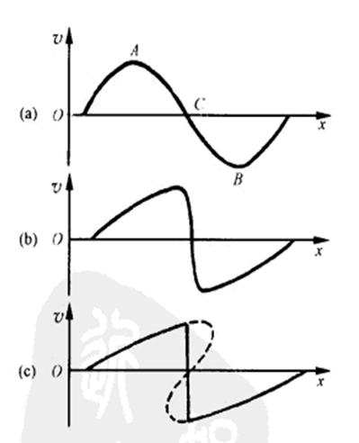

**声辐射力**

当考虑非线性效应时，声压变为
$$
p = (\rho_0+\rho_1)c_0v
$$
结合物态方程$p=c_0^2\rho_1$（声速的本质中出现），得到
$$
p = c_0\rho_0v + \frac{pv}{c_0} = c_0\rho_0v+(\rho_0+\rho_1)v^2 \approx c_0\rho_0v+\rho_0v^2
$$
声压的平均值就是
$$
\bar{p} = \frac{1}{T}\int_Tpdt = \frac{1}{T}\int_T\rho_0v^2dt
$$
而$\rho_0v^2 = \frac{p^2}{c_0^2\rho_0}$，根据有效值的定义，得到
$$
\bar{p} = \frac{p_e^2}{\rho_0c_o^2}
$$
而声辐射力
$$
F = A\cdot\bar{p}
$$
其中$A$是有效面积

**应用**：声镊，用声辐射力夹住物体

**声冲流**：声波在介质中传播时，引起的**介质质量单向流动**

### 6.4 非线性应用

**声功率的测量**

不同的靶有不同的声功率计算公式

* 全吸收靶：$P = F\cdot c$
* 全反射靶垂直入射：$P = \frac{Fc}{2}$
* 全反射靶斜入射：$P = \frac{Fc}{2\cos^2\theta}$，其中$\theta$是入射角

辐射力天平法测量速度快，量值准确，容易自动化

**声辐射力产生的剪切波**

在超声弹性成像时，会产生侧向的剪切波

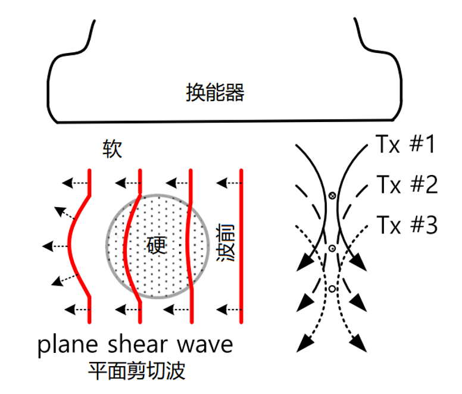

**声孔效应传送药物**

包膜造影剂在超声下瞬间**将细胞膜打开**，将大分子通过声激发进入细胞

## 7 声学参量及测量

### 7.1 声学参量的测量

#### 7.1.1 声速

核心公式
$$
c = \lambda \cdot f
$$

**干涉共振驻波法**

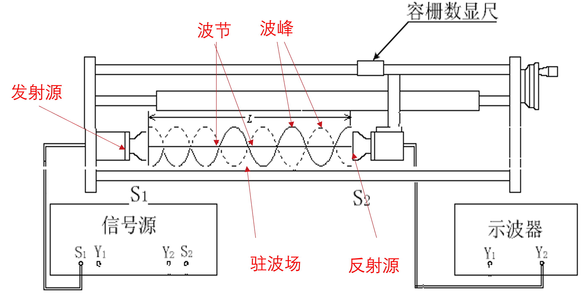

驻波的方程为
$$
p = 2Ae^{j\omega t}\cos(\frac{2\pi}{\lambda}x)
$$
根据相邻的波腹的位置获取$\lambda$的值，求出$c$

**水浸式脉冲插入取代法**

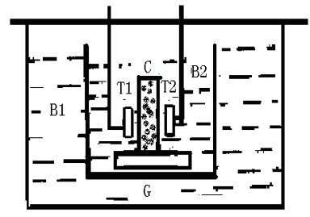

测量物体存在/不存在时声波的传递时间，得到
$$
t_1 = \frac{x}{c_w}\\
t_2 = \frac{x-D}{c_w}+\frac{D}{c_y}\\
\Delta t = t_1 - t_2
$$
其中$D$是介质厚度，$c_y$是介质声速，得到
$$
c_y = \frac{Dc_w}{D-\Delta tc_w}
$$

#### 7.1.2 声阻抗率

**公式法**

声阻抗率的决定式为
$$
Z = \rho c
$$
而$\rho=\frac{m}{V}$，$c$已经测得，求出$\rho$

**垂直入射反射系数测量法**

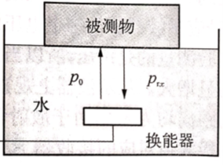

根据反射系数计算式
$$
r = \frac{p_r}{p_i} = \frac{Z_x-Z_0}{Z_x+Z_0}
$$
得到
$$
Z_x = \frac{1+r}{1-r} Z_0
$$
$r$通过测量$p_r,p_i$得到

影响精度因素：

* 垂直入射？
* 平面波？
* 介质尺寸足够大？（散射少）

#### 7.1.3 声功率

声功率$W$定义为
$$
W = I \cdot A
$$
其中$I$是声强

**辐射力天平法**

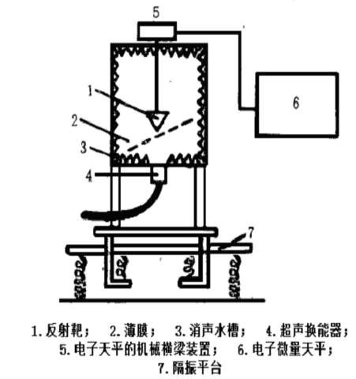

* 隔振平台隔绝外界的干扰
* 消声水槽防止反射波和散射波的干扰
* 薄膜很薄，相当于三层介质模型的中间介质很薄，对超声没有损失
* 薄膜将换能器与天平隔离，防止声流的影响；
* 圆锥体靶的设计是为了防止产生驻波（压力大大增加）
* 主要适合于连续波和长脉冲波，对于聚焦声场和短脉冲不适用

**量热法**

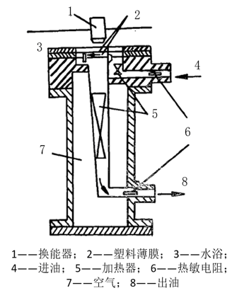

系统热平衡时声辐射功率为
$$
W = m C_p \Delta T
$$
其中$C_p$是工作液体比热，$m$是每秒流过的质量，$\Delta T$是输出液体和输入液体温度差

### 7.2 声场的测量

**原理**：声波引起介质密度的交替变化，进而使介质的光学折射率变化，相当于一个光栅，光发生衍射

存在声场的介质为声光栅

**计算公式**
$$
W = \frac{\rho c^3\lambda^2v^2}{32\pi(n-1)^2}
$$

### 7.3 脉冲波声强

诊断超声大部分是脉冲波

**定义**

* 空间平均时间平均：spatial average, temporal average，SATA，空间内积分取平均后除以一个周期时间
* 空间峰值时间平均：SPTA，只用峰值除以周期
* 空间平均脉冲平均：spatial average, pulse average，SAPA，只在脉冲存在的时间内
* 空间峰值脉冲平均：SPPA
* 空间平均时间峰值：SATP，空间内的平均在时间上的峰值
* 空间峰值时间峰值：SPTP

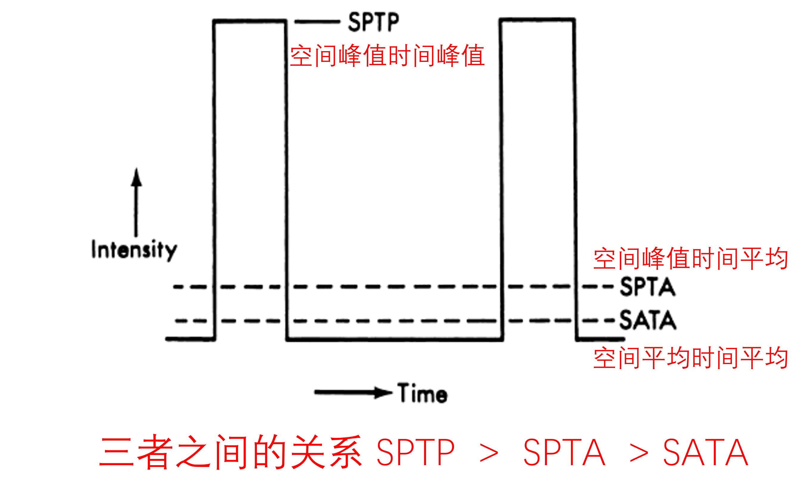

要求$I_{\mathsf{spta}}<100\,\mathsf{mW/cm^2}$，对生物组织大致无害；但对生殖细胞/胎儿等有别的规定

## 8 超声波的生物效应和安全性

### 8.1 超声生物效应

**热效应**

* 超声温热疗法：热效应，正常细胞不受较低高温的影响，但是肿瘤组织散热困难，积热死亡

  温度控制精度高，42℃左右

* HIFU：聚焦组织急剧升温（0.5s，60℃以上），急性热坏死

**机械效应**

* 振动与压力：声强低，对细胞轻微的按摩；声强高，可以碎结石

**超声空化**

* 指较强超声在液体中传播时引起的微小气泡产生、运动、破灭的现象

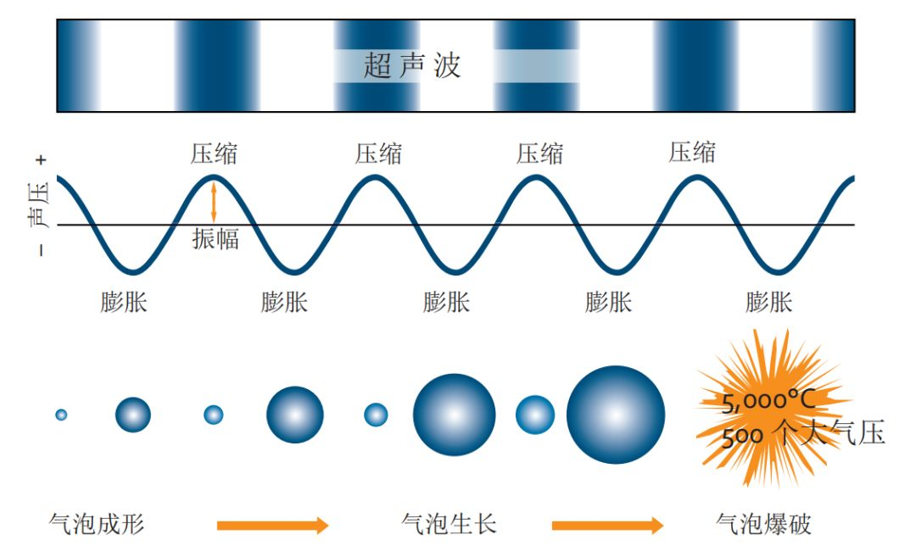

* 空化核：液体中的微小气泡
* 空化阈值：产生空化效应的临界负压

**化学效应**

* 引起生物体化学特性的变化：酶的活性，细胞代谢等；酒的纯化

**触变效应**

* 引起生物组织结合状态的改变，如血浆变稀等
* 声强低时可逆

**弥散效应**

* 提高半透膜渗透作用，使药物更易进入细胞内；药物透入疗法

### 8.2 超声热物理场计算

声强为$I_0$的超声透过长度为$L$的生物组织时产生了吸收
$$
\Delta I = I - I_0 = I_0(1-e^{-2\alpha L})
$$
当$2\alpha L \ll1$时，有

上面这个条件可以不要，因为计算的是单位体积即$\Delta m = \Delta x A\rho$，$\Delta x$也是声束经过的距离
$$
\Delta I  =2\alpha L I_0
$$
这些能量全部转化为热能，单位体积的平均产热量为
$$
Q = \Delta I \Delta t = 2\alpha I_0 \Delta t
$$
代入$Q$的表达式，有
$$
\rho C_t \Delta T = 2\alpha I_0\Delta t
$$
其中$\rho$是组织密度，$C_t$是比热，$\Delta T$是温度变化，上式用来估计温度变化

同样的超声强度下，声吸收系数和热传导系数越高，组织升温越快

肌肉的声吸收系数高，血液低

### 8.3 医学超声安全计量的阈值

当超声持续时间不超过0.1s时，剂量多大都安全；剂量小于0.04W/cm^2时，时间多长都安全

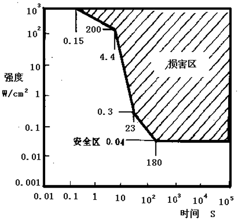

**超声诊断**：0.1W/cm^2以下

低强度超声治疗：0.2~2.5 W/cm^2

高强度超声治疗：3 W/cm^2以上

例：超声的生物效应与什么因素有关

解：持续时间，强度；与频率无关

## 9 压电效应及压电振子

### 9.1 压电效应及压电材料

**压电效应**：某些晶体表面受压会产生电压

**逆压电效应**：通过施加电压产生机械形变

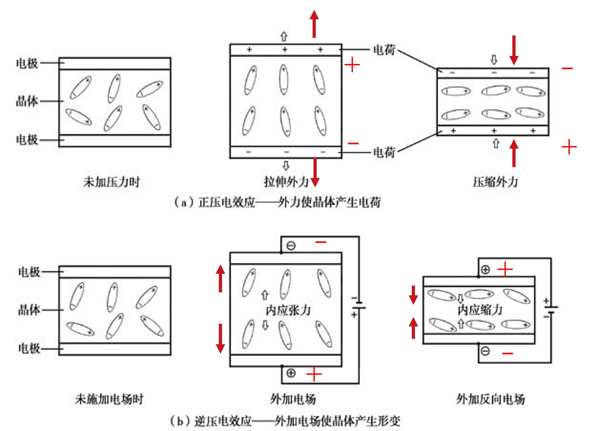

**压电材料**

* **压电单晶体**：石英晶体等，压电系数太低

* **压电陶瓷**：经过极化处理的陶瓷；易碎，有保护层；上下温度临界点称为压电居里点（在这之外没有压电效应）；钛酸钡BT最早，锆钛酸铅PZT最广泛

* **高分子聚合物**：PVDF等；柔性材料，不易碎；不适合做高功率发射型换能器（d偏低），接收型很好；声阻抗接近人体，匹配合适；结构简单、体软量轻、成本低，适合大量生产；$Q_m$小，接收带宽大

   

### 9.2 压电方程和边界条件

压电材料既有弹性体的特性，又有介电体的特性，即
$$
T = c S\,\,\,,\,\,\,D = E\varepsilon
$$
其中$T,c,S$分别是应力，杨氏模量和应变；$D,E,\varepsilon$分别是电位移，电场强度和介电系数

二者存在关系

其中$d_{ij}$是压电常数

**压电方程**

在小幅度变化下，总形变等于形变的线性叠加
$$
S_i = \sum_{j=1}^{6}s_{ij}^E T_j +\sum_{k=1}^3d_{ki}E_k
$$
第一项是电场恒定时的应力形变，一般可以忽略；第二项是电场对形变的贡献

**边界条件**

几种条件下对各个参数的限制

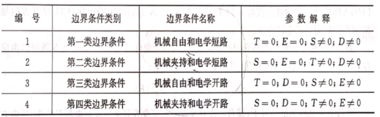

### 9.3 压电参数

#### 9.3.1 机械品质因数$Q_m$

$Q_m$与机械损耗成反比，反映了克服摩擦而消耗的能量大小，越大，表明发热量少
$$
Q_m = 2\pi \cdot\frac{谐振时储存的能量}{谐振时每周期损耗的机械能}
$$
多数陶瓷滤波器要求压电陶瓷的$Q_m$要高，而音响和接收型换能器要求$Q_m$低（超声检测要求$Q_m$不能太高）

当$Q_m$过大时，会产生振铃，导致波形失真

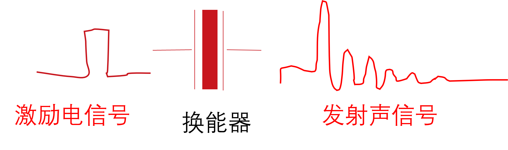

振铃效应对纵向分辨率有很大影响，会将两个深度的回波信息混合，无法分辨

为了减小振铃，可以加大换能器的阻尼，即$Q_m$减小

#### 9.3.2 机电耦合系数$K$

反应了机械能与电能之间的转换
$$
K^2 = \frac{电能转换的机械能}{输入的电能} = \frac{机械能转换的电能}{输入的机械能}
$$
与振铃无关

越大越好，但要注意方向

#### 9.3.3 压电系数

**压电发射系数**

* 压电应变系数$d$
  $$
  d = \left( \frac{\part S}{\part E} \right)_T = \left( \frac{\part D}{\part T} \right)_E \,\mathsf{C/N}
  $$
  表示在应力一定时，应变对电场的灵敏度

* 压电应力系数$e$
  $$
  e = -\left( \frac{\part T}{\part E} \right)_S = \left( \frac{\part D}{\part S} \right)_E  \,\mathsf{C/m^2}
  $$

**压电接收系数**

* 压电电压系数$g$
  $$
  g = -\left( \frac{\part E}{\part T} \right)_D = \left( \frac{\part S}{\part D} \right)_T\,\mathsf{m^2/C}
  $$

* 压电劲度系数$h$
  $$
  h = -\left( \frac{\part T}{\part D} \right)_S = -\left( \frac{\part E}{\part S} \right)_D\,\mathsf{N/C}
  $$

#### 9.3.4 频率常数$N$

压电体谐振频率$f$与沿振动方向的几何尺寸的乘积，仅与材料有关，是个常数
$$
N = f\cdot \delta
$$
当$f$要求越大时，尺度$\delta$越小

振动方向与极化方向一致，发出的是纵波

#### 9.3.5 居里点

分为上下居里点，分别是压电效应的存在上下限

治疗超声更需要考虑这个，因为非线性效应更强，温度高

短时间大温差，陶瓷会裂开，所以不一定到了居里点才坏

#### 9.3.6 介电损耗与损耗角正切

压电材料的电流相位图为

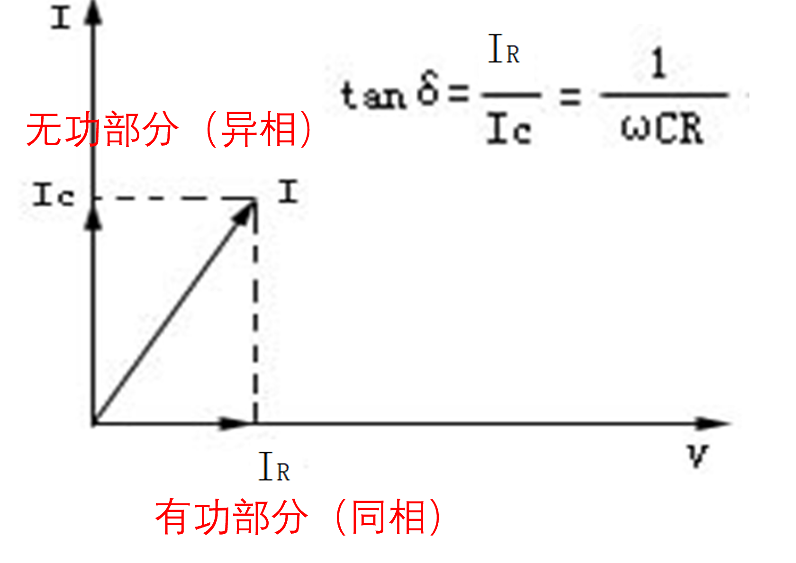

那么$\delta$就是损耗角

损耗角正切大，意味着换能器产生的内热多，材料性能差；宁可牺牲其他参数也不能让这个值太大

电学品质因数$Q_e$是损耗角正切的倒数，即
$$
Q_e = \frac{1}{\tan\delta} = \omega RC
$$

### 9.4 压电振子及等效电路

**压电振子的振动模式**

极化方向和振动方向的组合是振动模式，一般使用厚度方向的伸缩振动

**等效电路**

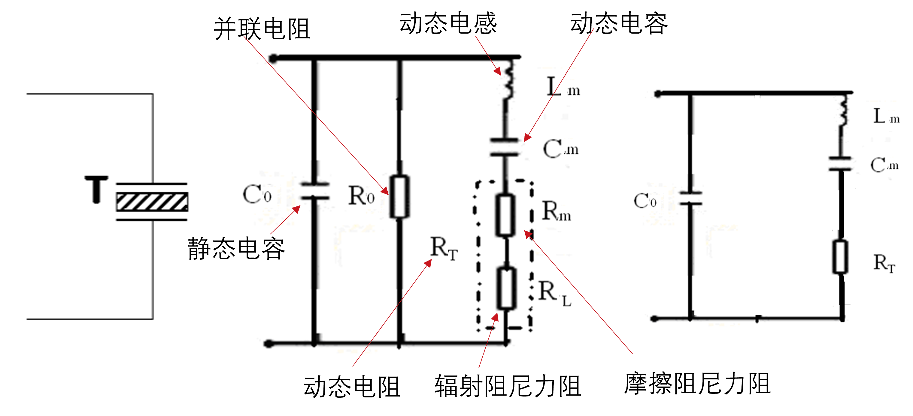

**电流/阻抗-频率关系曲线**

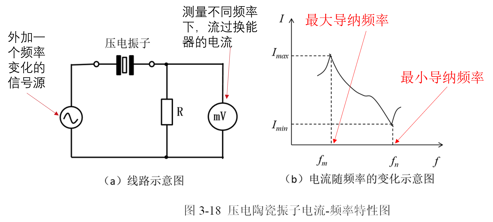

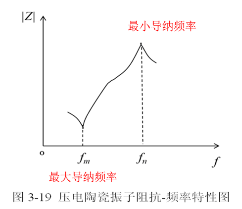

最大导纳点附近，电容电阻电感发生了谐振，一般换能器都工作在这个点附近

此时的谐振是在串联支路的谐振，这条支路变为阻性，剩下的另一条支路上的电容影响大，所以整个换能器为容性

一般陶瓷换能器工作在串联谐振频率时都是容性，因此需要并联电感

## 10 超声换能器结构与原理

### 10.1 概述

有接收，有发射，有两用；换能器都是防水的

脉冲波探头可以收发一体；连续波要做成分别的部分

### 10.2 结构与原理

**单振元换能器**

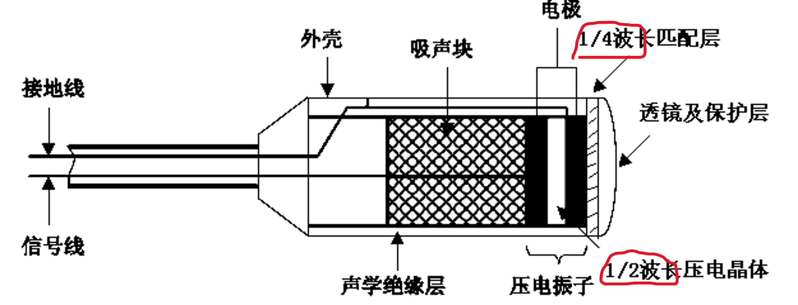

注意几个波长的作用

吸声块吸收背向辐射的声能，减小脉冲波的脉冲长度，也叫背材（增加阻尼）

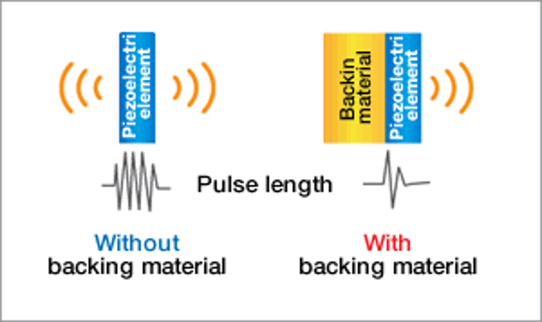

保护层用于减轻振子磨损，进行阻抗匹配，也叫面材；透镜用于准直，提高横向分辨率

**多振元换能器**

* 凸阵换能器：腹部探头等深部成像
* 线阵换能器：用于浅表的成像，频率可以高一点；颈动脉等

**探头参数和特性的关系**

* 工作频率：压电晶片的厚度（反比）
* 发射功率：压电晶片的面积，电压，PRF（全正相关）
* 探测深度：工作频率（反相关），功率（正相关）
* 纵向分辨率：频率（正相关）
* 横向分辨率：频率（正相关），聚焦情况（越细越强）
* 图像清晰度：显示设备

### 10.3 换能器的性能指标

**工作频率**：一般而言，发射换能器就是串联谐振频率，接收换能器是一个比较宽的频带

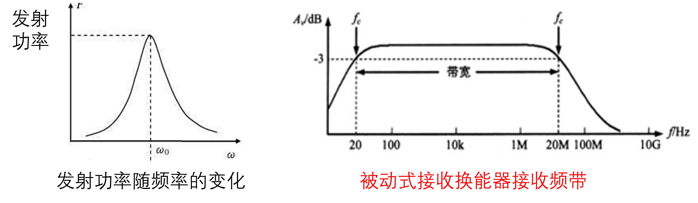

**机电耦合系数**：越大越好，见9.3.2节

**换能器阻抗特性**：见9.4节

**频率特性**：带宽：中心频率起到-3dB为止

**转换效率**：电声转换的效率在30%-50%；电转机转声，一共三个效率

### 10.4 超声换能器收/发及匹配电路

对于大功率的超声输出设备，电匹配显得更重要：治疗

对于小信号的检测设备，声匹配显得更重要：诊断

**超声发射电路**

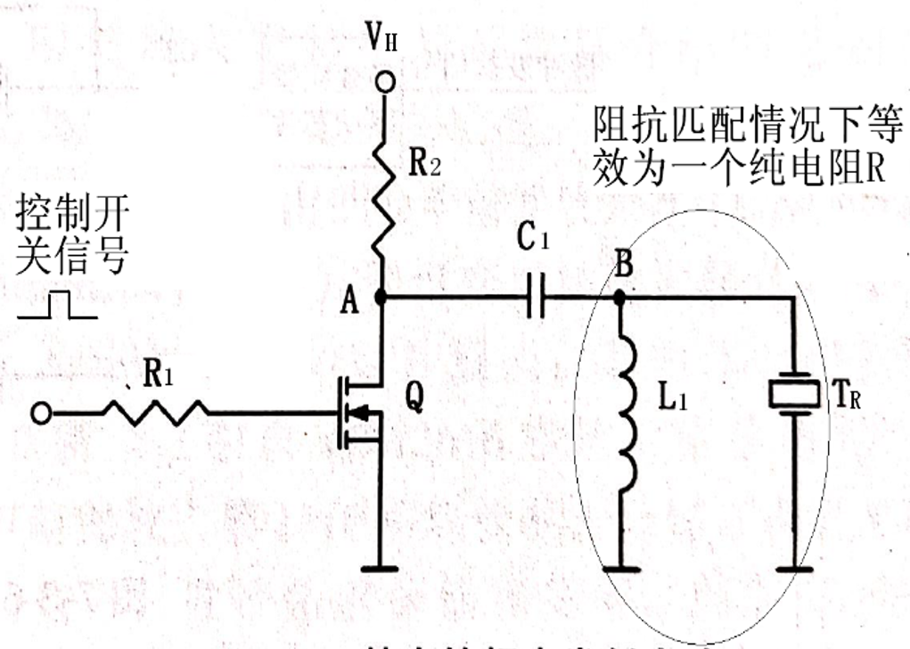

控制信号为低电平时，$V_H$对$C_1, T_R$缓慢充电；控制信号为高电平，产生开关导通，接地放电产生负脉冲

声压幅度与$V_H$成正比，但也不能太大（耐压限制）

时间常数为$RC$，减小$C_1$可以使得脉冲变窄

**收发隔离电路**

收发一体设备中，由于接收到的信号远远弱于发射的信号，需要对收发进行隔离，以减小发射对接收的干扰

基本原理：利用二极管将大于导通电压的大信号过滤

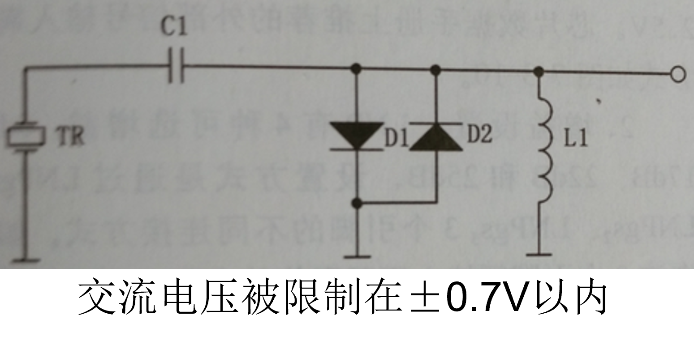

只有小信号能够到达接收端

**换能器匹配电路**

* 大功率输出超声设备，电匹配更重要；电匹配就是工作在串联谐振频率之下
* 小信号检测设备，声匹配更重要；声匹配就是三层模型

注意看PPT，这里有点不符合常理

**电匹配**

* 阻抗变换：通过变压器将电阻等价于电源最大输出功率时的电阻（即等于电源内阻）
* 调谐：将电抗等效为0，变为纯电阻（用谐振）；使电流电压同相；
* 整形滤波：调节电流波形；换能器在单一频率下是方波，谐波成分多，这些高频成分需要滤波，波形要整形

## 11 声束聚焦及相控技术

### 11.1 聚焦声场分布

**诊断**：声束变窄，横向分辨率变大

**治疗**：能量更加集中

**聚焦换能器种类**

* 声透镜

  
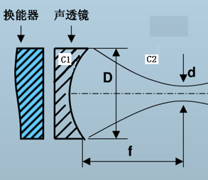

  这种方式要求换能器是平面的，发射平面波

  换能器口径为$D$，焦斑$d$近似满足
  $$
  d = 2.44\cdot \frac{f}{D}\lambda
  $$
  焦距$f$满足$f=\frac{C_1}{C_1-C_2}r$，$r$是透镜的曲率半径

  为了提高聚焦度，减小焦斑，可以增大口径$D$，提高工作频率$\frac{c}{\lambda}$

* 凹形压电材料（自聚焦）：换能器发出的波就是非平面

  
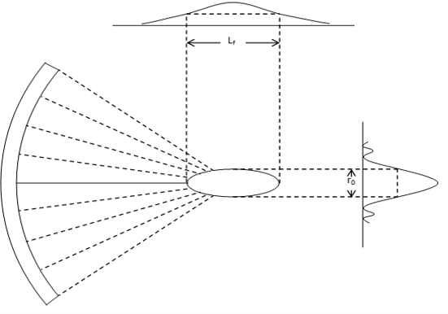

  横向聚焦尺寸$r_0$满足
  $$
  r_0 = 0.257 \frac{2\lambda f}{D}
  $$
  轴向聚焦尺寸$L_f$满足
  $$
  L_f = 1.8\frac{4\lambda f^2}{D^2}
  $$
  HIFU以这种方式居多

* 声反射镜：凹面镜反射

* 电子聚焦：相控聚焦

* 凹形多元阵聚焦：凹形的大圆盘内嵌多个小换能器

  
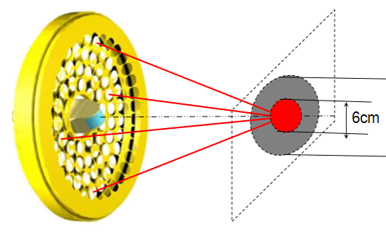

### 11.2 聚焦技术的应用

* HIFU：不用透镜，因为有能量损失，透镜发热会形变，焦点不准
* 肾结石粉碎
* 提高B超的横向分辨率

### 11.3 超声相控技术

多振元，控制每个振元的发射相位（先后）

**相控换能器线阵**：多个换能器排列成直线，每个振元加上不同相位的信号，可以实现

* 线性扫描
* 扇形扫描
* 电子聚焦

而不需要进行机械移动

**相控线扫**

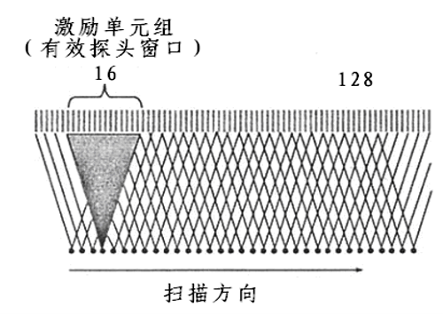

振元数越多，叠加后的声波主瓣越尖锐，横向分辨率越大

**相控扇扫**

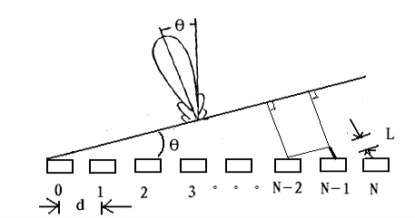

相邻振元的声程差为$L = d\sin\theta$，那么发射延迟就是
$$
\Delta t = \frac{d}{c}\sin\theta
$$

**电子聚焦**

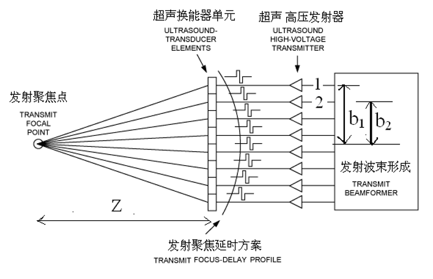

对于距中心分别为$b_1,b_2$的振元，声程差为
$$
\Delta S = \sqrt{Z^2 +b_1^2} - \sqrt{Z^2+b_2^2}
$$
延迟时间为
$$
\Delta t = \frac{S}{c}
$$
对于频率为$f$的声波，相位差为$\Delta \varphi = 2\pi f\Delta t$

### 11.4 相控技术在B超中的波束成形应用

对于相控聚焦技术，由于各个振元之间存在生成差，在最终生成图象时，需要考虑这个时间差，才能准确显示图像

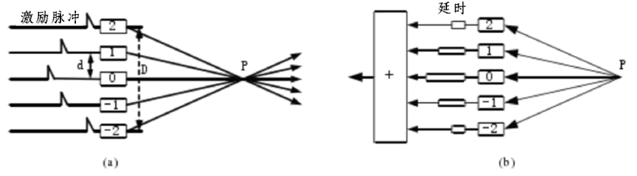

## 12 原片换能器声场分析

圆片换能器模型如下所示

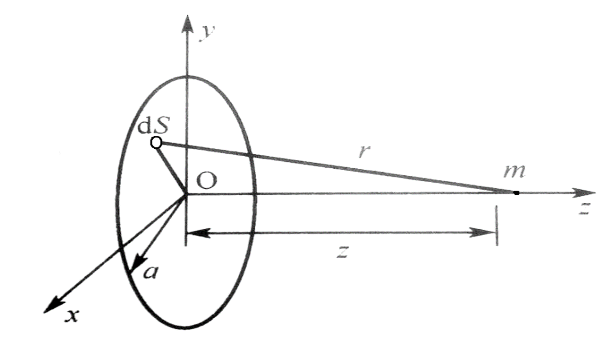

对于片上一个小面元$dS$，视为一个点声源球面波，考虑波幅衰减，其声压沿轴线方向的分布为
$$
dp = \frac{kp_a}{2\pi r}\cos{\left(\omega t -kr+\frac{\pi}{2}\right)}dS \tag{1}
$$
其中$\omega,k,r$分别是声波的圆频率，波矢和传播距离

已知振元的振速$u_a$，介质的声阻抗率$z_c$，根据$z_c=\rho_0c, u_a = \frac{p_a}{\rho_0 c}$，得到$p_a = z_cu_a$

假定振元距圆心距离为$R$，那么$dS=RdRd\theta$，在这个环形微元上的声压传播到m点时，沿轴线的分量完全相同

对式1进行积分，得到
$$
p_z =  \int_S dp = \int_0^{2\pi} d\theta \int_0^a \frac{kz_cu_a}{2\pi \sqrt{R^2+z^2}}\cos{\left(\omega t -k\sqrt{R^2+z^2}+\frac{\pi}{2}\right)} RdR\\= p_a \left[ \cos\left(\omega t -k\sqrt{z^2+a^2}\right) -\cos\left( \omega t-kz \right)\right]
$$
将结果写为指数的形式，得到
$$
p_z = \frac{p_a}{2}\left\{ \left[ e^{i\left(\omega t-k\sqrt{z^2+a^2}\right)}+e^{-i\left(\omega t-k\sqrt{z^2+a^2}\right)} \right]- \left[ e^{i\left(\omega t-kz\right)}+e^{-i\left(\omega t-kz\right)} \right]\right\}\\
= \frac{p_a}{2}\left\{  e^{i\omega t}e^{-i\left( \frac{k\sqrt{z^2+a^2}+kz}{2} \right)}\left[ e^{i\left( \frac{-k\sqrt{z^2+a^2}+kz}{2} \right)}-e^{-i\left( \frac{-k\sqrt{z^2+a^2}+kz}{2} \right)} \right] +e^{-i\omega t}e^{i\left( \frac{k\sqrt{z^2+a^2}+kz}{2} \right)}\left[ e^{-i\left( \frac{-k\sqrt{z^2+a^2}+kz}{2} \right)}-e^{i\left( \frac{-k\sqrt{z^2+a^2}+kz}{2} \right)} \right] \right\}
$$
利用欧拉公式写为
$$
p_z = -2u_az_c \sin{\left(\frac{kz-k\sqrt{z^2+a^2}}{2}\right)}\sin\left( \omega t-\frac{k\sqrt{z^2+a^2}+kz}{2} \right) \tag{2}
$$
式2就是沿轴线的声压随时间的变化

现在考虑声压幅值
$$
p_m = -2u_az_c \sin{\left(\frac{kz-k\sqrt{z^2+a^2}}{2}\right)} \tag{3}
$$
由于$z\gg a, z\gg \frac{3a^2}{2\lambda}$，利用等价无穷小$\lim\limits_{x\rightarrow 0}(1+\alpha x)^n-1 = \alpha nx$将正弦内部化简，得到
$$
\lim\limits_{z\gg a}-\frac{kz}{2}\left( 1-\sqrt{1+\frac{a^2}{z^2}} \right) =\frac{k}{4}\cdot\frac{a^2}{z} = \frac{\pi a^2}{2\lambda z} \tag{4}
$$
再根据$\lim\limits_{x\rightarrow 0}\sin x = x $，将式4代入式3得到
$$
p_m = \frac{u_az_c\pi a^2}{\lambda z} = \frac{u_az_c S}{\lambda z} \tag{5}
$$
其中$S$是圆片的面积，令$u_az_c \triangleq p_0$代入式5，得到最终的表达式
$$
p_m = \frac{p_0S}{\lambda z}
$$

通过式3可以得知，当距离$z$满足
$$
Z_\max = \frac{4a^2-\lambda^2(2m+1)^2}{4\lambda (2m+1)}\,\,,\,\, Z_\min =\frac{a^2-\lambda^2m^2}{2m\lambda}
$$
时分别取最大/小值

定义最后一个极大值位置为近场到远场的临界距离，即$m=0$时的值
$$
Z_N = \frac{4a^2-\lambda^2}{4\lambda}
$$
**指向性函数**

任意方向上的声压幅值$p_\theta$与最大方向上的声压幅值$p_0$之比，即
$$
D_s = \frac{p_\theta}{p_0} = \frac{2J_1(ka\sin\theta)}{ka\sin\theta}
$$
其中$J_1$是一阶柱贝塞尔函数

**波瓣图**

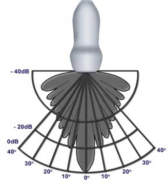

* 第一旁瓣与主瓣差-20dB，以最大值归一化

* 通过一阶柱贝塞尔函数的0点，可以估计声压幅值为0的位置，进而求出主瓣的半径为
  $$
  \theta_0 = 2\arcsin\left( \frac{0.61\lambda}{a} \right)
  $$

波瓣图反映

* 频率越高，主瓣越窄，旁瓣个数越多
* 圆片面积越大，主瓣越窄
* $\theta_0$定义为主瓣的方向锐度角
* 有时也用半功率面来划分主瓣，就是做一个-3dB的面

## 13 脉冲回波检测系统的原理及应用

### 13.1 脉冲回波检测的原理

检测一般都是脉冲波

**脉冲宽度对纵向分辨率的影响**

脉冲宽度$T$与频域上的带宽$B$成反比，即$TB=1$，纵向分辨率
$$
\Delta r = \frac{cT}{2} = \frac{c}{2B}
$$

**同步**

将发射信号在时间上对齐

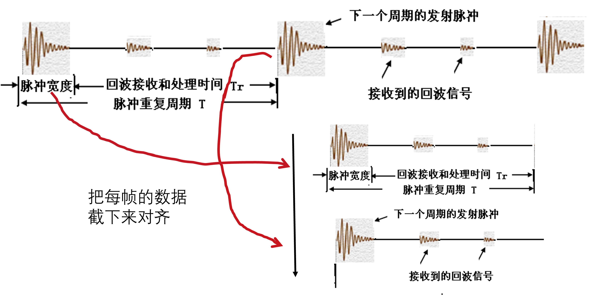

将每一个周期对齐，在平移换能器时，这样操作可以显示2D信息

**成像的基本假设**

* 声速是一个常数，不会改变
* 声束直线传播

这会带来两个问题，第一个是折射伪影，见4.3.3节；第二个是线性界面扭曲，由介质间声速的变化导致

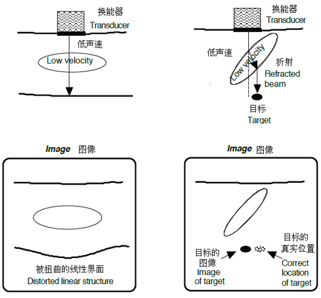

**衰减补偿**

需要设计一个深度补偿电路，让回波波幅仅与介质的反射系数（声阻抗率差异）有关

### 13.2 A型超声

Amplitude

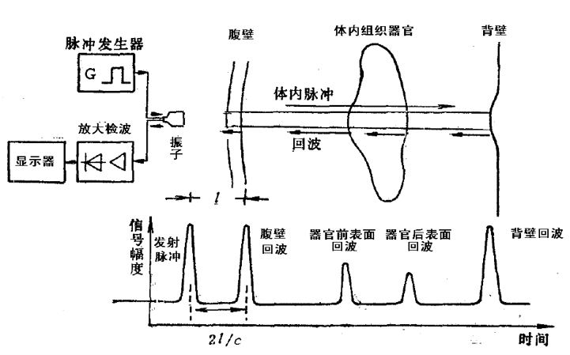

A超只有一维的信息，根据回波的振幅进行介质判断；注意横轴是时间

### 13.3 B、M型超声

Brightness，Motion

**B超原理**

基本原理与A超类似，将回波波幅转化为点的亮度，并水平移动

水平移动是机械移动，也可以用电子扫描（相控）

**M超原理**

基本原理与A超类似，将回波波幅转化为点的亮度，在时间上移动

横轴是时间坐标，沿时间展开显示变化

**三种超声的图像**

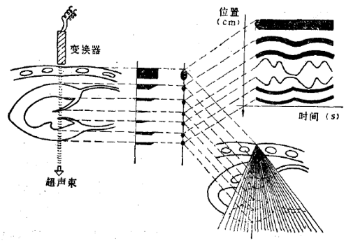

具体哪种自己看

### 13.4 C、F、P型超声

**C超**：A超是纵向，而C超是固定深度的截面的信息

**F超**：任意深度截面的信息

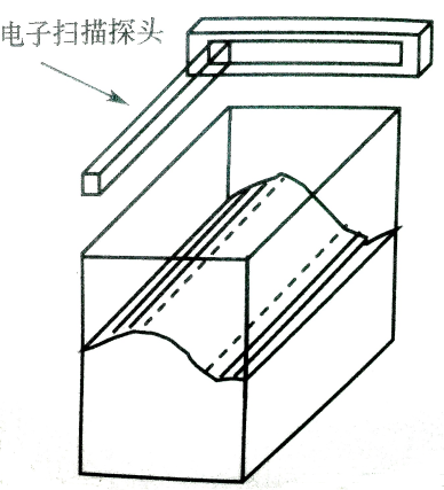

**P超**：位于内窥镜内，一种特殊的B超，可以在血管等位置进行检查

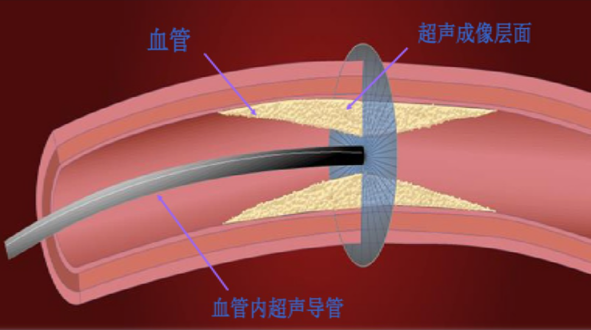

### 13.5 其他超声系统

**超声CT**：原理与CT相同，也是透射法，但是用的是声衰减系数；相比CT，没有放射线伤害，但是分辨能力弱

**超声波全息术**：全息成像，通过反射或透射某一断面的超声振幅和相位，声场分布等，用光学方法重建图像

## 14 数字B超的原理及关键技术

### 14.1 关键参数

**分辨率**：单位是mm

纵向分辨率：脉冲频率（衍射），脉冲宽度（时间差），振铃效应（阻尼不够），被测物移动，接收增益

横向分辨率：声束直径，聚焦特性，显示器件，频率（主瓣宽度）

**工作频率和脉冲重复频率(PRF)**

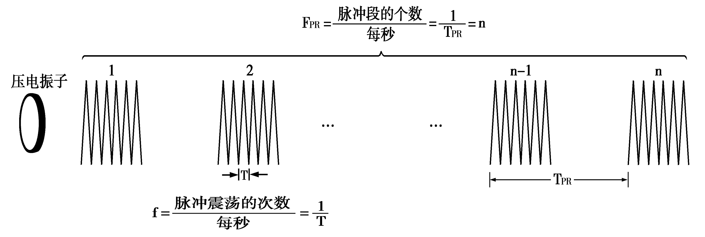

PRF越大，探测深度越小，因为能够不被干扰的传播时间少了

**脉冲宽度和振铃**

脉冲宽度指脉冲从产生到截止的时间长度，不能太小，受探测深度和接收带宽的限制

振铃：阻尼不够产生的，越短越好

**帧频**

完成一幅图像需要的时间的倒数，记为Fve
$$
Fve = \frac{c}{2DN}
$$
其中$c,D,N$分别是声速，每条扫描线能达到的最大深度，扫描线数目

### 14.2 多元线阵换能器的结构与功能

**电子线阵超声探头**

* 开关控制器：一个译码器，使得探头和主机的连线减少

* 阻尼垫衬：阻抗率与晶片接近，减少反射；声波衰减系数大，吸收背向信号；会降低发射效率，对于收发一体的降低灵敏度

* 换能器阵列：压电材料制成的线性换能器阵

  * 阵元数量：多，主瓣窄，横向分辨率高，但是探头变大

  * 阵元厚度：见9.3.4节

  * 单个阵元面积：

    * 辐射强度：窄，辐射弱
    * 主瓣扩散角：宽，扩散角好
    * 栅瓣：阵元中心间距$d<0.5\lambda$时可以消除

    综合考虑：单个阵元宽:厚 < 0.6

  * 开槽深度：开槽深互耦少，浅则干扰大，分辨率低

  
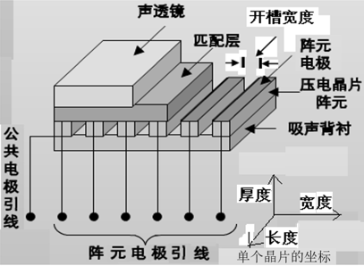

* 声学匹配层：声透镜同时与振元和人体接触，具体见三层结构

* 透镜作用：一般不用凹透镜，因为难以与人体接触，用反转材料的凸透镜

### 14.3 扫描技术

分为机械扫描和电子扫描；主要的扫描方式为线扫和扇扫

每次将相邻的m个阵元一起扫描，若总共n个阵元，一共产生N = n-m+1个扫描线，扫描线在激活的阵元的中轴

为什么m个一起扫，见14.2节

缺点：帧频低；扫描线减少

**交错扫描**：扫描线增加一倍，但干扰变多

**飞跃扫描**：扫描线N不变，降低前后两次扫描束的干扰

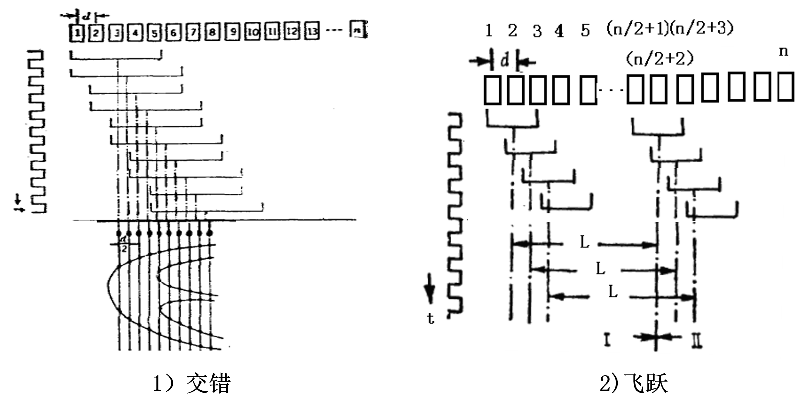

**扇扫**：按扇形来扫描，尾端不动；适用于心脏

**线扫**：平行移动；适用于观察腹部脏器

### 14.4 数字B超的架构和DSC技术

DSC: Digital Scan Converter，数字扫描变换器

工作原理

* A/D转换
* 波束形成：对采样信号进行延时加权，见11.4节，以达到动态聚焦的目的
* 前处理：对波束形成二次采样，图像预处理和TCG等
* 帧存储器：DSC的核心，用来存储扇形扫描的超声图像
* 像素地址逻辑单元：DSC的核心，进行空间变换（极坐标变直角坐标）
* D/A转换

**回声的动态范围压缩和扩展**

回声的范围很大，需要对信号预处理做非线性变换，采样小信号和大信号

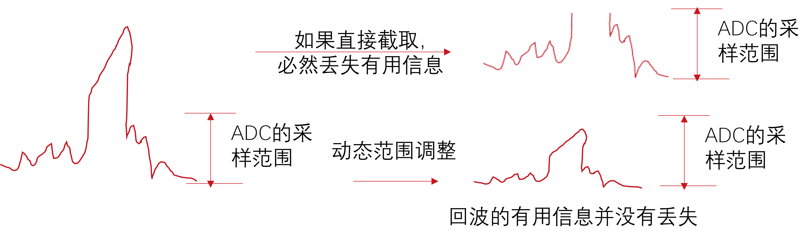

**AD转化**

采样，量化和编码

**前处理**

* 二次采样：做下采样，减少数据量
* 平滑处理，滤过高频噪声
* TCG等

**坐标变换和帧存储**

见14.4节

**后处理**

* 图像插补后处理：扫描线在比较深的地方空隙大，会产生没有回声的区域，需要插值处理

  
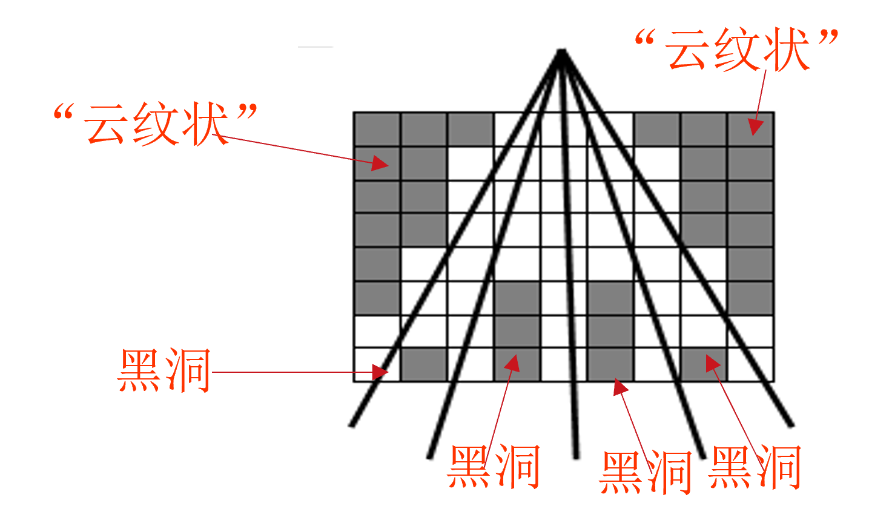

* 灰阶处理：也就是回波强度映射为灰度

* γ变化矫正亮度

* 帧相关：几帧的均值作为输出，就是一个均值低通滤波，消除白噪声；这个可以参考 cv2.fastNlMeansDenoisingMulti()

## 15 临床B超图像及诊断基础

### 15.1 人体组织器官B超图像特点

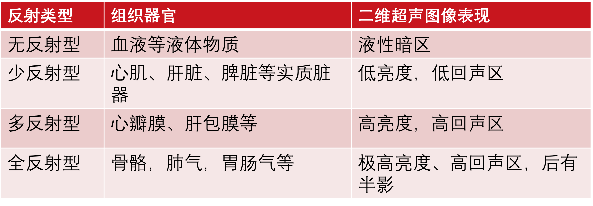

### 15.2 异常组织的超声图像差异

**异常亮区**

* 光团：肿瘤/结石
* 光点：细小结石，钙化及纤维结节
* 光斑：炎症，融合的肿瘤组织
* 光带：韧带，重叠的血管壁或脏器包膜，也可能是钙化

**异常暗区**

* 囊性暗区：血肿，脓肿，囊肿
* 实质性暗区：早期肿瘤

**异常回声环和结中结**

* 弱回声环：多见于肝病占位病变，肿块膨胀性生长，压缩四周组织
* 强回声环：肿块边界
* 结中结：肿瘤增殖周期

**结石，囊肿，癌灶的远场回声图特点**

* 结石：强的回声光团
* 囊肿：后场回声强，全部透过囊肿
* 癌灶：低回声

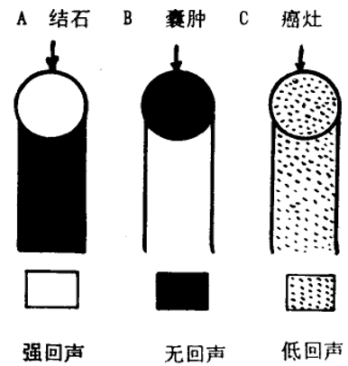

### 15.3 临床超声诊断

**探查方法**

* 直接探查：探头与体表直接接触，有耦合剂，这是探查较深的组织用的
* 间接探查：探头与被测物间隔1.5cm以内时常常看不到被测物的回波，需要用不漏水的圆筒内盛水，将探头放入其中离体表1.5cm进行探测

### 15.4 附加

关注脐带绕颈次数的判断

## 16 B超中的伪影及图像处理基础

### 16.1 超声伪影成因

超声成像仪器的假设条件

* 组织之间的声速不变
* 声束沿直线传播
* 反射回的声波仅经过一次反射（从超声脉冲发射到声信号返回到换能器的时间，与该界面到换能器的距离直接相关）
* 声能在组织内的衰减系数是均一的
* 所有回声信号默认来自声束中轴（旁瓣伪影的成因）
* 回声强度与反射面的阻抗率差相关，不与组织成分直接相关

### 16.2 伪影形成机制

**回声失落**

见4.3.3节

**边缘折射声影**

常常出现在球形病灶的两个侧面边缘，由于声折射回波无法传回导致

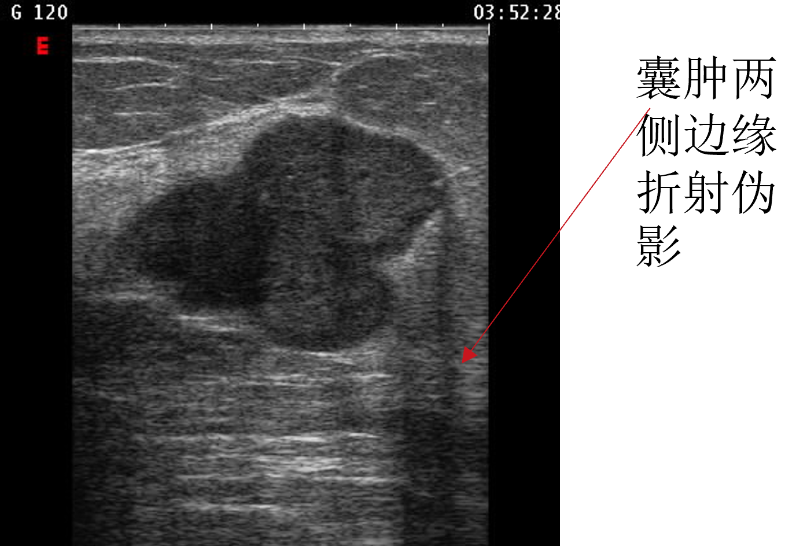

**衍射声影抵消**

在衍射发生的后方，会产生一个亮斑

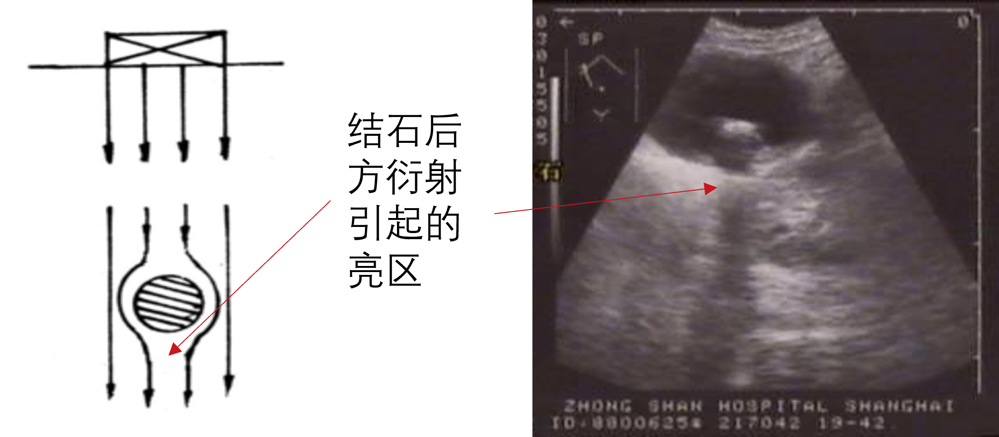

**镜像伪影**

在一个强反射面，声束经过反射后产生伪影；因为直线传播的假设导致的伪影

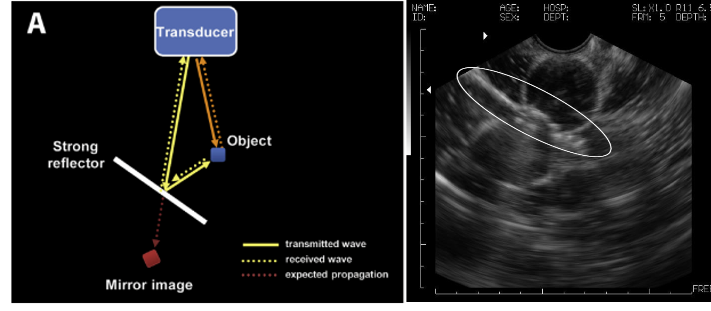

**旁瓣伪影**

如果旁瓣的能量够强，能够成像，但是默认只有主瓣成像，那么在主瓣当前方向就会产生伪影

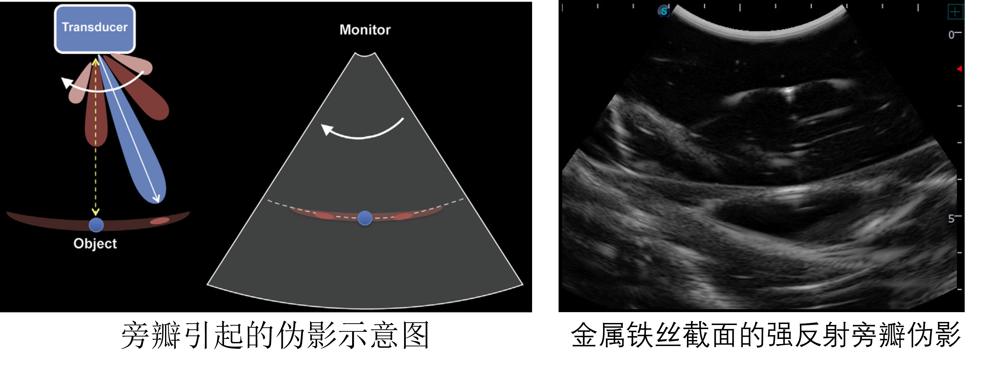

上面会产生四个伪影

**部分容积效应**

声束的宽度不可忽略，如果有小于切片厚度的病灶被切割，则图上表现为既有病灶又有周围区的重叠回声图

**亮度增益调节不当**

增益太大，使弱回声区亮度太大；太小，会使得图像太暗

**衰减伪影**

声束经过强反射/吸收/衰减面后强度大大减弱，这会导致在反射面之后的病灶不容易被发现

**混响效应**

在强反射界面之间多次反射的声波会被认为是多层

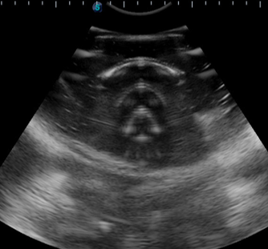

### 16.3 B超图像噪声特点和去噪算法

主要是乘性噪声
$$
g(x,y) = f(x,y)\cdot m(x,y)+\eta(x,y)
$$
其中$m(x,y)$表示系统的乘性散斑噪声，乘性噪声一般由信道不理想引起，它们与信号的关系是相乘；由系统的时变性（如衰落或者多普勒）或者非线性所造成的

使用中值滤波进行去噪，散斑噪声服从瑞利分布

### 16.4 图像增强算法

* 直方图均衡化/规定化，但这里的名称是直方图修整法
* 频域滤波

## 17 多普勒彩超原理和应用

### 17.1 原理

$$
f  = \frac{v+v_r}{v-v_s}f_0
$$

当相互靠近时

具体的测量公式推导见医学物理导论11.1节，下面直接给出
$$
\Delta f = -\frac{v}{c}(\cos\phi_i + \cos\phi_r)f_0
$$
其中$v,c$分别是血液流速和声速；不能垂直测，一般测量中$\phi_i = \phi_r$

### 17.2 超声多普勒成像系统

**连续超声多普勒成像仪**

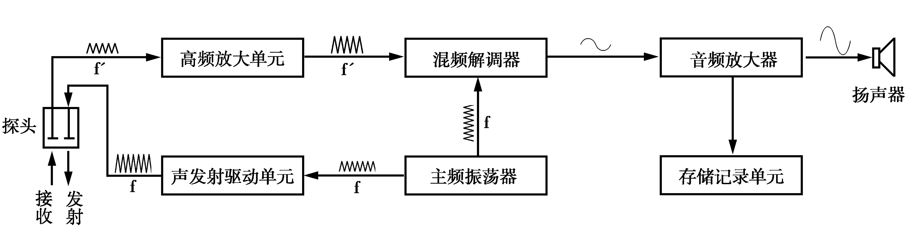

缺点：所有运动目标产生的信号混合在一起，没有辨识深度的信息

改进：收发分离；声束交叉域法

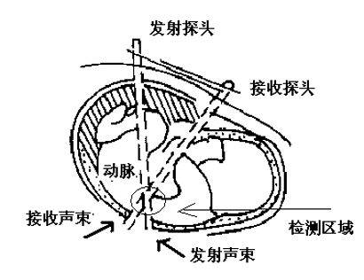

**脉冲式**

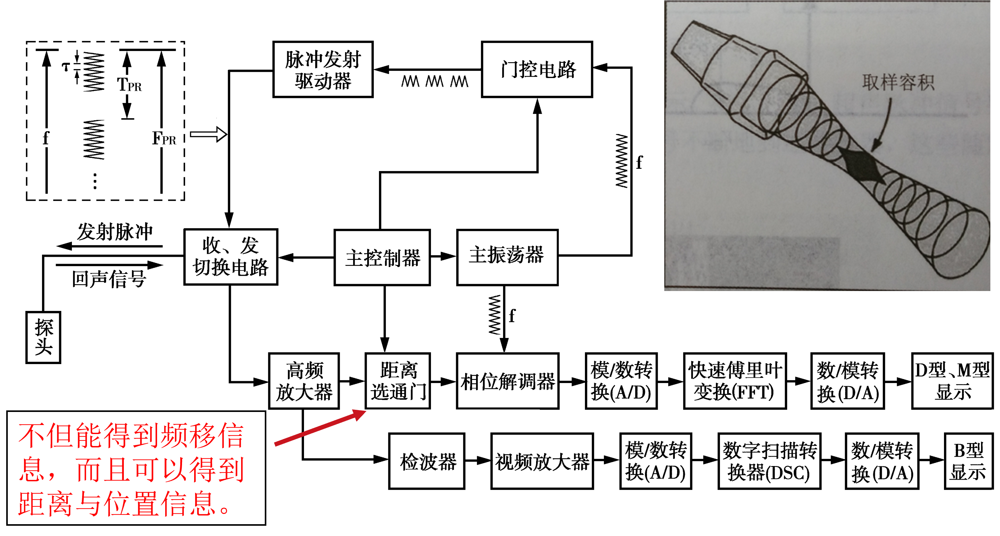

多了一个距离选通门

### 17.3 图谱解读

**血流运动状态的彩色显示方法**

一般而言都是红色正向（靠近），蓝色背向（远离），这和物理上的红移蓝移相反

颜色越亮，速度越快

湍流用绿色，表示流速方差的大小

扇形探头会有这个问题

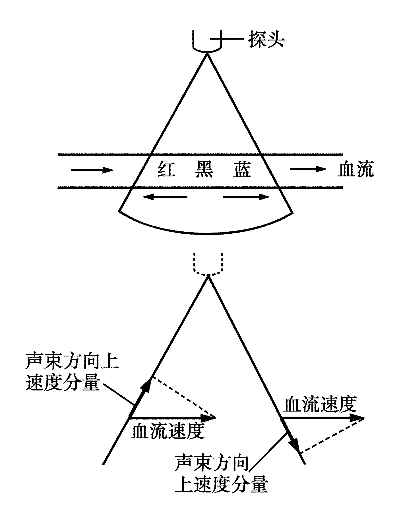

将在视野内的血液称为取样容积，回波信号越大，这个信号区间显示出来更亮，说明更多血细胞流速在这个区间内

为了准确显示频移大小和方向，PRF必须大于多普勒频移的两倍，由采样定理可知

### 17.4 多普勒血液测量信号处理

**回波频率成分**

是一个频带，需要进行调制解调

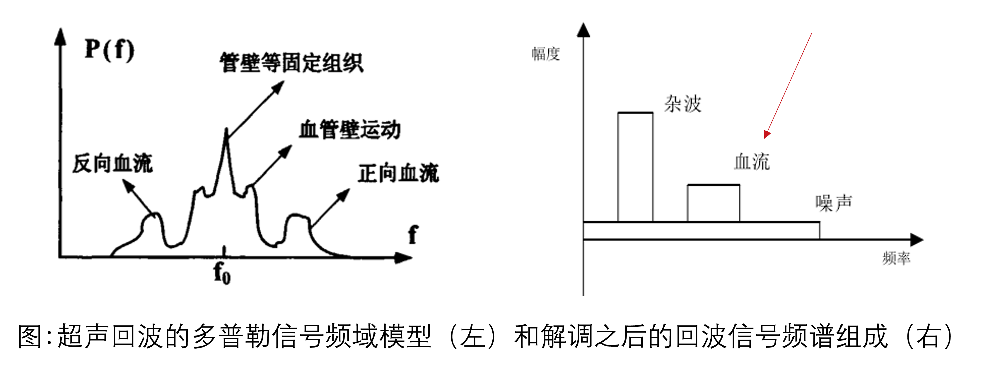

在频谱搬移后，先低通得到多普勒频移，再用壁滤波器消除低频杂波，是一个高通滤波器

信号处理流程如下

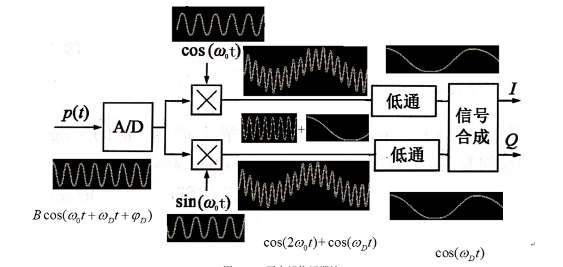

变化的频率是远小于超声频率的，分离信号后用低通过滤出来，然后用时域自相关法进行频率估计

时域自相关法：估算某一信号在不同时刻的相位差，由此获得信号的平均频率，进而推算出多普勒频移的频率

## 18 高频超声

10MHz以上称为高频超声，频率越高，分辨率越高，但是检查深度越浅

### 18.1 临床应用

* 浅表血管
* 肌腱和跟腱
* 韧带的高频超声检测
* 乳腺高频超声诊断
* 活体眼前节结构检测

### 18.2 超声显微镜特点与原理

**特点**

利用声阻抗率差来成像，被测物体不需要透光，一般用100MHz-300MHz的声波

* 分辨率不及电镜，结构和操作比光镜复杂
* 图像具有一定立体感
* 细小部分的分辨率不及光镜；分辨率一般微米级
* 可以观察不透光的物体；可以用于活体

一般用的是C型超声，因为高频超声的穿透性太差

**原理**

* 透镜：需要声透镜聚焦，由于高频衰减大，声透镜一般用短焦距的
* 工作环境：是水，因为衰减大，且水与大部分物质浸润，利于声耦合
* 聚焦声束机械扫描声镜SAM：就是上面的
* 扫描激光声学显微镜SLAM：不聚焦声波，使用平面换能器，产生平面波

## 19 超声检测的最新方向

### 19.1 超声弹性成像

**优势**

一般超声使用声阻抗率差进行成像，但是癌症组织和正常组织的声阻抗率相差很小，需要用其他参数成像

弹性成像使用组织之间的弹性系数之差进行成像

**原理**

弹性可以通过组织变形能力来衡量，向组织施加恒定的压力，根据回波信号来计算应变

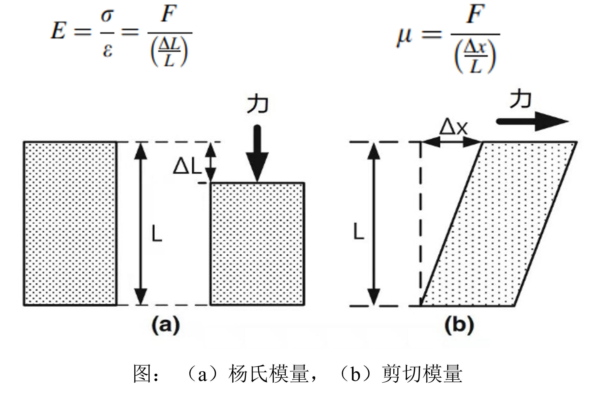

**力的来源**

* 人工按压
* 外加机械压力
* 超声脉冲的声辐射压力

还可以用超声的非线性产生平面剪切波，见6.4节

### 19.2 脉冲反转成像

用于增强超声对造影剂的敏感性

一次发射两个脉冲，第二个脉冲是第一个的相位反转，当换能器分别检测到这两个脉冲的回波时，将它们叠加

正常组织的回波叠加没有畸变，是一条直线；微泡等的回波存在畸变，时间上不是直线

## 20 超声治疗的最新方向

### 20.1 超声治疗

**生物效益和机理**

见8.1节

### 20.2 超声碎石

以机械效应为主，但是有空化和热效应

**结石**

按化学成分：钙结石，不含钙结石

不含钙也称为阴性结石，包括感染结石、尿酸结石、胱氨酸结石等

阴性结石超声可以检测，X光不能识别

从原理上讲，主要有四个技术要点

* 冲击波的产生技术。
* 冲击波的聚焦技术。
* 波源与人体的耦合技术。
* 冲击波焦点的定位技术。

**冲击波结石破坏方法**

超声照射在结石等硬组织上时产生的力大于照射正常弹性组织

冲击波的波形是不对称的，有特殊要求

**聚焦方式**

* 半椭球面反射聚焦
* 球面发射聚焦（自聚焦）
* 抛物面反射聚焦
* 声透镜聚焦冲击波源

### 20.3 经颅超声刺激

**机理**

* 增强/抑制神经活动的效果
* 有效调节大脑神经元的兴奋性
* 达到功能性脑刺激效果
* 脑神经康复

功率/声强不能太大

频率不能太大，高频超声衰减大，主要是颅骨，这个地方的衰减很大；比HIFU低

### 20.4 其他

超声手术刀还有止血的功能

## 21 HIFU的原理和临床应用

### 21.1 原理

在低MHz的超声频段，用聚焦技术使焦点处的声强达到$10^3 \sim 10^4$W/cm$^2$，在$0.5\sim 5$s内使靶组织温度上升到60℃以上，急性热坏死

实际使用中，焦点呈枣核状，需要移动焦点来完全照射肿瘤组织

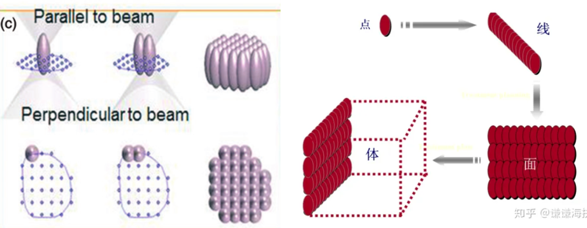

焦区与非焦区的边界通常有10多个细胞尺寸

**系统组成**

* 操控台
* 引导系统，如诊断B超
* 主机及治疗聚焦探头
* 治疗床
* 水循环系统等

### 21.2 测温引导技术

HIFU系统存在水循环系统，有两个用途

* 水中超声衰减小
* 给人体降温，防止损伤正常组织

水循环系统需要使用除气水，防止水中的气泡干扰声束传播路径

需要使用B超进行引导测温，探头是集成的

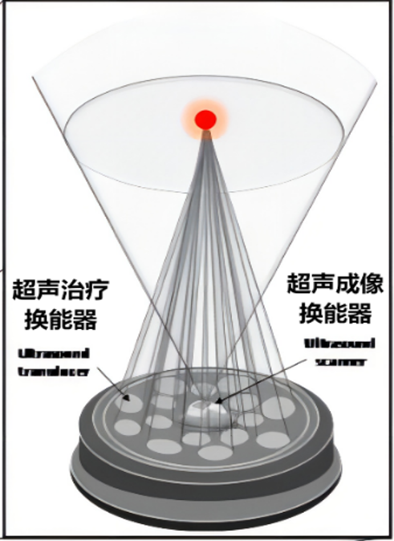

或者使用MRI测温引导

### 21.3 临床应用

主要生物效应

* 热效应，空化效应，机械效应
* 对化疗的增强
* 诱导肿瘤细胞凋亡
* 提高机体免疫机能

用于前列腺增生等、乳腺肿瘤、肝脏肿瘤、骨肉瘤等

肿瘤还是优先切除，而不是HIFU

### 21.4 综合评价

**优势**

* 温度高升温快
* 精确度高
* 超声刀治疗肿瘤的无创性
* 适用症广泛、治疗肿瘤体积大
* 与化疗协同
* 降低肿瘤的复发与转移

**局限**

* 难以完全杀死靶区癌细胞
* 脏器的运动和影像学限制精确定位
* 无前瞻性实验验证HIFU治疗的有效性
* 含气腔道及骨性组织的影响
* 还没有实时无创测温系统

