# 医学生物信息学

## 1 序列比对

目的：根据序列之间的功能或演化关系，有效地**检测序列之间的相似性**

### 1.1 序列比对评价

序列比对后得到的结果是匹配分数和匹配序列

匹配序列如下
$$
MV-SA\\
|\,\,|\,\,\,\,\,\,\,\,\,\,:\,\,\,.\\
MVHTE
$$
其中"$|$"表示两个序列identical，" "表示一方是空白的，"$:$"表示二者similar，"$.$"表示not similar

这些符号由**替换矩阵**决定，替换矩阵规定了每个残基和其他残基匹配时的分数

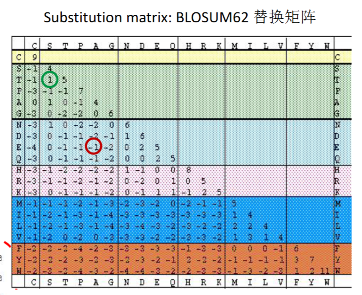

当存在空白时，认为是发生了indel(insertion/deletion)，即一条序列的插入就是另一条序列的删除

空白会带来惩罚，惩罚规则如下

* opening：第一个空位，penalty = d
* extending：后续的空位扩展，penalty = e
* 一般而言$e<d$，因为首次打开一个空位的难度更大
* Penalty = d + (n-1)*e

最终两条序列的匹配总分为
$$
\mathsf{Score} = \sum \mathsf{Substitution\, Scores} -\sum\mathsf{Gap\, Penalty}
$$

### 1.2 全局比对和动态规划

#### 1.2.1 全局比对

全局比对：将输入序列的**所有残基**排列起来，根据评价规则求出**最大的得分**，即最优比对结果

全局比对的思想：**最好的比对 = 前一个最好的比对 + 这个位置的最好比对**

也就是动态规划而非贪心，因为前一项不是$\sum$局部最优

#### 1.2.2 动态规划

Dynamic Programming（DP），写为公式就是

对于$X,Y$两条序列
$$
F(i,j) = \max \begin{cases}
F(i-1,j-1) + s(x_i,y_j)\,\,, x_i 与y_j配对 \\
F(i-1,j) + d\,\,\,,\,\,\,x的第i位是gap\\
F(i,j-1) + d\,\,\,,\,\,\,y的第j位是gap\\
\end{cases}
$$
其中$F(i,j)$是这个序列匹配到$(i,j)$位置时的分数，$s(x_i,y_j)$是$x_i,y_j$匹配时的分数，$d$是gap penalty

表示为图像就是

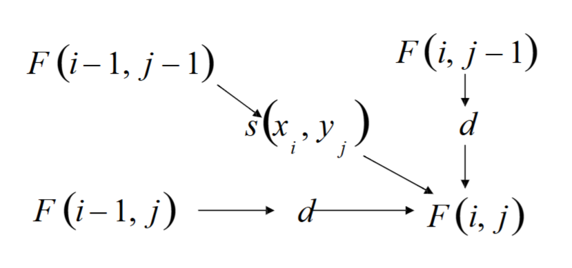

一共有三条路通向下一个，目标是找到能使$F(i,j)$最大的，因此，可以用填空的方式求解

例：假定碱基的空白惩罚为-5，替换矩阵为

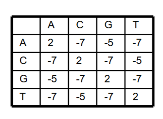

配对序列"AAG"和"AGC"

解：画出这两个序列的表格，其中空白表示gap，箭头表示延伸方向，结果为

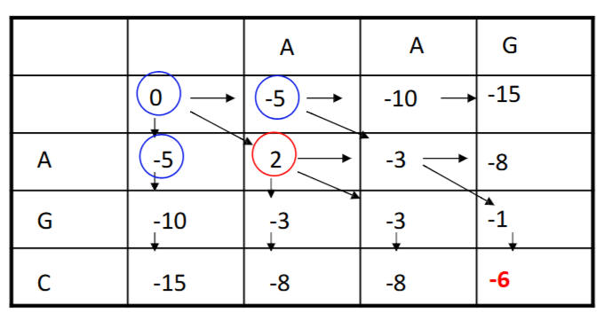

那么就有两条路进行选择：$AAG-\\A-GC$     和      $AAG-\\-AGC$      ;      前者是0,2,-3,-1,-6，后者是0,-5,-3,-1,-6

在画表格时，先计算水平和竖直两个方向会简化计算

在得到最终结果后进行回溯，可以得到序列

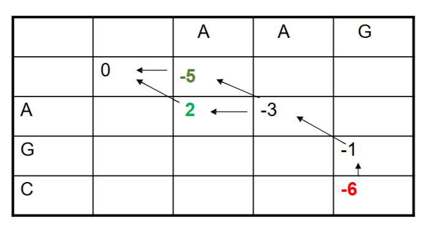

#### 1.2.3 从全局到局部

全局比对是在全局范围内的最优数学解，但是这个算法忽略了生物学上的问题，即

* 所有片段的**重要性**不尽相同
* 占基因很大的**内含子不表达**，比对这一部分无意义

因此，使用优化后的局部比对算法，公式为
$$
F(i,j) = \max \begin{cases}
F(i-1,j-1) + s(x_i,y_j)\,\,, x_i 与y_j配对 \\
F(i-1,j) + d\,\,\,,\,\,\,x的第i位是gap\\
F(i,j-1) + d\,\,\,,\,\,\,y的第j位是gap\\
0						\,\,\,\,,\,\,\,\,\mathsf{BeginAgain}
\end{cases}
$$
即当某一步出现了负值时，将其认为新的序列的开始，效果上，就是

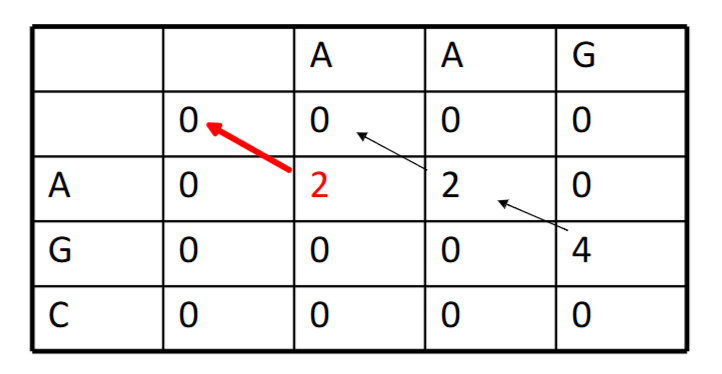

最优序列是：$AG\\AG$      ；    次优序列是：$A\\A$

与全局比对相比，局部比对的效果更能反映生物学关系

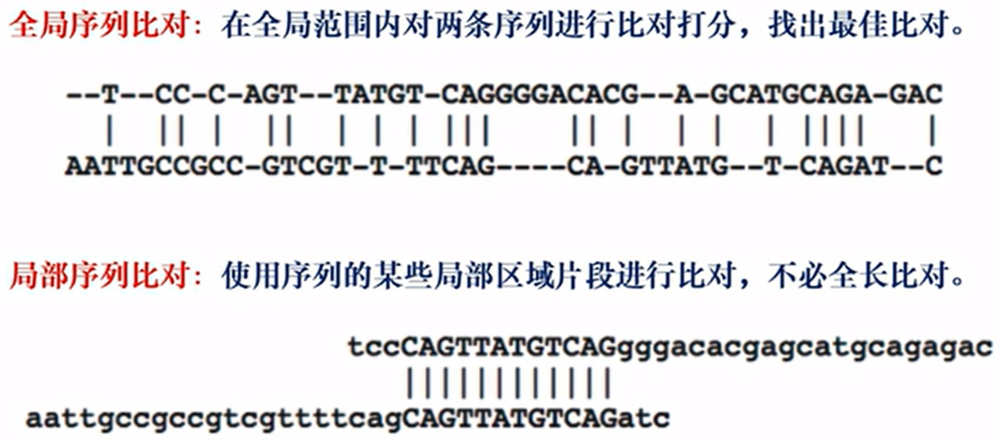

#### 1.2.4 BLAST

将一个DNA片段在基因库中进行比对时，如果总是指向上面的DP算法，将会非常耗时

可以预见，**匹配的基因只会出现在表格的主对角线附近**，那么只需要在网格的**主对角线两侧有限区域**内进行评分，将大大减少时间而不减少准确度

### 1.3 马尔可夫模型

马尔可夫模型用来模拟**伪随机**变化的系统

#### 1.3.1 马尔可夫模型

以天气变化为例，下面是天气变化的**马尔科夫链**

概率都是条件概率，那么可以写出**状态转移概率矩阵**和初始概率分布

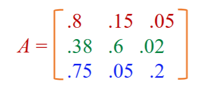

$$
\pi =(0.7, 0.25, 0.05)
$$

注意每一**行**之和都是1，而每一**列**不一定

下面给出定义：

马尔可夫链描述一个**连续的离散随机过程**，即一种状态的序列的变化
$$
\{q_1,q_2,\ldots,q_k\}
$$
其中$q_i$一定属于状态
$$
\{S_1, S_2,\ldots,S_n\}
$$
中的某一个，状态之间的转移概率
$$
a_{ij} = P(q_t=S_j| q_{t-1}=S_i)
$$
构成的矩阵就是状态转移概率矩阵，显然这**不是对称阵**

给定的初始概率分布记为
$$
\pi = P[q_0 = S_i]
$$

对于天气变化序列

给出概率，为
$$
P(O) = 0.7 * 0.15 * 0.6 * 0.6 * 0.02 * 0.2
$$

#### 1.3.2 在序列比对中的作用

假定序列比对存在以下状态

* M：Match，即配对，不必须identical
* X：在X链发生了一次插入，即X链的A配对了Y链的Gap
* Y：相反，在Y链的B配对了X链的Gap

给出马尔科夫链

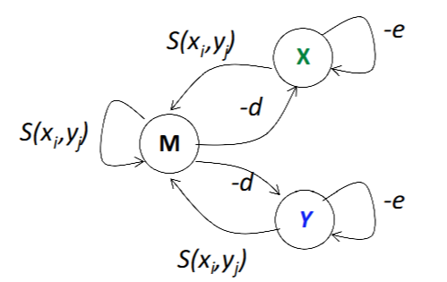

为什么X与Y之间没有转移？

在序列对比中，形如$A-\\-B$的配对是不允许的，即Gap Closing一定会到Match，而不会在对面新开一个

根据惩罚给出发生的概率

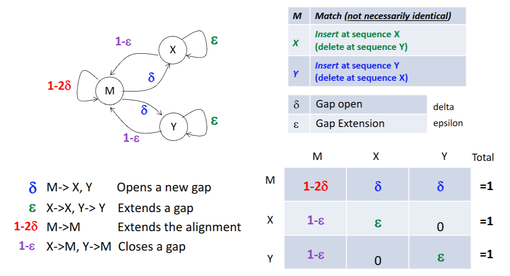

#### 1.3.3 隐马尔可夫模型

状态路径无法预测，但是有观测结果可以反映状态变化

隐马尔科夫模型可以解决三大问题

* 评估：计算在给定模型下观测序列出现的概率，反推最可能的过程
* 模型学习
* 解码/预测问题

以天气为例，首先知道天气的状态转移概率矩阵和初始状态概率，也知道天气对人的穿着的影响的**生成概率矩阵**

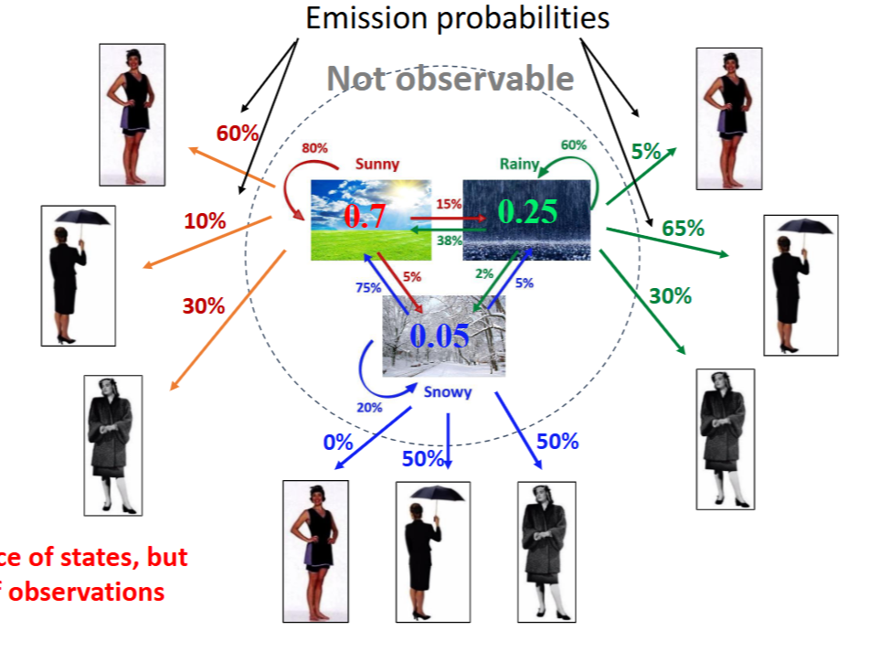

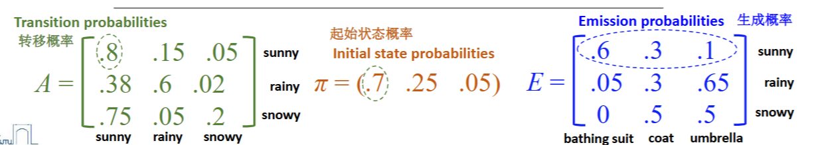

给定一组观测结果：coat，coat，umbrella，umbrella，bathing suit，umbrella，umbrella

那么根据全概率公式和贝叶斯公式，有
$$
P(O) = \sum P(O|Q_i)P(Q_i) = \sum P(O|q_1,q_2,\ldots,q_k)P(q_1,q_2,\ldots,q_k)\\
=\Pi P(o_i|q_1,q_2,\ldots,q_k)P(q_1,q_2,\ldots,q_k)
$$
在这组观测结果下，当条件为全晴天时的概率为
$$
P(O|q_1\sim q_7 =sunny)P(q_1\sim q_7) = (0.7*0.8^6)*(0.3*0.3*0.1*0.1*0.6*0.1*0.1)
$$
当然，使用前提后一天状态仅受前一天影响

#### 1.3.4 隐马尔科夫预测模型

使用隐马尔科夫模型来预测一段基因序列是否为编码区/非编码区，给出转移概率矩阵和生成概率矩阵

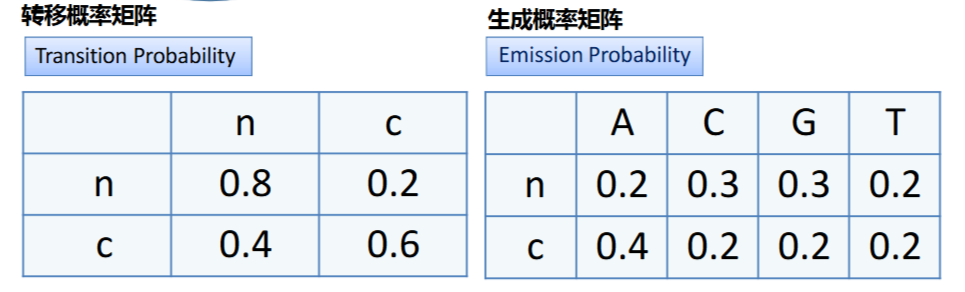

其中n为non-coding area。在有了矩阵之后，根据给定的序列，求其生成概率最大的可能
$$
S = \mathsf{arg max} P(S|X)
$$
利用动态规划的思想，那么
$$
P_{coding}(i+1) = e_{coding}(x+1) \max\{P_k(i)p_{k\rightarrow coding}\}
$$
其中$k\in\{coding, non-coding\}$，是转移概率；对于non-coding的概率，同理，不赘述

上面的计算会造成大量的乘法计算，对于计算机而言很慢，使用对数变为加法，那么新的矩阵就是

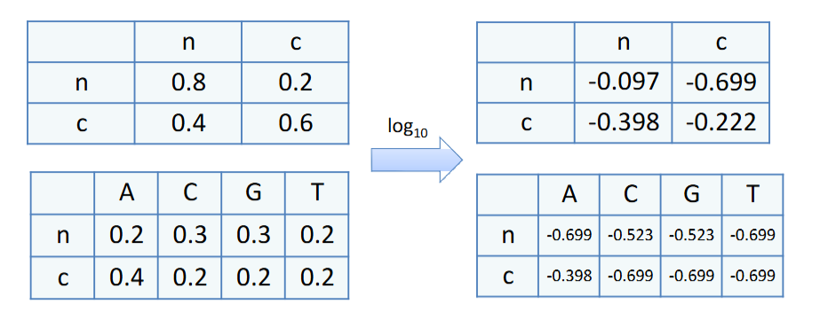

列出表格，进行填充；与全局/局部比对不同，此时没有竖直方向的箭头

假设初始概率$\pi(P(N)=0.7, P(C)=0.3)$，那么对数化后就是$-0.155, -0.523$

对于序列`CG`，表格为

|            |           C            |              G               |
| :--------: | :--------------------: | :--------------------------: |
| non-coding | -0.155+(-0.523)=-0.678 | -0.678+(-0.097-0.523)=-1.298 |
|   coding   | -0.523+(-0.699)=-1.222 | -0.678+(-0.699-0.699)=-2.076 |

最大概率是`CG`均为非编码区

例：判断一阶HMM是否在以下场景适用

* 通过股票价格波动推断市场情绪
  * 可以，隐藏状态是市场情绪，观测值是价格、交易量等；局限：短期有效
* 通过笔迹轨迹识别书写字符
  * 可以，隐藏状态是字符，观测值是笔迹的轨迹；字符独立，符合HMM假设
* 预测十年后平均温度
  * 不行，长期依赖不能预测
* 自动驾驶根据传感器数据规划路径
  * 不行，HMM离散状态假设不正确
* 根据脑电信号对癫痫发作预测
  * 分两类：适用：通过脑电推测电线前期状态；不适用：脑电信号可以划分地更简单，用分类模型就行
* 通过传感器振动信号推断设备健康状态
  * 可以，隐藏状态是设备状态，观测值是传感器信号；HMM模型广泛用于状态退化建模
* 通过视频帧序列推断人体动作
  * 不行，一阶不行

### 1.4 多序列比对

#### 1.4.1 用途

* 进化分析：鉴定物种的同源性，建立系统发育树，测试进化模型
* 功能分析：在蛋白质对比中鉴定保守区域，鉴定蛋白质家族
* 结构分析：识别序列的共同变化，用于同源性建模
* 鉴定保守的引物结合位点，用于突变分析的诱变实验等

下面的例子展示了蛋白质的保守性质

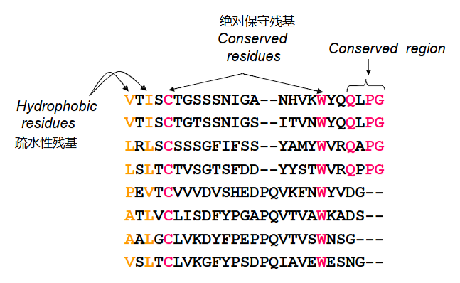

#### 1.4.2 比对方法

**比对和 打分法**：Sum-of-pairs scoring

将序列两两进行比对，累和所有的分数，一共对比$C_n^2$次

**渐进式比对**

用于已经归类的子组之间的比对，组间序列顺序不可变，Gap只能加不能减

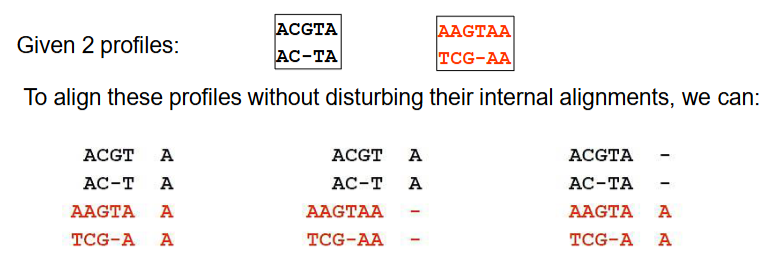

**Clustal**

采用全局序列比对法进行所有序列的两两比对，构建距离矩阵（即差异性矩阵），矩阵用于聚类算法的分析

#### 1.4.3 DNA vs Protein

哪个对比更有说服力？蛋白质

因为DNA/核酸只有4种碱基，其变化更少，随机匹配更加不准确，即序列的独特性不足，易匹配错误

而氨基酸的残基有20多种，更难配错

当使用DNA很难匹配时，可以将其翻译为蛋白质进行比对

## 2 DNA测序与突变

### 2.1 基因测序技术简介

**组学**：是研究生物系统中各类分子整体集合的学科，以-omics结尾

* 基因组学、转录组学、蛋白质组学、代谢组学（糖组学、脂类组学）

**一代测序**：多分子，单克隆；桑格测序；高精度检测序列，用于亲子鉴定、法医鉴定等

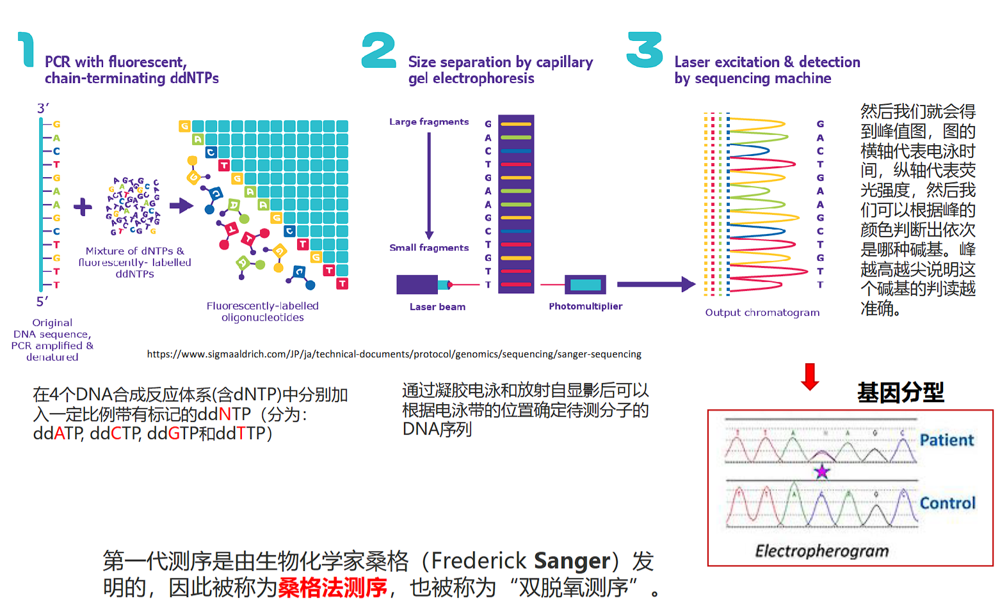

**二代测序**：通量更高，速度更快，成本更低

### 2.2 基因突变

#### 2.2.1 基因突变

同一基因库之间不同个体存在DNA水平差异

* 遗传
* 变异

物种形成和生物进化的基础

**遗传变异来源**

* 父母遗传
* 新发突变
* 体细胞突变

几种对比

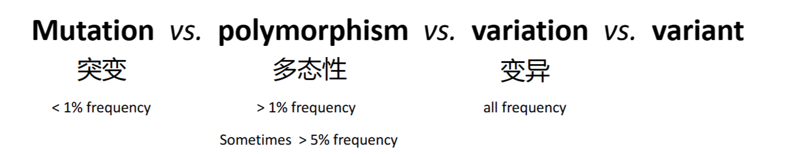

多态性指的是性状不同

健康人基因组存在300万左右的变异

**单位点变异**

* 错义突变(missense mutation)：碱基替换后对应的氨基酸变了
* 无义突变(nonsense mutation)：碱基改变后使的密码子变为终止密码子
* 同义突变(synonymous/silent mutation)：碱基替换后氨基酸没变

单核苷酸多态性(SNP)：平均每300个碱基对就存在一个；SNP的多态性决定了个体差异

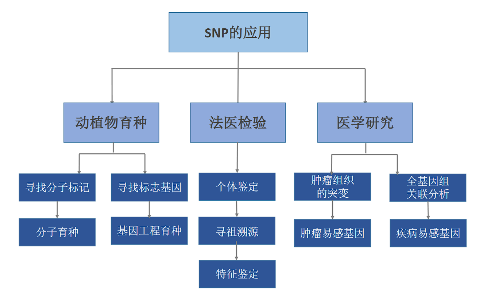

**表型** = 基因型 + 环境

**indels**: insertion or deletion，碱基对的变化

#### 2.2.2 基因测序和突变识别

包括全外显子组测序和全基因组测序

**基因变异识别流程**

* 建库测序
* 质检，数据清洗
* 读数映射
* 变异识别
* 有害突变识别和个性化诊疗

**质检**

得到的结果如下

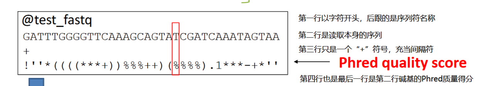

最后一行是质量分数对应的ASCII码对应的字符，其中质量分数(Phred quality score)的计算如下
$$
Q = -10\cdot \lg p
$$
$p$表示测序仪碱基判断错误的概率

当$Q>20$时，认为结果有效；当一个序列$Q<20$的比例达到20%，认为这个序列读错了，要丢弃

例：当一条read的得分不高时

* 不直接使用，因为质量很差
* 若认为是全外显子组，则可能产生假阳性突变识别的结果，影响后续的变异分析
* 当read质量高且覆盖深度不足时，一个read也可能预警潜在突变

**变异识别**

基因序列比对后进行识别

例：TP53基因某位点发生非同义突变，已知是非保守位点

* 这个位置值得关注，因为TP53是典型的肿瘤抑制基因

* 如果是保守区域，那更值得关注。保守区域暗示重要功能，突变更可能破坏关键结构

* 一句话报告：

  该突变为TP53基因非同义变异，位于潜在保守功能区域，建议进行家系分析和功能验证

**临床使用**

读数深度很重要，读了几条就是几，一般要大于三

### 2.3 全基因组关联分析 GWAS

Genome-Wide Association Study，分析比表型组和基因组的关联

使用全基因组阵列收集数据，以便在多个个体中找出基因组中具有/不具有共同特征的共同变异

用高通量基因组技术快速扫描大量受试者的整个基因组，寻找与疾病关联的相关变异；与疾病有关的变异在病例组中的发现频率更大，做统计检验

很显然这需要进行假设检验，这就要看生医统的知识了

整个检验就流程如下

1. 基因型数据准备，表型数据准备
2. 假设检验（统计模型选择）
3. p值计算
4. 绘图，结果解读

假设阳性概率为$p$，$n$个人，那么假阳性概率为
$$
1-(1-p)^n
$$
为了平衡这个概率，需要用人数归一化
$$
\frac{1-(1-p)^n}{n} = \frac{np}{n} = p
$$

那么，对应的显著性水平就从$p<.05$变为$p<\frac{0.05}{n}$

当数据水平是百万个SNP时，$p<5\times10^{-8}$

### 2.4 孟德尔随机化

#### 2.4.1 疾病风险评估

GWAS的p-value确定检验目标是否有统计学意义，但没有解释影响效果大小，即不能解释GWAS的结果

因此，需要一个方法能够评估，存在遗传变异的情况下，患上疾病的风险是多大

**风险评估**

用人群中发病率表示发病的风险，但这种方法对于个体差异没什么意义

**相对风险**

想要知道有某种基因的风险相对没有的人的发病风险，即相对风险，就是两种风险的比值（11% / 9% = 1.2）

但是上面的方法还有一个问题，对于罕见病，人群中的样本数量不足；做常见病倒是可以

**病例对照研究**

在疾病对照研究中，预先确定500个样本的病例组和500个样本的对照组，不能说明发病率为0.5

但是，可以说明患病几率（Odds），Odds = disease : no disease = 1:1

对于所有样本中的基因型比例，可以计算出Odds值

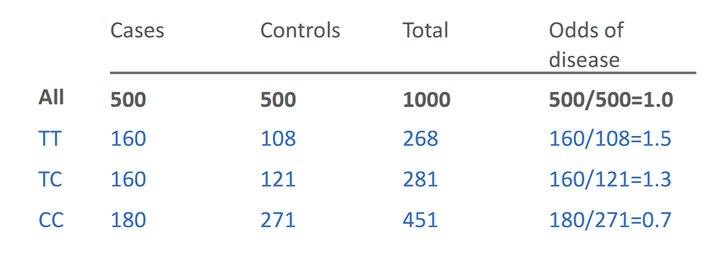

Odds值较大的，说明这种基因型发病概率高

同样可以做相对风险，比值比 Odds ratio = Odds1 : Odds2，例如 TT : CC  = 1.5 : 0.7 = 2.1

#### 2.4.2 孟德尔随机化

一种基于遗传变异的统计方法，评估病因推断的数据分析技巧；MR的目的是明确因果关系

临床上的金标准是RCT（Randomized Control Trial），但是开销大，伦理可能有问题，此时可以用MR

MR的几个关键概念

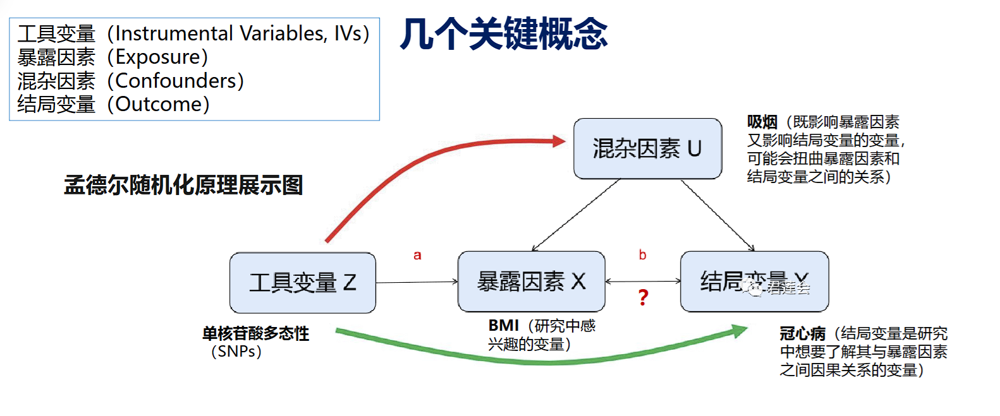

常规的RCT难以进行的原因就是混杂因素导致暴露因素和结局变量因果倒置，或者是伦理问题

为了得到有效的结果，必须满足三个核心假设

* 遗传变异与暴露因素强相关（关联性）
* 遗传变异不能与任何可能的混淆因素相关（独立性）（图像红线不通）
* 遗传变异不能与结果直接相关（排他性）（图中绿线不通）

**两样本MR流程**

* **暴露因素的GWAS**：对暴露因素进行GWAS，识别出与暴露因素相关的显著SNPs（p值小）。
* **结局变量的GWAS**：对结局变量进行GWAS，检查暴露因素相关的SNPs在结局变量中的关联；去除与结局变量显著相关的SNPs，确保工具变量与结局变量没有直接关联。
* **筛选工具变量**：保留那些**与暴露因素显著相关**、**与结局变量无显著直接关联**的SNPs作为工具变量。
* **敏感性分析（可选）**：进行如MR-Egger回归等方法，确认工具变量的排他性条件是否满足。

RCT通过随机分组对抗混杂因素的干扰，用于分组的标准应当满足

* 决定治疗方法
* 与结局没有直接关联
* 独立于混杂因素

而MR借助核心假设确定工具变量，绕开了混杂因素的干扰

MR根据孟德尔第一、二定律（分离定律和自由组合定律），利用基因型作为工具变量

二者对比如下

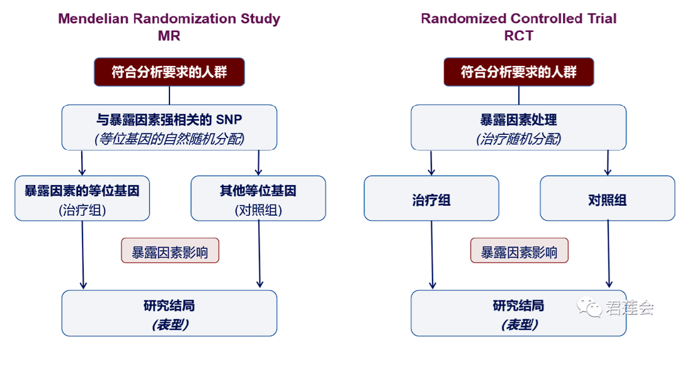

**MR的本质和原理**

* 疾病发展是多基因和多因素共同作用的结果
* 目前GWAS已经有足够的数据，发现了百万的遗传变异与疾病相关联
* 本质是通过遗传数据来评估可改变的非遗传暴露因素所造成的因果效应

**分析流程**

1. 读取GWAS数据，选择合适的工具；一般设置 $p<5\times 10^{-8}$
2. 读取结局变量的GWAS数据，提取变异频率大于1%的单核苷酸变异
3. 数据预处理
4. MR分析SNPs与结局的关系：调包
5. 结果后处理

### 2.5 突变功能注释

对应于2.2.2节的有害突变识别和个性化诊疗

假设：如果突变残基和野生型残基之间的替换分数为正，则为中性突变（很容易发生的损害小）；反之，是有害的（发生很少的损害大）

#### 2.5.1 SIFT

给定一段蛋白质序列和核酸的变异：

1. 首先搜索与待测序列相似的序列，用来提供氨基酸替换的背景；即把同源的蛋白寻找出来
2. 选择1的结果中与查询序列功能最相近的序列，进行多序列比对，确定氨基酸的位置和保守性
3. 根据2的结果，计算所有的替换是正常的可能性，如果<.05，就是有害的；如果>=.05，就是中性的，不影响表型和功能

但是SIFT的效果并不好，原因是只靠保守性假设不靠谱

#### 2.5.2 PolyPhen

依靠序列比对和蛋白质三维结构进行判断，主要假设

* 保守区域的变异影响更大（保守性）
* 发生在蛋白质活跃位点，交互位点或蛋白质的稳定性的变异影响大（功能性）
* 蛋白质的三维结构改变影响很大（结构变化对功能的影响）

步骤和SIFT有点像

1. 多序列比对，计算序列的特征值
2. 获取蛋白质的三维结构，或者预测结构
3. 在一些特定位点上计算变异和分类
4. 使用基于经验的方法进行损害预测

难点在于三维结构的获取；最终打分区间为0-1，分越高越有害

#### 2.5.3 CADD

整合多种功能预测工具的数据，利用支持向量机（SVM）将复杂的注释信息浓缩为单一评分

最终用对数打分，有害前1%打分为20，10%为10，越大越有害

## 3 RNA测序与生物网络分析

RNA测序的目的是为了发现基因的表达差异

### 3.1 RNA测序

属于转录组学的一部分

**转录组测序技术** RNA-seq

将各种RNA测序出来，快速获得某一物种特定器官或组织在某一状态下的几乎所有转录本

广义上指某一生理条件下，细胞内所有转录产物的集合

同一段RNA，经过剪切后可以形成不同功能的RNA，称为可变剪切异构体

由于RNA很不稳定，需要反转录为cDNA进行测序；这个cDNA和转录为RNA的DNA也是不同的，因为RNA会加工

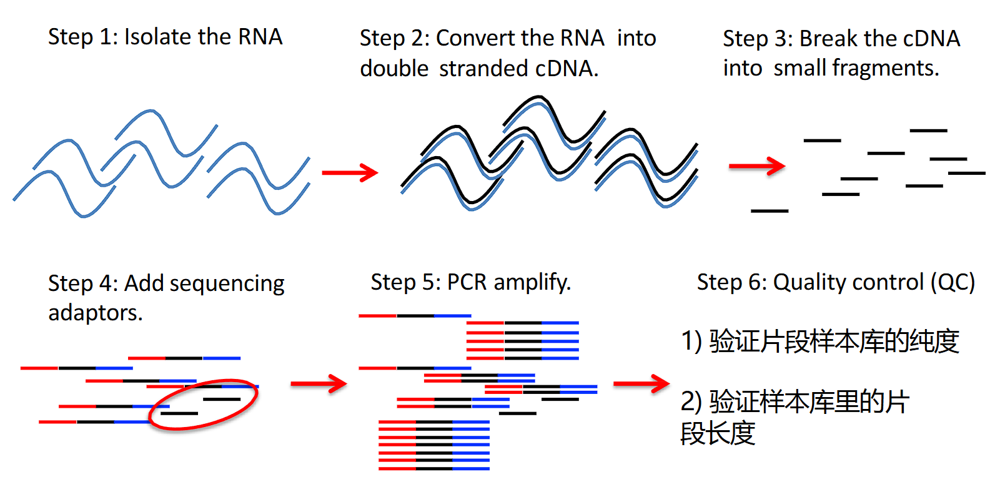

圆圈内的配体没有匹配成功

**表达量计算**

不同数目的RNA进行测序，结果也会不同

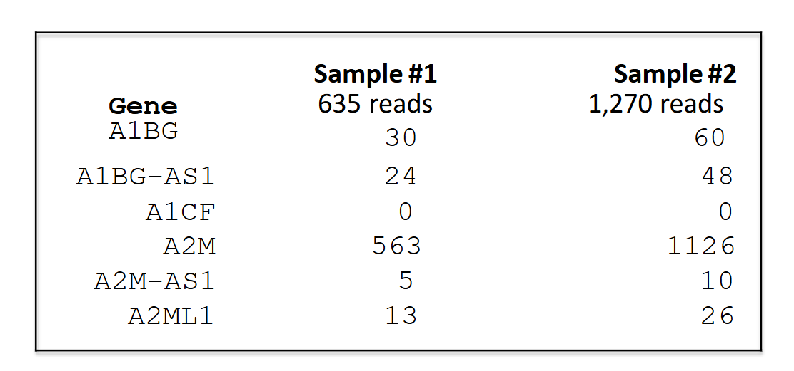

因为sample2的数目更多，测到的表达量也会更大

需要一些量对表达量进行归一化

* 基因长度不同
* 测序深度也不同

根据下面的假设：

* 在随机采样条件下，映射到特定转录本的读数计数与该转录本的丰度成正比
* 映射到转录本的读取数也与转录本的长度和总测序深度成正比例

有下面三种计算方式

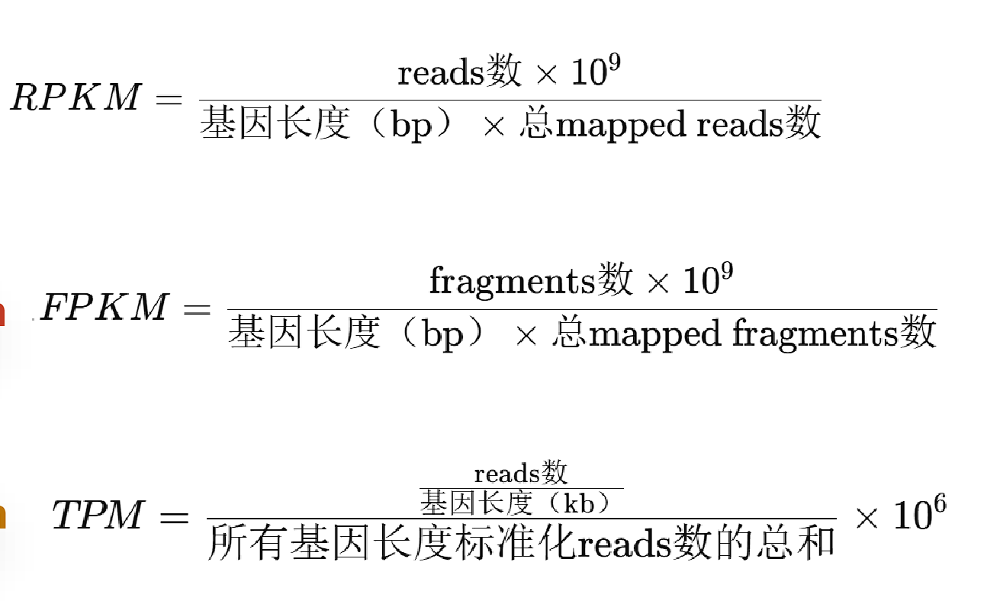

* RPKM：适用于单端测序。基于每百万比对的单端读长的标准化表达值
* FPKM：适用于双端测序（将一对reads视为一个fragment）。对双端测序的改进版RPKM
* TPM ：对RPKM/FPKM进行改进，保证样本内总和为固定值（即每百万转录本）。注重基因间的相对表达量
  由于总和相同，能体现出比对上某个基因的reads比例，可以直接进行样本间比较

**转录组测序项目整体思路**

1. 实验处理：寻找对照组和实验组
2. 整体表达水平分析：整体表达水平分析；整体差异表达分析；差异基因聚类分析；差异基因功能富集
3. 目标基因挖掘：目标基因挖掘，表达分析，功能分析，共表达分析，蛋白相互作用（根据已有研究）
4. 后期验证：表达，定位，功能，其他水平（FPKM，TPM等）

**样本的表达差异**

对两组样本进行RNA测序后进行表达比对

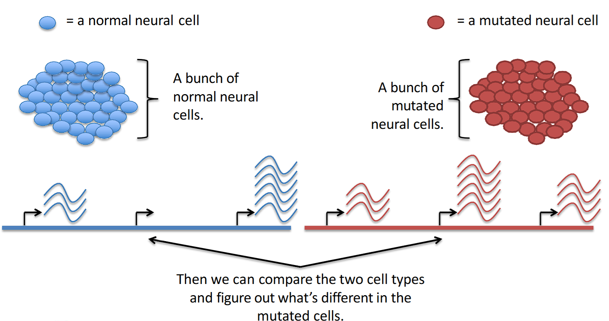

**显著差异基因筛选**

* Fold Change：两个样品中同一基因表达水平的变化倍数，>2为阈值
* q-value：多重假设检验矫正后的p-value，<.05为阈值

需要注意过滤低表达量的基因，否则有假阳性

### 3.2 WGCNA分析

**背景**

利用基因表达和调控方式来构建关系网络

* 基因间互相诱导（转录因子）或遏制（miRNA）另一个基因的表达
* 协调表达，相关的一组基因协调表达

以上两种会导致基因表达量间存在相关性；为了研究基因模块，而不是单一的基因，使用WGCNA

**网络图**

用图表示基因之间的关系，每个点表示一个基因，每条边表示调控关系

节点的度是这个节点的连线个数

**无尺度网络**

特点：大部分节点只和很少节点连接

分为随机网络和无标度网络

**连通性**

* 非权重网络：两个基因的相关性大于某个值认为其有关，且权重相同
* 权重网络：两个基因的相关性完全保留，用相关性表示权重

**WGCNA原理**

Weighted Gen Co-expression Network Analysis

最重要的是加权和共表达，筛除无效信息，缩小范围

**WGCNA过程**

**数据清洗，去除离群值**

* 进行聚类分析，看哪些样本不符合预期（剪枝离群值）
* 需要保证缺失值不能过多

**构建共表达矩阵**

1. 构建相似度矩阵：cor
   * 是中间变量，表示每对基因之间的相关性
   * 用Pearson相关系数表示
   * 选取分布两端5%的相关基因作为候选基因

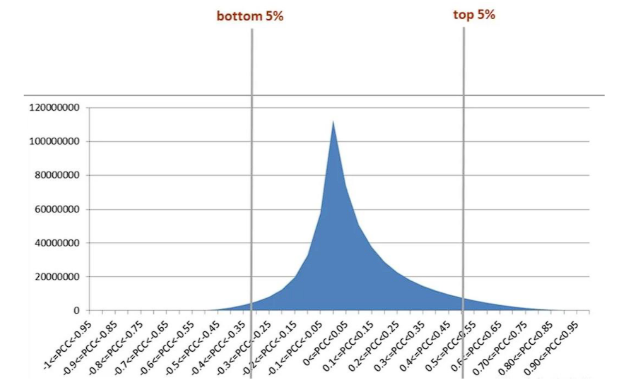

2. 构建邻接矩阵：将相关性转化为连接强度（或权重）：|cor|^β

   * 利用相似度矩阵

   * 使用Jackknife法（K折交叉验证）：每次除去一个样本，重新计算相关系数，得到一组“Leave-One-Out”相关系数，用这些值评估整体相关性的稳定性或平均水平

   * 用soft-thresholding power β进行邻接系数计算
     $$
     a_{i,j} = |cor(x_i, x_j)|^\beta
     $$
     一般用β=6或直接网格搜索寻找超参数

   * 如果要非加权图，那么用一个阈值过滤即可

   * 下图中$R$是拟合优度；过大的power会稀释边缘连接强度，导致模块过小

   
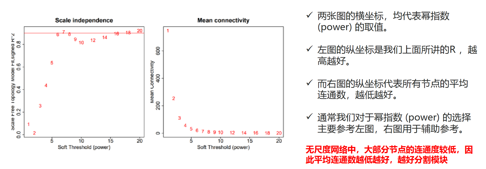

3. 构建拓扑重叠矩阵：TOM

   * 从邻接矩阵计算而来
     $$
     TOM_{i,j} = \frac{\sum_u(a_{i,u}\cdot a_{j,u})+a_{i,j}}{\min(k_i,k_j)+1-a_{i,j}}
     $$
     其中$k$表示节点的度

   * 邻接矩阵只考虑了直接相关性（边的强度），易受噪声干扰

   * TOM考虑了基因对之间是否共享相似的邻居，强调结构上的一致性

   * 越接近1，表面有更多的共同邻居/直接相关性强

   * 意义：

     * 捕捉间接关联
     * 增强网络鲁棒性
     * 模块检测：按拓扑相似性聚类，识别基因模块

   

4. 利用TOM进行聚类：将拓扑相似性转化为距离度量，再通过层次聚类和动态剪枝划分模块：1 - TOM

   * 用1-TOM得到不相似性矩阵
   * 距离越近越容易聚集

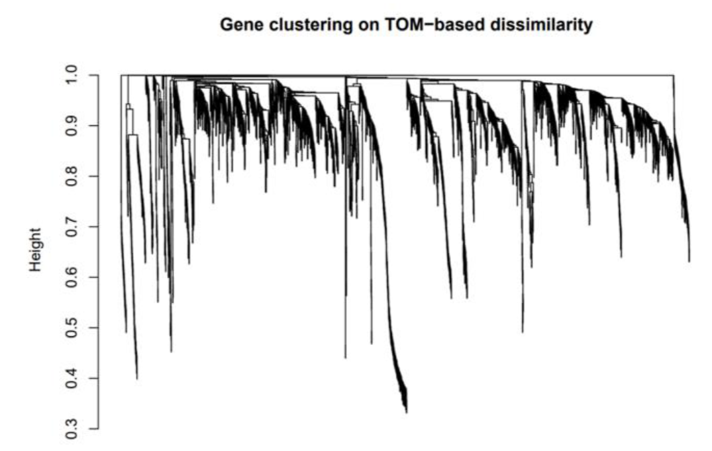

5. 识别基因模块：连接十分紧密的基因集：hclust

   * Dynamic Tree Cut算法，根据每一段树枝的结构复杂性、基因之间的紧密程度和树枝的独立性动态绝对是否剪断
     1. 对于每一个子树：计算内部一致性，与邻近分支的分离度；判断该分支是否独立/需要合并
     2. 自适应调整剪枝深度：小而密的分支，单独成模块；大而送的分支，再细分
     3. 可选PAM步骤精细化剪枝边界（尤其对边缘基因）

   

6. 合并相似模块：手动将高度共表达的模块合并

   
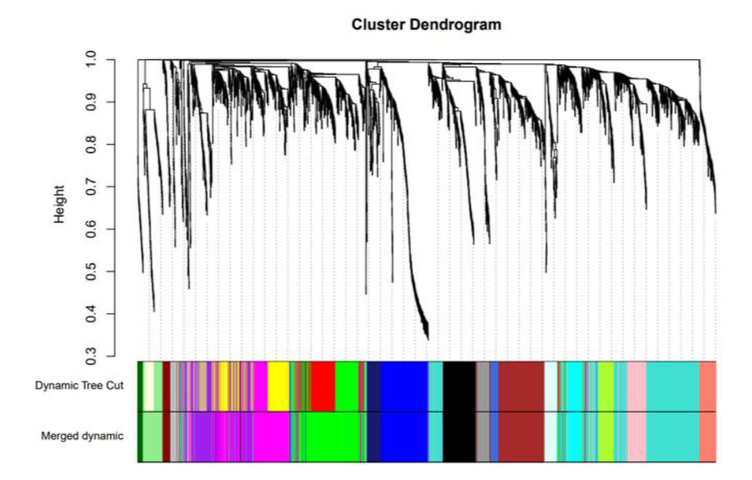

   上面是第五步得到，下方是第六步合并后得到

7. 模块功能验证：一个共表达模块反应一个真实的生物学信号
   * 通常进行GO富集分析，见3.3节

**模块与外部性状的关联**

使用第六步得到的合并后的模块

1. 将每个模块内的代表基因选出，作为模块特征基因

   * 是一个代表表达趋势的虚拟基因
   * 使用PCA进行降维

2. 样本在各个模块的特征值可以和样本的性状进行相关分析

   * 得到一个热图

     
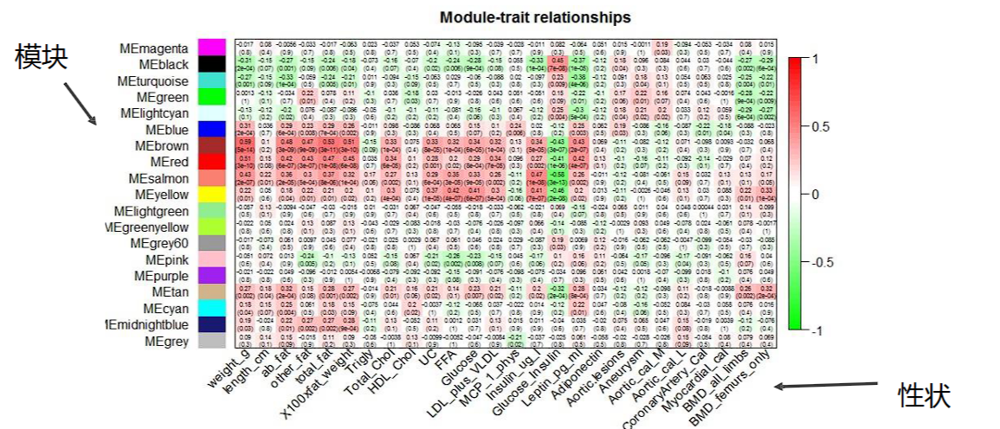

     热图的每一个框内有两个数据

     * 上方的数据是相关性大小，颜色深浅与绝对值有关，正向为红色，负向为绿色
     * 下方的数据是相关系数的p-value

**基因与外部性状的关联**

注意：需要先选定一个模块

模块内存在很多基因，希望知道每个基因与模块对应的性状的相关性

定义一个新的变量GS（基因显著性），用散点图表示为

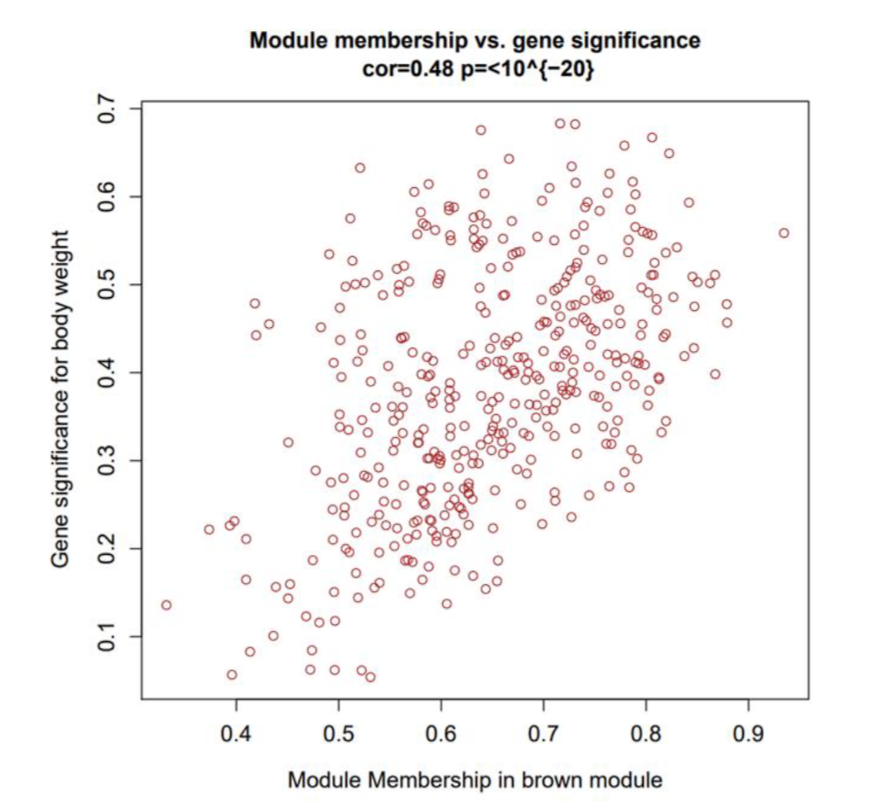

横坐标是基因在模块中的重要性（MM），纵坐标是基因在性状中的重要性（GS）

**输出网络分析结果**

后续分析

### 3.3 功能富集分析

#### 3.3.1 数据注释

**GO**

Gene Ontology，基因本体论

* 三方面对基因及其产物予以注释：生物学过程，细胞组分，分子功能
* 统计注释到相应GO term上的基因数目/和其中的差异基因数目

**KEGG**

是一个数据库，注释过程使用到了KEGG Pathway通路图

1. 利用图像展示代谢途径和各种途径的关系
2. 直观反映基因表达差异对代谢通路的影响
3. 将差异基因在通路上标注
4. 全面了解代谢途径

#### 3.3.2 数据挖掘

使用基因富集分析，找出表达水平有差异的基因集

**计算过程**

符号：N表示全体基因数据；M表示GO中的基因；n表示数据库中有关基因；k表示M和n的交集

背景命中率为$\frac{n}{N}$，GO列表中的命中率为$\frac{k}{M}$，用两个值做假设检验就知道GO的结果的显著性

更准确的来说，在富集分析中，想要知道“在特定的列表中，一个特定的基因是否比随机选择的情况下出现得多”

类比于选次品的问题，零假设是出现的概率没有更大，那么就符合超几何分布
$$
P = 1- \sum^{k-1}_{i=0}\frac{\binom{M}{i} \binom{N-M}{n-i}}{\binom{N}{n}}
$$
记为$X\sim \mathcal{H}(n,M,N)$，当$P<.05$时认为零假设不成立

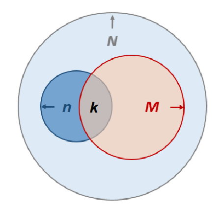

当然在多重检验下需要修正概率，有两种方法，第二种常用，选其一

* Bonferroni Correction，For Family Wise Error rate

  使用检验的次数归一化p-value，例如检验1000次，则阈值设为$0.05 / 1000$

* Benjamin-Hochberg Correction， For FDR

  每次检验的p按照序号设置阈值，如序列$p_1,p_2,...,p_s$，其中$p_i \leq \alpha \cdot\frac{i}{m}$，$m$是总的检验次数

#### 3.3.3 Metascape

一站式功能富集工具，采用CAME通用分析工作流程

1. ID转换，将用户输入的基因表示符自动转换为目标物种的entrez gene IDs
2. 注释，为基因添加描述，功能和蛋白质分类等
3. 归类，获取感兴趣的基因集（存在多个，产生多个富集通路）
4. 富集

**分析结果**

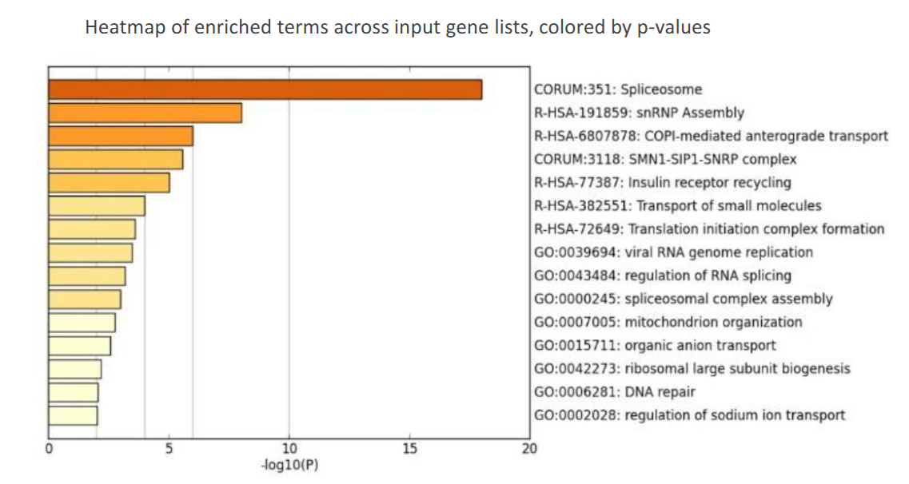

横坐标是$-\lg p$，越小的p会越大；纵向是不同的富集通路，约上面的富集越显著

### 3.4 然后需要做什么

在找到关键基因后，还有三个方向可以干

