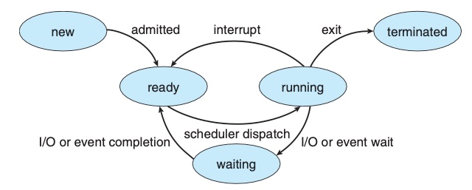
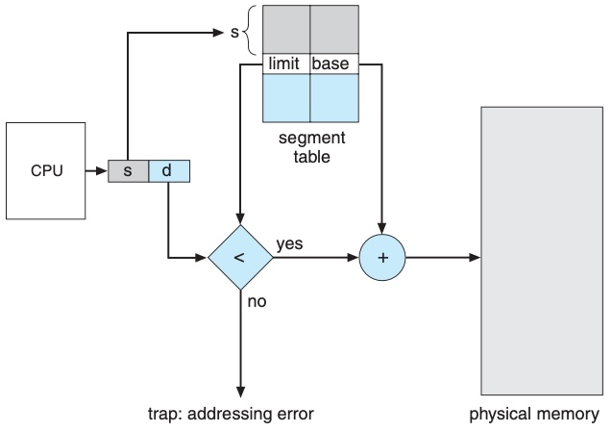
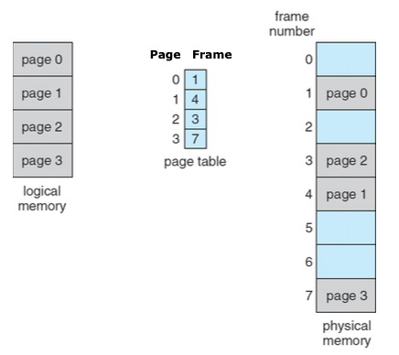
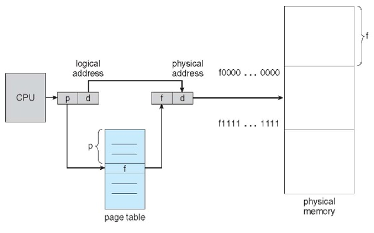
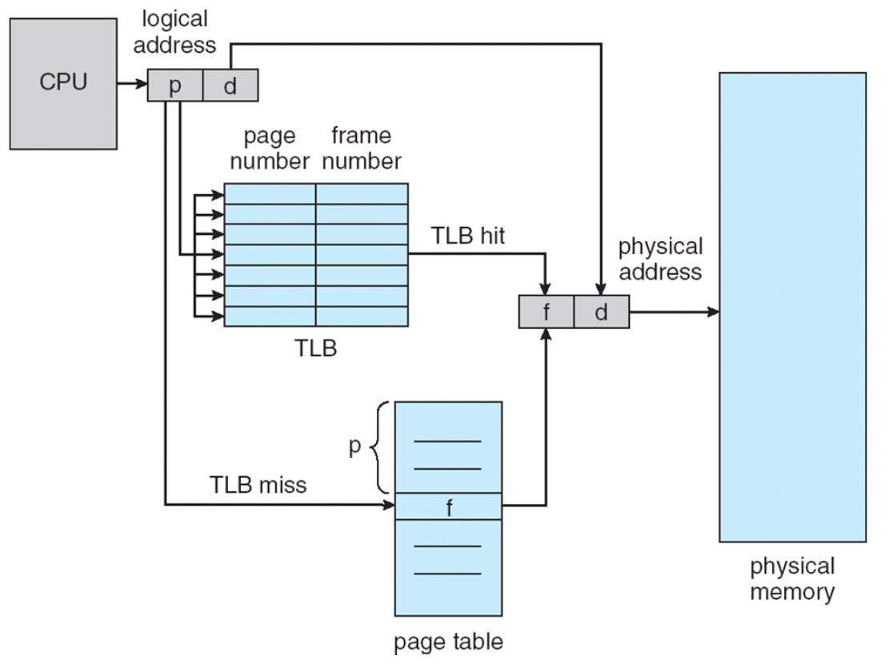
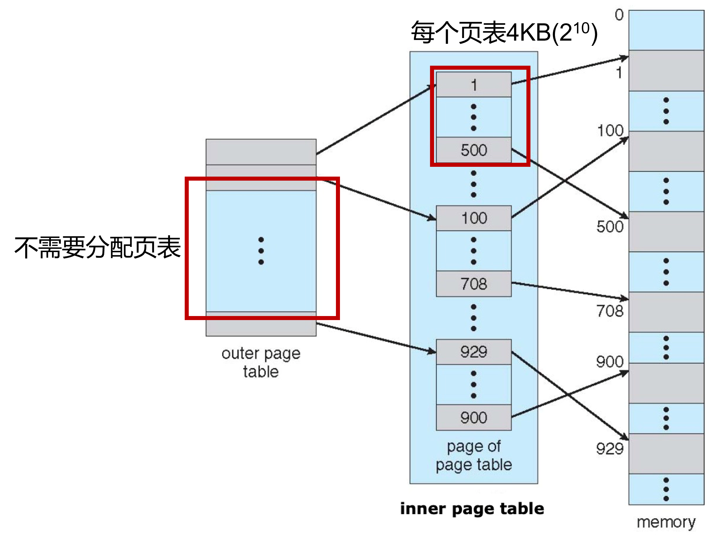
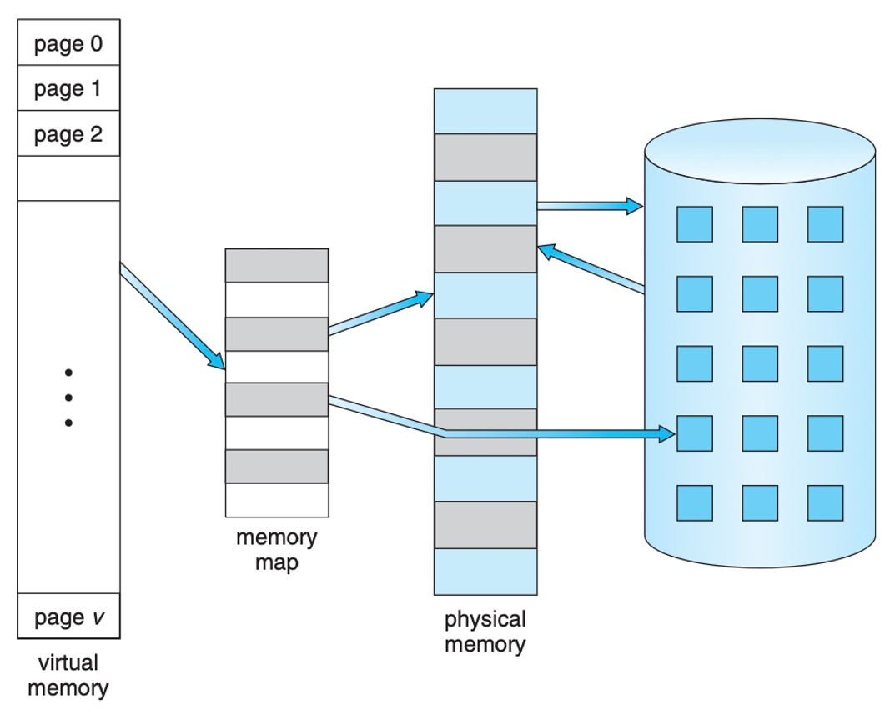
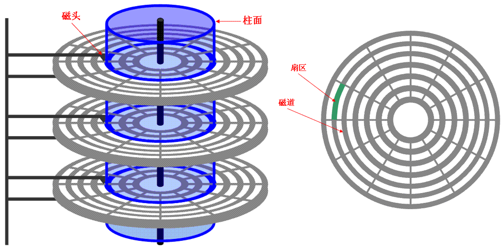
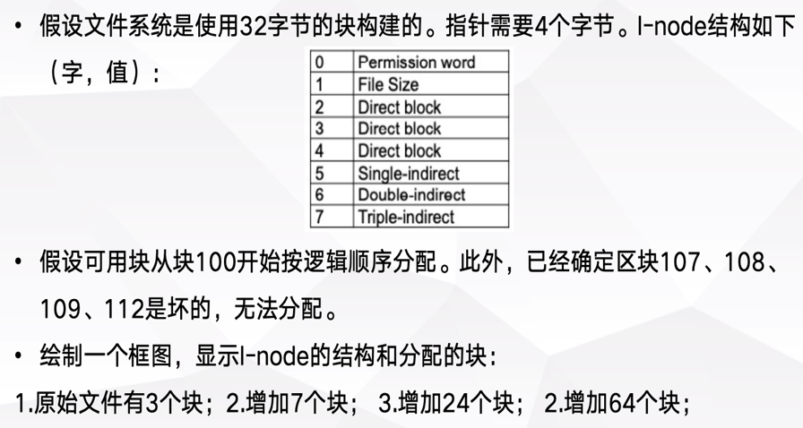
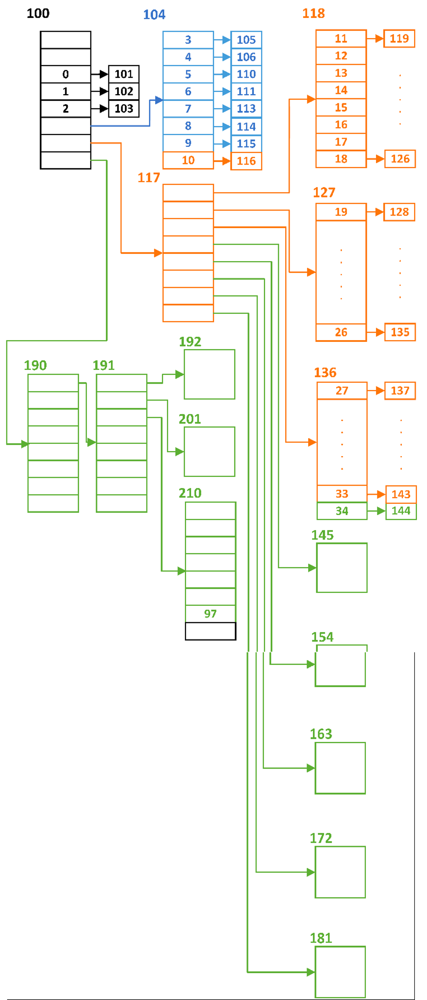

# 现代操作系统速通

## 1 进程管理

### 1.1 多进程

正在运行的程序才是进程

为了每一个进程能看上去在独立使用CPU，每个进程都需要一个PCB

**PCB中记录**

* 当前程序指针，栈指针
* 寄存器状态
* 所有的地址都是私有地址，本质是逻辑地址
* 基地址，用于物理地址换算


**进程状态图**

<center></center>


**子进程**

调用`fork()`函数，为父进程创建一个子进程，函数返回子进程的`pid`

子进程没有创建孙进程，其`pid_t`类变量为0


**进程切换**

内核在进程上下文切换时采取的行动

1. 保存PC和堆栈指针
2. 保存寄存器和其他机器状态（FLAGS）
3. 确定下一个要执行的进程
4. 检索下一个进程的PCB，利用PCB恢复这个进程的状态


**硬件利用率**：使用时间 /（使用时间+空闲时间）


### 1.2 线程

进程是资源分配的基本单位（PCB），线程是调度的基本单位


**Amdahl定律**

一个进程能被并行加速的上限
$$
Q = \frac{1}{S+\frac{1-S}{N}}
$$
其中$S$为必须串行的部分，$1-S$为可并行部分，$N$是并行资源数量


**线程**

CPU使用的基本单元，包括tid，PC，寄存器和堆栈

同一进程的不同线程共享代码段、数据段和其他资源（基地址一致，用同一块PCB）

进程由线程组成；线程的创建和切换开销小得多，因为不需要资源分配和上下文切换


**并行与并发**

并行：同时运行多个线程，必须要求多核

并发：支持多个任务，单核可以实现，但是交换线程时需要切换

可以有并发无并行：单核CPU交替执行多个线程


**多线程模型**

* 多对一：多个用户级线程到一个内核线程。用户的线程库完成调用，效率高；但一个线程执行阻塞时，整个进程都会阻塞；不能并行
* 一对一：更好的并发度，可以并行；开销大，限制了线程数量
* 多对多：任意多的用户线程，且增加了并发度

多对一适用于计算密集型，多对多适用I/O密集型

用户级线程的切换不需要内核支持，用户态调度就行


**线程切换**

TCB、栈和PC都要切换


**MMU**：memory manage unit

多处理器独享MMU，对应对进程；多核共享一个MMU，对应多线程

只有一套MMU时，只有多进程而没有多线程的情况下，不能提高并行度；需要多核心线程才能最大化利用CPU


### 1.3 CPU调度

**进程调度场景**

1. 运行——等待：等待I/O等
2. 运行——就绪：遇到中断
3. 等待——就绪：I/O完成
4. 终止

14是非抢占式的主动调度，23是抢占式的调度


**调度准则**

* CPU利用率：CPU尽可能忙碌
* 吞吐量：一个时间单元内完成的进程数
* 周转时间：进程提交到完成
* 等待时间：在就绪队列中的等待时间
* 响应时间：从提交到第一次响应


**调度算法**

* 先到先服务，FCFS
* 最短作业优先，SJF，最短的周转时间
  * 需要用指数加权平均预测下次CPU执行时间，$\tau_{n+1} = \alpha t _n+(1-\alpha)\tau_n$，其中$t_n$为第n时刻CPU的执行时间
  * 若是抢占式的，那就是最短剩余时间优先
* 优先级调度，Priority
  * 优先级反转：高优先级等待低优先级，原因是高优先级所需的资源被更低优先级上锁，必须等到低优先级完成后更低优先级才能释放
    * 解决方案：优先级继承：正在访问共享资源的京城获取需要这个资源的的更高优先级进程的优先级，完成后恢复
* 轮转，RR
* 多级队列调度
* 多级反馈队列调度


**指标间的矛盾**

* CPU利用率和响应时间：快速切换可以降低响应时间，但是频繁的上下文切换会降低CPU利用率
* 周转时间和等待时间：SJF的周转时间最短，但是这样会增大长任务的等待
* I/O利用率和CPU利用率：频繁切换上下文，CPU利用率低了，但是I/O高了
* 前台任务和后台任务的关注点：响应和周转，I/O和CPU
* 响应时间和吞吐量：频繁切换，前者小，但是后者差


### 1.4 进程同步

**临界区**：进程执行这个区可以修改公共变量，同时不允许其他进程在各自的临界区执行

进入区：临界区之前

其他是剩余区


**临界区问题**

需要满足下面的条件

* 互斥：同时仅一个进程在临界区内
* 进步：仅不在剩余区的进程可以进入临界区
* 有限等待：一个进程从请求到进入临界区前，其余进程进入临界区此时有上限


**Peterson算法**

适用于两个进程交错执行临界区与剩余区

对于单个进程来说，程序如下

```c++
do{
	flag[i] = true;
	turn = j;
	while(flag[j] && turn == j)
		; // do nothing, pending
	
	/* critical section */
	
	flag[i] = false;
	
	/* remainder section */
	
}while(true)
```

仅在仅顺序执行命令的CPU上可用


**硬件同步**

三种方法：内存屏障，TsetAndSet()，CompareAndSwap()；后面两个都是原子化指令


**内存屏障**

确保多核处理器的内存访问顺序能排序和同步

顺序保证：强：对共享内存修改会立刻广播至其他处理器；弱：无法保证，但存在Cache和MEM更新机制


**硬件指令**

`TestAndSet()`如下

```c
boolean TestAndSet(boolean *target)
{
	boolean rv = *target;
	*target = TRUE;
	return rv;
}
```

这三条指令是原子化的，也就是必须连续执行，不能中断；这可以用来设置锁

```c
do{
	while(TestAndSet(&lock))
		;	// pending
		
	/* critical section */
	
	lock = FALSE;
	
	/* remainder section */
}while(true)
```

可以用于大于两个进程的场景；`lock`初始化为`FALSE`


`CompareAndSwap()`如下

```c
int CompareAndSwap(int *value, int expected, int new_value)
{
	int temp = *value;
	if (*value == expected)
		*value = new_value;
	return temp;
}
```

也是原子化的指令，也用在锁中

```c
while(true){
	while(CompareAndSwap(&lock, 0, 1) != 0)
		; // pending
	
	/* critical section */
	
	lock = 0;
	
	/* remainder section */
}
```


**互斥锁**

`acquire()`获取锁，`release()`释放锁

```c
bool avaliable = true;

void acquire()
{
	while(!available)
		; /* busy wait */
	avaliable = false;
}

void release()
{
	avaliable = true;
}
```

但是存在问题：当锁不可获取时，CPU一直在`acquire()`中，浪费周期


**信号量**

两个标准原子操作

```c
typedef struct{
    int value;
    struct process *list;
}semaphore;

void wait(semaphore *S)			// P(S)
{
	S->value--;
    if (S->value <= 0)
    {
        // add this process to S->list
    	sleep();		// pending this process
    }
}

void signal(semaphore *S)		// V(S)
{
	S->value++;
    if (S->value <= 0 && S->list != NULL)
        // remove a process P from S->list
        wakeup(P);		// wake up the process
}
```

信号量可以是负数，其绝对值表示正在等待它的进程数


一个使用例子

> 两个进程依次访问一个数组

```c
int arr[8] = {2, 5, 7, 4, 1, 3, 8, 10};
int S1 = 1, S2 = 0;
int arr1[8] = {0}, arr2[8] = {0};

void P1()
{
    int index1 = 0;
    for (index1; index1 < 8; index1++)
    {
        P(S1);
        if (arr[index1] % 2 == 0)
            arr1.append(arr[index1]);
        V(S2);
    }
}

void P2()
{
    int index2 = 0;
    for (index2; index2 < 8; index2++)
    {
        P(S2);
        if (arr[index2] % 2 == 1)
            arr2.append(arr[index2]);
        V(S1);
    }
}
```


### 1.5 死锁

**死锁**：一系列被阻塞的进程持有部分资源，同时需要另一部分资源，这些资源被该系列中的进程所持有


**死锁特征**

* 互斥：至少一个资源是非共享的，一次只能有一个进程可使用
* 占有并等待：占有一个资源，并等待另一个被占有的资源
* 非抢占：资源不能抢占
* 循环等待：在资源分配图中成环


**资源分配图**

成环并不要求在同一个资源点

没有成环一定无死锁；成环不一定死锁，但资源仅一个实例那一定死锁


**死锁处理**

* 预防，确保至少一个条件不成立
* 避免，得到申请后推算是否会发生死锁
* 检测和恢复


死锁预防：

* 互斥：不可能不互斥
* 占有并等待：每个进程在执行前申请并获取所有的资源；资源利用率低，会发生饥饿
* 非抢占：将被阻塞的进程的资源隐式释放，可被抢占；但这些资源必须可恢复（PCB）
* 循环等待：对资源排序，按需分配；用于资源不多的情况，因为不可能一直排序，开销太大


**死锁避免**

* 进程声明每种资源的最大数量
* 动态检查资源分配状态，确保不会死锁


**安全状态算法**

按一定顺序分配资源，不发生死锁，那么存在安全序列

安全一定不死锁；非安全不一定死锁；死锁一定非安全

安全状态算法保证在安全状态内


**银行家算法**

* 每个资源类型有多个实例
* 每个进程声明需要的最大数量
* 每个进程必须在有限时间内释放资源

在进程提出申请时，假设给出，调用安全状态算法，存在安全序列就真给，不存在就不给


## 2 内存管理

### 2.1 逻辑地址和物理地址

**背景**

* CPU能直接访问的存储仅内存和寄存器
* 内存单元只能看到地址流，不知道其如何产生，分别是什么数据的地址


**基地址与界限地址**

由于每个进程中仅使用逻辑地址来寻址，需要在PCB中包含这些逻辑地址的基地址和界限地址

* 基地址寄存器：含有最小的合法物理地址
* 界限地址寄存器：指定了范围的大小（scale）

取指的第一步，先取基地址


**内存空间保护**

通过硬件实现，比较用户模式下产生的地址与寄存器的地址相对大小

当用户试图访问其他进程的内存时，系统将其视作致命错误


**逻辑到物理**

由MMU的硬件完成，映射方法很多

* 最简单：重定位寄存器，基地址加偏移地址

用户程序看不到真实的物理地址


### 2.2 分段

**分段**：将连续的逻辑地址分配到不连续的物理地址空间内；通常用于代码段，数据段这样的划分

程序是一组段的集合，分段的优点是：灵活，可扩展段数据

通过<段名，段偏移>这组有序对来确定段，使用段表来进行二维元组-物理地址映射

<center></center>


### 2.3 分页

**固定分区**

孔：一整块可用的内存，可以分配给一个完整的进程

分配方式

* 首次适应：分配首个足够大的孔
* 最优适应：分配最小的足够大的孔；遍历列表，会产生最小剩余孔
* 最差适用：分配最大的孔；遍历列表，产生最大剩余孔


**外部碎片**：存储空间被分为了大量的小孔

内部碎片：为了避免小孔，进程分配的内存比需要的大，二者之差称为内部碎片


**分页**：将每个段分为很多页（逻辑page，物理frame）；先分段，再分页

通过页表将page翻译为frame，page和frame的大小是一致的，因此页偏移很好算，减去页码就行

<center></center>

对于逻辑地址为50的内存单元，其位于0page50，对应1frame50

一般而言，一页4K，也就是末12bit地址作为页偏移，前面都是页码

<center></center>

页表存放在内存中，因此进程访问一次内存实际需要访问两次，一次查页表，一次干正事

为了加快，使用高速缓存存储，称为转换表缓冲区（TLB），和Cache很像，硬件实现

<center></center>


### 2.4 多级页表

页表的开销也很大，一个32bit按字节编址内存，4KB的页表一共有1M条，需要4MB内存来存放页表；根本原因在于很多页是不会用到但必须编址的，如果页表在物理地址内不连续，就会增加查找开销（本来是哈希）

可以用一个表来查询页表，就不用连续分配这个页表

<center></center>

蓝色的空间没有分配，页表的开销减小

内存地址被划分为三块：p1用于索引一级页表，p2索引二级页表，d索引偏移


### 2.5 虚拟内存

**虚拟内存**

程序很大，内存放不下；直接放硬盘运行的速度太慢

允许程序大于物理内存，实际内存对用户透明；逻辑内存与物理内存分离，不在物理内存中的数据通过请求调页来实现

<center></center>


**请求调页**：仅在需要时将磁盘中的页面调出到内存中

**有效位**：避免读入不使用的页，区分内存/磁盘中的页面，用1bit来表示

* valid，bit=1，在内存中
* invalid，bit=0，不是这个进程的内容，或是但在磁盘中

当访问invalid的页面时，会发生缺页错误，发出请求调页中断

页面的有效访问时间与缺页错误率正比


**页面置换**

当内存没有空闲帧时，从内存换出一个页面，从磁盘拿入一个页面

实现了逻辑内存和物理内存的分离

步骤如下：

1. 选择替换页面
2. 将该页面有效位CLR
3. 将该页面写入磁盘
4. 修改页表和帧表
5. 将目标页面从磁盘换入内存
6. 将目标页面有效位set
7. 缺页错误中断返回，继续用户进程

读入读出两倍的时间，耗时长；可以用修改位（脏位）减小开销：

* 设置一个由硬件管理的脏位
* 当页面被修改时，置位
* 若置位，则一定要写回内存；否则，不需要写回去，直接替换就行

降低一半I/O时间


**页面置换算法**

* FIFO：维护一个队列
* 最优页面置换：后续最长时间不会使用的页面，仅存在于理论分析中
* LRU：最近最少使用的页面，看前面
  * 可以用计数器的方法为每一个页面设置最近使用时间
  * 也可以用堆栈的方法将最近使用的页面置于顶端
* 近似LRU算法：硬件资源不能支持完全LRU
  * 引用位：被引用的页面set
  * 额外引用位：8bit的引用位，包含最近8个时钟周期的页面使用情况，每个时钟周期向右移动1bit，更新MSB；替换时将最小的换出去
  * 第二次机会：引用位=0，直接替换；=1，置为0，给第二次机会，选择下一个页面；所哟引用位都是1，就退化为FIFO


**Belady现象**

使用FIFO算法时，增加物理内存的帧数反而导致缺页率上升；原因在于FIFO总是淘汰最早进入的页面，而某些关键页面就是会更早进入，从而导致了错误替换


**系统抖动**

一个进程的调页时间大于执行时间，称为系统抖动

原因：CPU看到自己的利用率降低，增加更多进程，每个进程分配到的页面更小，产生更多缺页错误，进一步降低利用率


**工作集**

一个进程当前正在使用的逻辑页面集合，用二元函数$W(t,\Delta)$表示

表示$\Delta$时间段内使用过的页面序号，$|W|$越小，表面进程的局部性越好


## 3 存储管理

### 3.1 磁盘

盘片表面逻辑地分为圆形的磁道，磁道分为扇区，扇区是读写的基本单位

同一磁臂位置的磁道集合形成了柱面

<center></center>


**磁盘调度**

寻道时间占大头，因此要尽量减少寻道

* FCFS：按顺序寻道；响应快了，但是寻道时间最长
* 最短寻道时间优先SSTF：优先处理靠近当前磁头位置的请求；会导致饥饿，且实际使用中没有后面来的扇区序列
* 扫描算法：从磁盘的一端开始，向另一端移动，处理请求，当达到另一端时，开始方向移动；适合请求的柱面较均匀的情况
* 循环扫描：从一段开始向另一端移动，处理请求，到达另一端后立刻返回开头，回程上不处理请求
* LOOK：想法和扫描一致，但不是到端点，而是到最远的请求；同样还有循环LOOK


**多磁盘管理**

* RAID-0：数据分成多个子块，存在独立的磁盘中，I/O带宽大
* RAID-1：两个磁盘存一样的数据，可靠性加倍，读写任意读一个
* RAID-4：数据块级的磁盘配有专用奇偶校验盘；其他盘采用RAID-0策略
* RAID-5：4会导致校验盘频繁读写，5把校验块均匀分布在所有数据块中


### 3.2 文件系统

对用户来说，文件是逻辑外存的最小分配单元


**文件分配方法**

评价指标：高效（利用率），表现（访问速度）

* 连续分配：每个文件在磁盘上占有一组连续的块，指定起始块和长度；读取表现好，支持随机访问；但是文件扩展差，会产生外部碎片问题；适合只读文件
* 链式分配：每个文件是磁盘块的链表，可以散布在磁盘任意位置，文件头包含了第一块和最后一块的指针；创建、增加和缩小容易，没有外部碎片；但只能顺序访问，指针丢失文件就寄了
  * 文件分配表FAT：FAT中记录了每一个磁盘块的索引，改善了随机访问
* 索引分配：每个文件有自己的索引块，记录磁盘块地址；支持随机访问，没有外部碎片；但是需要维护完整的索引块，浪费空间
  * 链式索引块：大文件，将多个索引块链接，不怕空间不够
  * 多级索引块：类似多级页表，空间改善，但是访存速度受限


**索引分配的组合方案**

* 将索引块的前几个指针存在文件inode中
* 这些指针的前12个直接指向数据块，对应小文件不需要多级索引
* 剩下的3个指针指向间接块，对应大文件
  * 第一个指向一级，第二个指向二级，第三个指向三级

注意一下最后一道例题

<center></center>

<center></center>
