# 生物学导论复习

## 1. 生命的化学基础

> **蛋白质的基本结构和一级结构？**

氨基酸的结构；多肽链的氨基酸残基排列顺序

> **细胞质膜的脂质类型及结构模型？**

磷脂：鞘磷脂和甘油磷脂；糖脂；分布不对称
二者都是复脂

> 外：PC(磷脂酰胆碱)、SM(鞘磷脂)内：PE(磷脂酰乙醇胺)、PS(磷脂酰丝氨酸)；流动镶嵌模型

> **组成核酸的基本单位及其主要结构？**

碱基+戊糖=核苷，核苷+磷酸=核苷酸，核苷酸聚合为核酸
脱氧脱在2号位的羟基
顺方向：5’—>3'
嘌呤双杂环，嘧啶单杂环

> **桑格测序的基本原理**

桑格测序的基本原理是利用特制的双脱氧核苷酸（ddNTPs）在DNA合成过程中随机终止新链的延伸；通过电泳分析

> **染色体的基本单位及其结构特征？**

由DNA和蛋白质构成，基本单位**核小体**
200bp的DNA，组蛋白H1,H2A,H2B,H3,H4组成

结构特征：串珠结构

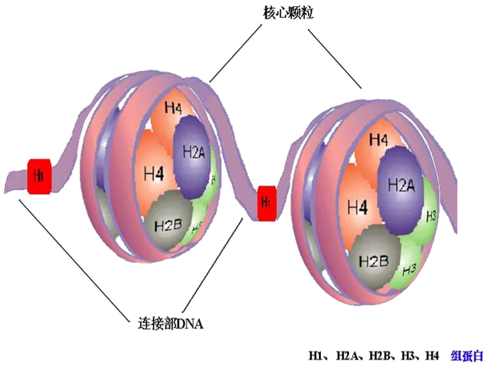

> **DNA双螺旋模型的结构特点及其生理学意义?**

DNA分子由两条**相互平行但反向**的脱氧核苷酸链组成，以-**脱氧核糖-磷酸**-为骨架，以**右手螺旋**方向绕
碱基垂直螺旋轴居于内侧，与对侧碱基形成**氢键配对**（A=T，C≡G）
氢键维持双链**横向**稳定，**碱基堆积力**维持**纵向**稳定

**DNA的超螺旋结构：**
由DNA双螺旋链再盘绕形成，分为正超螺旋（盘绕方向与DNA双螺旋方向一致）和负超螺旋
意义：DNA超螺旋结构**整体或局部的拓扑学变化**及其调控对于**DNA复制和RNA转录**过程有关键作用  

> **基因的基本结构?**

下面的单链是RNA的模板链，上面的单链是编码链

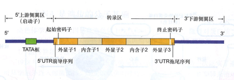

> **mRNA的结构特点及其功能？**

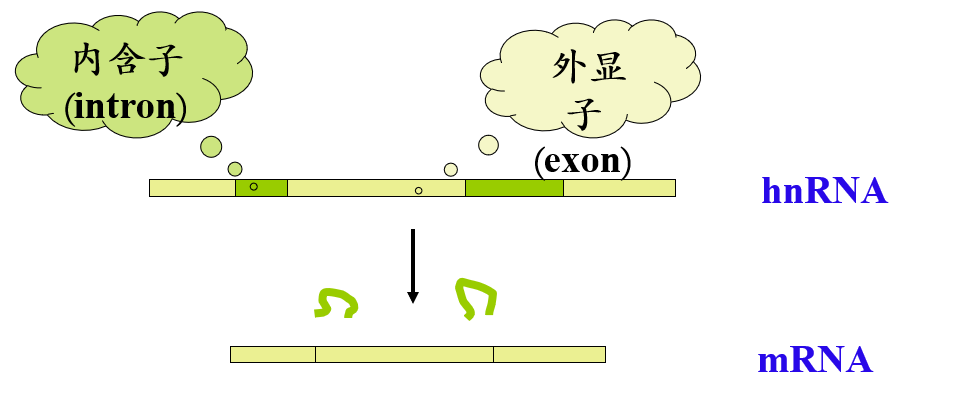

其中内含子会被剪去，余下的外显子片段会被拼接，二者都只在DNA的编码区上存在，hnRNA是mRNA的前体物

结构特点：

1. 多数在5'端在转录后加上7-甲基鸟苷，第一个核苷酸的C'2也甲基化，形成帽子结构：m7GpppNm-

   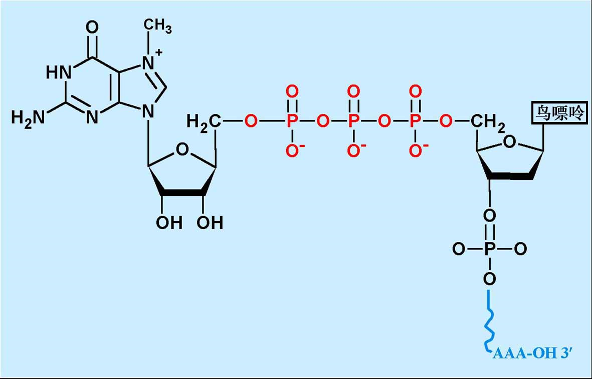

2. 多数在3'端有一个多聚腺苷酸（polyA），称多聚A尾

**帽子结构和多聚A尾的作用**  

1. mRNA核内向胞质转移
2. mRNA的稳定性维系
3. 翻译起始的调控  

## 2. 细胞

> **细胞中的主要细胞器和功能？**

1. 质膜
2. 细胞核
3. 细胞器
   1. 线粒体
   2. 无膜细胞器
      1. 核糖体
      2. 中心体（动物/低等植物）
   3. 内膜系统
      1. 内质网
      2. 高尔基体
      3. 溶酶体
      4. 过氧化物酶体
4. 细胞骨架

重点关注溶酶体

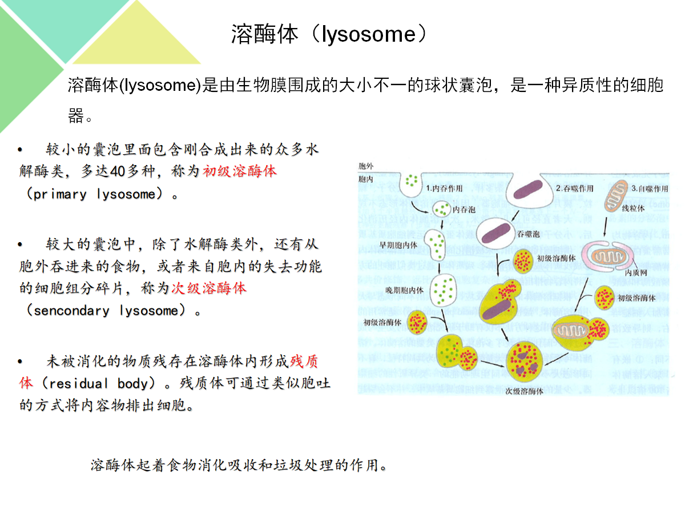

溶酶体膜具有几个关键特性，这些特性对于它们在细胞内的功能至关重要：

1.**单层膜结构**：溶酶体由单层膜包裹，这层膜厚度大约为6至8纳米。

2.**高度糖基化**：溶酶体膜蛋白多为糖蛋白，表面高度糖基化，这有助于保护溶酶体自身不被内部的水解酶所水解。

3.**酸性环境**：溶酶体内的pH值维持在大约3.5至5.5之间，这种酸性环境是由膜上的特殊转运蛋白（如H+-ATPase泵）通过消耗ATP水解的能量将氢离子（H+）泵入溶酶体内来实现的。

4.**负电荷内表面**：溶酶体膜的内表面带有负电荷，这有助于溶酶体内的酶保持游离状态，对行使正常功能和防止细胞自身被消化具有重要意义。

5.**特殊的转运蛋白**：溶酶体膜含有能够将细胞质中的氢离子泵入溶酶体的转运蛋白，维持溶酶体的酸性环境，这对于酶的活性至关重要。

6.**选择性通透性**：溶酶体膜对物质的通透具有选择性，允许特定的底物进入溶酶体内部进行降解，同时防止溶酶体内的酶逸出到细胞质中。

7.**与溶酶体功能相关的受体**：溶酶体膜上有特定的受体，如M6P受体，它们参与溶酶体酶的选择性包装和运输。

8.**稳定性**：溶酶体膜的结构稳定性对于保持溶酶体的完整性和防止细胞自溶非常重要。

## 3. 发育的遗传基础

> **什么是干细胞？干细胞的基本特征和分裂模式？**

是一类具有**自我更新**和**分化潜能**的细胞  

**特点：**

1. **无限分裂**
2. 未分化的细胞
3. 干细胞的子细胞只能在两个进程中选择其一
   1. 保持亲代特性，仍为干细胞
   2. 向终末分化

**分裂模式**  

1. 对称分裂（自我更新）
2. 不对称分裂（向终末分化）

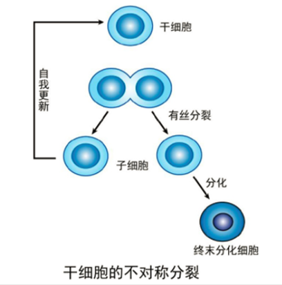

> **胚胎干细胞、成体干细胞和iPS细胞优劣性？**

ES cell全能性最强，通过体内成瘤性、嵌合体动物、四倍体补偿等手段鉴定

成体干细胞来源于成体各组织的未分化细胞，有终生自我更新和分化潜能

* ES：干性和分化能力较强；需要破坏胚胎，伦理问题；不能获得病人特异性干细胞系；宿主的免疫排斥
* 成体：受伦理影响小；安全，易获得；干性和分化能力较弱
* iPS：受伦理问题小；干性和分化能力较强；安全性差，有致瘤风险

> **什么是iPS?**

诱导型多潜能干细胞；通过多种转录因子将终末分化的体细胞**重编程**为多潜能干细胞；核移植（体细胞核移植到去核卵母细胞）细胞也是iPS cell

**iPS应用前景**  

1. 做疾病模型（疾病的分子机制）
2. 用于药物筛选（制药）
3. 做毒性检测（制药）
4. 做类器官

> **制备 iPS常用的转录因子（ Yamanaka因子 ）有哪些？**

常见的四种：Oct3/4,Sox2,c-Myc,Klf4；四种蛋白质全部一起加才行，可以**调控干性基因表达**  

## 4. 神经系统与脑疾病

> **神经系统的细胞组成？**

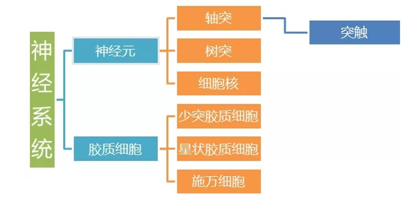

**神经元**
有电化学活性，感受刺激，产生神经冲动，分泌神经递质，可以传递和整合信息

**神经胶质细胞**
数量是神经元的几十倍，是绝缘体，无极性；对神经元起**保护、支持、绝缘**作用
少突胶质细胞可特化为髓鞘；小胶质细胞具有免疫功能，可转变为巨噬细胞

**突触**
神经元与**效应器细胞或另一神经元**之间的信息传递位点
由**突触前膜、突触间隙、突触后膜**组成

> 神经血管单元有**神经元**-**胶质细胞**-**血管**构成，包括神经元、星形胶质细胞、小胶质细胞、血管内皮细胞、血管周细胞、基底膜以及细胞外基质

> **血脑屏障的组成：血管内皮细胞，周细胞，基底膜，神经胶质细胞的终足?**

从管内算起，血脑屏障有3层：

1. 脑毛细血管**内皮细胞衔接紧密**
2. 脑毛细血管内皮细胞外有**连续的基底膜**
3. 脑毛细血管壁外表面积85%都被**神经胶质细胞的终足或称脚板**包围

周细胞：包围全身毛细血管和静脉中的内皮细胞的细胞；负责内皮细胞间的**囊泡运输**以及**紧密连接**的形成，**抑制**中枢神经系统**免疫细胞**对于血脑屏障形成的影响，并且还**抑制增加血管渗透性**的相关分子表达

> **阿尔兹海默症的主要发病机制?**

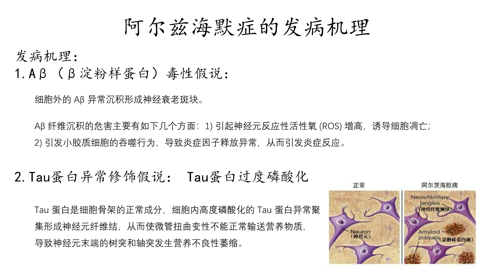

> **帕金森病的主要发病机制及其症状?**

由于脑内的**黑质**部位出现**急剧功能退化**，不能产生**多巴胺**，使得脑部**指挥肌肉活动**的能力受到不同程度的限制，大大阻碍了患者的活动能力

症状：震颤、僵直、运动迟缓、姿势不稳、帕金森步态。

## 5. 消化系统

> **消化系统的组成？**

## 6. 细胞外囊泡

> **细胞外囊泡的主要分离方法？**

1. **差速超速离心**：最广泛使用，被视为“金标准”
2. **密度梯度超速离心**
3. **免疫分离**：使用免疫磁珠，捕获膜表面特定蛋白质的细胞外囊泡
4. **聚合沉淀**：利用聚乙二醇一类的聚合物能促使细胞外囊泡沉淀
5. **切向流超滤**：孔径大于Evs粒径的滤膜除去大颗粒，然后用孔径小的超滤膜截留细胞外囊泡
6. **尺寸排阻色谱**：利用排阻层析柱里的多孔固定相，使较小的颗粒在柱子里的保留时间更长，实现按粒径大小对样品进行分离
7. **微流控芯片分离**：用纳米材料或芯片捕获微流体中的细胞外囊泡

> **细胞外囊泡的主要分类？**

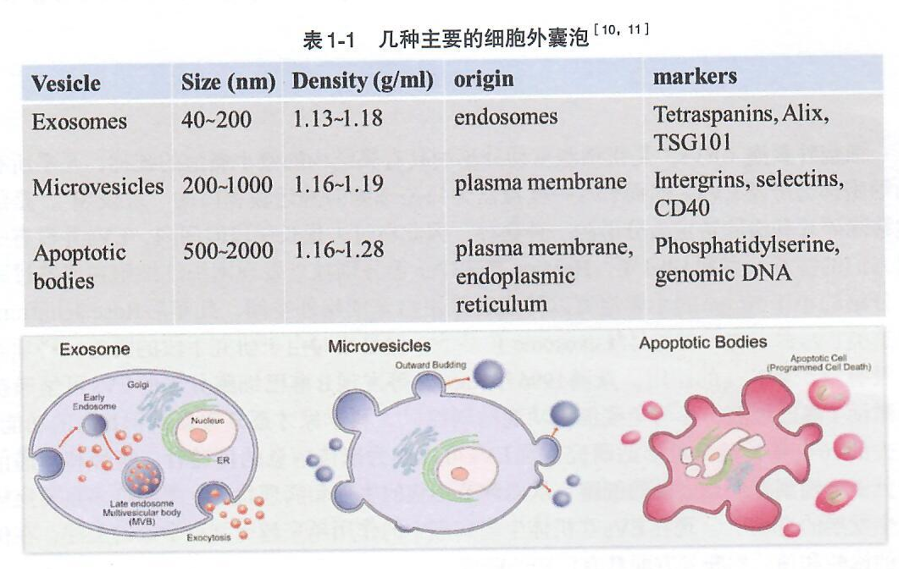

从上到下：外泌体，微囊泡，凋亡小体

> **细胞外囊泡的应用（递送工具）？**

疾病诊断和治疗

细胞外囊泡的透过血脑屏障和靶向性可以作为药物递送工具

更低的毒性和免疫原性

## 7. 感染与免疫

> **影响人体健康的主要病原体？**

**病毒**
类型：RNA病毒，DNA病毒
主要作用方式：

1. 破坏细胞功能/重要脏器细胞
2. 整合病毒基因至宿主细胞

**真菌**
分类：单细胞，多细胞
绝大数对人类有益，少数对人类有害

**寄生虫**
分类：原生动物（单细胞真核），蠕虫（多细胞）

**细菌**
除了核糖体外无其他细胞器
广义细菌：细菌，放线菌，支原体，衣原体，立克次体，螺旋体

**支原体**
最小最简单的细胞，以**二分裂和出芽**繁殖

> **免疫系统的组成，抗原、抗体的定义和结构？**

组成：

* 抗原：免疫原性，免疫反应性
  抗原表位：决定免疫应答特异性的化学基团
* 抗体：轻链的可变区（黄色和蓝色的上面一半）比较关键

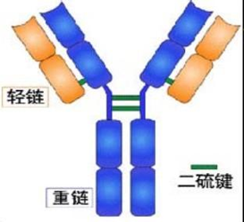

> **免疫细胞的生成？**

* 髓系细胞

  1. 粒细胞：中性粒，嗜碱性粒细胞，嗜酸性粒细胞
  2. 单核/巨噬细胞
  3. 树突状细胞

* 淋巴系细胞

  1. T淋巴细胞：CD4 T细胞（helper），CD8 T细胞（cytotoxic），用特有的膜蛋白命名
     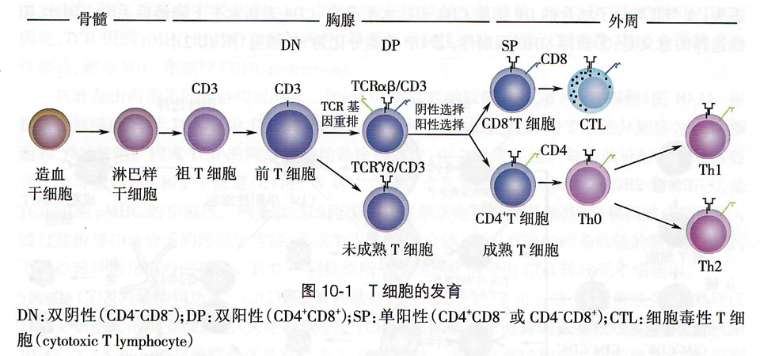
  2. B淋巴细胞：记忆细胞，浆细胞，在成熟过程中出现区别
     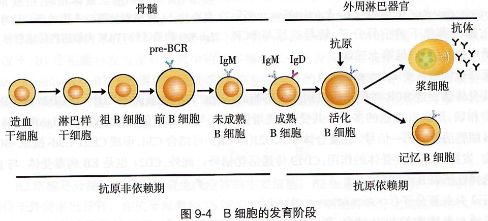
  3. NK细胞（natural killer）

  淋巴细胞关系图
  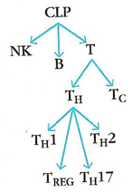

> **免疫系统的功能？**

1. 免疫防御：防止外界入侵，清除异己
   过强或持续太久：过敏反应
   过弱：免疫缺陷
2. 免疫监视：发现和清除病原体，肿瘤细胞，衰老、凋亡的细胞等
   过弱：肿瘤，持续性病毒感染等
3. 免疫自身稳定：通过自身免疫耐受和免疫调节，达到免疫系统内环境的稳定

免疫系统与神经系统和内分泌系统一起组成**神经-内分泌-免疫网络**

> **免疫应答的过程？**

固有免疫（无淋巴细胞参与）

* 免疫系统对病原体的识别？
  1. **模式识别受体**
     能够直接识别病原体等表面特定分子的受体
  2. **病原体相关模式分子**
     可以被模式识别受体识别的特定分子
* 抗原的加工和提呈？
  1. **加工**
     抗原被降解为**多肽**，与MHC结合形成**抗原肽-MHC分子复合物**，随后被转运到细胞表面
  2. **提呈**
     APC（加工提呈细胞）表面的抗原肽-MHC分子复合物被T细胞识别，提呈给T细胞，诱导其活化

适应性免疫

* 淋巴细胞的免疫应答？

  1. **T细胞特异性识别抗原**
     APC通过**免疫突触**与T细胞相互作用（呈递抗原）
  2. **T细胞活化、增殖、分化**
     只有当没有负性信号，有正性信号和抗原信号时，才会活化
  3. **效应T细胞的产生和效应**

  B细胞同理

* 免疫应答终止or形成免疫记忆？

> **克隆选择学说？**

全身的免疫细胞由众多识别不同抗原的细胞**克隆**而成，同一种细胞表达相同的受体
受体在接触抗原之前就形成，由**长期的进化**得到
当自身组织的抗原在**胚胎期**被相应的细胞克隆，这些细胞产生**特异性免疫耐受**，用于判断自我和非己
抗原进入身体后，免疫细胞从细胞库中选择能识别这种抗原的淋巴细胞，清楚抗原

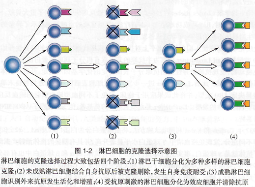

## 8. 肿瘤的致病机理和治疗的新方法

> **什么是癌基因？**

普遍存在于正常细胞内，调控细胞**增殖和分化**的基因
当受到物理化学生物的因素而活化失控时，才会导致肿瘤

> **肿瘤免疫治疗的主要领域？**

1. 消除肿瘤的免疫抑制
2. CAR(chimeric antigen receptor)治疗
3. 肿瘤疫苗

> **免疫检查点主要包括哪些分子？**

**CTLA4、PD-1、PD-L1**、LAG3、B7-H3、B7-H4、TIM3

> **什么是CAR-T治疗？**

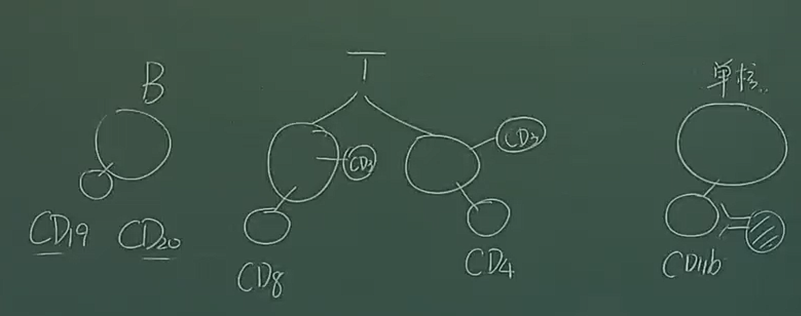

上图表示不同的淋巴细胞面的特异性受体，使用对应的抗体进行CAR治疗
例如：CD19 CAR-T治疗，是改造自身的T细胞让它特异性杀死B细胞治疗白血病

> CAR-T是一种个体化免疫治疗，用基因工程的方法改造**自身**T细胞的TCR，增强对肿瘤的杀伤性

TCR，T Cell Receptor，是T细胞表面特异性识别抗原的受体

**CAR-T 原理**

将抗体加载到TCR复合体上（基因工程）：T细胞受体的分子量大，识别能力不如抗体；而抗体下面都是恒定区，只需要将可变区链接起来就行；黄色的是铰链区，增强抗体的活动性，更好地识别

抗体识别抗原决定簇，发挥作用

## 9. 生态系统的组成

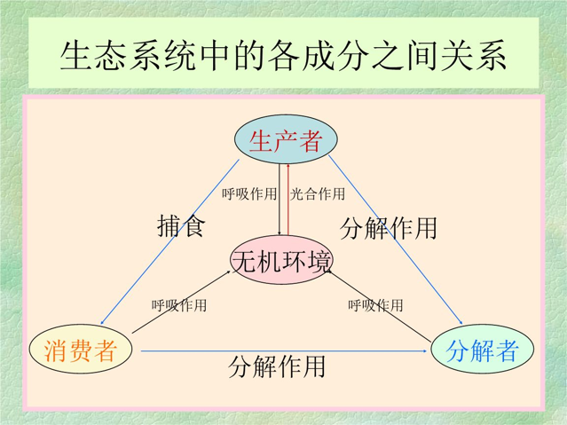

