# 生物医学统计基础笔记

## 0 Thinking Statistically

1. 从样本推断总体
2. 统计推断的依据:
   1. 随机采样
   2. 样本足够大
   3. 样本统计量的分布特征已知
3. 数据可视化**提早**统计分析  
4. p值与$H_0/H_1$成立的关系：**没有关系**，是拒绝用的，不能用于成立
5. 统计显著性（α）不代表实际显著性（样本反映的）

## <font color=red>报告格式：APA格式</font>

**单样本t-检验：**
根据单样本t-检验的结果，样本均值（M = 3.20，SD = 0.80）显著高于总体均值（t(29) = 2.60，p < .05，95%CI=[xxx,xxx]）。

**独立样本t-检验：**
根据独立样本t-检验的结果，组A的平均值（M = 5.10，SD = 1.20）显著高于组B的平均值（M = 4.20，SD = 0.90），t(58) = 2.90，p < .05，cohen's d=0.8，95%CI=[xxx,xxx]。

**配对样本t-检验：**
根据配对样本t-检验的结果，前后两次测量的平均值存在显著差异（M1 = 3.20，SD1 = 0.80；M2 = 4.10，SD2 = 0.90），t(29) = 2.60，p < .05，cohen's d=0.8，95%CI=[xxx,xxx]。

* cohen's d是一个效应量，$d=\frac{\overline{x_1}-\overline{x_2}}{s}$，$s=\sqrt{\frac{(n_1-1)s^2_1+(n_2-1)s^2_2}{n_1+n_2-2}}$

**1-way ANOVA**：
三个组的成绩分别是12.3(n=12,SD=4.1), 7.4(n=9,SD=2.3), 6.6(n=8,SD=3.1)，显示方案对成绩有显著效应(F(2,26)=8.76, p=.012, eta2=0.1).
进一步组间多重比较Tukey HSD 检验发现，anxifree 与joyzepam对情绪改善差异（d=0.77）达到统计显著性（p=.0015），joyzepam 与 placebo 对情绪改善差异（d=-1.49）也达到了统计显著性（p=.0001）

**卡方检验**
卡方检验表面剂量与治疗效果具有显著的弱关联性（chi2(2)=14.23,p<.001,Cramer's V=0.18）

**GoF卡方检验**
通过XXX检验，感染人数的分布显著服从/不服从XX分布，$\chi^2(df,N)=$xx,p=.xxx
其中N是样本观测总数

**相关系数**
Pearson相关分析表明，两个变量之间存在很强/中等/弱/没有线性相关性（r(N)=.30,p<.001,95%CI=[0.15,0.35]）
N是样本观测量

**回归模型**
Social support significantly predicted/explained depression scores（bi= -.34, t(225) = 6.53, p< .001）
Social support also explained a significant proportion of variance in depression scores（R2 = .12, F(1, 225) = 42.64,p< .001）
F分布的自由度分别是自变量个数，样本观测量-1-自变量个数


## 1 预备知识

### 1.1 常用代码

<details>
<summary>click here</summary>   
import pandas as pd<br>
    pd.read_csv("")   
    #输入文件<br>pd.DataFrame.info()   
    #该函数在调用时会显示以下信息：<br>
                    #DataFrame 的形状（行数和列数）<br>
                    #列名和各列的非空值数量<br>
                    #列的数据类型<br>
                    #内存使用情况<br>pd.DataFrame.describe()  
    #它会计算以下统计信息：<br>
                        #计数（count）：非空值数量<br>
                        #平均值（mean）<br>
                        #标准差（standard deviation）<br>
                        #最小值（min）<br>
                        #第25百分位数（25th percentile）<br>
                        #中位数（50th percentile，即中位数）<br>
                        #第75百分位数（75th percentile）<br>
                        #最大值（max）<br>pd.DataFrame.groupby()   
    #用于按照指定的列或多个列对数据进行分组<br>pd.DataFrame.agg()  
    #同时计算多个值<br>
</details>    

### 1.2 生物医学数据类型

两个大类，四个小类：  

可数的：
离散型：病毒感染人数，人的心率
连续性：人的血压值  

可分类的：
有序(ordinal)：学生成绩（A/B/C/D）
无序(nominal)：病毒诊断结果（阳性/阴性）
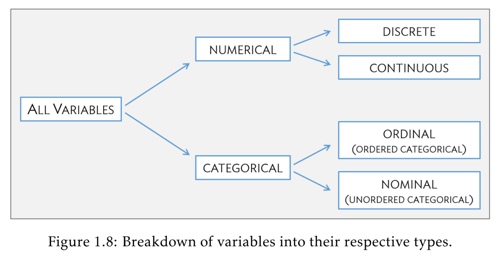

### 1.3 常用术语

总体、样本、自变量、因变量、概率
样本的叫<font color=red>**统计量**</font>，总体的叫<font color=red>**参数**</font>

样本（Sample）和总体（Population）的例子：
对照组和实验组各10只卒中⼩⿏，研究某药物对卒中的⼲预作⽤，这个例⼦中有：
**总体1**：药物⼲预的任何卒中⼩⿏（⼤⼩不确定）
**总体2**：没有⽤药物⼲预的任何卒中⼩⿏（⼤⼩也不确定）
**样本1**：本实验中的药物⼲预组（n=10）
**样本2**：本实验中的对照组（n=10）
<font color=red>本实验有两个总体，两个样本</font>  


另一个例子：
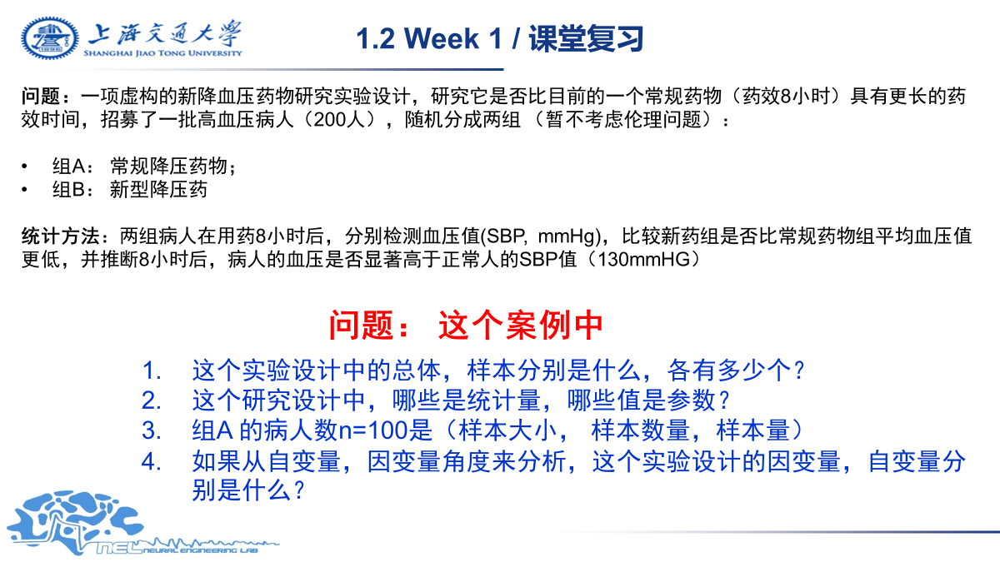
1、总体有**3个**，分别是正常人群和两个服用不同药的人群；样本两个，分别100人
2、统计量：8h后两组血糖平均值；参数：总体数量，正常人SBP
3、<font color="red">样本大小</font>
4、自变量是吃哪种药,因变量是8h后**每个个体**的血压


**推断性统计**：用样本来推测总体
**描述性统计**：用全体的数字特征来描述总体

### 1.4 大数定律和中心极限定理

<font color=red>注意，这与概统中的概念有所区别</font>
**大数定律(LLN)** ：样本观测值越大，样本均值观测结果越接近总体均值
**中心极限定理(CLT)** ：样本均值的分布服从正态分布，该分布均值等于总体均值  

<details>
    <summary>用中心极限定理求均值click</summary>
            data1= stats.norm.rvs(10,5,5000,random_state=100) #生成  <br>
            data2= stats.norm.rvs(30,5,2000,random_state=100)  <br>
            data=np.hstack((data1,data2))              #拼接数据   
            sample_means=[]  #随机取数，求平均后存入数组  <br>
            reps,ns=10000,50  <br>
            for i in np.arange(10000):  <br>
                sample_i=np.random.choice(data,ns,replace=True)  <br>
                sample_means=np.append(sample_means,np.mean(sample_i))  #此时该数组的平均值就是总体平均值   <br>
            print("总体均值是: %.2f " % np.mean(data))  <br>
            print("样本均值分布的均值是: %.2f " % np.mean(sample_means))      <br>
</details>   


### 1.5 常用分布和函数

**正态分布**：stats.norm()  _Z分布就是标准正态分布_
**T分布**：stats.t()
**二项分布**：stats.binmo() 
**卡方分布**：stats.chi2()

**pdf**:概率密度  stats.norm.pdf(x,$\mu$,$\sigma$)
**pmf**:概率质量  stats.binmo.pmf(k,n,p)
**cdf**:分布函数，用法同上
**rvs**:生成随机变量  stats.norm.rvs(size,$\mu$,$\sigma$)
**ppf**:下侧分位数  stats.norm.ppf(p,$\mu$,$\sigma$)
**isf**:上侧分位数 stats.norm.isf(p,$\mu$,$\sigma$)


## 2 数据可视化

### 2.1 一般建议

看变化趋势：lineplot
看分布特征：boxplot，scatterplot，直方图，pdf
看关系：回归线，scatterplot+回归线，热图

plt.subplot(2, 2)用于生成一个2$\times$2的画布,可以存放四张图

### 2.2 箱体图认读

**箱体图认读**：
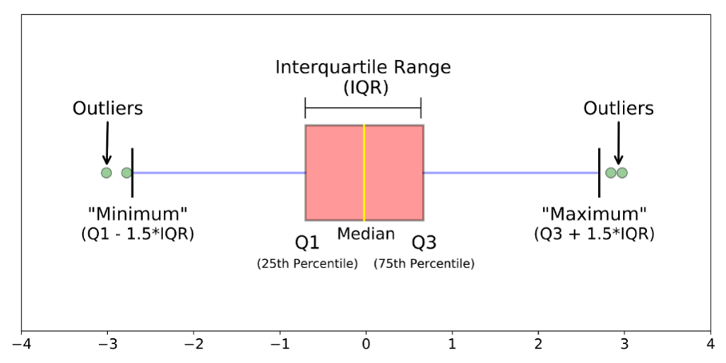
Q1,Median,Q3分别表示25，50，75分位点（非均值）
Minimum=Q1-1.5 * IQR，Maximum=Q3+1.5 * IQR
IQR=Q3-Q1（箱体长度） 


## 3 描述性统计

### 3.1 分位 Quantiles

几个常见的分位数：  
1. median 二分位 1/2
2. tercile 三分位 1/3
3. quartile 四分位 1/4
4. quintile 五分位 1/5
5. decile 十分位 1/10
6. percentile 百分位 1/100

<details>
<summary>python代码click</summary>
pd.DataFrame.quantile(q=[0.25,0.5,0.75])  
</details>

### 3.2 数据的集中趋势 Central Tendency

平均值 mean
众数 mode
中位数 median


**Mean**
有n个观测值的样本$\{x_i\vert i=1,2,\ldots,n\}$定义
算术平均：$\overline{x}=\frac{x_1+x_2+\ldots+x_n}{n}$
几何平均：$\overline{x_g}=\sqrt[n]{x_1 x_2\ldots x_n}$
调和平均：$\overline{x_H}=\frac{n}{\frac{1}{x_1}+\frac{1}{x_2}+\ldots+\frac{1}{x_n}}$


**Mode**
可以是数据型的，也可以是类别型的  


**Median**
若有偶个数，则任意取两个数平均，取低，取高都行  


<details>
<summary>python代码click</summary>
        一个常用的库：statistics  <br>
        import statistics as sta  <br>
        sta.mean 求平均  <br>
        sta.median 求中位数  <br>
        sta.median_low 求低位中位数<br>  
        stat.median_high 求高位中位数  <br>
        sta.mode 求众数  <br>
        sta.geometric_mean 求几何平均数  <br>
        sta.harmonic_mean 求调和平均数  <br>import scipy.stats as stats  
        stats.trim1() # 数据单边按比例截断，仅截尾  
        stats.trimboth() # 数据双边按比例截断，仅截尾  
        截断后统计量计算  
        stats.trim_mean  
        stats.tmean  
        stats.tvar  
        stats.tstd  
</details>

### 3.3 描述数据的分散性

极差 Range $Range=x_{(n)}-x_{(1)}$
变异系数 Coefficient of variation $cv=\frac{\sigma}{\mu}=\frac{\mathcal{s}}{\mathcal{m}}$
方差 Variation $\sigma^2=\frac{\sum(x_i-\mu)^2}{N}$，$\mathcal{s}^2=\frac{\sum(x_i-\mathcal{m})^2}{n-1}$
标准差 Standard Deviation $\sigma,\mathcal{s}$  


<details>
    <summary>python代码click</summary>
    import statistics as sta  <br>
    sta.psdev() 求总体的标准差 Population Standard Deviation<br>  
    sta.pvariance() 求总体的方差  <br>
    sta.stdev() 求样本的标准差 Sample Standard Deviation  <br>
    sta.variance() 求样本的方差<br>
</details>

### 3.4 描述数据的分布·

峰度 kurtosis
偏度 skewness
变异系数 coefficient of variation


**峰度**
Pearson's Kurtosis:
$$Kurtosis(x)=E[(\frac{x-\mu}{\sigma})^4]=\beta_2=\frac{\mu_4}{\sigma^4}$$
对于正态分布，上式恒等于3
Fisher's Kurtosis/Excess of Kurtosis = Pearson's Kurtosis - 3
FK=0时，为高斯分布
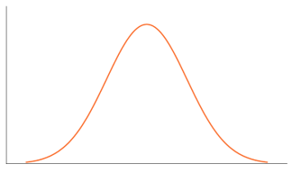

Fk>0时，为超高斯分布
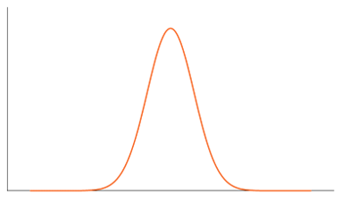

FK<0时，为欠高斯分布
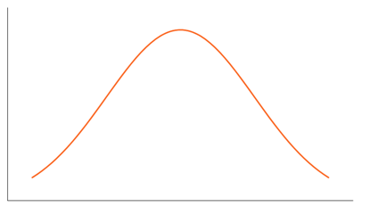


**偏度**
$$Skewness=\widetilde{\mu_3}=E[(\frac{X-\mu}{\sigma})^3]=\frac{\mu_3}{\sigma^3}$$ 
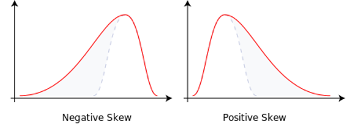
上图中，左边是向左偏、偏度<0，右边是向右偏、偏度>0（看尾巴）
<font color=red>注意，当偏度=0时仅能说明对称分布，不能说明正态性</font>


**变异系数**
$$CoV=\frac{\sigma}{\mu}\times 100\%=\frac{\mathcal{s}}{\mathcal{m}}\times 100\%$$
用途：  

1. 比较不同数据集的离散程度
2. 无量纲
缺点：当均值接近0时不好用  


<details>
    <summary>python代码click</summary>
    import scipy.stats as stats  <br>
    stats.skew() 求偏度 <br>
    stats.kurtosis(data, fisher=True) 求峰度 <br>
    stats.variation() 求CoV
</details>


## 4 均值的比较

### 4.1 置信区间 confidence interval(CI)

#### 4.1.1 单样本

##### 4.1.1.1 单样本总体方差已知，用Z分布

对正态总体或近似正态总体，有
$$\frac{\overline{x}-\mu}{\sigma / \sqrt{n}}\sim N(0,1)$$
若要求置信度为$1-\alpha$，则
$$\therefore P(-u_{\frac{\alpha}{2}}<\frac{\overline{x}-\mu}{\sigma / \sqrt{n}}\leq u_{\frac{\alpha}{2}})=1-\alpha$$
$$\Rightarrow \mathsf{CI}_{1-\alpha}=(\overline{x}-u_{\frac{\alpha}{2}}\frac{\sigma}{\sqrt{n}},\overline{x}+u_{\frac{\alpha}{2}}\frac{\sigma}{\sqrt{n}})$$

##### 4.1.1.2 单样本总体方差未知，用t分布

$$\frac{\overline{x}-\mu}{s / \sqrt{n}}\sim t(n-1)$$
$$\therefore P(-t_{\frac{\alpha}{2}}<\frac{\overline{x}-\mu}{s / \sqrt{n}}\leq t_{\frac{\alpha}{2}})=1-\alpha$$
$$\Rightarrow \mathsf{CI}_{1-\alpha}=(\overline{x}-t_{\frac{\alpha}{2}}\frac{s}{\sqrt{n}},\overline{x}+t_{\frac{\alpha}{2}}\frac{s}{\sqrt{n}})$$

#### 4.1.2 双样本

##### 4.1.2.1 双样本是配对的（非独立样本）

**何为配对：**
同一批人的两次成绩差的均值、双胞胎之间的身高差均值等，可以找到配对的双方的量
等价于单样本的分布，参见上方4.1.1

##### 4.1.2.2 两个独立样本，总体方差各自已知

已知$\sigma^2_1,\sigma^2_2$，要求$\overline{x_1}-\overline{x_2}$的置信区间

$$\therefore \overline{x_1}-\overline{x_2} \sim N(\mu_1-\mu_2,\frac{\sigma^2_1}{n_1}+\frac{\sigma^2_2}{n_2})$$

记$\frac{\sigma^2_1}{n_1}+\frac{\sigma^2_2}{n_2}=\sigma^2=sem^2$，称其为$\overline{x_1}-\overline{x_2}$的标准方差，也称标准误差的平方
$$\therefore \frac{(\overline{x_1}-\overline{x_2})-(\mu_1-\mu_2)}{\sigma} \sim N(0,1)$$
$$\Rightarrow \mathsf{CI_{1-\alpha}}=(\overline{x_1}-\overline{x_2})\pm u_{\frac{\alpha}{2}}\sqrt{\frac{\sigma^2_1}{n_1}+\frac{\sigma^2_2}{n_2}}$$

##### 4.1.2.3 两个独立样本，总体方差未知但相等

已知$\sigma^2_1=\sigma^2_2=\sigma^2$，但是多少不知道
使用t分布
$$\therefore \overline{x_1}-\overline{x_2} \sim N(\mu_1-\mu_2, \frac{\sigma^2}{n_1}+\frac{\sigma^2}{n_2})$$
$$\Rightarrow \frac{(\overline{x_1}-\overline{x_2})-(\mu_1-\mu_2)}{\sigma \sqrt{\frac{1}{n_1}+\frac{1}{n_2}}} \sim N(0,1)$$
$$\because \frac{(n_1-1)s^2_1}{\sigma^2} \sim \chi^2 (n_1-1),\frac{(n_2-1)s^2_2}{\sigma^2} \sim \chi^2 (n_2-1)$$
$$\therefore \frac{(\overline{x_1}-\overline{x_2})-(\mu_1-\mu_2)}{\sqrt{\frac{1}{n_1}+\frac{1}{n_2}}\sqrt{\frac{(n_1-1)s^2_1+(n_2-1)s^2_2}{n_1+n_2-2}}} \sim t(n_1+n_2-2)$$
def	$\sqrt{\frac{(n_1-1)s^2_1+(n_2-1)s^2_2}{n_1+n_2-2}}=s_p$，$\overline{x_1}-\overline{x_2}$的标准误差为$sem=s_p\sqrt{\frac{1}{n_1}+\frac{1}{n_2}}$
$$\therefore \frac{(\overline{x_1}-\overline{x_2})-(\mu_1-\mu_2)}{s_p\sqrt{\frac{1}{n_1}+\frac{1}{n_2}}} \sim t(n_1+n_2-2)$$
$$\Rightarrow \mathsf{CI}_{1-\alpha}=(\overline{x_1}-\overline{x_2})\pm t_{\frac{\alpha}{2}}(n_1+n_2-2)s_p\sqrt{\frac{1}{n_1}+\frac{1}{n_2}}$$

##### 4.1.2.4 两个独立样本，总体方差未知且不相等

使用**Welch's t分布**
推导过于复杂，直接给出结论
$$\mathsf{CI}_{1-\alpha}=(\overline{x_1}-\overline{x_2})\pm t_{\frac{\alpha}{2}}(\nu)\sqrt{\frac{s_1^2}{n_1}+\frac{s_2^2}{n_2}}$$
其中$\nu$为t分布的自由度，通常不是整数，用最接近的整数计算，有
$$\nu=\frac{(\frac{s_1^2}{n_1}+\frac{s_2^2}{n_2})^2}{\frac{1}{(n_1-1)}(\frac{s_1^2}{n_1})^2+\frac{1}{(n_2-1)}(\frac{s_2^2}{n_2})^2}$$

### 4.2 零假设检验 Null Hypothesis Significance Test(NHST)

#### <font color=red>NHST注意事项</font>

**含义**
NHST的含义仅仅是<font color=red>$\mathsf{P}(x>\mathsf{Data}|H_0)$</font>  

1. 只反应数据和假设的兼容性
2. 不能推断$H_0,H_1$成立的概率
3. 不能直接回答真正关心的问题：<font color=red>$\mathsf{P}(H_0|\mathsf{Data})$</font>


**统计显著性α不等于实际显著性**

1. n足够大时，尽管差距很小，p仍然可以很小
2. p很小不代表实际差距很大


**常见错误**：

1. p值之间的比较：两组实验组，分别和对照组求p，p=0.04的结果要比p=0.05的结果更显著吗？不
2. 只做了一次实验就不能讲概率

**p值到底反映了什么？**

1. p<0.05，说明两个样本均值差异有显著性（在0假设成立的情况下）
2. p<0.05，说明两个总体均值存在差异的显著性很大？**错误**
3. “认为0假设错误”这个**结论错误的概率**小于p值

#### 4.2.1 NHST与CI的关系

1. NHST的回答比CI**简洁**，只回答Yes or No
2. NSHT没有CI准确，CI还提供大/小多少的信息
3. NSHT要回答的问题**都可以用CI回答**

#### 4.2.2 NHST的推理逻辑

详见概统笔记
1. 先做零假设和备择假设
    * 什么样的假设可以作为零假设
    1. 假设完可以确定枢轴量的分布
    2. 用想要拒绝的做假设
    3. 不能用p不够小来确定其成立
2. 选择枢轴量
3. 根据枢轴量在$H_0$成立时的分布，根据检验方式算概率（p值）
    1. 双边检验：$p=P(|x|\geq|X|)$
    2. 右侧检验：$p=P(x\geq X)$
    3. 左侧检验：$p=P(x\leq X)$
4. 检验p的显著性水平，如果p<α，则拒绝原假设，$H_1$成立

#### 4.2.3 单样本t检验

总体$\sigma^2$未知，使用t分布
拒绝域是同α下CI的**补集**  

<details>
    <summary>python代码click</summary>
    t,p=stats.ttest_1samp(a,b, altenative="two-sided")  <br>
    a,b输入数据，mu是零假设的均值，alternative选择检验方式<br>
    输出t是枢轴量的观测值，p是p值
</details>
#### 4.2.4 双样本t检验

一个错误例子：现有A(mean=12)，B(mean=8)，得到t(29)=xxx，p<.05，认为A的均值显著大于B
错误：只能认为$\mathsf{mean(A)}\neq \mathsf{mean(B)}$，因为做的是双侧检验，无法得出单边结论。<font color=red>存疑</font>


##### 4.2.4.1 配对的样本

配对做差，和单样本相同
<details>
    <summary>python代码click</summary>
    t,p=stats.ttest_rel(a,b,alternative)  <br>
    data输入数据，alternative选择检验方式，默认mu=0<br>
    输出t是枢轴量的观测值，p是p值
</details>

##### 4.2.4.2 独立的样本

和单样本类似的，拒绝域都是相应的α下的CI的补集
<details>
    <summary>python代码click</summary>
    t,p=stats.ttest_ind(data1,data2,equal_val,alternative)<br>
    data1,2是数据输入，equal_var选择方差是否相同，alternative选择检验方式，默认mu=0<br>
    输出t是枢轴量的观测值，p是p值
</details>

### 4.3 对方差分析（ANOVA）

#### 4.3.1 从t检验到ANOVA检验

有n组数据，两两之间做t检验（多重检验），重复m次，假设每两组、每次检验的假阳性（去真错误，第一类）概率为α，那么所有检验结后有假阳性的概率是：
$$P=1-(1-\alpha)^{\mathsf{C}^2_n\cdot m}$$
这是非常大的一个数，所以抛弃多重检验

#### 4.3.2 ANOVA原理

假定分为k组，共N个对象，每组N/k个
ANOVA做F检验，其核心是SST=SSB+SSW(Total=Between+Within)，注意自由度，证明见下

<table>
    <tr>
        <td></td>
        <td>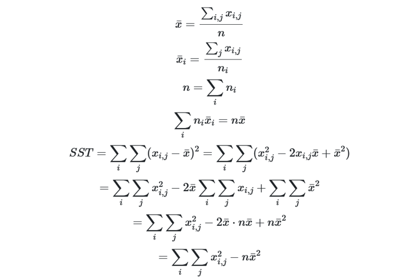</td>
        <td>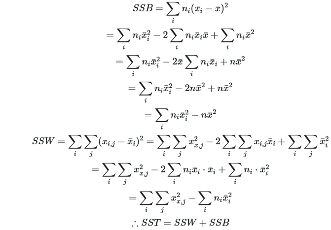</td>
    </tr>
</table>

得到ANOVA的报告表

|Source|SS|df|MS|F|p-value|eta2|
|:----:|:--:|:--:|:--:|:-:|:-------:|:---:|
|Total|SSB+SSW|N-1|/|MSB/MSW|F(k-1,N-k)对应的p|SSB/SST|
|Between|SSB|k-1|MSB|/|/|/|
|Within|SSW|N-K|MSW|/|/|/|

其中MS=SS/df，$\mathsf{F}(df_B,df_W)=\frac{MSB}{MSW}=\frac{SSB/df_B}{SSW/df_W}$
$\eta^2=\frac{SSB}{SST}$，表示SST中有多少是SSB贡献的，也叫effect size

#### 4.3.3 单因素对方差分析 1-Way ANOVA

类似于下面的分组，每组的受试样本都是不一样的，是1-Way ANOVA
|Drug1|Drug2|Drug3|
|:-----:|:-----:|:-----:|
|sub1,sub2,sub3|sub4,sub5,sub6|sub7,sub8,sub9|


类似下面的，每组的受试样本一样的，是1-Way Repeated Measure ANOVA
|Drug1|Drug2|Drug3|
|:-----:|:-----:|:-----:|
|sub1,sub2,sub3|sub1,sub2,sub3|sub1,sub2,sub3|

<details>
    <summary>python代码click</summary>
    import pingouin as pg  <br>
    aov = pg.anova(data=data, dv="dependent variable", between="group", detailed=False, effsize=False) <br>
    dv表示选择对比的数据，因变量；between表示分组；detailed表示是否输出详细信息；effsize表示是否输出eta2 <br>
    上面是1-way anova的<br>
    aov = pg.rm_anova(data=None, dv=None, within=None, subject=None, detailed=False)<br>
    within表示不同的分组，subject表示个体
</details>


**1-way ANOVA, 1-way RM ANOVA条件**  

1. 独立观测
2. 独立样本（1-way）， 重复/配对样本（1-way RM）
3. 正态分布
4. 方差齐性（1-way），球性（1-way RM）  
5. 连续变量
6. 组内随机采样
7. 组间样本量平衡

#### 4.3.4 两两配对比较

当通过1-way ANOVA**拒绝零假设后**，要想确定是哪几组之间的存在显著差异，就要使用Post Hoc多重检验（事后检验）（不使用多重t检验的原因同上）

<details>
    <summary>python代码</summary>
    pt = data.pairwise_tukey(dv="MoodGain", between="Grouop")<br>
    其中dv是因变量，between是分组，上面是1-way的 <br>
    pt = data.pairwise_ttests(dv="Scores",within="Test",subject="Sub_id",padjust="bonf") <br>
    上面是1-way RM ANOVA，不重要
</details>

最后得到的结果是

> ```markdown
>           A         B  mean(A)  mean(B)    diff      se       T  	  p-tukey   hedges  
> 0  anxifree  joyzepam   0.7167   1.4833 -0.7667  0.1759 -4.3596   0.0015   -2.3234
> 1  anxifree   placebo   0.7167   0.4500  0.2667  0.1759  1.5164   0.3117    0.8081
> 2  joyzepam   placebo   1.4833   0.4500  1.0333  0.1759  5.8760   0.0010    3.1315 
>    ```

其中，diff=mean(A)-mean(B)，se是枢轴量的standard error，T是枢轴量观测值，p-tukey是T对应的p值的修正值，hedges不管

#### 4.3.5 2-way ANOVA

**原理**
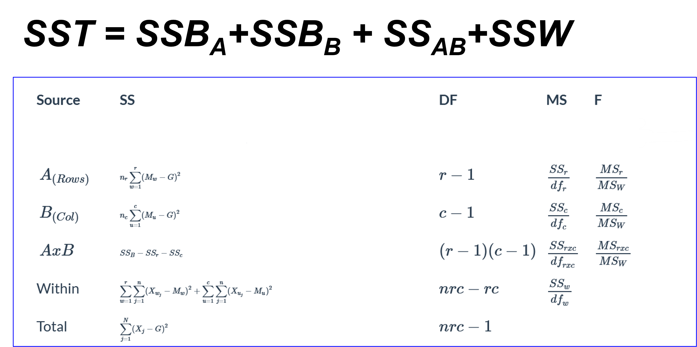

| Gender\DRug |       A        |         B         |
| :---------: | :------------: | :---------------: |
|    male     | sub1,sub2,sub3 |  sub4,sub5,sub6   |
|   female    | sub7,sub8,sub9 | sub10,sub11,sub12 |

当出现上面这种有两个变量时，使用2-way ANOVA，假设是

* H01：Factor1不同水平的均值没有差异
* H02：Factor2不同水平的均值没有差异
* H03：Factor1不同水平的均值差异**与Factor2无关**，即**不存在交互作用**

<details>
    <summary>python代码</summary>
    aov=data.anova(dv='MoodGain', between=["Drug","Therapy"],detailed=True)<br>
    和1-way类似的，只是between中有多个变量<br>
</details>

其报告表如下

>```table
>           Source        SS  	  DF    MS          F     p-unc       np2
>0            Drug  3.453333   2  1.726667  31.714286  0.000016  0.840909
>1         Therapy  0.467222   1  0.467222   8.581633  0.012617  0.416956
>2  Drug * Therapy  0.271111   2  0.135556   2.489796  0.124602  0.293269
>3        Residual  0.653333  12  0.054444        NaN       NaN       NaN
>```

意义和1-way相同，但是算法不同

2-way ANOVA比两个独立的ANOVA具有更高的统计功效（statistic power）,即更容易检测出主效应（很小的p值）
故即使不关心两个变量间的相互作用，也使用2-way ANOVA进行检验


## 5 类别的比较

### 5.1 单个样本比例的置信区间

#### 5.1.1 例子引入

<font color=red>例：某社区有12000人，但只有200个试剂盒，要如何检测社区的感染率？即：如何从样本推断总体比例</font>
一共有200次检测机会，记n=200，N=12000
在一次检测中，测出了m个阳性，那么这组的感染率就是$p_1=\frac{m}{n}$
假设12000中一共有M个阳性，那么很显然$\mathsf{E}(p_i)=\frac{M}{12000}\triangleq p$其中p就是每个人的感染率，即要求的东西
pi的方差满足$D(p_i)=D(m/n)=\frac{p(1-p)}{n}\Rightarrow \sigma_p=\sqrt{\frac{p(1-p)}{n}}$
根据大数定律和中心极限定理，当满足下面的条件时，就有
$p_i \sim N(p,\frac{p(1-p)}{n})$，$p\approx p_i \Rightarrow \sigma_p\approx\sigma_{p_{i}}$
故用$p_i \sim N(p,\frac{p_i(1-p_i)}{n})$，作为枢轴量计算置信区间，得到p的置信区间$\mathsf{CI}_{1-\alpha}=p_i\pm Z_{\frac{\alpha}{2}}\cdot\sigma_{p_i}$

要满足的条件是：

1. n<5%N，即每次抽样的样本数少于总体的样本数的5%（为了保证$p_i$的数量满足中心极限定理）
2. 阳性和阴性数目都不少($np_i>10 , n(1-p_i)>10$)

实际上，这个想法和概统中所说的中心极限是一致的。

假定个体$x_i$，其得病概率p，那么总体中所有患病人数满足$\Sigma x\sim B(N,p)$
根据中心极限定理，有$\Sigma x \stackrel{近似}{\sim} N(Np,Np(1-p))\approx N(Np,Np_i(1-p_i))$
$\therefore p \stackrel{近似}{\sim}N(p,\frac{p_i(1-p_i)}{N})$
此时只需要满足条件2即可

#### 5.1.2 求单样本CI的两种方法

* Simple Asymptotic：即上面的方法
* Simple Asymptotic with **continuity correction**：$\mathsf{CI}_{1-\alpha}=p_i\pm (Z_{\frac{\alpha}{2}}\cdot\sigma_{p_i}+\frac{1}{2n})$

<details>
    <summary>python代码</summary>
    import statsmodels.stats.proportion as proportion <br>
    print(proportion_confint(m,n,alpha,method="normal"))<br>
    其中m是阳性，n是总体，method是检验方式，alpha是置信度（小的）
    上面的计算方法是simple asymptotic
    若想用修正的，则自己算
</details>

### 5.2 多个独立样本的比例差异的统计

**<font color=red>注意，以下的样本必须满足5.1的条件</font>**

#### 5.2.1 差异的置信区间

**原理**
两个独立的正态总体 $X_1\sim N(\mu_1,\sigma^2_1),X_2\sim N(\mu_2,\sigma^2_2)$，枢轴量如前文得到的独立样本的t检验
现在就是将$X_1,X_2$换成$\hat{p_1},\hat{p_2}$，其均值是要求的，方差是用已知估计的
有$\hat{p_1}-\hat{p_2}\sim N(p_1-p_2,\frac{\hat{p_1}(1-\hat{p_1})}{n_1}+\frac{\hat{p_2}(1-\hat{p_2})}{n_2})$
得到枢轴量

**几种算法**

* Pearson's:$\mathsf{CI}=\hat{p_1}-\hat{p_2}\pm z_\frac{\alpha}{2}\cdot \sqrt{\frac{\hat{p_1}(1-\hat{p_1})}{n_1}+\frac{\hat{p_2}(1-\hat{p_2})}{n_2}}$
* Yate's:$\mathsf{CI}=\hat{p_1}-\hat{p_2}\pm (z_\frac{\alpha}{2}\cdot \sqrt{\frac{\hat{p_1}(1-\hat{p_1})}{n_1}+\frac{\hat{p_2}(1-\hat{p_2})}{n_2}}+\frac{1}{2}(\frac{1}{n_1}+\frac{1}{n_2}))$

#### 5.2.2 差异的假设检验

#### 5.2.2.1 两个样本用NHST(zTest)

$H_0:p_1=p_2$，枢轴量如5.2.1所示，做NHST

<details>
    <summary>python代码</summary>
    from statsmodels.stats.proportion import proportions_ztest <br>
    proportions_ztest(m, n, p, alternative="tow-sided")<br>
    上面是单个样本和p比，其中m是阳性，n是总数
    count = [m1, m2]<br>
    nobs = [n1, n2]<br>
    proportions_ztest(count, nobs, alternative="tow-sided") <br>
    上面是双样本
</details>

#### 5.2.2.2 多个样本用RC联表的$\chi^2$检验

<font color=red>例：药物剂量对阳性率的影响</font>

| 症状 | 剂量1 | 剂量2 | 剂量3 |
| :--: | :---: | :---: | :---: |
| 阳性 |  10   |  40   |   5   |
| 阴性 |  90   |  160  |  95   |
| 总计 |  100  |  200  |  100  |

即 $p_1=p_2=p_3$?（H0）

上表格是观测值(Observation)，下面给出当H0成立时的期望人数(Expectation)

| 症状 | 剂量1 | 剂量2 | 剂量3 | 总计 |
| :--: | :---: | :---: | :---: | :--: |
| 阳性 |  10   |  40   |   5   |  55  |
| 阴性 |  90   |  160  |  95   | 345  |
| 总计 |  100  |  200  |  100  | 400  |

由总计一栏计算**如果相等各个计量的人数分布**

| 症状 | 剂量1 | 剂量2 | 剂量3 |
| :--: | :---: | :---: | :---: |
| 阳性 | 13.75 | 27.5  | 13.75 |
| 阴性 | 86.25 | 172.5 | 86.25 |
| 总计 |  100  |  200  |  100  |

得到$\chi^2=\sum \frac{(O_i-E_i)^2}{E_i}$，其自由度$df=rc-1-r-c=(r-1)(c-1)$，其中r,c分别是行数、列数(不包括总计)，上例中df=(3-1)(2-1)=2
由于仅当H0成立时上式才服从卡方分布，故可以做检验

效应量Cramer‘s V($\varphi_c$)
$V=\sqrt{\frac{\chi^2}{N\cdot\min(r-1,c-1)}}$，其中N是样本量，V表示变量对因变量的关联性强弱

**Rules of thumb:** 
V∈[0.1,0.2]: 弱关联，V∈[0.2,0.5]: 中等关联，V>0.5: 强关联

**RC联表卡方检验的条件**

* 各个单元格**独立观测**

* 2x2表：
  1. $E_i\geq10$
  2. $5\leq E_i< 10$，使用Yate's correction（仍是卡方检验）
  3. $E_i<5$，使用Fisher's Exact Test（不是卡方检验）
* 大于等于2x3表：
  1. E<5的单元格小于20%
  2. 可以合并几列再做

<details>
    <summary>python代码</summary>
    import scipy.stats as stats<br>
    data必须是一个RC联表DataFrame<br>
    chi2, p, dof, expected = stats.chi2_contingency(data) <br>
    chi2是卡方值，p是对应的p，dof是自由度，expected是一个RC联表，返回期望值<br>
    V自己算
</details>

### 5.3 计数数据的卡方检验：Goodness of Fit

<font color=red>例：五个班级的流感人数分布是否均匀</font>

|    班级     | 1    | 2    | 3    | 4    | 5    |
| :---------: | ---- | ---- | ---- | ---- | ---- |
| 观测值(Obs) | 8    | 10   | 12   | 7    | 13   |

先列出预期值

|    班级     | 1    | 2    | 3    | 4    | 5    |
| :---------: | ---- | ---- | ---- | ---- | ---- |
| 观测值(Obs) | 8    | 10   | 12   | 7    | 13   |
| 预期值(Exp) | 10   | 10   | 10   | 10   | 10   |

类似于RC联表的卡方检验，就是验证Obs和Exp是否同分布

原理是$\chi^2=\sum_\limits{i=1}^c\frac{(O_i-E_i)^2}{E_i}$，df=c-q-1，其中c是样本数，q是列出预期值所需的**由样本推出的**未知量，1是为了保持总体不变

本例中df=5-1=4，q=0，本例只用到了总体不变

APA报告格式：通过XXX检验，感染人数的分布显著服从/不服从XX分布，$\chi^2(df,N)=$xx,p=.xxx
N是总人数（不是班级数）

<details>
	<summary>python代码</summary>
    stats.chisquare(f_obs,f_exp,ddof=q)<br>
    其中f_obs是观测值，f_exp是预期值，q是上面q
</details>
<font color=red>正态分布的例子</font>


选取每个区间的中间值作为代表值，构造观测值数组count
如果认为应该服从$N(\mu,\sigma^2)$，通过观测值计算，即$\mu=\mathsf{mean(Count)},\sigma=s$，此时q=2
根据每组差值计算此时正态分布的$E_i$，即$E_i=(\Phi(u_i)-\Phi(u_{i-1}))\times N$，再加上两头的
用$O_i和E_i$构造$\chi^2$

如果认为服从$N(1,8)$，那么此时q=0，因为没用样本观测值，$\mu=1,\sigma=2\sqrt{2}$

<font color=red>例：如下图</font>


（1）能，使用GoF卡方检验，Exp是分布均匀，故df=50-1=49

​		   或者，使用RC联表卡方检验，df= (50-1)(2-1)=49

（2）能，划分一个区间，往里用计数的方法，如上例，分为n组，df=n-2-1

（3）能，此时认为50年前测得的数据为Exp，50年后测得的数据为Obs

​			$\chi^2=\sum_\limits{i=1}^{50}\frac{(O_i-E_i)^2}{E_i}$，由于此时的Exp和Obs总数无关，df=50，不需要-1

### 5.4 判断服从正态分布的方法

print(stats.skew(data))					%偏度
print(stats.kurtosis(data))		      %峰度
print(stats.shapiro(data))			   %NHST
fig = sm.qqplot(data, stats.norm,line='s')		%QQplot
以及卡方检验（最准确）


## 6 两个、多个变量之间的关系

### 6.1 相关性分析

#### 6.1.1 协方差

某个样本有两个变量，记为$X,Y$，其观测值记为$x_i,y_i$，则$x,y$的协方差为
$\text{cov}(x,y)=\frac{\sum_{i}(x_i-\overline{x})(y_i-\overline{y})}{n-1}$，n-1是无偏估计
注意在概统中曾经提过的协方差$\text{cov}(X,Y)=E(\sum_i(X_i-\overline{X})(Y_i-\overline{Y}))$是总体的，所以不除$n-1$

<details>
    <summary>python代码</summary>
    data是一个dataFrame<br>
    data[["obj1","obj2"]].cov()
</details>

很显然$cov(2x,2y)=4cov(x,y)$，即协方差受量纲的影响，为了解决这个问题，使用相关系数

#### 6.1.2 相关系数

**以下三个相关系数，只需且只能算一个**

##### 6.1.2.1 Pearson's linear(Pearson 相关系数)

$r_{x,y}=\frac{cov(x,y)}{s_x\cdot s_y}=\frac{\sum_i(x_i-\overline{x})(y_i-\overline{y})}{\sqrt{\sum_i(x_i-\overline{x})^2\sum_i(y_i-\overline{y})^2}}$
其中$\sigma$是各自的样本方差，除以样本方差后变为无量纲的量

经验上将$|r|$分为以下三类

1. 0.1~0.3, Small
2. 0.3~0.5, Medium
3. $>$0.5, large

r对outlier很敏感，r是数据分布**是否线性**的判断；r=0仅能说明线性关系弱，不是没有关系

<details>
    <summary>python代码</summary>
    r, p = stats.pearsonr(data.obj1, data.obj2)<br>
    返回两个量，r是相关系数，p是对相关系数做r=0的NHST的p<br>
    data.corr(method="pearson")<br>
    对整个dF求相关系数
</details>

##### 6.1.2.2 Spearman's $\rho$

使用情况：

1. X,Y不是数值，而是一个排序的变量，**or**
2. X,Y没有明显的线性关系

首先将原始的$(x_i,y_i)$排序，用排序后的顺序作为新的值，带入$r_{x,y}$的公式计算
用于评估单调关系

<font color=red>例：X[5,2,8,1,4];Y[10,4,12,3,8]</font>
首先排序，得到新的:R[3,2,5,1,4];S[4,2,5,1,3]，对应的$(r_i,s_i)$不变
如果有相同的，就并列，如R[1,2,2,4,5]
而平均值就是排序后正常计算的平均值，用新的数组带入上述公式

def 	$d_i=R_i-S_i$，则有
$\rho=1-\frac{6\sum_id_i^2}{N(N^2-1)}$，其中N是样本观测量，上例中N=5，和上式计算结果一致

<details>	
    <summary>python代码</summary>
    r, p = spearmanr(data.obj1, data.obj2)<br>
    返回两个量，r是相关系数，p是对相关系数做r=0的NHST的p<br>
    data.corr(method="spearman")<br>
    对整个dF求相关系数
</details>

##### 6.1.2.3 Kendall's $\tau$

使用情况：

1. X,Y不是数值，而是一个排序的变量，**or**
2. X,Y没有明显的线性关系

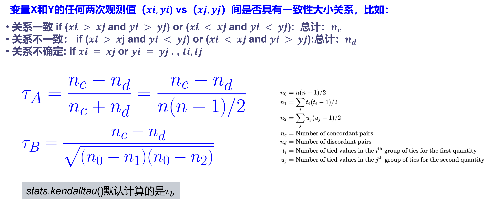

<details>
    <summary>python代码</summary>
	r, p = kendalltau(data.obj1, data.obj2)<br>
    返回两个量，r是相关系数，p是对相关系数做r=0的NHST的p<br>
</details>

#### 6.1.3 相关系数的置信区间估计，NHST

用样本观测值得到的样本相关系数，可以推测总体相关系数的区间
实际上为了得到总体的相关系数也只能这么做
使用Fisher-z变换修正偏度，得到以下表格

|                   |                     Fisher-z                     |                        CI of z                        |                          CI we need                          |
| :---------------: | :----------------------------------------------: | :---------------------------------------------------: | :----------------------------------------------------------: |
|    Pearson’s r    |      $z_r=\frac{1}{2}\ln{\frac{1+r}{1-r}}$       |       $z_r\pm z_{\alpha/2}\sqrt{\frac{1}{n-3}}$       | $r_L=\frac{e^{2z_{L}}-1}{e^{2z_{L}}+1},r_U=\frac{e^{2z_{U}}-1}{e^{2z_{U}}+1}$ |
| Spearman's $\rho$ | $z_{\rho}=\frac{1}{2}\ln{\frac{1+\rho}{1-\rho}}$ | $z_\rho\pm z_{\alpha/2}\sqrt{\frac{1+\rho^2/2}{n-3}}$ | $\rho_L=\frac{e^{2z_{L}}-1}{e^{2z_{L}}+1},\rho_U=\frac{e^{2z_{U}}-1}{e^{2z_{U}}+1}$ |
| Kendall's $\tau$  | $z_{\tau}=\frac{1}{2}\ln{\frac{1+\tau}{1-\tau}}$ |   $z_\tau\pm z_{\alpha/2}\sqrt{\frac{0.437}{n-4}}$    | $\tau_L=\frac{e^{2z_{L}}-1}{e^{2z_{L}}+1},\tau_U=\frac{e^{2z_{U}}-1}{e^{2z_{U}}+1}$ |

注意，求得的置信区间是**非对称**的

#### 6.1.4 Pearson's r相关分析假设条件

1. 两个连续变量（或近似于连续）
2. 描述**线性**关系
3. 没有异常值outlier
4. **相关性不等于因果性**；p值不反应总体的相关性
5. <font color=red>观测值相互独立</font>

#### 6.1.5 APA报告

Pearson相关分析表明，两个变量之间存在很强/中等/弱/没有线性相关性（r(N)=.30,p<.001,95%CI=[0.15,0.35]）
N是样本观测量

### 6.2 简单线性回归分析

根据样本值，建立一阶线性模型$Y=\beta_0+\beta_1X$，要求XY都是连续变量

实际上，根据有限的样本值得到的样本观测模型为$y_i=b_0+b_1x_i+\epsilon_i$，其中$\epsilon_i$为第i组观测值的误差，$(x_i,b_0+b_ix_i)$为第i组回归值/预测值
<font color=red>注意，每一组样本值都应该**独立**</font>

<font color=red>例：建立物理成绩和数学成绩的简单回归模型，下面的计算结果都是正确的，问哪个说法是正确的</font>

1. 某同学，数学80分的，建议推断其物理成绩是80分
2. <font color=red>数学成绩为80分的同学，物理平均分为82分</font>
3. 可以通过提高数学成绩，来提高物理成绩
4. 一组学生经过训练，数学成绩提高5分，则平均物理成绩提高约4.5分
5. <font color=red>数学成绩平均为90分的学生比数学成绩平均80分的学生，物理成绩平均高9分</font>

正确的是标红的；不能推断单个；不能推断一个样本的变化

#### 6.2.1 估计样本回归模型

为了得到$y=b_0+b_1x$，需要进行线性拟合，这里使用最小二乘法(Ordinary Least Square)
预测值$\hat{y_i}=b_0+b_1x_i$，误差$\epsilon_i=y_i-\hat{y_i}=(y_i-b_0-b_ix_i)$
def 	样本整体预测误差(sum of squared errors)$\text{SSE}=\sum_i(y_i-\hat{y_i})^2$
$b_0,b_1$要使得SSE最小，则$\frac{\part\text{SSE}}{\part b_0}=\frac{\part\text{SSE}}{\part b_1}=0$
$\Rightarrow b_0=\bar{y}-b_1\bar{x},b_1=\frac{n\sum_i{x_iy_i}-\sum_ix_i\sum_iy_i}{n\sum_ix_i^2-(\sum_ix_i)^2}=\frac{\text{COV(x,y)}}{\text{D}(x)}$
注意$b_i$的第二种算法使用的是计算总体的方法，即$/n$而非$/(n-1)$，当然用样本的计算结果是一致的

得到样本回归模型$y=b_0+b_1x$，注意这只能表示观测对象和自变量的关系，**对观测值不适用**

#### 6.2.2 总体模型

由样本推总体无非是CI和NHST

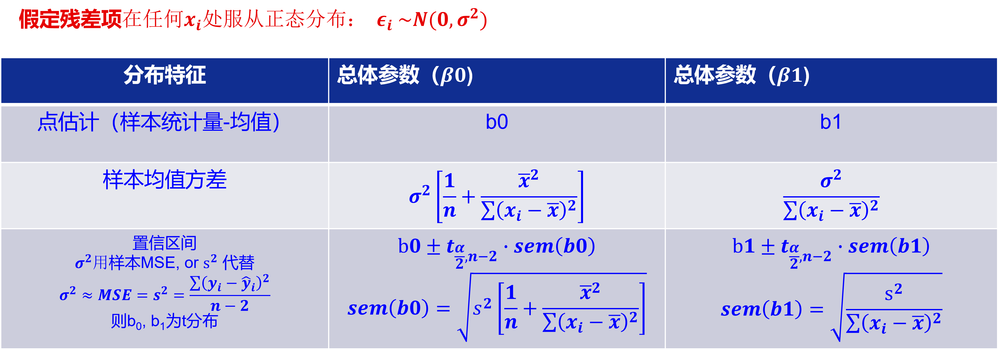

得到$\beta_0和\beta_1$的CI，注意t分布的自由度是n-2，因为使用样本估计了方差（n-1-1）

<details>
    <summary>python代码</summary>
    LR = stats.linregress(data.obj1,data.obj2)<br>
    在残差正态性下，依次输出<br>
    slope，斜率，即b1<br>
    intercept，截距，即b0<br>
    rvalue，两个变量的r相关系数<br>
    pvalue，b1=0做NHST得到的p<br>
    stderr，b1的标准误差，不是标准差<br>
    intercept_stderr，b0的标准误差<br>
</details>

为了使X=0时的Y有意义，即为了x=0时截距有意义，一般会将X做随机变量中心化，此时截距的意义就是X为平均值时的Y值；做随机变量标准化是为了解决量纲的影响

#### 6.2.3 模型误差估计

##### 6.2.3.1 均值CI(CIB)

每个观测值x处，对应的y（多个）的均值$\hat{y}$的CI，有$\hat{y}_{ci}=\hat{y}\pm t_{\alpha/2}(n-2)\cdot \sqrt{MSE}\cdot \sqrt{\frac{1}{n}+\frac{(x-\bar{x})^2}{\sum_i(x_i-\bar{x})^2}}$
其中$MSE=\frac{\sum(y_i-\hat{y_i})^2}{n-2}$

注意这是$\hat{y}$在x处的CI

##### 6.2.3.2 观测值CI(PIB)

每个观测值x处，对应的观测值y的CI，有${y_{pi}}=\hat{y}\pm t_{\alpha/2}(n-2)\cdot \sqrt{MSE}\cdot \sqrt{1+\frac{1}{n}+\frac{(x-\bar{x})^2}{\sum_i(x_i-\bar{x})^2}}$
MSE见上

<details>
    <summary>python代码</summary>
    import statsmodels.formula.api as smf<br>
	model = smf.ols("Height~Weight", data=data)<br>
	results = model.fit()<br>
    其中results.summary()函数会给出报告
</details>
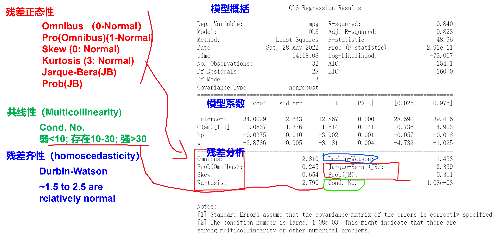

当共线性很强（残差线性相关）时，模型不能用来解释变量之间的关系（拟合地不好），但是仍然能用于预测数值
NHST的零假设是bi=0；当残差的方差过大时，模型不能用来预测，但是解释的效果可以

#### 6.2.4 一阶线性回归模型的假设

1. X，Y都是连续变量
2. Y随X线性变化
3. 残差正态性，$\epsilon \sim N(0,\sigma^2)$
4. 所有数据i.i.d.
5. 自变量在同一个level上

#### 6.2.5方差分析

定义$SST=\sum_i(y_i-\bar{y})^2=\sum_i(y_i-\hat{y_i}+\hat{y_i}-\bar{y})^2=\sum_i(y_i-\hat{y_i})^2+\sum_i(\hat{y_i}-\bar{y})^2+2\sum_i(y_i-\hat{y_i})(\hat{y_i}-\bar{y})$
当满足OLS时，第三项=0，定义$SSR=\sum_i(\hat{y_i}-\bar{y})^2$，$SSE=\sum_i(y_i-\hat{y_i})^2$
故$SST=SSR+SSE$，SSR是自变量能解释的SS，SSE是自变量不能解释的SS(Error)
定义$R^2=\frac{SSR}{SST}=1-\frac{SSE}{SST}$
代入定义式有$R^2=\frac{\sum_i(\hat{y_i}-\bar{y})^2}{\sum_i(y_i-\bar{y})^2}$，又$\hat{y_i}=b_1x_i+b_0$，最终得到$r(x,y)=\pm\sqrt{R^2}$
又有$r(x,y)=\frac{\text{COV}(x,y)}{\sqrt{\text{D}(x)\text{D}(y)}},b_1=\frac{\text{COV}(x,y)}{\text{D}(x)}$
$\therefore b_1=r(x,y)\cdot\frac{\sqrt{\text{D}(y)}}{\sqrt{\text{D}(x)}}$
当然用样本方差也行，因为n都除掉了，实际上r使用样本的量来计算得到的结果也是一致的

故可以根据两个变量的均值，方差，R2来估计线性回归模型
**R2越大，模型预测越准确**

### 6.3 多元线性回归模型(MLR)

连续的观测量与多个因变量的关联：$SBP_i=b_0+b_1x_{1i}+b_2x_{2i}+\ldots+\epsilon_i$，线性指的是系数（bi）是线性的，而非自变量，如$y=b_0+b_1x+b_1x^2$也是线性回归模型

而一般线性回归模型（GLM）通常还有一个类别变量

同样的，MLR也是用最小二乘法估计

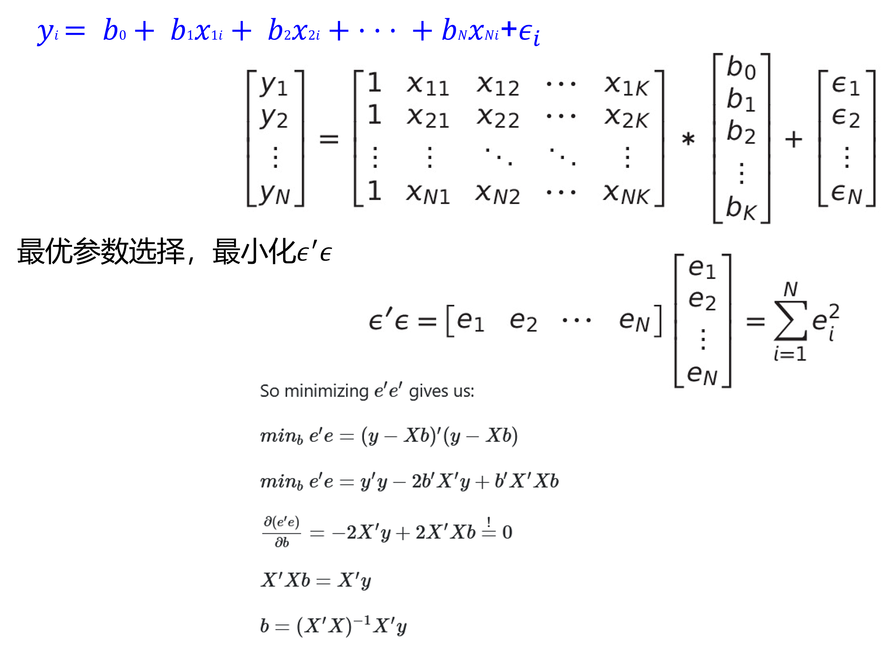

这也导致outlier的干扰很大

<details>
    <summary>python代码</summary>
    model = smf.ols("Height~Weight+GymTime", data=data)<br>在这里用+连接自变量
	results = model.fit()<br>
	print(results.summary())<br>
    报告格式和一阶模型一致
</details>
#### 6.3.1 MLR系数解释

* 无交互作用，$y=b_0+b_1x_1+\ldots+b_nx_n$

在解释系数时，不能说单个样本的变化，而是总体的差异

报告给出的t检验的$H_0:b_i=0$，即因变量和这个因素无关

* 存在交互作用，$y=b_0+b_1x_1+b_2x_2+b_3x_1x_2$

$b_1,b_2$的涵义变化为**其他自变量为0时**，该变量的影响
$b_3$可以这么看：$y=b_0+b_1x_1+(b_2+b_3x_1)x_2$
即x2的系数与x1有关，在不同的x1水平下，x2对y的作用存在变化，**$x_1,x_2$存在交互作用**
b3可以认为是两组差异的差异

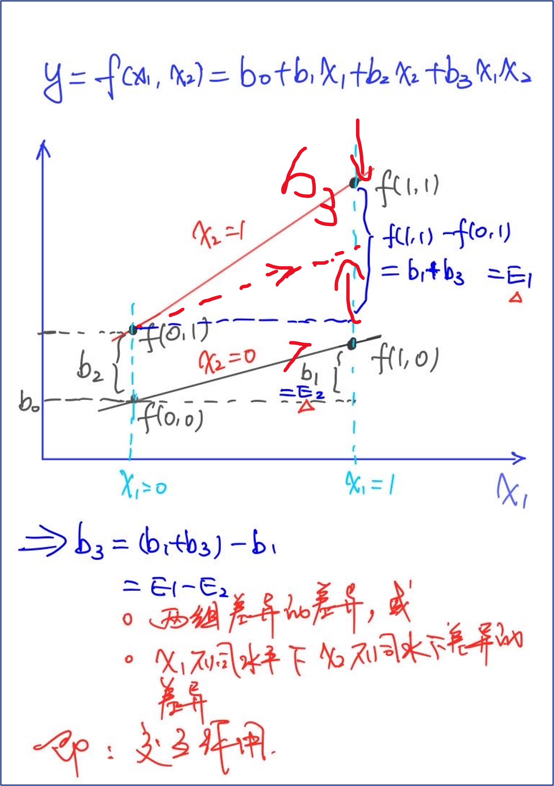

如要说明某种新药的显著性，也是用上面的方法
即枢轴量**不使用$f(1,1)-f(1,0)$，而使用$b_3=[f(1,1)-f(0,1)]-[f(1,0)-f(0,0)]$，即差异的差异**
这也说明，如果两条线不平行，那么说明可能存在交互作用

#### 6.3.2 模型评价

##### 6.3.2.1 残差特性

类似于6.2.3.2

好的模型，残差特性有

1. 正态分布性：
   * Jarque-Bera检验的零假设是数据服从正态分布，备择假设是数据不服从正态分布
     它基于样本的skewness和kurtosis来进行检验
2. 自相关性弱：残差的值是否独立，是否有$\epsilon_{i}=f(\epsilon_{i-1})$，不是一般意义上的两个变量相关
   * 当Durbin-Watson统计量接近2时(1.5~2.5)，表示残差不存在自相关性（即残差之间相互独立）
   * 当Durbin-Watson统计量接近0或4时，表示存在正向或负向的自相关性

3. 共线性弱：即残差之间线性无关；当残差共线性强时，说明模型漏了某些解释变量

4. 方差齐性：数据不是喇叭口状的，在x不同水平下残差的范围比较一致

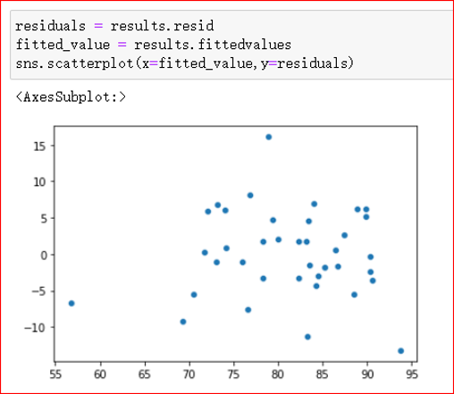

好的残差分布，已经归一化

##### 6.3.2.2 总体评价

包括$R^2$，Adjusted $R^2$，AIC，BIC，F-value，P-value

$R^2=\frac{SSR}{SST}=1-\frac{SSE}{SST},R^2_{adj}=1-\frac{(1-R^2)(n-1)}{n-p-1}$
其中n为样本大小，p为自变量个数
当自变量数量变多，Adj R2会减小，模型存在过拟合风险

**模型总体的显著性为F-value**

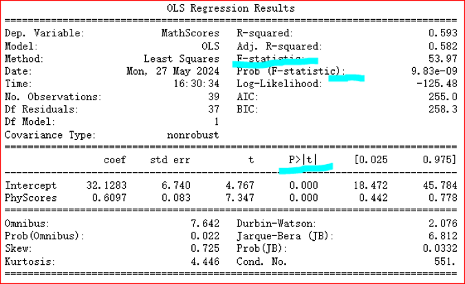

R2是服从F分布的，自由度不用管，**F-value是优先于T-value**的，当模型的F-value不足时，t的P值再显著，也不太有效，t的P值是H0：bi=0的NHST检验值

**AIC与BIC**

AIC从预测角度，表明模型对**未知数据的预测程度**，**AIC越小**，意味着模型更简洁和精确

BIC从拟合角度，表明模型对**当前数据的拟合程度**，**BIC越小**，意味着模型更更简洁

#### 6.3.3 模型汇报

最好用表格

文字的APA：
Social support significantly predicted depression scores（bi= -.34, t(225) = 6.53, p< .001）

也要汇报R2，F，p
Social support also explained a significant proportion of variance in depression scores（R2 = .12, F(1, 225) = 42.64,p< .001）

如果模型有显著的交互作用，主效应的解释要谨慎，因为主效应**可能是交互作用引起的**

模型描述的变量间的关联性，**避免把结果解释成因果性**

大的R2值不一定好的模型，同样小的R2不一定是差的模型

#### 6.3.4 实际使用的优化方法

**数据可视化**：pairplot/scatterplot/jointplot, 发现存在相关性的变量（predictors)

**物理原理**/**实际问题**：根据实际问题选取存在相关性的变量

**数据驱动的模型选择（比较常用，但需要谨慎）**

* Stepwise 选择： 增、减变量，观察AIC/BIC，$R_{adj}^2$值的变化，朝增加$R_{adj}^2$方向, AIC/BIC减小的方向选择

**模型评价**：看残差特征


## 7 复习

### 7.1 总论

<font color=red>例：以下说法全错</font>

均值95% 置信区间包含大约95%的观测值	

总体均值落入95%置信区间的概率是95%		<font color=red>正确的是有95%的信心，即对这个方法，不是对单个区间</font>

t检验的p<0.05,说明零假设成立的概率小于5%		<font color=red>仅仅一次不能说概率</font>

t检验的p<0.001,说明对照组和实验组来自的均值差异较大		<font color=red>统计显著性不是实际显著性</font>

Pearson 相关分析，得到r=0.8,p<0.05,说明两个变量存在强相关性

Pearson 相关分析，得到r=0.05,p>0.5,说明两个变量关联性很弱，或者不存在关联性		<font color=red>没有线性关系</font>

简单线性模型y=1+1.5x,说明如果自变量x增加1个单位，因变量y增加1.5		

简单线性模型y=1+1.5x,说明如果自变量x增加1个单位，因变量y均值增加1.5		<font color=red>**增加**都是指同一个观测对象</font>

如果对照组和实验组在干预前不具有显著差异(p>0.05)，在干预后具有显著性差异(p<0.01)，可以推断干预有效	<font color=red>要比差异的差异，见6.3.1</font>

血压研究实验，把50只动物随机分配到对照组和实验组，每组25只动物，实验完成后想知道对照组(n=25)动物血压是否高于实验组动物(n=25)的血压均值，可以用单边t-检验		<font color=red>这是检验总体是否高于的方法，如果是对照组和实验组，则是样本，直接算就行</font>

实验分成三组(对照组，低剂量组，高剂量组)，统计检验发现对照组和低剂量组差异不具有统计显著性(p=0.50),对照组与高剂量组差异具有统计显著性(p=0.01),可以推断高剂量组比低剂量组干预有效		<font color=red>直接比较p不可取</font>


**t-test, ANOVA都可以用线性模型来完成**

### 7.2 第六章

如果一个线性模型得到的R Squared 值为0.95， 说明该模型的正确的可能性很大
<font color=red>错误，单单R2无法说明问题，要综合R2和t检验和其他参数</font>

简单线性回归模型的置信区间带（CIB）比预测区间带（PIB）要窄，并且这两个带在**自变量均值处都最窄**
正确

多元线性回归模型，某自变量的系数如果不显著（比如p=0.4),  说明该系数可以从模型中去掉
<font color=red>错误，要综合考虑</font>