# 医学物理导论笔记

## 1. X射线及医学应用

重点： 
__X射线的产生__
**X-CT的成像原理**

X射线是一种高频、短波的电磁波 
波长：$10-10^{-3}$nm，介于紫外线和$\gamma$射线之间 
频率：$3\times10^{16}-3\times10^{20}Hz$，约为可见光103倍

### 1.1 X射线的产生

一般方法：**高速运动的电子受阻**会辐射X射线 
产生条件：电子源、标靶、加速电场、__高度真空__ 
产生装置：X射线管

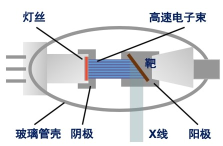  

注意各个装置

实际焦点是电子流在**靶面上的撞击面积**（与大小和灯丝的形状有关） 
实际焦点的**投影面积**为有效焦点 
由于电子能量大部分发热，为了降低靶面温度，多采用**旋转阳极** 
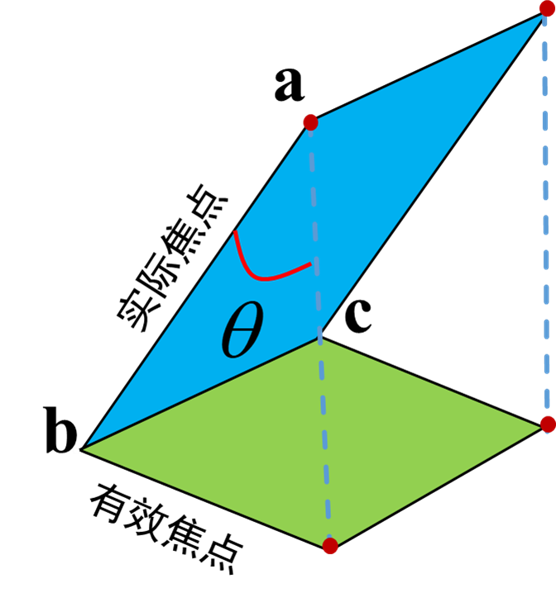  

### 1.2 X射线的性质

**X射线的强度**
*def:能流密度(S)   单位：$W·m^{-2}$* 
$$I=\sum\limits_{i}{N_i\mathcal{h}\nu_i}=N_1\mathcal{h}\nu_1+N_2\mathcal{h}\nu_2+\ldots+N_n\mathcal{h}\nu_n$$ 
$N_i$表示能量为$\mathcal{h}\nu_i$的光子数目  

  

**调节强度** 
调节管电流，即调节N 
调节管电压，即调节$\nu$  

 

**X射线的硬度** 
$\nu$越大，能量越大，贯穿本领越大，X射线越硬 
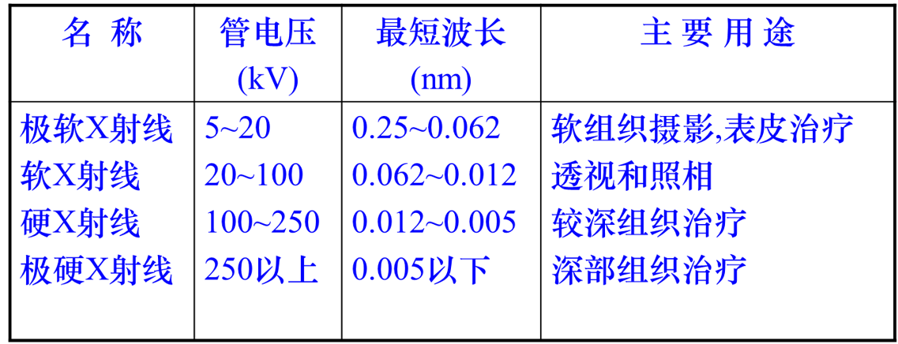
调节管电压可调节硬度  

  

**X射线谱**  
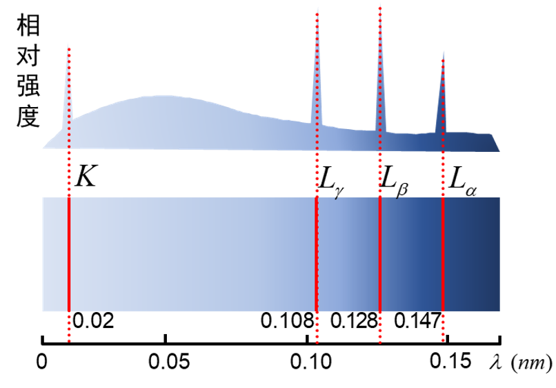

**连续谱产生机制**：电子受靶面制动，动能转化为光子辐射出去，称**韧致辐射** 
由于随机性，宏观上产生了连续的谱线 
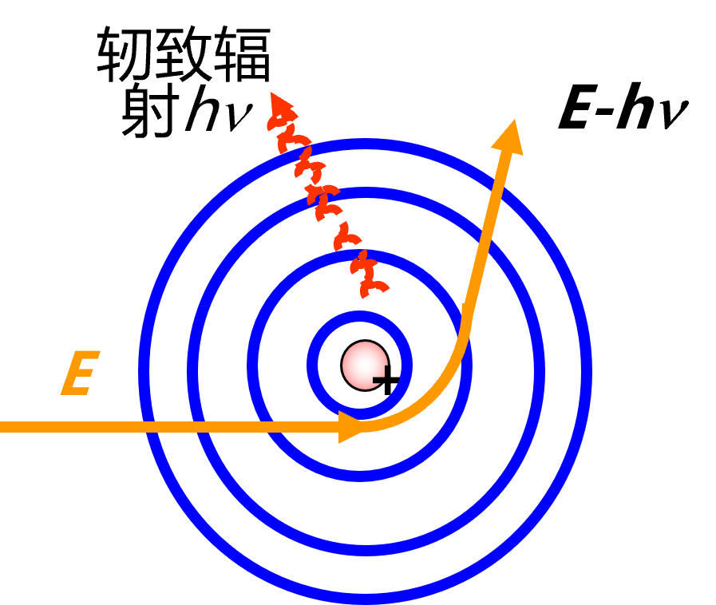  

**连续谱特征** 
$$E=\mathcal{h}\nu=\mathcal{h}\frac{\mathcal{c}}{\lambda}$$
$E_{\max}$就是当电子动能全部转化为辐射能，即$E_{\max}=\mathcal{e}U$ 
$$\therefore \lambda_{\min}=\frac{\mathcal{hc}}{\mathcal{e}U}$$
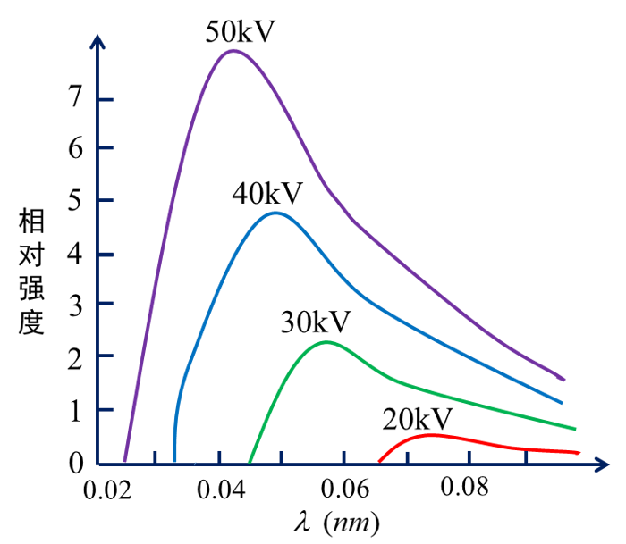 
管电压上升，$\lambda_{\min}$变短；管电流上升，辐射强度变大  

  

**标识谱线的产生**
各能级电子跃迁到**内壳层**得到空位，发出的光子**频率高，波长短** 
但是，医用X射线的能量主要集中于**连续谱**中
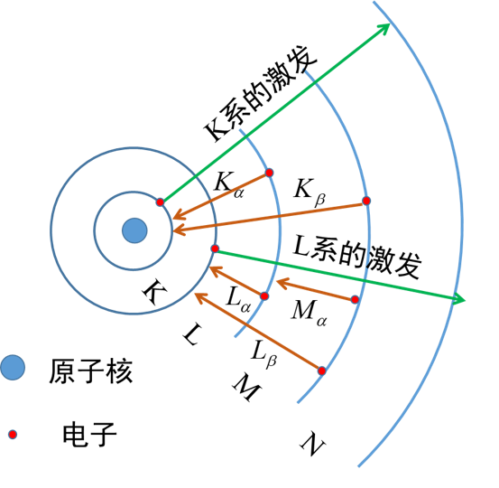  

不同物质，尖峰位置和分布不同；同一物质尖峰位置不随电压变化 
标识谱取决于阳极靶材料，可用于光谱分析
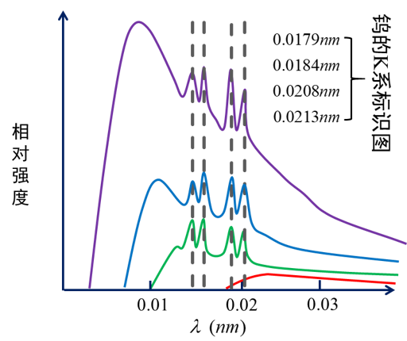  

  

**其他性质**
电离作用：X射线穿过物质时使之电离，是**生物效应的基础** 
荧光作用：打在某些物质上可以产生荧光，是传统X射线透射的基础 
**生物效应**：引起生物组织的多种反应，**放射治疗和辐射防治的基础** 
贯穿效应：**用于X射线透射成像**
光化学效应  

### 1.3 物质对X射线的衰减规律

**单色X射线的衰减规律** 
设$I_0$为入射强度，$I$为透射强度，$\mu$为衰减系数，则有
$$I=I_0\mathcal{e}^{-\mu x}$$
$x$为透射距离  

临床上常用质量吸收系数$\mu_m$和质量厚度$x_m$，以消除密度的影响 
$$\mu_m=\frac{\mu}{\rho}$$
$$x_m=x\rho$$
$$\therefore I=I_0\mathcal{e}^{-\mu_m x_m}$$
物质由液、固态转变为气态时，密度变化很大，**但$\mu_m$值不变**。 
$\mu_m$值可以用来**在物质之间**比较对X射线的吸收本领 

 

**单元素的质量衰减系数**
$$\mu_m=kZ^\alpha\lambda^{3}$$
Z为吸收物质的原子系数，$\lambda$为X射线波长 
指数α一般取3-4，与吸收物质和射线波长有关  

**多种元素混合物质的质量衰减系数**
各元素的$\mu_m$按照所含**质量比例计算的平均值** 
吸收物质为**水、空气和人体组织**时，对于医学上常用的X射线，指数α可取3.5 
若是骨骼，则α更大，图像上有明显区别  

### 1.4 X射线在医学诊断中的应用

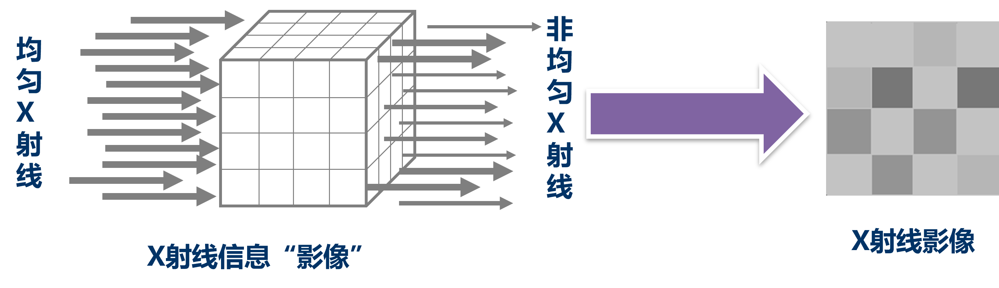  

X射线人体平面成像
  

**造影剂** 
可以提高对比度  

**数字减影血管造影(DSA)** 
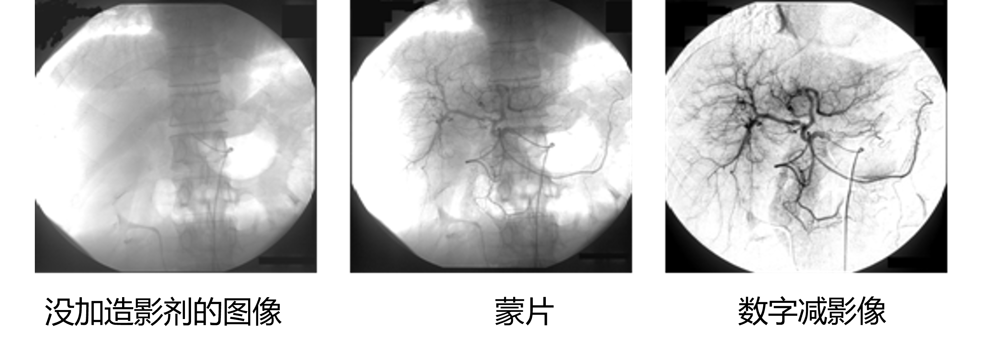  

3=2-1
  
将注射造影剂后的图像减去原先的，就去除了背景，留下血管 

**X-CT**:X射线管环绕人体某一层面扫描  

**X-CT基本原理** 
将欲观测层面分解为$n\times n$个体素的矩阵阵列，求解各个体素的$\mu$值来重建图像
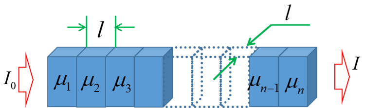 
对于上图，将不均匀介质分成若干体素，有
$$I_1=I_0\mathcal{e}^{-\mu_1 l}$$
$$I_2=I_1\mathcal{e}^{-\mu_2 l}=I_0\mathcal{e}^{-(\mu_1+\mu_2) l}$$
$$I_n=I_0\mathcal{e}^{-l\cdot\sum\limits_{i}\mu_i}$$
$$\therefore \mu_1+\mu_2+\ldots+\mu_n=\frac{1}{l}\ln{\frac{I_0}{I_n}}$$ 

**图像重建的数学方法** 
以下方矩阵为例
$$
\begin{bmatrix}
\mu_{11}&\mu_{12}\\
\mu_{21}&\mu_{22}\\
\end{bmatrix}
$$
在水平方向和竖直方向透射X射线，假定得到
$$p_1=\mu_{11}+\mu_{12}=8$$
$$p_2=\mu_{21}+\mu_{22}=9$$
$$p_3=\mu_{11}+\mu_{21}=10$$
$$p_4=\mu_{12}+\mu_{22}=7$$
注意，上式只有三条独立方程，需要再取一条左对角线的投影
$$p_5=\mu_{11}+\mu_{22}=5$$
解得
$$
\begin{bmatrix}
\mu_{11}&\mu_{12}\\
\mu_{21}&\mu_{22}\\
\end{bmatrix}
=
\begin{bmatrix}
3&5\\
7&2\\
\end{bmatrix}
$$
目前临床使用的X-CT机采用1024×1024等矩阵  

**获取待测介质体素$\mu$值** 
用下图坐标系，绕原点小角度转动 
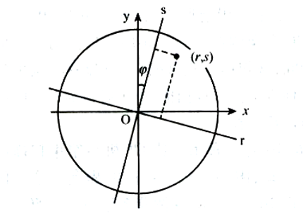 
$$p(\mu,\phi)=\int_{r,\phi}\mu(x,y)\,ds$$  

**重建图像的关键** 
快速多方向测量投影 
快速求解$\mu(x,y)$ 

**X-CT简介** 
第一代：单束扫描，射线管和探测器同步平移和旋转，扫描时间长，成像速度慢 
第二代：**窄**角扇束扫描，射线管和探测器只有旋转，扫描速度快 
第三代：**广**角扇束扫描，射线管和探测器只有旋转，扫描速度快 
第四代：锥形束多排螺旋扫描，非常快 

**CT值和窗口技术** 
X-CT图像由不同灰度的小方块（像素）排列，灰度由CT值决定，有
    $$CT_值=K(\frac{\mu_待-\mu_水}{\mu_水})$$

由于人眼只能分辨16灰度，就有了窗口技术：将感兴趣的部位**对比度增强**，使CT值差别小的组织能分辨 
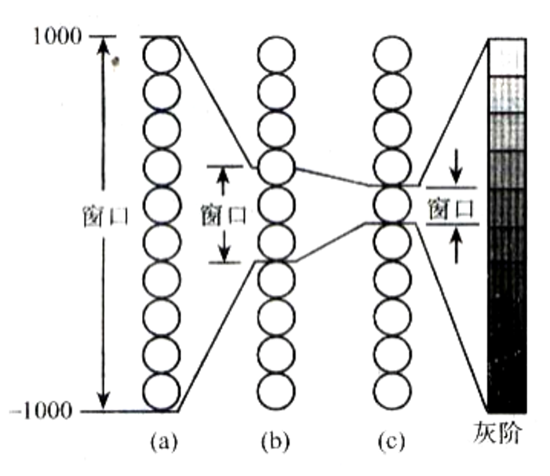 

## 2 原子核及放射性

重点： 
**原子核基本性质，衰变类型原子核衰变规律和应用**
**射线与物质作用的几种形式**

### 2.1 原子核组成

原子核由质子和中子组成，二者统称核子 
原子核质量用u表示，$1u=\frac{1}{12}m(_6^{12}C)$，用其来度量质量时，数值**接近原子核核子数A**  

  

**核素**：确定的质子数、核子数和能量状态的中性原子，用符号表示为$_Z^AX_N$，其中Z为原子序数，A为核子数 
**同位素**：Z相等，A不相等 
**同质异能素**：Z、A都相等，但是能级不同  

  

**原子核大小** 
由经验公式$R=R_0A^{\frac{1}{3}}$可以得到，$R_0=1.2\times10^{-15}$,原子核密度$\rho=\frac{3u}{4\pi R_0^3}\approx=10^{17}kg/m^3$  

### 2.2 原子核的结合能及质量亏损

**质量亏损**： 
设原子核$_Z^AX$质量$m_d$，实验表明，$m_d<Zm_p+(A-Z)m_n$，将$\Delta m=Zm_p+(A-Z)m_n-m_p$称为质量亏损  

  

**原子的结合能**： 
自由核子结合为原子核需要释放的能量，有
$$\Delta E=\Delta m\mathcal{C}^2$$ 
1u对应931.5MeV的能量  

**比结合能**： 
$$\varepsilon=\frac{\Delta E}{A}$$ 
这个值越大，核子结合得越紧密，越稳定 
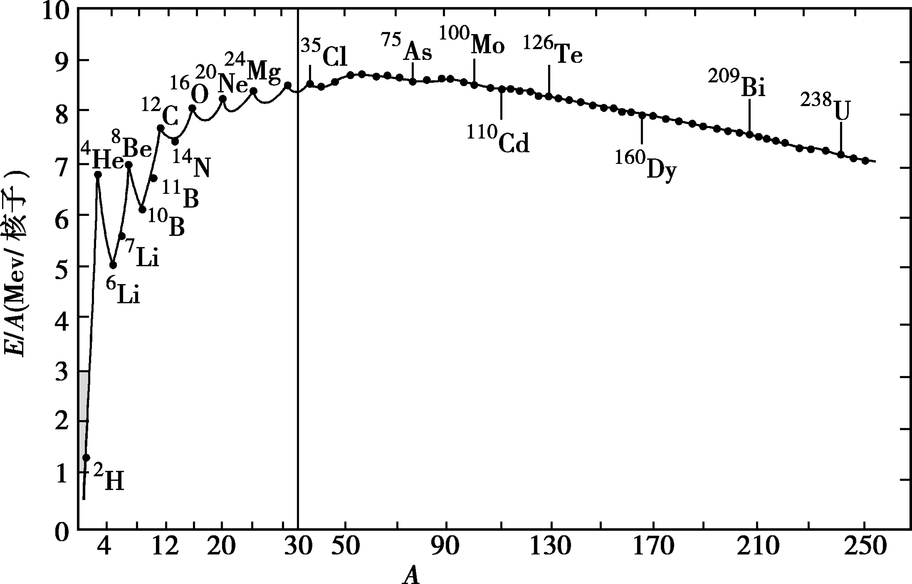 
可见轻核和重核的比结合能小，所以用轻核聚变和重核裂变的方法

### 2.3 原子核的衰变方式及规律

**原子核衰变** 
自发放出射线，变为另一种核素  

**α衰变** 
$$_Z^AX\rightarrow _{Z-2}^{A-4}Y+ _2^4He+Q$$
α粒子就是氦核，发生的前提是A>209，Q是能量 
**特点**：

1. 质量大  
2. 射程短
3. 穿透能力弱
4. 电离能力强  

  

**β衰变** 
分为$\beta^-$、$\beta^+$和电子俘获型,由于有中微子参与，能量将任意分配，所以射线谱是连续的  

**$\beta^-$型**
$$_Z^AX\rightarrow _{Z+1}^AY+e^-+\overline{\nu_e}+Q$$
β射线是电子流，$\overline{\nu_e}$是反中微子 
**特点**  

1. 质量小
2. 射程短
3. 穿透能力强
4. 电离能力弱  

**$\beta^+$型**
$$_Z^AX\rightarrow _{Z-1}^AY+e^++\nu_e+Q$$
由于电子湮灭$e^++e^-\rightarrow 2\gamma+Q$，两个光子相向，能量为0.511MeV，$\beta^+$粒子射程仅1-2mm

**电子俘获型** 
母核俘获一个核外电子而变成子核，并放出中微子 
$$_Z^AX+e^-\rightarrow _{Z-1}^AY+\nu_e+Q$$

  

**γ衰变** 
就是原子核跃迁 
**特点**  

1. 不带电荷
2. 运动速度快
3. 穿透能力强
4. 电离能力弱
* 由3、4，可以发现γ射线适合用于**医学诊断**  

  

**衰变规律**
在dt内发生衰变的原子核数目-dN正比于当前存在的原子核数目N和dt，即
$$-dN=\lambda Ndt \Rightarrow N=N_0\mathcal{e}^{-\lambda t}$$
$\lambda$是衰变常量，$N_0$是初始原子核数   

**半衰期$T$**
又称物理半衰期，由上式可得，当$N=N_0/2$时，解得$T=\frac{\ln{2}}{\lambda}=\frac{0.693}{\lambda}$
可以用半衰期来表示N，即$N=N_0(\frac{1}{2})^{\frac{t}{T}}$  

**生物半衰期$T_b$**
由于各种代谢作用，生物体排除放射性核素的规律  

**有效半衰期$T_e$**
同时考虑半衰期和生物半衰期，有
$$\frac{1}{T_e}=\frac{1}{T}+\frac{1}{T_b}$$
衰变定律改写为
$$N=N_0\mathcal{e}^{-(\lambda_b+\lambda)t}$$
其中$\lambda_e=\lambda+\lambda_b$，分别是有效、衰变、生物衰变常数  

 

**平均寿命$\tau$**
放射性核素平均生存时间，下面是计算方法
即将衰变的dN个核，设其生存了t，则这dN个核的寿命之和有$t(-dN)=t\lambda Ndt$
带入N的表达式，得到所有的核寿命之和$\sum=\int_0^\infty \lambda Nt\,dt=\frac{N_0}{\lambda}$
所以$\tau=\frac{\sum}{N_0}=\lambda^{-1}=\frac{T}{\ln{2}}=1.44T$  

 

**放射性活度**
单位时间内发生衰变的原子核数，记为A，单位为Bq，1Bq=1次衰变/s
$$\therefore A=-\frac{dN}{dt}=\frac{\lambda Ndt}{dt}=\lambda N=\lambda N_0 \mathcal{e}^{-\lambda t}=A_0\mathcal{e}^{-\lambda t}$$
实际上$A_0=N_0\lambda$

例：求5g铀盐（$U_3O_8$）的放射性活度，已知$T_U=4.47\times10^9 a$
解：由$A=\lambda N$可知要求$\lambda$和$N$，$N=N_A \frac{5g}{238g/mol}$，$\lambda=\frac{ln{2}}{T_U}$
注意$\lambda$单位是/s，$T_U$单位是年，$N_A=6.02\times10^{23}$，换算后解得A  

 

**放射性平衡**
许多核素不止衰变一次，称为**级联衰变**
$$A\overset{\lambda_A}{\rightarrow}B\overset{\lambda_B}{\rightarrow}C$$
在这个反应中，$N_A=N_{A_0} \mathcal{e}^{-\lambda_At}$，但在考虑B时，要考虑B和C的反应，有
$$dN_B=N_A\lambda_Adt-N_B\lambda_Bdt$$
结合上面二式，有
$$\therefore N_B=\frac{N_{A_0}\lambda_A}{\lambda_B-\lambda_A}(\mathcal{e}^{-\lambda_A t}-\mathcal{e}^{-\lambda_B t})$$
当$t\rightarrow \infty$时，有
$$N_B\approx N_A\frac{\lambda_A}{\lambda_B-\lambda_A}\approx N_A\frac{\lambda_A}{\lambda_B}$$

当子核的A与母核相近并达到最大值时，称为放射性平衡（对$N_B$求导）
此时将子核分离，又会重新平衡
用这种方法可以由长寿命核素制取短寿命核素，装置为**核素发生器**
如果母核半衰期**远小于子核**，那么一段时间后，母核几乎全部转化为子核，之后子核按自己的方式衰变  

例：对$A\overset{\lambda_A}{\rightarrow}B\overset{\lambda_B}{\rightarrow}C$，问（1）子核何时达到最大（2）一次洗脱子核，再经过多久再次洗脱，得到的产物最多
解：（1）就是对$N_B$求导
（2）有第一题得到$t_1$，代入$N_A=N_{A_0} \mathcal{e}^{-\lambda_At}$得到$N_{A_0}^{'}$，将$N_{A_0}^{'}$替换$N_B$中的$N_{A_0}$，再次求导

### 2.4 射线与物质的相互作用

**激发与电离**
激发：射线使原子电子跃迁
电离：电子跃迁出原子  

**散射和韧致辐射**
散射：射线受原子静电场作用而改变方向
韧致辐射：见上方  

**射程**
射线在物质中运动的路程沿入射方向的投影  

**正电子与物质相互作用**
就是湮灭  

  

**电离比值**
射线使物质每厘米路径上产生的离子对，表示对机体的损伤程度 ，与质量，带电量，速度正相关 

**α粒子**
质量大，速度慢，带电量多  

**β粒子**
质量小，受多次散射速度下降快，会发生韧致辐射
β射线的**能量越高速度越快，但是电离比却越小**
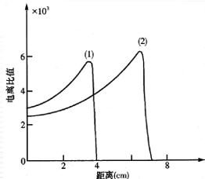
图中1为β，2为α  

  

**射程和吸收规律**
α粒子：电离比大，射程短，在生物体内仅几百微米
β粒子：电离比小，射程长，比α大100多倍；在外照射下危害大

## 3 放射诊断技术

重点
**核素发生器原理级联衰变**
**放射性探测仪器的基本构成和工作原理**
**γ相机、SPECT、PET的显像原理与特点**

### 3.1 放射性核素

**来源**  

1. 核反应堆生产：反应堆的高通量中子流照射靶材料，产生不稳定的核素
2. 医用回旋加速器生产：通过回旋加速器加速带电粒子，撞击靶核后产生
3. 放射性核素发生器生产：从长半衰期核素生产短半衰期核素

### 3.2 核医学仪器

**定义**
在医学中用于**探测和记录**放射性核素发出的射线种类、能量、活度，和其随时间、空间变化的仪器, **不能发射射线**  

  

**分类**  
1. 显像仪器（γ相机、SPECT、PET等）
2. 脏器功能测量仪器  
3. 放射性计数测量仪器
4. 放射性药物合成与分装仪器

  

**仪器的基本构成和工作原理**
基本都由两个模块构成：放射性探测仪（探头）和后续电子单元
探头：使射线在其中发生电离或激发，再将产生的离子（电离）或荧光光子（激发）收集并转变为可记录信电号，实际上是一个将射线能量转化为电能的**换能器**  

  

**固体闪烁计数器**
由下面的部分组成（按顺序）

1. **准直器**：阻挡斜射的射线，便于定位

2. **闪烁晶体**：将射线的辐射能转变为光能（不都是电磁波吗）

3. **光学耦合剂**：减缓折射率变化，有效传递光能

4. **光电倍增管**：将微弱的信号转换成可测量的电信号  

5. **前置放大器**：对信号进行放大跟踪

6. 后续电子电路：得到闪烁的位置和能量信号

7. 记录装置

  

  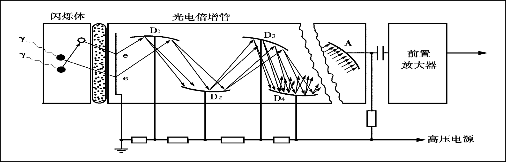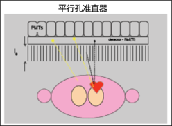  

  

**X射线和γ射线检查的区别**
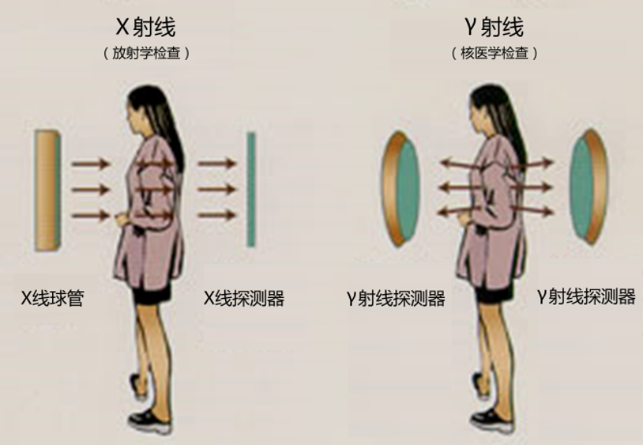

1. 前者属于放射学检查，后者属于核医学检查
2. 前者依靠仪器的射线源穿透人体后的衰减
3. 后者依靠人体事先服用的药物的放射性，仪器收集放射线，测量放射性分布

  

**γ相机的动态显像**
记录放射性分布随时间的变化，得到人体的代谢信息
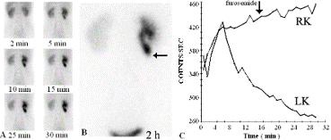

“时间-放射性计数”曲线
  

  

**SPECT**
基本结构
在一台高性能γ相机的基础上增加了探头旋转和图像重建的功能
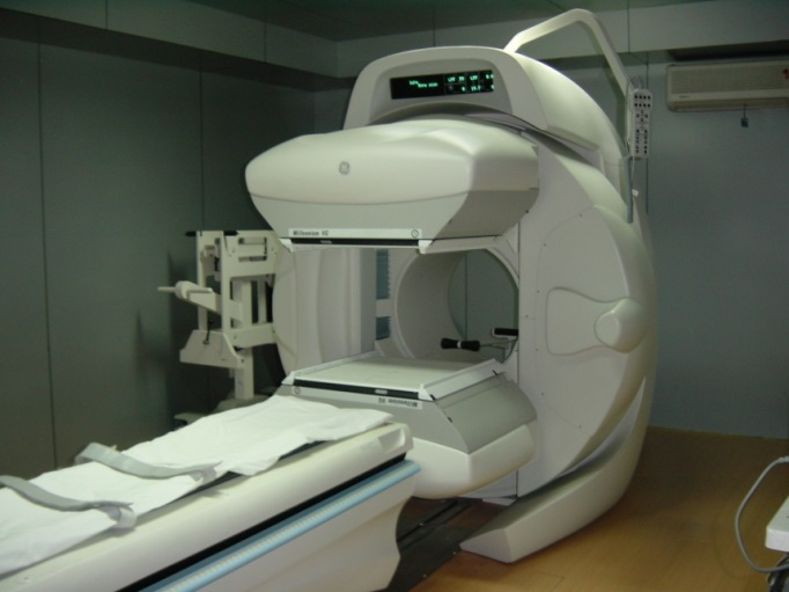

显像特点
断层显像（类似CT）消除了不同层次的放射性的重叠干扰，更加精确
断层图像重建：从已知的每个角度上的平面投影（也就是记录值），求出断层平面内各体素的放射性分布，目前主要两种  

1. 滤波反投影（FBP）：速度快；抗噪声能力差，精确度低；适用于临床实时诊断
2. 有序子集最大期望值（OSEM）:质量高，伪影少；运算量大  

SPECT/CT融合显影
二者有高度互补性。CT可以查看组织分布，无法看病灶；SPECT可以查看异常分布，无法看组织分布。同时CT提供的图像数据还可以用于SPECT的衰减校正（光子被人体吸收但SPECT不能得知衰减），提高图像质量
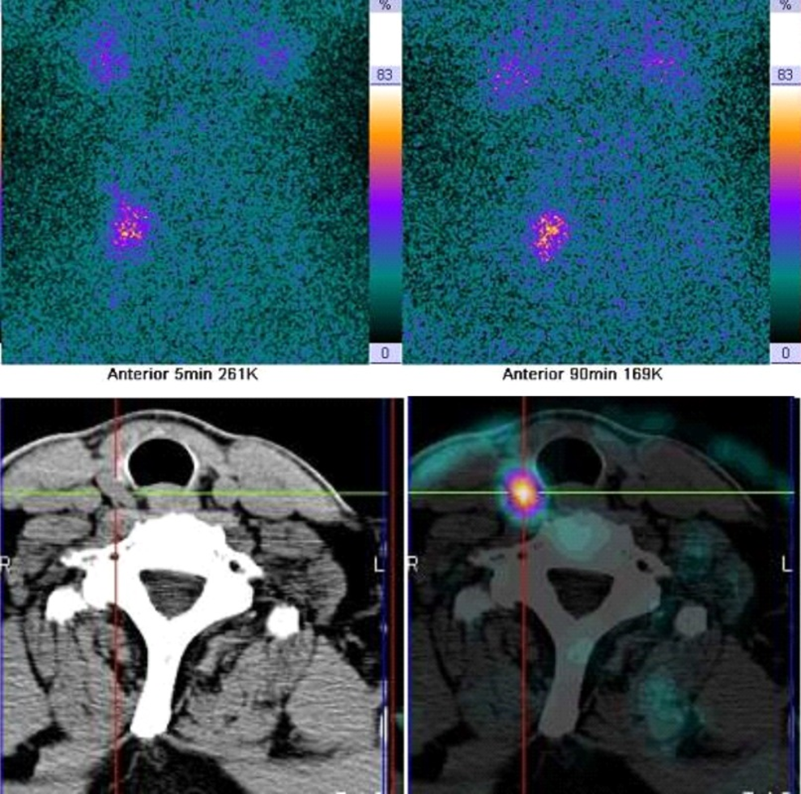

**PET**
显像原理
药物中含有正电子，利用湮灭产生的相对的光子对和两个相对的探测器，通过探测器输出的脉冲的信号来确定闪烁位置的方法称**电子准直**，这种探测方法称为**符合探测**  

数据矫正
由于没有准直器，PET需要很多矫正  

探测器组成
具有保护和光屏蔽的外壳（内有若干晶体+光电倍增管+放大定位电路）组成一个**探测器**，一组探测器组合成**组块**，几个组块组成**探测器组**，若干探测器组组成**探测器环**，若干探测器环排列成**探头**。探头的环数越多，轴向的视野越大，一次扫描可获得的断层面越宽
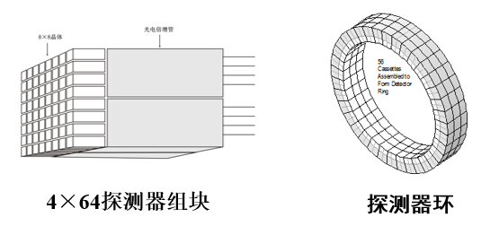

PET/CT融合显影
具有PET和CT的全部功能，很厉害  

  

**脏器功能测定仪**
只关心特定的脏器中药物的放射性浓度随时间的变化，以连续测量计数率为设计目标  

### 3.3 核医学显像技术

**核医学显像特点**  

1. 可同时提供脏器组织的功能和结构变化
2. 定量分析
3. 较高的特异性
4. 安全、无创

  

**不足**  

1. 对组织的分辨率不及其他影像学方法
2. 任何脏器的显像都需要使用显像剂

### 3.4 核医学分子影像

从分子水平动态显示体内各种生命信息
分子影像是精准医学的重要标志
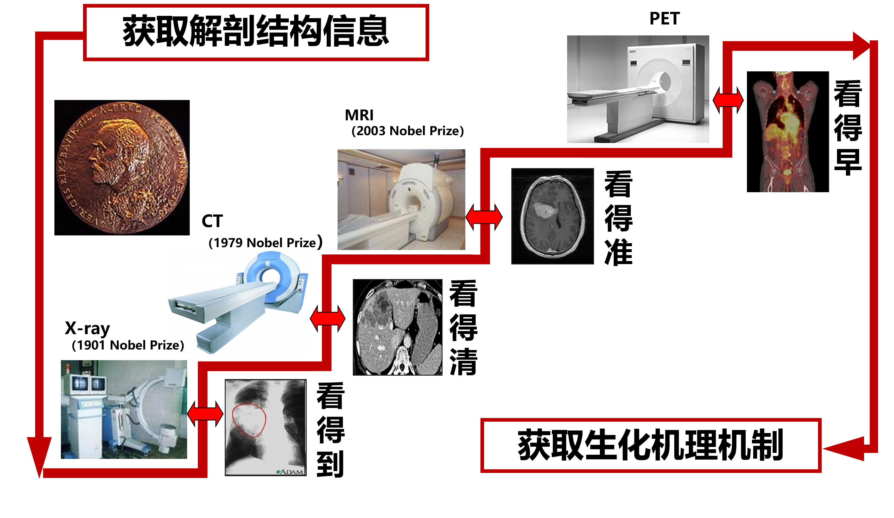

## 4 核磁共振及医学应用

重点
**基本原理**
**成像过程** 

### 4.1 基本原理

**磁场中的磁矩**
环形电流的磁矩$\overrightarrow{\mu}=I\overrightarrow{S}$，单位J/T，其中S为面积，方向与I构成**右手螺旋**关系
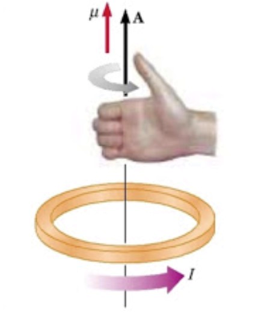

**磁矩在磁场中的能量** 
$$E=-\overrightarrow{\mu}\cdot\overrightarrow{B_0}=-\mu B_0 \cos{\phi},\phi=\langle \overrightarrow{\mu},\overrightarrow{B_0}\rangle$$
式中$B_0$是外加磁场  

**核自旋角动量**
核自旋是量子化的，有
$$P_I=\sqrt{I(I+1)}\hbar$$
其中I是核自旋量子数，有以下规律：

1. 质子数和中子数**都是偶数**，I=0
2. 质子数和中子数有**一个是奇数**，I是半整数（X.5）
3. 质子数和中子数**都是奇数**，I是正整数

**核自旋角动量的空间分量**
也具有量子化的性质，有
$$P_{Iz}=m_I\hbar，m_I=I，I-1,I-2,\ldots,-I$$
$m_I$是自旋磁量子数，共$2I+1$个可能值，z方向为外磁场方向，表明$P_{Iz}$有$2I+1$个可能值  

 

**核磁矩和核自旋的关系**
核磁矩用于描述自旋核在其周围空间所产生的磁场特性，有
$$\mu_I=g_N\frac{e}{2m_p}P_I\triangleq\gamma P_I$$
$$\Rightarrow\mu_I=g_N\frac{e}{2m_p}\sqrt{I(I+1)}\hbar\triangleq g_N\sqrt{I(I+1)}\mu_N$$
其中$g_N$是朗德因子，是常数；$\gamma\triangleq\frac{g_Ne}{2m_P}$是原子核的磁旋比，对于特定的核是常数；$\mu_N=\frac{e\hbar}{2m_P}$为核磁子，是核磁矩的最小单位  

 

**核磁矩的空间量子化**
$$\mu_{Iz}=g_N\frac{e}{2m_P}P_{Iz}=g_N\frac{e}{2m_P}m_I\hbar=m_Ig_N\mu_N$$  

例：下面哪些核可以用于MRI：$^{12}C,^{18}O,^1H,^{19}F,^6Li,^{14}N$
解：用于MRI，则其必须有核磁矩，其量子数不能是零，故前两个不行，后面都可以
**最常用的是$^1H$，人体内含量大，灵敏度高，自旋数=1/2，只有两种取向，探测简单**  

 

**宏观磁矩**
本质是核磁矩从**无序排列变成有序排列**，磁场越强，核磁矩取向越一致，宏观磁矩越大
$$\overrightarrow{M}=\sum_{i=1}^n\overrightarrow{\mu_i}$$  

 

**塞曼效应**
自旋核在磁场中的取向改变和能级分裂
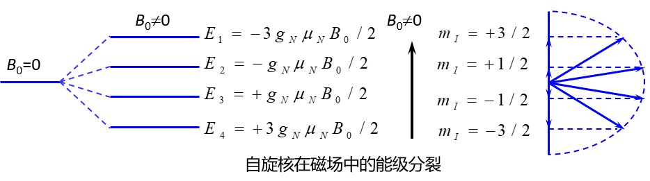
相邻两级的能量差有$\Delta E=\Delta m_Ig_N\mu_NB_0\cos{\phi}=g_N\mu_NB_0$，即$\Delta m_I\equiv1,\cos{\phi}\equiv1$
由于$^1H$的自旋量子数$I=\frac{1}{2}$，仅有$\pm \frac{g_N\mu_NB_0}{2}$两个能级  

 

**核磁共振条件和拉莫尔公式**
在外磁场中氢核磁矩受外磁场作用，会产生进动，其进动角频率为$$\omega_N=\gamma B_0$$
在频率为$\nu$的射频射线（RF）作用下，若有
$$h\nu=\Delta E=g_N\mu_NB_0=g_N\frac{e\hbar}{2m_P}B_0$$
$$\Rightarrow \nu = \frac{1}{2\pi}\cdot\frac{g_Ne}{2m_P}\cdot B_0=\frac{\gamma}{2\pi}B_0\Leftrightarrow\omega=\gamma B_0$$
上式称为**拉莫尔公式**
低能级的原子核吸收RF的能量而跃迁到高能级  

 

**α角RF脉冲**
宏观磁矩$\overrightarrow{M}$与RF之间发生共振吸收，原先处于低能级（此时宏观磁矩与外磁场同向）的核跃迁到高能级，其磁矩方向改变，最终导致$\overrightarrow{M}$与$\overrightarrow{B_0}$的夹角会变化，如果$\Delta \phi=\alpha$，称该RF为**α角RF脉冲**
90°和180°是两个基本脉冲
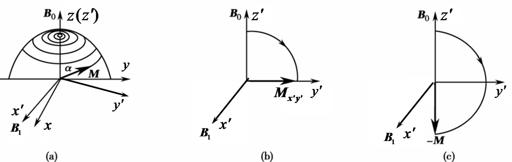

  

**MR信号检测**
大量的氢核发射和吸收能量，产生感应电场，其强度与参与共振的**氢核数目**和射频脉冲后的**提取信号的时刻**有关  

  

**弛豫过程**
**横向**弛豫过程：
核磁矩在**水平**方向趋于平衡，各磁矩旋进的相位完全错乱。各磁矩在水平方向的磁性**完全抵消**，宏观上水平磁矩$M_{xy}$趋于零。是同种核之间交换能量的过程，也称**自旋-自旋弛豫过程**  

**纵向**弛豫过程：
整个氢核磁矩系统恢复到未偏离磁场前的宏观磁矩（方向和大小），纵向分量$M_z$从小到大。是氢核和周围物质的热交换，达到热平衡，又称**自旋-晶格弛豫过程**
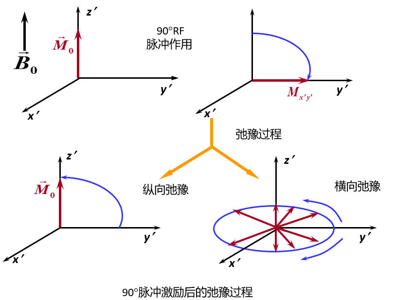

 

**弛豫时间**
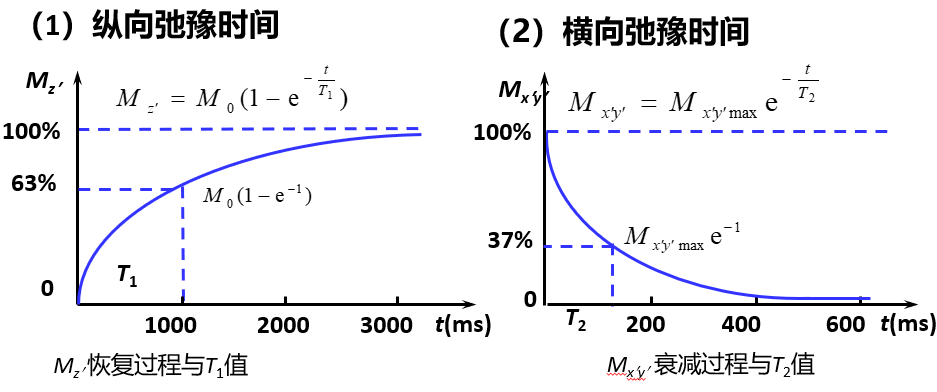
$T_1$是$M_{z'}$达到$0.63M_0$是的时间，$T_2$是$M_{x'y'}$减小到$0.37M_{x'y'_{max}}$的时间

### 4.2 成像过程

**选择层面**
外加Z方向主均匀磁场$B_0$，再叠加同方向的线性梯度场$G_z\varpropto z$，得到
$$B=B_0+zG_z$$
要使氢核跃迁，RF的频率也要随z改变，有
$$\nu=\frac{\gamma}{2\pi}(B_0+zG_z)\Leftrightarrow\omega=\gamma(B_0+zG_z)$$
不同的共振频率表示自旋核所在层面，$G_z$称为**选片梯度场**，由此完成z轴定位

**选择位置**
在x轴向叠加$G_x$编码相位，在y轴向叠加$G_y$编码频率，确定坐标 
具体而言，**在RF的照射下**，向x轴向一个**很小**的线性梯度场，磁矩的旋进速度发生变化；停止RF照射，**撤去$G_x$**，磁矩旋进速度重新一致，但是产生了**稳定的相位差**，分出了x坐标 
在**停止脉冲的前提下**，加上**较大**的线性梯度场$G_y$ ，改变进动的频率，进行频率编码，接收信号时分出了y坐标 
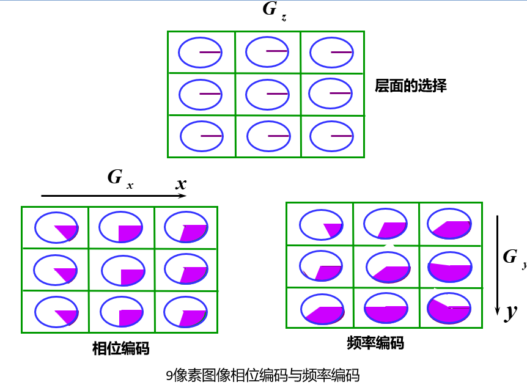

 

**图像重建**
RF照射、选片、相位编码、停止脉冲、频率编码、信号采集处理、成像
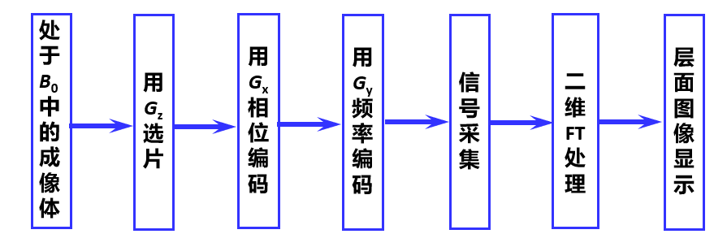

### 4.3 人体的磁共振成像

人体的各个组织的$T_1,T_2$值是不同的，可以形成$T_1,T_2$加权图像
各个组织的氢核密度$\rho$也不同，可以形成$\rho$加权图像

### 4.4 氢核密度$\rho$和$T_1,T_2$加权图像的产生

**自旋-回波序列**
由90°和180°RF脉冲组成，$T_E$是回波时间，$T_R$是脉冲周期
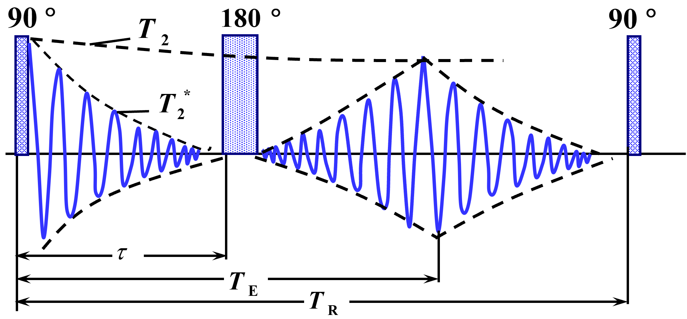
在该信号下，MR信号的幅度满足
$$A=A_0\rho(1-e^{-\frac{T_R}{T_1}})e^{-\frac{T_E}{T_2}}$$  

**氢核密度图像**
当$T_R>>T_1,T_E<<T_2$时，$A\approx A_0\rho$，仅与氢核密度有关
氢核密度不同的两种组织，除开始之外，宏观磁矩大小不同，利用这种差距产生对比，得到灰度  

**$T_1$加权图像**
当$T_R\leq T_1,T_E<<T_2$时，$A=A_0\rho(1-e^{-\frac{T_R}{T_1}})$
不同组织的$T_1$不同，在某一时刻得到的图像各个组织强度不同，灰度不同  

**$T_2$加权图像**
当$T_R>>T_1,T_E\geq T_2$时，$A=A_0\rho e^{-\frac{T_E}{T_2}}$
注意在不同时刻采集的图像，灰度可能截然不同  

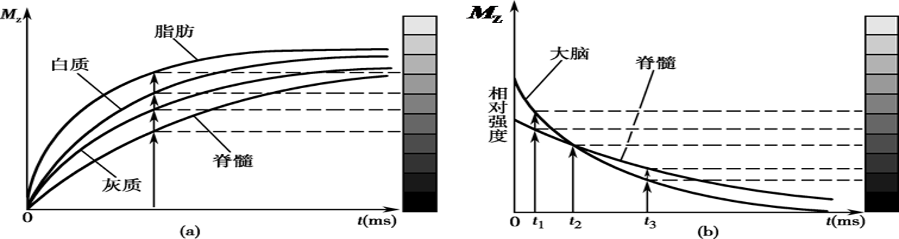

 

人体组织含水量差别不大（即氢核密度差不多），故后面两个的成像反差度更好  

 

**MRI造影剂**
使用**顺磁性**物质，可以使$T_2$减小，在$T_2$加权图中含有造影剂的部分反差增大，提高分辨率  

 

**磁共振血管成像（MRA）**
利用流动血液的MR信号与周围静态组织MR信号差异来建立对比度，用**时间飞跃法（TOF）和相位对比法（PC）**来重建  

**磁共振功能成像**
两类方法

1. 弥散成像。分子热运动导致扩散的快慢
2. 灌注成像。流动效应，测量区域内的血容量

### 4.5 磁共振成像系统简介

**磁场系统**  
1. 静磁场
    1. 常导电磁体
    2. 永磁体
    3. 超导磁体
2. 梯度场（实现体素编码）

 

**射频系统**  

1. 射频发生器
    1. 射频振荡器
    2. 发射门
    3. 脉冲功率放大器
    4. 脉冲程序器
2. 射频接收器（在线圈中感应MR信号）

  

**图像重建系统**  

1. A/D转换器（便于计算机处理）
2. 计算机（复杂的算法）
3. D/A转换器（按灰度显示）
4. 图像显示器

## 5 放射治疗学

重点
医用电子直线加速器的工作原理
传能线密度（LET）和相对生物效应（RBE）的意义和关系
放射治疗的4R理论

### 5.1 医用电子直线加速器的结构

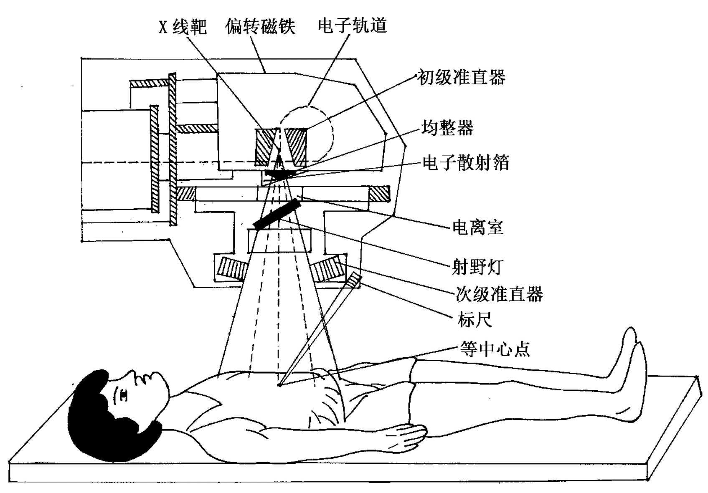

各个部件的作用：
1. 初级、次级准直器：控制射线的范围  
2. 均整器：平均X射线能量在空间的分布  
3. 电离室：测量X射线能量（相当于γ相机的闪烁晶体）  
4. 射野灯：模拟X射线在人身上的照射范围  

 

**多叶准直器（mutil leaf collimator MLC）**
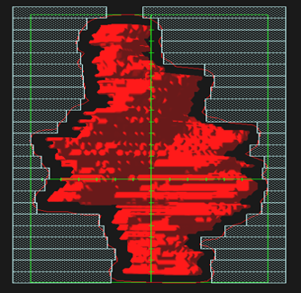
用于控制照射野的大小和形状，可以更好的贴合病灶  

**设置方法**
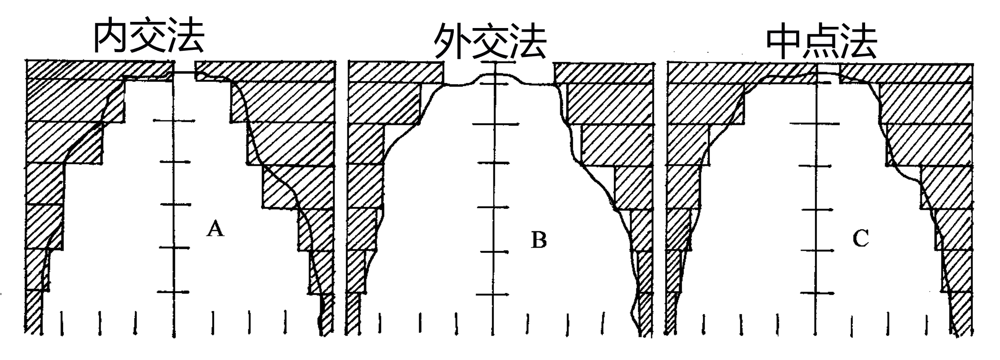
内交法：将准直器与病灶内测相交，对正常组织伤害小
其他以此类推
准直器的方向也可以设置，可以90°旋转  

  

**楔形板**
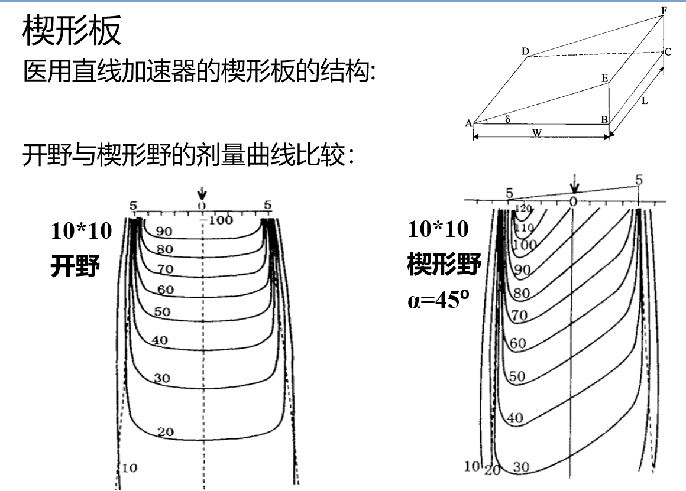
用于调整射线照射范围

### 5.2 放射剂量学

**照射量**
度量射线导致空气电离程度的物理量，定义为
$$E=\frac{dQ}{dm}$$
单位$C\cdot kg^{-1}$  

 

**吸收剂量**
单位质量物质所吸收的辐射能量，定义为
$$D=\frac{dE}{dm}$$
单位为戈瑞，$1\mathsf{Gy}=1J\cdot kg^{-1}$  

**当量剂量**
某一组织所接受的平均吸收剂量$D_{T\cdot R}$与辐射权重因子$w_R$的乘积
$$H_T=w_R\cdot D_{T\cdot R}$$
单位为希沃特，$1\mathsf{Sv}=1J\cdot kg^{-1}$
人体一年的安全剂量为50mSv  

**百分深度剂量PDD**
模体内照射野中心轴上任一深度d处的吸收剂量$D_d$与参考点$d_0$处的$D_0$的比值
$$PDD=\frac{D_d}{D_0}\times 100\%$$
由于**建成效应**，照射皮肤的射线会产生次级电子，参考点并不在身体表面

<table>
    <tr>
        <td>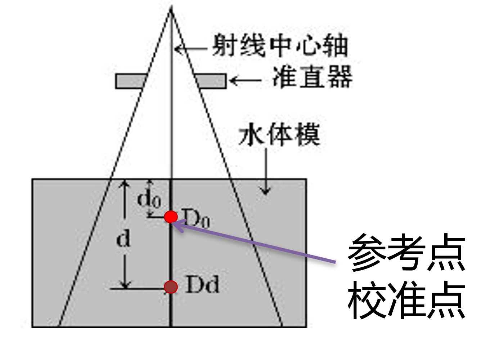
        <td>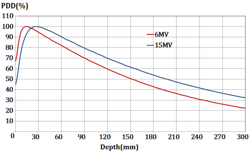
    </tr>
</table>

**影响PDD的因素**  

1. 射线能量
2. 源皮距：射线源到皮肤的距离
3. 照射野大小及形状：越大会使次级电子越多  

 

**好的放射治疗计划**

1. 肿瘤区剂量尽可能准确
2. 肿瘤区吸收剂量要均匀
3. 提高肿瘤靶区剂量的同时，尽量降低正常组织的受照剂量

### 5.3 放射治疗学

**传能线密度（LET）**
指电离辐射通过直接电离或次级电子电离，在单位长度径迹上平均消耗的能量
$$L=\frac{dE}{dl}$$
单位$J/m,keV/m$
**低LET**  

* 光子和轻粒子，从低到高为
1. X-Ray

2. γ-Ray

3. β-Ray

4. 电子束

5. 质子束

  **高LET**  
* 重粒子
1. 中子束
2. α-Ray
3. 重离子束  

 

**相对生物效能（RBE）**
RBE=（250kV的X-Ray引起某一生物效应所需的剂量）/（目前所观察的辐射引起同一效应所需的剂量）
RBE越大，说明这种射线的治疗效果越好  

 

**LET和RBE的关系**  

1. 大体上成正相关
2. 100keV/um左右的LET的辐射，其RBE最大
3. 2的原因是100keV/um的辐射，其电离事件的平均间隔和DNA双螺旋的直径一致，直接将DNA双链打断
<table>
  <tr>
        <td>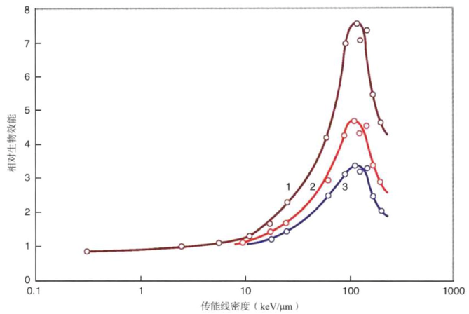
        <td>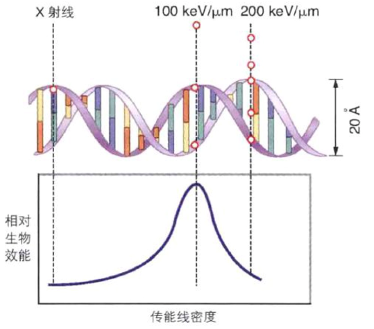  
  </tr>
</table>  

**电离辐射的直接作用和间接作用**
直接：生物大分子发生电离和激发（高LET射线主要是这个）
间接：首先将能量转移到水分子，水分子电离和激发，产生**高氧化性的自由基**，与生物大分子反应（低LET射线主要是这个）  

**自由基对生物分子的作用**  

1. 对核酸的损害：阻挡中心法则，导致死亡或癌变
2. 对生物膜的破坏：脂质过氧化，流动性降低，线粒体膨胀，细胞破裂
3. 对蛋白质和酶：变形  

 

**氧效应**
受照射的生物系统的RBE随介质中氧浓度增高而增加，即有氧的效果比无氧好
**原因**：

1. 自由基和DNA反应生成DNA自由基
2. 若有还原性基团，则DNA自由基可以被还原
3. 若有氧存在，能形成有机超氧化物，不能还原
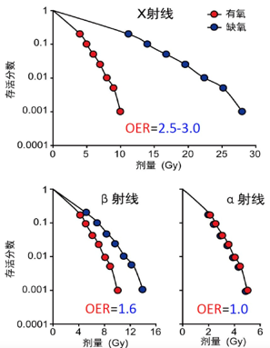

 

**氧增强比（OER）**
OER=（缺氧时产生一定效果的剂量）/（有氧时产生同一效果的剂量），OER$\geq$1
**低LET的辐射往往有更高的OER**，因为低LET辐射靠自由基的氧化，而高氧含量会加快这一过程；高LET的辐射依靠直接电离激发来破坏，不靠氧化  

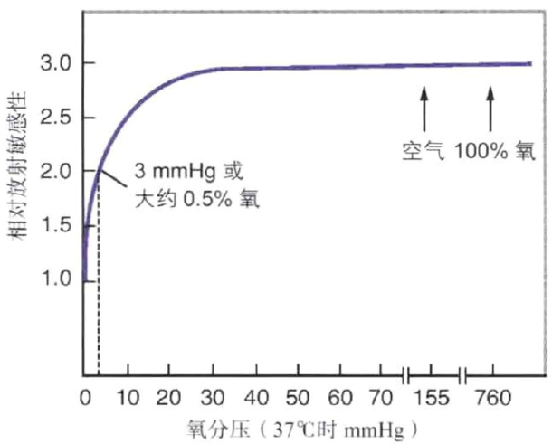

氧浓度和氧效应的关系

0.5%就足够了

**分割放疗**
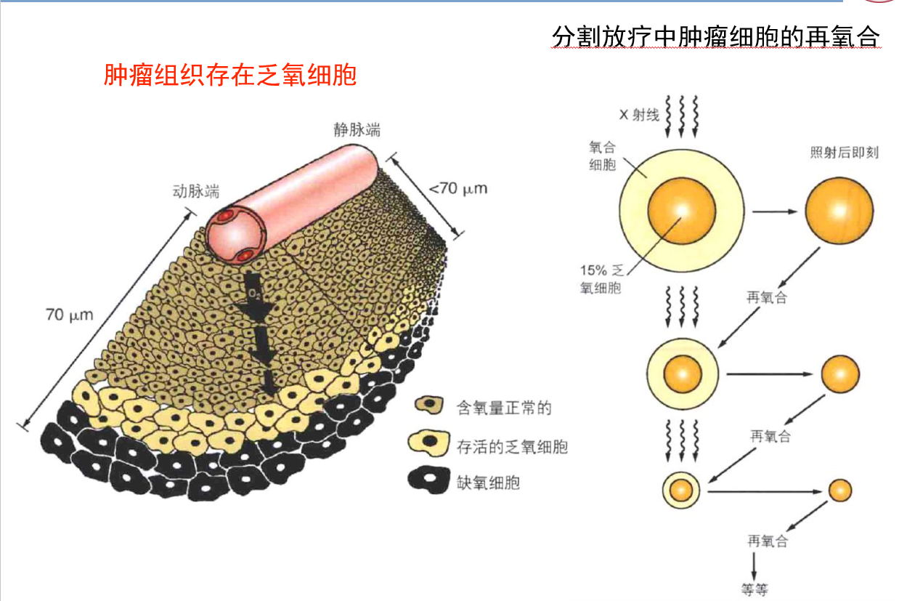
在血管附近的肿瘤细胞会先死亡，余下的缺氧细胞再氧合后也会死

### 5.4 放射治疗的4R理论

**放射敏感性**
细胞对辐射致伤的敏感程度  

**贝-特定律**
组织细胞的辐射敏感性与他们的**增殖能力成正比，与分化程度成反比**
对人体而言，大部分细胞遵循，但是**淋巴和卵原细胞是例外**  

测量体外培养细胞的放射敏感性最直接和最准确的方式是**细胞克隆形成率**实验得出的细胞存活和参数  

例：下面的表格给出了以24h为增值周期的细胞的个数变化和存活分数的关系，在day0照射不同剂量的射线  
|day0|100|100|100|100|100|100|
|:--:|:-:|:-:|:-:|:-:|:-:|:-:|
|DAY1|200|160|100|20|2|0|
|存活分数%|100|80|50|10|1|<.5|

**细胞存活曲线**  

* 高LET射线，$\mathsf{SF}=e^{-\alpha D}$，单靶单击模型
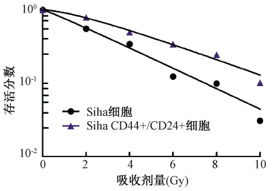
  
* 低LET射线，$\mathsf{SF}=1-(1-e^{-kD})^N$，多靶多击模型
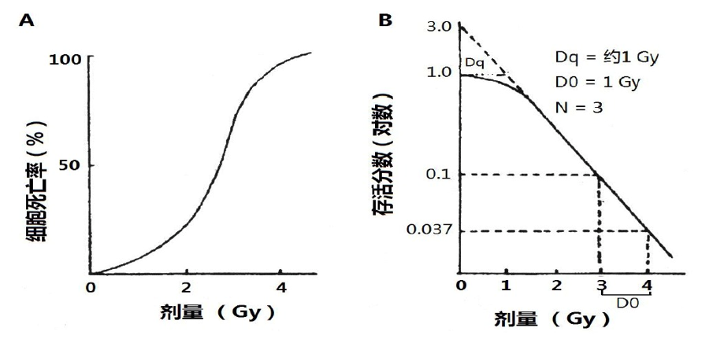

其中，D是每个细胞都受到一个射线击打时放射**剂量的期望值**，Dq是克服细胞自我修复的阈值剂量
D0是对数存活曲线从1->0.37或0.1->0.037所需的剂量

**细胞周期不同时相细胞的放射敏感性**
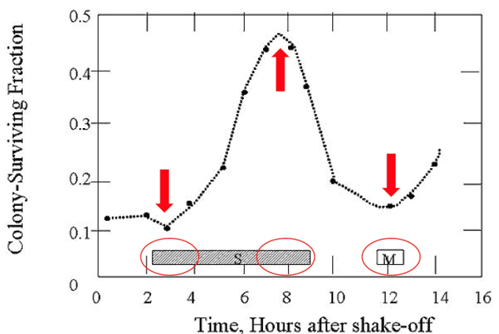
在S晚期有很强的放射抗性，在G2/M和S前期敏感性最高

根据细胞照射后损伤表现，将组织分为早反应组织和晚反应组织
* 早反应组织
1. 皮肤
2. 口腔粘膜
3. 消化道上皮
4. 造血系统
5. **肿瘤组织**
* 晚反应组织
1. 心脏
2. 肝脏
3. 肾脏
4. 循环系统
5. 脑

 

**分割放疗**  
<table>
    <tr>
        <td>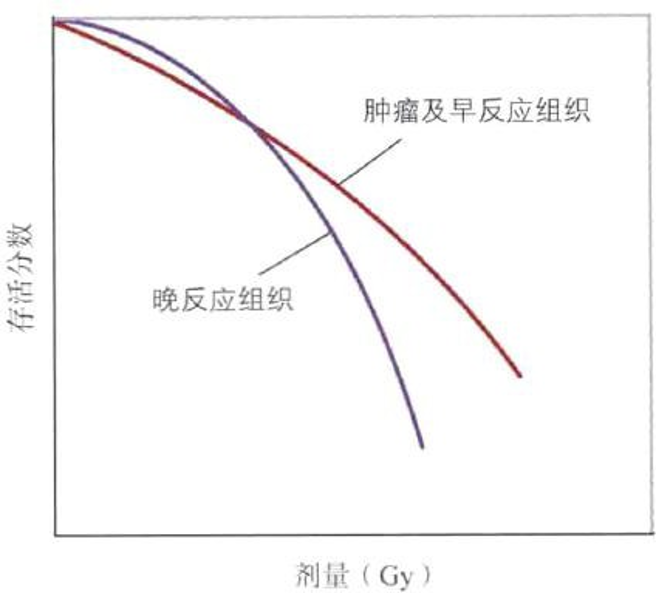</td>
        <td>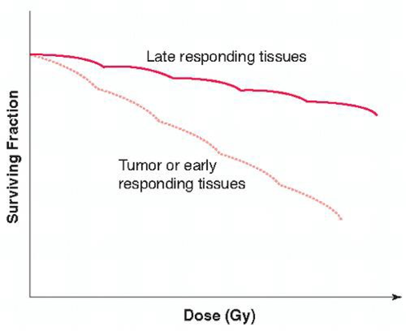</td>
    </tr>
</table>
左图是两种组织对单次照射剂量的生存分数，右图是多次照射（分割治疗）的生存分数
晚反应组织**亚致死损伤（SLD，能修复的损伤）** 修复能力强，分割治疗对晚反应组织有保护作用  

* *LD，致死损伤*

**修复，Repair** 

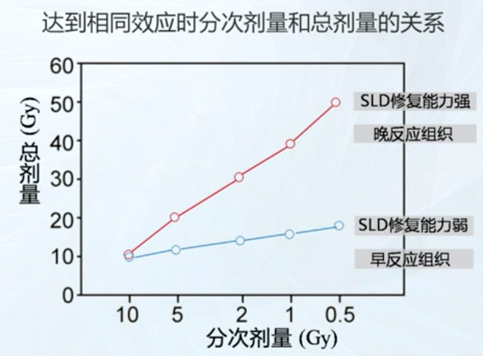

等效剂量曲线

* 肿瘤是早反应组织，SLD修复能力弱
* 正常组织有很多晚反应组织，SLD修复能力强
* 分次照射对晚保护强，对早保护弱

**细胞周期再分布，Redistribution**  
<table>
    <tr>
        <td>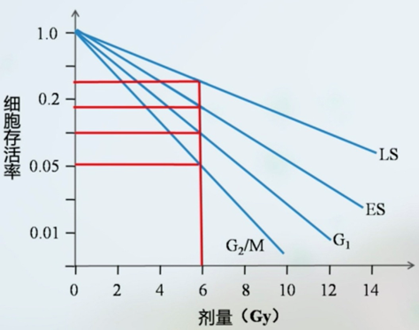</td>
        <td>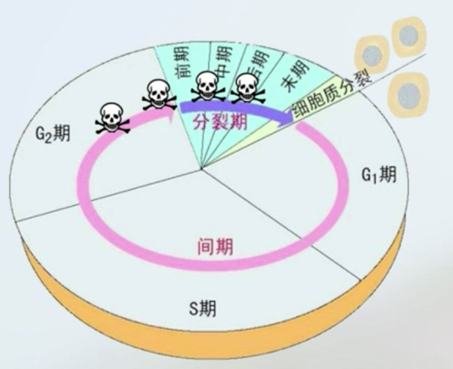</td>
        <td>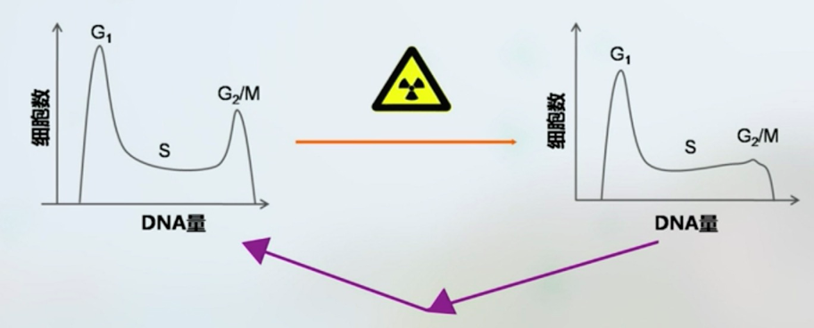</td>
    </tr>
</table>
先消灭G2/M期细胞，当余下细胞重新恢复分裂周期活动时可以再次照射  

 

**再氧合，Reoxygenation**  

利用氧效应，就是上面的再氧合

* 计量分割后正常组织有时间修复
* 肿瘤细胞重新进入敏感时期
* 再氧合，氧效应使得RBE增强
* 时间间隔需要控制

**再增殖，Repopulation**  
1. 不必要的延长治疗时间对治疗不利
2. 正常组织急性反应时要有间隔，间隔尽量短
3. 分割治疗不是好的治疗方法
4. 增值快的肿瘤必须快速处理

### 5.5 放疗和其他疗法结合

* 与手术治疗
1. 术前放疗
2. 术中放疗
3. 术后放疗

  

* 与化疗结合
  
  
  
* 与热疗结合
1. 促进供血
2. 促进肿瘤细胞再氧合
3. 抑制SLD损伤修复
4. 抑制潜在的LD修复

## 6 光学基础

重点：

光医学的应用范围和发展历史
光的干涉、衍射和偏振
光学显微系统的分辨率极限

### 6.1 光的散射

瑞利散射
散射粒子线度比波长**小很多**，1/10波长以下。
散射光强度满足$I(W)\varpropto W^4=\lambda^{-4}$

米氏散射
散射粒子线度大于10倍波长，散射光强度与波长无关

为何是蓝天白云：
蓝天：大气中分子线度小，是瑞利散射，蓝光的强度大
白云：云中水颗粒线度大，是米氏散射，强度均一

### 6.2 几何光学

研究光在介质中传播和物体成像规律的学科

基本定律：

1. 光沿直线传播
2. 光的反射定律和折射定律
3. 独立传播及光路可逆

折射定律
$$n_1 \sin{\theta_1}=n_2 \sin{\theta_2}$$
全反射临界角$\theta_c=\arcsin{\frac{n_2}{n_1}}$，注意要从光密到光疏

透镜成像规律
$$\frac{1}{u}+\frac{1}{v}=\frac{1}{f}$$，其中u为物距，v为像距，f为焦距
放大镜成**虚像**，增加物体对眼睛的视角

### 6.3 波动光学

详见大物二笔记

**惠更斯-菲涅尔原理**
光在传播过程中，在波阵面外任一点光振动应该是波阵面上**所有子波相干叠加**的结果

**光的干涉**
两束平面波$E_1=E_{10}\cdot e^{i(\vec{k_1}\vec{r_1}-\omega_1 t-\phi_1)},E_2=E_{20}\cdot e^{i(\vec{k_2}\vec{r_2}-\omega_2 t-\phi_2)}$，叠加后$E=E_1+E_2$
叠加波的光强$I=E\cdot E^*=I_1+I_2+2\sqrt{I_1I_2}\cos{(\vec{k_1}\vec{r_1}-\vec{k_2}\vec{r_2}-(\omega_1-\omega_2) t-(\phi_1-\phi_2))}$
当且仅当两束波的偏振在同一平面内才有上式
进一步，当：$\omega_1=\omega_2,\phi_1-\phi_2$是常数时，两束波稳定叠加，产生干涉，有
$$I=I_1+I_2+2\sqrt{I_1I_2}\cos{(k(r_1-r_2)+\Delta\phi)}$$
若是$I_1=I_2=I_0$，则有$I=4I_0\cos^2{\frac{k(r_1-r_2)+\Delta\phi}{2}}$
在实际应用中，还要满足两束波的光程差$\Delta nl$不超过波列的长度（不能超过相干长度，产生于单色性不足）
当光屏距离光源足够远时，$r_1-r_2\approx \frac{x}{D}\cdot d$，其中x是点的位置，D为光源到光屏距离，d是光源间距
所以得到最简式：$I=4I_0\cos^2{\frac{\pi d}{\lambda D}x}$

由上式可知，当$x=n\frac{\lambda D}{d}$时，干涉增强，亮条纹；当$x=(n+\frac{1}{2})\frac{\lambda D}{d}$时，干涉减弱，暗条纹
有：干涉条纹表示光程差的等值线；相邻干涉条纹之间的光程差为$\lambda$，相位差为$2\pi$

**光的衍射**

1. 夫琅禾费衍射：光源和光屏都在无穷远处
2. 菲涅尔衍射：o.w.

这部分详见大物二，要求不高
知道**衍射是干涉的产物**即可

**光学系统的分辨率**

**圆孔衍射条纹（艾里斑）**
中央亮斑称为艾里斑，其半径满足$r_0=\frac{1.22\lambda}{d}l$，其中d是光源距离，l透镜到光屏距离

实际上的光学系统如下图，可以认为夫琅禾费衍射，事实上其光强分布和衍射完全一致，其分辨率受到限制
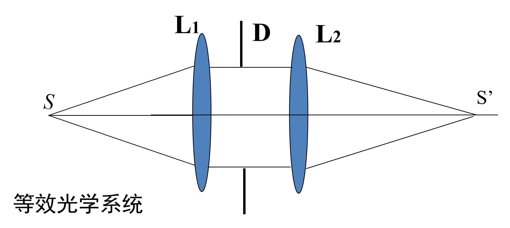

**瑞利判据**
当一个光斑的主极大和另一个的第一极小重合时，两个点刚好被分辨
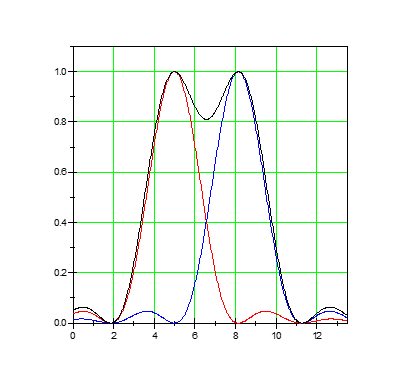

此时有最小分辨角$\delta\theta=\frac{r_0}{l}=1.22\frac{\lambda}{d}$，分辨率$R=\frac{1}{\delta\theta}$

**光学系统的分辨率**

阿贝正弦条件：$nh\sin{u}=n'h'\sin{u'}$
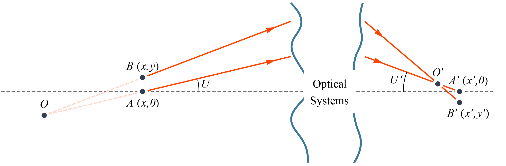

其中h=y，h'=y'，n，n'分别是介质的折射率
再利用$h'=r_0=1.22\frac{\lambda l}{d n'}$，注意波长变化，当恰好能分辨时，有$h=\frac{n'\sin{u'}}{n\sin{u}}\cdot\frac{1.22\lambda l}{d n'}$，当在镜片边缘时由于l>>d，$\sin{u'}_{\max}=\frac{d}{2l}$
$\therefore h=\frac{1.22\lambda}{2n\sin{u}}$
注意此处的$\lambda$指的是**激发光**的波长，而**不是荧光**的波长

令$n\sin{u}=\mathsf{N.A.}$为数值孔径，查表可得
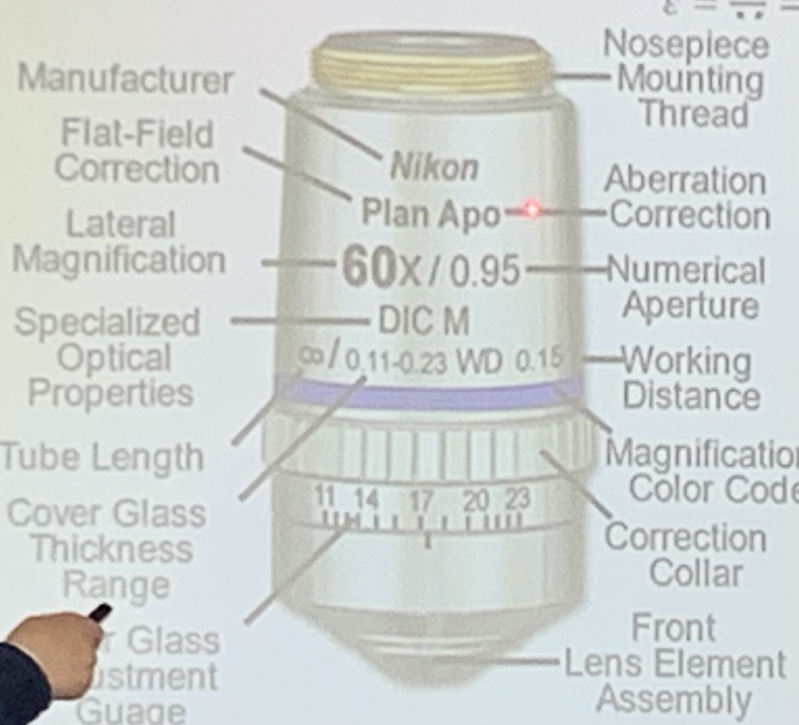

知道哪个是数值孔径就行

**光的偏振**
布儒斯特定律
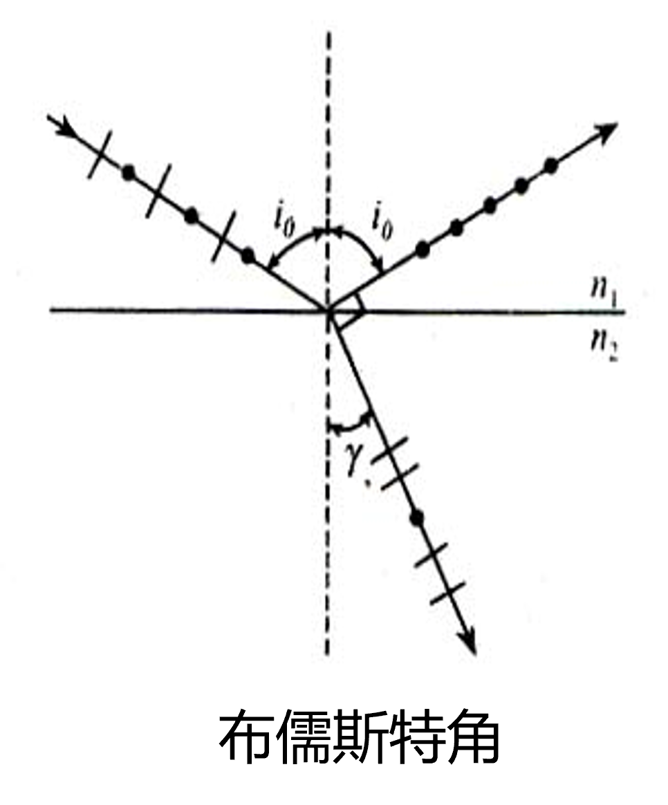

当$i_0+\gamma=\pi/2$时，反射光为线偏光且是s光
此时有$n_1\sin{i_0}=n_2\sin{\gamma}=n_2\cos{i_0}$，即$\tan{i_0}=\frac{n_2}{n_1}$

## 7 激光原理

重点：

激光器的组成和工作原理
如何克服受激辐射与受激吸收、自发辐射的矛盾

### 7.1 激光原理

原子的能级是量子化的
$$hv=E_2-E_1$$

**自发辐射**
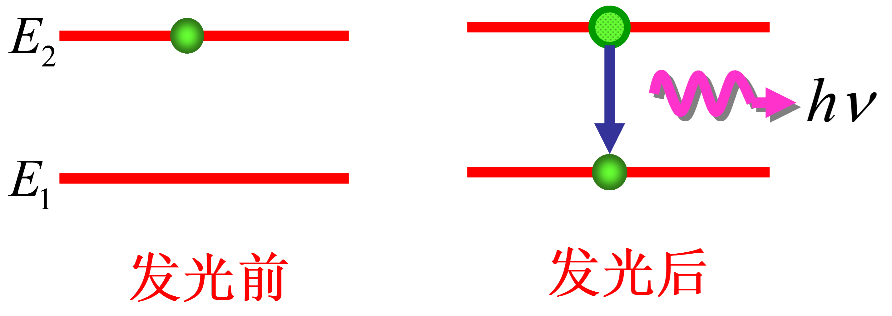

定义自发跃迁的几率（自发跃迁爱因斯坦系数）
$A_{21}=(\frac{dn_{21}}{dt})_{sp}\cdot\frac{1}{n_2}$，其中sp表示spontaneous，表示单位时间内从2跃迁到1的电子占2总数的比例
def  $A_{21}=\frac{1}{\tau_s}$，其中$\tau_s$是原子在2的平均寿命，故$A_{21}$只和原子本身有关

**受激吸收**
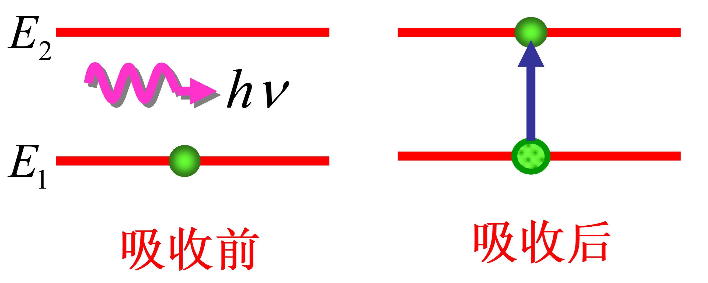

定义受激吸收几率
$W_{12}=(\frac{dn_{12}}{dt})_{st}\cdot\frac{1}{n_1}$，其中st表示stimulated
def  $W_{12}=B_{12}\rho_\nu$，$B_{12}$是受激吸收跃迁爱因斯坦系数，只与原子本身有关，$\rho_{\nu}$是辐射能量场密度

**受激辐射**
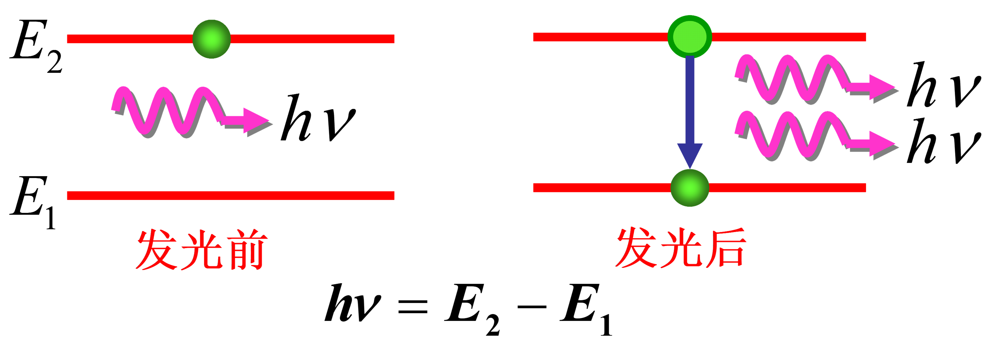

定义受激辐射几率
$W_{21}=(\frac{dn_{21}}{dt})_{st}\cdot\frac{1}{n_2}$
高能级的电子，在外来光子的激发下，向低能级跃迁而发光（进1出2）
受激产生的光子完全是入射光子的copy，二者**频率，相位，波矢，偏振**完全一致，有相同的光波模式(**激光的相干性强**)
def  $W_{21}=B_{21}\rho_\nu$

**受激辐射光放大**
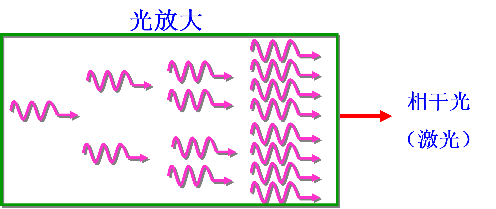

**$A_{21},B_{12},B_{21}$的关系**
在热平衡状态，辐射率等于吸收率，有$n_2A_{21}+n_2B_{21}\rho_{\nu}=n_1B_{12}\rho_\nu$
直接给出结论，$B_{12}=B_{21},W_{12}=W_{21},A_{21}=\frac{8\pi h\nu^3}{c^3}B_{21}$

### 7.2 受激辐射和受激吸收、自发辐射的矛盾

**与受激吸收**
受激辐射过程光子数变多，受激吸收过程光子数变少
由于辐射要求电子在高能级，这必然导致**$n_2<n_1$**，叠加$B_{12}=B_{21},W=B\rho,N=W\cdot n$
得到$N_2=n_2W_{21}<n_1W_{12}=N_1$，光子数是会变少的

**如何克服**
需要使得$n_2>n_1$，即**集居数反转**，显然需要外界提供能量（Pumping，泵浦），使1先向2跃迁
称处于集居数反转的物质为**激活物质**

**激活粒子的能级系统**
首先论证二能级系统无法实现：
当辐射稳定时，一定有：$\frac{dn_2}{dt}=W(n_1-n_2)-n_2A_{21}=0 \Rightarrow \frac{n_2}{n_1}=\frac{W}{A_{21}+W}<1$
需要引入亚稳态（不如基态稳定，但比激发态稳定得多）

**三能级系统**
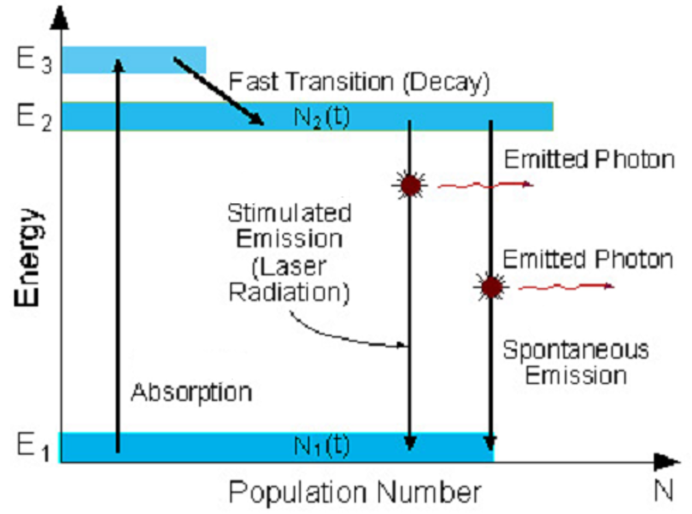

图中E3是激发态，会快速衰减为E2亚稳态，E2和E1形成集居数反转
但是这样有一个问题，由于E2全部来自E3，需要将大量的E1先Pumping到E3，能耗太高

**四能级系统**
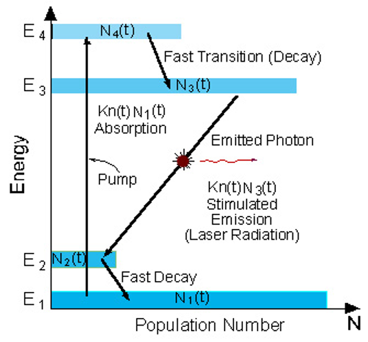

图中E4是激发态，E3&E2是亚稳态，E2会快速衰减为E1，E2相当于一个空能级，$n_2\approx 0$
E3却不会快速衰减为E2，即$n_3>>n_2$，用E3和E2组成新的激发系统
这样，只需要Pumping很少的电子到E3，就能形成集居数反转

**与自发辐射**
def  $R=\frac{W_{21}}{A_{21}}$，表示辐射光子中受激和自发的比值，得到$R\approx 10^{-35}$，完全可以忽略
即相干光子很少，无法生存

**如何克服**
达到$W_{21}=B_{21}\rho_\nu>A_{21}$，使受激光子在竞争中存活（但是引起受激辐射的光子**最初来自自发辐射**）

**光学谐振腔**
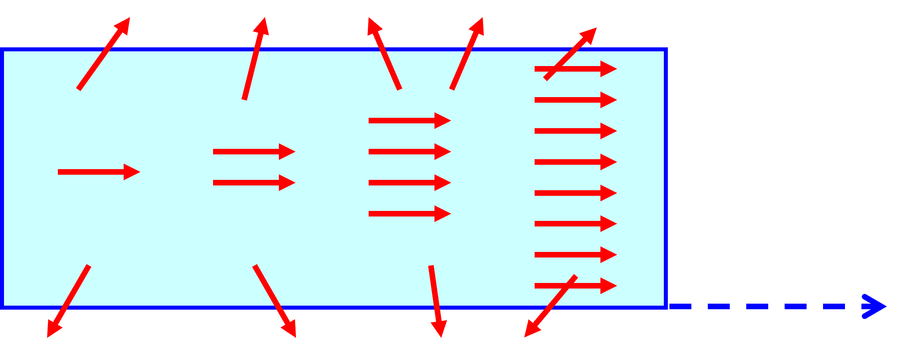

光子在受激辐射的过程中会逐渐增多，当增长谐振腔$\rho_\nu$变大，就有可能达到$B_{21}\rho_\nu>A_{21}$
但是谐振腔不可能做的很长，使用**反射镜面**来增加光程，来回来回中受激光子就变多了
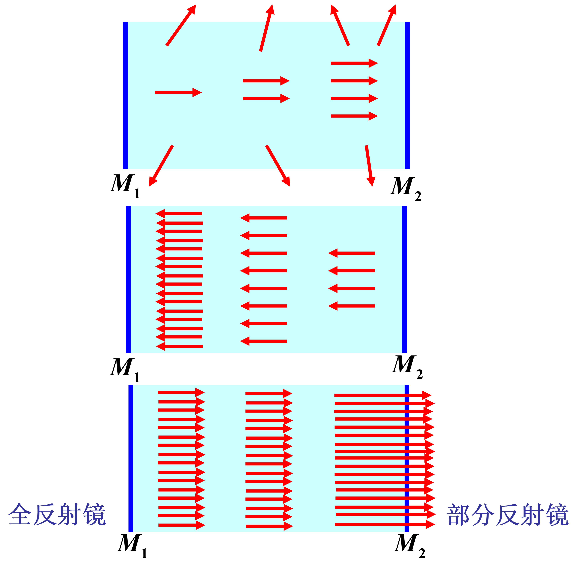

**使用的光学谐振腔**
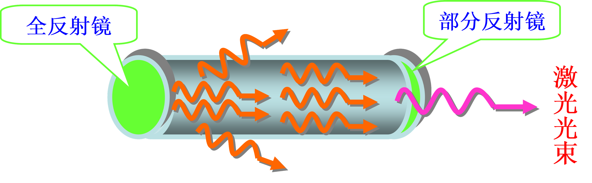

在部分反射镜面上出射
由于两块镜面平行放置，对光子的方向选择很强，偏了的光子会逸出腔外，平行的光子会变多
所以激光由**高度方向性**

### 7.3 光子振荡条件

增益系数$g(z)=\frac{dI(z)}{dz}\cdot \frac{1}{I(z)}$，当$I<<I_m$时，$g(z)=g_0$
损耗系数$\alpha=-\frac{dI(z)}{dz}\cdot \frac{1}{I(z)}$
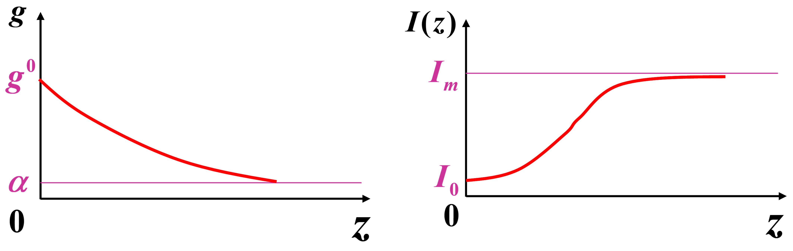

激光器中的光强变化$dI(z)=[g(I)-\alpha]I(z)dz$
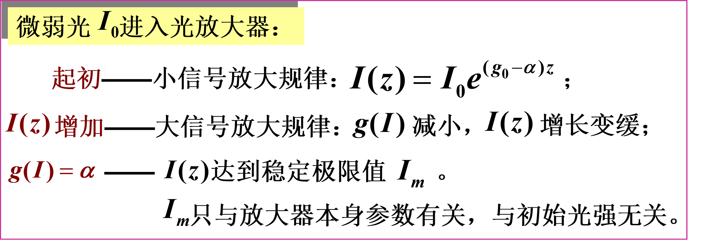

**振荡条件**：$I(z)=I_0e^{(g_0-\alpha)z}\geq I_0 \Rightarrow g_0\geq\alpha$
当满足上述条件时，无论初始的光强多小，都能形成$I_m$的光

### 7.4 激光器的基本组成和分类

**基本组成**
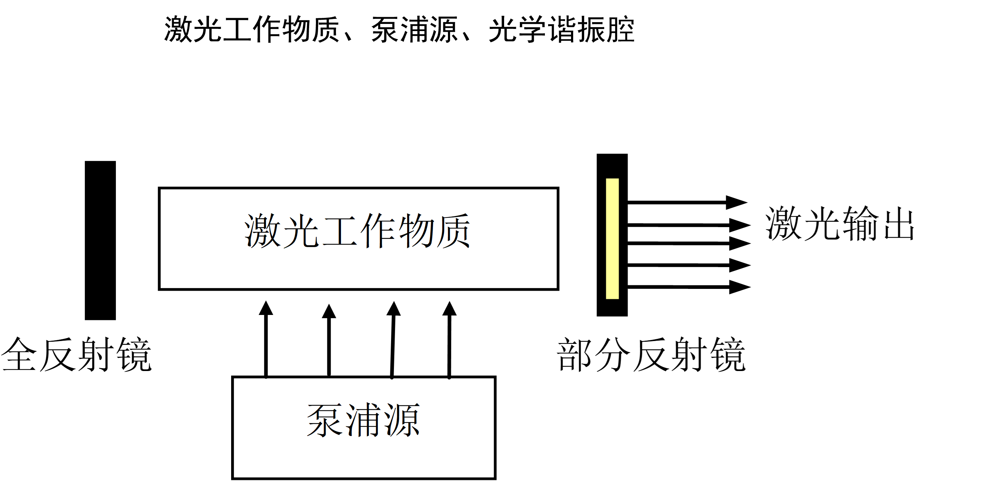

**激光模式**

* 纵模：沿着光轴的光强分布，与驻波有关
* 横模：垂直光轴的截面上的光强分布，选择电场分布均匀的就行

**共振腔的结构决定模式特征**

**驻波和谐振频率**
当激光器处于振荡状态时，激光器内部的光是**满足一定相位条件的驻波**
驻波条件：$\Delta\phi=k\Delta x=\frac{2\pi}{\lambda}\cdot 2nl=2m\pi \Rightarrow l=m\cdot\frac{\lambda}{2n}$，其中n是介质折射率，$m\in \mathbb{Z}$
谐振条件：$\nu=m\cdot\frac{c}{2nl}$
纵模间隔：$\Delta\nu=\frac{c}{2nl}$
最终只有满足谐振条件的光子存活（因为增益最大）

**明明在受激时已经确定了频率，为什么还会有谐振条件呢？**
因为原子的能级不是确定的，用**能带**更好理解，频率是一个小区间

理想情况下，一个纵模对应一个谐振频率值，实际上存在带宽
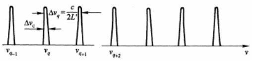

**起振纵模数**
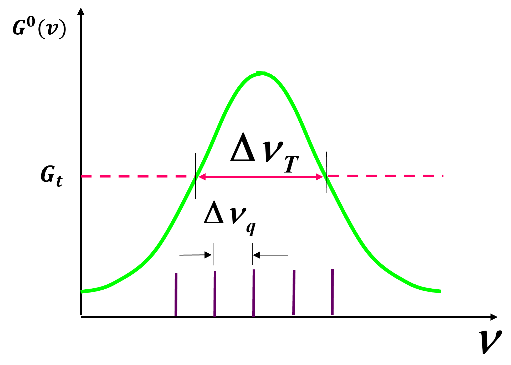

其中$\Delta\nu_T$是带宽，$g<G_t$的光波无法得到加强（认为$g<\alpha$）
起振模式数：$\Delta m=\lceil \frac{\Delta \nu_T}{\Delta\nu}\rceil+1$，向下取整加1，共有这么多个纵模

* *不考计算*

例：见图
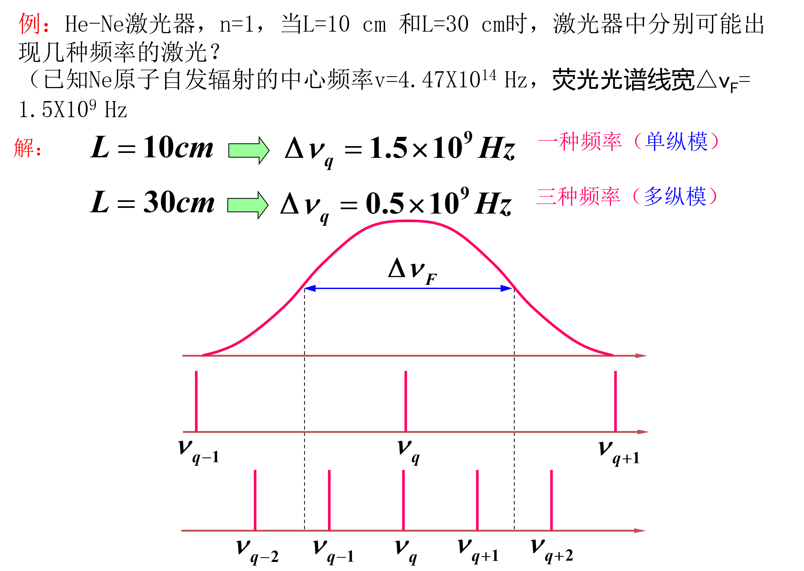

可见$\nu_T/\nu$是非常小的，故认为中心处必有一个纵模，向两边间隔$\Delta \nu$计算个数

## 8 光学检测技术

重点：

流式细胞仪的组成和工作原理
光镊的组成和工作原理

### 8.1 流式细胞仪

**组成部分**
**流液系统、光学系统、电子系统和分析系统**，对有生物颗粒分选功能的，还有**分选系统**

**流液系统**
负责将细胞或生物颗粒按照单个流形式送入检测器
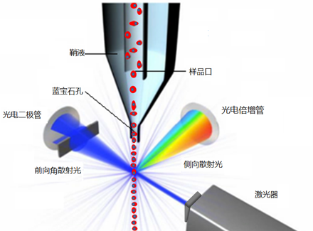

**光学系统**
使用几种**激光**对其进行照射，产生**散射光**和**荧光**
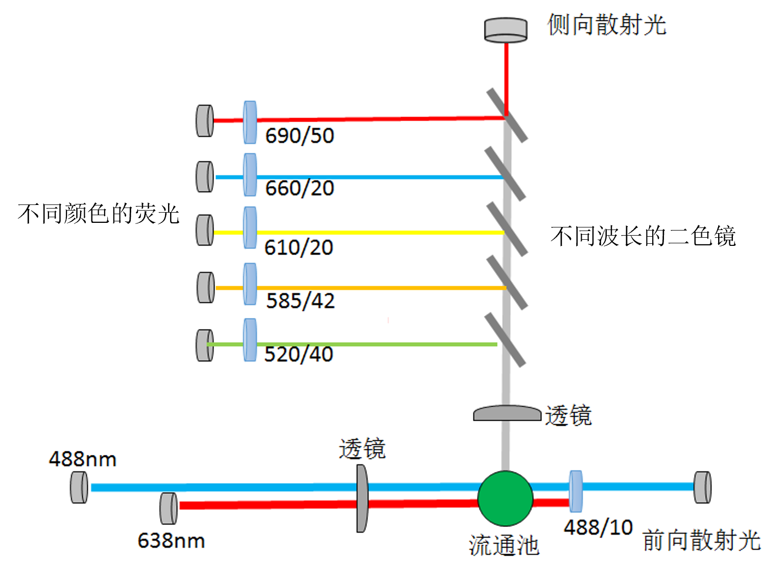

前向散射光小角度偏转，强度大，使用光电二极管检测，**检测细胞大小**
侧向散射光位于90°偏转，强度小，使用**光电倍增管**检测，**检测细胞复杂度**
荧光在经过偏光镜和滤光片后检测，强度小，使用**光电倍增管**检测，**检测特定物质**
产生荧光的前提是**事先在混合物中加入了不同的荧光探针，区分不同生物颗粒**

**电子系统**
不重要

**分析系统**
处理数据用的

例：下图横坐标表示凋亡相关荧光强度，纵坐标表示坏死，黑线代表检测阈值，右图是左图细胞加入某物质后的结果
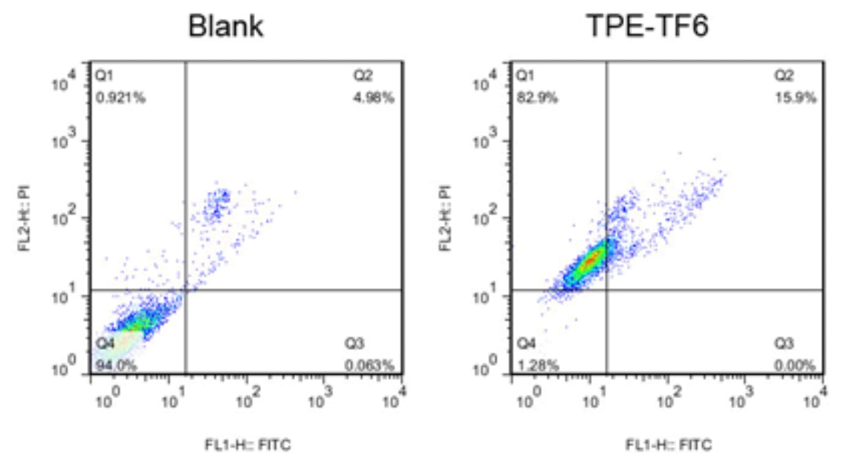

表面该物质会导致细胞的坏死，对凋亡不起作用

**分选系统**
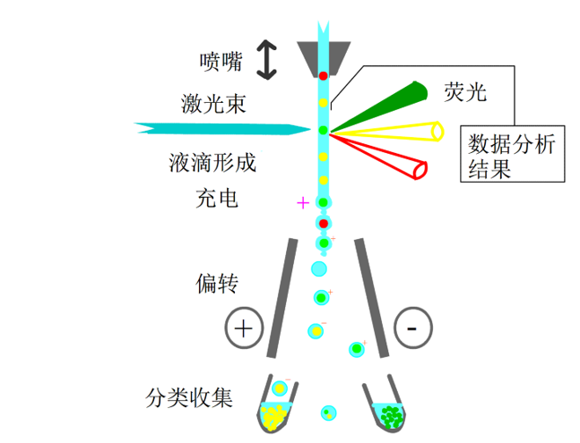

激光束照射后根据颗粒表面的荧光探针，会产生不同的荧光
依据荧光颜色，充电器为液滴带上不同的电荷，在极板间偏转，收集

### 8.2 在体流式细胞仪

由于流式细胞仪产生荧光需要实现孵育样品，无法在活体上运用
在体流式细胞仪则弥补了这一点

在体流式细胞仪直接使用生物的**血管**作为流液系统，根据血液中不同细胞对光信号的响应判断

**光声流式细胞仪**
激光照射细胞，细胞将辐射能转化为热振动，产生声波，记录声波即可得到信息
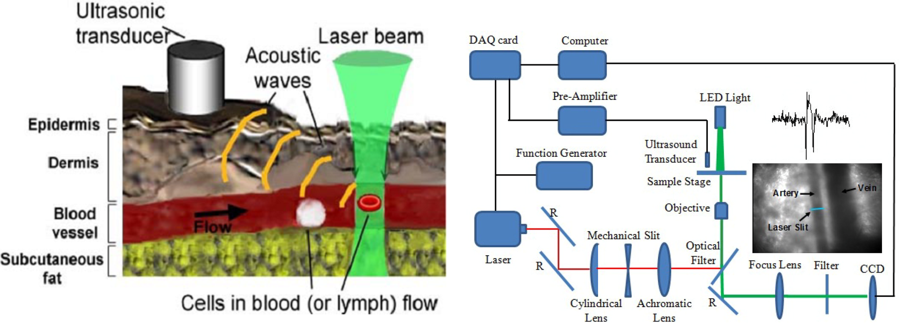

该设备可以用于人体**早期癌症转移**的检测
最大的限制：光需要被特异性吸收

### 8.3 光镊

**工作原理**
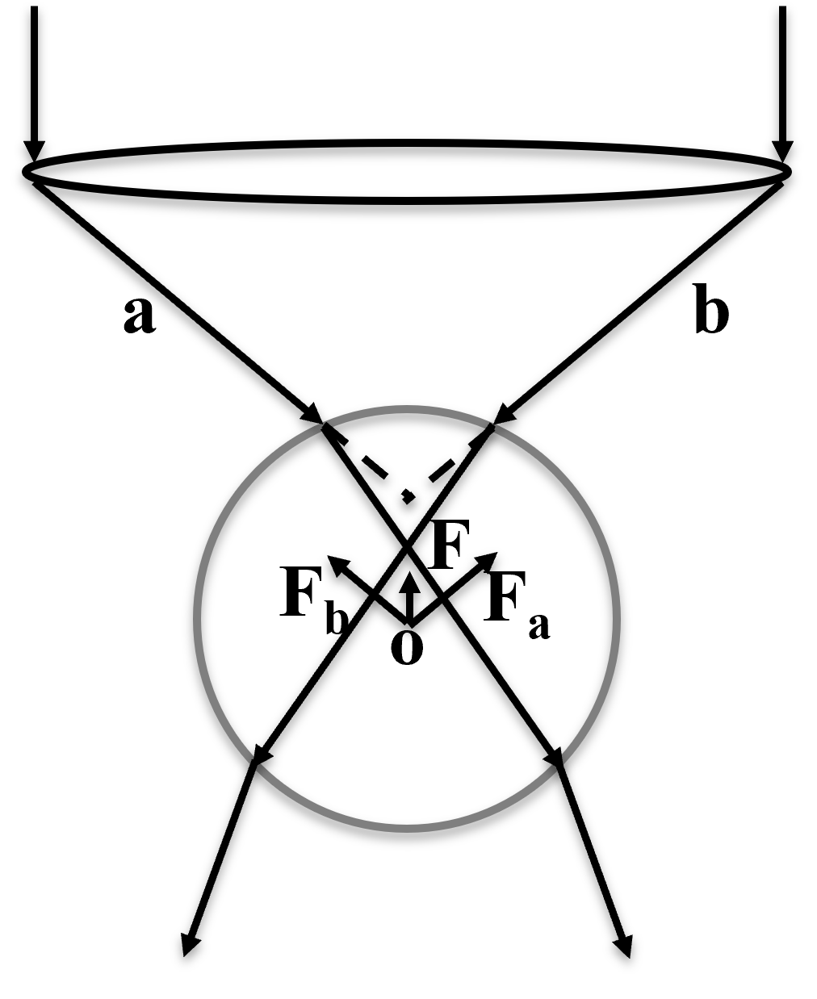

光子具有动量，在于物质的作用中会给物质施加力，分为**梯度力**和**散射力**

**光学势阱及捕获条件**
$n_{球}>n_{环境}$，如图的一对光线经过折射后产生力$F_a,F_b$，其矢量和$F$指向光线焦点
当小球的球心偏离焦点时，F总是使其趋向焦点，故F是**回复力**
**捕获条件**：焦点附近的梯度力大于散射力时，才能形成一个三维光学势阱，稳定地捕获微粒

上面是针对a，b光强一致而言，若$I_a>I_b$，则会偏向b

在小球离光阱中心的位移**不超过小球半径**时，有$F=-kx$，其中k是光阱刚度
由此得到F与x的关系

**光镊系统**
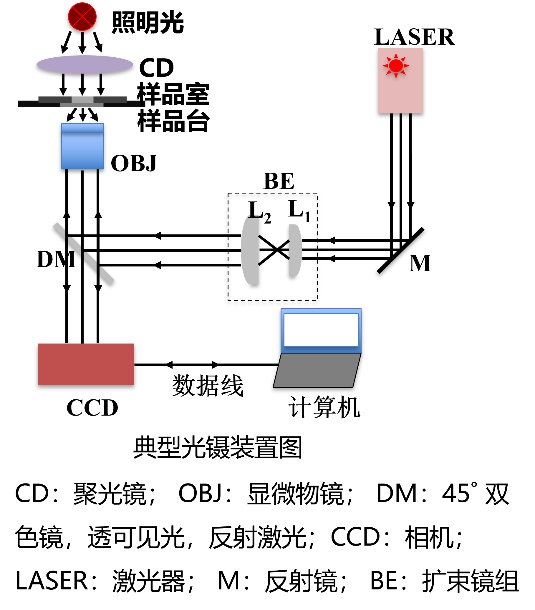

**捕获光源要求**

1. 光源模式：纵模横模；横模选取$\mathsf{TEM}_{00}$，电场分布均匀
2. 工作方式：需要连续光源或准连续光源；不可以用脉冲
3. 光束指向性：激光的方向性很强
4. 激光波长：避免选择会被微粒强吸收的波长
5. 激光功率：尽量小，不破坏微粒

## 9 生物医学光学成像

重点：

荧光显微成像
激光共聚焦扫描显微成像
多光子荧光扫描显微成像
二/三次谐波扫描显微成像
光学相干层析成像OCT
STORM/PALM, STED, SIM
各种能级图

**成像原理**
利用**生物体**某些**光学特性**的**时空变化**来获取光学图像

**优点**

1. 不会产生辐射伤害
2. 应用尺度广
3. 利用透射散射反射，实现多维成像
4. 监控化学和动力学变化
5. 选择性好、精密度高、灵敏度大

### 9.1 普通显微成像

**单透镜成像**
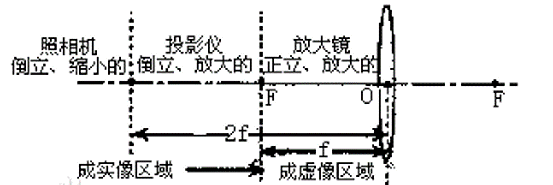

$\frac{1}{u}+\frac{1}{v}=\frac{1}{f}$，放大倍数=$\frac{v}{u}$

**科勒照明（4f）**
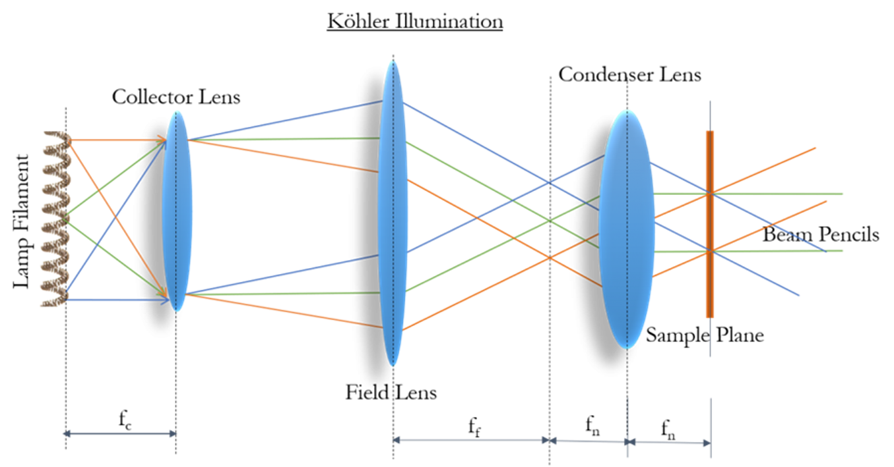

通过焦点的设置，使不均匀光源能够均匀照射样本
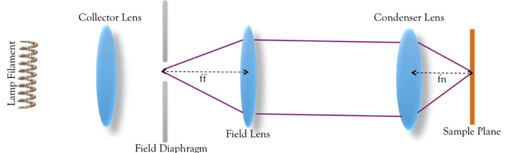

在收集透镜后放场光阑，达到调整视场的目的（调整样本被照亮的区域）
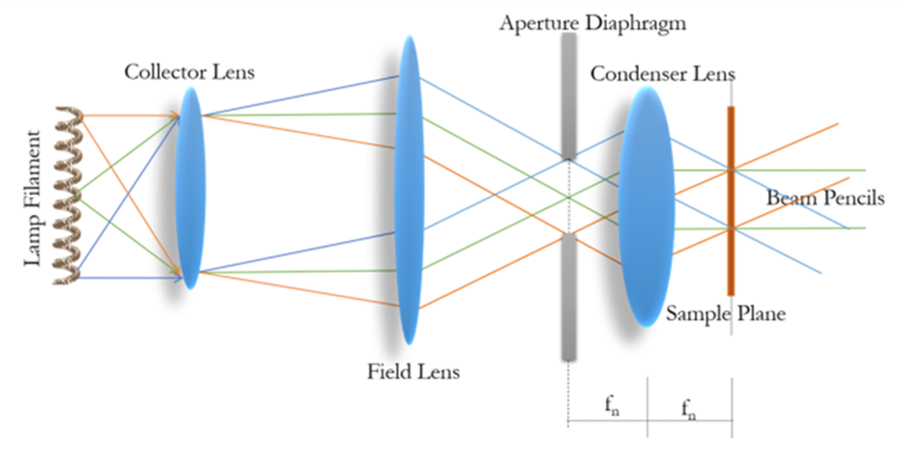

在场透镜后放孔径光阑，达到调整入角度的目的

**分辨率**
见6.3
提高分辨率最佳的形式是提高物镜的n，用油或者水

**暗场显微成像**
即成像的背景是暗的，适用于高透明度样本
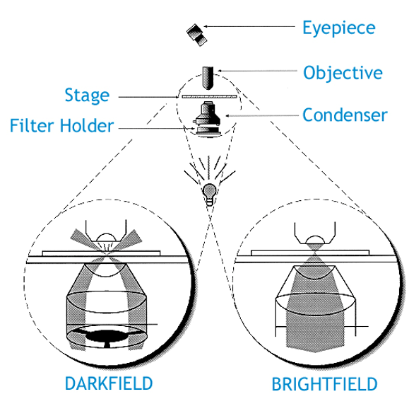

暗场显微镜使用挡光板，产生**中空的锥形光**，背景是暗的，成像时物镜仅仅收集到来自样品对照明光的**散射信号**
限制：图像亮度低

**相衬显微成像**
利用光透射产生的光程差成像，主要用于透明样本等光强变化小的情况

**微分干涉显微成像**
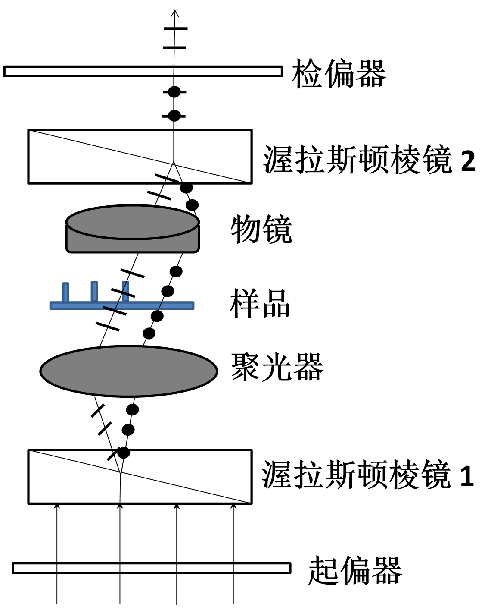

成像步骤

1. 先得到线偏振光，利用棱镜分出s光和p光
2. 透射样品
3. 将s光和p光叠加干涉，得到图像

比相衬成像的图像**质量高伪影少**
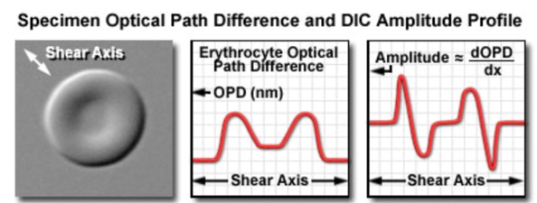

最终是利用光程差的微分成像，图像有浮雕感

**落射荧光显微成像**
利用**短波激发光**激发**长波荧光**成像
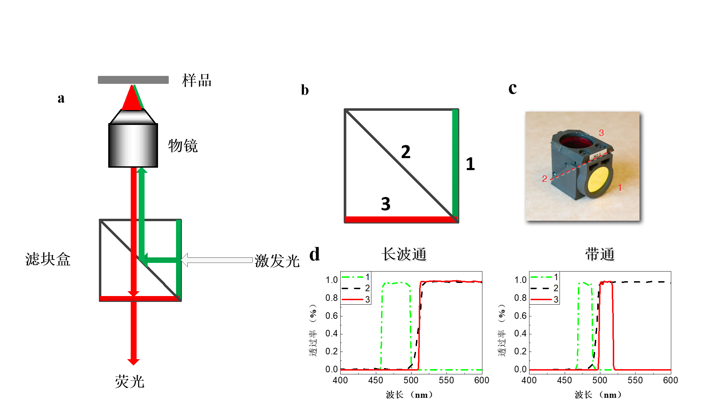

使用同一个物镜，滤光盒是一个长波通滤波器（低通），从右到左是：激发滤光片，二向色镜，发射滤光片
观察前需要用探针修饰

**缺点**
不能分层，荧光多层堆叠，平面的分辨率低，深度分辨率低；光漂白强（荧光消失快）

### 9.2 激光显微成像

**全内反射荧光显微成像**
利用全反射时产生的**倏逝波**对样品进行激发
倏逝波穿透力弱，约100~200nm，因此只有界面处约100nm的荧光信号被激发
是研究细胞膜表面问题的手段
光漂白降低，分辨率提高
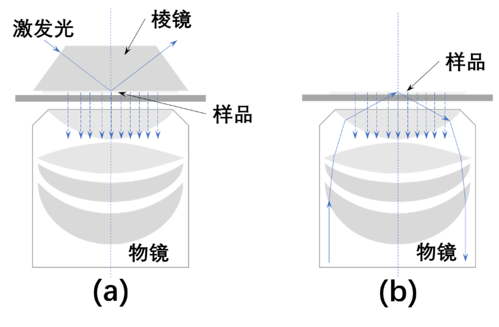

**光片照明显微镜**
激发光通过柱面镜产生**光片**，物镜位于光片的侧面，样品旋转，产生荧光，得到切片图像，进行重构
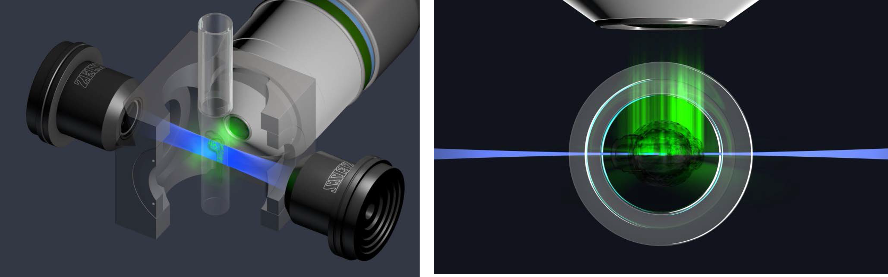

优点
光漂白降低，分辨率提高，成像速度快，允许多色成像

缺点
样品制备复杂，受限于物镜的大小，样品很小，无法进行活体成像

**激光共聚焦扫描显微成像**
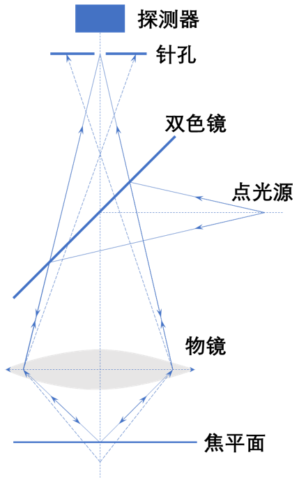

每次扫描一个点的信息；点光源、物点、针孔成共轭关系
焦点以外的信息被小孔挡住，减小焦点信息的干扰，**空间分辨率高**
探测器是光电倍增管（PMT），获取光强信息，没有分布信息
通过移动物镜来改变成像点

|   针孔尺寸   | 增大 | 变小 |
| :----------: | :--: | :--: |
|  图像分辨率  |  低  |  高  |
| 纵向光学切片 |  厚  |  薄  |
|   图像亮度   |  亮  |  暗  |

缺点

1. 扫描深度不足（<80um）
2. 光漂白严重，几乎整个Z轴都受光
3. 不能产生紫外荧光（激发光的波长更短，对生物有害）
4. 空间分辨率收到衍射极限限制

**FRET**
Fluorescence Resonance Energy Transfer
当两种荧光满足下图时，会发生荧光能量转移
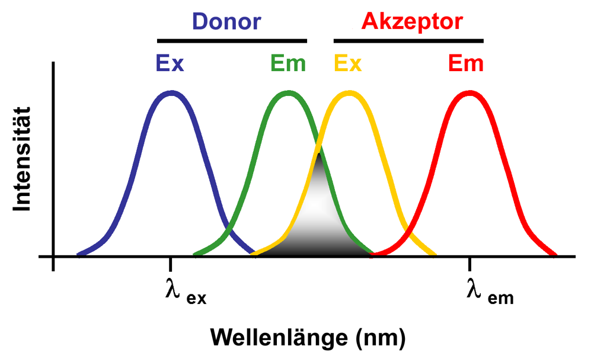

转移的荧光强度满足:$I_A=I_D\cdot \frac{1}{R^6}$
故只有当两种探针相距很近时才能探测
可以判断结合是否成功

**FLIM**
Fluorescence Lifetime Imaging Microscopy
荧光寿命在不同环境中不同，利用荧光寿命的变化感知环境的变化
例如，肿瘤在酸性微环境中，而在酸性环境中荧光寿命很短
与**FRET**互补

### 9.3 非线性光学显微成像

**多光子激发荧光显微成像**
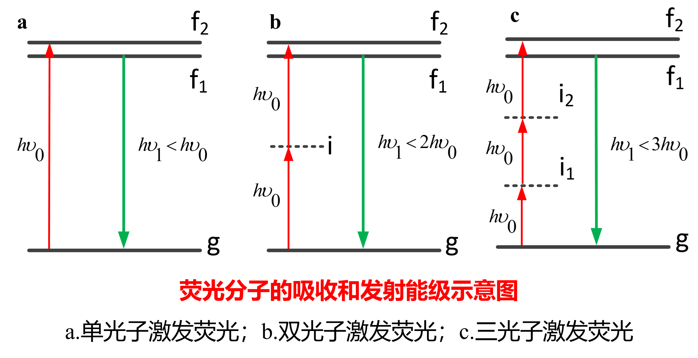

注意，多光子过程存在光子的吸收和释放，存在能量损耗
多光子与单光子的区别**仅在吸收能量的过程**，**发出荧光的过程是一致的**

三光子激发产生的荧光信号比双光子**弱得多**
吸收多光子的几率是吸收单光子几率的亿分之一
故需要能够在瞬间将光子集中发生的设备（高峰值功率，短脉冲+高NA物镜）

n光子激发，则激发光的强度与荧光的强度关系为$I_{out}\propto I_{in}^n$

**飞秒激光器**
$1秒=10^{15}飞秒$
可激发纯紫外染料

**双光子扫描显微镜**
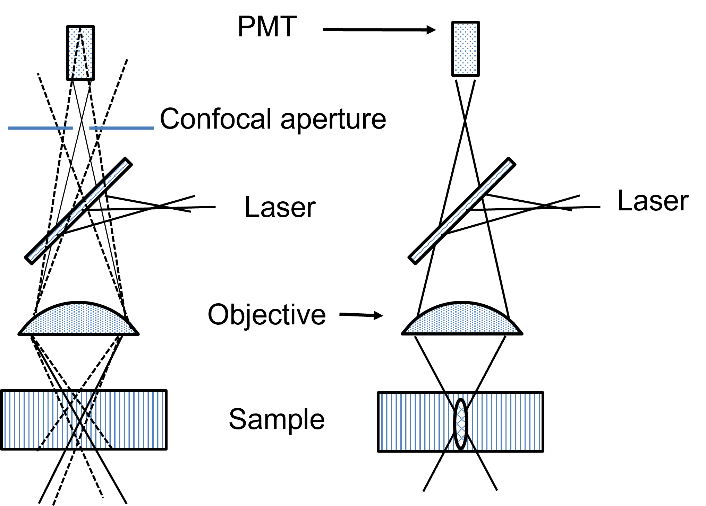

左边是共聚焦，右边是双光子，不需要针孔
由于多光子激发的概率极低，只有焦点除得到激发，故不需要针孔去阻挡除

**显著特点**

1. 扫描深度深（300~800um）
2. 高光子密度只在焦点处，其他可以忽略
   故焦点外光损伤小，激光刺激和漂白也只在焦点位置
3. 可以激发纯紫外染料，生物损伤小
   满足$\lambda_{单光子}<\lambda_{双光子}<2\lambda_{单光子}$时能够激发荧光
4. 和荧光的波长差距大，易于分离激发光和荧光

**二/三次谐波扫描显微成像**
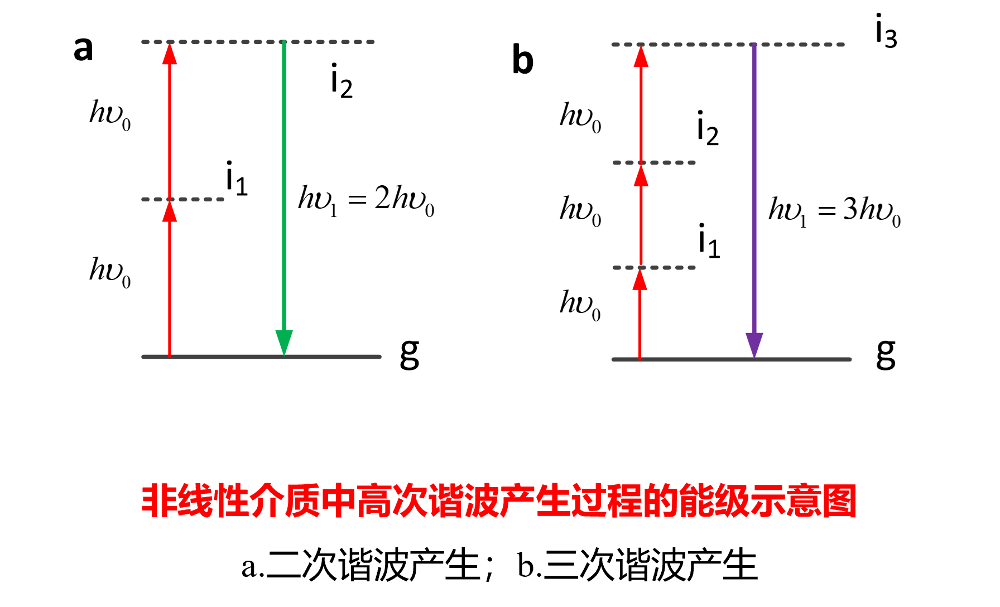

注意这个图中的能级不是实线，是虚能级

**与多光子的区别**

1. 不涉及能级变化，即没有光子的吸收和释放，没有热损失
2. **二次谐波生成只发生在非中心对称介质的界面**
3. 二次谐波信号的波长是泵浦激光波长的一半（多光子没有数值关系，必须实验测定）
4. 可以用于非荧光、无标记的样品

相同点：非线性激发，无需针孔

**二次和三次的区别**

1. 二阶非线性效应和三阶非线性效应
2. 二次谐波生成只能发生在非中心对称介质，三次任意
   二次三次的对比可以找出病变组织
3. 波长分别是泵浦源的二/三分之一

相同点：没有光子吸收，不用针孔，**前向探测居多**，可以用于非荧光、无标记样品

**受激拉曼SRS/相干反斯托克斯成像CARS**
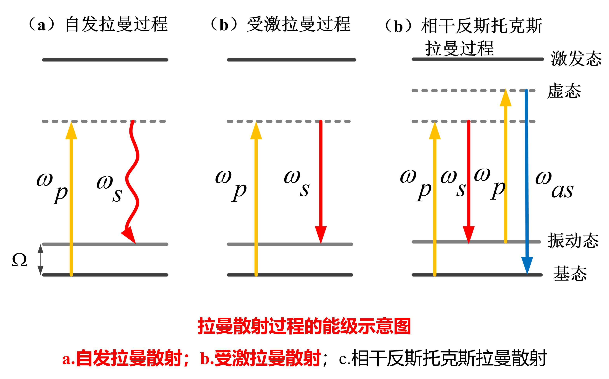

自发拉曼：提供p，发射s，概率低，强度弱
受激拉曼：提供p和s，发射s，概率高，强度大

**CARS**
无需荧光标记；信号波长短，无荧光干扰；信号强，成像快

**SRS**
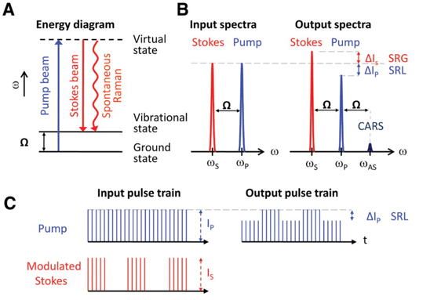

发射p和s，其中p是泵浦，s产生受激辐射
通过信号中的$\Delta I_s和\Delta I_p$来获取样品信息
注意到s不是连续的，pOutput和sInput是有关的

比CARS的优势：与样品浓度成线性关系；提供无背景且易于解释的化学对比

### 9.4 层析成像

**B超**
利用声波再不同组织界面发生反射折射等，获取不同层面的信息

**用光信号代替声波？**
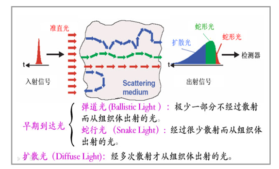

**困难**
时域上无法区分，脉冲相隔时间短（3.3fs）
有效光信号弱，弹道光太少了（红色是弹道光，打错字了）

**光学相干层析成像（OCT）**
是对眼睛成像的唯一手段

**弱相干成像原理**
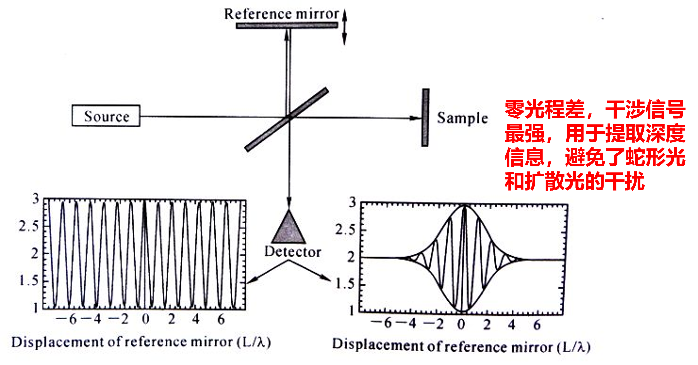

左边的是相干性好，相干长度长的光的干涉图像，右边是相反的图像
相干性弱的光干涉后的相干长度短，且干涉信号集中在零光程差处
反应了深度（z轴）的信息，避免蛇形光和扩散光干扰
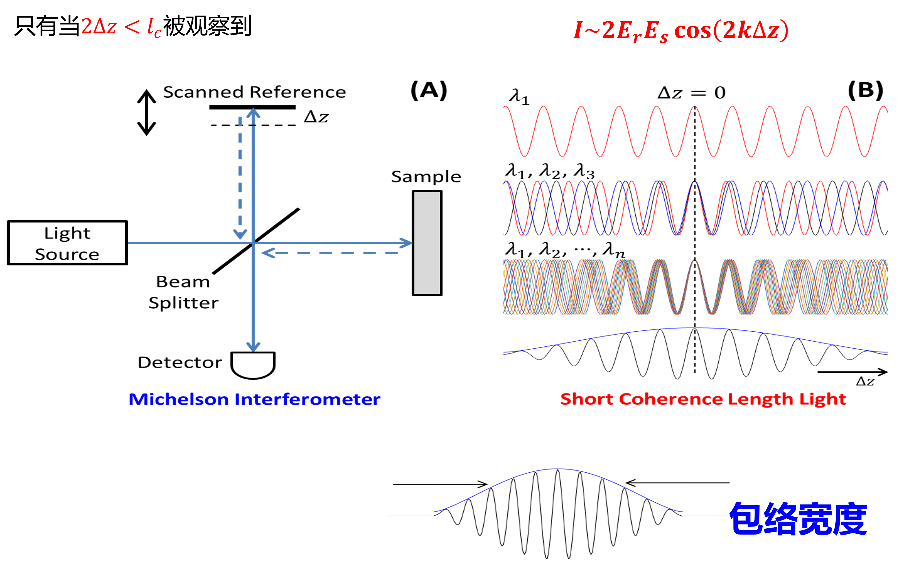

其中$l_c$是相干长度（包络长度），只有当$2\Delta z<l_c$时才能发生干涉
换言之，当$2\Delta z>l_c$时，光束不在同一个包络面内，将不同层面的光分开（时域），分辨率很高

$l_c=\frac{4\ln{2}}{\pi}\cdot\frac{\lambda_0^2}{\Delta\lambda}$，其中$\Delta\lambda$是光强下降到$e^{-1}$时的波长，$\lambda_0$是中心波长
带宽更宽的光谱，$l_c$更小，分辨率更高

**包络的强度反映光强分布（即一层图像），包络的传递时间反映成像深度**

**OCT的分辨率**
横向和纵向分辨率是**独立**的
纵向分辨率$\delta z=\frac{l_c}{2}$，横向分辨率由物镜焦距和光斑尺寸决定，$\Delta x=\frac{4\lambda}{\pi}\cdot\frac{f}{d}$
故即使没有严格的聚焦，OCT依然有精确的纵向分辨率

OCT的成像过程任然是依靠干涉光强信息，上面是提高分辨率的方法

**OCT光源**

1. 生物组织吸收少
2. 生物组织散射小
3. 横向纵向分辨率高
4. 功率高
5. 价格低。。。

**频域OCT**
时域OCT依靠改变$\Delta z$来改变干涉光强，频域OCT依靠改变$k$来改变干涉光强
$I\sim 2E_rE_s\cos{(2k\Delta z)}$，是一个正弦波
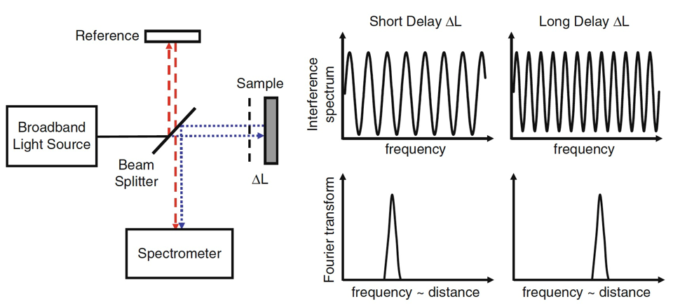

可见改变$\Delta L$对光谱的影响，对其做傅里叶变换得到频域上的冲击波形
$\Delta L$影响$\omega$，在频域上分开了z轴

由于傅里叶变换的线性性，可以同时对不同层面成像，得到的是离散的冲击波形，成像很快
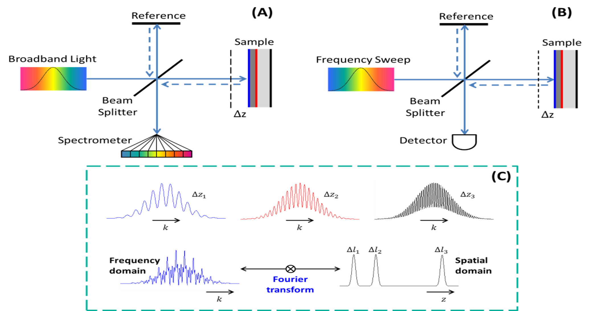

**几种不同的OCT**
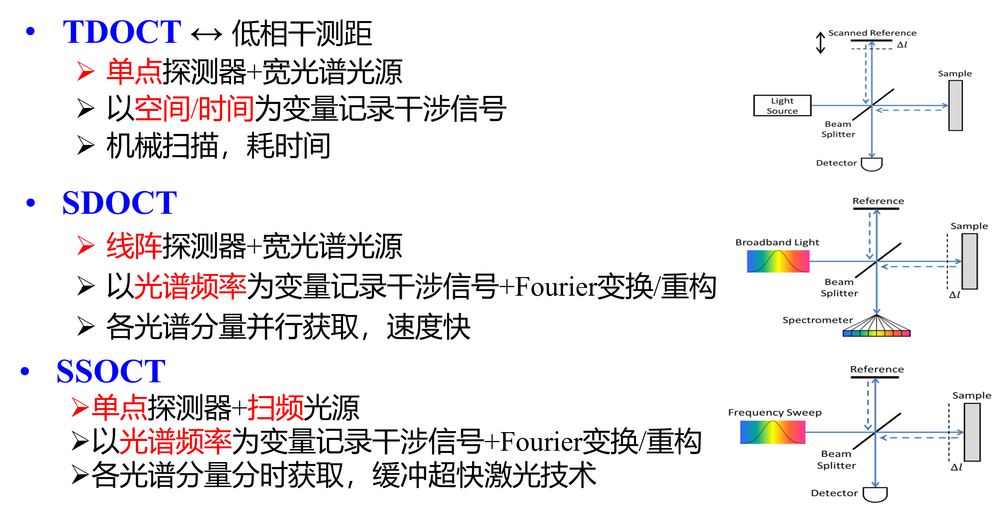

**OCT特点**

1. 空间分辨率：高，横向纵向独立
2. 成像深度：比显微系统深很多
3. 成像时间：短，可以动态化成像
4. 临床适用性：损伤小，于内窥镜和导管结合
5. 对冠状动脉，眼睛，神经等成像，避免切除性活检的伤害

**光学成像和超声成像的对比**

1. 对比度：光学高
2. 深度和分辨率：成像深度大时，光学质量低（z轴分辨率低）

光学成像的分斌率随深度增加而变差

**光声层析成像（PAT）**
用激光打击组织，组织产热，发生振动，产生声波（在体式流式细胞仪）
特点是**光学对比度高，声学分辨率、深度高**
避免了光散射的影响，间距光学和超声成像的优点
缺点：**无法做层析，对图像的判断、分析需要很大的经验**，**发光信号弱时成像速度慢**
在成像时必须选择**目标组织会特异性吸收的波长的光**，否则信噪比很高

**光声效应**
短脉冲激光经过**扩束**，照射生物样本，组织快速吸收能量发热，周围组织热胀冷缩产生**热弹效应**，产生压力波（超声波）

**活体成像的衰减曲线**
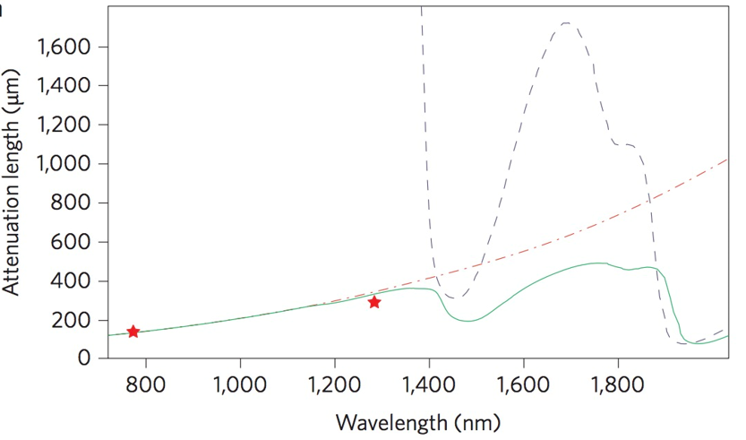

绿色的是衰减曲线，一般PAT使用1700nm左右的波长的光

### 9.5 远场超分辨显微成像

光学成像的限制始终是衍射极限
将点光源经过光学系统成像的光强分布用**点扩散函数**表示，实际上就是光学系统的单位冲激响应PSF(x,y)
和激励卷积得到任意响应

**受激辐射耗尽显微成像(STED)**
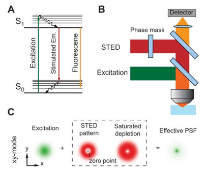

绿光是激励，红光是擦除光（空心的圆）
绿光将荧光物质泵浦到高能级，红光会使高能级物质受激辐射
在红光的空心区域，高能级荧光物质不会受激辐射，而是正常跃迁发出荧光
由于荧光的波长（很宽，是带）和受激辐射的波长（单一）不同，使用滤波器将红光过滤就得到了很细的荧光
绿光是铅笔，红光是橡皮擦

但是这依然无法避免衍射
使用PMT作为Detector，不记录分布，只记录一个点的光强

擦除的过程具体而言
是擦除光的光强很大，使受激辐射强于自发辐射（荧光）
在激励和擦除光的交集处，受激辐射占主导

擦除光的形状由**涡旋相位滤片**得到

最大分辨率$\Delta x=\frac{\lambda}{2n\sin{\alpha}\sqrt{1+I_{max}/I_{sat}}}$
其中Imax是擦除光的光强极大值，Isat是荧光分子饱和激发光强
提高Imax可以提高分辨率

STED光（擦除光）可以是高峰值功率的脉冲光，也可以是高功率的连续光
前者的平均功率低，对样品的热损伤小；后者更简单，便宜

**光激活定位显微技术(PALM)**
既然衍射极限是两个光点的像重合，那么一开始就只成一个像就好了

成像过程是：
在分辨率极限范围内让两个荧光分子分别单独发光
对单个光斑做高斯拟合，取中心点作为荧光分子的实际位置
当前一个荧光分子完全漂白后照亮下一个
各个荧光分子拼接到一张图上

缺点：
荧光分子激活、漂白时间长，成像速度慢
荧光分子漂白后无法再激活，一次性
无法持续成像

**随机光学重构显微技术(STORM)**
使用光开关控制荧光分子是否发出荧光
类似于PLAM

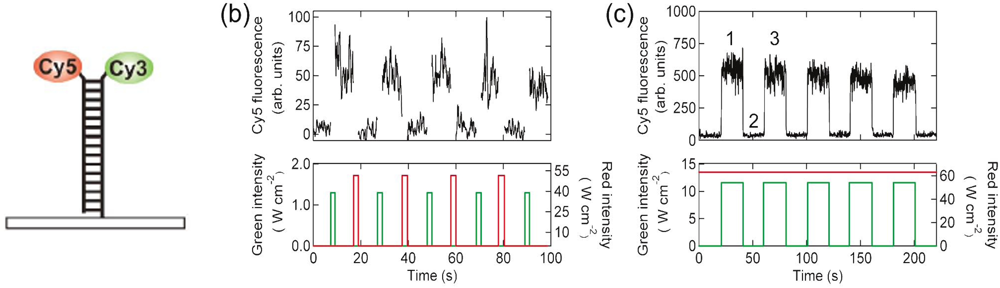

下面的绿光，红光仅代表对应的蛋白的光，而非光的波长
其中绿色的是光开关
当受到绿光照射时开关**持续**打开，此时照射微弱的红光可以使荧光蛋白发出荧光
若照射很强的红光则会使已经打开的开关关闭

红色的蛋白可以替换，可以将多种不同的开关一起用，成彩像
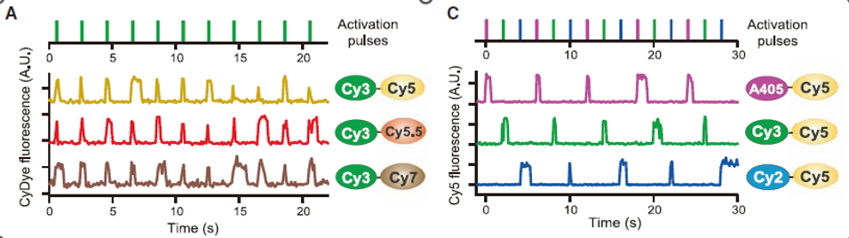

逻辑是：
绿光，强制持续打开；强红，关闭信号
弱红，若开关打开则发光

优点：
荧光开关速度快，比PLAM快
每个荧光分子可以反复开关，可以多次成像
短时间多次尝试测量，受荧光分子随机运动的影响小

缺点：
成像依然不够快，不能做活体实时成像

**结构照明显微技术(SIM)**
利用摩尔效应
若样品的空间频率为k，结构光的空间频率为k0
在其照射下会产生$k_{min}=k-k_0到k_{max}=k+k_0$的摩尔纹

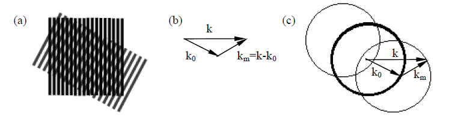

c中粗线为光学系统的分辨率极限，使用一个k0的结构光相当于将这个圆进行平移
最后得到的包络是SIM的分辨率极限
由于k0，km是知道的，可以通过$\vec{k}=\vec{k_m}+\vec{k_0}$得到原始图像信息

相当于结构光将成像系统的分辨率极限由km扩展到km+k0

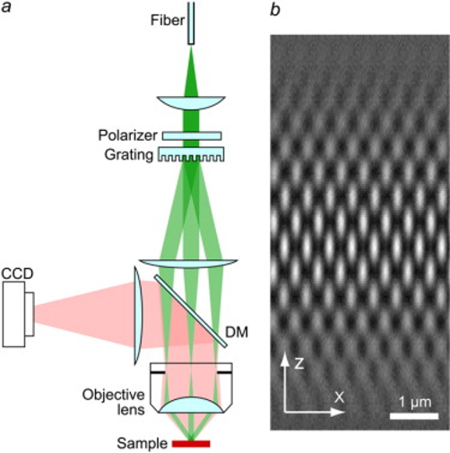

a图中上面用于产生结构光，用CCD记录
对记录的到原始信息进行FFT，对频域信号进行配准和融合（减去k0），得到的频谱做iFFT，得到时域信号
成像时间**很短**

**总结**

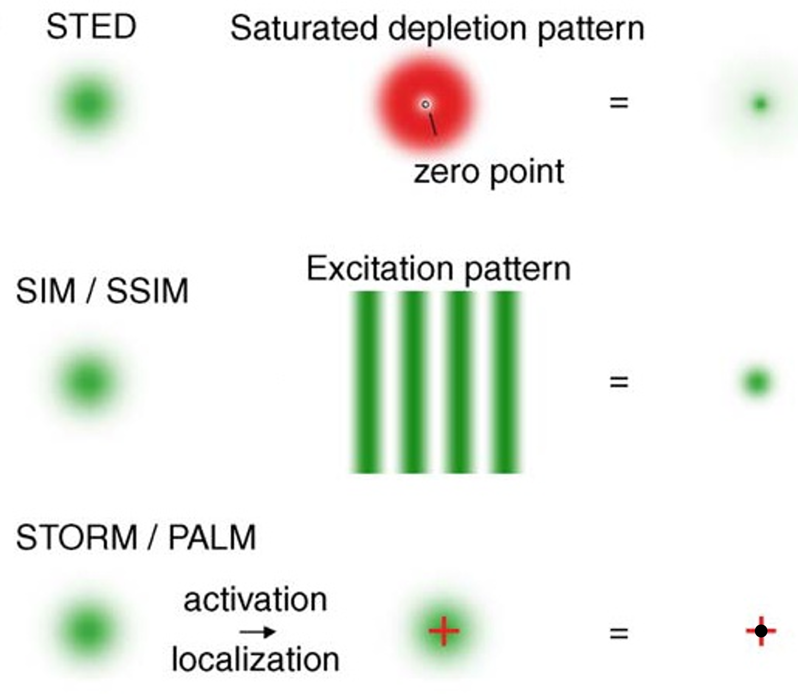

STED最终的绿光周围还有一圈红光，不过会被滤波器过滤
STORM是activation，PALM是localization

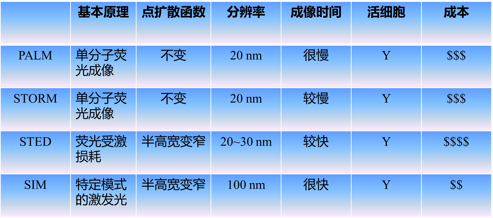

* PLAM/STORM图像采集慢
* STED光路复杂，贵，对稳定性要求高
* SIM分辨率提高有限

## 10 光学治疗技术

重点

**光热与光化学作用原理与应用**
**光动力疗法三要素、三效果**

### 10.1 激光生物作用

1. 光热作用
2. 光化学作用
3. 光压作用（光镊等）

### 10.2 **光热作用**
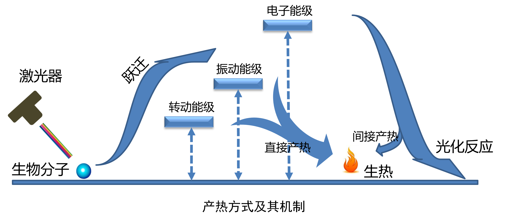

选用的激光波长不能太短，使分子跃迁到振动能级上
微观上是分子振动加剧，宏观上是组织温度升高
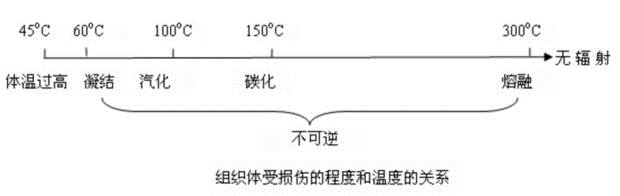

不同温度对组织的伤害不同

**影响因素**

* 生物组织特性
  1. 热容
  2. 热导率：越高吸热快，散热也快，不易保持高温
* 激光特性
  1. 功率密度：越大伤害越高
  2. 曝光时间：越长伤害越高

**激光刀功率密度区**
激光刀的不需要消毒，不需要无影灯
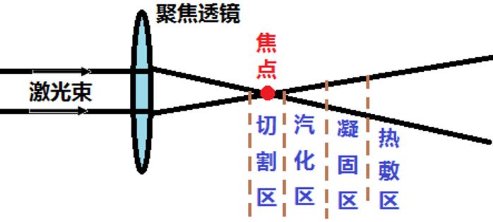

在焦点处功率高，用于切割
在汽化区使组织汽化
在凝固区使组织热凝固坏死，可以用于止血
在热敷区只有温热，不会造成热致损伤

凝固区也可以用于视网膜裂孔的治疗
用凝固区照射裂孔，周围形成瘢痕包绕，阻止眼内液体进入视网膜下

切割区做晶状体手术

### 10.3 **光化学作用**
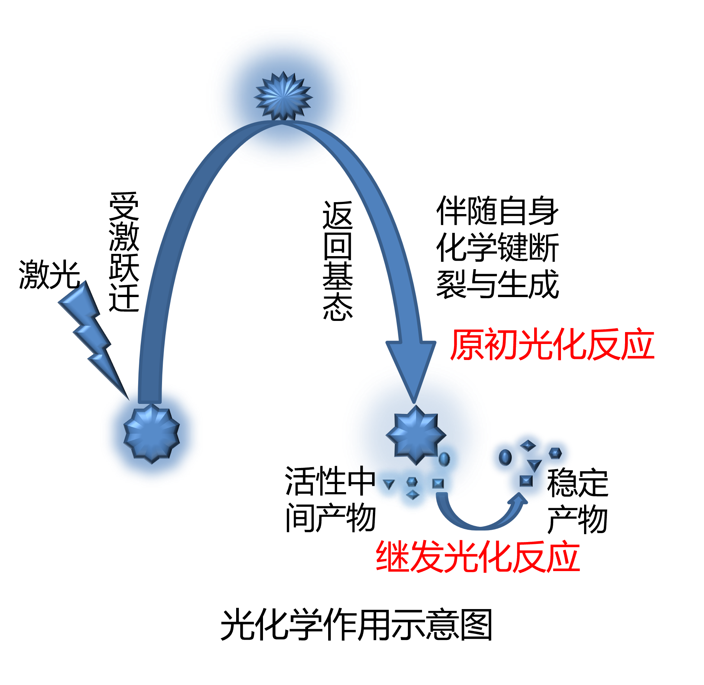

主要讲**光致敏化作用**

**光动力治疗(PDT)**
用光（通常激光）激发化学物质（光敏剂），产生**高活性氧**，利用其杀死癌变细胞或组织
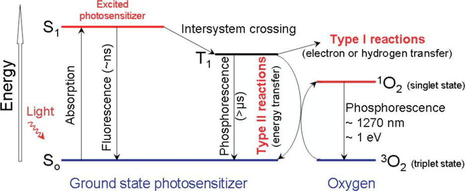

上图是光子与光敏剂作用的方式，利用光子激发光敏剂到**三重态**，光敏剂向下跃迁传递能量给3态氧，变成单态氧
单态氧跃迁回三重态，发出**磷光**

**三要素**
光，光敏剂，高活性氧

**三效果**

* 杀细胞：高活性氧有生物毒性
* 封闭血管：利用双光子激发，可以进行很细微的结构（眼底血管等）的扫描，用药物封闭血管
* 激活免疫系统：使肿瘤细胞坏死、凋亡，释放抗原，激活免疫系统；单态氧能破坏DC细胞溶酶体，使抗原暴露，提升提呈效率

**PDT药物（光敏剂）选择**

1. 对特定癌细胞有靶向性
2. 对生物组织的透光区中某个波长有强烈的吸收作用
3. 在黑暗环境中产生尽量小的毒素
4. 光敏剂在三重态时有高量子效率和较长的寿命
5. 不会聚集（会流动，范围广）
6. 能被生物体快速排泄或代谢

**血卟啉**衍生物是可用于人体的光敏剂，通过光导纤维可以治疗深层癌症

**光辐射选择**
激光作为标准光源，优点如下

1. 作为窄谱光源对特定的光敏剂的选择性、有效激发激发性强
2. 激光束能高效便捷地耦合到光纤中，结合内窥镜系统，深入组织间隙等

**光激发模式**

## 11 超声医学

重点

**超声的产生及基本性质**
**A超、M超、B超工作方式及区别**

### 11.1 超声波的基本性质

**超声探头应用压电式换能法接收和发射超声**
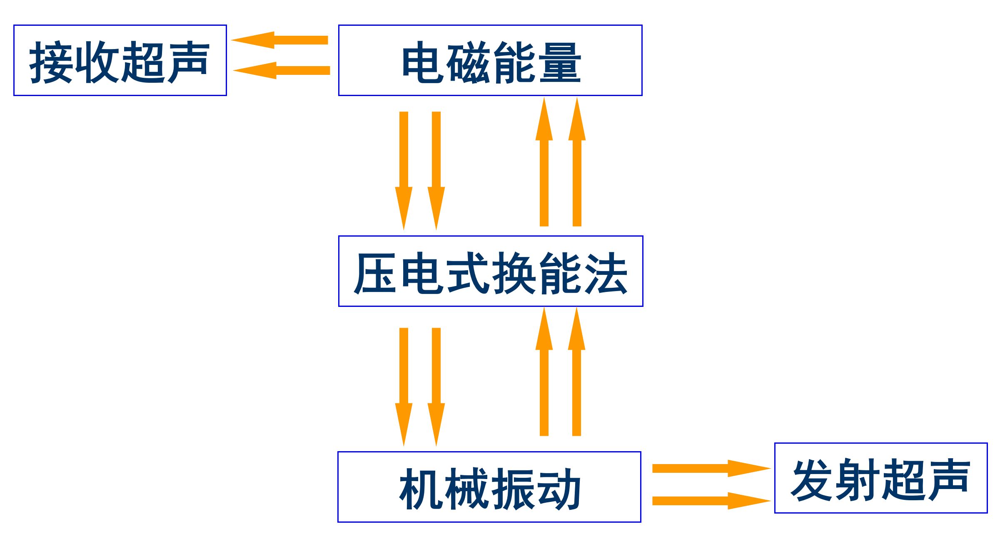

临床应用时超声速度在软组织中近似1500m/s

**声压**
$p=A\rho u\omega\cos{[\omega(t-\frac{x}{u})+\frac{\pi}{2}]}=p_m\cos{[\omega(t-\frac{x}{u})+\frac{\pi}{2}]}$
其中A为振动幅值，$\rho$为介质密度，$\omega$为声波圆频率，u为声速

**声强**
即能流
$I=\frac{1}{2}\rho A^2\omega^2u=\frac{p_m^2}{2\rho u}$

**声阻抗**
声压与声振动速度之比
$Z=\frac{p}{u}=\rho u$，与温度有关

**声强级与声压级**
$L_I=10\lg{\frac{I}{I_0}}$，单位分贝dB，I0为基准声强，$I_0=10^{-12}W\cdot m^{-2}$
$L_p=20\lg{\frac{p}{p_0}}$
带入p和I的式子可得，$L_I=L_p$，二者在数值上相同

**声阻抗相差过大的介质不能折射声波**
人体组织和空气的声阻抗相差大，必须用耦合剂过渡

人体组织也分为三类，低声阻或气体（肺部），中声阻液体或软组织（肌肉），高声阻矿物组织（骨骼）
三类组织声阻相差大，彼此不能传播声波
但在**第二类组织**中，声阻相差不大，可以利用不同类组织间的**声阻抗造成的反射、散射**识别不同组织的形态和性质
当两个介质声阻抗差达到1%时，其界面上会发生声波的发射（反射）

**传播原则**

1. 直线传播
2. 遇到界面发生反射和透射
   * 界面线度远大于声波波长和声束直径
   * 介质声阻抗界面处不同（1%）

反射回升带来体内脏器及大界面信息

**传播特性**

1. 能量守恒

2. 声压连续

   * $p_{incident}+p_{reflect}=p_{transmit}$

3. 法向速度连续

   * 质点振动速度在垂直界面的分量相等
   * $v_i\cos{\theta_i}-v_r\cos{\theta_r}=v_t\cos{\theta_t}$

4. 反射系数为反射声压$p_r$与入射声压$p_i$之比
   $r_p=\frac{p_r}{p_i}=\frac{Z_2-Z_1}{Z_2+Z_1}$

   * Z2>>Z1，全反射无透射
   * Z2=Z1，全透射
   * Z1>>Z2，半波损失全反射
   * Z1>Z2，半波损失

   **全反射**
   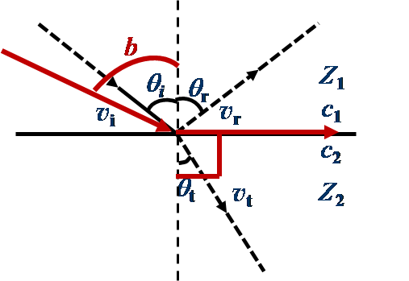

超声波透射定律$\frac{\sin{\theta_i}}{\sin{\theta_t}}=\frac{u_1}{u_2}$
若u1<u2（即Z1>Z2，p相等），则存在全反射临界角$b=\sin^{-1}{\frac{u_1}{u_2}}$

由于b的存在，实际使用中**探头探测角度不超过24°**
为了减少信号强度损失和避免**透射伪像**和全反射（对诊断无意义）

**透射系数**
$t_p=\frac{p_t}{p_i}=\frac{2Z_2\cos{\theta_i}}{Z_1\cos{\theta_t}+Z_2\cos{\theta_r}}$
当声波垂直入射时，$t_p=\frac{2Z_2}{Z_2+Z_1}$

* Z1>>Z2，强烈反射，无透射
* Z1=Z2，全部透射
* Z2>>Z1，Z1界面产生驻波，强烈的反射

**声影**
障碍物太大，衍射无法完全绕开，其后存在声波不能到达的空间，图像上表现为暗区（探测不到的盲区）

**与波长相仿的病灶探测不到**，因为衍射可以完全绕过
不形成反射回波，故没有病灶轮廓图像
但是可能存在反向散射，可判定病灶性质（脂肪肝等）

**散射**
障碍线度d小于或接近波长，传播方向连续改变

* d>>λ，散射不明显，主要是反射、透射，有声影
* d<<λ，散射明显，散射场强度均匀分布，散射声强**与入射波频率四次方成反比**
* d=λ，散射场分布角分布，散射声强**与入射波频率四次方成反比**，与距离平方反比

**多普勒效应**

* 波源不动，观察者动

$f_R=\frac{u_R}{\lambda_R}$，这里只有u变了，$u_R=u+v_R,f_R=\frac{u+v_R}{u}\cdot f_0$

* 波源动，观察者不动

$f_R=\frac{u_R}{\lambda_R}$，这里只有λ变了，相邻的波峰之间间隔为λ，则$\lambda_R=\lambda-T\cdot v_s,f_R=\frac{u}{u-v_s}\cdot f_0$

* 都动

综合一下，$f_R=\frac{u+v_R}{u-v_s}\cdot f_0$

如果波源与观察者运动之间有角度，用连线方向的速度计算

**多普勒频移公式（测血流速度的原理）**
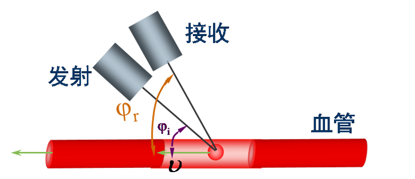

第一次，发射器为波源，血细胞为接收者，有$f_1=\frac{u+v\cos{\varphi_i}}{u}f_0$
第二次，发射器为接收者，血细胞为波源，有$f_2=\frac{u}{u-v\cos{\varphi_r}}f_1$
$\therefore f_2=\frac{u+v\cos{\varphi_i}}{u-v\cos{\varphi_r}}f_0=\frac{(u+v\cos{\varphi_r})(u+v\cos{\varphi_i})}{u^2-v^2\cos^2{\varphi_r}}f_0$
由于$u^2>>v^2$，得到$f_2=[1+\frac{v}{u}(\cos{\varphi_i}+\cos{\varphi_r})]f_0\Rightarrow\Delta f=f_d=\frac{v}{u}(\cos{\varphi_i}+\cos{\varphi_r})f_0$
由于$f_0,u,\varphi_i,\varphi_r$都是定值，则$f_d$和v的关系就有了，用fd可以求v
进一步，若$\varphi_i=\varphi_r=\varphi$，则$f_d=\frac{2v\cos{\varphi}}{u}f_0$
若fd>0，则血液流向探头；当u，v平行时，fd最大

**测量高速血流使用低频探头**，因为探测器的接收频率有限

**反射回波**
人体脏器的声音特性不同，界面上产生反射回波，携带位置信息

**散射回波**
声波被组织散射，主要携带组织的细微结构信息

**超声成像的信息主要由反射回波和散射回波携带**

### 11.2 几种超声成像

**三个物理假定**

1. 声束在介质中沿直线传播：估计方位
2. 各介质中声速均一：估计层面深度
3. 各介质中介质的吸收系数均一：确定增益补偿等

**脉冲回波测距**
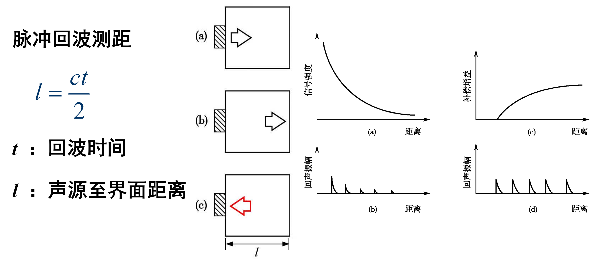

**A型超声成像**
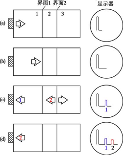

幅度调制回波
脉冲波表示**反射回波**
幅度表示强度，横轴表示接收到的时间，反应**界面的深度**或界面**之间的距离**

**M型超声成像**
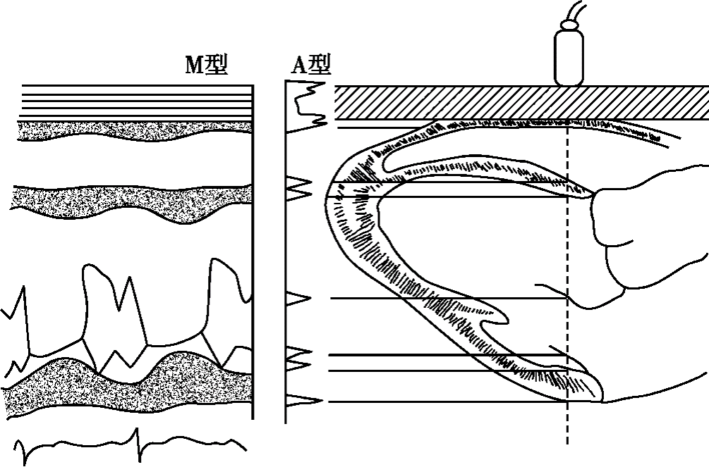

辉度调制回波，用光点显示回波，光点强弱表示回波幅值大小
在垂直扫描线的多个界面的回波形成一系列垂直亮点
横轴为时间轴，将某一层面按时间变化展开，反应**反射界面位置和回波强度随时间的变化**

**B型超声成像**
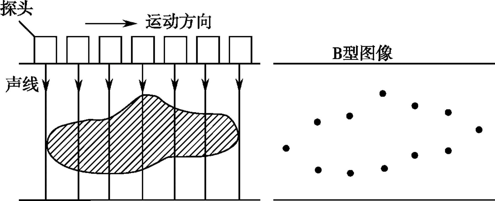

辉度调制回波，光点强弱表示信号幅度
快速移动声束线，得到不同层面的界面信息，合并后成为二维图像
可以连续不断扫描，得到动态图像

**三者差别**
A型是单个层面的一维信息；M型是单个层面的一维信息随时间的变化；B型是多个层面的二维信息，可以随时间变化

**B超图像质量评价**

* 横向分辨率

  是超声束垂直方向的分辨率，超声束越窄，横向分辨率越高

* 轴向分辨率

  两个界面不重合，则$d>\frac{1}{2} u\tau$，其中τ是取样脉宽，τ越小，轴向分辨率越高

**彩色多普勒血流仪**可以获得二维切面内所有的血流信息